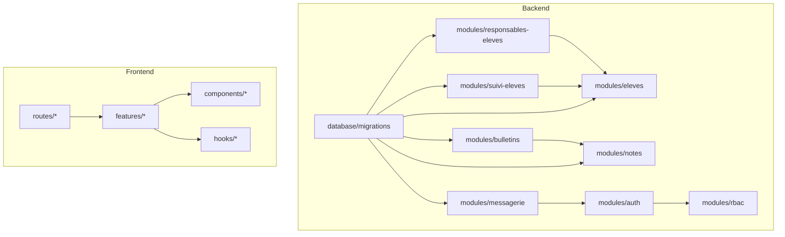
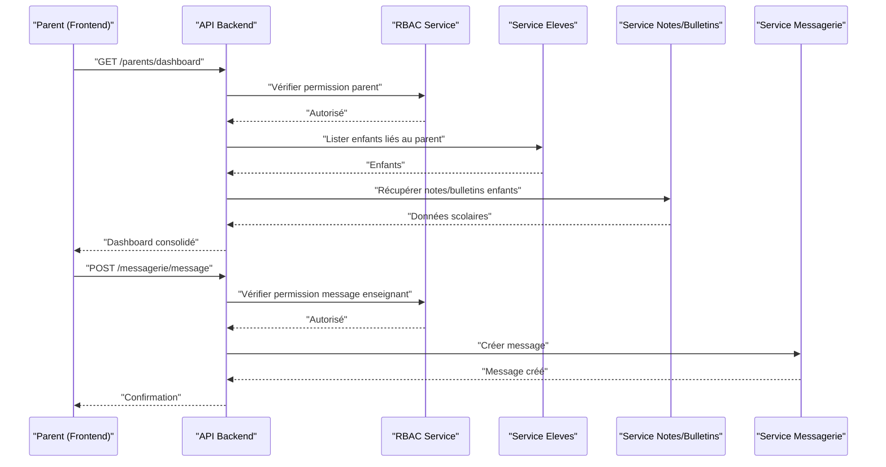
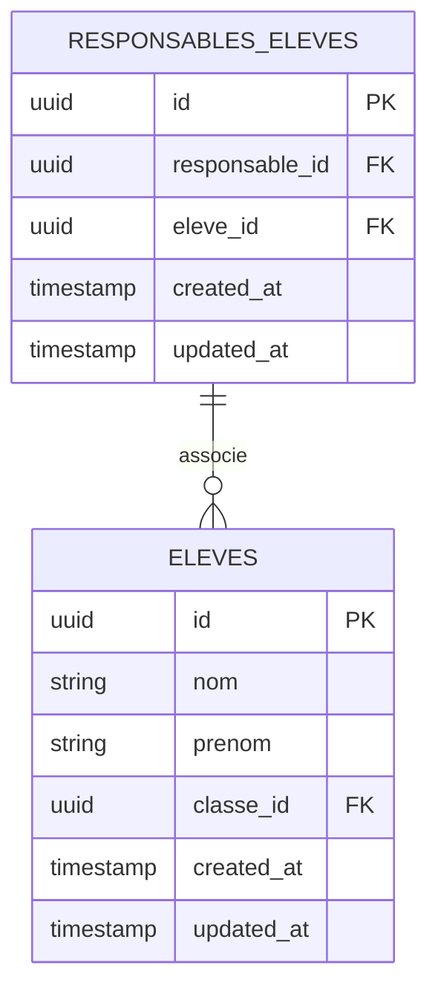
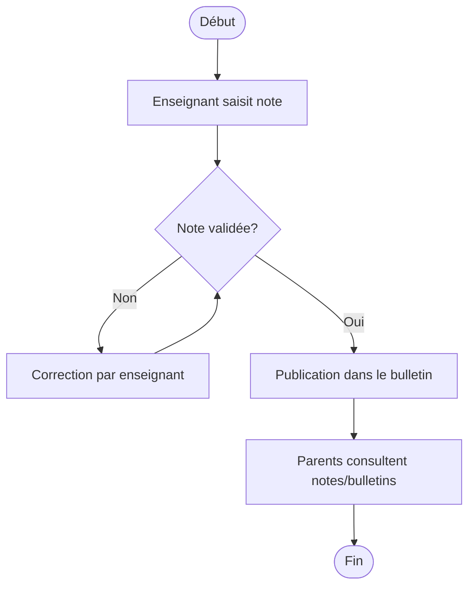
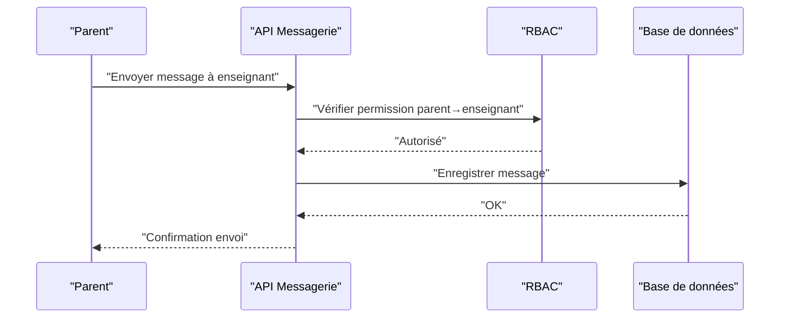
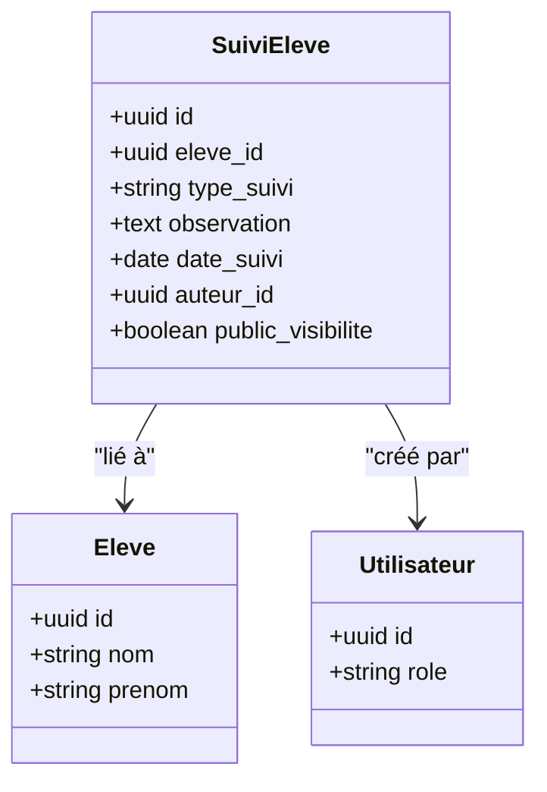
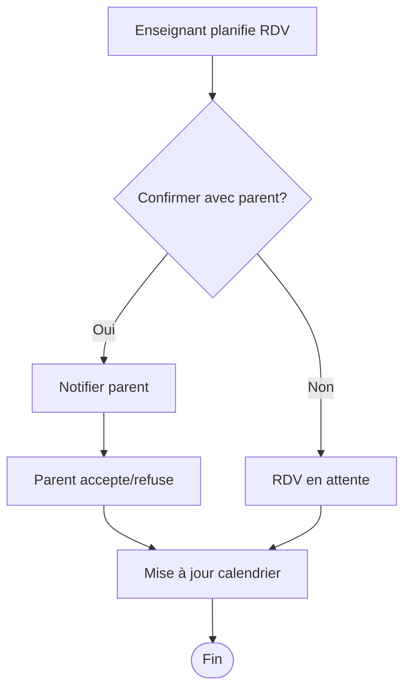
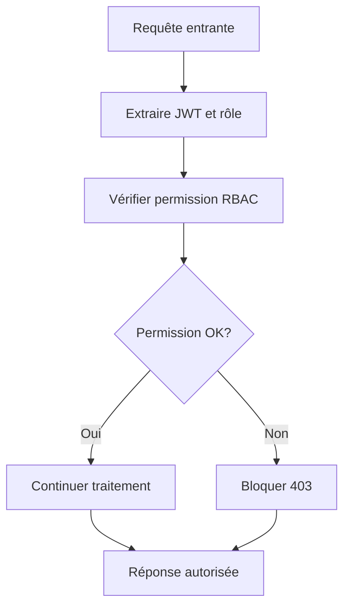
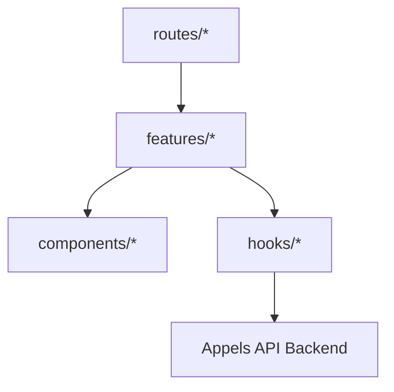
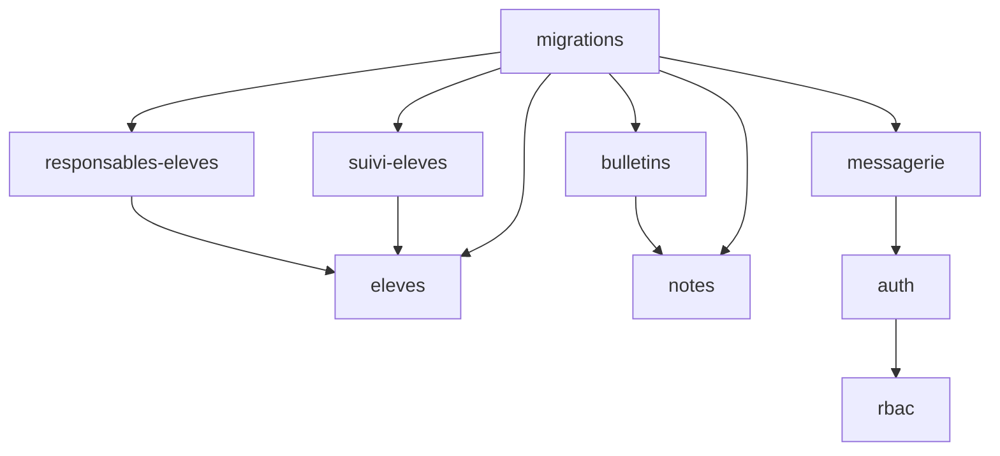

# Portails Parents et Enseignants

<cite>
**Fichiers référencés dans ce document**
- [backend/src/modules/responsables-eleves/](file://backend/src/modules/responsables-eleves/)
- [backend/src/modules/eleves/](file://backend/src/modules/eleves/)
- [backend/src/modules/bulletins/](file://backend/src/modules/bulletins/)
- [backend/src/modules/notes/](file://backend/src/modules/notes/)
- [backend/src/modules/messagerie/](file://backend/src/modules/messagerie/)
- [backend/src/modules/suivi-eleves/](file://backend/src/modules/suivi-eleves/)
- [backend/src/modules/auth/](file://backend/src/modules/auth/)
- [backend/src/modules/rbac/](file://backend/src/modules/rbac/)
- [backend/database/migrations/052-approche-hybride-parents.sql](file://backend/database/migrations/052-approche-hybride-parents.sql)
- [backend/database/migrations/123-refonte-notes-bulletins.sql](file://backend/database/migrations/123-refonte-notes-bulletins.sql)
- [backend/database/migrations/043-module-messagerie-complete.sql](file://backend/database/migrations/043-module-messagerie-complete.sql)
- [backend/database/migrations/030-suivi-eleves.sql](file://backend/database/migrations/030-suivi-eleves.sql)
- [frontend/src/routes/](file://frontend/src/routes/)
- [frontend/src/features/](file://frontend/src/features/)
- [frontend/src/components/](file://frontend/src/components/)
- [frontend/src/hooks/](file://frontend/src/hooks/)
- [docs/guards-exemples-implémentation.ts](file://docs/guards-exemples-implémentation.ts)
- [docs/guide-implémentation-permissions.ts](file://docs/guide-implémentation-permissions.ts)
</cite>

## Table des matières
1. [Introduction](#introduction)
2. [Structure du projet](#structure-du-projet)
3. [Composants clés](#composants-clés)
4. [Vue d’ensemble de l’architecture](#vue-densemble-de-larchitecture)
5. [Analyse détaillée des composants](#analyse-detaillee-des-composants)
6. [Analyse des dépendances](#analyse-des-dependances)
7. [Considérations de performance](#considerations-de-performance)
8. [Guide de dépannage](#guide-de-depannage)
9. [Conclusion](#conclusion)
10. [Annexes](#annexes)

## Introduction
Ce document présente une documentation complète des portails parents et enseignants d’eLISAschool. Il détaille les rôles et permissions, les interfaces dédiées, les flux de travail académiques, ainsi que la modélisation et les relations autour de l’entité ResponsableEleve. Il inclut également des exemples d’implémentation des guards de permission, les schémas de base de données pertinents, et les composants React associés aux interfaces spécialisées. Les fonctionnalités avancées telles que les rendez-vous en ligne, les suivis personnalisés et les rapports d’activité scolaire sont explicitement couvertes.

## Structure du projet
Le codebase est organisé en modules backend par domaine (responsables-eleves, eleves, bulletins, notes, messagerie, suivi-eleves, auth, rbac), avec des migrations SQL dédiées pour chaque évolution du schéma. Le frontend expose des routes et des features frontales correspondant aux portails parents et enseignants, avec des hooks et des composants réutilisables.

[Ce diagramme illustre la structure logique sans mappage direct à des fichiers spécifiques]

## Composants clés
- Entité ResponsableEleve : définit le lien entre un responsable légal et un ou plusieurs élèves, avec des champs additionnels et des règles d’accès.
- Portail Parents : accès aux notes, bulletins, messagerie avec enseignants, suivi personnalisé, rendez-vous en ligne et rapports d’activité scolaire.
- Portail Enseignants : saisie et validation des notes, communication avec responsables, suivi des élèves, planification de rendez-vous.
- RBAC et Auth : gestion fine des permissions et authentification multi-mode, garantissant l’isolement tenant et le contrôle d’accès par rôle.

**Section sources**
- [backend/src/modules/responsables-eleves/](file://backend/src/modules/responsables-eleves/)
- [backend/src/modules/eleves/](file://backend/src/modules/eleves/)
- [backend/src/modules/bulletins/](file://backend/src/modules/bulletins/)
- [backend/src/modules/notes/](file://backend/src/modules/notes/)
- [backend/src/modules/messagerie/](file://backend/src/modules/messagerie/)
- [backend/src/modules/suivi-eleves/](file://backend/src/modules/suivi-eleves/)
- [backend/src/modules/auth/](file://backend/src/modules/auth/)
- [backend/src/modules/rbac/](file://backend/src/modules/rbac/)

## Vue d’ensemble de l’architecture
Les portails parents et enseignants s’appuient sur un modèle RBAC strict, des services métier par module, et des endpoints REST sécurisés. Les données sont structurées via des migrations SQL qui définissent les entités et leurs relations. Le frontend utilise des routes TanStack Router et des features frontales pour exposer les interfaces adaptées aux rôles.

**Diagram sources**
- [backend/src/modules/auth/](file://backend/src/modules/auth/)
- [backend/src/modules/rbac/](file://backend/src/modules/rbac/)
- [backend/src/modules/eleves/](file://backend/src/modules/eleves/)
- [backend/src/modules/notes/](file://backend/src/modules/notes/)
- [backend/src/modules/bulletins/](file://backend/src/modules/bulletins/)
- [backend/src/modules/messagerie/](file://backend/src/modules/messagerie/)

## Analyse détaillée des composants

### Entité ResponsableEleve et relations
ResponsableEleve lie un utilisateur responsable à un élève, permettant l’accès aux données scolaires de ses enfants. Les relations incluent :
- Responsables → Élèves (un responsable peut avoir plusieurs élèves)
- Accès aux notes et bulletins filtrés par enfant lié
- Communication avec enseignants assignés aux classes des enfants

**Diagram sources**
- [backend/database/migrations/052-approche-hybride-parents.sql](file://backend/database/migrations/052-approche-hybride-parents.sql)
- [backend/src/modules/responsables-eleves/](file://backend/src/modules/responsables-eleves/)
- [backend/src/modules/eleves/](file://backend/src/modules/eleves/)

**Section sources**
- [backend/src/modules/responsables-eleves/](file://backend/src/modules/responsables-eleves/)
- [backend/src/modules/eleves/](file://backend/src/modules/eleves/)
- [backend/database/migrations/052-approche-hybride-parents.sql](file://backend/database/migrations/052-approche-hybride-parents.sql)

### Flux de travail académique : notes et bulletins
Les enseignants saisissent et valident les notes ; les parents consultent les notes et bulletins de leurs enfants. Le processus suit un workflow de validation et de clôture de période.

**Diagram sources**
- [backend/src/modules/notes/](file://backend/src/modules/notes/)
- [backend/src/modules/bulletins/](file://backend/src/modules/bulletins/)
- [backend/database/migrations/123-refonte-notes-bulletins.sql](file://backend/database/migrations/123-refonte-notes-bulletins.sql)

**Section sources**
- [backend/src/modules/notes/](file://backend/src/modules/notes/)
- [backend/src/modules/bulletins/](file://backend/src/modules/bulletins/)
- [backend/database/migrations/123-refonte-notes-bulletins.sql](file://backend/database/migrations/123-refonte-notes-bulletins.sql)

### Communications avec les enseignants
La messagerie permet aux parents et enseignants d’échanger des messages sécurisés, avec contrôle d’accès par rôle et contexte d’établissement.

**Diagram sources**
- [backend/src/modules/messagerie/](file://backend/src/modules/messagerie/)
- [backend/database/migrations/043-module-messagerie-complete.sql](file://backend/database/migrations/043-module-messagerie-complete.sql)

**Section sources**
- [backend/src/modules/messagerie/](file://backend/src/modules/messagerie/)
- [backend/database/migrations/043-module-messagerie-complete.sql](file://backend/database/migrations/043-module-messagerie-complete.sql)

### Suivi personnalisé et rapports d’activité scolaire
Le module suivi-eleves permet de consigner des observations, objectifs et progrès par élève, accessibles aux enseignants et aux parents autorisés.

**Diagram sources**
- [backend/src/modules/suivi-eleves/](file://backend/src/modules/suivi-eleves/)
- [backend/database/migrations/030-suivi-eleves.sql](file://backend/database/migrations/030-suivi-eleves.sql)

**Section sources**
- [backend/src/modules/suivi-eleves/](file://backend/src/modules/suivi-eleves/)
- [backend/database/migrations/030-suivi-eleves.sql](file://backend/database/migrations/030-suivi-eleves.sql)

### Rendez-vous en ligne
Les enseignants peuvent planifier des rendez-vous avec les parents, visibles dans le calendrier partagé et accessibles selon les permissions.

[Ce diagramme montre un flux conceptuel non mappé directement à des fichiers spécifiques]

### Exemples d’implémentation des guards de permission
Les guards vérifient les permissions avant d’exposer les routes ou les données sensibles. Ils s’appuient sur le système RBAC et le contexte utilisateur.

**Section sources**
- [docs/guards-exemples-implémentation.ts](file://docs/guards-exemples-implémentation.ts)
- [docs/guide-implémentation-permissions.ts](file://docs/guide-implémentation-permissions.ts)
- [backend/src/modules/auth/](file://backend/src/modules/auth/)
- [backend/src/modules/rbac/](file://backend/src/modules/rbac/)

### Interfaces React spécialisées
Les interfaces parents et enseignants sont construites avec des routes TanStack, des features frontales, et des composants réutilisables. Les hooks gèrent l’état et les appels API.

[Ce diagramme illustre la structure frontend sans mappage direct à des fichiers spécifiques]

**Section sources**
- [frontend/src/routes/](file://frontend/src/routes/)
- [frontend/src/features/](file://frontend/src/features/)
- [frontend/src/components/](file://frontend/src/components/)
- [frontend/src/hooks/](file://frontend/src/hooks/)

## Analyse des dépendances
Les modules backend dépendent des migrations SQL pour la structure de données et du RBAC pour les permissions. Le frontend dépend des routes et features pour l’interface utilisateur.

**Diagram sources**
- [backend/src/modules/responsables-eleves/](file://backend/src/modules/responsables-eleves/)
- [backend/src/modules/eleves/](file://backend/src/modules/eleves/)
- [backend/src/modules/bulletins/](file://backend/src/modules/bulletins/)
- [backend/src/modules/notes/](file://backend/src/modules/notes/)
- [backend/src/modules/messagerie/](file://backend/src/modules/messagerie/)
- [backend/src/modules/suivi-eleves/](file://backend/src/modules/suivi-eleves/)
- [backend/src/modules/auth/](file://backend/src/modules/auth/)
- [backend/src/modules/rbac/](file://backend/src/modules/rbac/)
- [backend/database/migrations/](file://backend/database/migrations/)

**Section sources**
- [backend/src/modules/responsables-eleves/](file://backend/src/modules/responsables-eleves/)
- [backend/src/modules/eleves/](file://backend/src/modules/eleves/)
- [backend/src/modules/bulletins/](file://backend/src/modules/bulletins/)
- [backend/src/modules/notes/](file://backend/src/modules/notes/)
- [backend/src/modules/messagerie/](file://backend/src/modules/messagerie/)
- [backend/src/modules/suivi-eleves/](file://backend/src/modules/suivi-eleves/)
- [backend/src/modules/auth/](file://backend/src/modules/auth/)
- [backend/src/modules/rbac/](file://backend/src/modules/rbac/)
- [backend/database/migrations/](file://backend/database/migrations/)

## Considérations de performance
- Indexation des tables critiques (notes, bulletins, messagerie) pour accélérer les requêtes fréquentes.
- Pagination et filtrage côté serveur pour les listes d’élèves et de communications.
- Mise en cache des données statiques (bulletins clôturés) pour réduire la charge.
- Optimisation des jointures dans les requêtes liées à ResponsableEleve et Eleves.

[Pas de sources nécessaires car cette section fournit des conseils généraux]

## Guide de dépannage
- Erreurs 403 : vérifier les permissions RBAC et les guards frontend/backend.
- Problèmes d’accès aux notes/bulletins : vérifier la relation ResponsableEleve et les filtres par élève.
- Messages non envoyés : contrôler les permissions de messagerie et les états de session.
- Suivi inaccessible : valider les droits d’auteur et la visibilité publique des suivis.

**Section sources**
- [backend/src/modules/auth/](file://backend/src/modules/auth/)
- [backend/src/modules/rbac/](file://backend/src/modules/rbac/)
- [backend/src/modules/messagerie/](file://backend/src/modules/messagerie/)
- [backend/src/modules/suivi-eleves/](file://backend/src/modules/suivi-eleves/)

## Conclusion
Les portails parents et enseignants d’eLISAschool offrent un cadre robuste et sécurisé pour la gestion académique, basé sur un modèle RBAC strict, des entités bien structurées (notamment ResponsableEleve), et des interfaces React intuitives. Les fonctionnalités avancées comme les rendez-vous en ligne, les suivis personnalisés et les rapports d’activité scolaire renforcent l’expérience utilisateur et la collaboration école-famille.

[Pas de sources nécessaires car cette section résume sans analyser de fichiers spécifiques]

## Annexes
- Schémas de base de données : consulter les migrations SQL pour les détails des tables et contraintes.
- Exemples de guards : se référer aux fichiers TypeScript fournis dans docs/.
- Intégration frontend : explorer les routes et features pour adapter les interfaces aux besoins spécifiques.

**Section sources**
- [backend/database/migrations/](file://backend/database/migrations/)
- [docs/guards-exemples-implémentation.ts](file://docs/guards-exemples-implémentation.ts)
- [docs/guide-implémentation-permissions.ts](file://docs/guide-implémentation-permissions.ts)
- [frontend/src/routes/](file://frontend/src/routes/)
- [frontend/src/features/](file://frontend/src/features/)