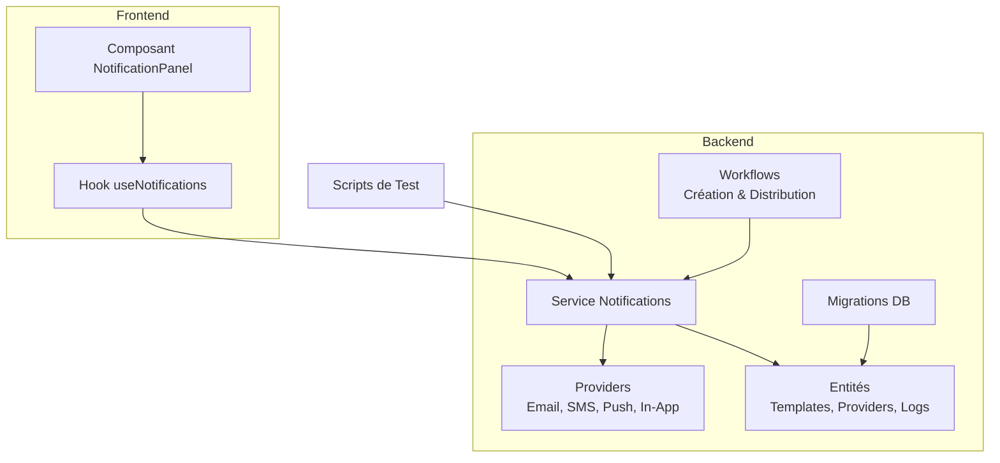
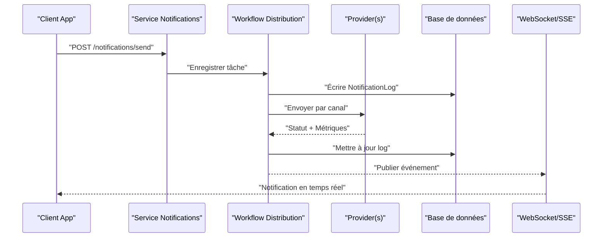
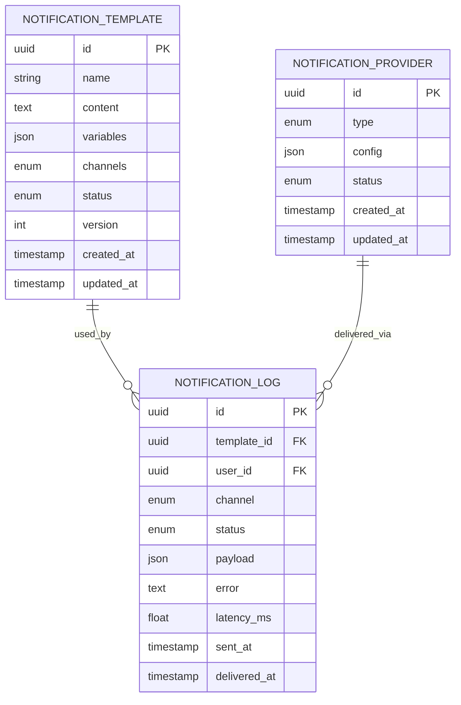
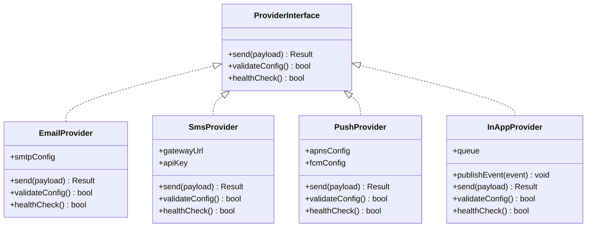
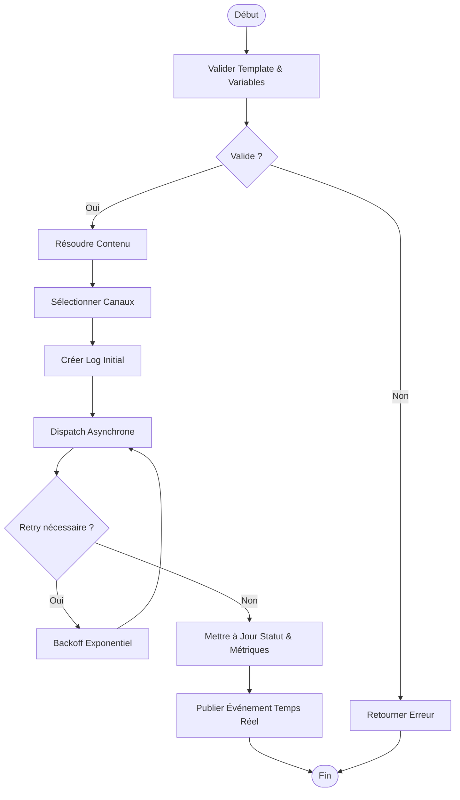
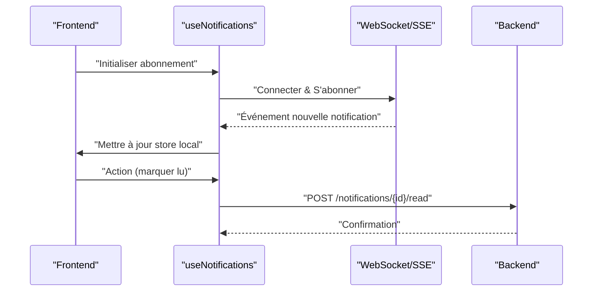
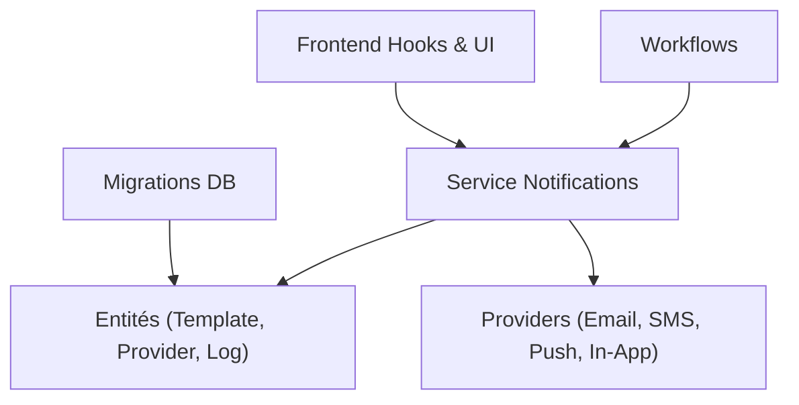

# Système de Notifications

<cite>
**Fichiers référencés dans ce document**
- [backend/src/modules/notifications/entities/notification-template.entity.ts](file://backend/src/modules/notifications/entities/notification-template.entity.ts)
- [backend/src/modules/notifications/entities/notification-provider.entity.ts](file://backend/src/modules/notifications/entities/notification-provider.entity.ts)
- [backend/src/modules/notifications/entities/notification-log.entity.ts](file://backend/src/modules/notifications/entities/notification-log.entity.ts)
- [backend/src/modules/notifications/services/notification.service.ts](file://backend/src/modules/notifications/services/notification.service.ts)
- [backend/src/modules/notifications/providers/email.provider.ts](file://backend/src/modules/notifications/providers/email.provider.ts)
- [backend/src/modules/notifications/providers/sms.provider.ts](file://backend/src/modules/notifications/providers/sms.provider.ts)
- [backend/src/modules/notifications/providers/push.provider.ts](file://backend/src/modules/notifications/providers/push.provider.ts)
- [backend/src/modules/notifications/providers/in-app.provider.ts](file://backend/src/modules/notifications/providers/in-app.provider.ts)
- [backend/src/modules/notifications/workflows/create-notification.workflow.ts](file://backend/src/modules/notifications/workflows/create-notification.workflow.ts)
- [backend/src/modules/notifications/workflows/distribute-notification.workflow.ts](file://backend/src/modules/notifications/workflows/distribute-notification.workflow.ts)
- [backend/database/migrations/047-notifications-ameliorations.sql](file://backend/database/migrations/047-notifications-ameliorations.sql)
- [backend/database/migrations/048-notifications-performance-optimizations.sql](file://backend/database/migrations/048-notifications-performance-optimizations.sql)
- [frontend/src/hooks/useNotifications.ts](file://frontend/src/hooks/useNotifications.ts)
- [frontend/src/features/notifications/components/NotificationPanel.tsx](file://frontend/src/features/notifications/components/NotificationPanel.tsx)
- [scripts/test-notification-api.sh](file://scripts/test-notification-api.sh)
- [scripts/test-notification-providers.sh](file://scripts/test-notification-providers.sh)
</cite>

## Table des matières
1. [Introduction](#introduction)
2. [Structure du projet](#structure-du-projet)
3. [Composants principaux](#composants-principaux)
4. [Vue d'ensemble de l'architecture](#vue-densemble-de-larchitecture)
5. [Analyse détaillée des composants](#analyse-detaillee-des-composants)
6. [Analyse des dépendances](#analyse-des-dependances)
7. [Considérations de performance](#considerations-de-performance)
8. [Guide de dépannage](#guide-de-depannage)
9. [Conclusion](#conclusion)
10. [Annexes](#annexes)

## Introduction
Ce document présente le système de notifications multi-canaux d'eLISAschool. Il couvre les providers (email, SMS, push, in-app), les templates de messages, les règles de déclenchement et les préférences utilisateurs. Il détaille les entités NotificationTemplate, NotificationProvider et NotificationLog, ainsi que les workflows de création et distribution. Des exemples d’implémentation de providers personnalisés, les schémas de base de données, les hooks React pour la gestion en temps réel, et les fonctionnalités avancées (files d’attente, retries, analytics d’engagement, tests de livraison) sont également documentés.

## Structure du projet
Le module de notifications est organisé par responsabilités claires :
- Entités : modèles de données persistés (templates, providers, logs).
- Providers : implémentations concrètes par canal (email, SMS, push, in-app).
- Services : orchestration de la logique métier (validation, routage, persistance).
- Workflows : séquences d’étapes reproductibles pour créer et distribuer une notification.
- Frontend : hooks et composants pour afficher et interagir avec les notifications en temps réel.
- Migrations : schémas de base de données et optimisations.
- Scripts de test : validation des endpoints et des providers.

[No sources needed since this diagram shows conceptual workflow, not actual code structure]

## Composants principaux
- Entités
  - NotificationTemplate : définit le contenu, le contexte et les canaux cibles d’un message réutilisable.
  - NotificationProvider : décrit un canal de livraison (email, SMS, push, in-app) et ses paramètres.
  - NotificationLog : journalisation de chaque tentative de livraison, statut, erreurs et métriques.
- Providers
  - EmailProvider : envoi via SMTP ou API email.
  - SmsProvider : envoi via gateway SMS.
  - PushProvider : envoi via APNs/FCM.
  - InAppProvider : insertion dans la file interne et diffusion WebSocket/SSE.
- Service Notifications
  - Validation des payloads, résolution du template, sélection du provider, dispatch asynchrone, écriture du log.
- Workflows
  - Création : construction de la notification à partir d’un template et de variables contextuelles.
  - Distribution : routage vers les providers, files d’attente, retries, tracking.
- Frontend
  - Hook useNotifications : écoute des événements temps réel, mise à jour locale, actions (marquer lu, supprimer).
  - Composant NotificationPanel : interface utilisateur pour consulter et gérer les notifications.

**Section sources**
- [backend/src/modules/notifications/entities/notification-template.entity.ts](file://backend/src/modules/notifications/entities/notification-template.entity.ts)
- [backend/src/modules/notifications/entities/notification-provider.entity.ts](file://backend/src/modules/notifications/entities/notification-provider.entity.ts)
- [backend/src/modules/notifications/entities/notification-log.entity.ts](file://backend/src/modules/notifications/entities/notification-log.entity.ts)
- [backend/src/modules/notifications/services/notification.service.ts](file://backend/src/modules/notifications/services/notification.service.ts)
- [backend/src/modules/notifications/providers/email.provider.ts](file://backend/src/modules/notifications/providers/email.provider.ts)
- [backend/src/modules/notifications/providers/sms.provider.ts](file://backend/src/modules/notifications/providers/sms.provider.ts)
- [backend/src/modules/notifications/providers/push.provider.ts](file://backend/src/modules/notifications/providers/push.provider.ts)
- [backend/src/modules/notifications/providers/in-app.provider.ts](file://backend/src/modules/notifications/providers/in-app.provider.ts)
- [backend/src/modules/notifications/workflows/create-notification.workflow.ts](file://backend/src/modules/notifications/workflows/create-notification.workflow.ts)
- [backend/src/modules/notifications/workflows/distribute-notification.workflow.ts](file://backend/src/modules/notifications/workflows/distribute-notification.workflow.ts)
- [frontend/src/hooks/useNotifications.ts](file://frontend/src/hooks/useNotifications.ts)
- [frontend/src/features/notifications/components/NotificationPanel.tsx](file://frontend/src/features/notifications/components/NotificationPanel.tsx)

## Vue d'ensemble de l'architecture
Le système suit un pattern orienté services et plugins :
- Le service central coordonne les étapes de création et distribution.
- Les providers implémentent une interface commune pour envoyer des notifications.
- Les workflows encapsulent les séquences complexes et garantissent la cohérence.
- La persistance est assurée par les entités et les migrations SQL.
- Le frontend s’abonne aux événements temps réel pour mettre à jour l’interface.

**Diagram sources**
- [backend/src/modules/notifications/services/notification.service.ts](file://backend/src/modules/notifications/services/notification.service.ts)
- [backend/src/modules/notifications/workflows/distribute-notification.workflow.ts](file://backend/src/modules/notifications/workflows/distribute-notification.workflow.ts)
- [backend/src/modules/notifications/providers/email.provider.ts](file://backend/src/modules/notifications/providers/email.provider.ts)
- [backend/src/modules/notifications/providers/sms.provider.ts](file://backend/src/modules/notifications/providers/sms.provider.ts)
- [backend/src/modules/notifications/providers/push.provider.ts](file://backend/src/modules/notifications/providers/push.provider.ts)
- [backend/src/modules/notifications/providers/in-app.provider.ts](file://backend/src/modules/notifications/providers/in-app.provider.ts)

## Analyse détaillée des composants

### Entités et schémas de base de données
- NotificationTemplate
  - Champs clés : identifiant, nom, contenu, variables, canaux autorisés, état (actif/inactif), versioning.
  - Complexité : accès fréquent aux templates actifs ; index sur état et version.
- NotificationProvider
  - Champs clés : identifiant, type (email/sms/push/in-app), configuration (URL, tokens, options), statut.
  - Complexité : rotation de configurations ; vérification de disponibilité.
- NotificationLog
  - Champs clés : identifiant, templateId, userId, channel, statut, payload, erreur, timestamps, métriques.
  - Index : composite sur userId, statut, createdAt pour requêtes de suivi.

**Diagram sources**
- [backend/database/migrations/047-notifications-ameliorations.sql](file://backend/database/migrations/047-notifications-ameliorations.sql)
- [backend/database/migrations/048-notifications-performance-optimizations.sql](file://backend/database/migrations/048-notifications-performance-optimizations.sql)

**Section sources**
- [backend/src/modules/notifications/entities/notification-template.entity.ts](file://backend/src/modules/notifications/entities/notification-template.entity.ts)
- [backend/src/modules/notifications/entities/notification-provider.entity.ts](file://backend/src/modules/notifications/entities/notification-provider.entity.ts)
- [backend/src/modules/notifications/entities/notification-log.entity.ts](file://backend/src/modules/notifications/entities/notification-log.entity.ts)
- [backend/database/migrations/047-notifications-ameliorations.sql](file://backend/database/migrations/047-notifications-ameliorations.sql)
- [backend/database/migrations/048-notifications-performance-optimizations.sql](file://backend/database/migrations/048-notifications-performance-optimizations.sql)

### Providers de notification
Chaque provider implémente une interface commune :
- send(payload): Promise<boolean|Result>
- validateConfig(): boolean
- healthCheck(): Promise<boolean>

Exemples d’implémentation :
- EmailProvider : connexion SMTP, rendu du template HTML/texte, gestion des pièces jointes.
- SmsProvider : appel API SMS, formatage du numéro, limites de caractères.
- PushProvider : token device, payload APNs/FCM, gestion des erreurs réseau.
- InAppProvider : insertion dans la file interne, publication d’événements temps réel.

**Diagram sources**
- [backend/src/modules/notifications/providers/email.provider.ts](file://backend/src/modules/notifications/providers/email.provider.ts)
- [backend/src/modules/notifications/providers/sms.provider.ts](file://backend/src/modules/notifications/providers/sms.provider.ts)
- [backend/src/modules/notifications/providers/push.provider.ts](file://backend/src/modules/notifications/providers/push.provider.ts)
- [backend/src/modules/notifications/providers/in-app.provider.ts](file://backend/src/modules/notifications/providers/in-app.provider.ts)

**Section sources**
- [backend/src/modules/notifications/providers/email.provider.ts](file://backend/src/modules/notifications/providers/email.provider.ts)
- [backend/src/modules/notifications/providers/sms.provider.ts](file://backend/src/modules/notifications/providers/sms.provider.ts)
- [backend/src/modules/notifications/providers/push.provider.ts](file://backend/src/modules/notifications/providers/push.provider.ts)
- [backend/src/modules/notifications/providers/in-app.provider.ts](file://backend/src/modules/notifications/providers/in-app.provider.ts)

### Workflows de création et distribution
- Workflow de création
  - Validation du template et des variables.
  - Résolution du contenu final.
  - Sélection des canaux selon les préférences utilisateur et les règles.
- Workflow de distribution
  - Enregistrement du log initial.
  - Dispatch asynchrone vers les providers.
  - Gestion des retries exponentiels.
  - Mise à jour du statut et des métriques.
  - Publication d’événements temps réel.

**Diagram sources**
- [backend/src/modules/notifications/workflows/create-notification.workflow.ts](file://backend/src/modules/notifications/workflows/create-notification.workflow.ts)
- [backend/src/modules/notifications/workflows/distribute-notification.workflow.ts](file://backend/src/modules/notifications/workflows/distribute-notification.workflow.ts)

**Section sources**
- [backend/src/modules/notifications/workflows/create-notification.workflow.ts](file://backend/src/modules/notifications/workflows/create-notification.workflow.ts)
- [backend/src/modules/notifications/workflows/distribute-notification.workflow.ts](file://backend/src/modules/notifications/workflows/distribute-notification.workflow.ts)

### Préférences utilisateurs et règles de déclenchement
- Préférences utilisateur
  - Choix des canaux activés (email, SMS, push, in-app).
  - Fréquence maximale et fenêtres de silence.
  - Filtres par type de notification et priorité.
- Règles de déclenchement
  - Événements système (inscription, paiement, changement de statut).
  - Rôles et permissions (ciblage par groupe).
  - Priorités et délais (différé, immédiat, batch).

**Section sources**
- [backend/src/modules/notifications/services/notification.service.ts](file://backend/src/modules/notifications/services/notification.service.ts)

### Hooks React pour la gestion en temps réel
- useNotifications
  - Abonnement aux événements WebSocket/SSE.
  - Mise à jour locale du store.
  - Actions : marquer comme lu, supprimer, archiver.
- NotificationPanel
  - Affichage trié par date et priorité.
  - Actions rapides et filtres.
  - Indicateurs de lecture et compteur.

**Diagram sources**
- [frontend/src/hooks/useNotifications.ts](file://frontend/src/hooks/useNotifications.ts)
- [frontend/src/features/notifications/components/NotificationPanel.tsx](file://frontend/src/features/notifications/components/NotificationPanel.tsx)

**Section sources**
- [frontend/src/hooks/useNotifications.ts](file://frontend/src/hooks/useNotifications.ts)
- [frontend/src/features/notifications/components/NotificationPanel.tsx](file://frontend/src/features/notifications/components/NotificationPanel.tsx)

### Fonctionnalités avancées
- Files d’attente
  - Utilisation d’une file interne pour découpler création et livraison.
  - Priorisation par niveau d’urgence.
- Retries
  - Backoff exponentiel avec limite de tentatives.
  - Journalisation des échecs et alertes.
- Analytics d’engagement
  - Mesures de latence, taux de délivrabilité, ouvertures, clics.
  - Agrégation par canal et par campagne.
- Tests de livraison
  - Scripts pour valider endpoints et providers.
  - Scénarios de charge et de résilience.

**Section sources**
- [backend/src/modules/notifications/services/notification.service.ts](file://backend/src/modules/notifications/services/notification.service.ts)
- [scripts/test-notification-api.sh](file://scripts/test-notification-api.sh)
- [scripts/test-notification-providers.sh](file://scripts/test-notification-providers.sh)

## Analyse des dépendances
Le service de notifications dépend des entités et des providers. Les workflows encapsulent les appels au service et aux providers. Le frontend dépend du hook qui communique avec le backend via WebSocket/SSE.

**Diagram sources**
- [backend/src/modules/notifications/services/notification.service.ts](file://backend/src/modules/notifications/services/notification.service.ts)
- [backend/src/modules/notifications/entities/notification-template.entity.ts](file://backend/src/modules/notifications/entities/notification-template.entity.ts)
- [backend/src/modules/notifications/entities/notification-provider.entity.ts](file://backend/src/modules/notifications/entities/notification-provider.entity.ts)
- [backend/src/modules/notifications/entities/notification-log.entity.ts](file://backend/src/modules/notifications/entities/notification-log.entity.ts)
- [backend/src/modules/notifications/providers/email.provider.ts](file://backend/src/modules/notifications/providers/email.provider.ts)
- [backend/src/modules/notifications/providers/sms.provider.ts](file://backend/src/modules/notifications/providers/sms.provider.ts)
- [backend/src/modules/notifications/providers/push.provider.ts](file://backend/src/modules/notifications/providers/push.provider.ts)
- [backend/src/modules/notifications/providers/in-app.provider.ts](file://backend/src/modules/notifications/providers/in-app.provider.ts)
- [backend/database/migrations/047-notifications-ameliorations.sql](file://backend/database/migrations/047-notifications-ameliorations.sql)
- [backend/database/migrations/048-notifications-performance-optimizations.sql](file://backend/database/migrations/048-notifications-performance-optimizations.sql)

**Section sources**
- [backend/src/modules/notifications/services/notification.service.ts](file://backend/src/modules/notifications/services/notification.service.ts)
- [backend/src/modules/notifications/entities/notification-template.entity.ts](file://backend/src/modules/notifications/entities/notification-template.entity.ts)
- [backend/src/modules/notifications/entities/notification-provider.entity.ts](file://backend/src/modules/notifications/entities/notification-provider.entity.ts)
- [backend/src/modules/notifications/entities/notification-log.entity.ts](file://backend/src/modules/notifications/entities/notification-log.entity.ts)
- [backend/database/migrations/047-notifications-ameliorations.sql](file://backend/database/migrations/047-notifications-ameliorations.sql)
- [backend/database/migrations/048-notifications-performance-optimizations.sql](file://backend/database/migrations/048-notifications-performance-optimizations.sql)

## Considérations de performance
- Indexation
  - Composite sur userId, statut, createdAt pour les logs.
  - Index sur status et version pour les templates.
- Délai et throughput
  - Traitement asynchrone et files d’attente.
  - Limitation de débit par provider.
- Observabilité
  - Métriques de latence et taux d’erreur.
  - Alertes sur échecs répétés.

[No sources needed since this section provides general guidance]

## Guide de dépannage
- Problèmes courants
  - Échec de livraison : vérifier la configuration du provider et les logs d’erreur.
  - Retours 5xx : inspecter les timeouts et les quotas des fournisseurs externes.
  - Notifications non reçues : valider les préférences utilisateur et les filtres.
- Outils
  - Scripts de test pour endpoints et providers.
  - Consultation des logs dans NotificationLog.
  - Vérification de la santé des providers via healthCheck.

**Section sources**
- [backend/src/modules/notifications/entities/notification-log.entity.ts](file://backend/src/modules/notifications/entities/notification-log.entity.ts)
- [scripts/test-notification-api.sh](file://scripts/test-notification-api.sh)
- [scripts/test-notification-providers.sh](file://scripts/test-notification-providers.sh)

## Conclusion
Le système de notifications d’eLISAschool offre une architecture modulaire et extensible, avec des providers standardisés, des workflows robustes et une intégration temps réel côté frontend. Les entités bien structurées, les migrations optimisées et les scripts de test permettent une maintenance efficace et une montée en charge fiable. L’ajout de nouveaux canaux et la personnalisation des règles restent simples grâce à l’interface commune des providers et à la séparation claire des responsabilités.

[No sources needed since this section summarizes without analyzing specific files]

## Annexes
- Exemple d’ajout d’un provider personnalisé
  - Implémenter l’interface commune (send, validateConfig, healthCheck).
  - Enregistrer le provider dans le registry.
  - Ajouter les tests unitaires et d’intégration.
- Bonnes pratiques
  - Valider les payloads dès l’entrée.
  - Journaliser toutes les étapes critiques.
  - Utiliser des backoffs exponentiels et limiter les retries.
  - Surveiller les métriques et configurer des alertes.

[No sources needed since this section provides general guidance]