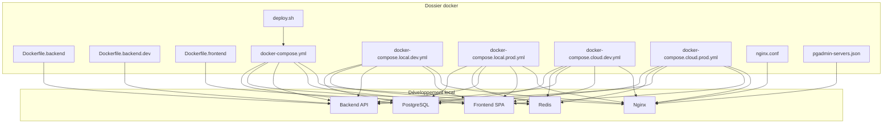
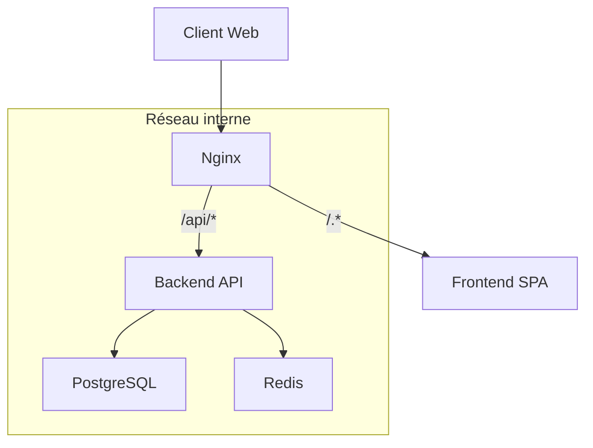
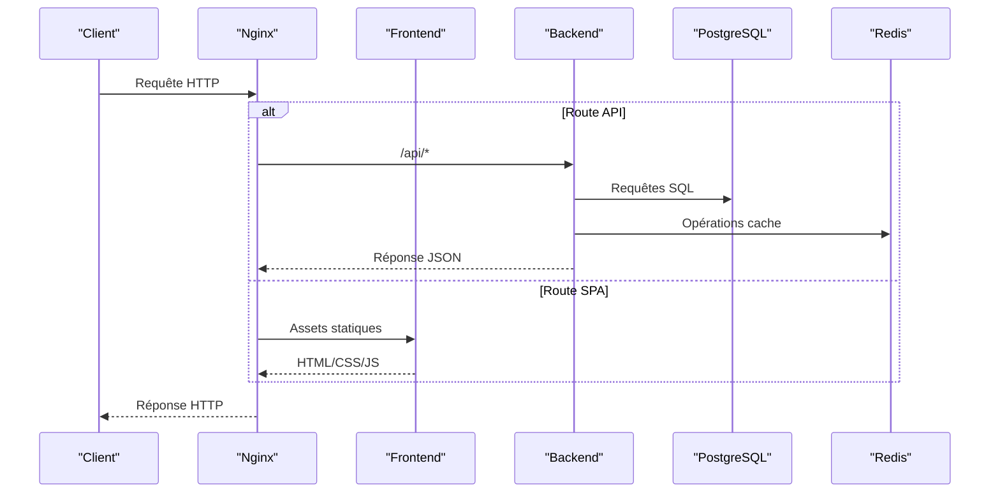

# Configuration Docker et Conteneurisation

<cite>
**Fichiers référencés dans ce document**
- [docker/Dockerfile.backend](file://docker/Dockerfile.backend)
- [docker/Dockerfile.backend.dev](file://docker/Dockerfile.backend.dev)
- [docker/Dockerfile.frontend](file://docker/Dockerfile.frontend)
- [docker/docker-compose.yml](file://docker/docker-compose.yml)
- [docker/docker-compose.local.dev.yml](file://docker/docker-compose.local.dev.yml)
- [docker/docker-compose.local.prod.yml](file://docker/docker-compose.local.prod.yml)
- [docker/docker-compose.cloud.dev.yml](file://docker/docker-compose.cloud.dev.yml)
- [docker/docker-compose.cloud.prod.yml](file://docker/docker-compose.cloud.prod.yml)
- [docker/nginx.conf](file://docker/nginx.conf)
- [docker/README.md](file://docker/README.md)
- [docker/QUICK-START.md](file://docker/QUICK-START.md)
- [docker/deploy.sh](file://docker/deploy.sh)
- [docker/pgadmin-servers.json](file://docker/pgadmin-servers.json)
- [.dockerignore](file://.dockerignore)
</cite>

## Table des matières
1. [Introduction](#introduction)
2. [Structure du projet](#structure-du-projet)
3. [Composants clés](#composants-clés)
4. [Vue d’ensemble de l’architecture](#vue-densemble-de-larchitecture)
5. [Analyse détaillée des composants](#analyse-detaillee-des-composants)
6. [Analyse des dépendances](#analyse-des-dependances)
7. [Considérations de performance](#considerations-de-performance)
8. [Guide de dépannage](#guide-de-depannage)
9. [Conclusion](#conclusion)
10. [Annexes](#annexes)

## Introduction
Ce document décrit la configuration Docker et la conteneurisation d’eLISAschool. Il couvre les fichiers Dockerfile pour le backend et le frontend, l’orchestration via docker-compose (PostgreSQL, Redis, Nginx), les volumes persistants, les réseaux, les variables d’environnement et la gestion des secrets. Il inclut également les optimisations de build, les images multi-étapes, les bonnes pratiques de sécurité, des exemples de déploiement local et production, les commandes essentielles et des procédures de troubleshooting.

## Structure du projet
Le répertoire docker contient les définitions d’images, les configurations d’orchestration par environnement, le reverse proxy Nginx et des scripts utilitaires. Les Dockerfiles sont séparés pour le développement et la production afin d’optimiser les builds et la sécurité.

**Sources de diagramme**
- [docker/Dockerfile.backend](file://docker/Dockerfile.backend)
- [docker/Dockerfile.backend.dev](file://docker/Dockerfile.backend.dev)
- [docker/Dockerfile.frontend](file://docker/Dockerfile.frontend)
- [docker/docker-compose.yml](file://docker/docker-compose.yml)
- [docker/docker-compose.local.dev.yml](file://docker/docker-compose.local.dev.yml)
- [docker/docker-compose.local.prod.yml](file://docker/docker-compose.local.prod.yml)
- [docker/docker-compose.cloud.dev.yml](file://docker/docker-compose.cloud.dev.yml)
- [docker/docker-compose.cloud.prod.yml](file://docker/docker-compose.cloud.prod.yml)
- [docker/nginx.conf](file://docker/nginx.conf)
- [docker/pgadmin-servers.json](file://docker/pgadmin-servers.json)
- [docker/deploy.sh](file://docker/deploy.sh)

**Sources de section**
- [docker/README.md](file://docker/README.md)
- [docker/QUICK-START.md](file://docker/QUICK-START.md)

## Composants clés
- Images Backend:
  - Image de production: construit une image Node.js optimisée avec dépendances installées et code compilé.
  - Image de développement: inclut outils de debug, nodemon et montages de volume pour le rechargement à chaud.
- Image Frontend:
  - Build statique avec Vite, serveur léger en production.
- Services orchestrés:
  - PostgreSQL: base de données relationnelle avec volumes persistants.
  - Redis: cache et sessions.
  - Nginx: reverse proxy, SSL terminaison, compression, routage vers le frontend et le backend.
- Scripts et outils:
  - deploy.sh pour automatiser le déploiement.
  - pgadmin-servers.json pour configurer PgAdmin.

**Sources de section**
- [docker/Dockerfile.backend](file://docker/Dockerfile.backend)
- [docker/Dockerfile.backend.dev](file://docker/Dockerfile.backend.dev)
- [docker/Dockerfile.frontend](file://docker/Dockerfile.frontend)
- [docker/docker-compose.yml](file://docker/docker-compose.yml)
- [docker/nginx.conf](file://docker/nginx.conf)
- [docker/pgadmin-servers.json](file://docker/pgadmin-servers.json)
- [docker/deploy.sh](file://docker/deploy.sh)

## Vue d’ensemble de l’architecture
L’application eLISAschool est composée d’un frontend SPA servi par Nginx, d’un backend API Node.js/NestJS, d’une base PostgreSQL et d’un cache Redis. Nginx centralise les accès HTTPS et redirige les requêtes vers les services appropriés. Les volumes assurent la persistance des données et les réseaux Docker isolent les communications internes.

**Sources de diagramme**
- [docker/docker-compose.yml](file://docker/docker-compose.yml)
- [docker/nginx.conf](file://docker/nginx.conf)

## Analyse détaillée des composants

### Backend: Dockerfile de production
- Multi-stage build:
  - Étape de construction: installation des dépendances et compilation TypeScript.
  - Étape d’exécution: image minimale avec uniquement les artefacts nécessaires.
- Optimisations:
  - Mise en cache des couches de dépendances.
  - Exécution en tant qu’utilisateur non-root.
  - Variables d’environnement pour configuration dynamique.
- Sécurité:
  - Suppression des outils de build inutiles.
  - Limitation des permissions et exposition minimale des ports.

**Sources de section**
- [docker/Dockerfile.backend](file://docker/Dockerfile.backend)

### Backend: Dockerfile de développement
- Fonctionnalités:
  - Inclusion de nodemon pour le rechargement automatique.
  - Montage des sources pour le développement rapide.
  - Exposition des ports de debug.
- Utilisation:
  - Recommandé pour le développement local avec hot reload.

**Sources de section**
- [docker/Dockerfile.backend.dev](file://docker/Dockerfile.backend.dev)

### Frontend: Dockerfile
- Construction:
  - Build statique avec Vite.
  - Serveur léger en production.
- Optimisations:
  - Minimisation et tree-shaking.
  - Cache des dépendances npm.
- Sécurité:
  - Image finale minimaliste sans outils de build.

**Sources de section**
- [docker/Dockerfile.frontend](file://docker/Dockerfile.frontend)

### Orchestration: docker-compose.yml
- Services définis:
  - PostgreSQL avec volumes persistants et scripts d’initialisation.
  - Redis avec configuration de mémoire et persistance optionnelle.
  - Backend avec variables d’environnement et dépendances aux services.
  - Frontend avec build et serveur statique.
  - Nginx comme reverse proxy configuré via nginx.conf.
- Réseaux:
  - Réseau interne dédié aux services.
- Volumes:
  - Volumes nommés pour PostgreSQL et autres données persistantes.
- Dépendances:
  - Ordre de démarrage garanti avec healthchecks.

**Sources de section**
- [docker/docker-compose.yml](file://docker/docker-compose.yml)

### Environnements: Compose spécifiques
- Local Développement:
  - Montages de volumes pour le code source.
  - Variables d’environnement de développement.
  - Logs verbeux.
- Local Production:
  - Images optimisées.
  - Variables d’environnement de production.
  - Limitation des ressources.
- Cloud Développement:
  - Adapté aux environnements cloud.
  - Intégration avec registres d’images.
- Cloud Production:
  - Configuration sécurisée et performante.
  - Secrets externalisés.

**Sources de section**
- [docker/docker-compose.local.dev.yml](file://docker/docker-compose.local.dev.yml)
- [docker/docker-compose.local.prod.yml](file://docker/docker-compose.local.prod.yml)
- [docker/docker-compose.cloud.dev.yml](file://docker/docker-compose.cloud.dev.yml)
- [docker/docker-compose.cloud.prod.yml](file://docker/docker-compose.cloud.prod.yml)

### Reverse Proxy: Nginx
- Routage:
  - /api/* vers le backend.
  - Toutes les autres routes vers le frontend.
- Performance:
  - Compression gzip/brotli.
  - Cache des assets statiques.
- Sécurité:
  - Headers de sécurité HTTP.
  - Limitation de taille de corps.
- SSL:
  - Terminaison TLS avec certificats externes.

**Sources de section**
- [docker/nginx.conf](file://docker/nginx.conf)

### Base de données: PostgreSQL
- Persistance:
  - Volume nommé pour les données.
- Initialisation:
  - Scripts SQL exécutés au premier démarrage.
- Configuration:
  - Paramètres de performance ajustables.
- Monitoring:
  - Connexion via PgAdmin configurée.

**Sources de section**
- [docker/docker-compose.yml](file://docker/docker-compose.yml)
- [docker/pgadmin-servers.json](file://docker/pgadmin-servers.json)

### Cache: Redis
- Usage:
  - Sessions utilisateur et cache de requêtes.
- Configuration:
  - Limite de mémoire.
  - Option de persistance RDB/AOF.
- Sécurité:
  - Accès restreint au réseau interne.

**Sources de section**
- [docker/docker-compose.yml](file://docker/docker-compose.yml)

### Script de déploiement: deploy.sh
- Automatisation:
  - Build des images.
  - Démarrage des services.
  - Exécution des migrations.
- Validation:
  - Vérification de la santé des services.
  - Tests de connectivité.

**Sources de section**
- [docker/deploy.sh](file://docker/deploy.sh)

## Analyse des dépendances
Les services interagissent selon un schéma clair :
- Le frontend communique exclusivement avec Nginx.
- Nginx route les requêtes API vers le backend.
- Le backend accède à PostgreSQL et Redis via le réseau interne.
- PgAdmin peut se connecter à PostgreSQL pour l’administration.

**Sources de diagramme**
- [docker/docker-compose.yml](file://docker/docker-compose.yml)
- [docker/nginx.conf](file://docker/nginx.conf)

**Sources de section**
- [docker/docker-compose.yml](file://docker/docker-compose.yml)
- [docker/nginx.conf](file://docker/nginx.conf)

## Considérations de performance
- Builds optimisés:
  - Multi-stage builds pour réduire la taille des images.
  - Mise en cache des dépendances npm.
- Ressources limitées:
  - Limites CPU et mémoire pour chaque service.
- Cache efficace:
  - Redis pour les sessions et données fréquemment accessibles.
- Compression:
  - Nginx compresse les réponses et assets statiques.
- Monitoring:
  - Healthchecks pour détecter les problèmes rapidement.

[Pas de sources nécessaires car cette section fournit des conseils généraux]

## Guide de dépannage
- Problèmes de connexion à la base de données:
  - Vérifier les variables d’environnement DATABASE_URL.
  - Confirmer que PostgreSQL est en cours d’exécution et accessible.
- Erreurs de cache Redis:
  - Vérifier la disponibilité de Redis et les limites de mémoire.
- Problèmes de routage Nginx:
  - Examiner les logs de Nginx pour les erreurs 4xx/5xx.
  - Valider les règles de routage dans nginx.conf.
- Performances dégradées:
  - Analyser les métriques de PostgreSQL et Redis.
  - Vérifier les index et les requêtes lentes.
- Sauvegardes:
  - Utiliser les scripts de backup pour exporter les données.
  - Restaurer depuis des sauvegardes validées.

**Sources de section**
- [docker/docker-compose.yml](file://docker/docker-compose.yml)
- [docker/nginx.conf](file://docker/nginx.conf)
- [docker/deploy.sh](file://docker/deploy.sh)

## Conclusion
La configuration Docker d’eLISAschool offre une architecture robuste, scalable et sécurisée. Les images multi-étapes, l’orchestration avec docker-compose et le reverse proxy Nginx permettent un déploiement fiable en développement et en production. Les bonnes pratiques de sécurité et d’optimisation garantissent des performances élevées et une maintenance simplifiée.

[Pas de sources nécessaires car cette section résume sans analyser de fichiers spécifiques]

## Annexes

### Commandes Docker essentielles
- Construire et démarrer les services:
  - docker compose up --build -d
- Arrêter les services:
  - docker compose down
- Voir les logs:
  - docker compose logs -f
- Redémarrer un service:
  - docker compose restart <service>
- Exécuter des migrations:
  - docker compose exec backend npm run migrate

**Sources de section**
- [docker/QUICK-START.md](file://docker/QUICK-START.md)

### Bonnes pratiques de sécurité Docker
- Utiliser des images officielles et à jour.
- Éviter d’exécuter les conteneurs en tant que root.
- Limiter les permissions et les ports exposés.
- Externaliser les secrets via des variables d’environnement ou des gestionnaires de secrets.
- Scanner les images pour les vulnérabilités.

[Pas de sources nécessaires car cette section fournit des conseils généraux]

### Exemples de déploiement
- Développement local:
  - docker compose -f docker-compose.local.dev.yml up
- Production locale:
  - docker compose -f docker-compose.local.prod.yml up
- Déploiement cloud:
  - docker compose -f docker-compose.cloud.prod.yml up

**Sources de section**
- [docker/docker-compose.local.dev.yml](file://docker/docker-compose.local.dev.yml)
- [docker/docker-compose.local.prod.yml](file://docker/docker-compose.local.prod.yml)
- [docker/docker-compose.cloud.prod.yml](file://docker/docker-compose.cloud.prod.yml)