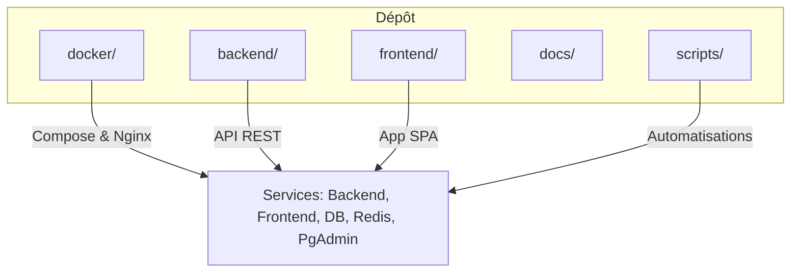
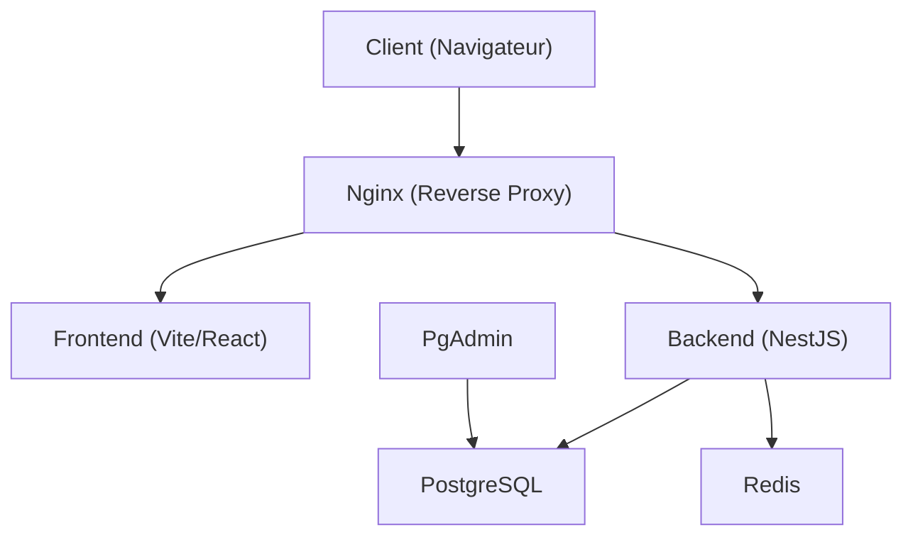
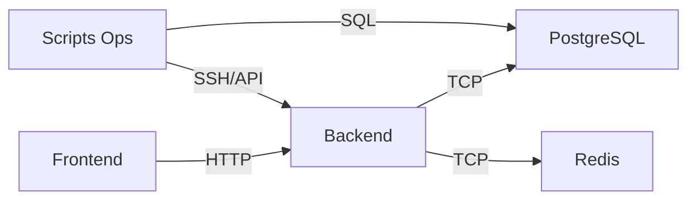

# Déploiement et Production

<cite>
**Fichiers référencés dans ce document**
- [docker-compose.yml](file://docker/docker-compose.yml)
- [docker-compose.local.dev.yml](file://docker/docker-compose.local.dev.yml)
- [docker-compose.local.prod.yml](file://docker/docker-compose.local.prod.yml)
- [docker-compose.cloud.dev.yml](file://docker/docker-compose.cloud.dev.yml)
- [docker-compose.cloud.prod.yml](file://docker/docker-compose.cloud.prod.yml)
- [Dockerfile.backend](file://docker/Dockerfile.backend)
- [Dockerfile.frontend](file://docker/Dockerfile.frontend)
- [nginx.conf](file://docker/nginx.conf)
- [deploy.sh](file://docker/deploy.sh)
- [scripts/backup-auto.sh](file://docker/scripts/backup-auto.sh)
- [scripts/backup-manuel.sh](file://docker/scripts/backup-manuel.sh)
- [scripts/update.sh](file://docker/scripts/update.sh)
- [scripts/restore.sh](file://docker/scripts/restore.sh)
- [scripts/cron-backup.txt](file://docker/scripts/cron-backup.txt)
- [scripts/install-cron.sh](file://docker/scripts/install-cron.sh)
- [scripts/validate-infrastructure.sh](file://docker/scripts/validate-infrastructure.sh)
- [backend/src/config/env.config.ts](file://backend/src/config/env.config.ts)
- [backend/src/config/database.config.ts](file://backend/src/config/database.config.ts)
- [backend/src/app.ts](file://backend/src/app.ts)
- [backend/src/index.ts](file://backend/src/index.ts)
- [backend/package.json](file://backend/package.json)
- [frontend/vite.config.ts](file://frontend/vite.config.ts)
- [README.md](file://README.md)
- [QUICKSTART.md](file://QUICKSTART.md)
- [docker/README.md](file://docker/README.md)
- [docker/QUICK-START.md](file://docker/QUICK-START.md)
- [docker/PGADMIN-GUIDE.md](file://docker/PGADMIN-GUIDE.md)
- [docker/AUDIT-FINAL.md](file://docker/AUDIT-FINAL.md)
- [docker/VALIDATION-REPORT.md](file://docker/VALIDATION-REPORT.md)
- [docs/guides/GUIDE-DEPLOIEMENT-CORRECTIONS-ACADEMIQUE.md](file://docs/guides/GUIDE-DEPLOIEMENT-CORRECTIONS-ACADEMIQUE.md)
- [docs/guides/GUIDE-MONITORING-PERFORMANCE-RBAC.md](file://docs/guides/GUIDE-MONITORING-PERFORMANCE-RBAC.md)
- [docs/guides/GUIDE-TEST-SECURITE.md](file://docs/guides/GUIDE-TEST-SECURITE.md)
- [docs/deploiements/DEPLOIEMENT-CONFIGURATION-GUIDE.md](file://docs/deploiements/DEPLOIEMENT-CONFIGURATION-GUIDE.md)
</cite>

## Table des matières
1. [Introduction](#introduction)
2. [Structure du projet](#structure-du-projet)
3. [Composants clés](#composants-clés)
4. [Vue d’ensemble de l’architecture](#vue-densemble-de-larchitecture)
5. [Analyse détaillée des composants](#analyse-detailee-des-composants)
6. [Analyse des dépendances](#analyse-des-dependances)
7. [Considérations de performance](#considerations-de-performance)
8. [Guide de dépannage](#guide-de-depannage)
9. [Conclusion](#conclusion)
10. [Annexes](#annexes)

## Introduction
Ce document décrit le déploiement et la mise en production d’eLISAschool, en couvrant les environnements Docker, la configuration Nginx, les variables d’environnement, la gestion des secrets, les sauvegardes automatisées, les stratégies de déploiement et de rollback, ainsi que les bonnes pratiques pour la sécurité, le monitoring, la scalabilité horizontale et la haute disponibilité. Il s’appuie sur les fichiers de configuration Docker, les scripts de déploiement et les configurations applicatives présentes dans le dépôt.

## Structure du projet
Le projet est organisé en plusieurs sous-répertoires :
- backend : application NestJS avec migrations, scripts et configuration
- frontend : application React/Vite
- docker : images, compose, Nginx, scripts de maintenance et sauvegarde
- docs : documentation technique, guides et rapports
- scripts : utilitaires shell et TypeScript pour le déploiement et la maintenance

[No sources needed since this diagram shows conceptual structure]

## Composants clés
- Orchestration Docker Compose (environnements local/dev/prod et cloud)
- Images Docker pour le backend et le frontend
- Reverse proxy Nginx
- Base de données PostgreSQL et cache Redis
- Scripts de sauvegarde/restauration et mises à jour
- Configuration applicative via variables d’environnement

**Section sources**
- [docker-compose.yml](file://docker/docker-compose.yml)
- [docker-compose.local.prod.yml](file://docker/docker-compose.local.prod.yml)
- [docker-compose.cloud.prod.yml](file://docker/docker-compose.cloud.prod.yml)
- [Dockerfile.backend](file://docker/Dockerfile.backend)
- [Dockerfile.frontend](file://docker/Dockerfile.frontend)
- [nginx.conf](file://docker/nginx.conf)
- [scripts/backup-auto.sh](file://docker/scripts/backup-auto.sh)
- [scripts/update.sh](file://docker/scripts/update.sh)

## Vue d’ensemble de l’architecture
eLISAschool suit une architecture microservices légère orchestrée par Docker Compose :
- Frontend (SPA) servi par Nginx ou directement en développement
- Backend NestJS exposant l’API REST
- PostgreSQL comme persistance principale
- Redis pour le cache et les sessions
- PgAdmin pour l’administration de la base (optionnel)

**Diagram sources**
- [nginx.conf](file://docker/nginx.conf)
- [docker-compose.yml](file://docker/docker-compose.yml)
- [backend/src/app.ts](file://backend/src/app.ts)

**Section sources**
- [docker-compose.yml](file://docker/docker-compose.yml)
- [nginx.conf](file://docker/nginx.conf)
- [backend/src/app.ts](file://backend/src/app.ts)

## Analyse détaillée des composants

### Environnements Docker et Compose
- docker-compose.yml définit les services communs et les réseaux
- docker-compose.local.* et docker-compose.cloud.* spécialisent les configurations pour le développement et la production
- Les images sont construites via Dockerfile.backend et Dockerfile.frontend

Points clés :
- Séparation des environnements via des fichiers compose dédiés
- Exposition des ports et mappage des volumes pour les données
- Variables d’environnement passées aux conteneurs

**Section sources**
- [docker-compose.yml](file://docker/docker-compose.yml)
- [docker-compose.local.dev.yml](file://docker/docker-compose.local.dev.yml)
- [docker-compose.local.prod.yml](file://docker/docker-compose.local.prod.yml)
- [docker-compose.cloud.dev.yml](file://docker/docker-compose.cloud.dev.yml)
- [docker-compose.cloud.prod.yml](file://docker/docker-compose.cloud.prod.yml)
- [Dockerfile.backend](file://docker/Dockerfile.backend)
- [Dockerfile.frontend](file://docker/Dockerfile.frontend)

### Configuration Nginx
Nginx agit comme reverse proxy et serveur statique :
- Redirection HTTPS vers HTTP interne si nécessaire
- Proxy des requêtes API vers le backend
- Servir les assets statiques du frontend
- Gestion des headers de sécurité et CORS

Recommandations :
- Activer TLS avec des certificats valides
- Configurer les timeouts et buffers adaptés au trafic
- Limiter les accès non autorisés et activer les logs détaillés

**Section sources**
- [nginx.conf](file://docker/nginx.conf)

### Variables d’environnement et configuration applicative
Le backend charge ses paramètres depuis des variables d’environnement :
- Connexion à la base de données (host, port, user, password, database)
- Clés JWT et options de session
- Paramètres Redis
- Options de logging et de monitoring

La configuration se fait via :
- env.config.ts pour les variables d’environnement
- database.config.ts pour la connexion à PostgreSQL
- index.ts et app.ts pour l’initialisation de l’application

Bonnes pratiques :
- Ne jamais hardcoder les secrets
- Utiliser des fichiers .env sécurisés ou un gestionnaire de secrets
- Valider les variables au démarrage

**Section sources**
- [backend/src/config/env.config.ts](file://backend/src/config/env.config.ts)
- [backend/src/config/database.config.ts](file://backend/src/config/database.config.ts)
- [backend/src/index.ts](file://backend/src/index.ts)
- [backend/src/app.ts](file://backend/src/app.ts)

### Sauvegardes et restauration
Des scripts permettent de gérer les sauvegardes automatiques et manuelles :
- backup-auto.sh : planifie des sauvegardes régulières
- backup-manuel.sh : déclenche une sauvegarde à la demande
- restore.sh : restaure une sauvegarde donnée
- cron-backup.txt et install-cron.sh : configure le cron pour les sauvegardes

Stratégie recommandée :
- Sauvegarder quotidiennement avec rotation (daily/weekly/monthly)
- Stocker les backups hors site (cloud sécurisé)
- Tester régulièrement la restauration

**Section sources**
- [scripts/backup-auto.sh](file://docker/scripts/backup-auto.sh)
- [scripts/backup-manuel.sh](file://docker/scripts/backup-manuel.sh)
- [scripts/restore.sh](file://docker/scripts/restore.sh)
- [scripts/cron-backup.txt](file://docker/scripts/cron-backup.txt)
- [scripts/install-cron.sh](file://docker/scripts/install-cron.sh)

### Mises à jour et déploiement
Le script update.sh orchestre les mises à jour :
- Récupération des nouvelles versions
- Exécution des migrations de base de données
- Redémarrage des services

Procédure type :
- Préparer un environnement de staging
- Appliquer les migrations en mode test
- Basculer vers la nouvelle version
- Vérifier les indicateurs de santé

**Section sources**
- [scripts/update.sh](file://docker/scripts/update.sh)
- [deploy.sh](file://docker/deploy.sh)

### Monitoring et logging
- Logs applicatifs structurés et centralisés
- Métriques de performance et erreurs
- Alerting sur les seuils critiques

Outils suggérés :
- ELK Stack ou Loki pour les logs
- Prometheus + Grafana pour les métriques
- Health checks intégrés dans les services

**Section sources**
- [backend/src/app.ts](file://backend/src/app.ts)
- [docs/guides/GUIDE-MONITORING-PERFORMANCE-RBAC.md](file://docs/guides/GUIDE-MONITORING-PERFORMANCE-RBAC.md)

### Sécurité en production
- Validation stricte des entrées
- Authentification et autorisation robustes
- Chiffrement des données sensibles
- Audit des accès et actions critiques

Actions recommandées :
- Activer le chiffrement TLS
- Restreindre les accès réseau
- Scanner les vulnérabilités régulièrement
- Auditer les permissions et rôles

**Section sources**
- [docs/guides/GUIDE-TEST-SECURITE.md](file://docs/guides/GUIDE-TEST-SECURITE.md)
- [docker/AUDIT-FINAL.md](file://docker/AUDIT-FINAL.md)

## Analyse des dépendances
Les services interagissent selon les schémas suivants :
- Le frontend appelle l’API backend via Nginx
- Le backend accède à PostgreSQL et Redis
- Les scripts de maintenance s’exécutent dans des conteneurs dédiés

**Diagram sources**
- [docker-compose.yml](file://docker/docker-compose.yml)
- [nginx.conf](file://docker/nginx.conf)
- [backend/src/config/database.config.ts](file://backend/src/config/database.config.ts)

**Section sources**
- [docker-compose.yml](file://docker/docker-compose.yml)
- [backend/src/config/database.config.ts](file://backend/src/config/database.config.ts)

## Considérations de performance
Optimisations recommandées :
- Mise en cache Redis pour les requêtes fréquentes
- Indexation appropriée des tables PostgreSQL
- Limitation de la taille des réponses et pagination efficace
- Compression Gzip/Brotli dans Nginx
- Scaling horizontal du backend avec load balancer

Mesures de performance :
- Surveiller les temps de réponse et l’utilisation CPU/Mémoire
- Analyser les requêtes lentes dans la base
- Ajuster les pools de connexions

**Section sources**
- [backend/src/config/database.config.ts](file://backend/src/config/database.config.ts)
- [nginx.conf](file://docker/nginx.conf)

## Guide de dépannage
Problèmes courants et solutions :
- Erreurs de connexion à la base : vérifier les credentials et le réseau
- Problèmes de CORS : configurer les origines autorisées
- Échec des migrations : examiner les logs et les contraintes uniques
- Performances dégradées : analyser les index et les requêtes lentes

Outils de diagnostic :
- Logs des conteneurs Docker
- Commandes de vérification d’intégrité
- Tests de connectivité réseau

**Section sources**
- [scripts/validate-infrastructure.sh](file://docker/scripts/validate-infrastructure.sh)
- [backend/src/app.ts](file://backend/src/app.ts)

## Conclusion
eLISAschool offre une stack moderne et modulaire facilitant le déploiement en production. En suivant les bonnes pratiques de configuration, de sécurité et de maintenance décrites ci-dessus, vous pouvez garantir une application fiable, performante et évolutive.

[No sources needed since this section summarizes without analyzing specific files]

## Annexes

### Procédures de déploiement par environnement
- Local : utiliser docker-compose.local.* pour le développement
- Cloud : adapter docker-compose.cloud.* avec les secrets et ressources adaptées
- On-premise : déployer les mêmes images avec un registry privé

### Stratégies de haute disponibilité
- Multi-instance du backend derrière un load balancer
- Réplication de la base de données
- Sauvegardes géo-distribuées

### Rollback et reprise après incident
- Maintenir des versions stables des images
- Automatiser le rollback des migrations en cas d’échec
- Restaurer les backups récents en cas de corruption

**Section sources**
- [docker/README.md](file://docker/README.md)
- [QUICKSTART.md](file://QUICKSTART.md)
- [docs/deploiements/DEPLOIEMENT-CONFIGURATION-GUIDE.md](file://docs/deploiements/DEPLOIEMENT-CONFIGURATION-GUIDE.md)