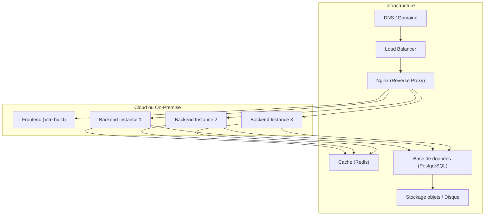
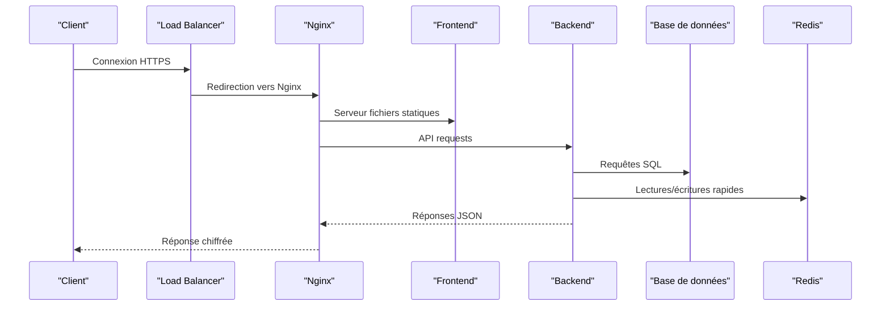
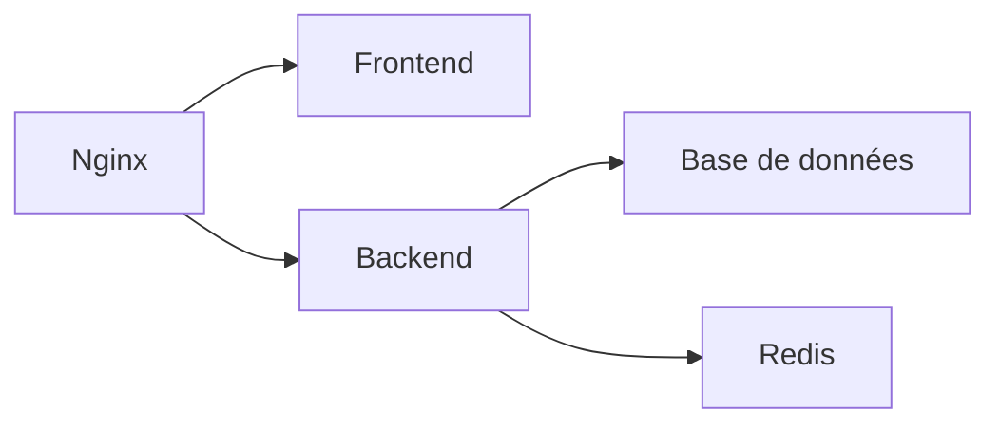

# Environnements de Production

<cite>
**Fichiers référencés dans ce document**
- [docker-compose.cloud.prod.yml](file://docker/docker-compose.cloud.prod.yml)
- [docker-compose.local.prod.yml](file://docker/docker-compose.local.prod.yml)
- [nginx.conf](file://docker/nginx.conf)
- [deploy.sh](file://docker/deploy.sh)
- [scripts/update.sh](file://docker/scripts/update.sh)
- [scripts/backup-auto.sh](file://docker/scripts/backup-auto.sh)
- [scripts/cron-backup.txt](file://docker/scripts/cron-backup.txt)
- [backend/src/config/env.config.ts](file://backend/src/config/env.config.ts)
- [backend/src/config/database.config.ts](file://backend/src/config/database.config.ts)
- [backend/package.json](file://backend/package.json)
- [frontend/vite.config.ts](file://frontend/vite.config.ts)
- [README.md](file://README.md)
</cite>

## Table des matières
1. [Introduction](#introduction)
2. [Structure du projet](#structure-du-projet)
3. [Composants clés](#composants-clés)
4. [Vue d'ensemble de l'architecture](#vue-densemble-de-larchitecture)
5. [Analyse détaillée des composants](#analyse-detaillee-des-composants)
6. [Analyse des dépendances](#analyse-des-dependances)
7. [Considérations de performance](#considerations-de-performance)
8. [Guide de dépannage](#guide-de-depannage)
9. [Conclusion](#conclusion)
10. [Annexes](#annexes)

## Introduction
Ce document décrit les environnements de production d'eLISAschool, en distinguant les configurations cloud et on-premise, les variables d'environnement critiques, la gestion des secrets, le reverse proxy Nginx (certificats SSL/TLS et optimisations), ainsi que les procédures de déploiement automatisé, les stratégies blue-green et les rollbacks. Il couvre également la scalabilité horizontale, le load balancing et la haute disponibilité.

## Structure du projet
Le projet est organisé en plusieurs couches :
- Backend NestJS avec configuration d’environnement et base de données
- Frontend Vite/React
- Orchestration Docker avec des compositions spécifiques pour cloud et local
- Reverse proxy Nginx
- Scripts de déploiement, mise à jour et sauvegarde

[Ce diagramme illustre une vue conceptuelle ; il ne mape pas directement des fichiers sources spécifiques]

## Composants clés
- Compositions Docker : versions cloud et locale pour la production
- Configuration Nginx : reverse proxy, TLS, buffering, gzip, cache statique
- Variables d’environnement backend : base de données, JWT, CORS, Redis, limites
- Frontend : configuration de build et variables d’environnement
- Scripts de déploiement et maintenance : mise à jour, sauvegardes planifiées

**Section sources**
- [docker-compose.cloud.prod.yml](file://docker/docker-compose.cloud.prod.yml)
- [docker-compose.local.prod.yml](file://docker/docker-compose.local.prod.yml)
- [nginx.conf](file://docker/nginx.conf)
- [backend/src/config/env.config.ts](file://backend/src/config/env.config.ts)
- [backend/src/config/database.config.ts](file://backend/src/config/database.config.ts)
- [frontend/vite.config.ts](file://frontend/vite.config.ts)

## Vue d'ensemble de l'architecture
La production utilise un reverse proxy Nginx qui expose HTTPS et redirige vers le frontend statique et les instances backend. Les instances backend sont stateless et peuvent être mises à l’échelle horizontalement. La base de données est centralisée et peut être externalisée (cloud managed ou on-premise). Le cache (Redis) améliore les performances et permet la partage de sessions/tokens.

[Ce diagramme séquentiel est conceptuel et ne mappe pas directement des fichiers sources spécifiques]

## Analyse détaillée des composants

### Différences entre configurations Cloud et On-Premise
- Cloud :
  - Utilisation de services managés (base de données, cache, stockage)
  - Auto-scaling via orchestrateur (Kubernetes/ECS)
  - Load balancer managé
  - Secrets gérés par le fournisseur cloud
- On-Premise :
  - Base de données et cache hébergés sur serveurs dédiés
  - Gestion des certificats via ACME/Let’s Encrypt
  - Sauvegardes locales et réplication interne
  - Contrôles réseau internes (VLAN, firewall)

Les compositions Docker montrent comment adapter les services selon l’environnement.

**Section sources**
- [docker-compose.cloud.prod.yml](file://docker/docker-compose.cloud.prod.yml)
- [docker-compose.local.prod.yml](file://docker/docker-compose.local.prod.yml)

### Variables d’environnement critiques
- Base de données : URL, pool de connexions, timeouts, schéma
- Authentification : secret JWT, algorithmes, expiration
- CORS : origines autorisées, méthodes, headers
- Cache : hôte Redis, port, timeout
- Limites : taille de payload, nombre de requêtes
- Logging et monitoring : niveaux, destinations

Ces variables sont lues par le backend au démarrage et influencent le comportement runtime.

**Section sources**
- [backend/src/config/env.config.ts](file://backend/src/config/env.config.ts)
- [backend/src/config/database.config.ts](file://backend/src/config/database.config.ts)

### Stratégies de gestion des secrets
- Utiliser des gestionnaires de secrets (Vault, AWS Secrets Manager, Azure Key Vault)
- Injecter les secrets via variables d’environnement sécurisées
- Ne jamais stocker de secrets dans le code ou les images Docker
- Rotation automatique des secrets et rechargement sans downtime
- Chiffrement des backups et accès restreint

[Ce contenu est général et ne nécessite pas de sources spécifiques]

### Configurations Nginx pour le reverse proxy
- Terminaison TLS avec certificats valides
- Gzip/Brotli pour compression
- Buffering adapté aux réponses JSON
- Cache statique pour assets frontend
- Rate limiting et protection contre abus
- Health checks et redirections propres

**Section sources**
- [nginx.conf](file://docker/nginx.conf)

### Optimisations de performance
- Backend :
  - Pool de connexions DB ajusté
  - Cache Redis pour lectures fréquentes
  - Limiteurs de taux et timeouts
- Frontend :
  - Build optimisé (code splitting, tree-shaking)
  - CDN pour assets statiques
- Infrastructure :
  - Load balancing efficace
  - Scaling horizontal des instances backend
  - Monitoring et alerting

**Section sources**
- [backend/package.json](file://backend/package.json)
- [frontend/vite.config.ts](file://frontend/vite.config.ts)

### Procédures de déploiement automatisé
- Pipeline CI/CD :
  - Build frontend et backend
  - Tests unitaires et intégration
  - Création d’images Docker
  - Déploiement progressif (blue-green)
- Scripts :
  - Mise à jour des services
  - Validation post-déploiement
  - Rollback automatique en cas d’échec

**Section sources**
- [deploy.sh](file://docker/deploy.sh)
- [scripts/update.sh](file://docker/scripts/update.sh)

### Blue-Green Deployments et Rollbacks
- Deux environnements identiques (bleu et vert)
- Basculer le trafic vers l’environnement mis à jour
- Vérifier la santé avant bascule complète
- Revenir rapidement à l’environnement stable en cas d’erreur

[Ce contenu est conceptuel et ne nécessite pas de sources spécifiques]

### Scalabilité horizontale, Load Balancing et Haute Disponibilité
- Instances backend multiples derrière un load balancer
- Base de données avec réplication et failover
- Cache distribué pour partager l’état
- Monitoring de la santé et auto-scaling

[Ce contenu est conceptuel et ne nécessite pas de sources spécifiques]

## Analyse des dépendances
Les composants principaux interagissent comme suit :
- Nginx dépend des configurations TLS et des upstreams
- Backend dépend de la base de données et du cache
- Frontend dépend des variables de build et des endpoints API

[Ce diagramme est conceptuel et ne mappe pas directement des fichiers sources spécifiques]

**Section sources**
- [nginx.conf](file://docker/nginx.conf)
- [backend/src/config/database.config.ts](file://backend/src/config/database.config.ts)
- [backend/src/config/env.config.ts](file://backend/src/config/env.config.ts)

## Considérations de performance
- Ajuster les timeouts et pools de connexions selon la charge
- Activer le caching côté serveur et client
- Utiliser des CDN pour les assets statiques
- Surveiller les métriques de performance et ajuster les ressources

[Ce contenu est général et ne nécessite pas de sources spécifiques]

## Guide de dépannage
- Problèmes de connexion DB : vérifier les variables d’environnement et les logs
- Erreurs TLS : valider les certificats et les permissions
- Latence élevée : inspecter les métriques Redis et DB
- Échecs de déploiement : examiner les scripts et les health checks

**Section sources**
- [scripts/backup-auto.sh](file://docker/scripts/backup-auto.sh)
- [scripts/cron-backup.txt](file://docker/scripts/cron-backup.txt)

## Conclusion
eLISAschool offre une architecture robuste et évolutive pour la production, avec des options cloud et on-premise flexibles. La configuration Nginx, les variables d’environnement et les scripts de déploiement permettent une gestion fiable et performante. Les bonnes pratiques de sécurité et de scaling assurent la disponibilité et la résilience.

[Ce contenu résume sans analyser de fichiers spécifiques]

## Annexes
- Référence rapide des commandes Docker et Nginx
- Checklist de pré-déploiement
- Exemples de métriques et alertes

[Ce contenu est informatif et ne nécessite pas de sources spécifiques]