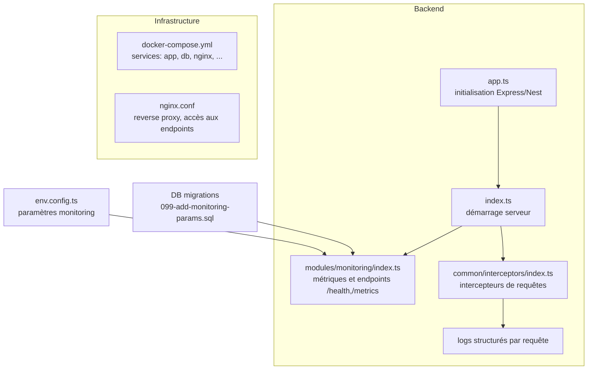
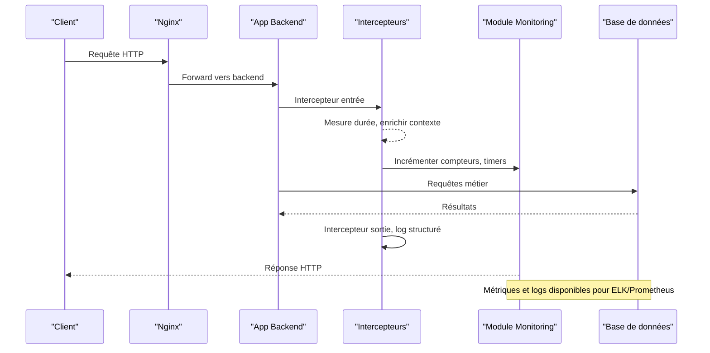
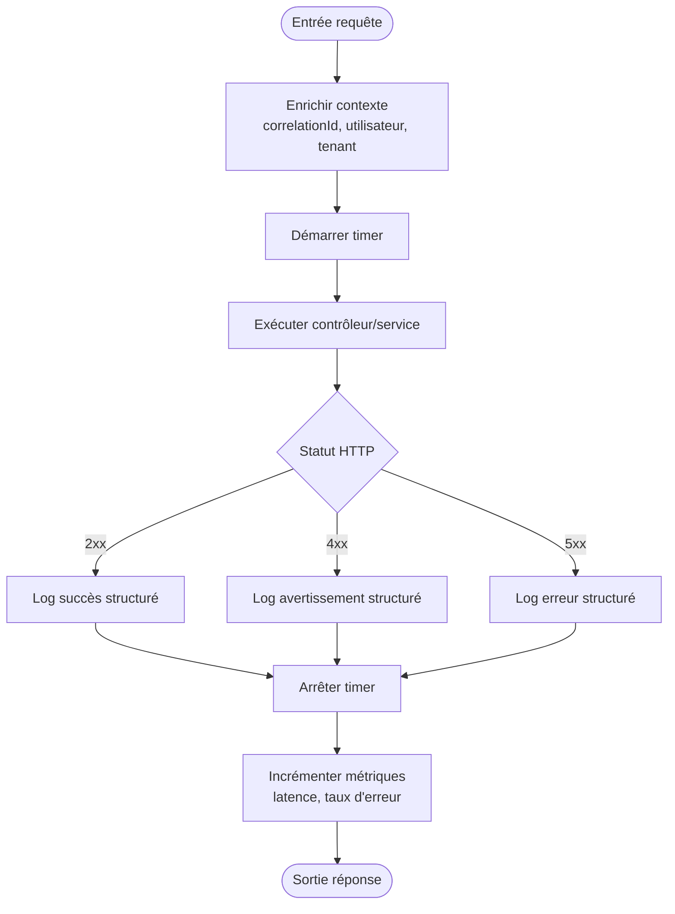
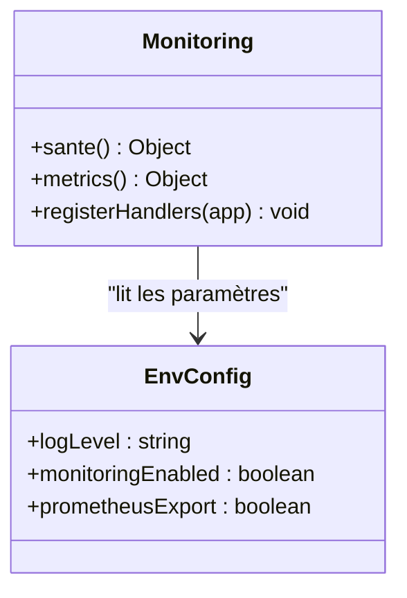
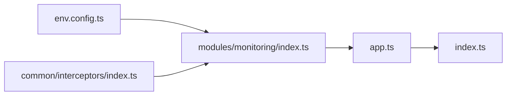

# Monitoring et Logging

<cite>
**Fichiers référencés dans ce document**
- [backend/src/modules/monitoring/index.ts](file://backend/src/modules/monitoring/index.ts)
- [backend/src/common/interceptors/index.ts](file://backend/src/common/interceptors/index.ts)
- [backend/src/config/env.config.ts](file://backend/src/config/env.config.ts)
- [backend/src/app.ts](file://backend/src/app.ts)
- [backend/src/index.ts](file://backend/src/index.ts)
- [docker/docker-compose.yml](file://docker/docker-compose.yml)
- [docker/nginx.conf](file://docker/nginx.conf)
- [backend/database/migrations/099-add-monitoring-params.sql](file://backend/database/migrations/099-add-monitoring-params.sql)
- [docs/guides/GUIDE-MONITORING-PERFORMANCE-RBAC.md](file://docs/guides/GUIDE-MONITORING-PERFORMANCE-RBAC.md)
</cite>

## Table des matières
1. [Introduction](#introduction)
2. [Structure du projet](#structure-du-projet)
3. [Composants clés](#composants-clés)
4. [Vue d'ensemble de l'architecture](#vue-densemble-de-larchitecture)
5. [Analyse détaillée des composants](#analyse-detaillee-des-composants)
6. [Analyse des dépendances](#analyse-des-dependances)
7. [Considérations de performance](#considerations-de-performance)
8. [Guide de dépannage](#guide-de-depannage)
9. [Conclusion](#conclusion)
10. [Annexes](#annexes)

## Introduction
Ce document décrit le monitoring et le logging en production pour eLISAschool. Il couvre les intercepteurs de requêtes, la journalisation structurée, l'intégration avec ELK Stack et Prometheus, la collecte de métriques de performance, les alertes automatiques, les dashboards de supervision, ainsi que les stratégies de rotation, d'archivage et de rétention des logs. Il inclut également des procédures de diagnostic, des outils de débogage en production et des bonnes pratiques.

## Structure du projet
Le backend expose un module dédié au monitoring et utilise des intercepteurs communs pour tracer les requêtes HTTP. La configuration environnement centralise les paramètres liés au monitoring. Le déploiement Docker orchestre les services (application, base de données, reverse proxy) et peut intégrer des collecteurs de logs et de métriques.

**Sources de diagramme**
- [backend/src/app.ts](file://backend/src/app.ts)
- [backend/src/index.ts](file://backend/src/index.ts)
- [backend/src/modules/monitoring/index.ts](file://backend/src/modules/monitoring/index.ts)
- [backend/src/common/interceptors/index.ts](file://backend/src/common/interceptors/index.ts)
- [backend/src/config/env.config.ts](file://backend/src/config/env.config.ts)
- [docker/docker-compose.yml](file://docker/docker-compose.yml)
- [docker/nginx.conf](file://docker/nginx.conf)
- [backend/database/migrations/099-add-monitoring-params.sql](file://backend/database/migrations/099-add-monitoring-params.sql)

**Sources de section**
- [backend/src/app.ts](file://backend/src/app.ts)
- [backend/src/index.ts](file://backend/src/index.ts)
- [backend/src/modules/monitoring/index.ts](file://backend/src/modules/monitoring/index.ts)
- [backend/src/common/interceptors/index.ts](file://backend/src/common/interceptors/index.ts)
- [backend/src/config/env.config.ts](file://backend/src/config/env.config.ts)
- [docker/docker-compose.yml](file://docker/docker-compose.yml)
- [docker/nginx.conf](file://docker/nginx.conf)
- [backend/database/migrations/099-add-monitoring-params.sql](file://backend/database/migrations/099-add-monitoring-params.sql)

## Composants clés
- Intercepteurs de requêtes : capturent les entrées/sorties HTTP, mesurent les durées, enrichissent les logs avec des identifiants de corrélation.
- Module de monitoring : expose des endpoints de santé et de métriques applicatives, agrège les indicateurs de performance.
- Configuration environnement : définit les niveaux de log, les destinations, les seuils et les flags de fonctionnalités.
- Migrations de monitoring : ajoutent des colonnes ou tables nécessaires à la persistance de certains indicateurs.

**Sources de section**
- [backend/src/common/interceptors/index.ts](file://backend/src/common/interceptors/index.ts)
- [backend/src/modules/monitoring/index.ts](file://backend/src/modules/monitoring/index.ts)
- [backend/src/config/env.config.ts](file://backend/src/config/env.config.ts)
- [backend/database/migrations/099-add-monitoring-params.sql](file://backend/database/migrations/099-add-monitoring-params.sql)

## Vue d'ensemble de l'architecture
Le flux de requête traverse le reverse proxy (Nginx), est acheminé vers le backend Node.js, puis passe par les intercepteurs qui génèrent des logs structurés et des métriques. Le module de monitoring fournit des points de contrôle pour la santé et l'exposition des métriques. Les logs peuvent être envoyés à un collecteur (Fluent Bit/Filebeat) et indexés dans Elasticsearch ; les métriques peuvent être scrapées par Prometheus.

**Sources de diagramme**
- [docker/nginx.conf](file://docker/nginx.conf)
- [backend/src/app.ts](file://backend/src/app.ts)
- [backend/src/common/interceptors/index.ts](file://backend/src/common/interceptors/index.ts)
- [backend/src/modules/monitoring/index.ts](file://backend/src/modules/monitoring/index.ts)

## Analyse détaillée des composants

### Intercepteurs de requêtes
Les intercepteurs capturent chaque requête HTTP, mesurent le temps de traitement, ajoutent un identifiant de corrélation et produisent des logs structurés. Ils permettent de suivre les erreurs, les codes de statut et les chemins d'accès.

**Sources de diagramme**
- [backend/src/common/interceptors/index.ts](file://backend/src/common/interceptors/index.ts)

**Sources de section**
- [backend/src/common/interceptors/index.ts](file://backend/src/common/interceptors/index.ts)

### Module de monitoring
Expose des endpoints pour la santé de l'application et l'exposition des métriques applicatives. Agrège les indicateurs de performance (temps de réponse, taux d'erreur, activité). Peut exposer des métriques au format compatible Prometheus.

**Sources de diagramme**
- [backend/src/modules/monitoring/index.ts](file://backend/src/modules/monitoring/index.ts)
- [backend/src/config/env.config.ts](file://backend/src/config/env.config.ts)

**Sources de section**
- [backend/src/modules/monitoring/index.ts](file://backend/src/modules/monitoring/index.ts)
- [backend/src/config/env.config.ts](file://backend/src/config/env.config.ts)

### Configuration environnement
Centralise les paramètres de monitoring : niveau de log, activation des exports Prometheus, limites de rétention, destinations de logs. Ces valeurs influencent le comportement des intercepteurs et du module de monitoring.

**Sources de section**
- [backend/src/config/env.config.ts](file://backend/src/config/env.config.ts)

### Migration de monitoring
La migration ajoute des paramètres ou structures nécessaires au monitoring (par exemple, colonnes pour stocker des indicateurs ou des configurations spécifiques). Elle doit être appliquée avant l'activation complète du monitoring.

**Sources de section**
- [backend/database/migrations/099-add-monitoring-params.sql](file://backend/database/migrations/099-add-monitoring-params.sql)

### Intégration avec ELK Stack et Prometheus
- Logs structurés : envoyer les logs JSON vers Fluent Bit ou Filebeat, indexer dans Elasticsearch, visualiser dans Kibana.
- Métriques : exporter des métriques applicatives (latence, erreurs, requêtes/sec) et scraper via Prometheus.
- Dashboards : créer des tableaux de bord Kibana et Grafana pour superviser la santé et les performances.

[No sources needed since this section provides general guidance]

### Stratégies de rotation, archivage et rétention
- Rotation : configurer le rotateur de logs (par taille ou par temps) côté application ou via Fluent Bit/Filebeat.
- Archivage : compresser les fichiers anciens et les déplacer vers un stockage durable (S3, NAS).
- Rétention : définir des politiques de conservation (ex. 30 jours en ligne, 90 jours archivés) selon les besoins réglementaires.

[No sources needed since this section provides general guidance]

### Collecte de métriques de performance et alertes
- Métriques clés : latence p50/p95/p99, taux d'erreur, nombre de requêtes, temps de réponse DB, utilisation CPU/Mémoire.
- Alertes : seuils sur erreurs 5xx, latence élevée, saturation DB, échec de santé.
- Outils : Prometheus pour scraping, Alertmanager pour notifications, Grafana/Kibana pour visualisation.

[No sources needed since this section provides general guidance]

## Analyse des dépendances
Le module de monitoring dépend de la configuration environnement et des intercepteurs pour enrichir les logs et les métriques. L'application s'appuie sur ces composants pour fournir une visibilité opérationnelle.

**Sources de diagramme**
- [backend/src/config/env.config.ts](file://backend/src/config/env.config.ts)
- [backend/src/modules/monitoring/index.ts](file://backend/src/modules/monitoring/index.ts)
- [backend/src/common/interceptors/index.ts](file://backend/src/common/interceptors/index.ts)
- [backend/src/app.ts](file://backend/src/app.ts)
- [backend/src/index.ts](file://backend/src/index.ts)

**Sources de section**
- [backend/src/config/env.config.ts](file://backend/src/config/env.config.ts)
- [backend/src/modules/monitoring/index.ts](file://backend/src/modules/monitoring/index.ts)
- [backend/src/common/interceptors/index.ts](file://backend/src/common/interceptors/index.ts)
- [backend/src/app.ts](file://backend/src/app.ts)
- [backend/src/index.ts](file://backend/src/index.ts)

## Considérations de performance
- Limiter la verbosité des logs en production ; utiliser des niveaux appropriés (info/warn/error).
- Éviter les opérations coûteuses dans les intercepteurs ; ne pas sérialiser de payloads volumineux.
- Exposer uniquement les métriques essentielles ; agréger et échantillonner si nécessaire.
- Utiliser des index DB pertinents pour réduire les temps de réponse observés par le monitoring.

[No sources needed since this section provides general guidance]

## Guide de dépannage
- Vérifier la santé de l'application via l'endpoint dédié.
- Examiner les logs structurés pour identifier les erreurs et les goulots d'étranglement.
- Consulter les métriques Prometheus pour détecter les anomalies de latence et d'erreurs.
- Valider la configuration environnement et les permissions d'accès aux ressources.
- Utiliser les guides de monitoring existants pour affiner les diagnostics RBAC et performance.

**Sources de section**
- [docs/guides/GUIDE-MONITORING-PERFORMANCE-RBAC.md](file://docs/guides/GUIDE-MONITORING-PERFORMANCE-RBAC.md)

## Conclusion
eLISAschool intègre un système de monitoring et logging robuste grâce aux intercepteurs de requêtes, au module de monitoring et à la configuration centralisée. En production, il est recommandé d'activer les exports Prometheus, d'acheminer les logs vers ELK, de mettre en place des alertes et des dashboards, et de définir des politiques claires de rotation et de rétention. Suivre les bonnes pratiques décrites permet d'assurer fiabilité, observabilité et réactivité face aux incidents.

## Annexes
- Déploiement Docker : vérifier les services et ports exposés pour les endpoints de monitoring.
- Reverse Proxy : valider les routes et headers pour le forwarding des logs et métriques.

**Sources de section**
- [docker/docker-compose.yml](file://docker/docker-compose.yml)
- [docker/nginx.conf](file://docker/nginx.conf)