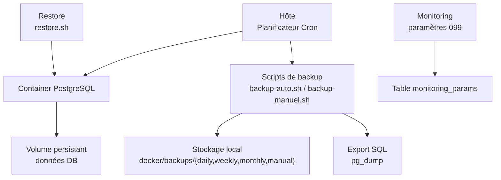
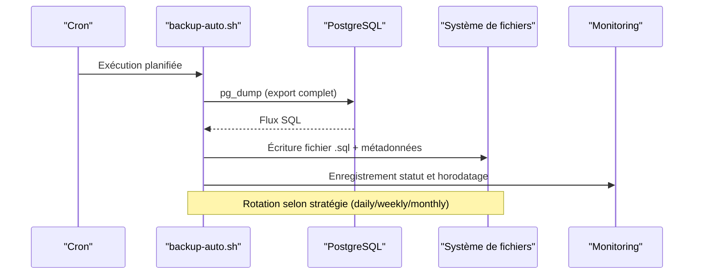
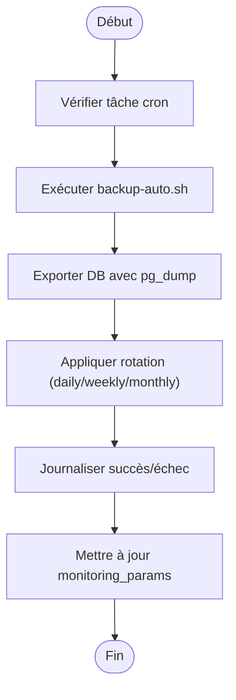
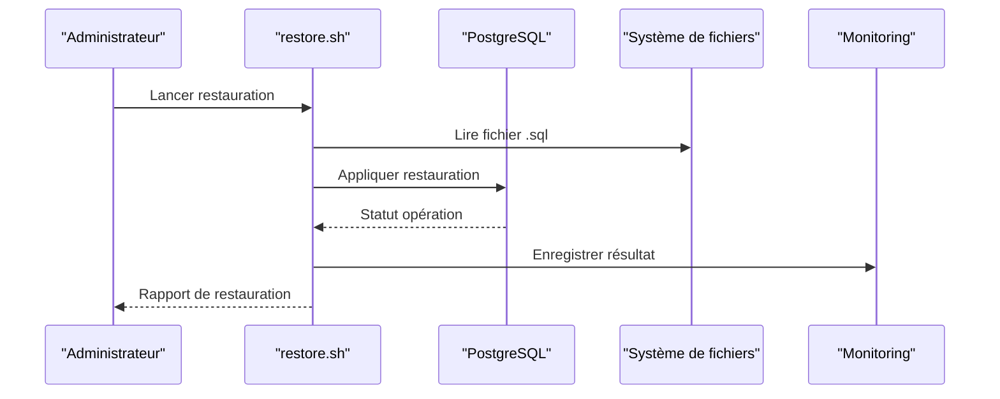
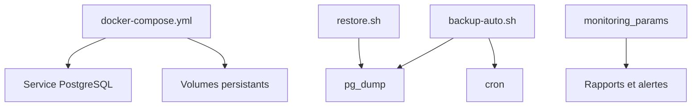

# Sauvegarde et Récupération

<cite>
**Fichiers référencés dans ce document**
- [docker/scripts/backup-auto.sh](file://docker/scripts/backup-auto.sh)
- [docker/scripts/backup-manuel.sh](file://docker/scripts/backup-manuel.sh)
- [docker/scripts/restore.sh](file://docker/scripts/restore.sh)
- [docker/scripts/cron-backup.txt](file://docker/scripts/cron-backup.txt)
- [docker/scripts/install-cron.sh](file://docker/scripts/install-cron.sh)
- [docker/docker-compose.yml](file://docker/docker-compose.yml)
- [docker/Dockerfile.backend](file://docker/Dockerfile.backend)
- [backend/database/migrations/099-add-monitoring-params.sql](file://backend/database/migrations/099-add-monitoring-params.sql)
- [backups/elisaschool_backup_20260621_143000.sql](file://backups/elisaschool_backup_20260621_143000.sql)
- [backups/elisaschool_backup_20260621_143332.sql](file://backups/elisaschool_backup_20260621_143332.sql)
- [backups/schema-pre-migrations-084-087.sql](file://backups/schema-pre-migrations-084-087.sql)
- [docs/autres/_backup-system/BACKUP-SYSTEM-README-FINAL.md](file://docs/autres/_backup-system/BACKUP-SYSTEM-README-FINAL.md)
- [docs/autres/_backup-system/BACKUP-SYSTEM-IMPLEMENTATION-COMPLETE.md](file://docs/autres/_backup-system/BACKUP-SYSTEM-IMPLEMENTATION-COMPLETE.md)
- [docs/autres/_backup-system/BACKUP-SYSTEM-USER-GUIDE.md](file://docs/autres/_backup-system/BACKUP-SYSTEM-USER-GUIDE.md)
- [scripts/creer-base-de-donnees.sh](file://scripts/creer-base-de-donnees.sh)
- [scripts/supprimer-base-de-donnees.sh](file://scripts/supprimer-base-de-donnees.sh)
</cite>

## Table des matières
1. [Introduction](#introduction)
2. [Structure du projet](#structure-du-projet)
3. [Composants clés](#composants-clés)
4. [Vue d'ensemble de l'architecture](#vue-densemble-de-larchitecture)
5. [Analyse détaillée des composants](#analyse-detaillee-des-composants)
6. [Analyse des dépendances](#analyse-des-dependances)
7. [Considérations de performance](#considerations-de-performance)
8. [Guide de dépannage](#guide-de-depannage)
9. [Conclusion](#conclusion)
10. [Annexes](#annexes)

## Introduction
Ce document décrit les stratégies de sauvegarde et de récupération d’eLISAschool, en se concentrant sur les scripts automatisés, la rotation des sauvegardes, les tests de restauration, les différences entre backups complets et incrémentaux, la réplication de base de données, la synchronisation des fichiers, les procédures de reprise après sinistre (DR), les plans de continuité d’activité (PCA), et les vérifications d’intégrité des données. Il inclut également les bonnes pratiques de stockage et les procédures de migration entre environnements.

## Structure du projet
Le système de sauvegarde est principalement hébergé dans le répertoire docker/scripts avec des artefacts de sauvegarde dans backups et une documentation dédiée dans docs/autres/_backup-system. Les configurations Docker orchestrent les services et les volumes nécessaires à la persistance et aux snapshots.

**Sources du diagramme**
- [docker/scripts/backup-auto.sh](file://docker/scripts/backup-auto.sh)
- [docker/scripts/backup-manuel.sh](file://docker/scripts/backup-manuel.sh)
- [docker/scripts/restore.sh](file://docker/scripts/restore.sh)
- [docker/docker-compose.yml](file://docker/docker-compose.yml)
- [backend/database/migrations/099-add-monitoring-params.sql](file://backend/database/migrations/099-add-monitoring-params.sql)

**Sources de section**
- [docker/docker-compose.yml](file://docker/docker-compose.yml)
- [docker/Dockerfile.backend](file://docker/Dockerfile.backend)
- [docs/autres/_backup-system/BACKUP-SYSTEM-README-FINAL.md](file://docs/autres/_backup-system/BACKUP-SYSTEM-README-FINAL.md)

## Composants clés
- Scripts de sauvegarde automatique et manuel : génération de dumps SQL, archivage par fréquence (quotidien, hebdomadaire, mensuel), gestion des métadonnées et logs.
- Script de restauration : validation pré-restauration, restauration complète ou partielle, post-checks d’intégrité.
- Planification cron : exécution planifiée des sauvegardes automatiques.
- Monitoring : paramètres de surveillance pour suivre l’état des sauvegardes et restaurations.
- Artéfacts de sauvegarde : fichiers .sql stockés localement pour référence immédiate.

**Sources de section**
- [docker/scripts/backup-auto.sh](file://docker/scripts/backup-auto.sh)
- [docker/scripts/backup-manuel.sh](file://docker/scripts/backup-manuel.sh)
- [docker/scripts/restore.sh](file://docker/scripts/restore.sh)
- [docker/scripts/cron-backup.txt](file://docker/scripts/cron-backup.txt)
- [docker/scripts/install-cron.sh](file://docker/scripts/install-cron.sh)
- [backend/database/migrations/099-add-monitoring-params.sql](file://backend/database/migrations/099-add-monitoring-params.sql)
- [backups/elisaschool_backup_20260621_143000.sql](file://backups/elisaschool_backup_20260621_143000.sql)
- [backups/elisaschool_backup_20260621_143332.sql](file://backups/elisaschool_backup_20260621_143332.sql)
- [backups/schema-pre-migrations-084-087.sql](file://backups/schema-pre-migrations-084-087.sql)

## Vue d'ensemble de l'architecture
Le flux de sauvegarde s’appuie sur pg_dump pour exporter la base de données vers des fichiers SQL, qui sont ensuite organisés par type de rotation (daily/weekly/monthly/manual). La planification est assurée via cron. La restauration utilise restore.sh pour valider et appliquer les dumps, avec des vérifications d’intégrité post-opération. Le monitoring permet de tracer les événements critiques.

**Sources du diagramme**
- [docker/scripts/backup-auto.sh](file://docker/scripts/backup-auto.sh)
- [docker/scripts/cron-backup.txt](file://docker/scripts/cron-backup.txt)
- [backend/database/migrations/099-add-monitoring-params.sql](file://backend/database/migrations/099-add-monitoring-params.sql)

## Analyse détaillée des composants

### Sauvegarde automatique
- Déclenchement par cron selon un agenda défini.
- Export complet via pg_dump.
- Organisation des fichiers dans des sous-répertoires dédiés.
- Journalisation et mise à jour des paramètres de monitoring.

**Sources du diagramme**
- [docker/scripts/backup-auto.sh](file://docker/scripts/backup-auto.sh)
- [docker/scripts/cron-backup.txt](file://docker/scripts/cron-backup.txt)
- [backend/database/migrations/099-add-monitoring-params.sql](file://backend/database/migrations/099-add-monitoring-params.sql)

**Sources de section**
- [docker/scripts/backup-auto.sh](file://docker/scripts/backup-auto.sh)
- [docker/scripts/cron-backup.txt](file://docker/scripts/cron-backup.txt)

### Sauvegarde manuelle
- Permet de déclencher un dump immédiat hors planning.
- Utile avant des opérations sensibles (migrations, mises à jour).
- Génère un fichier dédié dans le répertoire manual.

**Sources de section**
- [docker/scripts/backup-manuel.sh](file://docker/scripts/backup-manuel.sh)

### Restauration
- Validation préalable du fichier de dump.
- Restauration complète ou sélective selon besoin.
- Post-checks pour vérifier l’intégrité des tables et schémas.
- Mise à jour du monitoring pour tracer l’événement.

**Sources du diagramme**
- [docker/scripts/restore.sh](file://docker/scripts/restore.sh)
- [backend/database/migrations/099-add-monitoring-params.sql](file://backend/database/migrations/099-add-monitoring-params.sql)

**Sources de section**
- [docker/scripts/restore.sh](file://docker/scripts/restore.sh)

### Planification cron
- Configuration centralisée dans cron-backup.txt.
- Installation via install-cron.sh pour activer les tâches.
- Fréquences configurables pour daily/weekly/monthly.

**Sources de section**
- [docker/scripts/cron-backup.txt](file://docker/scripts/cron-backup.txt)
- [docker/scripts/install-cron.sh](file://docker/scripts/install-cron.sh)

### Monitoring des sauvegardes
- Paramètres stockés dans monitoring_params pour tracer les exécutions.
- Suivi des statuts, horodatages, tailles de fichiers, erreurs.
- Utilisable pour alertes et rapports.

**Sources de section**
- [backend/database/migrations/099-add-monitoring-params.sql](file://backend/database/migrations/099-add-monitoring-params.sql)

### Artéfacts de sauvegarde
- Fichiers .sql générés régulièrement.
- Exemples disponibles dans le répertoire backups.
- Peuvent servir de référence pour audits et tests.

**Sources de section**
- [backups/elisaschool_backup_20260621_143000.sql](file://backups/elisaschool_backup_20260621_143000.sql)
- [backups/elisaschool_backup_20260621_143332.sql](file://backups/elisaschool_backup_20260621_143332.sql)
- [backups/schema-pre-migrations-084-087.sql](file://backups/schema-pre-migrations-084-087.sql)

## Analyse des dépendances
Les scripts dépendent de l’environnement Docker et des outils système (pg_dump, cron). La configuration docker-compose définit les services et volumes. Les migrations ajoutent des capacités de monitoring.

**Sources du diagramme**
- [docker/docker-compose.yml](file://docker/docker-compose.yml)
- [docker/scripts/backup-auto.sh](file://docker/scripts/backup-auto.sh)
- [docker/scripts/restore.sh](file://docker/scripts/restore.sh)
- [backend/database/migrations/099-add-monitoring-params.sql](file://backend/database/migrations/099-add-monitoring-params.sql)

**Sources de section**
- [docker/docker-compose.yml](file://docker/docker-compose.yml)
- [docker/Dockerfile.backend](file://docker/Dockerfile.backend)

## Considérations de performance
- Privilégier les sauvegardes complètes régulières pour garantir une récupération rapide.
- Limiter l’impact sur les performances en planifiant les dumps pendant les périodes creuses.
- Utiliser la compression si nécessaire pour réduire l’espace disque.
- Éviter les restaurations simultanées pendant les pics d’utilisation.

[Pas de sources nécessaires car cette section fournit des conseils généraux]

## Guide de dépannage
- Vérifier les logs des tâches cron et des scripts.
- Confirmer que pg_dump est accessible et fonctionnel.
- Valider l’intégrité des fichiers .sql avant restauration.
- Consulter les paramètres de monitoring pour identifier les échecs.
- Recréer ou supprimer la base de données avec les scripts fournis si nécessaire.

**Sources de section**
- [docker/scripts/backup-auto.sh](file://docker/scripts/backup-auto.sh)
- [docker/scripts/backup-manuel.sh](file://docker/scripts/backup-manuel.sh)
- [docker/scripts/restore.sh](file://docker/scripts/restore.sh)
- [scripts/creer-base-de-donnees.sh](file://scripts/creer-base-de-donnees.sh)
- [scripts/supprimer-base-de-donnees.sh](file://scripts/supprimer-base-de-donnees.sh)

## Conclusion
eLISAschool dispose d’un système de sauvegarde robuste basé sur des scripts automatisés, une planification cron, et un monitoring intégré. La stratégie couvre les sauvegardes complètes, la rotation des fichiers, et la restauration validée. Pour une reprise après sinistre fiable, il est recommandé de combiner ces mécanismes avec des copies externes et des tests réguliers de restauration.

[Pas de sources nécessaires car cette section résume sans analyser de fichiers spécifiques]

## Annexes
- Documentation détaillée du système de backup : [BACKUP-SYSTEM-README-FINAL.md](file://docs/autres/_backup-system/BACKUP-SYSTEM-README-FINAL.md), [BACKUP-SYSTEM-IMPLEMENTATION-COMPLETE.md](file://docs/autres/_backup-system/BACKUP-SYSTEM-IMPLEMENTATION-COMPLETE.md), [BACKUP-SYSTEM-USER-GUIDE.md](file://docs/autres/_backup-system/BACKUP-SYSTEM-USER-GUIDE.md)
- Scripts utilitaires : [creer-base-de-donnees.sh](file://scripts/creer-base-de-donnees.sh), [supprimer-base-de-donnees.sh](file://scripts/supprimer-base-de-donnees.sh)