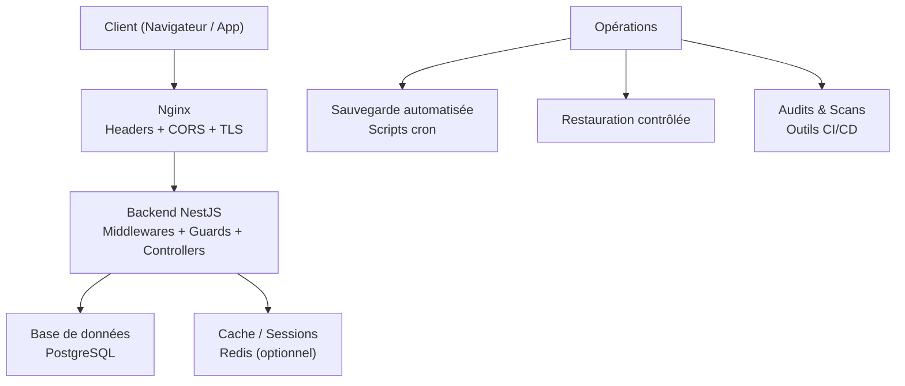
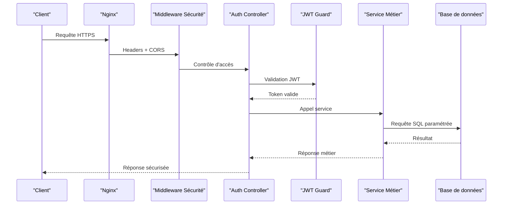
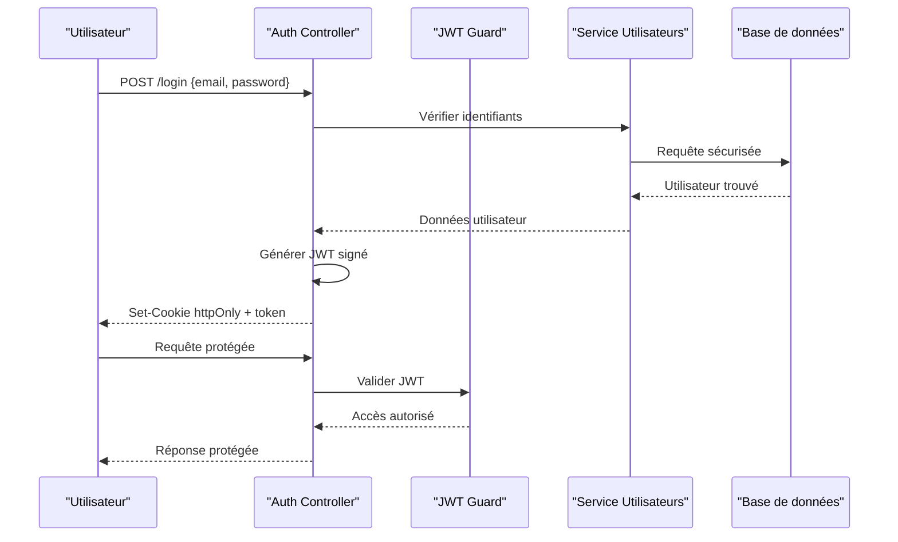
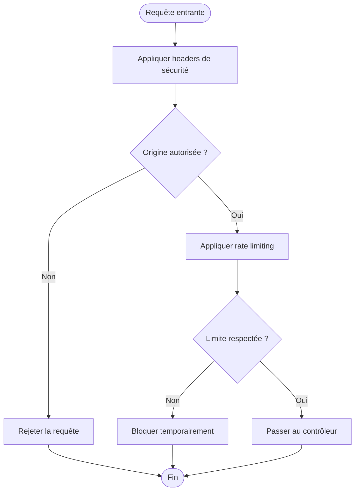
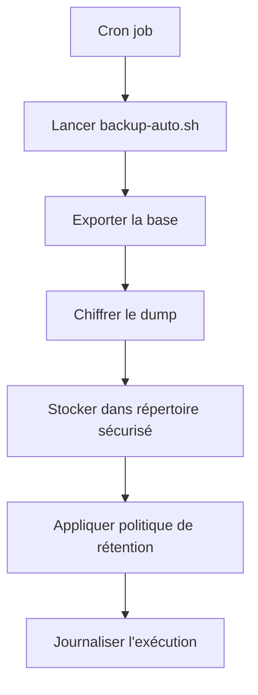
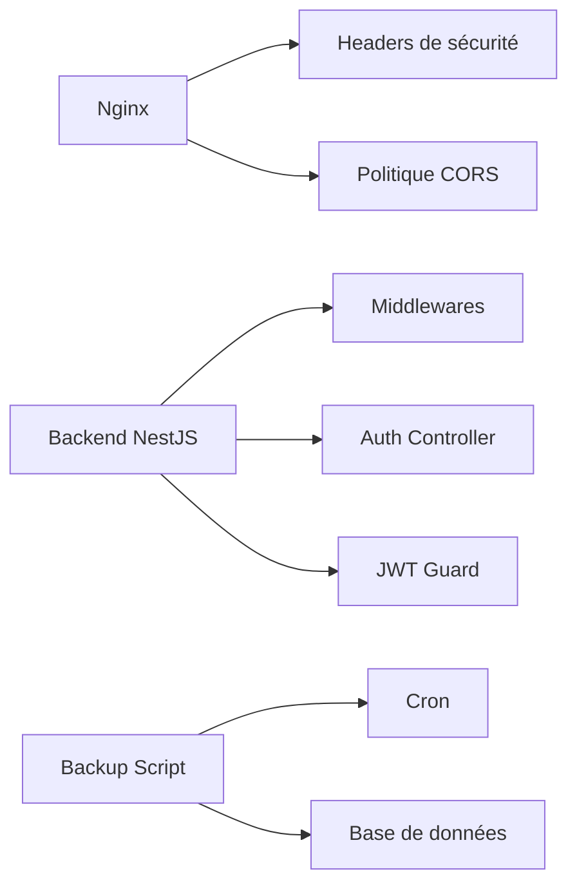

# Sécurité en Production

<cite>
**Fichiers référencés dans ce document**
- [docker-compose.yml](file://docker-compose.yml)
- [nginx.conf](file://docker/nginx.conf)
- [Dockerfile.backend](file://docker/Dockerfile.backend)
- [app.ts](file://backend/src/app.ts)
- [index.ts](file://backend/src/index.ts)
- [env.config.ts](file://backend/src/config/env.config.ts)
- [database.config.ts](file://backend/src/config/database.config.ts)
- [route-registry.ts](file://backend/src/routes/route-registry.ts)
- [auth.controller.ts](file://backend/src/modules/auth/controllers/auth.controller.ts)
- [jwt.guard.ts](file://backend/src/modules/auth/guards/jwt.guard.ts)
- [rate-limiter.middleware.ts](file://backend/src/common/middlewares/rate-limiter.middleware.ts)
- [security.headers.middleware.ts](file://backend/src/common/middlewares/security.headers.middleware.ts)
- [cors.middleware.ts](file://backend/src/common/middlewares/cors.middleware.ts)
- [backup-auto.sh](file://docker/scripts/backup-auto.sh)
- [restore.sh](file://docker/scripts/restore.sh)
- [cron-backup.txt](file://docker/scripts/cron-backup.txt)
- [validate-infrastructure.sh](file://docker/scripts/validate-infrastructure.sh)
- [SECURE-LOGOUT-IMPLEMENTATION.md](file://docs/autres/SECURE-LOGOUT-IMPLEMENTATION.md)
- [GUIDE-TEST-SECURITE.md](file://docs/guides/GUIDE-TEST-SECURITE.md)
- [CORRECTION-CORS-PORTS.md](file://docs/corrections/CORRECTION-CORS-PORTS.md)
- [AUDIT-FRONTEND-STRUCTURE-ACADEMIQUE-COMPLET.md](file://docs/audits/AUDIT-FRONTEND-STRUCTURE-ACADEMIQUE-COMPLET.md)
- [RAPPORT-AUDIT-FINAL-RBAC-v3.md](file://docs/rapports/RAPPORT-AUDIT-FINAL-RBAC-v3.md)
</cite>

## Table des matières
1. [Introduction](#introduction)
2. [Structure du projet](#structure-du-projet)
3. [Composants clés de la sécurité](#composants-clés-de-la-sécurité)
4. [Vue d'ensemble de l'architecture de sécurité](#vue-densemble-de-larchitecture-de-sécurité)
5. [Analyse détaillée des composants](#analyse-détaillée-des-composants)
6. [Analyse des dépendances](#analyse-des-dépendances)
7. [Considérations de performance](#considérations-de-performance)
8. [Guide de dépannage](#guide-de-dépannage)
9. [Conclusion](#conclusion)
10. [Annexes](#annexes)

## Introduction
Ce document présente les bonnes pratiques et configurations de sécurité pour eLISAschool en production. Il couvre le chiffrement et la gestion des secrets, la configuration sécurisée de JWT, les politiques CORS, les headers de sécurité HTTP, les protections contre les attaques courantes (injection SQL, XSS, CSRF), les audits de sécurité réguliers, les scans de vulnérabilités, les mises à jour de sécurité, les sauvegardes sécurisées et les procédures de réponse aux incidents. L’objectif est de fournir une référence complète et actionnable pour les équipes opérationnelles et de développement.

## Structure du projet
Le projet intègre plusieurs couches de sécurité :
- Reverse proxy Nginx avec headers de sécurité et politique CORS centralisée.
- Backend NestJS avec middlewares de sécurité, contrôleurs d’authentification, garde-fous JWT et limites de taux.
- Configuration d’environnement et de base de données via des fichiers dédiés.
- Scripts Docker pour les sauvegardes, restaurations et validation de l’infrastructure.
- Documentation de tests de sécurité et rapports d’audit.

[Ce diagramme est conceptuel et ne mape pas directement des fichiers spécifiques]

## Composants clés de la sécurité
- Gestion des secrets et configuration d’environnement : variables sensibles, rotation, chargement sécurisé.
- Authentification et autorisation : JWT signé, expiration courte, revalidation, guards RBAC.
- Middlewares de sécurité : headers HTTP, protection XSS/CSRF, rate limiting, CORS strict.
- Base de données : connexions chiffrées, utilisateurs limités, migrations versionnées.
- Reverse proxy : terminaison TLS, headers de sécurité, filtrage, compression sécurisée.
- Sauvegardes et restauration : scripts automatisés, rétention, intégrité, test de restauration.
- Audits et scans : outils de sécurité, pipelines CI/CD, documentation et rapports.

**Section sources**
- [env.config.ts](file://backend/src/config/env.config.ts)
- [database.config.ts](file://backend/src/config/database.config.ts)
- [security.headers.middleware.ts](file://backend/src/common/middlewares/security.headers.middleware.ts)
- [cors.middleware.ts](file://backend/src/common/middlewares/cors.middleware.ts)
- [rate-limiter.middleware.ts](file://backend/src/common/middlewares/rate-limiter.middleware.ts)
- [jwt.guard.ts](file://backend/src/modules/auth/guards/jwt.guard.ts)
- [auth.controller.ts](file://backend/src/modules/auth/controllers/auth.controller.ts)
- [nginx.conf](file://docker/nginx.conf)
- [backup-auto.sh](file://docker/scripts/backup-auto.sh)
- [restore.sh](file://docker/scripts/restore.sh)
- [cron-backup.txt](file://docker/scripts/cron-backup.txt)

## Vue d'ensemble de l'architecture de sécurité
La sécurité est assurée par une chaîne de composants qui filtrent et protègent les requêtes avant qu’elles n’atteignent la logique métier :
- Nginx applique TLS, headers de sécurité et politique CORS.
- Le backend NestJS applique des middlewares de sécurité, limite les taux, valide les entrées et vérifie les permissions.
- Les contrôleurs d’authentification émettent et valident des tokens JWT sécurisés.
- La base de données utilise des connexions sécurisées et des migrations versionnées.
- Les scripts de sauvegarde automatisent la rétention et la restauration.

**Diagram sources**
- [nginx.conf](file://docker/nginx.conf)
- [security.headers.middleware.ts](file://backend/src/common/middlewares/security.headers.middleware.ts)
- [cors.middleware.ts](file://backend/src/common/middlewares/cors.middleware.ts)
- [auth.controller.ts](file://backend/src/modules/auth/controllers/auth.controller.ts)
- [jwt.guard.ts](file://backend/src/modules/auth/guards/jwt.guard.ts)
- [database.config.ts](file://backend/src/config/database.config.ts)

**Section sources**
- [app.ts](file://backend/src/app.ts)
- [index.ts](file://backend/src/index.ts)
- [route-registry.ts](file://backend/src/routes/route-registry.ts)

## Analyse détaillée des composants

### Configuration des secrets et environnement
- Variables d’environnement pour les secrets (JWT secret, clés API, bases de données).
- Chargement sécurisé au démarrage de l’application.
- Rotation et stockage hors code source.

Bonnes pratiques :
- Utiliser des gestionnaires de secrets (ex. Vault, AWS Secrets Manager).
- Ne jamais committer de secrets dans le dépôt.
- Appliquer des politiques de rotation régulières.

**Section sources**
- [env.config.ts](file://backend/src/config/env.config.ts)
- [Dockerfile.backend](file://docker/Dockerfile.backend)

### Authentification et JWT
- Émission de tokens JWT signés avec expiration courte.
- Vérification via guard JWT sur les routes protégées.
- Stockage côté client sécurisé (httpOnly cookies ou stockage sécurisé).
- Déconnexion sécurisée invalidant les sessions.

Flux de connexion :

**Diagram sources**
- [auth.controller.ts](file://backend/src/modules/auth/controllers/auth.controller.ts)
- [jwt.guard.ts](file://backend/src/modules/auth/guards/jwt.guard.ts)

**Section sources**
- [auth.controller.ts](file://backend/src/modules/auth/controllers/auth.controller.ts)
- [jwt.guard.ts](file://backend/src/modules/auth/guards/jwt.guard.ts)
- [SECURE-LOGOUT-IMPLEMENTATION.md](file://docs/autres/SECURE-LOGOUT-IMPLEMENTATION.md)

### Middlewares de sécurité et headers HTTP
- Ajout de headers de sécurité (HSTS, CSP, X-Frame-Options, Referrer-Policy, etc.).
- Politique CORS stricte : origines autorisées, méthodes, en-têtes.
- Rate limiting pour prévenir les attaques par force brute.

**Diagram sources**
- [security.headers.middleware.ts](file://backend/src/common/middlewares/security.headers.middleware.ts)
- [cors.middleware.ts](file://backend/src/common/middlewares/cors.middleware.ts)
- [rate-limiter.middleware.ts](file://backend/src/common/middlewares/rate-limiter.middleware.ts)

**Section sources**
- [security.headers.middleware.ts](file://backend/src/common/middlewares/security.headers.middleware.ts)
- [cors.middleware.ts](file://backend/src/common/middlewares/cors.middleware.ts)
- [rate-limiter.middleware.ts](file://backend/src/common/middlewares/rate-limiter.middleware.ts)
- [CORRECTION-CORS-PORTS.md](file://docs/corrections/CORRECTION-CORS-PORTS.md)

### Protection contre les attaques courantes
- Injection SQL : utilisation de requêtes paramétrées et ORM sécurisé.
- XSS : nettoyage des entrées, headers CSP, échappement côté serveur.
- CSRF : validation des tokens, cookies httpOnly, même origine.

Bonnes pratiques :
- Valider et nettoyer toutes les entrées utilisateur.
- Activer CSP strict et désactiver les en-têtes dangereux.
- Utiliser des bibliothèques de validation robustes.

**Section sources**
- [database.config.ts](file://backend/src/config/database.config.ts)
- [security.headers.middleware.ts](file://backend/src/common/middlewares/security.headers.middleware.ts)

### Sauvegardes et restauration
- Sauvegardes automatisées via cron.
- Rétention configurable et stockage sécurisé.
- Restauration contrôlée avec validation d’intégrité.

**Diagram sources**
- [backup-auto.sh](file://docker/scripts/backup-auto.sh)
- [restore.sh](file://docker/scripts/restore.sh)
- [cron-backup.txt](file://docker/scripts/cron-backup.txt)

**Section sources**
- [backup-auto.sh](file://docker/scripts/backup-auto.sh)
- [restore.sh](file://docker/scripts/restore.sh)
- [cron-backup.txt](file://docker/scripts/cron-backup.txt)

### Audits de sécurité et scans de vulnérabilités
- Exécution régulière d’audits frontend/backend.
- Intégration de scanners de vulnérabilités dans le pipeline CI/CD.
- Documentation des résultats et plan d’action.

**Section sources**
- [GUIDE-TEST-SECURITE.md](file://docs/guides/GUIDE-TEST-SECURITE.md)
- [AUDIT-FRONTEND-STRUCTURE-ACADEMIQUE-COMPLET.md](file://docs/audits/AUDIT-FRONTEND-STRUCTURE-ACADEMIQUE-COMPLET.md)
- [RAPPORT-AUDIT-FINAL-RBAC-v3.md](file://docs/rapports/RAPPORT-AUDIT-FINAL-RBAC-v3.md)

## Analyse des dépendances
Les composants de sécurité dépendent les uns des autres de manière cohérente :
- Nginx dépend de la configuration TLS et des headers.
- Le backend dépend des middlewares de sécurité et des guards JWT.
- Les scripts de sauvegarde dépendent des outils système et des permissions.

**Diagram sources**
- [nginx.conf](file://docker/nginx.conf)
- [security.headers.middleware.ts](file://backend/src/common/middlewares/security.headers.middleware.ts)
- [cors.middleware.ts](file://backend/src/common/middlewares/cors.middleware.ts)
- [auth.controller.ts](file://backend/src/modules/auth/controllers/auth.controller.ts)
- [jwt.guard.ts](file://backend/src/modules/auth/guards/jwt.guard.ts)
- [backup-auto.sh](file://docker/scripts/backup-auto.sh)
- [cron-backup.txt](file://docker/scripts/cron-backup.txt)

**Section sources**
- [app.ts](file://backend/src/app.ts)
- [index.ts](file://backend/src/index.ts)
- [route-registry.ts](file://backend/src/routes/route-registry.ts)

## Considérations de performance
- Minimiser l’impact des middlewares de sécurité sur la latence.
- Utiliser le cache pour les vérifications JWT répétées.
- Optimiser les requêtes SQL et indexer les tables critiques.
- Configurer Nginx pour la compression et le keep-alive.

[Ce contenu fournit des recommandations générales sans analyser de fichiers spécifiques]

## Guide de dépannage
- Problèmes de CORS : vérifier les origines autorisées et les ports.
- Erreurs JWT : vérifier le secret, l’expiration et le format du token.
- Sauvegardes échouées : vérifier les permissions et l’espace disque.
- Audits échoués : examiner les logs et corriger les vulnérabilités détectées.

**Section sources**
- [validate-infrastructure.sh](file://docker/scripts/validate-infrastructure.sh)
- [GUIDE-TEST-SECURITE.md](file://docs/guides/GUIDE-TEST-SECURITE.md)

## Conclusion
La sécurité en production pour eLISAschool repose sur une approche multicouche intégrant Nginx, NestJS, JWT, middlewares de sécurité, sauvegardes automatisées et audits réguliers. En suivant les bonnes pratiques décrites ici, vous pouvez renforcer la résilience et la confidentialité de votre application tout en maintenant des performances optimales.

[Ce contenu résume sans analyser de fichiers spécifiques]

## Annexes
- Checklist de déploiement sécurisé : vérifier TLS, headers, CORS, secrets, backups, audits.
- Procédure de réponse aux incidents : isoler, diagnostiquer, corriger, documenter.
- Plan de maintenance : mises à jour, rotations de secrets, tests de restauration.

[Ce contenu fournit des références générales sans analyser de fichiers spécifiques]