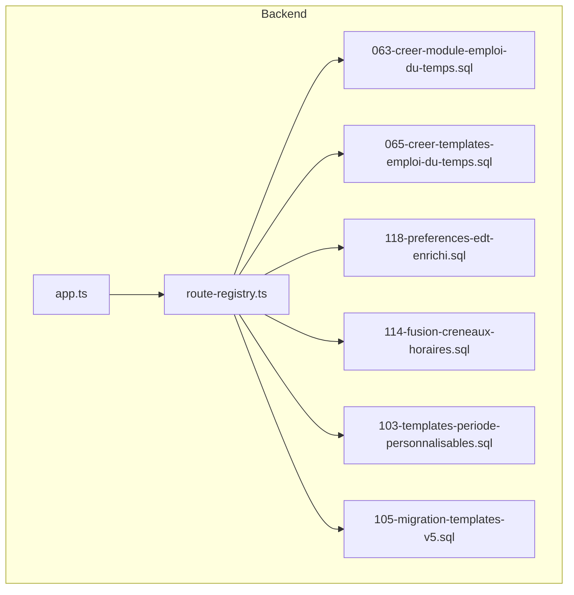
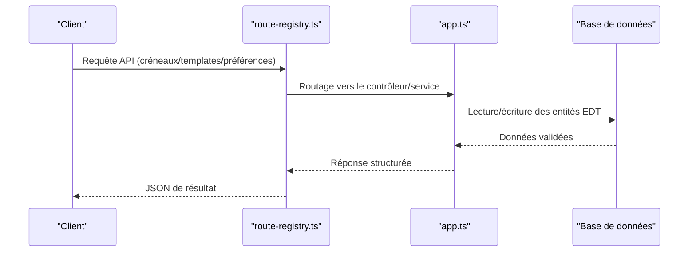
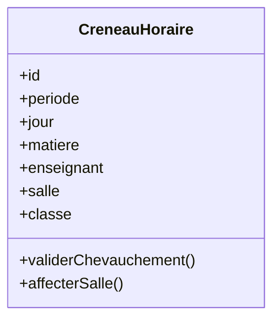
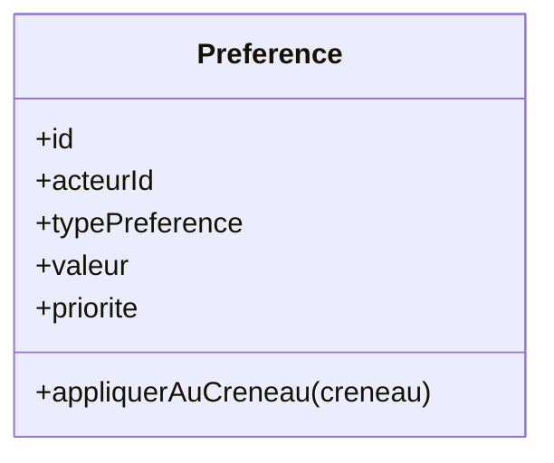
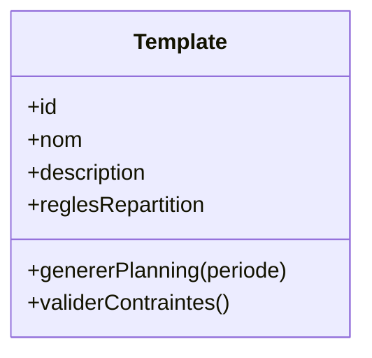
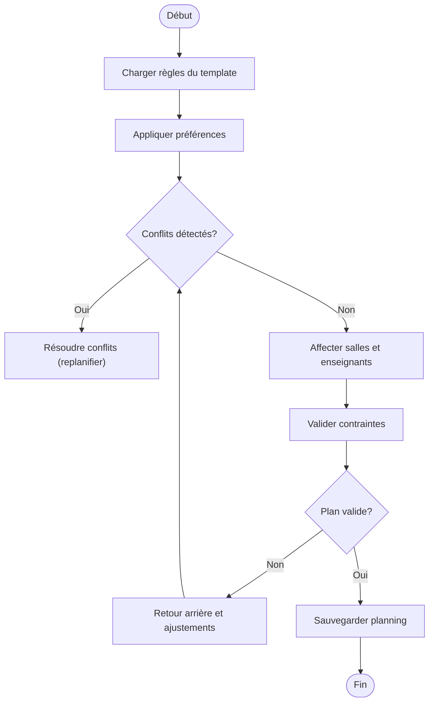
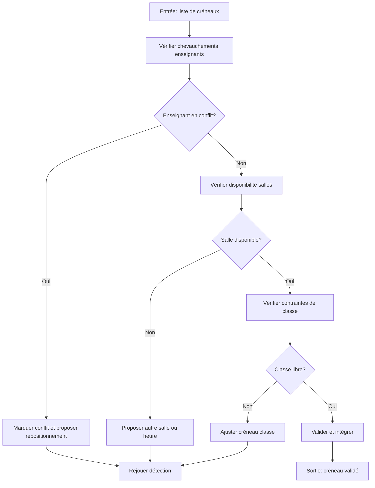
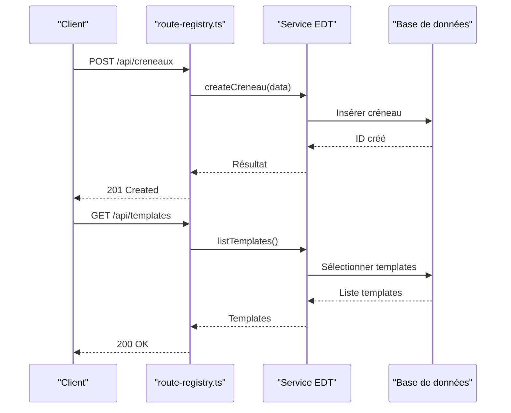
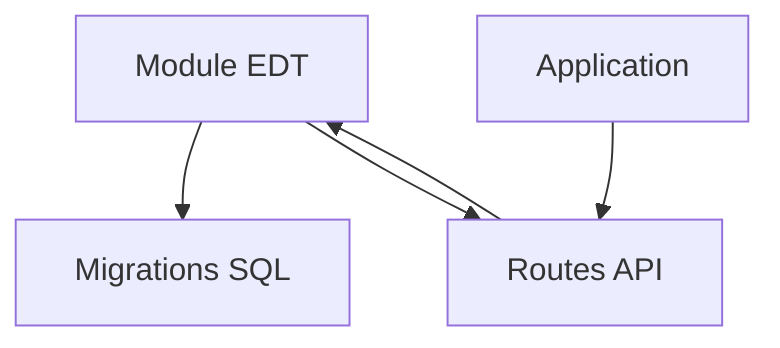

# Emploi du Temps Intelligent

<cite>
**Fichiers référencés dans ce document**
- [063-creer-module-emploi-du-temps.sql](file://backend/database/migrations/063-creer-module-emploi-du-temps.sql)
- [065-creer-templates-emploi-du-temps.sql](file://backend/database/migrations/065-creer-templates-emploi-du-temps.sql)
- [114-fusion-creneaux-horaires.sql](file://backend/database/migrations/114-fusion-creneaux-horaires.sql)
- [118-preferences-edt-enrichi.sql](file://backend/database/migrations/118-preferences-edt-enrichi.sql)
- [103-templates-periode-personnalisables.sql](file://backend/database/migrations/103-templates-periode-personnalisables.sql)
- [105-migration-templates-v5.sql](file://backend/database/migrations/105-migration-templates-v5.sql)
- [IMPLEMENTATION-EMPLOI-DU-TEMPS-COMPLETE.md](file://docs/implementations/IMPLEMENTATION-EMPLOI-DU-TEMPS-COMPLETE.md)
- [route-registry.ts](file://backend/src/routes/route-registry.ts)
- [app.ts](file://backend/src/app.ts)
</cite>

## Table des matières
1. [Introduction](#introduction)
2. [Structure du projet](#structure-du-projet)
3. [Composants clés](#composants-clés)
4. [Vue d'ensemble de l'architecture](#vue-densemble-de-larchitecture)
5. [Analyse détaillée des composants](#analyse-detaillee-des-composants)
6. [Analyse des dépendances](#analyse-des-dependances)
7. [Considérations de performance](#considerations-de-performance)
8. [Guide de dépannage](#guide-de-depannage)
9. [Conclusion](#conclusion)
10. [Annexes](#annexes)

## Introduction
Ce document présente le système d’emploi du temps intelligent d’eLISAschool. Il explique les entités principales (CréneauHoraire, Préférence, Template), leurs relations et contraintes, ainsi que les algorithmes de planification automatique, la détection de conflits et les règles de répartition. Il couvre également les API pour la gestion des créneaux, les templates prédéfinis et les préférences utilisateur, avec des exemples de configuration, des règles métier et des optimisations. Les fonctionnalités avancées incluent la gestion des salles, les conflits enseignants et les modifications manuelles.

## Structure du projet
Le module emploi du temps est implémenté via des migrations SQL qui définissent les tables et contraintes nécessaires à la planification, aux templates et aux préférences. Le registre des routes expose les points d’accès API liés au module. L’application backend initialise les modules et les routes via son point d’entrée principal.

**Sources de diagramme**
- [app.ts](file://backend/src/app.ts)
- [route-registry.ts](file://backend/src/routes/route-registry.ts)
- [063-creer-module-emploi-du-temps.sql](file://backend/database/migrations/063-creer-module-emploi-du-temps.sql)
- [065-creer-templates-emploi-du-temps.sql](file://backend/database/migrations/065-creer-templates-emploi-du-temps.sql)
- [118-preferences-edt-enrichi.sql](file://backend/database/migrations/118-preferences-edt-enrichi.sql)
- [114-fusion-creneaux-horaires.sql](file://backend/database/migrations/114-fusion-creneaux-horaires.sql)
- [103-templates-periode-personnalisables.sql](file://backend/database/migrations/103-templates-periode-personnalisables.sql)
- [105-migration-templates-v5.sql](file://backend/database/migrations/105-migration-templates-v5.sql)

**Sources de section**
- [app.ts](file://backend/src/app.ts)
- [route-registry.ts](file://backend/src/routes/route-registry.ts)
- [063-creer-module-emploi-du-temps.sql](file://backend/database/migrations/063-creer-module-emploi-du-temps.sql)
- [065-creer-templates-emploi-du-temps.sql](file://backend/database/migrations/065-creer-templates-emploi-du-temps.sql)
- [118-preferences-edt-enrichi.sql](file://backend/database/migrations/118-preferences-edt-enrichi.sql)
- [114-fusion-creneaux-horaires.sql](file://backend/database/migrations/114-fusion-creneaux-horaires.sql)
- [103-templates-periode-personnalisables.sql](file://backend/database/migrations/103-templates-periode-personnalisables.sql)
- [105-migration-templates-v5.sql](file://backend/database/migrations/105-migration-templates-v5.sql)

## Composants clés
- CréneauHoraire : représente un bloc horaire dédié à une activité pédagogique (cours, atelier, etc.), avec des contraintes de chevauchement et d’affectation.
- Préférence : définit les souhaits ou restrictions d’un acteur (enseignant, classe, salle) sur les créneaux (période de la journée, jour de la semaine, type de salle, etc.).
- Template : modèle de planning réutilisable qui contient des règles et des séquences de créneaux pour générer automatiquement un emploi du temps cohérent.

Ces trois entités interagissent pour permettre la génération automatique d’emplois du temps tout en respectant les préférences et les contraintes physiques (salles) et humaines (enseignants).

**Sources de section**
- [063-creer-module-emploi-du-temps.sql](file://backend/database/migrations/063-creer-module-emploi-du-temps.sql)
- [065-creer-templates-emploi-du-temps.sql](file://backend/database/migrations/065-creer-templates-emploi-du-temps.sql)
- [118-preferences-edt-enrichi.sql](file://backend/database/migrations/118-preferences-edt-enrichi.sql)

## Vue d'ensemble de l'architecture
Le système s’appuie sur des tables SQL pour stocker les données de planification, des templates pour structurer les règles de génération, et des préférences pour affiner l’algorithme. Les routes exposent des endpoints REST pour manipuler ces entités. L’initialisation de l’application charge les routes et active les modules associés.

**Sources de diagramme**
- [route-registry.ts](file://backend/src/routes/route-registry.ts)
- [app.ts](file://backend/src/app.ts)

## Analyse détaillée des composants

### Entité CréneauHoraire
CréneauHoraire modélise un créneau horaire avec des attributs tels que la période, le jour, la matière, l’enseignant, la salle et la classe concernée. Des contraintes assurent qu’un enseignant ne soit pas doublement affecté et qu’une salle ne soit pas utilisée simultanément.

**Sources de diagramme**
- [063-creer-module-emploi-du-temps.sql](file://backend/database/migrations/063-creer-module-emploi-du-temps.sql)
- [114-fusion-creneaux-horaires.sql](file://backend/database/migrations/114-fusion-creneaux-horaires.sql)

**Sources de section**
- [063-creer-module-emploi-du-temps.sql](file://backend/database/migrations/063-creer-module-emploi-du-temps.sql)
- [114-fusion-creneaux-horaires.sql](file://backend/database/migrations/114-fusion-creneaux-horaires.sql)

### Entité Préférence
Préférence capture les souhaits utilisateurs ou institutionnels (par exemple, éviter certains jours pour un enseignant, privilégier certaines salles pour une matière). Ces préférences influencent l’algorithme de planification pour maximiser la satisfaction des contraintes.

**Sources de diagramme**
- [118-preferences-edt-enrichi.sql](file://backend/database/migrations/118-preferences-edt-enrichi.sql)

**Sources de section**
- [118-preferences-edt-enrichi.sql](file://backend/database/migrations/118-preferences-edt-enrichi.sql)

### Entité Template
Template définit un plan type contenant des séquences de créneaux et des règles de répartition. Il permet de générer rapidement un emploi du temps cohérent pour une période donnée, en se basant sur des modèles prédéfinis ou personnalisables.

**Sources de diagramme**
- [065-creer-templates-emploi-du-temps.sql](file://backend/database/migrations/065-creer-templates-emploi-du-temps.sql)
- [103-templates-periode-personnalisables.sql](file://backend/database/migrations/103-templates-periode-personnalisables.sql)
- [105-migration-templates-v5.sql](file://backend/database/migrations/105-migration-templates-v5.sql)

**Sources de section**
- [065-creer-templates-emploi-du-temps.sql](file://backend/database/migrations/065-creer-templates-emploi-du-temps.sql)
- [103-templates-periode-personnalisables.sql](file://backend/database/migrations/103-templates-periode-personnalisables.sql)
- [105-migration-templates-v5.sql](file://backend/database/migrations/105-migration-templates-v5.sql)

### Algorithme de planification automatique
L’algorithme combine les templates, les préférences et les contraintes physiques/humaines pour produire un emploi du temps valide. Il procède par étapes : chargement des règles, vérification des conflits, affectation des ressources et validation finale.

**Sources de diagramme**
- [IMPLEMENTATION-EMPLOI-DU-TEMPS-COMPLETE.md](file://docs/implementations/IMPLEMENTATION-EMPLOI-DU-TEMPS-COMPLETE.md)

**Sources de section**
- [IMPLEMENTATION-EMPLOI-DU-TEMPS-COMPLETE.md](file://docs/implementations/IMPLEMENTATION-EMPLOI-DU-TEMPS-COMPLETE.md)

### Détection de conflits et règles de répartition
La détection de conflits examine les chevauchements horaires entre enseignants, salles et classes. Les règles de répartition garantissent une distribution équilibrée des cours dans le temps et l’espace.

**Sources de diagramme**
- [063-creer-module-emploi-du-temps.sql](file://backend/database/migrations/063-creer-module-emploi-du-temps.sql)
- [114-fusion-creneaux-horaires.sql](file://backend/database/migrations/114-fusion-creneaux-horaires.sql)

**Sources de section**
- [063-creer-module-emploi-du-temps.sql](file://backend/database/migrations/063-creer-module-emploi-du-temps.sql)
- [114-fusion-creneaux-horaires.sql](file://backend/database/migrations/114-fusion-creneaux-horaires.sql)

### API endpoints pour la gestion des créneaux, templates et préférences
Les endpoints permettent de créer, lire, mettre à jour et supprimer des créneaux, templates et préférences. Ils sont enregistrés dans le registre des routes et exposés par l’application.

**Sources de diagramme**
- [route-registry.ts](file://backend/src/routes/route-registry.ts)

**Sources de section**
- [route-registry.ts](file://backend/src/routes/route-registry.ts)

### Exemples de configuration de l’emploi du temps
- Configuration de base : définir les périodes, les jours et les matières principales.
- Règles métier : interdire les cours le vendredi après-midi, limiter les heures de cours par jour, prioriser les salles équipées pour certaines matières.
- Optimisations : regrouper les cours similaires, répartir équitablement les charges horaires, minimiser les déplacements entre salles.

Ces configurations s’appuient sur les templates et les préférences pour guider l’algorithme de planification.

**Sources de section**
- [065-creer-templates-emploi-du-temps.sql](file://backend/database/migrations/065-creer-templates-emploi-du-temps.sql)
- [118-preferences-edt-enrichi.sql](file://backend/database/migrations/118-preferences-edt-enrichi.sql)

### Fonctionnalités avancées
- Gestion des salles : vérifier la capacité, les équipements et la disponibilité.
- Conflits enseignants : détecter et résoudre les chevauchements d’horaires.
- Modifications manuelles : permettre aux administrateurs de corriger ou ajuster le planning généré automatiquement.

Ces fonctionnalités améliorent la robustesse et l’adaptabilité du système face à des situations complexes.

**Sources de section**
- [063-creer-module-emploi-du-temps.sql](file://backend/database/migrations/063-creer-module-emploi-du-temps.sql)
- [114-fusion-creneaux-horaires.sql](file://backend/database/migrations/114-fusion-creneaux-horaires.sql)

## Analyse des dépendances
Le module emploi du temps dépend des migrations SQL pour la structure des données et des routes pour l’exposition des API. L’application principale orchestre le chargement des modules et des routes.

**Sources de diagramme**
- [app.ts](file://backend/src/app.ts)
- [route-registry.ts](file://backend/src/routes/route-registry.ts)
- [063-creer-module-emploi-du-temps.sql](file://backend/database/migrations/063-creer-module-emploi-du-temps.sql)

**Sources de section**
- [app.ts](file://backend/src/app.ts)
- [route-registry.ts](file://backend/src/routes/route-registry.ts)
- [063-creer-module-emploi-du-temps.sql](file://backend/database/migrations/063-creer-module-emploi-du-temps.sql)

## Considérations de performance
- Indexation des tables de créneaux et de préférences pour accélérer les requêtes de recherche et de validation.
- Mise en cache des templates fréquemment utilisés pour réduire la charge de calcul.
- Validation incrémentale des conflits lors des mises à jour partielles pour limiter les recalculs complets.

[Pas de sources nécessaires car cette section fournit des conseils généraux]

## Guide de dépannage
- Erreurs de chevauchement : vérifier les contraintes de disponibilité des enseignants et des salles.
- Problèmes de génération : examiner les templates et les préférences pour identifier les règles contradictoires.
- Performances dégradées : analyser les index et les requêtes SQL critiques.

**Sources de section**
- [063-creer-module-emploi-du-temps.sql](file://backend/database/migrations/063-creer-module-emploi-du-temps.sql)
- [118-preferences-edt-enrichi.sql](file://backend/database/migrations/118-preferences-edt-enrichi.sql)

## Conclusion
Le système d’emploi du temps intelligent d’eLISAschool offre une approche robuste et flexible pour la planification automatique, basée sur des entités bien définies, des templates réutilisables et des préférences configurables. La détection de conflits et les règles de répartition garantissent la cohérence du planning, tandis que les fonctionnalités avancées permettent une gestion fine des ressources et des contraintes spécifiques.

[Pas de sources nécessaires car cette section résume sans analyser de fichiers spécifiques]

## Annexes
- Documentation d’implémentation complète : [IMPLEMENTATION-EMPLOI-DU-TEMPS-COMPLETE.md](file://docs/implementations/IMPLEMENTATION-EMPLOI-DU-TEMPS-COMPLETE.md)
- Migrations clés : [063-creer-module-emploi-du-temps.sql](file://backend/database/migrations/063-creer-module-emploi-du-temps.sql), [065-creer-templates-emploi-du-temps.sql](file://backend/database/migrations/065-creer-templates-emploi-du-temps.sql), [118-preferences-edt-enrichi.sql](file://backend/database/migrations/118-preferences-edt-enrichi.sql)

**Sources de section**
- [IMPLEMENTATION-EMPLOI-DU-TEMPS-COMPLETE.md](file://docs/implementations/IMPLEMENTATION-EMPLOI-DU-TEMPS-COMPLETE.md)
- [063-creer-module-emploi-du-temps.sql](file://backend/database/migrations/063-creer-module-emploi-du-temps.sql)
- [065-creer-templates-emploi-du-temps.sql](file://backend/database/migrations/065-creer-templates-emploi-du-temps.sql)
- [118-preferences-edt-enrichi.sql](file://backend/database/migrations/118-preferences-edt-enrichi.sql)