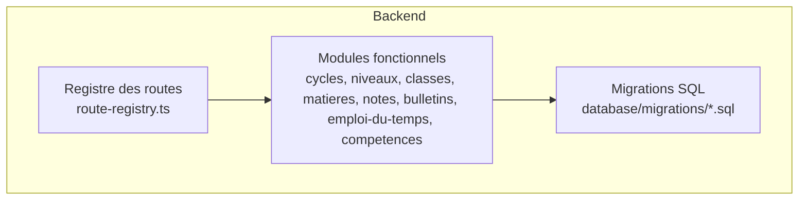
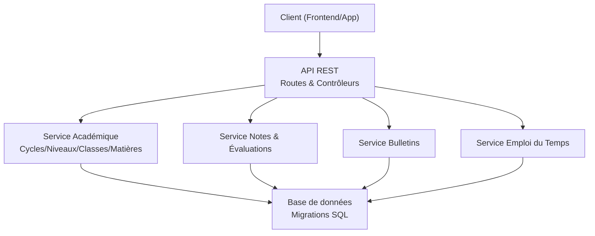
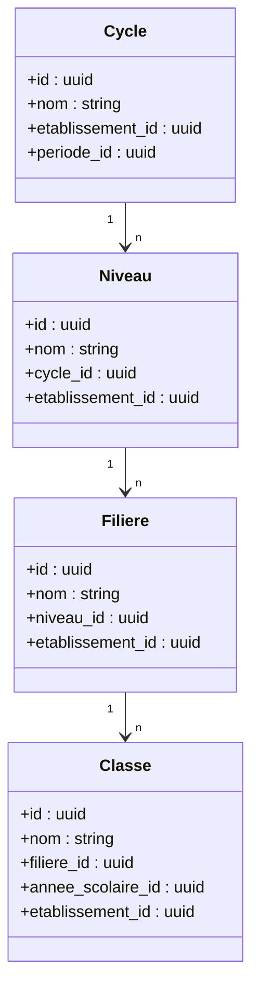
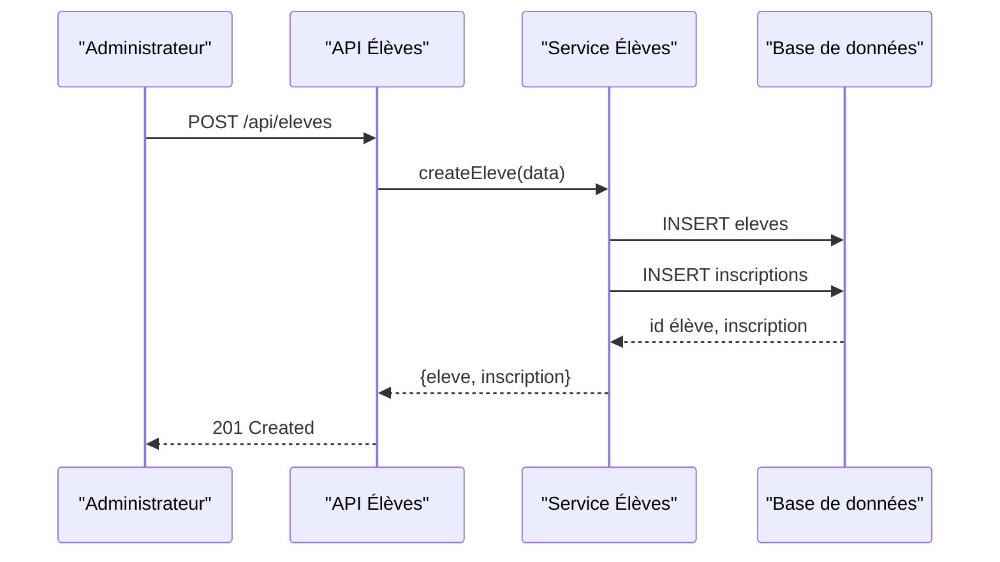
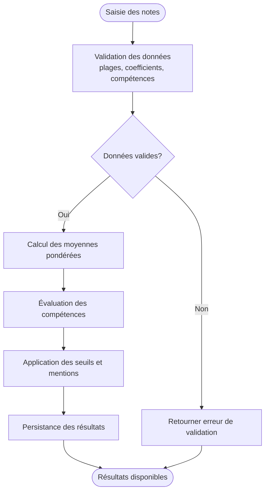
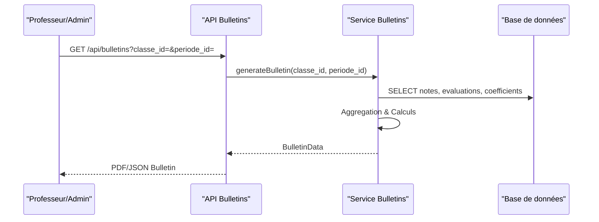
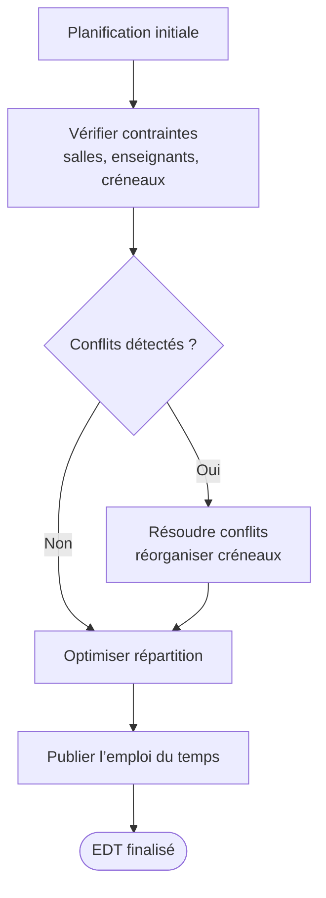
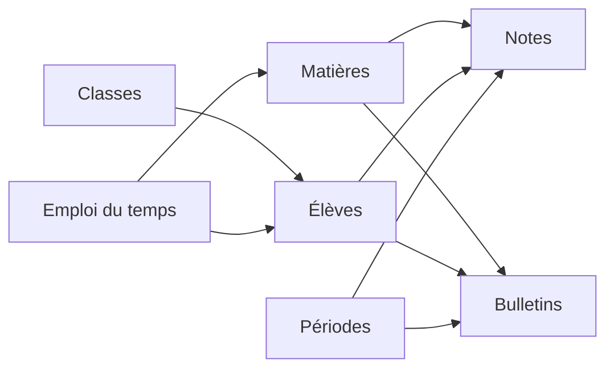
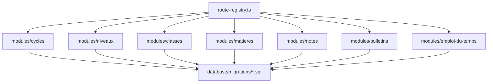

# Gestion Académique

<cite>
**Fichiers référencés dans ce document**
- [053-structure-academique-complete.sql](file://backend/database/migrations/053-structure-academique-complete.sql)
- [054-refonte-structure-academique-v2.sql](file://backend/database/migrations/054-refonte-structure-academique-v2.sql)
- [054-structure-academique-complete-fr-en.sql](file://backend/database/migrations/054-structure-academique-complete-fr-en.sql)
- [055-structure-academique-ameliorations.sql](file://backend/database/migrations/055-structure-academique-ameliorations.sql)
- [058-multi-tenant-structure-academique.sql](file://backend/database/migrations/058-multi-tenant-structure-academique.sql)
- [059-ajouter-matiere-sous-systeme.sql](file://backend/database/migrations/059-ajouter-matiere-sous-systeme.sql)
- [060-ajouter-affectation-matiere-coefficient.sql](file://backend/database/migrations/060-ajouter-affectation-matiere-coefficient.sql)
- [061-creer-table-bulletins-matieres.sql](file://backend/database/migrations/061-creer-table-bulletins-matieres.sql)
- [062-creer-table-evaluations-competences.sql](file://backend/database/migrations/062-creer-table-evaluations-competences.sql)
- [063-creer-module-emploi-du-temps.sql](file://backend/database/migrations/063-creer-module-emploi-du-temps.sql)
- [064-validateur-sous-systeme.sql](file://backend/database/migrations/064-validateur-sous-systeme.sql)
- [065-templates-emploi-du-temps.sql](file://backend/database/migrations/065-templates-emploi-du-temps.sql)
- [072-scoping-cycles-niveaux.sql](file://backend/database/migrations/072-scoping-cycles-niveaux.sql)
- [073-competence-unique-composite.sql](file://backend/database/migrations/073-competence-unique-composite.sql)
- [074-matiere-niveau-unique-composite.sql](file://backend/database/migrations/074-matiere-niveau-unique-composite.sql)
- [088-refactorisation-architecture-academique.sql](file://backend/database/migrations/088-refactorisation-architecture-academique.sql)
- [089-finalisation-architecture-academique-v2.sql](file://backend/database/migrations/089-finalisation-architecture-academique-v2.sql)
- [091-peuplement-architecture-academique.sql](file://backend/database/migrations/091-peuplement-architecture-academique.sql)
- [092-refactorisation-classeAnneeId.sql](file://backend/database/migrations/092-refactorisation-classeAnneeId.sql)
- [104-refonte-periodes-niveaux-configurables.sql](file://backend/database/migrations/104-refonte-periodes-niveaux-configurables.sql)
- [105-migration-templates-v5.sql](file://backend/database/migrations/105-migration-templates-v5.sql)
- [116-programme-intemporel.sql](file://backend/database/migrations/116-programme-intemporel.sql)
- [117-heure-cours-classe-annee.sql](file://backend/database/migrations/117-heure-cours-classe-annee.sql)
- [118-preferences-edt-enrichi.sql](file://backend/database/migrations/118-preferences-edt-enrichi.sql)
- [123-refonte-notes-bulletins.sql](file://backend/database/migrations/123-refonte-notes-bulletins.sql)
- [src/modules/cycles/index.ts](file://backend/src/modules/cycles/index.ts)
- [src/modules/niveaux/index.ts](file://backend/src/modules/niveaux/index.ts)
- [src/modules/classes/index.ts](file://backend/src/modules/classes/index.ts)
- [src/modules/matieres/index.ts](file://backend/src/modules/matieres/index.ts)
- [src/modules/notes/index.ts](file://backend/src/modules/notes/index.ts)
- [src/modules/bulletins/index.ts](file://backend/src/modules/bulletins/index.ts)
- [src/modules/emploi-du-temps/index.ts](file://backend/src/modules/emploi-du-temps/index.ts)
- [src/modules/competences/index.ts](file://backend/src/modules/competences/index.ts)
- [src/routes/route-registry.ts](file://backend/src/routes/route-registry.ts)
</cite>

## Table des matières
1. [Introduction](#introduction)
2. [Structure du projet](#structure-du-projet)
3. [Composants clés](#composants-clés)
4. [Vue d’ensemble de l’architecture](#vue-densemble-de-larchitecture)
5. [Analyse détaillée des composants](#analyse-detaillee-des-composants)
6. [Analyse des dépendances](#analyse-des-dependances)
7. [Considérations de performance](#considerations-de-performance)
8. [Guide de dépannage](#guide-de-depannage)
9. [Conclusion](#conclusion)
10. [Annexes](#annexes)

## Introduction
Ce document présente la documentation complète du module de gestion académique d’eLISAschool. Il couvre la structure académique configurable (cycles, niveaux, classes), la gestion des élèves et inscriptions, le système de notes et évaluations, la génération de bulletins, ainsi que l’emploi du temps intelligent. Il détaille les entités de données, les flux métier, les règles de validation spécifiques au contexte éducatif africain, et les intégrations entre les sous-modules (élèves, matières, notes, bulletins). Des exemples d’endpoints API, des schémas de base de données et des cas d’utilisation concrets sont fournis pour faciliter la compréhension et l’intégration.

## Structure du projet
Le backend est organisé en modules par fonctionnalité, chacun contenant ses contrôleurs, services, DTOs et migrations associées. Les migrations SQL définissent l’évolution du schéma de la base de données, tandis que les routes sont centralisées dans un registre.

**Sources de section**
- [src/routes/route-registry.ts](file://backend/src/routes/route-registry.ts)
- [backend/database/migrations/053-structure-academique-complete.sql](file://backend/database/migrations/053-structure-academique-complete.sql)

## Composants clés
- Structure académique : cycles, niveaux, filières, classes, années scolaires, périodes.
- Élèves et responsables : gestion des profils, inscriptions, affectations.
- Matières et programmes : définition des matières, coefficients, compétences, programmes pédagogiques.
- Notes et évaluations : saisie, calculs pondérés, compétences, seuils, validations.
- Bulletins : agrégation des résultats, templates, export.
- Emploi du temps : planification intelligente, conflits, salles, enseignants, créneaux.

**Sources de section**
- [backend/database/migrations/053-structure-academique-complete.sql](file://backend/database/migrations/053-structure-academique-complete.sql)
- [backend/database/migrations/059-ajouter-matiere-sous-systeme.sql](file://backend/database/migrations/059-ajouter-matiere-sous-systeme.sql)
- [backend/database/migrations/060-ajouter-affectation-matiere-coefficient.sql](file://backend/database/migrations/060-ajouter-affectation-matiere-coefficient.sql)
- [backend/database/migrations/061-creer-table-bulletins-matieres.sql](file://backend/database/migrations/061-creer-table-bulletins-matieres.sql)
- [backend/database/migrations/062-creer-table-evaluations-competences.sql](file://backend/database/migrations/062-creer-table-evaluations-competences.sql)
- [backend/database/migrations/063-creer-module-emploi-du-temps.sql](file://backend/database/migrations/063-creer-module-emploi-du-temps.sql)

## Vue d’ensemble de l’architecture
L’architecture suit une séparation claire entre les couches API (routes), logique métier (services), et persistance (migrations SQL). Les modules académiques communiquent via des interfaces bien définies et respectent le multi-tenant par établissement.

**Sources de diagrammes**
- [backend/src/routes/route-registry.ts](file://backend/src/routes/route-registry.ts)
- [backend/database/migrations/053-structure-academique-complete.sql](file://backend/database/migrations/053-structure-academique-complete.sql)

## Analyse détaillée des composants

### Structure académique configurable
La structure académique est modélisée par des entités hiérarchiques : cycles → niveaux → filières → classes. Chaque niveau peut être associé à des matières avec coefficients et compétences. Les migrations assurent l’intégrité référentielle et le scoping par établissement.

**Sources de diagrammes**
- [backend/database/migrations/053-structure-academique-complete.sql](file://backend/database/migrations/053-structure-academique-complete.sql)
- [backend/database/migrations/054-refonte-structure-academique-v2.sql](file://backend/database/migrations/054-refonte-structure-academique-v2.sql)
- [backend/database/migrations/058-multi-tenant-structure-academique.sql](file://backend/database/migrations/058-multi-tenant-structure-academique.sql)
- [backend/database/migrations/072-scoping-cycles-niveaux.sql](file://backend/database/migrations/072-scoping-cycles-niveaux.sql)

**Sources de section**
- [backend/src/modules/cycles/index.ts](file://backend/src/modules/cycles/index.ts)
- [backend/src/modules/niveaux/index.ts](file://backend/src/modules/niveaux/index.ts)
- [backend/src/modules/classes/index.ts](file://backend/src/modules/classes/index.ts)

### Gestion des élèves et inscriptions
Les élèves sont liés aux classes et aux années scolaires. Les inscriptions incluent des informations administratives et financières. Les responsables peuvent être associés à plusieurs élèves.

**Sources de diagrammes**
- [backend/database/migrations/024-eleve-champs-additionnels.sql](file://backend/database/migrations/024-eleve-champs-additionnels.sql)
- [backend/database/migrations/049-ameliorations-inscription-finances.sql](file://backend/database/migrations/049-ameliorations-inscription-finances.sql)

**Sources de section**
- [backend/database/migrations/024-eleve-champs-additionnels.sql](file://backend/database/migrations/024-eleve-champs-additionnels.sql)
- [backend/database/migrations/049-ameliorations-inscription-finances.sql](file://backend/database/migrations/049-ameliorations-inscription-finances.sql)

### Système de notes et évaluations
Le système supporte les notes traditionnelles et les évaluations par compétences. Les coefficients sont appliqués au niveau des matières et des séquences d’évaluation. Les seuils et les mentions sont configurables par niveau/période.

**Sources de diagrammes**
- [backend/database/migrations/060-ajouter-affectation-matiere-coefficient.sql](file://backend/database/migrations/060-ajouter-affectation-matiere-coefficient.sql)
- [backend/database/migrations/062-creer-table-evaluations-competences.sql](file://backend/database/migrations/062-creer-table-evaluations-competences.sql)
- [backend/database/migrations/123-refonte-notes-bulletins.sql](file://backend/database/migrations/123-refonte-notes-bulletins.sql)

**Sources de section**
- [backend/src/modules/notes/index.ts](file://backend/src/modules/notes/index.ts)
- [backend/src/modules/competences/index.ts](file://backend/src/modules/competences/index.ts)

### Génération de bulletins
Les bulletins agrègent les notes et évaluations par matière et compétence, appliquent les coefficients et génèrent des documents selon des templates configurables.

**Sources de diagrammes**
- [backend/database/migrations/061-creer-table-bulletins-matieres.sql](file://backend/database/migrations/061-creer-table-bulletins-matieres.sql)
- [backend/database/migrations/105-migration-templates-v5.sql](file://backend/database/migrations/105-migration-templates-v5.sql)

**Sources de section**
- [backend/src/modules/bulletins/index.ts](file://backend/src/modules/bulletins/index.ts)

### Emploi du temps intelligent
L’emploi du temps intègre des contraintes (salles, enseignants, créneaux) et propose des suggestions basées sur des règles de conflit et de répartition.

**Sources de diagrammes**
- [backend/database/migrations/063-creer-module-emploi-du-temps.sql](file://backend/database/migrations/063-creer-module-emploi-du-temps.sql)
- [backend/database/migrations/065-templates-emploi-du-temps.sql](file://backend/database/migrations/065-templates-emploi-du-temps.sql)
- [backend/database/migrations/117-heure-cours-classe-annee.sql](file://backend/database/migrations/117-heure-cours-classe-annee.sql)
- [backend/database/migrations/118-preferences-edt-enrichi.sql](file://backend/database/migrations/118-preferences-edt-enrichi.sql)

**Sources de section**
- [backend/src/modules/emploi-du-temps/index.ts](file://backend/src/modules/emploi-du-temps/index.ts)

### Intégrations entre sous-modules
- Matières → Notes : coefficients et compétences influencent les calculs.
- Classes → Élèves : affectation des élèves aux classes pour les bulletins.
- Périodes → Notes/Bulletins : cadrage temporel des évaluations.
- EDT → Matières/Enseignants : planification cohérente avec les ressources.

**Sources de diagrammes**
- [backend/database/migrations/059-ajouter-matiere-sous-systeme.sql](file://backend/database/migrations/059-ajouter-matiere-sous-systeme.sql)
- [backend/database/migrations/060-ajouter-affectation-matiere-coefficient.sql](file://backend/database/migrations/060-ajouter-affectation-matiere-coefficient.sql)
- [backend/database/migrations/104-refonte-periodes-niveaux-configurables.sql](file://backend/database/migrations/104-refonte-periodes-niveaux-configurables.sql)

## Analyse des dépendances
Les modules académiques dépendent fortement des migrations SQL qui garantissent l’intégrité des données. Le registre des routes expose les endpoints nécessaires à l’orchestration des workflows.

**Sources de diagrammes**
- [backend/src/routes/route-registry.ts](file://backend/src/routes/route-registry.ts)
- [backend/database/migrations/088-refactorisation-architecture-academique.sql](file://backend/database/migrations/088-refactorisation-architecture-academique.sql)
- [backend/database/migrations/089-finalisation-architecture-academique-v2.sql](file://backend/database/migrations/089-finalisation-architecture-academique-v2.sql)

**Sources de section**
- [backend/src/routes/route-registry.ts](file://backend/src/routes/route-registry.ts)

## Considérations de performance
- Indexation des tables critiques (classes, notes, bulletins, emplois du temps).
- Requêtes optimisées pour les agrégations de notes et bulletins.
- Mise en cache des configurations de périodes et coefficients.
- Partitionnement possible des données par année scolaire.

[Section sans sources car cette section fournit des conseils généraux]

## Guide de dépannage
- Vérifier les migrations appliquées et les erreurs de contrainte.
- Valider les coefficients et seuils avant génération de bulletins.
- Consulter les logs des contrôles de conflits dans l’emploi du temps.
- Utiliser les scripts de vérification et les rapports de migration.

**Sources de section**
- [backend/database/migrations/123-refonte-notes-bulletins.sql](file://backend/database/migrations/123-refonte-notes-bulletins.sql)
- [backend/database/migrations/063-creer-module-emploi-du-temps.sql](file://backend/database/migrations/063-creer-module-emploi-du-temps.sql)

## Conclusion
Le module de gestion académique d’eLISAschool offre une architecture robuste et évolutive, adaptée au contexte éducatif africain. La modularité, la configuration fine des structures et processus, ainsi que les outils de planification et d’évaluation permettent une prise en charge complète du parcours scolaire.

[Section sans sources car cette section résume sans analyser de fichiers spécifiques]

## Annexes

### Exemples d’endpoints API
- Structure académique :
  - GET /api/cycles
  - POST /api/niveaux
  - PUT /api/classes/{id}
- Élèves et inscriptions :
  - POST /api/eleves
  - GET /api/eleves/{id}/inscriptions
- Notes et évaluations :
  - POST /api/notes
  - GET /api/evaluations/competences
- Bulletins :
  - GET /api/bulletins?classe_id=&periode_id=
- Emploi du temps :
  - POST /api/edt/schedule
  - GET /api/edt/conflicts

[Section sans sources car cette section liste des endpoints conceptuels]

### Schémas de base de données
- Tables principales : cycles, niveaux, filières, classes, eleves, matieres, notes, evaluations_competences, bulletins, edt_creneaux.
- Relations : hiérarchie cycle→niveau→filière→classe, liens élèves→classes, matières→coefficients, périodes→évaluations.

**Sources de section**
- [backend/database/migrations/053-structure-academique-complete.sql](file://backend/database/migrations/053-structure-academique-complete.sql)
- [backend/database/migrations/061-creer-table-bulletins-matieres.sql](file://backend/database/migrations/061-creer-table-bulletins-matieres.sql)
- [backend/database/migrations/062-creer-table-evaluations-competences.sql](file://backend/database/migrations/062-creer-table-evaluations-competences.sql)
- [backend/database/migrations/063-creer-module-emploi-du-temps.sql](file://backend/database/migrations/063-creer-module-emploi-du-temps.sql)

### Cas d’utilisation concrets
- Configuration d’un nouveau cycle et niveau pour une école primaire.
- Saisie des notes trimestrielles avec application des coefficients.
- Génération automatique des bulletins finaux avec mention.
- Planification hebdomadaire des cours avec résolution de conflits.

[Section sans sources car cette section décrit des scénarios conceptuels]