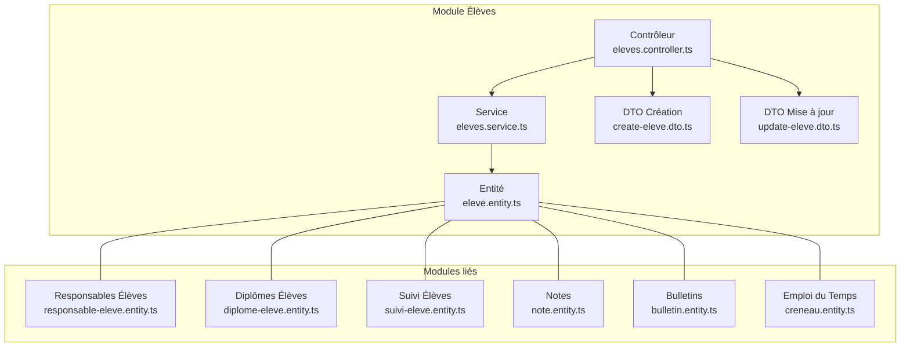
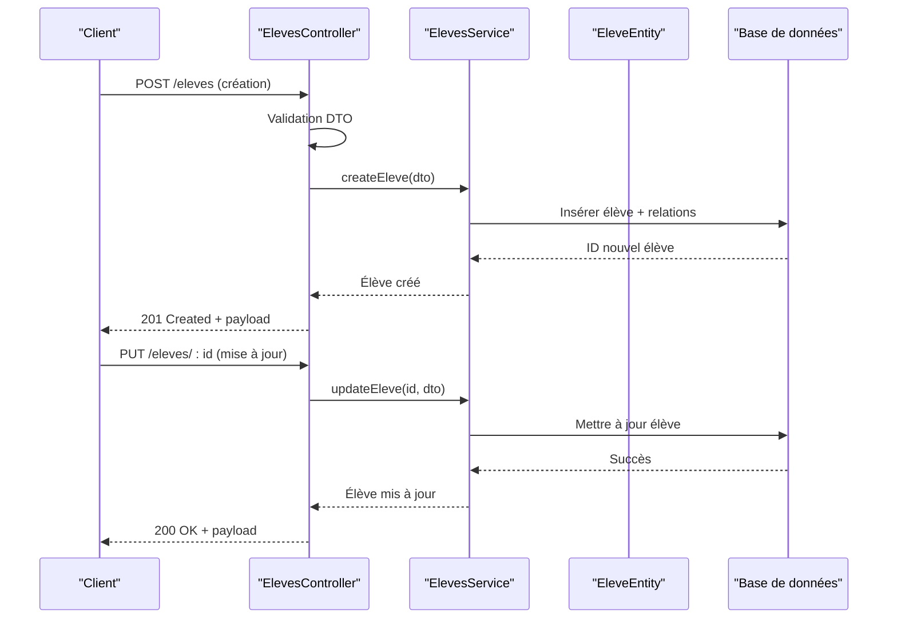
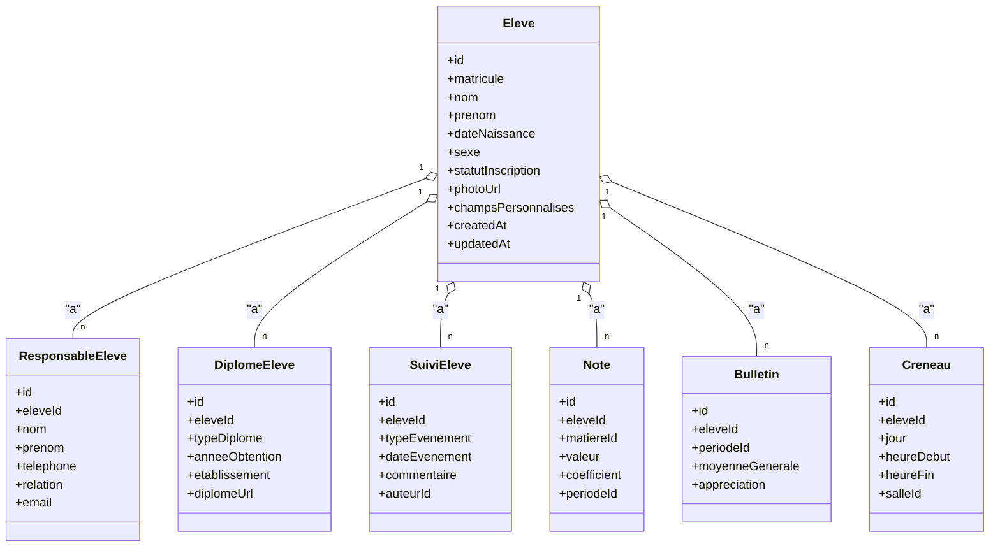
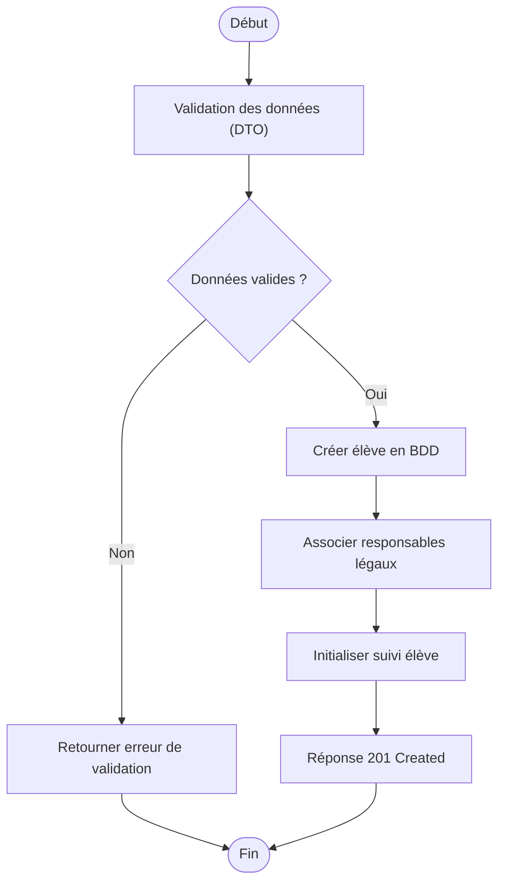
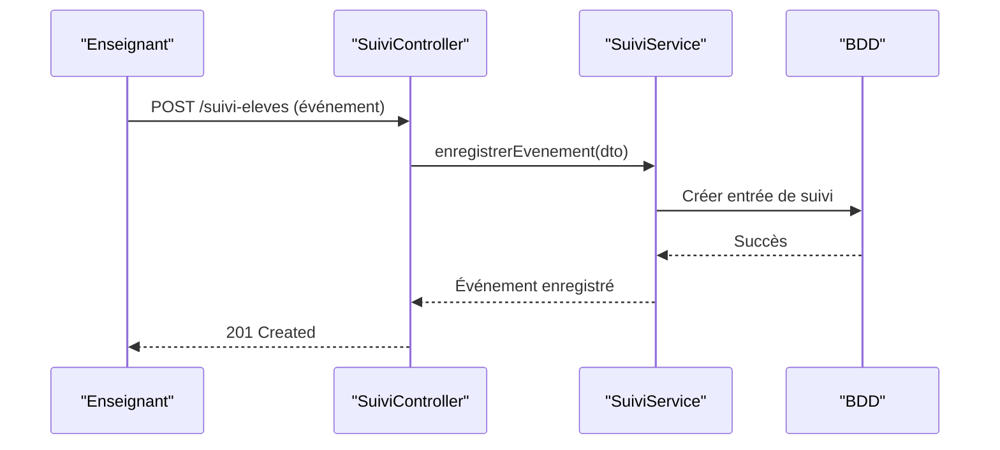
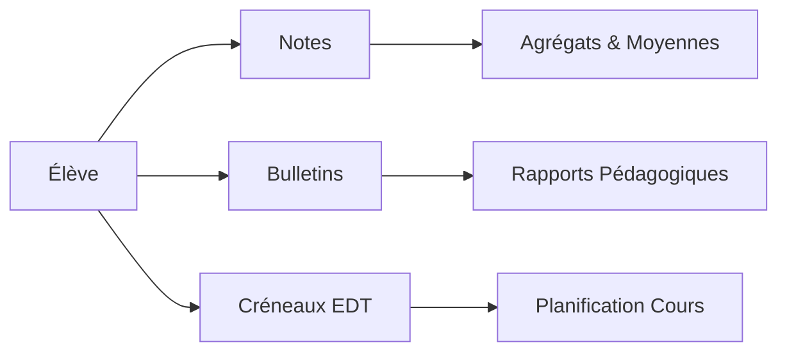
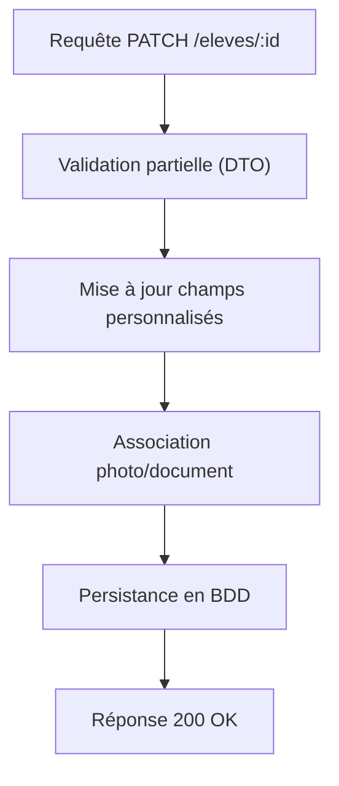
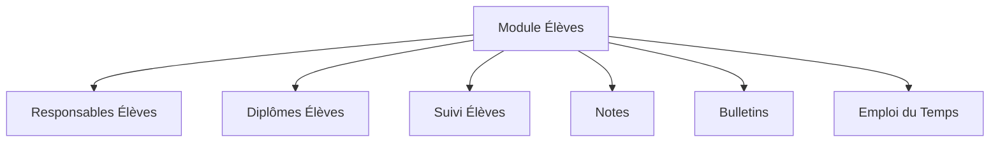

# Gestion des Élèves

<cite>
**Fichiers référencés dans ce document**
- [backend/src/modules/eleves/entities/eleve.entity.ts](file://backend/src/modules/eleves/entities/eleve.entity.ts)
- [backend/src/modules/eleves/dto/create-eleve.dto.ts](file://backend/src/modules/eleves/dto/create-eleve.dto.ts)
- [backend/src/modules/eleves/dto/update-eleve.dto.ts](file://backend/src/modules/eleves/dto/update-eleve.dto.ts)
- [backend/src/modules/eleves/controllers/eleves.controller.ts](file://backend/src/modules/eleves/controllers/eleves.controller.ts)
- [backend/src/modules/eleves/services/eleves.service.ts](file://backend/src/modules/eleves/services/eleves.service.ts)
- [backend/src/modules/responsables-eleves/entities/responsable-eleve.entity.ts](file://backend/src/modules/responsables-eleves/entities/responsable-eleve.entity.ts)
- [backend/src/modules/diplomes-eleves/entities/diplome-eleve.entity.ts](file://backend/src/modules/diplomes-eleves/entities/diplome-eleve.entity.ts)
- [backend/src/modules/suivi-eleves/entities/suivi-eleve.entity.ts](file://backend/src/modules/suivi-eleves/entities/suivi-eleve.entity.ts)
- [backend/src/modules/notes/entities/note.entity.ts](file://backend/src/modules/notes/entities/note.entity.ts)
- [backend/src/modules/bulletins/entities/bulletin.entity.ts](file://backend/src/modules/bulletins/entities/bulletin.entity.ts)
- [backend/src/modules/emploi-du-temps/entities/creneau.entity.ts](file://backend/src/modules/emploi-du-temps/entities/creneau.entity.ts)
- [backend/database/migrations/024-eleve-champs-additionnels.sql](file://backend/database/migrations/024-eleve-champs-additionnels.sql)
- [backend/database/migrations/030-suivi-eleves.sql](file://backend/database/migrations/030-suivi-eleves.sql)
- [backend/database/migrations/123-refonte-notes-bulletins.sql](file://backend/database/migrations/123-refonte-notes-bulletins.sql)
- [backend/database/migrations/063-creer-module-emploi-du-temps.sql](file://backend/database/migrations/063-creer-module-emploi-du-temps.sql)
</cite>

## Table des matières
1. [Introduction](#introduction)
2. [Structure du projet](#structure-du-projet)
3. [Composants clés](#composants-clés)
4. [Vue d’ensemble de l’architecture](#vue-densemble-de-larchitecture)
5. [Analyse détaillée des composants](#analyse-detailee-des-composants)
6. [Analyse des dépendances](#analyse-des-dependances)
7. [Considérations de performance](#considerations-de-performance)
8. [Guide de dépannage](#guide-de-depannage)
9. [Conclusion](#conclusion)
10. [Annexes](#annexes)

## Introduction
Ce document décrit en détail le module de gestion des élèves d’eLISAschool. Il couvre l’entité Élève, ses attributs et relations avec les responsables légaux et les diplômes, ainsi que les workflows d’inscription, de mise à jour et de suivi. Il présente également les endpoints API, les validations de données, les règles métier spécifiques, et les intégrations avec les modules de notes, bulletins et emploi du temps. Les fonctionnalités avancées telles que les champs personnalisés, les photos et les documents associés sont documentées.

## Structure du projet
Le module Élèves est organisé selon une architecture modulaire typique NestJS :
- Entités (ORM) définissant la structure de données
- DTOs pour la validation des entrées
- Contrôleurs exposant les routes REST
- Services implémentant la logique métier
- Migrations SQL assurant la cohérence du schéma

**Sources de diagramme**
- [backend/src/modules/eleves/controllers/eleves.controller.ts](file://backend/src/modules/eleves/controllers/eleves.controller.ts)
- [backend/src/modules/eleves/services/eleves.service.ts](file://backend/src/modules/eleves/services/eleves.service.ts)
- [backend/src/modules/eleves/entities/eleve.entity.ts](file://backend/src/modules/eleves/entities/eleve.entity.ts)
- [backend/src/modules/eleves/dto/create-eleve.dto.ts](file://backend/src/modules/eleves/dto/create-eleve.dto.ts)
- [backend/src/modules/eleves/dto/update-eleve.dto.ts](file://backend/src/modules/eleves/dto/update-eleve.dto.ts)
- [backend/src/modules/responsables-eleves/entities/responsable-eleve.entity.ts](file://backend/src/modules/responsables-eleves/entities/responsable-eleve.entity.ts)
- [backend/src/modules/diplomes-eleves/entities/diplome-eleve.entity.ts](file://backend/src/modules/diplomes-eleves/entities/diplome-eleve.entity.ts)
- [backend/src/modules/suivi-eleves/entities/suivi-eleve.entity.ts](file://backend/src/modules/suivi-eleves/entities/suivi-eleve.entity.ts)
- [backend/src/modules/notes/entities/note.entity.ts](file://backend/src/modules/notes/entities/note.entity.ts)
- [backend/src/modules/bulletins/entities/bulletin.entity.ts](file://backend/src/modules/bulletins/entities/bulletin.entity.ts)
- [backend/src/modules/emploi-du-temps/entities/creneau.entity.ts](file://backend/src/modules/emploi-du-temps/entities/creneau.entity.ts)

**Sources de section**
- [backend/src/modules/eleves/controllers/eleves.controller.ts](file://backend/src/modules/eleves/controllers/eleves.controller.ts)
- [backend/src/modules/eleves/services/eleves.service.ts](file://backend/src/modules/eleves/services/eleves.service.ts)
- [backend/src/modules/eleves/entities/eleve.entity.ts](file://backend/src/modules/eleves/entities/eleve.entity.ts)
- [backend/src/modules/eleves/dto/create-eleve.dto.ts](file://backend/src/modules/eleves/dto/create-eleve.dto.ts)
- [backend/src/modules/eleves/dto/update-eleve.dto.ts](file://backend/src/modules/eleves/dto/update-eleve.dto.ts)

## Composants clés
- Entité Élève : modèle principal représentant un élève inscrit, avec identifiants, informations personnelles, statut et métadonnées.
- DTOs : contrats d’entrée pour la création et la mise à jour d’un élève, incluant des validations de type et de format.
- Contrôleur : expose les opérations CRUD et les actions métier (inscription, mise à jour, recherche).
- Service : orchestre les interactions avec la base de données, applique les règles métier et gère les transactions.
- Relations :
  - Responsables légaux : association un ou plusieurs responsables par élève.
  - Diplômes : historique des diplômes obtenus ou en cours.
  - Suivi : événements de suivi scolaire (absences, comportement, etc.).
  - Notes et Bulletins : résultats académiques et synthèses périodiques.
  - Emploi du temps : affectation aux créneaux et classes.

**Sources de section**
- [backend/src/modules/eleves/entities/eleve.entity.ts](file://backend/src/modules/eleves/entities/eleve.entity.ts)
- [backend/src/modules/eleves/dto/create-eleve.dto.ts](file://backend/src/modules/eleves/dto/create-eleve.dto.ts)
- [backend/src/modules/eleves/dto/update-eleve.dto.ts](file://backend/src/modules/eleves/dto/update-eleve.dto.ts)
- [backend/src/modules/eleves/controllers/eleves.controller.ts](file://backend/src/modules/eleves/controllers/eleves.controller.ts)
- [backend/src/modules/eleves/services/eleves.service.ts](file://backend/src/modules/eleves/services/eleves.service.ts)
- [backend/src/modules/responsables-eleves/entities/responsable-eleve.entity.ts](file://backend/src/modules/responsables-eleves/entities/responsable-eleve.entity.ts)
- [backend/src/modules/diplomes-eleves/entities/diplome-eleve.entity.ts](file://backend/src/modules/diplomes-eleves/entities/diplome-eleve.entity.ts)
- [backend/src/modules/suivi-eleves/entities/suivi-eleve.entity.ts](file://backend/src/modules/suivi-eleves/entities/suivi-eleve.entity.ts)

## Vue d’ensemble de l’architecture
Le flux de requête suit le pattern contrôleur → service → entité ORM. Les validations sont assurées par les DTOs et les décorateurs de validation. Les migrations SQL garantissent l’intégrité du schéma et les relations entre tables.

**Sources de diagramme**
- [backend/src/modules/eleves/controllers/eleves.controller.ts](file://backend/src/modules/eleves/controllers/eleves.controller.ts)
- [backend/src/modules/eleves/services/eleves.service.ts](file://backend/src/modules/eleves/services/eleves.service.ts)
- [backend/src/modules/eleves/entities/eleve.entity.ts](file://backend/src/modules/eleves/entities/eleve.entity.ts)

## Analyse détaillée des composants

### Entité Élève et relations
L’entité Élève définit les attributs principaux et les relations avec les autres modules. Elle sert de pivot pour les données académiques et administratives.

**Sources de diagramme**
- [backend/src/modules/eleves/entities/eleve.entity.ts](file://backend/src/modules/eleves/entities/eleve.entity.ts)
- [backend/src/modules/responsables-eleves/entities/responsable-eleve.entity.ts](file://backend/src/modules/responsables-eleves/entities/responsable-eleve.entity.ts)
- [backend/src/modules/diplomes-eleves/entities/diplome-eleve.entity.ts](file://backend/src/modules/diplomes-eleves/entities/diplome-eleve.entity.ts)
- [backend/src/modules/suivi-eleves/entities/suivi-eleve.entity.ts](file://backend/src/modules/suivi-eleves/entities/suivi-eleve.entity.ts)
- [backend/src/modules/notes/entities/note.entity.ts](file://backend/src/modules/notes/entities/note.entity.ts)
- [backend/src/modules/bulletins/entities/bulletin.entity.ts](file://backend/src/modules/bulletins/entities/bulletin.entity.ts)
- [backend/src/modules/emploi-du-temps/entities/creneau.entity.ts](file://backend/src/modules/emploi-du-temps/entities/creneau.entity.ts)

**Sources de section**
- [backend/src/modules/eleves/entities/eleve.entity.ts](file://backend/src/modules/eleves/entities/eleve.entity.ts)
- [backend/src/modules/responsables-eleves/entities/responsable-eleve.entity.ts](file://backend/src/modules/responsables-eleves/entities/responsable-eleve.entity.ts)
- [backend/src/modules/diplomes-eleves/entities/diplome-eleve.entity.ts](file://backend/src/modules/diplomes-eleves/entities/diplome-eleve.entity.ts)
- [backend/src/modules/suivi-eleves/entities/suivi-eleve.entity.ts](file://backend/src/modules/suivi-eleves/entities/suivi-eleve.entity.ts)
- [backend/src/modules/notes/entities/note.entity.ts](file://backend/src/modules/notes/entities/note.entity.ts)
- [backend/src/modules/bulletins/entities/bulletin.entity.ts](file://backend/src/modules/bulletins/entities/bulletin.entity.ts)
- [backend/src/modules/emploi-du-temps/entities/creneau.entity.ts](file://backend/src/modules/emploi-du-temps/entities/creneau.entity.ts)

### Workflows d’inscription et de mise à jour
Le processus d’inscription valide les données via DTOs, crée l’élève, associe les responsables et initialise les suivis. La mise à jour permet de modifier les informations personnelles, les contacts et les métadonnées.

**Sources de diagramme**
- [backend/src/modules/eleves/controllers/eleves.controller.ts](file://backend/src/modules/eleves/controllers/eleves.controller.ts)
- [backend/src/modules/eleves/services/eleves.service.ts](file://backend/src/modules/eleves/services/eleves.service.ts)
- [backend/src/modules/eleves/dto/create-eleve.dto.ts](file://backend/src/modules/eleves/dto/create-eleve.dto.ts)

**Sources de section**
- [backend/src/modules/eleves/controllers/eleves.controller.ts](file://backend/src/modules/eleves/controllers/eleves.controller.ts)
- [backend/src/modules/eleves/services/eleves.service.ts](file://backend/src/modules/eleves/services/eleves.service.ts)
- [backend/src/modules/eleves/dto/create-eleve.dto.ts](file://backend/src/modules/eleves/dto/create-eleve.dto.ts)

### Workflow de suivi des élèves
Le suivi enregistre des événements (absences, comportements, observations), permettant un historique consultable par les enseignants et l’administration.

**Sources de diagramme**
- [backend/src/modules/suivi-eleves/entities/suivi-eleve.entity.ts](file://backend/src/modules/suivi-eleves/entities/suivi-eleve.entity.ts)

**Sources de section**
- [backend/src/modules/suivi-eleves/entities/suivi-eleve.entity.ts](file://backend/src/modules/suivi-eleves/entities/suivi-eleve.entity.ts)

### Intégrations avec Notes, Bulletins et Emploi du temps
Les élèves sont liés aux notes, bulletins et créneaux d’emploi du temps, permettant des agrégations et des rapports académiques.

**Sources de diagramme**
- [backend/src/modules/notes/entities/note.entity.ts](file://backend/src/modules/notes/entities/note.entity.ts)
- [backend/src/modules/bulletins/entities/bulletin.entity.ts](file://backend/src/modules/bulletins/entities/bulletin.entity.ts)
- [backend/src/modules/emploi-du-temps/entities/creneau.entity.ts](file://backend/src/modules/emploi-du-temps/entities/creneau.entity.ts)

**Sources de section**
- [backend/src/modules/notes/entities/note.entity.ts](file://backend/src/modules/notes/entities/note.entity.ts)
- [backend/src/modules/bulletins/entities/bulletin.entity.ts](file://backend/src/modules/bulletins/entities/bulletin.entity.ts)
- [backend/src/modules/emploi-du-temps/entities/creneau.entity.ts](file://backend/src/modules/emploi-du-temps/entities/creneau.entity.ts)

### Champs personnalisés, photos et documents
Les champs personnalisés permettent d’étendre dynamiquement les attributs de l’élève. Les photos et documents associés sont stockés via des URLs sécurisées et peuvent être attachés à l’entité élève.

**Sources de diagramme**
- [backend/src/modules/eleves/dto/update-eleve.dto.ts](file://backend/src/modules/eleves/dto/update-eleve.dto.ts)
- [backend/src/modules/eleves/entities/eleve.entity.ts](file://backend/src/modules/eleves/entities/eleve.entity.ts)

**Sources de section**
- [backend/src/modules/eleves/dto/update-eleve.dto.ts](file://backend/src/modules/eleves/dto/update-eleve.dto.ts)
- [backend/src/modules/eleves/entities/eleve.entity.ts](file://backend/src/modules/eleves/entities/eleve.entity.ts)

## Analyse des dépendances
Le module Élèves dépend des modules suivants :
- Responsables Élèves : gestion des contacts légaux
- Diplômes Élèves : historique académique
- Suivi Élèves : événements et observations
- Notes : évaluations individuelles
- Bulletins : synthèses périodiques
- Emploi du temps : planification des cours

**Sources de diagramme**
- [backend/src/modules/eleves/entities/eleve.entity.ts](file://backend/src/modules/eleves/entities/eleve.entity.ts)
- [backend/src/modules/responsables-eleves/entities/responsable-eleve.entity.ts](file://backend/src/modules/responsables-eleves/entities/responsable-eleve.entity.ts)
- [backend/src/modules/diplomes-eleves/entities/diplome-eleve.entity.ts](file://backend/src/modules/diplomes-eleves/entities/diplome-eleve.entity.ts)
- [backend/src/modules/suivi-eleves/entities/suivi-eleve.entity.ts](file://backend/src/modules/suivi-eleves/entities/suivi-eleve.entity.ts)
- [backend/src/modules/notes/entities/note.entity.ts](file://backend/src/modules/notes/entities/note.entity.ts)
- [backend/src/modules/bulletins/entities/bulletin.entity.ts](file://backend/src/modules/bulletins/entities/bulletin.entity.ts)
- [backend/src/modules/emploi-du-temps/entities/creneau.entity.ts](file://backend/src/modules/emploi-du-temps/entities/creneau.entity.ts)

**Sources de section**
- [backend/src/modules/eleves/entities/eleve.entity.ts](file://backend/src/modules/eleves/entities/eleve.entity.ts)
- [backend/src/modules/responsables-eleves/entities/responsable-eleve.entity.ts](file://backend/src/modules/responsables-eleves/entities/responsable-eleve.entity.ts)
- [backend/src/modules/diplomes-eleves/entities/diplome-eleve.entity.ts](file://backend/src/modules/diplomes-eleves/entities/diplome-eleve.entity.ts)
- [backend/src/modules/suivi-eleves/entities/suivi-eleve.entity.ts](file://backend/src/modules/suivi-eleves/entities/suivi-eleve.entity.ts)
- [backend/src/modules/notes/entities/note.entity.ts](file://backend/src/modules/notes/entities/note.entity.ts)
- [backend/src/modules/bulletins/entities/bulletin.entity.ts](file://backend/src/modules/bulletins/entities/bulletin.entity.ts)
- [backend/src/modules/emploi-du-temps/entities/creneau.entity.ts](file://backend/src/modules/emploi-du-temps/entities/creneau.entity.ts)

## Considérations de performance
- Indexation : les colonnes fréquemment filtrées (matricule, nom, prénom, statut) doivent être indexées.
- Requêtes N+1 : utiliser le chargement eager pour les relations responsabilités, diplômes et suivis.
- Pagination : appliquer la pagination sur les listes d’élèves et de suivis.
- Transactions : regrouper les écritures multiples lors de l’inscription pour garantir la cohérence.

[Pas de sources nécessaires car cette section fournit des conseils généraux]

## Guide de dépannage
- Erreurs de validation : vérifier les DTOs et les contraintes de format (email, téléphone, dates).
- Violations de contraintes FK : s’assurer que les IDs de relations existent avant insertion.
- Conflits d’unicité : matricule unique par établissement ; vérifier les doublons.
- Problèmes de permissions : valider les rôles et permissions RBAC pour les accès.

**Sources de section**
- [backend/src/modules/eleves/dto/create-eleve.dto.ts](file://backend/src/modules/eleves/dto/create-eleve.dto.ts)
- [backend/src/modules/eleves/dto/update-eleve.dto.ts](file://backend/src/modules/eleves/dto/update-eleve.dto.ts)

## Conclusion
Le module Élèves constitue le cœur administratif et académique d’eLISAschool. Grâce à une architecture modulaire, des validations robustes et des relations bien définies, il permet une gestion complète des élèves, intégrant notes, bulletins et emploi du temps. Les champs personnalisés et les pièces jointes offrent une flexibilité adaptée aux contextes éducatifs variés.

[Pas de sources nécessaires car cette section résume sans analyser de fichiers spécifiques]

## Annexes

### Endpoints API principaux
- POST /eleves : créer un élève
- GET /eleves : liste paginée
- GET /eleves/:id : détails
- PUT /eleves/:id : mise à jour
- DELETE /eleves/:id : suppression (soft delete si activé)
- POST /eleves/:id/responsables : associer responsable
- POST /eleves/:id/diplomes : ajouter diplôme
- POST /eleves/:id/suivi : enregistrer événement

[Pas de sources nécessaires car cette section liste des endpoints conceptuels]

### Règles métier spécifiques
- Matricule unique par établissement
- Statut d’inscription valide (actif, inactif, suspendu)
- Obligation d’au moins un responsable légal pour inscription complète
- Cohérence des périodes pour notes et bulletins

[Pas de sources nécessaires car cette section décrit des règles générales]

### Exemples d’intégration
- Notes : calcul de moyenne par période et agrégation annuelle
- Bulletins : génération de PDF avec appréciations et graphiques
- Emploi du temps : affectation automatique basée sur les classes et filières

[Pas de sources nécessaires car cette section propose des exemples conceptuels]