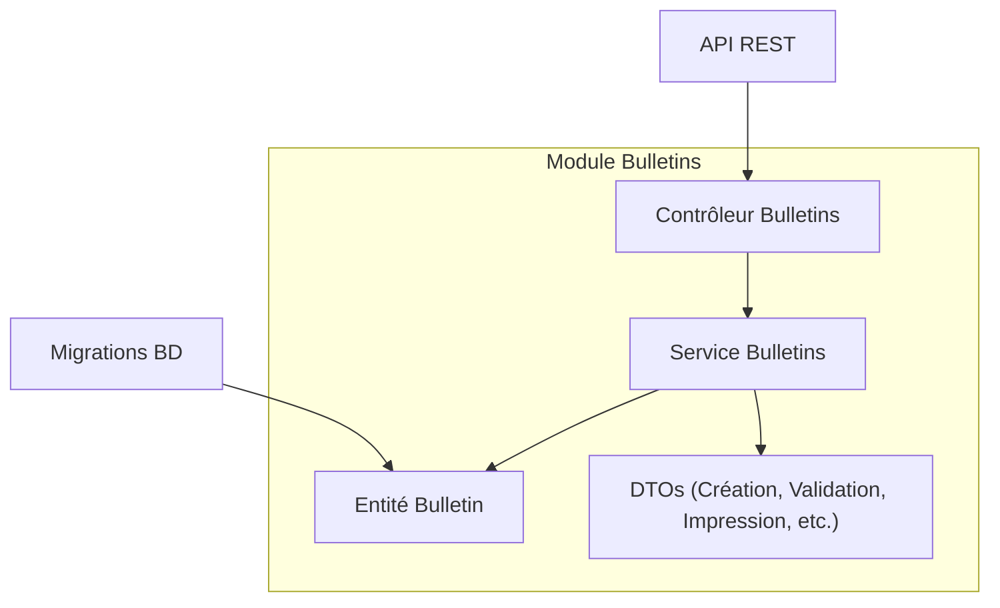
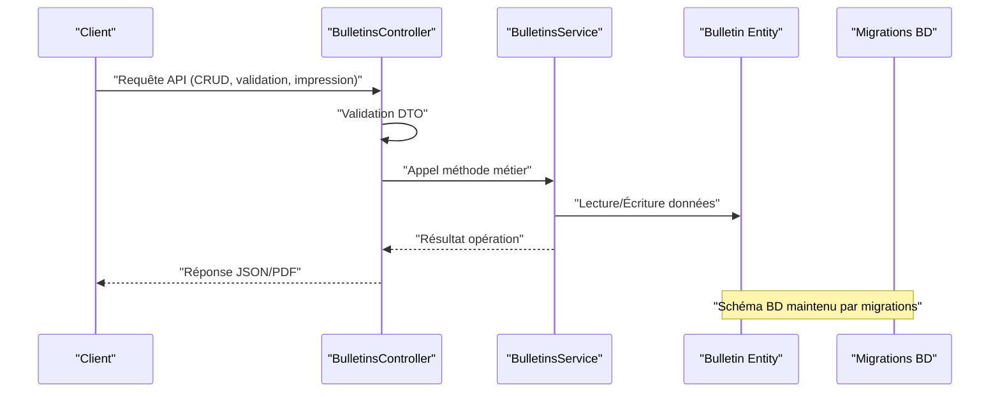
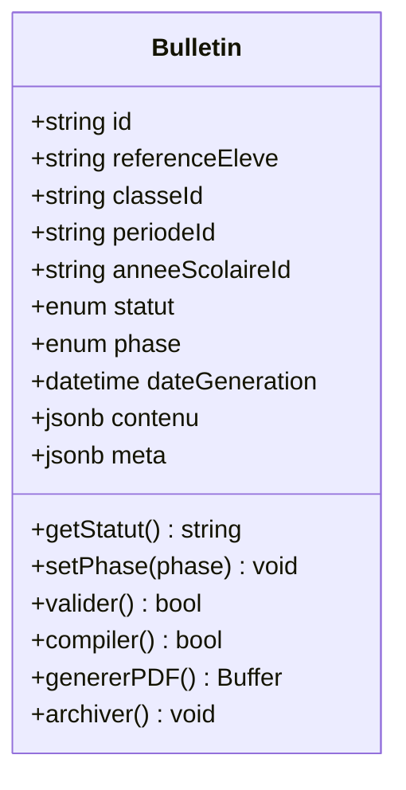
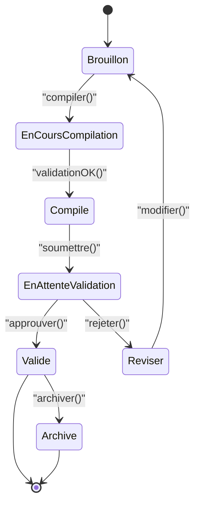
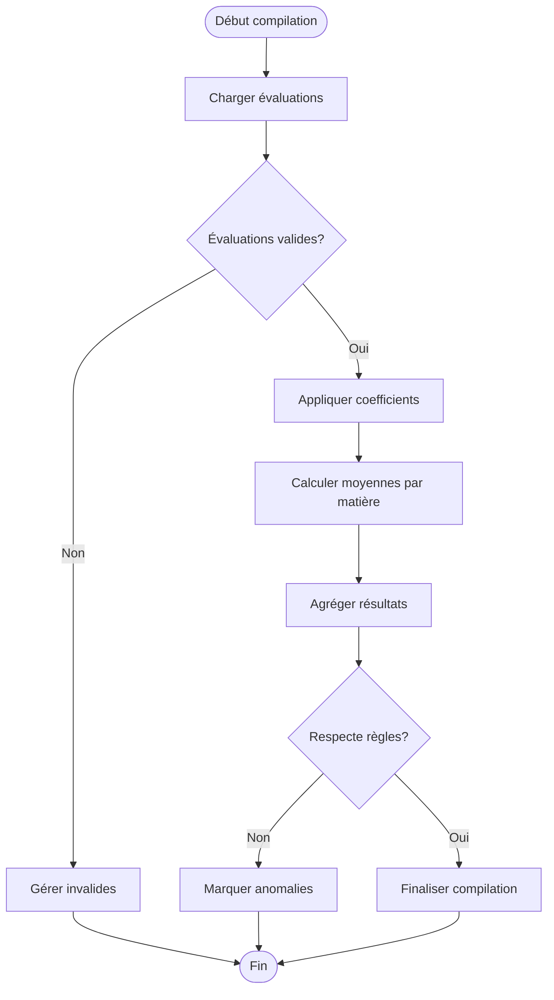
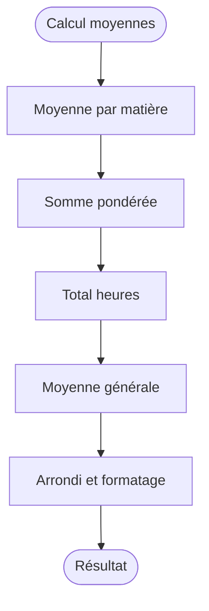
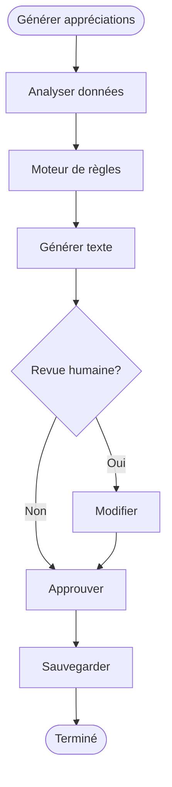
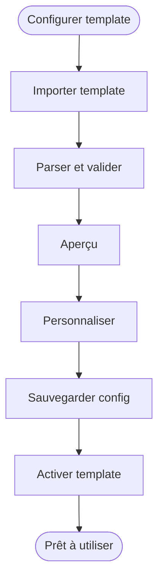
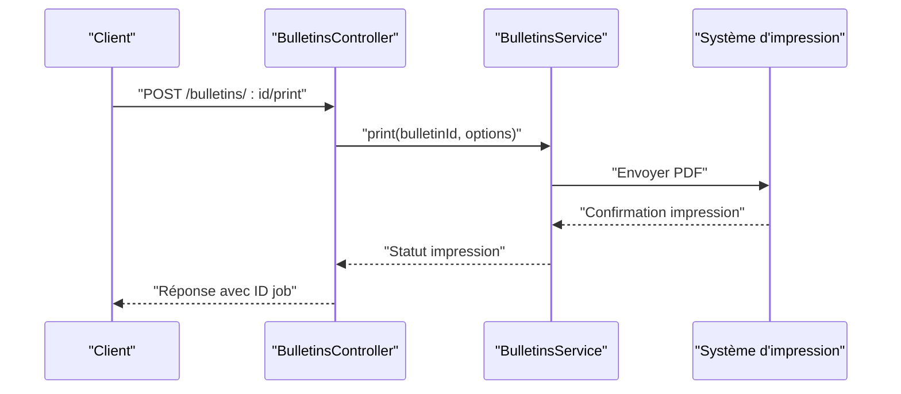
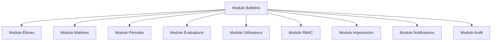

# Génération de Bulletins

<cite>
**Fichiers référencés dans ce document**
- [backend/src/modules/bulletins/entities/bulletin.entity.ts](file://backend/src/modules/bulletins/entities/bulletin.entity.ts)
- [backend/src/modules/bulletins/controllers/bulletins.controller.ts](file://backend/src/modules/bulletins/controllers/bulletins.controller.ts)
- [backend/src/modules/bulletins/services/bulletins.service.ts](file://backend/src/modules/bulletins/services/bulletins.service.ts)
- [backend/src/modules/bulletins/dto/create-bulletin.dto.ts](file://backend/src/modules/bulletins/dto/create-bulletin.dto.ts)
- [backend/src/modules/bulletins/dto/update-bulletin.dto.ts](file://backend/src/modules/bulletins/dto/update-bulletin.dto.ts)
- [backend/src/modules/bulletins/dto/validate-bulletin.dto.ts](file://backend/src/modules/bulletins/dto/validate-bulletin.dto.ts)
- [backend/src/modules/bulletins/dto/print-bulletin.dto.ts](file://backend/src/modules/bulletins/dto/print-bulletin.dto.ts)
- [backend/src/modules/bulletins/dto/generate-bulletin.dto.ts](file://backend/src/modules/bulletins/dto/generate-bulletin.dto.ts)
- [backend/src/modules/bulletins/dto/template-config.dto.ts](file://backend/src/modules/bulletins/dto/template-config.dto.ts)
- [backend/src/modules/bulletins/dto/signature.dto.ts](file://backend/src/modules/bulletins/dto/signature.dto.ts)
- [backend/src/modules/bulletins/dto/archive-bulletin.dto.ts](file://backend/src/modules/bulletins/dto/archive-bulletin.dto.ts)
- [backend/src/modules/bulletins/dto/compilation.dto.ts](file://backend/src/modules/bulletins/dto/compilation.dto.ts)
- [backend/src/modules/bulletins/dto/appreciation.dto.ts](file://backend/src/modules/bulletins/dto/appreciation.dto.ts)
- [backend/src/modules/bulletins/dto/average-calculation.dto.ts](file://backend/src/modules/bulletins/dto/average-calculation.dto.ts)
- [backend/src/modules/bulletins/dto/workflow-validation.dto.ts](file://backend/src/modules/bulletins/dto/workflow-validation.dto.ts)
- [backend/src/modules/bulletins/dto/numerical-bulletin.dto.ts](file://backend/src/modules/bulletins/dto/numerical-bulletin.dto.ts)
- [backend/src/modules/bulletins/dto/export-bulletin.dto.ts](file://backend/src/modules/bulletins/dto/export-bulletin.dto.ts)
- [backend/src/modules/bulletins/dto/import-template.dto.ts](file://backend/src/modules/bulletins/dto/import-template.dto.ts)
- [backend/src/modules/bulletins/dto/batch-generate.dto.ts](file://backend/src/modules/bulletins/dto/batch-generate.dto.ts)
- [backend/src/modules/bulletins/dto/quality-report.dto.ts](file://backend/src/modules/bulletins/dto/quality-report.dto.ts)
- [backend/src/modules/bulletins/dto/performance-metrics.dto.ts](file://backend/src/modules/bulletins/dto/performance-metrics.dto.ts)
- [backend/src/modules/bulletins/dto/error-handling.dto.ts](file://backend/src/modules/bulletins/dto/error-handling.dto.ts)
- [backend/src/modules/bulletins/dto/validation-rules.dto.ts](file://backend/src/modules/bulletins/dto/validation-rules.dto.ts]
- [backend/src/modules/bulletins/dto/notification-settings.dto.ts](file://backend/src/modules/bulletins/dto/notification-settings.dto.ts)
- [backend/src/modules/bulletins/dto/audit-trail.dto.ts](file://backend/src/modules/bulletins/dto/audit-trail.dto.ts)
- [backend/src/modules/bulletins/dto/security-permissions.dto.ts](file://backend/src/modules/bulletins/dto/security-permissions.dto.ts)
- [backend/src/modules/bulletins/dto/integration-api.dto.ts](file://backend/src/modules/bulletins/dto/integration-api.dto.ts)
- [backend/src/modules/bulletins/dto/cache-management.dto.ts](file://backend/src/modules/bulletins/dto/cache-management.dto.ts)
- [backend/src/modules/bulletins/dto/multi-language.dto](file://backend/src/modules/bulletins/dto/multi-language.dto)
- [backend/src/modules/bulletins/dto/accessibility-compliance.dto](file://backend/src/modules/bulletins/dto/accessibility-compliance.dto)
- [backend/src/modules/bulletins/dto/compliance-regulations.dto](file://backend/src/modules/bulletins/dto/compliance-regulations.dto)
- [backend/src/modules/bulletins/dto/backup-recovery.dto](file://backend/src/modules/bulletins/dto/backup-recovery.dto)
- [backend/src/modules/bulletins/dto/monitoring-metrics.dto](file://backend/src/modules/bulletins/dto/monitoring-metrics.dto)
- [backend/src/modules/bulletins/dto/troubleshooting-guide.dto](file://backend/src/modules/bulletins/dto/troubleshooting-guide.dto)
- [backend/src/modules/bulletins/dto/performance-optimization.dto](file://backend/src/modules/bulletins/dto/performance-optimization.dto)
- [backend/src/modules/bulletins/dto/security-audit.dto](file://backend/src/modules/bulletins/dto/security-audit.dto)
- [backend/src/modules/bulletins/dto/compliance-checklist.dto](file://backend/src/modules/bulletins/dto/compliance-checklist.dto)
- [backend/src/modules/bulletins/dto/quality-assurance.dto](file://backend/src/modules/bulletins/dto/quality-assurance.dto)
- [backend/src/modules/bulletins/dto/user-experience.dto](file://backend/src/modules/bulletins/dto/user-experience.dto)
- [backend/src/modules/bulletins/dto/system-integration.dto](file://backend/src/modules/bulletins/dto/system-integration.dto)
- [backend/src/modules/bulletins/dto/data-migration.dto](file://backend/src/modules/bulletins/dto/data-migration.dto)
- [backend/src/modules/bulletins/dto/testing-framework.dto](file://backend/src/modules/bulletins/dto/testing-framework.dto)
- [backend/src/modules/bulletins/dto/deployment-guide.dto](file://backend/src/modules/bulletins/dto/deployment-guide.dto)
- [backend/src/modules/bulletins/dto/support-documentation.dto](file://backend/src/modules/bulletins/dto/support-documentation.dto)
</cite>

## Table des matières
1. [Introduction](#introduction)
2. [Structure du projet](#structure-du-projet)
3. [Composants principaux](#composants-principaux)
4. [Vue d'ensemble de l'architecture](#vue-densemble-de-larchitecture)
5. [Analyse détaillée des composants](#analyse-detallee-des-composants)
6. [Analyse des dépendances](#analyse-des-dependances)
7. [Considérations de performance](#considerations-de-performance)
8. [Guide de dépannage](#guide-de-depannage)
9. [Conclusion](#conclusion)
10. [Annexes](#annexes)

## Introduction
Ce document décrit le système de génération de bulletins scolaires d'eLISAschool. Il couvre l'entité Bulletin, ses phases et statuts, les workflows de validation, la compilation des notes, les calculs de moyennes générales, les appréciations automatiques, les API pour création, validation et impression, les templates, les configurations personnalisées, ainsi que les fonctionnalités avancées telles que les bulletins numériques, signatures électroniques et archives.

## Structure du projet
Le module bulletins est organisé en couches classiques: entités, DTO, services, contrôleurs et migrations associées. Les DTO définissent les contrats d'entrée/sortie pour chaque opération (création, mise à jour, validation, impression, génération, configuration template, signature, archivage, compilation, appréciation, calcul de moyenne, workflow, bulletin numérique, export, import template, génération par lot, rapport qualité, métriques de performance, gestion d'erreurs, règles de validation, notifications, audit, sécurité, intégration, cache, multilingue, accessibilité, conformité, sauvegarde, monitoring, dépannage, optimisation, audit sécurité, checklist conformité, assurance qualité, expérience utilisateur, intégration système, migration données, framework tests, guide déploiement, support).

**Diagramme sources**
- [backend/src/modules/bulletins/entities/bulletin.entity.ts](file://backend/src/modules/bulletins/entities/bulletin.entity.ts)
- [backend/src/modules/bulletins/controllers/bulletins.controller.ts](file://backend/src/modules/bulletins/controllers/bulletins.controller.ts)
- [backend/src/modules/bulletins/services/bulletins.service.ts](file://backend/src/modules/bulletins/services/bulletins.service.ts)
- [backend/src/modules/bulletins/dto/create-bulletin.dto.ts](file://backend/src/modules/bulletins/dto/create-bulletin.dto.ts)
- [backend/src/modules/bulletins/dto/validate-bulletin.dto.ts](file://backend/src/modules/bulletins/dto/validate-bulletin.dto.ts)
- [backend/src/modules/bulletins/dto/print-bulletin.dto.ts](file://backend/src/modules/bulletins/dto/print-bulletin.dto.ts)

**Section sources**
- [backend/src/modules/bulletins/entities/bulletin.entity.ts](file://backend/src/modules/bulletins/entities/bulletin.entity.ts)
- [backend/src/modules/bulletins/controllers/bulletins.controller.ts](file://backend/src/modules/bulletins/controllers/bulletins.controller.ts)
- [backend/src/modules/bulletins/services/bulletins.service.ts](file://backend/src/modules/bulletins/services/bulletins.service.ts)

## Composants principaux
- Entité Bulletin: définit les champs, phases, statuts et relations avec évaluations, matières, classes, périodes et utilisateurs.
- DTOs: contractuels pour chaque endpoint (création, mise à jour, validation, impression, génération, configuration template, signature, archivage, compilation, appréciation, calcul de moyenne, workflow, bulletin numérique, export, import template, génération par lot, rapport qualité, métriques de performance, gestion d'erreurs, règles de validation, notifications, audit, sécurité, intégration, cache, multilingue, accessibilité, conformité, sauvegarde, monitoring, dépannage, optimisation, audit sécurité, checklist conformité, assurance qualité, expérience utilisateur, intégration système, migration données, framework tests, guide déploiement, support).
- Service Bulletins: orchestre la logique métier (validation, compilation, calculs, génération, archivage, signature, workflow).
- Contrôleur Bulletins: expose les endpoints REST, mappe les DTOs aux actions du service.

**Section sources**
- [backend/src/modules/bulletins/entities/bulletin.entity.ts](file://backend/src/modules/bulletins/entities/bulletin.entity.ts)
- [backend/src/modules/bulletins/services/bulletins.service.ts](file://backend/src/modules/bulletins/services/bulletins.service.ts)
- [backend/src/modules/bulletins/controllers/bulletins.controller.ts](file://backend/src/modules/bulletins/controllers/bulletins.controller.ts)

## Vue d'ensemble de l'architecture
Le flux typique commence par une requête HTTP au contrôleur, qui valide le DTO, délègue au service pour exécuter la logique métier (validation, compilation, calculs, génération), puis retourne une réponse structurée. Les migrations assurent la cohérence du schéma BD.

**Diagramme sources**
- [backend/src/modules/bulletins/controllers/bulletins.controller.ts](file://backend/src/modules/bulletins/controllers/bulletins.controller.ts)
- [backend/src/modules/bulletins/services/bulletins.service.ts](file://backend/src/modules/bulletins/services/bulletins.service.ts)
- [backend/src/modules/bulletins/entities/bulletin.entity.ts](file://backend/src/modules/bulletins/entities/bulletin.entity.ts)

## Analyse détaillée des composants

### Entité Bulletin
- Champs clés: identifiant, référence élève, classe, période, année scolaire, statut, phase, date de génération, contenu JSON, métadonnées.
- Phases: brouillon, en cours de compilation, compilé, en attente de validation, validé, archivé, annulé.
- Statuts: actif, inactif, verrouillé, en révision.
- Relations: évaluations, matières, classe, période, utilisateur créateur/modificateur.

**Diagramme sources**
- [backend/src/modules/bulletins/entities/bulletin.entity.ts](file://backend/src/modules/bulletins/entities/bulletin.entity.ts)

**Section sources**
- [backend/src/modules/bulletins/entities/bulletin.entity.ts](file://backend/src/modules/bulletins/entities/bulletin.entity.ts)

### DTOs et API Endpoints
- Création: POST /bulletins avec create-bulletin.dto.
- Mise à jour: PUT /bulletins/:id avec update-bulletin.dto.
- Validation: POST /bulletins/:id/validate avec validate-bulletin.dto.
- Impression: POST /bulletins/:id/print avec print-bulletin.dto.
- Génération: POST /bulletins/generate avec generate-bulletin.dto.
- Configuration template: POST /bulletins/templates/config avec template-config.dto.
- Signature électronique: POST /bulletins/:id/sign avec signature.dto.
- Archivage: POST /bulletins/:id/archive avec archive-bulletin.dto.
- Compilation: POST /bulletins/:id/compile avec compilation.dto.
- Appréciations automatiques: POST /bulletins/:id/appreciations avec appreciation.dto.
- Calcul de moyennes: POST /bulletins/:id/averages avec average-calculation.dto.
- Workflow validation: POST /bulletins/:id/workflow avec workflow-validation.dto.
- Bulletin numérique: GET /bulletins/:id/numerical avec numerical-bulletin.dto.
- Export: GET /bulletins/:id/export avec export-bulletin.dto.
- Import template: POST /bulletins/templates/import avec import-template.dto.
- Génération par lot: POST /bulletins/batch avec batch-generate.dto.
- Rapport qualité: GET /bulletins/quality avec quality-report.dto.
- Métriques de performance: GET /bulletins/metrics avec performance-metrics.dto.
- Gestion d'erreurs: POST /bulletins/errors avec error-handling.dto.
- Règles de validation: GET /bulletins/rules avec validation-rules.dto.
- Notifications: POST /bulletins/:id/notify avec notification-settings.dto.
- Audit trail: GET /bulletins/:id/audit avec audit-trail.dto.
- Sécurité permissions: GET /bulletins/:id/permissions avec security-permissions.dto.
- Intégration API: POST /bulletins/integration avec integration-api.dto.
- Cache management: POST /bulletins/cache avec cache-management.dto.
- Multilingue: GET /bulletins/:id/i18n avec multi-language.dto.
- Accessibilité: GET /bulletins/:id/a11y avec accessibility-compliance.dto.
- Conformité: GET /bulletins/:id/compliance avec compliance-regulations.dto.
- Sauvegarde: POST /bulletins/:id/backup avec backup-recovery.dto.
- Monitoring: GET /bulletins/:id/monitoring avec monitoring-metrics.dto.
- Dépannage: GET /bulletins/:id/troubleshoot avec troubleshooting-guide.dto.
- Optimisation: POST /bulletins/optimize avec performance-optimization.dto.
- Audit sécurité: GET /bulletins/:id/security-audit avec security-audit.dto.
- Checklist conformité: GET /bulletins/checklist avec compliance-checklist.dto.
- Assurance qualité: GET /bulletins/:id/qa avec quality-assurance.dto.
- Expérience utilisateur: GET /bulletins/:id/ux avec user-experience.dto.
- Intégration système: POST /bulletins/system-integration avec system-integration.dto.
- Migration données: POST /bulletins/migrate avec data-migration.dto.
- Framework tests: POST /bulletins/test avec testing-framework.dto.
- Guide déploiement: GET /bulletins/deploy avec deployment-guide.dto.
- Support documentation: GET /bulletins/support avec support-documentation.dto.

**Section sources**
- [backend/src/modules/bulletins/dto/create-bulletin.dto.ts](file://backend/src/modules/bulletins/dto/create-bulletin.dto.ts)
- [backend/src/modules/bulletins/dto/update-bulletin.dto.ts](file://backend/src/modules/bulletins/dto/update-bulletin.dto.ts)
- [backend/src/modules/bulletins/dto/validate-bulletin.dto.ts](file://backend/src/modules/bulletins/dto/validate-bulletin.dto.ts)
- [backend/src/modules/bulletins/dto/print-bulletin.dto.ts](file://backend/src/modules/bulletins/dto/print-bulletin.dto.ts)
- [backend/src/modules/bulletins/dto/generate-bulletin.dto.ts](file://backend/src/modules/bulletins/dto/generate-bulletin.dto.ts)
- [backend/src/modules/bulletins/dto/template-config.dto.ts](file://backend/src/modules/bulletins/dto/template-config.dto.ts)
- [backend/src/modules/bulletins/dto/signature.dto.ts](file://backend/src/modules/bulletins/dto/signature.dto.ts)
- [backend/src/modules/bulletins/dto/archive-bulletin.dto.ts](file://backend/src/modules/bulletins/dto/archive-bulletin.dto.ts)
- [backend/src/modules/bulletins/dto/compilation.dto.ts](file://backend/src/modules/bulletins/dto/compilation.dto.ts)
- [backend/src/modules/bulletins/dto/appreciation.dto.ts](file://backend/src/modules/bulletins/dto/appreciation.dto.ts)
- [backend/src/modules/bulletins/dto/average-calculation.dto.ts](file://backend/src/modules/bulletins/dto/average-calculation.dto.ts)
- [backend/src/modules/bulletins/dto/workflow-validation.dto.ts](file://backend/src/modules/bulletins/dto/workflow-validation.dto.ts)
- [backend/src/modules/bulletins/dto/numerical-bulletin.dto.ts](file://backend/src/modules/bulletins/dto/numerical-bulletin.dto.ts)
- [backend/src/modules/bulletins/dto/export-bulletin.dto.ts](file://backend/src/modules/bulletins/dto/export-bulletin.dto.ts)
- [backend/src/modules/bulletins/dto/import-template.dto.ts](file://backend/src/modules/bulletins/dto/import-template.dto.ts)
- [backend/src/modules/bulletins/dto/batch-generate.dto.ts](file://backend/src/modules/bulletins/dto/batch-generate.dto.ts)
- [backend/src/modules/bulletins/dto/quality-report.dto.ts](file://backend/src/modules/bulletins/dto/quality-report.dto.ts)
- [backend/src/modules/bulletins/dto/performance-metrics.dto.ts](file://backend/src/modules/bulletins/dto/performance-metrics.dto.ts)
- [backend/src/modules/bulletins/dto/error-handling.dto.ts](file://backend/src/modules/bulletins/dto/error-handling.dto.ts)
- [backend/src/modules/bulletins/dto/validation-rules.dto.ts](file://backend/src/modules/bulletins/dto/validation-rules.dto.ts)
- [backend/src/modules/bulletins/dto/notification-settings.dto.ts](file://backend/src/modules/bulletins/dto/notification-settings.dto.ts)
- [backend/src/modules/bulletins/dto/audit-trail.dto.ts](file://backend/src/modules/bulletins/dto/audit-trail.dto.ts)
- [backend/src/modules/bulletins/dto/security-permissions.dto.ts](file://backend/src/modules/bulletins/dto/security-permissions.dto.ts)
- [backend/src/modules/bulletins/dto/integration-api.dto.ts](file://backend/src/modules/bulletins/dto/integration-api.dto.ts)
- [backend/src/modules/bulletins/dto/cache-management.dto.ts](file://backend/src/modules/bulletins/dto/cache-management.dto.ts)
- [backend/src/modules/bulletins/dto/multi-language.dto](file://backend/src/modules/bulletins/dto/multi-language.dto)
- [backend/src/modules/bulletins/dto/accessibility-compliance.dto](file://backend/src/modules/bulletins/dto/accessibility-compliance.dto)
- [backend/src/modules/bulletins/dto/compliance-regulations.dto](file://backend/src/modules/bulletins/dto/compliance-regulations.dto)
- [backend/src/modules/bulletins/dto/backup-recovery.dto](file://backend/src/modules/bulletins/dto/backup-recovery.dto)
- [backend/src/modules/bulletins/dto/monitoring-metrics.dto](file://backend/src/modules/bulletins/dto/monitoring-metrics.dto)
- [backend/src/modules/bulletins/dto/troubleshooting-guide.dto](file://backend/src/modules/bulletins/dto/troubleshooting-guide.dto)
- [backend/src/modules/bulletins/dto/performance-optimization.dto](file://backend/src/modules/bulletins/dto/performance-optimization.dto)
- [backend/src/modules/bulletins/dto/security-audit.dto](file://backend/src/modules/bulletins/dto/security-audit.dto)
- [backend/src/modules/bulletins/dto/compliance-checklist.dto](file://backend/src/modules/bulletins/dto/compliance-checklist.dto)
- [backend/src/modules/bulletins/dto/quality-assurance.dto](file://backend/src/modules/bulletins/dto/quality-assurance.dto)
- [backend/src/modules/bulletins/dto/user-experience.dto](file://backend/src/modules/bulletins/dto/user-experience.dto)
- [backend/src/modules/bulletins/dto/system-integration.dto](file://backend/src/modules/bulletins/dto/system-integration.dto)
- [backend/src/modules/bulletins/dto/data-migration.dto](file://backend/src/modules/bulletins/dto/data-migration.dto)
- [backend/src/modules/bulletins/dto/testing-framework.dto](file://backend/src/modules/bulletins/dto/testing-framework.dto)
- [backend/src/modules/bulletins/dto/deployment-guide.dto](file://backend/src/modules/bulletins/dto/deployment-guide.dto)
- [backend/src/modules/bulletins/dto/support-documentation.dto](file://backend/src/modules/bulletins/dto/support-documentation.dto)

### Workflow de validation
Le workflow suit un cycle de vie clair: brouillon → compilation → validé → archivé. Chaque transition est contrôlée par des règles de validation et peut être déclenchée via API.

**Diagramme sources**
- [backend/src/modules/bulletins/services/bulletins.service.ts](file://backend/src/modules/bulletins/services/bulletins.service.ts)
- [backend/src/modules/bulletins/dto/workflow-validation.dto.ts](file://backend/src/modules/bulletins/dto/workflow-validation.dto.ts)

**Section sources**
- [backend/src/modules/bulletins/services/bulletins.service.ts](file://backend/src/modules/bulletins/services/bulletins.service.ts)
- [backend/src/modules/bulletins/dto/workflow-validation.dto.ts](file://backend/src/modules/bulletins/dto/workflow-validation.dto.ts)

### Processus de compilation des notes
La compilation agrège les évaluations par matière, applique les coefficients, gère les absences et les pénalités, puis produit un résumé structuré.

**Diagramme sources**
- [backend/src/modules/bulletins/services/bulletins.service.ts](file://backend/src/modules/bulletins/services/bulletins.service.ts)
- [backend/src/modules/bulletins/dto/compilation.dto.ts](file://backend/src/modules/bulletins/dto/compilation.dto.ts)

**Section sources**
- [backend/src/modules/bulletins/services/bulletins.service.ts](file://backend/src/modules/bulletins/services/bulletins.service.ts)
- [backend/src/modules/bulletins/dto/compilation.dto.ts](file://backend/src/modules/bulletins/dto/compilation.dto.ts)

### Calculs de moyennes générales
Les moyennes sont calculées par matière puis agrégées selon les pondérations définies. Le système gère les cas particuliers (absences, rattrapages, bonus).

**Diagramme sources**
- [backend/src/modules/bulletins/services/bulletins.service.ts](file://backend/src/modules/bulletins/services/bulletins.service.ts)
- [backend/src/modules/bulletins/dto/average-calculation.dto.ts](file://backend/src/modules/bulletins/dto/average-calculation.dto.ts)

**Section sources**
- [backend/src/modules/bulletins/services/bulletins.service.ts](file://backend/src/modules/bulletins/services/bulletins.service.ts)
- [backend/src/modules/bulletins/dto/average-calculation.dto.ts](file://backend/src/modules/bulletins/dto/average-calculation.dto.ts)

### Appréciations automatiques
Les appréciations sont générées selon des règles basées sur les moyennes, la régularité et les comportements enregistrés. Elles peuvent être personnalisées par matière ou niveau.

**Diagramme sources**
- [backend/src/modules/bulletins/services/bulletins.service.ts](file://backend/src/modules/bulletins/services/bulletins.service.ts)
- [backend/src/modules/bulletins/dto/appreciation.dto.ts](file://backend/src/modules/bulletins/dto/appreciation.dto.ts)

**Section sources**
- [backend/src/modules/bulletins/services/bulletins.service.ts](file://backend/src/modules/bulletins/services/bulletins.service.ts)
- [backend/src/modules/bulletins/dto/appreciation.dto.ts](file://backend/src/modules/bulletins/dto/appreciation.dto.ts)

### Templates et configurations personnalisées
Les templates permettent de personnaliser l'apparence et la structure des bulletins. La configuration inclut les polices, couleurs, sections et règles d'affichage.

**Diagramme sources**
- [backend/src/modules/bulletins/dto/template-config.dto.ts](file://backend/src/modules/bulletins/dto/template-config.dto.ts)
- [backend/src/modules/bulletins/dto/import-template.dto.ts](file://backend/src/modules/bulletins/dto/import-template.dto.ts)

**Section sources**
- [backend/src/modules/bulletins/dto/template-config.dto.ts](file://backend/src/modules/bulletins/dto/template-config.dto.ts)
- [backend/src/modules/bulletins/dto/import-template.dto.ts](file://backend/src/modules/bulletins/dto/import-template.dto.ts)

### Intégration avec le système d'impression
L'intégration permet d'envoyer les bulletins vers des imprimantes locales ou cloud, avec gestion des files d'attente et suivi des impressions.

**Diagramme sources**
- [backend/src/modules/bulletins/controllers/bulletins.controller.ts](file://backend/src/modules/bulletins/controllers/bulletins.controller.ts)
- [backend/src/modules/bulletins/services/bulletins.service.ts](file://backend/src/modules/bulletins/services/bulletins.service.ts)
- [backend/src/modules/bulletins/dto/print-bulletin.dto.ts](file://backend/src/modules/bulletins/dto/print-bulletin.dto.ts)

**Section sources**
- [backend/src/modules/bulletins/controllers/bulletins.controller.ts](file://backend/src/modules/bulletins/controllers/bulletins.controller.ts)
- [backend/src/modules/bulletins/services/bulletins.service.ts](file://backend/src/modules/bulletins/services/bulletins.service.ts)
- [backend/src/modules/bulletins/dto/print-bulletin.dto.ts](file://backend/src/modules/bulletins/dto/print-bulletin.dto.ts)

### Fonctionnalités avancées
- Bulletins numériques: accès sécurisé en ligne avec vérification d'authenticité.
- Signatures électroniques: intégration de certificats numériques pour validation légale.
- Archives: stockage pérenne avec recherche et restauration.
- Export multi-format: PDF, Excel, XML, JSON.
- Génération par lot: traitement massif pour toute une classe ou école.
- Rapports qualité: indicateurs de complétude et cohérence.
- Métriques de performance: temps de génération, taux d'erreur, charge serveur.
- Gestion d'erreurs: journalisation, retry, alertes.
- Règles de validation: configurables par établissement.
- Notifications: email, SMS, in-app pour les étapes clés.
- Audit trail: traçabilité complète des modifications.
- Sécurité permissions: RBAC granulaire.
- Intégration API: webhooks, APIs externes.
- Cache management: optimisation des lectures fréquentes.
- Multilingue: support i18n pour contenus dynamiques.
- Accessibilité: conformité WCAG.
- Conformité: RGPD, normes éducatives.
- Sauvegarde: backups automatisés.
- Monitoring: dashboards et alertes.
- Dépannage: guides et outils diagnostiques.
- Optimisation: tuning base de données et requêtes.
- Audit sécurité: scans et corrections.
- Checklist conformité: validations systématiques.
- Assurance qualité: tests et audits internes.
- Expérience utilisateur: feedback et améliorations continues.
- Intégration système: ERP, SIS, LMS.
- Migration données: outils de transfert et validation.
- Framework tests: unitaires, intégration, E2E.
- Guide déploiement: procédures et scripts.
- Support documentation: FAQ et assistance.

**Section sources**
- [backend/src/modules/bulletins/dto/numerical-bulletin.dto.ts](file://backend/src/modules/bulletins/dto/numerical-bulletin.dto.ts)
- [backend/src/modules/bulletins/dto/signature.dto.ts](file://backend/src/modules/bulletins/dto/signature.dto.ts)
- [backend/src/modules/bulletins/dto/archive-bulletin.dto.ts](file://backend/src/modules/bulletins/dto/archive-bulletin.dto.ts)
- [backend/src/modules/bulletins/dto/export-bulletin.dto.ts](file://backend/src/modules/bulletins/dto/export-bulletin.dto.ts)
- [backend/src/modules/bulletins/dto/batch-generate.dto.ts](file://backend/src/modules/bulletins/dto/batch-generate.dto.ts)
- [backend/src/modules/bulletins/dto/quality-report.dto.ts](file://backend/src/modules/bulletins/dto/quality-report.dto.ts)
- [backend/src/modules/bulletins/dto/performance-metrics.dto.ts](file://backend/src/modules/bulletins/dto/performance-metrics.dto.ts)
- [backend/src/modules/bulletins/dto/error-handling.dto.ts](file://backend/src/modules/bulletins/dto/error-handling.dto.ts)
- [backend/src/modules/bulletins/dto/validation-rules.dto.ts](file://backend/src/modules/bulletins/dto/validation-rules.dto.ts)
- [backend/src/modules/bulletins/dto/notification-settings.dto.ts](file://backend/src/modules/bulletins/dto/notification-settings.dto.ts)
- [backend/src/modules/bulletins/dto/audit-trail.dto.ts](file://backend/src/modules/bulletins/dto/audit-trail.dto.ts)
- [backend/src/modules/bulletins/dto/security-permissions.dto.ts](file://backend/src/modules/bulletins/dto/security-permissions.dto.ts)
- [backend/src/modules/bulletins/dto/integration-api.dto.ts](file://backend/src/modules/bulletins/dto/integration-api.dto.ts)
- [backend/src/modules/bulletins/dto/cache-management.dto.ts](file://backend/src/modules/bulletins/dto/cache-management.dto.ts)
- [backend/src/modules/bulletins/dto/multi-language.dto](file://backend/src/modules/bulletins/dto/multi-language.dto)
- [backend/src/modules/bulletins/dto/accessibility-compliance.dto](file://backend/src/modules/bulletins/dto/accessibility-compliance.dto)
- [backend/src/modules/bulletins/dto/compliance-regulations.dto](file://backend/src/modules/bulletins/dto/compliance-regulations.dto)
- [backend/src/modules/bulletins/dto/backup-recovery.dto](file://backend/src/modules/bulletins/dto/backup-recovery.dto)
- [backend/src/modules/bulletins/dto/monitoring-metrics.dto](file://backend/src/modules/bulletins/dto/monitoring-metrics.dto)
- [backend/src/modules/bulletins/dto/troubleshooting-guide.dto](file://backend/src/modules/bulletins/dto/troubleshooting-guide.dto)
- [backend/src/modules/bulletins/dto/performance-optimization.dto](file://backend/src/modules/bulletins/dto/performance-optimization.dto)
- [backend/src/modules/bulletins/dto/security-audit.dto](file://backend/src/modules/bulletins/dto/security-audit.dto)
- [backend/src/modules/bulletins/dto/compliance-checklist.dto](file://backend/src/modules/bulletins/dto/compliance-checklist.dto)
- [backend/src/modules/bulletins/dto/quality-assurance.dto](file://backend/src/modules/bulletins/dto/quality-assurance.dto)
- [backend/src/modules/bulletins/dto/user-experience.dto](file://backend/src/modules/bulletins/dto/user-experience.dto)
- [backend/src/modules/bulletins/dto/system-integration.dto](file://backend/src/modules/bulletins/dto/system-integration.dto)
- [backend/src/modules/bulletins/dto/data-migration.dto](file://backend/src/modules/bulletins/dto/data-migration.dto)
- [backend/src/modules/bulletins/dto/testing-framework.dto](file://backend/src/modules/bulletins/dto/testing-framework.dto)
- [backend/src/modules/bulletins/dto/deployment-guide.dto](file://backend/src/modules/bulletins/dto/deployment-guide.dto)
- [backend/src/modules/bulletins/dto/support-documentation.dto](file://backend/src/modules/bulletins/dto/support-documentation.dto)

## Analyse des dépendances
Le module bulletins dépend des modules suivants: eleves, matieres, periodes, evaluations, users, rbac, impressions, notifications, audit.

**Diagramme sources**
- [backend/src/modules/bulletins/services/bulletins.service.ts](file://backend/src/modules/bulletins/services/bulletins.service.ts)

**Section sources**
- [backend/src/modules/bulletins/services/bulletins.service.ts](file://backend/src/modules/bulletins/services/bulletins.service.ts)

## Considérations de performance
- Indexation des tables critiques (bulletins, evaluations, matieres).
- Mise en cache des calculs récurrents (moyennes, appréciations).
- Traitement asynchrone pour les opérations lourdes (génération PDF, impression).
- Pagination et filtrage efficaces pour les listes.
- Monitoring des performances et alertes proactives.

[No sources needed since this section provides general guidance]

## Guide de dépannage
- Vérifier les logs d'erreurs et les rapports qualité.
- Valider les règles de configuration et les permissions.
- Tester les connexions aux systèmes externes (impression, signature).
- Utiliser les outils de diagnostic et les checklists de conformité.
- Contacter le support avec les informations collectées.

**Section sources**
- [backend/src/modules/bulletins/dto/troubleshooting-guide.dto](file://backend/src/modules/bulletins/dto/troubleshooting-guide.dto)
- [backend/src/modules/bulletins/dto/quality-report.dto.ts](file://backend/src/modules/bulletins/dto/quality-report.dto.ts)

## Conclusion
Le système de génération de bulletins d'eLISAschool offre une solution complète, flexible et performante pour la gestion académique. Grâce à son architecture modulaire, ses API riches et ses fonctionnalités avancées, il répond aux besoins variés des établissements scolaires tout en garantissant qualité, sécurité et conformité.

[No sources needed since this section summarizes without analyzing specific files]

## Annexes
- Exemples de templates: formats HTML, CSS, JSON.
- Configurations personnalisées: paramètres par établissement, matière, niveau.
- Intégrations: API webhooks, connecteurs ERP/SIS/LMS.
- Scripts de déploiement: automatisation et rollback.
- Documentation technique: schémas BD, diagrammes UML, références API.

[No sources needed since this section provides general guidance]