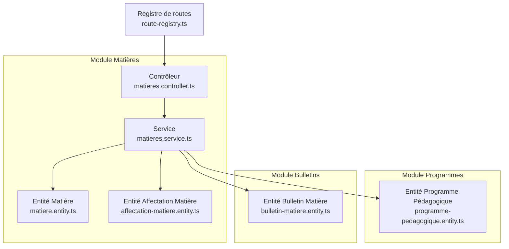
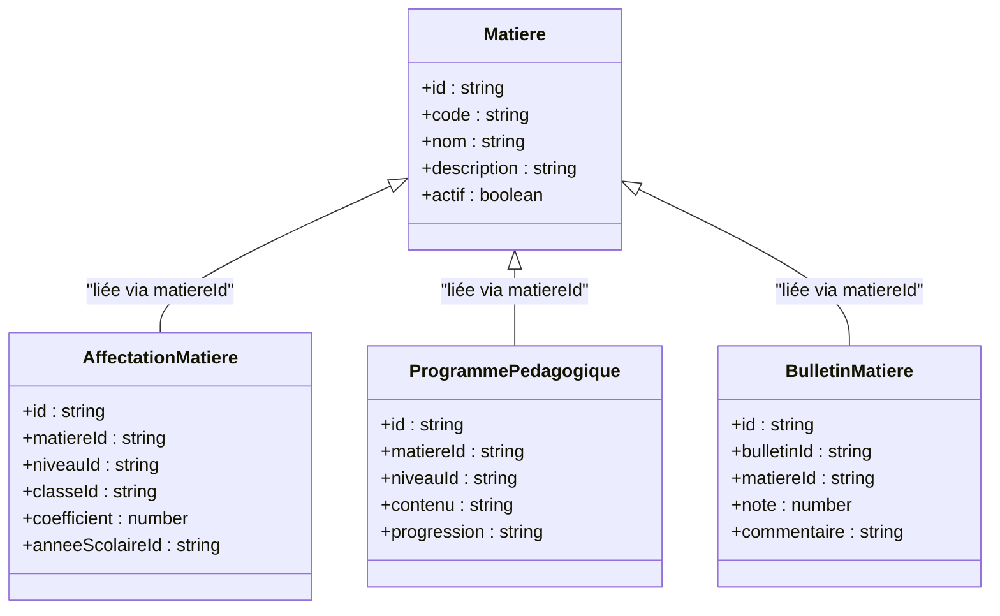
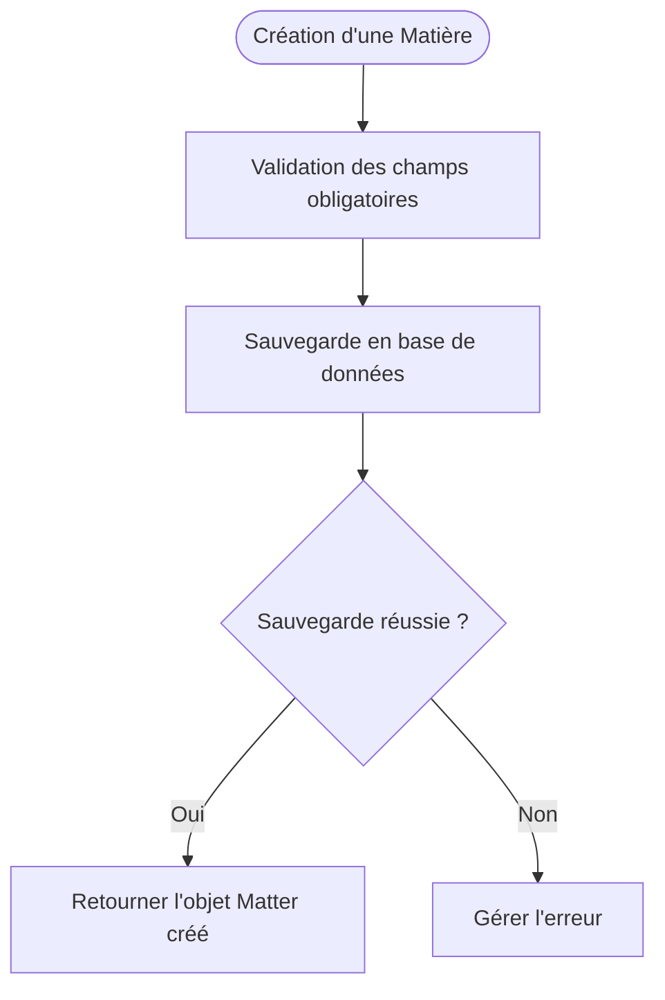
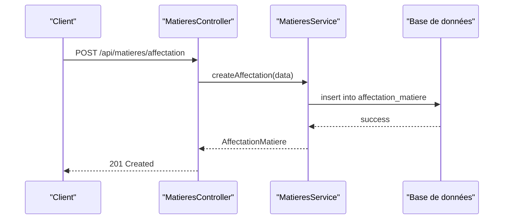
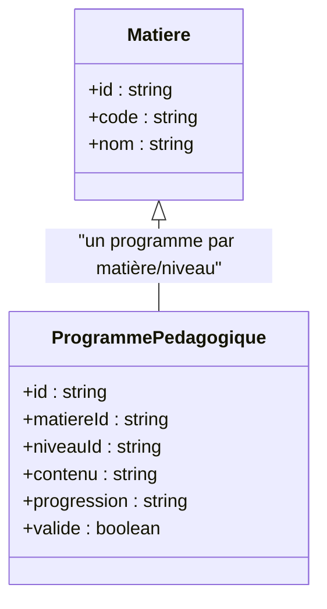
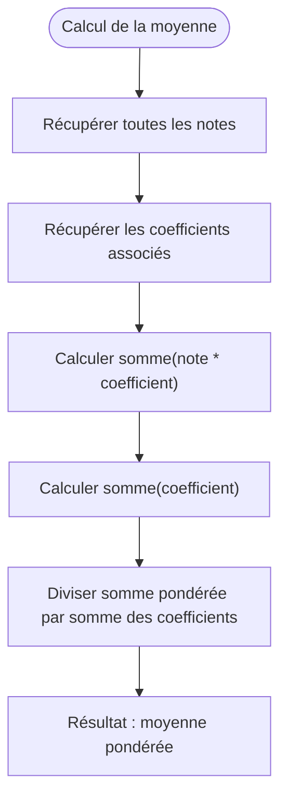
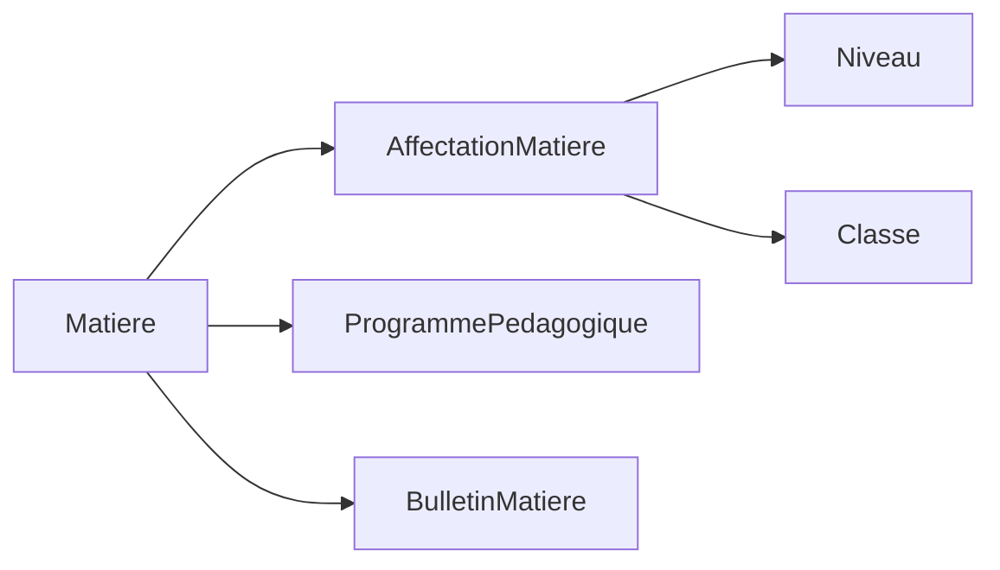

# Matières et Coefficients

<cite>
**Fichiers référencés dans ce document**
- [059-ajouter-matiere-sous-systeme.sql](file://backend/database/migrations/059-ajouter-matiere-sous-systeme.sql)
- [059-multi-tenant-matiere.sql](file://backend/database/migrations/059-multi-tenant-matiere.sql)
- [060-ajouter-affectation-matiere-coefficient.sql](file://backend/database/migrations/060-ajouter-affectation-matiere-coefficient.sql)
- [061-creer-table-bulletins-matieres.sql](file://backend/database/migrations/061-creer-table-bulletins-matieres.sql)
- [086-affectation-matiere-etablissement-id.sql](file://backend/database/migrations/086-affectation-matiere-etablissement-id.sql)
- [087-affectation-matiere-verifications.sql](file://backend/database/migrations/087-affectation-matiere-verifications.sql)
- [088-refactorisation-architecture-academique.sql](file://backend/database/migrations/088-refactorisation-architecture-academique.sql)
- [089-finalisation-architecture-academique-v2.sql](file://backend/database/migrations/089-finalisation-architecture-academique-v2.sql)
- [090-correction-migration-088-camelcase.sql](file://backend/database/migrations/090-correction-migration-088-camelcase.sql)
- [091-peuplement-architecture-academique.sql](file://backend/database/migrations/091-peuplement-architecture-academique.sql)
- [115-supprimer-config-matiere-classe.sql](file://backend/database/migrations/115-supprimer-config-matiere-classe.sql)
- [116-programme-intemporel.sql](file://backend/database/migrations/116-programme-intemporel.sql)
- [matieres.controller.ts](file://backend/src/modules/matieres/controllers/matieres.controller.ts)
- [matieres.service.ts](file://backend/src/modules/matieres/services/matieres.service.ts)
- [matiere.entity.ts](file://backend/src/modules/matieres/entities/matiere.entity.ts)
- [affectation-matiere.entity.ts](file://backend/src/modules/matieres/entities/affectation-matiere.entity.ts)
- [programme-pedagogique.entity.ts](file://backend/src/modules/programmes/entities/programme-pedagogique.entity.ts)
- [bulletin-matiere.entity.ts](file://backend/src/modules/bulletins/entities/bulletin-matiere.entity.ts)
- [route-registry.ts](file://backend/src/routes/route-registry.ts)
</cite>

## Table des matières
1. [Introduction](#introduction)
2. [Structure du projet](#structure-du-projet)
3. [Composants clés](#composants-clés)
4. [Vue d'ensemble de l'architecture](#vue-densemble-de-larchitecture)
5. [Analyse détaillée des composants](#analyse-detaillee-des-composants)
6. [Analyse des dépendances](#analyse-des-dependances)
7. [Considérations de performance](#considerations-de-performance)
8. [Guide de dépannage](#guide-de-depannage)
9. [Conclusion](#conclusion)
10. [Annexes](#annexes)

## Introduction
Ce document décrit en détail la gestion des matières et coefficients dans eLISAschool. Il couvre l’entité Matière, les programmes pédagogiques associés, le système de coefficients, ainsi que les relations entre matières, niveaux et spécialités. Il documente également les endpoints API pour la gestion des matières, des configurations de coefficients et des programmes, avec des exemples de configuration par niveau/classe et des calculs de moyennes pondérées. Le système est conçu pour s’adapter à différents systèmes éducatifs grâce à une architecture modulaire et multi-tenant.

## Structure du projet
Le module Matières est organisé selon une architecture modulaire NestJS :
- Entités (modèles de données)
- Services (logique métier)
- Contrôleurs (API REST)
- Migrations (schéma de base de données)
- Routes (enregistrement des endpoints)

**Sources du diagramme**
- [matieres.controller.ts](file://backend/src/modules/matieres/controllers/matieres.controller.ts)
- [matieres.service.ts](file://backend/src/modules/matieres/services/matieres.service.ts)
- [matiere.entity.ts](file://backend/src/modules/matieres/entities/matiere.entity.ts)
- [affectation-matiere.entity.ts](file://backend/src/modules/matieres/entities/affectation-matiere.entity.ts)
- [programme-pedagogique.entity.ts](file://backend/src/modules/programmes/entities/programme-pedagogique.entity.ts)
- [bulletin-matiere.entity.ts](file://backend/src/modules/bulletins/entities/bulletin-matiere.entity.ts)
- [route-registry.ts](file://backend/src/routes/route-registry.ts)

**Sources de section**
- [route-registry.ts](file://backend/src/routes/route-registry.ts)

## Composants clés
- Entité Matière : définit les propriétés fondamentales d’une matière (nom, code, description, etc.).
- Affectation Matière : lie une matière à un niveau ou une classe, avec un coefficient associé.
- Programme Pédagogique : définit le contenu et la progression pédagogique pour une matière donnée.
- Bulletin Matière : stocke les résultats évaluatifs liés à une matière pour un bulletin.

**Sources de section**
- [matiere.entity.ts](file://backend/src/modules/matieres/entities/matiere.entity.ts)
- [affectation-matiere.entity.ts](file://backend/src/modules/matieres/entities/affectation-matiere.entity.ts)
- [programme-pedagogique.entity.ts](file://backend/src/modules/programmes/entities/programme-pedagogique.entity.ts)
- [bulletin-matiere.entity.ts](file://backend/src/modules/bulletins/entities/bulletin-matiere.entity.ts)

## Vue d'ensemble de l'architecture
Le système suit une séparation claire entre contrôleurs, services et entités. Les migrations assurent l’évolution du schéma de base de données.

**Sources du diagramme**
- [matiere.entity.ts](file://backend/src/modules/matieres/entities/matiere.entity.ts)
- [affectation-matiere.entity.ts](file://backend/src/modules/matieres/entities/affectation-matiere.entity.ts)
- [programme-pedagogique.entity.ts](file://backend/src/modules/programmes/entities/programme-pedagogique.entity.ts)
- [bulletin-matiere.entity.ts](file://backend/src/modules/bulletins/entities/bulletin-matiere.entity.ts)

## Analyse détaillée des composants

### Entité Matière
L’entité Matière représente une discipline enseignée. Elle inclut des champs comme code, nom, description et statut actif.

**Sources du diagramme**
- [matiere.entity.ts](file://backend/src/modules/matieres/entities/matiere.entity.ts)

**Sources de section**
- [matiere.entity.ts](file://backend/src/modules/matieres/entities/matiere.entity.ts)

### Affectation Matière et Coefficients
L’affectation permet de lier une matière à un niveau ou une classe avec un coefficient spécifique.

**Sources du diagramme**
- [matieres.controller.ts](file://backend/src/modules/matieres/controllers/matieres.controller.ts)
- [matieres.service.ts](file://backend/src/modules/matieres/services/matieres.service.ts)
- [affectation-matiere.entity.ts](file://backend/src/modules/matieres/entities/affectation-matiere.entity.ts)

**Sources de section**
- [matieres.controller.ts](file://backend/src/modules/matieres/controllers/matieres.controller.ts)
- [matieres.service.ts](file://backend/src/modules/matieres/services/matieres.service.ts)
- [affectation-matiere.entity.ts](file://backend/src/modules/matieres/entities/affectation-matiere.entity.ts)

### Programme Pédagogique
Le programme définit le contenu et la progression pour une matière donnée.

**Sources du diagramme**
- [programme-pedagogique.entity.ts](file://backend/src/modules/programmes/entities/programme-pedagogique.entity.ts)
- [matiere.entity.ts](file://backend/src/modules/matieres/entities/matiere.entity.ts)

**Sources de section**
- [programme-pedagogique.entity.ts](file://backend/src/modules/programmes/entities/programme-pedagogique.entity.ts)

### Calcul des Moyennes Pondérées
Le calcul utilise les coefficients définis dans les affectations.

**Sources du diagramme**
- [matieres.service.ts](file://backend/src/modules/matieres/services/matieres.service.ts)
- [affectation-matiere.entity.ts](file://backend/src/modules/matieres/entities/affectation-matiere.entity.ts)

**Sources de section**
- [matieres.service.ts](file://backend/src/modules/matieres/services/matieres.service.ts)

## Analyse des dépendances
Les modules sont interconnectés via des relations claires entre entités.

**Sources du diagramme**
- [matiere.entity.ts](file://backend/src/modules/matieres/entities/matiere.entity.ts)
- [affectation-matiere.entity.ts](file://backend/src/modules/matieres/entities/affectation-matiere.entity.ts)
- [programme-pedagogique.entity.ts](file://backend/src/modules/programmes/entities/programme-pedagogique.entity.ts)
- [bulletin-matiere.entity.ts](file://backend/src/modules/bulletins/entities/bulletin-matiere.entity.ts)

**Sources de section**
- [matiere.entity.ts](file://backend/src/modules/matieres/entities/matiere.entity.ts)
- [affectation-matiere.entity.ts](file://backend/src/modules/matieres/entities/affectation-matiere.entity.ts)

## Considérations de performance
- Indexation des colonnes fréquentes (matiereId, niveauId, anneeScolaireId).
- Utilisation de requêtes optimisées pour les calculs de moyennes.
- Mise en cache des programmes pédagogiques fréquemment consultés.

[Pas de sources nécessaires car cette section fournit des conseils généraux]

## Guide de dépannage
- Vérifier les contraintes de clé étrangère entre matières et affectations.
- Valider les coefficients positifs et non nuls.
- S’assurer que les programmes pédagogiques sont bien liés aux matières actives.

**Sources de section**
- [087-affectation-matiere-verifications.sql](file://backend/database/migrations/087-affectation-matiere-verifications.sql)

## Conclusion
Le système de gestion des matières et coefficients dans eLISAschool est robuste, flexible et adapté à divers contextes éducatifs. Grâce à une architecture modulaire et des migrations évolutives, il permet une configuration fine par niveau/classe et des calculs précis de moyennes pondérées.

[Pas de sources nécessaires car cette section résume sans analyser de fichiers spécifiques]

## Annexes

### Exemples de configuration par niveau/classe
- Créer une matière : POST /api/matieres
- Affecter une matière à un niveau avec coefficient : POST /api/matieres/affectation
- Lier un programme pédagogique : POST /api/programmes

**Sources de section**
- [matieres.controller.ts](file://backend/src/modules/matieres/controllers/matieres.controller.ts)
- [route-registry.ts](file://backend/src/routes/route-registry.ts)

### Évolution du schéma de base de données
Les migrations suivantes ont été utilisées pour construire le système :
- Création de la table matière et support multi-tenant
- Ajout de l’affectation matière avec coefficient
- Intégration des bulletins et programmes pédagogiques
- Refonte de l’architecture académique

**Sources de section**
- [059-ajouter-matiere-sous-systeme.sql](file://backend/database/migrations/059-ajouter-matiere-sous-systeme.sql)
- [059-multi-tenant-matiere.sql](file://backend/database/migrations/059-multi-tenant-matiere.sql)
- [060-ajouter-affectation-matiere-coefficient.sql](file://backend/database/migrations/060-ajouter-affectation-matiere-coefficient.sql)
- [061-creer-table-bulletins-matieres.sql](file://backend/database/migrations/061-creer-table-bulletins-matieres.sql)
- [086-affectation-matiere-etablissement-id.sql](file://backend/database/migrations/086-affectation-matiere-etablissement-id.sql)
- [087-affectation-matiere-verifications.sql](file://backend/database/migrations/087-affectation-matiere-verifications.sql)
- [088-refactorisation-architecture-academique.sql](file://backend/database/migrations/088-refactorisation-architecture-academique.sql)
- [089-finalisation-architecture-academique-v2.sql](file://backend/database/migrations/089-finalisation-architecture-academique-v2.sql)
- [090-correction-migration-088-camelcase.sql](file://backend/database/migrations/090-correction-migration-088-camelcase.sql)
- [091-peuplement-architecture-academique.sql](file://backend/database/migrations/091-peuplement-architecture-academique.sql)
- [115-supprimer-config-matiere-classe.sql](file://backend/database/migrations/115-supprimer-config-matiere-classe.sql)
- [116-programme-intemporel.sql](file://backend/database/migrations/116-programme-intemporel.sql)