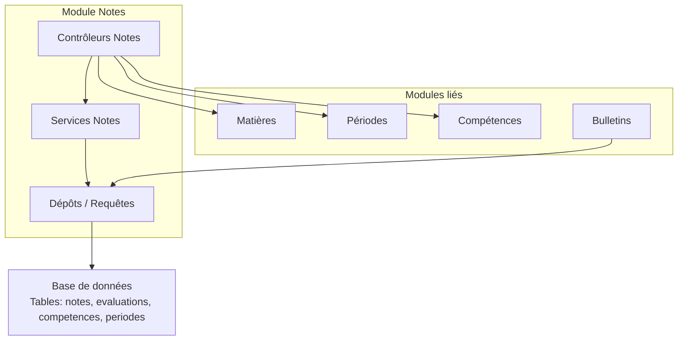
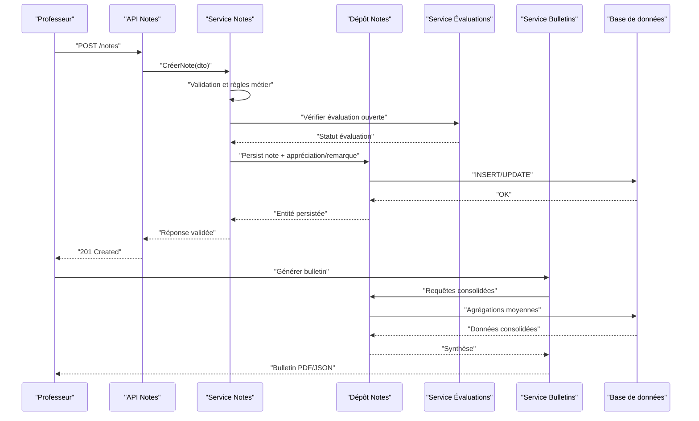
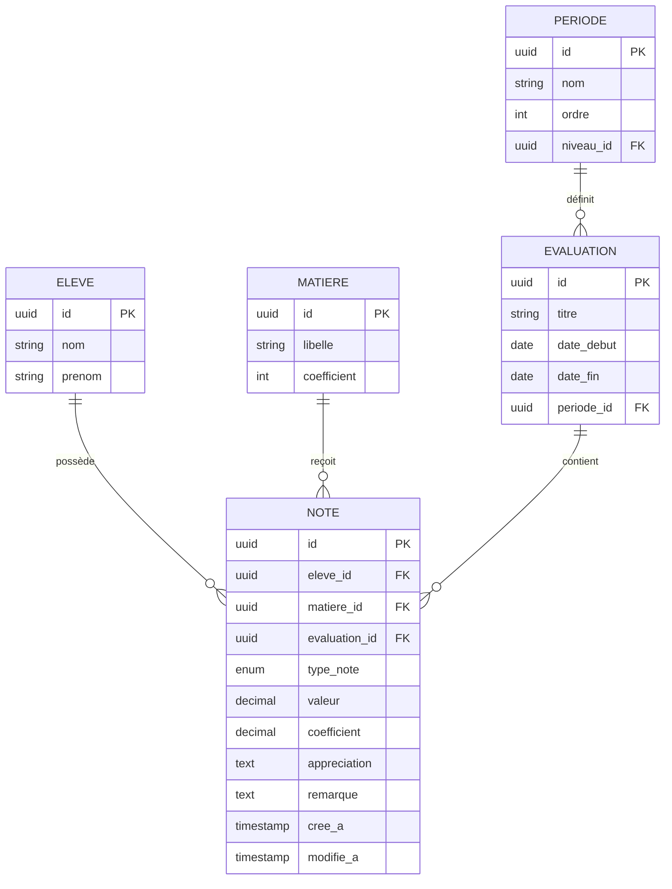
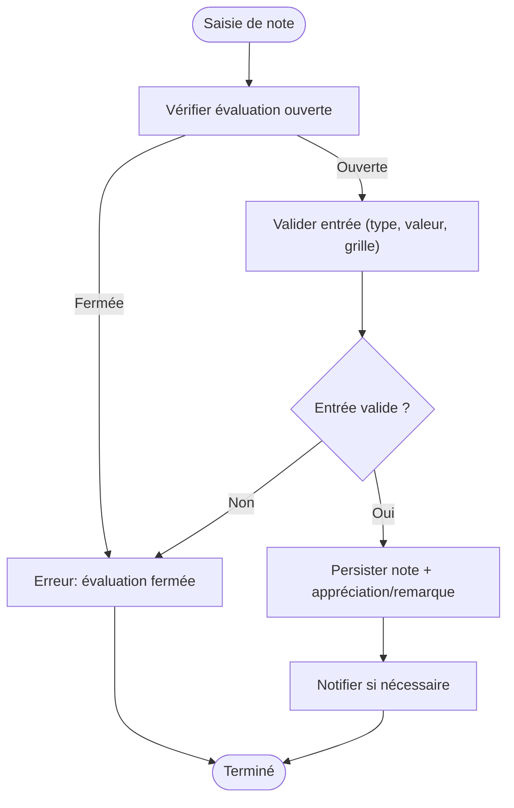
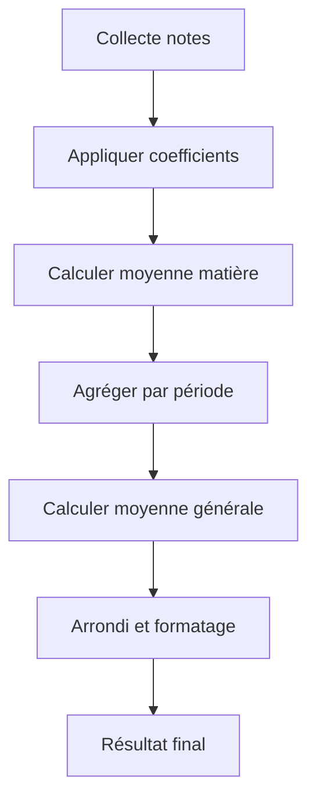
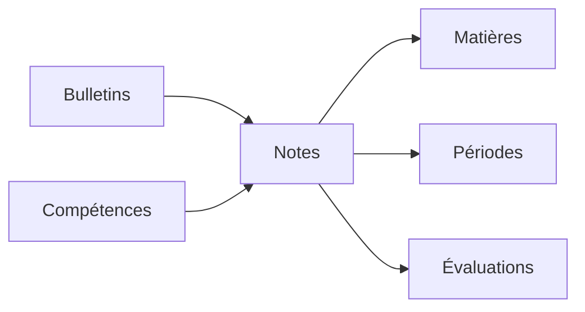

# Notes et Évaluations

<cite>
**Fichiers référencés dans ce document**
- [backend/src/modules/notes](file://backend/src/modules/notes)
- [backend/database/migrations/123-refonte-notes-bulletins.sql](file://backend/database/migrations/123-refonte-notes-bulletins.sql)
- [backend/database/migrations/062-creer-table-evaluations-competences.sql](file://backend/database/migrations/062-creer-table-evaluations-competences.sql)
- [backend/database/migrations/059-ajouter-a-matiere-sous-systeme.sql](file://backend/database/migrations/059-ajouter-a-matiere-sous-systeme.sql)
- [backend/database/migrations/060-ajouter-affectation-matiere-coefficient.sql](file://backend/database/migrations/060-ajouter-affectation-matiere-coefficient.sql)
- [backend/database/migrations/084-cleanup-classe-id-notes.sql](file://backend/database/migrations/084-cleanup-classe-id-notes.sql)
- [backend/database/migrations/085-periode-etablissement-id.sql](file://backend/database/migrations/085-periode-etablissement-id.sql)
- [backend/database/migrations/102-periodes-hierarchie.sql](file://backend/database/migrations/102-periodes-hierarchie.sql)
- [backend/database/migrations/103-templates-periode-personnalisables.sql](file://backend/database/migrations/103-templates-periode-personnalisables.sql)
- [backend/database/migrations/104-refonte-periodes-niveaux-configurables.sql](file://backend/database/migrations/104-refonte-periodes-niveaux-configurables.sql)
- [backend/database/migrations/106-rename-sequence-to-evaluation.sql](file://backend/database/migrations/106-rename-sequence-to-evaluation.sql)
- [backend/src/modules/bulletins](file://backend/src/modules/bulletins)
- [backend/src/modules/competences](file://backend/src/modules/competences)
- [backend/src/modules/matieres](file://backend/src/modules/matieres)
- [backend/src/modules/periodes](file://backend/src/modules/periodes)
- [backend/src/routes/route-registry.ts](file://backend/src/routes/route-registry.ts)
</cite>

## Table des matières
1. [Introduction](#introduction)
2. [Structure du projet](#structure-du-projet)
3. [Composants clés](#composants-clés)
4. [Vue d'ensemble de l’architecture](#vue-densemble-de-larchitecture)
5. [Analyse détaillée des composants](#analyse-detallee-des-composants)
6. [Analyse des dépendances](#analyse-des-dependances)
7. [Considérations de performance](#considerations-de-performance)
8. [Guide de dépannage](#guide-de-depannage)
9. [Conclusion](#conclusion)
10. [Annexes](#annexes)

## Introduction
Ce document présente le système de notes et évaluations d’eLISAschool, centré sur l’entité Note, ses types, coefficients et périodes d’évaluation. Il décrit les workflows de saisie, les calculs automatiques de moyennes, les règles de validation, les API de gestion, ainsi que les intégrations avec les compétences et les évaluations continues. Des exemples de configurations de grille de notation et des cas d’usage complexes sont fournis, en lien avec les appréciations, remarques et rapports d’évaluation.

## Structure du projet
Le module Notes est organisé autour de plusieurs couches :
- Entités et schémas de base de données (migrations SQL)
- Services et contrôleurs pour la logique métier et les API
- Intégrations avec les modules Matières, Périodes, Compétences et Bulletins
- Routes centralisées pour exposer les endpoints

[Ce diagramme est conceptuel et ne mape pas directement des fichiers spécifiques]

## Composants clés
- Entité Note : représente une évaluation chiffrée ou qualitative associée à un élève, une matière, une période et une évaluation (séquence).
- Types de note : numérique, alphabétique, qualitatif, compétence.
- Coefficients : pondération par matière/affectation pour le calcul de moyenne.
- Périodes d’évaluation : hiérarchisées et configurables par niveau, avec templates personnalisables.
- Grille de notation : échelles, bornes, seuils et correspondances qualitatives.
- Appréciations et remarques : commentaires libres ou prédéfinis associés aux notes.
- Calculs de moyennes : agrégation par matière, période, classe, élève, avec pondération.
- Rapports d’évaluation : bulletins et synthèses consolidées.

**Section sources**
- [backend/database/migrations/123-refonte-notes-bulletins.sql](file://backend/database/migrations/123-refonte-notes-bulletins.sql)
- [backend/database/migrations/062-creer-table-evaluations-competences.sql](file://backend/database/migrations/062-creer-table-evaluations-competences.sql)
- [backend/database/migrations/059-ajouter-a-matiere-sous-systeme.sql](file://backend/database/migrations/059-ajouter-a-matiere-sous-systeme.sql)
- [backend/database/migrations/060-ajouter-affectation-matiere-coefficient.sql](file://backend/database/migrations/060-ajouter-affectation-matiere-coefficient.sql)
- [backend/database/migrations/084-cleanup-classe-id-notes.sql](file://backend/database/migrations/084-cleanup-classe-id-notes.sql)
- [backend/database/migrations/085-periode-etablissement-id.sql](file://backend/database/migrations/085-periode-etablissement-id.sql)
- [backend/database/migrations/102-periodes-hierarchie.sql](file://backend/database/migrations/102-periodes-hierarchie.sql)
- [backend/database/migrations/103-templates-periode-personnalisables.sql](file://backend/database/migrations/103-templates-periode-personnalisables.sql)
- [backend/database/migrations/104-refonte-periodes-niveaux-configurables.sql](file://backend/database/migrations/104-refonte-periodes-niveaux-configurables.sql)
- [backend/database/migrations/106-rename-sequence-to-evaluation.sql](file://backend/database/migrations/106-rename-sequence-to-evaluation.sql)

## Vue d’ensemble de l’architecture
Le flux de traitement des notes s’articule entre les contrôleurs, les services, les dépôts et la base de données, avec des validations et calculs centralisés. Les bulletins consomment les données consolidées pour générer les rapports.

**Diagramme sources**
- [backend/src/modules/notes](file://backend/src/modules/notes)
- [backend/src/modules/bulletins](file://backend/src/modules/bulletins)
- [backend/src/modules/competences](file://backend/src/modules/competences)
- [backend/src/modules/matieres](file://backend/src/modules/matieres)
- [backend/src/modules/periodes](file://backend/src/modules/periodes)
- [backend/src/routes/route-registry.ts](file://backend/src/routes/route-registry.ts)

## Analyse détaillée des composants

### Entité Note et modèles de données
- Champs essentiels : identifiant, élève, matière, évaluation (séquence), période, type de note, valeur, coefficient, appréciation, remarque, statut, horodatages.
- Relations :
  - Élève → Note (un élève a plusieurs notes)
  - Matière → Note (une matière peut avoir plusieurs notes)
  - Évaluation → Note (plusieurs notes peuvent être liées à une évaluation)
  - Période → Note (liens hiérarchiques via période)
- Contraintes et index : unicité par combinaison élève/évaluation/type, index sur période et matière pour performances.

**Diagramme sources**
- [backend/database/migrations/123-refonte-notes-bulletins.sql](file://backend/database/migrations/123-refonte-notes-bulletins.sql)
- [backend/database/migrations/062-creer-table-evaluations-competences.sql](file://backend/database/migrations/062-creer-table-evaluations-competences.sql)
- [backend/database/migrations/059-ajouter-a-matiere-sous-systeme.sql](file://backend/database/migrations/059-ajouter-a-matiere-sous-systeme.sql)
- [backend/database/migrations/060-ajouter-affectation-matiere-coefficient.sql](file://backend/database/migrations/060-ajouter-affectation-matiere-coefficient.sql)
- [backend/database/migrations/102-periodes-hierarchie.sql](file://backend/database/migrations/102-periodes-hierarchie.sql)

**Section sources**
- [backend/database/migrations/123-refonte-notes-bulletins.sql](file://backend/database/migrations/123-refonte-notes-bulletins.sql)
- [backend/database/migrations/062-creer-table-evaluations-competences.sql](file://backend/database/migrations/062-creer-table-evaluations-competences.sql)
- [backend/database/migrations/059-ajouter-a-matiere-sous-systeme.sql](file://backend/database/migrations/059-ajouter-a-matiere-sous-systeme.sql)
- [backend/database/migrations/060-ajouter-affectation-matiere-coefficient.sql](file://backend/database/migrations/060-ajouter-affectation-matiere-coefficient.sql)
- [backend/database/migrations/102-periodes-hierarchie.sql](file://backend/database/migrations/102-periodes-hierarchie.sql)

### Workflow de saisie des notes
- Ouverture de l’évaluation : vérification de la fenêtre temporelle et autorisation.
- Saisie : validation du type de note, borne minimale/maximale, cohérence avec la grille.
- Persistance : création ou mise à jour de la note, stockage des appréciations et remarques.
- Validation croisée : contrôle des doublons, des conflits de période, et des coefficients.
- Notification : alertes aux responsables si requis.

**Diagramme sources**
- [backend/src/modules/notes](file://backend/src/modules/notes)
- [backend/database/migrations/106-rename-sequence-to-evaluation.sql](file://backend/database/migrations/106-rename-sequence-to-evaluation.sql)

**Section sources**
- [backend/src/modules/notes](file://backend/src/modules/notes)
- [backend/database/migrations/106-rename-sequence-to-evaluation.sql](file://backend/database/migrations/106-rename-sequence-to-evaluation.sql)

### Calculs automatiques de moyennes
- Moyenne par matière : somme pondérée des notes divisée par la somme des coefficients.
- Moyenne par période : agrégation des matières selon les coefficients d’affectation.
- Moyenne générale : agrégation des moyennes par matière avec pondération globale.
- Gestion des absences et valeurs manquantes : exclusion ou pénalité selon configuration.
- Arrondis et formats : règles d’arrondi et affichage décimal.

**Diagramme sources**
- [backend/database/migrations/060-ajouter-affectation-matiere-coefficient.sql](file://backend/database/migrations/060-ajouter-affectation-matiere-coefficient.sql)
- [backend/database/migrations/123-refonte-notes-bulletins.sql](file://backend/database/migrations/123-refonte-notes-bulletins.sql)

**Section sources**
- [backend/database/migrations/060-ajouter-affectation-matiere-coefficient.sql](file://backend/database/migrations/060-ajouter-affectation-matiere-coefficient.sql)
- [backend/database/migrations/123-refonte-notes-bulletins.sql](file://backend/database/migrations/123-refonte-notes-bulletins.sql)

### Règles de validation
- Type de note : numérique, alphabétique, qualitatif, compétence.
- Bornes et seuils : minimum, maximum, paliers, seuils de réussite.
- Cohérence évaluation : dates, statuts, permissions.
- Unicité et doublons : empêcher les saisies multiples pour la même évaluation.
- Intégrité référentielle : vérifier existence de matière, élève, évaluation, période.

**Section sources**
- [backend/database/migrations/123-refonte-notes-bulletins.sql](file://backend/database/migrations/123-refonte-notes-bulletins.sql)
- [backend/database/migrations/062-creer-table-evaluations-competences.sql](file://backend/database/migrations/062-creer-table-evaluations-competences.sql)

### API endpoints pour la gestion des notes
Endpoints typiques (à adapter selon implémentation exacte) :
- POST /api/notes : créer une note
- GET /api/notes/:id : obtenir une note
- PUT /api/notes/:id : modifier une note
- DELETE /api/notes/:id : supprimer une note
- GET /api/notes?eleveId=...&matiereId=...&periodeId=... : lister/filtrer
- POST /api/notes/batch : saisie groupée
- GET /api/notes/synthese?eleveId=...&periodeId=... : synthèse par élève/période
- POST /api/notes/appreciations : associer appréciation
- POST /api/notes/remarques : associer remarque

Ces routes sont généralement enregistrées via le registre de routes centralisé.

**Section sources**
- [backend/src/routes/route-registry.ts](file://backend/src/routes/route-registry.ts)
- [backend/src/modules/notes](file://backend/src/modules/notes)

### Intégrations avec les compétences et évaluations continues
- Compétences : notes liées à des compétences avec niveaux de maîtrise.
- Évaluations continues : suivi longitudinal, agrégation sur durée longue.
- Grilles de compétences : échelles qualitatives, seuils, transitions.
- Agrégation compétences : moyenne composite par domaine, bilan global.

**Section sources**
- [backend/database/migrations/062-creer-table-evaluations-competences.sql](file://backend/database/migrations/062-creer-table-evaluations-competences.sql)
- [backend/src/modules/competences](file://backend/src/modules/competences)

### Exemples de configurations de grille de notation
- Grille numérique : bornes 0–20, paliers 10/12/14/16, seuils réussite 10.
- Grille alphabétique : A, B, C, D, E avec correspondance numérique.
- Grille qualitative : Très bien, Bien, Assez bien, Passable, Insuffisant.
- Grille compétences : niveaux 1–4, seuils de progression, domaines.

Exemple de configuration (conceptuel) :
- Échelle : 0–20
- Paliers : 10 (passage), 12 (bien), 14 (très bien), 16 (excellence)
- Coefficients : par matière (ex. Math 3, Français 2)
- Absences : non comptabilisées ou pénalisées selon politique

[Ce contenu est conceptuel et ne mape pas directement des fichiers spécifiques]

### Cas d’utilisation complexes
- Saisie groupée : import CSV, validation batch, rollback partiel.
- Correction de notes : historique des modifications, traçabilité.
- Moyennes conditionnelles : exclure certaines évaluations, appliquer pénalités.
- Bulletins multi-périodes : consolidation par trimestre/semestre, comparaisons.
- Compétences transversales : agrégation par domaine, bilans annuels.

[Ce contenu est conceptuel et ne mape pas directement des fichiers spécifiques]

### Fonctionnalités avancées : appréciations, remarques et rapports
- Appréciations : commentaires structurés, modèles prédéfinis, personnalisation par matière.
- Remarques : observations libres, tags, catégorisation.
- Rapports d’évaluation : bulletins imprimables, exports JSON/PDF, tableaux de bord.
- Traçabilité : audit des modifications, versions, approbations.

**Section sources**
- [backend/database/migrations/123-refonte-notes-bulletins.sql](file://backend/database/migrations/123-refonte-notes-bulletins.sql)
- [backend/src/modules/bulletins](file://backend/src/modules/bulletins)

## Analyse des dépendances
Les modules Notes dépendent de Matières, Périodes, Évaluations et Bulletins. La base de données assure l’intégrité référentielle et les index optimisent les requêtes fréquentes.

**Diagramme sources**
- [backend/src/modules/notes](file://backend/src/modules/notes)
- [backend/src/modules/matieres](file://backend/src/modules/matieres)
- [backend/src/modules/periodes](file://backend/src/modules/periodes)
- [backend/src/modules/competences](file://backend/src/modules/competences)
- [backend/src/modules/bulletins](file://backend/src/modules/bulletins)

**Section sources**
- [backend/src/modules/notes](file://backend/src/modules/notes)
- [backend/src/modules/matieres](file://backend/src/modules/matieres)
- [backend/src/modules/periodes](file://backend/src/modules/periodes)
- [backend/src/modules/competences](file://backend/src/modules/competences)
- [backend/src/modules/bulletins](file://backend/src/modules/bulletins)

## Considérations de performance
- Indexation : clé primaire et index composites sur (eleve_id, evaluation_id, type_note), (periode_id, matiere_id).
- Agrégations SQL : vues matérialisées pour bulletins, requêtes pré-calculées.
- Batch processing : opérations groupées pour saisie massive.
- Cache : résultats de synthèse pour lectures fréquentes.
- Limitation de charge : pagination, filtrage, requêtes optimisées.

[Ce contenu fournit des recommandations générales sans analyse de fichiers spécifiques]

## Guide de dépannage
- Erreur “évaluation fermée” : vérifier dates et statut de l’évaluation.
- Doublon de note : vérifier unicité par combinaison élève/évaluation/type.
- Coefficient invalide : valider affectation matière/coefficient.
- Problèmes de périodes : vérifier hiérarchie et appartenance établissement.
- Performance lente : analyser index, requêtes, vues matérialisées.

**Section sources**
- [backend/database/migrations/084-cleanup-classe-id-notes.sql](file://backend/database/migrations/084-cleanup-classe-id-notes.sql)
- [backend/database/migrations/085-periode-etablissement-id.sql](file://backend/database/migrations/085-periode-etablissement-id.sql)
- [backend/database/migrations/102-periodes-hierarchie.sql](file://backend/database/migrations/102-periodes-hierarchie.sql)

## Conclusion
Le système de notes et évaluations d’eLISAschool offre une architecture robuste, flexible et performante, permettant une saisie précise, des calculs fiables et des rapports riches. L’intégration avec les compétences et les évaluations continues enrichit le suivi pédagogique. Les bonnes pratiques de validation, indexation et agrégation garantissent fiabilité et évolutivité.

[Ce résumé ne nécessite pas de sources spécifiques]

## Annexes
- Glossaire : termes clés (note, évaluation, période, coefficient, appréciation, remarque).
- Références migrations : liste des migrations pertinentes pour la refonte des notes et bulletins.
- Exemples de payloads API : structures attendues pour création/modification de notes.

[Ce contenu est informatif et ne mape pas directement des fichiers spécifiques]