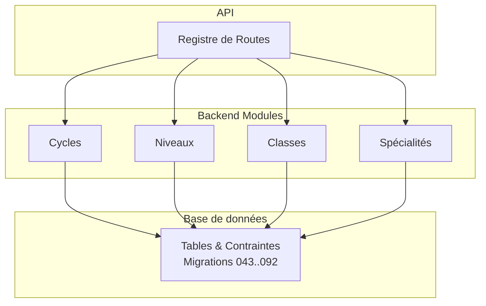
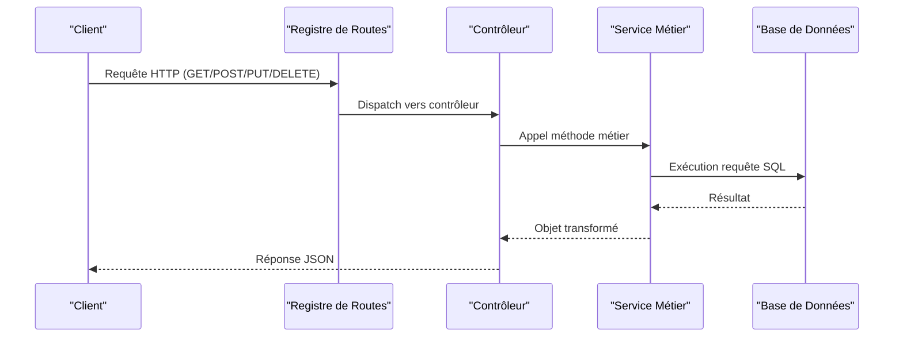
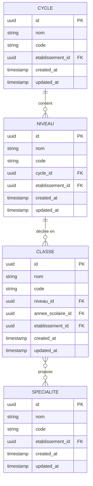
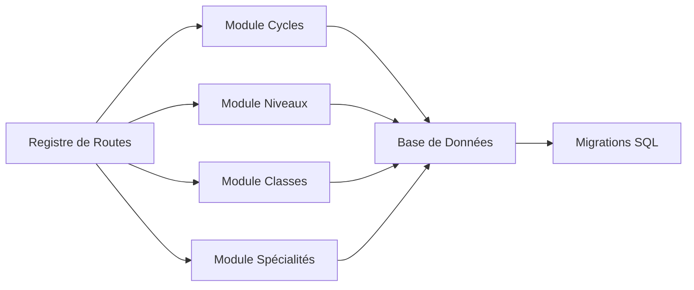

# Structure Académique

<cite>
**Fichiers référencés dans ce document**
- [043-structure-academique-v4.sql](file://backend/database/migrations/043-structure-academique-v4.sql)
- [053-structure-academique-complete.sql](file://backend/database/migrations/053-structure-academique-complete.sql)
- [054-refonte-structure-academique-v2.sql](file://backend/database/migrations/054-refonte-structure-academique-v2.sql)
- [058-multi-tenant-structure-academique.sql](file://backend/database/migrations/058-multi-tenant-structure-academique.sql)
- [072-scoping-cycles-niveaux.sql](file://backend/database/migrations/072-scoping-cycles-niveaux.sql)
- [088-refactorisation-architecture-academique.sql](file://backend/database/migrations/088-refactorisation-architecture-academique.sql)
- [089-finalisation-architecture-academique-v2.sql](file://backend/database/migrations/089-finalisation-architecture-academique-v2.sql)
- [091-peuplement-architecture-academique.sql](file://backend/database/migrations/091-peuplement-architecture-academique.sql)
- [092-refactorisation-classeAnneeId.sql](file://backend/database/migrations/092-refactorisation-classeAnneeId.sql)
- [cycles/index.ts](file://backend/src/modules/cycles/index.ts)
- [niveaux/index.ts](file://backend/src/modules/niveaux/index.ts)
- [classes/index.ts](file://backend/src/modules/classes/index.ts)
- [specialites/index.ts](file://backend/src/modules/specialites/index.ts)
- [route-registry.ts](file://backend/src/routes/route-registry.ts)
- [ANALYSE-CONTEXTE-AFRICAIN-CAMEROUN.md](file://docs/analyses/ANALYSE-CONTEXTE-AFRICAIN-CAMEROUN.md)
- [GUIDE-STRUCTURE-ACADEMIQUE.md](file://docs/guides/GUIDE-STRUCTURE-ACADEMIQUE.md)
- [RAPPORT-EXECUTION-FINAL-CORRECTIONS-ACADEMIQUE.md](file://docs/rapports/RAPPORT-EXECUTION-FINAL-CORRECTIONS-ACADEMIQUE.md)
</cite>

## Table des matières
1. [Introduction](#introduction)
2. [Structure du projet](#structure-du-projet)
3. [Composants clés](#composants-clés)
4. [Vue d'ensemble de l'architecture](#vue-densemble-de-larchitecture)
5. [Analyse détaillée des composants](#analyse-detaillee-des-composants)
6. [Analyse des dépendances](#analyse-des-dependances)
7. [Considérations de performance](#considerations-de-performance)
8. [Guide de dépannage](#guide-de-depannage)
9. [Conclusion](#conclusion)
10. [Annexes](#annexes)

## Introduction
Ce document présente la structure académique configurable d'eLISAschool, centrée sur les entités Cycle, Niveau, Classe et Spécialité. Il explique le modèle de données, les contraintes métier et les règles de validation propres au système éducatif africain, détaille les API CRUD pour gérer ces entités, propose des exemples de configuration, décrit les migrations associées et aborde l'intégration multi-tenant ainsi que la personnalisation par établissement.

## Structure du projet
La structure académique est implémentée via plusieurs modules backend (cycles, niveaux, classes, specialites), des migrations SQL évolutives et un registre de routes qui expose les endpoints. Les fichiers de migration montrent une évolution progressive vers une architecture robuste, scannée par établissement et compatible avec les spécificités régionales.

**Sources de diagramme**
- [route-registry.ts](file://backend/src/routes/route-registry.ts)
- [043-structure-academique-v4.sql](file://backend/database/migrations/043-structure-academique-v4.sql)
- [053-structure-academique-complete.sql](file://backend/database/migrations/053-structure-academique-complete.sql)
- [054-refonte-structure-academique-v2.sql](file://backend/database/migrations/054-refonte-structure-academique-v2.sql)
- [058-multi-tenant-structure-academique.sql](file://backend/database/migrations/058-multi-tenant-structure-academique.sql)
- [072-scoping-cycles-niveaux.sql](file://backend/database/migrations/072-scoping-cycles-niveaux.sql)
- [088-refactorisation-architecture-academique.sql](file://backend/database/migrations/088-refactorisation-architecture-academique.sql)
- [089-finalisation-architecture-academique-v2.sql](file://backend/database/migrations/089-finalisation-architecture-academique-v2.sql)
- [091-peuplement-architecture-academique.sql](file://backend/database/migrations/091-peuplement-architecture-academique.sql)
- [092-refactorisation-classeAnneeId.sql](file://backend/database/migrations/092-refactorisation-classeAnneeId.sql)

**Sources de section**
- [route-registry.ts](file://backend/src/routes/route-registry.ts)
- [043-structure-academique-v4.sql](file://backend/database/migrations/043-structure-academique-v4.sql)
- [053-structure-academique-complete.sql](file://backend/database/migrations/053-structure-academique-complete.sql)
- [054-refonte-structure-academique-v2.sql](file://backend/database/migrations/054-refonte-structure-academique-v2.sql)
- [058-multi-tenant-structure-academique.sql](file://backend/database/migrations/058-multi-tenant-structure-academique.sql)
- [072-scoping-cycles-niveaux.sql](file://backend/database/migrations/072-scoping-cycles-niveaux.sql)
- [088-refactorisation-architecture-academique.sql](file://backend/database/migrations/088-refactorisation-architecture-academique.sql)
- [089-finalisation-architecture-academique-v2.sql](file://backend/database/migrations/089-finalisation-architecture-academique-v2.sql)
- [091-peuplement-architecture-academique.sql](file://backend/database/migrations/091-peuplement-architecture-academique.sql)
- [092-refactorisation-classeAnneeId.sql](file://backend/database/migrations/092-refactorisation-classeAnneeId.sql)

## Composants clés
Les quatre entités principales sont :
- Cycle : regroupe des niveaux scolaires (ex. primaire, secondaire).
- Niveau : représente un échelon pédagogique (ex. 6e, Terminale).
- Classe : instance opérationnelle d’un niveau (ex. 6e A).
- Spécialité : offre des parcours ou options pédagogiques (ex. scientifique, littéraire).

Relations hiérarchiques :
- Un Cycle contient plusieurs Niveaux.
- Un Niveau peut être associé à plusieurs Classes.
- Une Classe peut proposer des Spécialités.

Contraintes métier et validation :
- Hiérarchie stricte : un Niveau appartient à un seul Cycle ; une Classe appartient à un seul Niveau.
- Unicité par établissement : noms et codes doivent être uniques dans le périmètre de l’établissement.
- Cohérence temporelle : les périodes et années scolaires impactent l’activation des classes et niveaux.
- Spécificités africaines : gestion des cycles courts/longs, redoublements, filières, et séquences d’évaluation adaptées aux contextes régionaux.

**Sources de section**
- [043-structure-academique-v4.sql](file://backend/database/migrations/043-structure-academique-v4.sql)
- [053-structure-academique-complete.sql](file://backend/database/migrations/053-structure-academique-complete.sql)
- [054-refonte-structure-academique-v2.sql](file://backend/database/migrations/054-refonte-structure-academique-v2.sql)
- [058-multi-tenant-structure-academique.sql](file://backend/database/migrations/058-multi-tenant-structure-academique.sql)
- [072-scoping-cycles-niveaux.sql](file://backend/database/migrations/072-scoping-cycles-niveaux.sql)
- [088-refactorisation-architecture-academique.sql](file://backend/database/migrations/088-refactorisation-architecture-academique.sql)
- [089-finalisation-architecture-academique-v2.sql](file://backend/database/migrations/089-finalisation-architecture-academique-v2.sql)
- [091-peuplement-architecture-academique.sql](file://backend/database/migrations/091-peuplement-architecture-academique.sql)
- [092-refactorisation-classeAnneeId.sql](file://backend/database/migrations/092-refactorisation-classeAnneeId.sql)
- [ANALYSE-CONTEXTE-AFRICAIN-CAMEROUN.md](file://docs/analyses/ANALYSE-CONTEXTE-AFRICAIN-CAMEROUN.md)

## Vue d'ensemble de l'architecture
Le système suit une architecture modulaire où chaque entité académique dispose de son propre module (controllers, services, DTOs, validations). Les routes sont centralisées dans un registre qui expose les endpoints REST. La base de données est structurée via des migrations SQL évolutives assurant l’intégrité référentielle et le scoping multi-tenant.

**Sources de diagramme**
- [route-registry.ts](file://backend/src/routes/route-registry.ts)
- [cycles/index.ts](file://backend/src/modules/cycles/index.ts)
- [niveaux/index.ts](file://backend/src/modules/niveaux/index.ts)
- [classes/index.ts](file://backend/src/modules/classes/index.ts)
- [specialites/index.ts](file://backend/src/modules/specialites/index.ts)

## Analyse détaillée des composants

### Modèle de données et relations
Le modèle de données repose sur quatre tables principales avec des relations hiérarchiques et des contraintes d’intégrité. Les migrations successives ont ajouté le scoping par établissement, des index de performance, et des vérifications de cohérence.

**Sources de diagramme**
- [043-structure-academique-v4.sql](file://backend/database/migrations/043-structure-academique-v4.sql)
- [053-structure-academique-complete.sql](file://backend/database/migrations/053-structure-academique-complete.sql)
- [054-refonte-structure-academique-v2.sql](file://backend/database/migrations/054-refonte-structure-academique-v2.sql)
- [058-multi-tenant-structure-academique.sql](file://backend/database/migrations/058-multi-tenant-structure-academique.sql)
- [072-scoping-cycles-niveaux.sql](file://backend/database/migrations/072-scoping-cycles-niveaux.sql)
- [088-refactorisation-architecture-academique.sql](file://backend/database/migrations/088-refactorisation-architecture-academique.sql)
- [089-finalisation-architecture-academique-v2.sql](file://backend/database/migrations/089-finalisation-architecture-academique-v2.sql)
- [091-peuplement-architecture-academique.sql](file://backend/database/migrations/091-peuplement-architecture-academique.sql)
- [092-refactorisation-classeAnneeId.sql](file://backend/database/migrations/092-refactorisation-classeAnneeId.sql)

**Sources de section**
- [043-structure-academique-v4.sql](file://backend/database/migrations/043-structure-academique-v4.sql)
- [053-structure-academique-complete.sql](file://backend/database/migrations/053-structure-academique-complete.sql)
- [054-refonte-structure-academique-v2.sql](file://backend/database/migrations/054-refonte-structure-academique-v2.sql)
- [058-multi-tenant-structure-academique.sql](file://backend/database/migrations/058-multi-tenant-structure-academique.sql)
- [072-scoping-cycles-niveaux.sql](file://backend/database/migrations/072-scoping-cycles-niveaux.sql)
- [088-refactorisation-architecture-academique.sql](file://backend/database/migrations/088-refactorisation-architecture-academique.sql)
- [089-finalisation-architecture-academique-v2.sql](file://backend/database/migrations/089-finalisation-architecture-academique-v2.sql)
- [091-peuplement-architecture-academique.sql](file://backend/database/migrations/091-peuplement-architecture-academique.sql)
- [092-refactorisation-classeAnneeId.sql](file://backend/database/migrations/092-refactorisation-classeAnneeId.sql)

### API Endpoints CRUD
Les endpoints REST permettent de créer, lire, mettre à jour et supprimer les entités académiques. Le registre de routes définit les chemins et les contrôleurs associés.

Exemples de routes :
- GET /api/cycles, POST /api/cycles, PUT /api/cycles/:id, DELETE /api/cycles/:id
- GET /api/niveaux, POST /api/niveaux, PUT /api/niveaux/:id, DELETE /api/niveaux/:id
- GET /api/classes, POST /api/classes, PUT /api/classes/:id, DELETE /api/classes/:id
- GET /api/specialites, POST /api/specialites, PUT /api/specialites/:id, DELETE /api/specialites/:id

Chaque endpoint inclut :
- Validation des entrées (DTOs)
- Vérification du contexte multi-tenant (établissement)
- Retour d’erreurs standardisées

**Sources de section**
- [route-registry.ts](file://backend/src/routes/route-registry.ts)
- [cycles/index.ts](file://backend/src/modules/cycles/index.ts)
- [niveaux/index.ts](file://backend/src/modules/niveaux/index.ts)
- [classes/index.ts](file://backend/src/modules/classes/index.ts)
- [specialites/index.ts](file://backend/src/modules/specialites/index.ts)

### Règles de validation et contraintes métier
- Unicité : noms et codes uniques par établissement pour chaque entité.
- Hiérarchie : un Niveau doit appartenir à un Cycle existant ; une Classe doit appartenir à un Niveau existant.
- Activation : les entités peuvent être activées/désactivées selon les années scolaires et périodes.
- Intégrité référentielle : clés étrangères garantissent la cohérence entre Cycle-Niveau-Classe-Spécialité.
- Contexte africain : prise en charge des cycles courts/longs, filières, et séquences d’évaluation spécifiques.

**Sources de section**
- [043-structure-academique-v4.sql](file://backend/database/migrations/043-structure-academique-v4.sql)
- [053-structure-academique-complete.sql](file://backend/database/migrations/053-structure-academique-complete.sql)
- [054-refonte-structure-academique-v2.sql](file://backend/database/migrations/054-refonte-structure-academique-v2.sql)
- [058-multi-tenant-structure-academique.sql](file://backend/database/migrations/058-multi-tenant-structure-academique.sql)
- [072-scoping-cycles-niveaux.sql](file://backend/database/migrations/072-scoping-cycles-niveaux.sql)
- [088-refactorisation-architecture-academique.sql](file://backend/database/migrations/088-refactorisation-architecture-academique.sql)
- [089-finalisation-architecture-academique-v2.sql](file://backend/database/migrations/089-finalisation-architecture-academique-v2.sql)
- [091-peuplement-architecture-academique.sql](file://backend/database/migrations/091-peuplement-architecture-academique.sql)
- [092-refactorisation-classeAnneeId.sql](file://backend/database/migrations/092/refactorisation-classeAnneeId.sql)
- [ANALYSE-CONTEXTE-AFRICAIN-CAMEROUN.md](file://docs/analyses/ANALYSE-CONTEXTE-AFRICAIN-CAMEROUN.md)

### Migrations de base de données
Les migrations suivantes définissent et évoluent la structure académique :
- 043 : création initiale des tables Cycle, Niveau, Classe, Spécialité
- 053 : complétion du modèle avec champs et contraintes
- 054 : refonte v2 pour améliorer la flexibilité
- 058 : intégration multi-tenant (établissement_id)
- 072 : scoping des cycles et niveaux par établissement
- 088/089 : refactorisation finale de l’architecture académique
- 091 : peuplement initial des données
- 092 : correction de la relation classe-annee-scolaire

**Sources de section**
- [043-structure-academique-v4.sql](file://backend/database/migrations/043-structure-academique-v4.sql)
- [053-structure-academique-complete.sql](file://backend/database/migrations/053-structure-academique-complete.sql)
- [054-refonte-structure-academique-v2.sql](file://backend/database/migrations/054-refonte-structure-academique-v2.sql)
- [058-multi-tenant-structure-academique.sql](file://backend/database/migrations/058-multi-tenant-structure-academique.sql)
- [072-scoping-cycles-niveaux.sql](file://backend/database/migrations/072-scoping-cycles-niveaux.sql)
- [088-refactorisation-architecture-academique.sql](file://backend/database/migrations/088-refactorisation-architecture-academique.sql)
- [089-finalisation-architecture-academique-v2.sql](file://backend/database/migrations/089-finalisation-architecture-academique-v2.sql)
- [091-peuplement-architecture-academique.sql](file://backend/database/migrations/091-peuplement-architecture-academique.sql)
- [092-refactorisation-classeAnneeId.sql](file://backend/database/migrations/092-refactorisation-classeAnneeId.sql)

### Intégration multi-tenant et personnalisation par établissement
Chaque entité académique est scannée par établissement_id, permettant une isolation complète des données entre établissements. Les migrations ajoutent des contraintes d’unicité par établissement et des index pour optimiser les requêtes.

Points clés :
- Scoping strict par établissement_id
- Unicité des noms et codes par établissement
- Index composites pour performances
- Permissions RBAC par établissement

**Sources de section**
- [058-multi-tenant-structure-academique.sql](file://backend/database/migrations/058-multi-tenant-structure-academique.sql)
- [072-scoping-cycles-niveaux.sql](file://backend/database/migrations/072-scoping-cycles-niveaux.sql)
- [088-refactorisation-architecture-academique.sql](file://backend/database/migrations/088-refactorisation-architecture-academique.sql)
- [089-finalisation-architecture-academique-v2.sql](file://backend/database/migrations/089-finalisation-architecture-academique-v2.sql)

## Analyse des dépendances
Les modules académiques dépendent des migrations SQL et du registre de routes. Les services implémentent la logique métier et interagissent avec la base de données via des requêtes sécurisées.

**Sources de diagramme**
- [route-registry.ts](file://backend/src/routes/route-registry.ts)
- [cycles/index.ts](file://backend/src/modules/cycles/index.ts)
- [niveaux/index.ts](file://backend/src/modules/niveaux/index.ts)
- [classes/index.ts](file://backend/src/modules/classes/index.ts)
- [specialites/index.ts](file://backend/src/modules/specialites/index.ts)
- [043-structure-academique-v4.sql](file://backend/database/migrations/043-structure-academique-v4.sql)

**Sources de section**
- [route-registry.ts](file://backend/src/routes/route-registry.ts)
- [cycles/index.ts](file://backend/src/modules/cycles/index.ts)
- [niveaux/index.ts](file://backend/src/modules/niveaux/index.ts)
- [classes/index.ts](file://backend/src/modules/classes/index.ts)
- [specialites/index.ts](file://backend/src/modules/specialites/index.ts)
- [043-structure-academique-v4.sql](file://backend/database/migrations/043-structure-academique-v4.sql)

## Considérations de performance
- Index composites sur les colonnes fréquentes (etablissement_id, cycle_id, niveau_id)
- Requêtes optimisées avec jointures minimales
- Pagination pour les listes volumineuses
- Cache côté application pour les configurations statiques

[No sources needed since this section provides general guidance]

## Guide de dépannage
Problèmes courants et solutions :
- Erreurs de contrainte unique : vérifier les doublons de noms/codes par établissement
- Problèmes de hiérarchie : s’assurer que les références (cycle_id, niveau_id) existent
- Accès refusé : vérifier les permissions RBAC et le contexte multi-tenant
- Performances dégradées : analyser les index et les requêtes lentes

**Sources de section**
- [RAPPORT-EXECUTION-FINAL-CORRECTIONS-ACADEMIQUE.md](file://docs/rapports/RAPPORT-EXECUTION-FINAL-CORRECTIONS-ACADEMIQUE.md)
- [043-structure-academique-v4.sql](file://backend/database/migrations/043-structure-academique-v4.sql)
- [053-structure-academique-complete.sql](file://backend/database/migrations/053-structure-academique-complete.sql)
- [054-refonte-structure-academique-v2.sql](file://backend/database/migrations/054-refonte-structure-academique-v2.sql)
- [058-multi-tenant-structure-academique.sql](file://backend/database/migrations/058-multi-tenant-structure-academique.sql)
- [072-scoping-cycles-niveaux.sql](file://backend/database/migrations/072-scoping-cycles-niveaux.sql)
- [088-refactorisation-architecture-academique.sql](file://backend/database/migrations/088-refactorisation-architecture-academique.sql)
- [089-finalisation-architecture-academique-v2.sql](file://backend/database/migrations/089-finalisation-architecture-academique-v2.sql)
- [091-peuplement-architecture-academique.sql](file://backend/database/migrations/091-peuplement-architecture-academique.sql)
- [092-refactorisation-classeAnneeId.sql](file://backend/database/migrations/092-refactorisation-classeAnneeId.sql)

## Conclusion
La structure académique d’eLISAschool est conçue pour être flexible, performante et adaptée aux contextes éducatifs africains. Grâce à une architecture modulaire, des migrations évolutives et une intégration multi-tenant robuste, elle permet une personnalisation fine par établissement tout en garantissant l’intégrité des données et la cohérence hiérarchique.

[No sources needed since this section summarizes without analyzing specific files]

## Annexes
- Guide pratique : [GUIDE-STRUCTURE-ACADEMIQUE.md](file://docs/guides/GUIDE-STRUCTURE-ACADEMIQUE.md)
- Analyse contexte africain : [ANALYSE-CONTEXTE-AFRICAIN-CAMEROUN.md](file://docs/analyses/ANALYSE-CONTEXTE-AFRICAIN-CAMEROUN.md)
- Rapport corrections finales : [RAPPORT-EXECUTION-FINAL-CORRECTIONS-ACADEMIQUE.md](file://docs/rapports/RAPPORT-EXECUTION-FINAL-CORRECTIONS-ACADEMIQUE.md)

**Sources de section**
- [GUIDE-STRUCTURE-ACADEMIQUE.md](file://docs/guides/GUIDE-STRUCTURE-ACADEMIQUE.md)
- [ANALYSE-CONTEXTE-AFRICAIN-CAMEROUN.md](file://docs/analyses/ANALYSE-CONTEXTE-AFRICAIN-CAMEROUN.md)
- [RAPPORT-EXECUTION-FINAL-CORRECTIONS-ACADEMIQUE.md](file://docs/rapports/RAPPORT-EXECUTION-FINAL-CORRECTIONS-ACADEMIQUE.md)