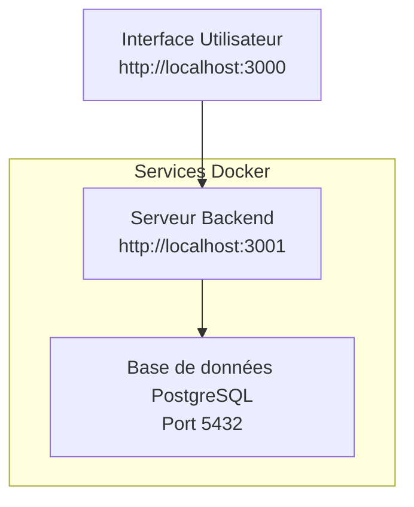
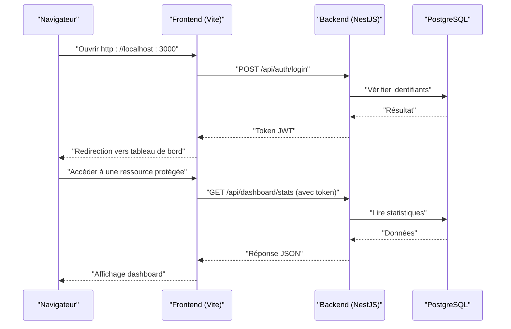

# Guide de Démarrage Rapide

<cite>
**Fichiers référencés dans ce document**
- [README.md](file://README.md)
- [QUICKSTART.md](file://QUICKSTART.md)
- [docker-compose.yml](file://docker/docker-compose.yml)
- [docker-compose.local.dev.yml](file://docker/docker-compose.local.dev.yml)
- [Dockerfile.backend](file://docker/Dockerfile.backend)
- [package.json](file://backend/package.json)
- [package.json](file://frontend/package.json)
- [src/index.ts](file://backend/src/index.ts)
- [src/app.ts](file://backend/src/app.ts)
- [database/data-source.ts](file://backend/src/database/data-source.ts)
- [scripts/run-migration.ts](file://backend/scripts/run-migration.ts)
- [scripts/run-seeds.sh](file://scripts/run-seeds.sh)
- [scripts/start-dev.sh](file://scripts/start-dev.sh)
- [vite.config.ts](file://frontend/vite.config.ts)
- [GUIDE-DEVELOPPEMENT.md](file://docs/guides/GUIDE-DEVELOPPEMENT.md)
- [GUIDE-CONNEXION-BASE-DE-DONNEES.md](file://docs/guides/GUIDE-CONNEXION-BASE-DE-DONNEES.md)
- [GUIDE-COMMANDES-DOCKER-ELISASCHOOL.md](file://docs/guides/GUIDE-COMMANDES-DOCKER-ELISASCHOOL.md)
</cite>

## Table des matières
1. [Introduction](#introduction)
2. [Prérequis système](#prerequis-systeme)
3. [Installation locale étape par étape](#installation-locale-etape-par-etape)
4. [Configuration initiale](#configuration-initiale)
5. [Commandes essentielles pour le développement](#commandes-essentielles-pour-le-developpement)
6. [Migrations et données de démonstration](#migrations-et-donnees-de-demo)
7. [Connexion à l'interface utilisateur et aux API](#connexion-a-lui-et-aux-api)
8. [Vérifications de bon fonctionnement](#verifications-de-bon-fonctionnement)
9. [Problèmes courants et solutions](#problemes-courants-et-solutions)
10. [Architecture et flux clés](#architecture-et-flux-cles)
11. [Conclusion](#conclusion)

## Introduction
Ce guide de démarrage rapide vous accompagne pour installer, configurer et faire tourner eLISAschool en local, que vous soyez débutant ou développeur expérimenté. Il couvre les prérequis (Node.js, Docker, PostgreSQL), l’installation pas à pas, la configuration initiale, les commandes de développement, les migrations, le chargement des données de démonstration, ainsi que des exemples concrets de connexion à l’interface et aux API. Des vérifications de bon fonctionnement et un dépannage initial sont inclus pour vous aider à identifier et résoudre rapidement les problèmes courants.

## Prérequis système
- Node.js : version recommandée 18+ (vérifiez avec node -v).
- Docker et Docker Compose : versions récentes (pour exécuter PostgreSQL et les services d’infrastructure).
- PostgreSQL : disponible via Docker (recommandé) ou installé localement si vous ne souhaitez pas utiliser Docker.
- Outils réseau locaux : accès au port 3000 (frontend) et 3001 (backend) sur votre machine.
- Permissions : droits suffisants pour créer des bases de données et exécuter des scripts.

Conseils :
- Si PostgreSQL est installé localement, assurez-vous qu’un utilisateur et une base dédiés existent pour eLISAschool.
- Pour Docker, vérifiez que le daemon est en cours d’exécution et que vos images peuvent être construites/chargées sans erreur.

**Section sources**
- [GUIDE-DEVELOPPEMENT.md](file://docs/guides/GUIDE-DEVELOPPEMENT.md)
- [GUIDE-CONNEXION-BASE-DE-DONNEES.md](file://docs/guides/GUIDE-CONNEXION-BASE-DE-DONNEES.md)

## Installation locale étape par étape
1. Clonez le dépôt du projet à la racine du workspace.
2. Installez les dépendances backend et frontend :
   - Backend : installez les paquets Node.js dans le dossier backend.
   - Frontend : installez les paquets Node.js dans le dossier frontend.
3. Configurez les variables d’environnement :
   - Créez un fichier .env dans le dossier backend avec les paramètres de connexion à PostgreSQL et les secrets JWT.
   - Ajustez les ports si nécessaire (par défaut : frontend 3000, backend 3001).
4. Démarrez l’infrastructure avec Docker :
   - Utilisez docker-compose pour lancer PostgreSQL et les services nécessaires.
   - Vérifiez que les conteneurs sont en état “healthy” et accessibles.
5. Exécutez les migrations de base de données pour créer les schémas.
6. Chargez les données de démonstration pour tester rapidement les fonctionnalités.
7. Lancez les serveurs de développement (backend et frontend).

Notes :
- Les fichiers de configuration Docker se trouvent dans le dossier docker/.
- Les scripts utilitaires pour démarrer, migrer et peupler la base sont disponibles dans les dossiers scripts/ et backend/scripts/.

**Section sources**
- [docker-compose.yml](file://docker/docker-compose.yml)
- [docker-compose.local.dev.yml](file://docker/docker-compose.local.dev.yml)
- [package.json](file://backend/package.json)
- [package.json](file://frontend/package.json)
- [scripts/start-dev.sh](file://scripts/start-dev.sh)

## Configuration initiale
- Base de données :
  - Définissez les variables d’environnement pour le host, port, nom de base, utilisateur et mot de passe PostgreSQL.
  - Assurez-vous que l’utilisateur a les privilèges nécessaires pour créer des tables et exécuter des migrations.
- JWT et sécurité :
  - Configurez le secret JWT et les options de session selon vos besoins de développement.
- Ports et CORS :
  - Le frontend écoute généralement sur le port 3000 ; le backend sur le port 3001.
  - Activez CORS pour autoriser les appels depuis le navigateur pendant le développement.
- Swagger/OpenAPI :
  - Activez la documentation API pour explorer les endpoints lors du développement.

Exemple de configuration (valeurs indicatives) :
- DATABASE_HOST=localhost
- DATABASE_PORT=5432
- DATABASE_NAME=elisaschool
- DATABASE_USER=postgres
- DATABASE_PASSWORD=postgres
- JWT_SECRET=votre_secret_jwt
- FRONTEND_URL=http://localhost:3000
- BACKEND_URL=http://localhost:3001

**Section sources**
- [database/data-source.ts](file://backend/src/database/data-source.ts)
- [src/app.ts](file://backend/src/app.ts)
- [src/index.ts](file://backend/src/index.ts)
- [GUIDE-CONNEXION-BASE-DE-DONNEES.md](file://docs/guides/GUIDE-CONNEXION-BASE-DE-DONNEES.md)

## Commandes essentielles pour le développement
- Lancer le développement complet :
  - Utilisez le script de démarrage global pour démarrer les services Docker et les serveurs de développement.
- Backend :
  - Démarrer le serveur de développement avec rechargement automatique.
  - Construire l’image Docker du backend pour tests locaux.
- Frontend :
  - Démarrer le serveur de développement Vite.
  - Construire l’application pour production.

Exemples de commandes (à adapter selon votre environnement) :
- Démarrage Docker : docker compose up -d
- Migrations : exécuter le script de migration TypeScript dans le backend.
- Seeds : exécuter le script shell pour charger les données de démonstration.
- Serveurs : npm run dev dans chaque dossier (backend/frontend).

**Section sources**
- [scripts/start-dev.sh](file://scripts/start-dev.sh)
- [package.json](file://backend/package.json)
- [package.json](file://frontend/package.json)
- [Dockerfile.backend](file://docker/Dockerfile.backend)

## Migrations et données de démonstration
- Migrations :
  - Les fichiers SQL et TypeScript de migrations se trouvent dans backend/database/migrations et backend/src/database/migrations.
  - Exécutez le script run-migration.ts pour appliquer les migrations en attente.
- Seeds :
  - Utilisez le script run-seeds.sh pour peupler la base avec des données de démonstration.
- Vérification :
  - Après les migrations et seeds, connectez-vous à PostgreSQL pour vérifier la présence des tables et des données.

Bonnes pratiques :
- Appliquez toujours les migrations avant de lancer le serveur backend.
- Rechargez les seeds uniquement si vous avez besoin de données fraîches pour vos tests.

**Section sources**
- [scripts/run-migration.ts](file://backend/scripts/run-migration.ts)
- [scripts/run-seeds.sh](file://scripts/run-seeds.sh)
- [database/data-source.ts](file://backend/src/database/data-source.ts)

## Connexion à l'interface utilisateur et aux API
- Interface utilisateur :
  - Ouvrez http://localhost:3000 dans votre navigateur.
  - Connectez-vous avec les identifiants fournis par les seeds (ex. super-admin ou administrateur).
- API :
  - Accédez à la documentation Swagger à http://localhost:3001/api/docs (si activé).
  - Testez l’authentification via l’endpoint de login et utilisez le token JWT retourné pour les requêtes protégées.

Exemples de requêtes (valeurs indicatives) :
- POST /api/auth/login avec { email, password }
- GET /api/dashboard/stats avec header Authorization: Bearer <token>

**Section sources**
- [src/app.ts](file://backend/src/app.ts)
- [src/index.ts](file://backend/src/index.ts)
- [vite.config.ts](file://frontend/vite.config.ts)

## Vérifications de bon fonctionnement
- Services Docker :
  - Vérifiez que PostgreSQL est en état healthy et accessible sur le port configuré.
- Backend :
  - Le serveur doit répondre sur http://localhost:3001.
  - La route de santé ou de statut doit retourner un code 200.
- Frontend :
  - L’application charge correctement sur http://localhost:3000.
  - Vous pouvez vous connecter et voir le tableau de bord.
- Base de données :
  - Les tables attendues existent et contiennent des données après les seeds.

Outils utiles :
- curl pour tester les endpoints API.
- psql pour vérifier l’état de la base.
- logs Docker pour diagnostiquer les erreurs de services.

**Section sources**
- [docker-compose.yml](file://docker/docker-compose.yml)
- [docker-compose.local.dev.yml](file://docker/docker-compose.local.dev.yml)

## Problèmes courants et solutions
- Erreur de connexion à PostgreSQL :
  - Vérifiez les variables d’environnement DATABASE_* et l’accès réseau.
  - Assurez-vous que le service PostgreSQL est en cours d’exécution et healthy.
- Port déjà utilisé :
  - Modifiez les ports dans les configurations Docker et les fichiers .env.
- Erreurs CORS :
  - Activez CORS côté backend et configurez les origines autorisées.
- Migrations échouées :
  - Vérifiez les permissions de l’utilisateur PostgreSQL et l’état des schémas existants.
- Frontend ne peut pas joindre le backend :
  - Confirmez que le proxy Vite pointe vers le bon port backend.
  - Vérifiez que le backend est démarré et répond sur le port attendu.

**Section sources**
- [GUIDE-DEVELOPPEMENT.md](file://docs/guides/GUIDE-DEVELOPPEMENT.md)
- [GUIDE-COMMANDES-DOCKER-ELISASCHOOL.md](file://docs/guides/GUIDE-COMMANDES-DOCKER-ELISASCHOOL.md)
- [vite.config.ts](file://frontend/vite.config.ts)

## Architecture et flux clés
Vue d’ensemble :
- Le frontend (React/Vite) communique avec le backend (NestJS/TypeScript) via HTTP.
- Le backend interagit avec PostgreSQL pour persister les données.
- Docker orchestre les services (PostgreSQL, backend, frontend) pour un environnement cohérent.

Diagramme des séquences (connexion et accès API) :

**Diagramme sources**
- [docker-compose.yml](file://docker/docker-compose.yml)
- [src/app.ts](file://backend/src/app.ts)
- [src/index.ts](file://backend/src/index.ts)
- [database/data-source.ts](file://backend/src/database/data-source.ts)

## Conclusion
Vous disposez maintenant des connaissances et des outils pour installer, configurer et développer eLISAschool en local. Suivez les étapes de ce guide, utilisez les commandes et scripts fournis, et référez-vous aux sections de dépannage pour résoudre rapidement les problèmes. En cas de besoin, consultez les guides détaillés dans docs/guides/ pour approfondir la configuration, les migrations et les bonnes pratiques de développement.