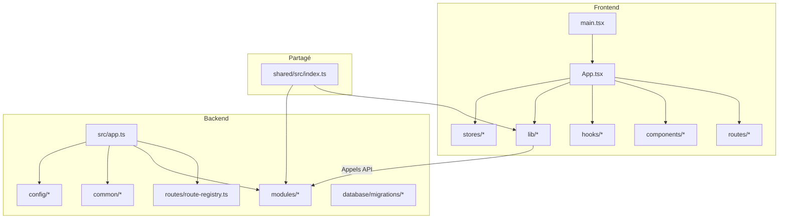
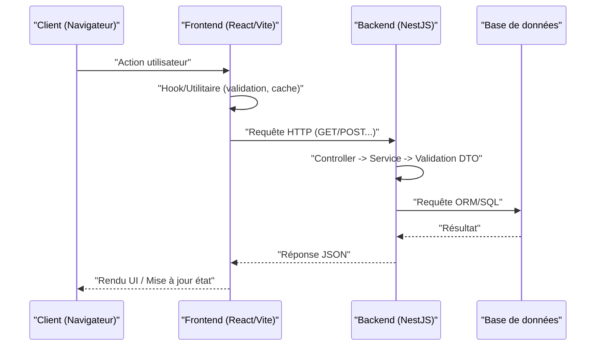
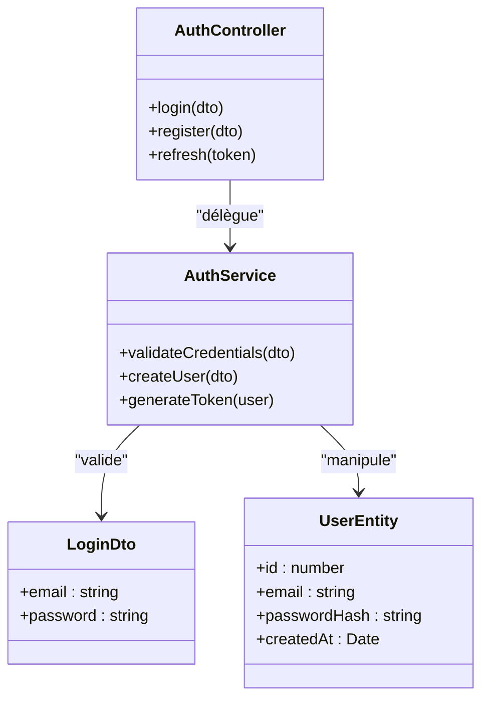
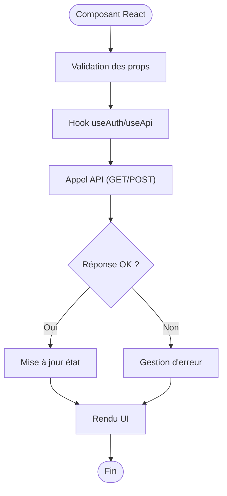
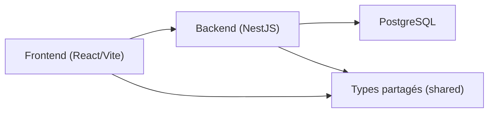

# Conventions de Code et Standards

<cite>
**Fichiers référencés dans ce document**
- [backend/eslint.config.js](file://backend/eslint.config.js)
- [backend/package.json](file://backend/package.json)
- [backend/tsconfig.json](file://backend/tsconfig.json)
- [frontend/package.json](file://frontend/package.json)
- [frontend/vite.config.ts](file://frontend/vite.config.ts)
- [shared/src/index.ts](file://shared/src/index.ts)
- [backend/src/app.ts](file://backend/src/app.ts)
- [backend/src/modules/auth/auth.controller.ts](file://backend/src/modules/auth/auth.controller.ts)
- [backend/src/modules/auth/auth.service.ts](file://backend/src/modules/auth/auth.service.ts)
- [backend/src/modules/auth/dto/login.dto.ts](file://backend/src/modules/auth/dto/login.dto.ts)
- [backend/src/modules/auth/entities/user.entity.ts](file://backend/src/modules/auth/entities/user.entity.ts)
- [backend/src/common/utils/pagination.util.ts](file://backend/src/common/utils/pagination.util.ts)
- [backend/src/config/database.config.ts](file://backend/src/config/database.config.ts)
- [backend/src/routes/route-registry.ts](file://backend/src/routes/route-registry.ts)
- [frontend/src/App.tsx](file://frontend/src/App.tsx)
- [frontend/src/main.tsx](file://frontend/src/main.tsx)
- [frontend/src/hooks/useAuth.ts](file://frontend/src/hooks/useAuth.ts)
- [frontend/src/components/ui/Button.tsx](file://frontend/src/components/ui/Button.tsx)
- [frontend/src/lib/api.ts](file://frontend/src/lib/api.ts)
</cite>

## Table des matières
1. [Introduction](#introduction)
2. [Structure du projet](#structure-du-projet)
3. [Composants clés](#composants-clés)
4. [Vue d’ensemble de l’architecture](#vue-densemble-de-larchitecture)
5. [Analyse détaillée des composants](#analyse-detaillee-des-composants)
6. [Analyse des dépendances](#analyse-des-dependances)
7. [Considérations de performance](#considerations-de-performance)
8. [Guide de dépannage](#guide-de-depannage)
9. [Conclusion](#conclusion)
10. [Annexes](#annexes)

## Introduction
Ce guide formalise les conventions de code et standards pour eLISAschool, couvrant ESLint, Prettier (si configuré), TypeScript, NestJS, et React. Il définit les règles de nommage, la structure des modules, les patterns backend (DTOs, services, contrôleurs, entités) et frontend (composants, hooks, utilitaires), ainsi que les outils de vérification automatique, les directives de documentation et les bonnes pratiques de refactoring.

## Structure du projet
Le projet est un monorepo avec trois espaces principaux :
- backend : application NestJS (API REST, modules par fonctionnalité, migrations, scripts, tests).
- frontend : application React (Vite, TanStack Router, hooks, composants, stores, lib).
- shared : types, constantes, enums et validateurs partagés entre le backend et le frontend.

**Sources de diagramme**
- [backend/src/app.ts](file://backend/src/app.ts)
- [backend/src/routes/route-registry.ts](file://backend/src/routes/route-registry.ts)
- [frontend/src/main.tsx](file://frontend/src/main.tsx)
- [frontend/src/App.tsx](file://frontend/src/App.tsx)
- [shared/src/index.ts](file://shared/src/index.ts)

**Sources de section**
- [backend/package.json](file://backend/package.json)
- [frontend/package.json](file://frontend/package.json)
- [shared/src/index.ts](file://shared/src/index.ts)

## Composants clés
- Backend
  - Point d’entrée NestJS : initialisation du module racine, configuration globale, enregistrement des routes.
  - Modules fonctionnels : auth, eleves, finances, etc., chacun avec controller, service, dto, entity, migration.
  - Utilitaires communs : pagination, filtres, intercepteurs, middlewares, types.
  - Configuration : base de données, environnement, Swagger.
- Frontend
  - Point d’entrée React : bootstrap Vite, providers, routeur.
  - Routes TanStack : définition des pages et layouts.
  - Hooks : gestion d’état local et appels API.
  - Composants UI réutilisables.
  - Lib API : client HTTP, intercepteurs, typage des réponses.
- Partagé
  - Types, enums, constantes et validateurs utilisés par les deux couches.

**Sources de section**
- [backend/src/app.ts](file://backend/src/app.ts)
- [backend/src/config/database.config.ts](file://backend/src/config/database.config.ts)
- [backend/src/common/utils/pagination.util.ts](file://backend/src/common/utils/pagination.util.ts)
- [frontend/src/main.tsx](file://frontend/src/main.tsx)
- [frontend/src/App.tsx](file://frontend/src/App.tsx)
- [frontend/src/lib/api.ts](file://frontend/src/lib/api.ts)
- [shared/src/index.ts](file://shared/src/index.ts)

## Vue d’ensemble de l’architecture
L’application suit une architecture modulaire NestJS côté serveur et une architecture basée sur les features et hooks côté client. Les routes sont centralisées et les modules exposent des endpoints cohérents. Le frontend consomme l’API via un client HTTP typé.

**Sources de diagramme**
- [frontend/src/lib/api.ts](file://frontend/src/lib/api.ts)
- [backend/src/modules/auth/auth.controller.ts](file://backend/src/modules/auth/auth.controller.ts)
- [backend/src/modules/auth/auth.service.ts](file://backend/src/modules/auth/auth.service.ts)
- [backend/src/modules/auth/dto/login.dto.ts](file://backend/src/modules/auth/dto/login.dto.ts)

## Analyse détaillée des composants

### Conventions ESLint et Prettier
- ESLint
  - Fichier de configuration principal : eslint.config.js.
  - Règles recommandées : strictness accrue, détection de variables inutilisées, import ordonné, règles React et TypeScript.
  - Intégration IDE : activation via VS Code ou autre éditeur pour correction à la volée.
- Prettier
  - Si présent, configurer pour formatter le code automatiquement (indentation, quotes, trailing commas, longueur de ligne).
  - Exécuter avant commit via husky + lint-staged pour garantir la cohérence.

Exemples de commandes :
- Linter : npm run lint
- Formatage : npm run format
- Vérification stricte : npm run lint:fix

**Sources de section**
- [backend/eslint.config.js](file://backend/eslint.config.js)
- [backend/package.json](file://backend/package.json)
- [frontend/package.json](file://frontend/package.json)

### Conventions TypeScript
- tsconfig.json
  - Cible ESNext, module CommonJS/ESM selon besoin, strict mode activé, paths résolus pour imports relatifs.
  - Déclarations globales si nécessaire (pg.d.ts).
- Bonnes pratiques
  - Typage explicite des paramètres et retours.
  - Utilisation de types génériques pour les réponses API.
  - Interdire any ; préférer unknown et assertion sûre.
  - Enums pour les états finis, interfaces pour les structures de données.

**Sources de section**
- [backend/tsconfig.json](file://backend/tsconfig.json)
- [frontend/tsconfig.json](file://frontend/tsconfig.json)
- [shared/src/index.ts](file://shared/src/index.ts)

### Patterns de nommage
- Fichiers
  - PascalCase pour les classes/composants (AuthController.ts, Button.tsx).
  - camelCase pour les fonctions/utilitaires (pagination.util.ts, useAuth.ts).
  - kebab-case pour les dossiers de fonctionnalités (auth/, ui/, hooks/).
- Classes et modules NestJS
  - Controller : XController.ts
  - Service : XService.ts
  - DTO : x.dto.ts (camelCase)
  - Entity : x.entity.ts (camelCase)
- Frontend
  - Composants : PascalCase (Button.tsx)
  - Hooks : useXxx.ts (useAuth.ts)
  - Utilitaires : camelCase (api.ts, helpers.ts)

**Sources de section**
- [backend/src/modules/auth/auth.controller.ts](file://backend/src/modules/auth/auth.controller.ts)
- [backend/src/modules/auth/auth.service.ts](file://backend/src/modules/auth/auth.service.ts)
- [backend/src/modules/auth/dto/login.dto.ts](file://backend/src/modules/auth/dto/login.dto.ts)
- [backend/src/modules/auth/entities/user.entity.ts](file://backend/src/modules/auth/entities/user.entity.ts)
- [frontend/src/hooks/useAuth.ts](file://frontend/src/hooks/useAuth.ts)
- [frontend/src/components/ui/Button.tsx](file://frontend/src/components/ui/Button.tsx)

### Structure des modules NestJS
Chaque module encapsule :
- Controller : exposition des routes HTTP, validation des entrées.
- Service : logique métier, accès aux données.
- DTO : schémas de validation des requêtes/réponses.
- Entity : modèle de données (TypeORM/Prisma selon usage).
- Migration : évolution du schéma de base de données.

**Sources de diagramme**
- [backend/src/modules/auth/auth.controller.ts](file://backend/src/modules/auth/auth.controller.ts)
- [backend/src/modules/auth/auth.service.ts](file://backend/src/modules/auth/auth.service.ts)
- [backend/src/modules/auth/dto/login.dto.ts](file://backend/src/modules/auth/dto/login.dto.ts)
- [backend/src/modules/auth/entities/user.entity.ts](file://backend/src/modules/auth/entities/user.entity.ts)

**Sources de section**
- [backend/src/app.ts](file://backend/src/app.ts)
- [backend/src/routes/route-registry.ts](file://backend/src/routes/route-registry.ts)

### Standards de code React
- Composants
  - Fonctionnels, hooks modernes, props typées.
  - Séparation UI/logique : composants purs, hooks pour effets et état.
- Hooks
  - useAuth pour l’authentification, useApi pour les appels HTTP.
  - Memoization avec useMemo/useCallback quand nécessaire.
- Utilitaires
  - api.ts centralise fetch/axios, intercepteurs, typage des réponses.
  - Helpers pour formatage, validation, conversion de dates.

**Sources de diagramme**
- [frontend/src/components/ui/Button.tsx](file://frontend/src/components/ui/Button.tsx)
- [frontend/src/hooks/useAuth.ts](file://frontend/src/hooks/useAuth.ts)
- [frontend/src/lib/api.ts](file://frontend/src/lib/api.ts)

**Sources de section**
- [frontend/src/App.tsx](file://frontend/src/App.tsx)
- [frontend/src/main.tsx](file://frontend/src/main.tsx)
- [frontend/src/hooks/useAuth.ts](file://frontend/src/hooks/useAuth.ts)
- [frontend/src/lib/api.ts](file://frontend/src/lib/api.ts)

### Directives pour le code backend
- DTOs
  - Toujours valider les entrées (class-validator/superstruct).
  - Exposer uniquement les champs nécessaires.
- Services
  - Logique métier isolée, pas d’appels directs HTTP dans les controllers.
  - Gestion des erreurs et exceptions spécifiques.
- Contrôleurs
  - Responsabilité unique : mapper requête/réponse, validation, autorisation.
- Entités
  - Correspondance stricte avec le schéma de base de données.
  - Migrations versionnées et commentées.

**Sources de section**
- [backend/src/modules/auth/dto/login.dto.ts](file://backend/src/modules/auth/dto/login.dto.ts)
- [backend/src/modules/auth/auth.service.ts](file://backend/src/modules/auth/auth.service.ts)
- [backend/src/modules/auth/auth.controller.ts](file://backend/src/modules/auth/auth.controller.ts)
- [backend/src/modules/auth/entities/user.entity.ts](file://backend/src/modules/auth/entities/user.entity.ts)

### Directives pour le code frontend
- Composants
  - Un seul objectif par composant, props immuables.
  - Tests unitaires pour les cas critiques.
- Hooks
  - Centraliser la logique d’état et les effets secondaires.
  - Éviter les boucles infinies de re-render.
- Utilitaires
  - Fonctions pures, typées, sans effets de bord.
  - Regrouper les helpers par domaine.

**Sources de section**
- [frontend/src/components/ui/Button.tsx](file://frontend/src/components/ui/Button.tsx)
- [frontend/src/hooks/useAuth.ts](file://frontend/src/hooks/useAuth.ts)
- [frontend/src/lib/api.ts](file://frontend/src/lib/api.ts)

### Outils de vérification automatique
- Linting et formatage
  - ESLint : détection de problèmes, corrections automatiques.
  - Prettier : formatage uniforme du code.
- TypeScript
  - Compilation stricte, vérification des types à la compilation.
- Tests
  - Unitaires (Jest/Vitest), intégration (Supertest/Cypress).
- CI/CD
  - Pipeline exécutant lint, build, tests, sécurité.

**Sources de section**
- [backend/eslint.config.js](file://backend/eslint.config.js)
- [backend/package.json](file://backend/package.json)
- [frontend/package.json](file://frontend/package.json)

### Documentation et commentaires
- JSDoc/TSDoc pour les fonctions et classes publiques.
- README par module expliquant responsabilités et usages.
- Commentaires concis, orientés “pourquoi” plutôt que “quoi”.
- Exemples d’utilisation dans les docs ou stories (Storybook si applicable).

[Pas de sources nécessaires car cette section fournit des directives générales]

### Bonnes pratiques de refactoring
- Petit commits atomiques, messages clairs.
- Extraire des fonctions/utilitaires pour réduire la duplication.
- Renommer progressivement avec recherche globale et vérification des imports.
- Supprimer le code mort, les imports inutilisés.
- Mettre à jour les tests après chaque changement significatif.

[Pas de sources nécessaires car cette section fournit des directives générales]

## Analyse des dépendances
Les dépendances principales incluent NestJS, TypeORM/Prisma, PostgreSQL, React, Vite, TanStack Router, et bibliothèques utilitaires. La configuration de build et les scripts npm définissent les workflows de développement.

**Sources de diagramme**
- [frontend/package.json](file://frontend/package.json)
- [backend/package.json](file://backend/package.json)
- [shared/src/index.ts](file://shared/src/index.ts)

**Sources de section**
- [frontend/package.json](file://frontend/package.json)
- [backend/package.json](file://backend/package.json)
- [shared/src/index.ts](file://shared/src/index.ts)

## Considérations de performance
- Backend
  - Pagination efficace (utilitaire pagination).
  - Indexation des colonnes critiques, requêtes optimisées.
  - Cache Redis pour données fréquemment consultées.
- Frontend
  - Lazy loading des routes et composants.
  - Mémoïsation des calculs coûteux.
  - Réduction des re-renders inutiles.

**Sources de section**
- [backend/src/common/utils/pagination.util.ts](file://backend/src/common/utils/pagination.util.ts)
- [frontend/vite.config.ts](file://frontend/vite.config.ts)

## Guide de dépannage
- Erreurs de type TypeScript
  - Vérifier les imports, les chemins de modules, les versions de packages.
- Problèmes de linting/formatage
  - Exécuter les scripts de correction, vérifier les configurations locales vs globales.
- Erreurs API
  - Valider les DTOs, inspecter les logs, tester les endpoints manuellement.
- Performance
  - Analyser les requêtes SQL, activer les profils, identifier les goulots d’étranglement.

**Sources de section**
- [backend/eslint.config.js](file://backend/eslint.config.js)
- [backend/package.json](file://backend/package.json)
- [frontend/package.json](file://frontend/package.json)

## Conclusion
Ce guide établit une base solide pour maintenir la cohérence, la qualité et la maintenabilité du code eLISAschool. En appliquant ces conventions et outils, l’équipe peut livrer des fonctionnalités fiables, lisibles et évolutives.

[Pas de sources nécessaires car cette section résume sans analyser de fichiers spécifiques]

## Annexes
- Commandes utiles
  - Lint : npm run lint
  - Format : npm run format
  - Build : npm run build
  - Test : npm run test
- Checklist de livraison
  - Lint propre, build réussi, tests verts, documentation mise à jour.

[Pas de sources nécessaires car cette section fournit des directives générales]