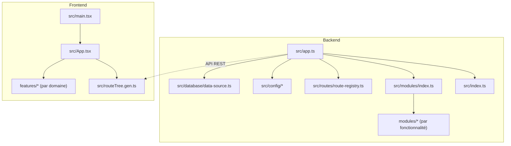
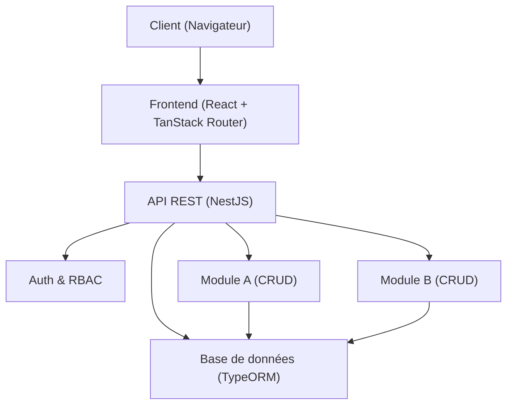
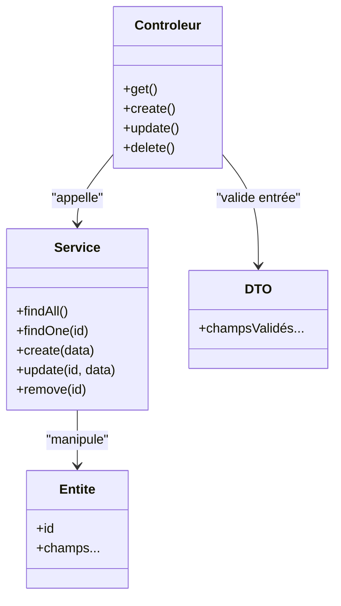
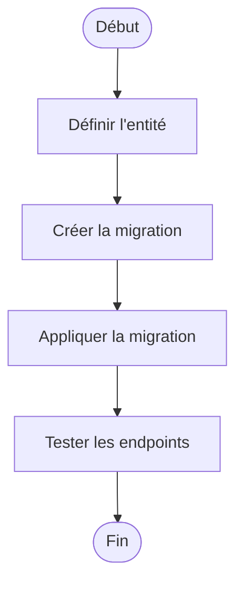
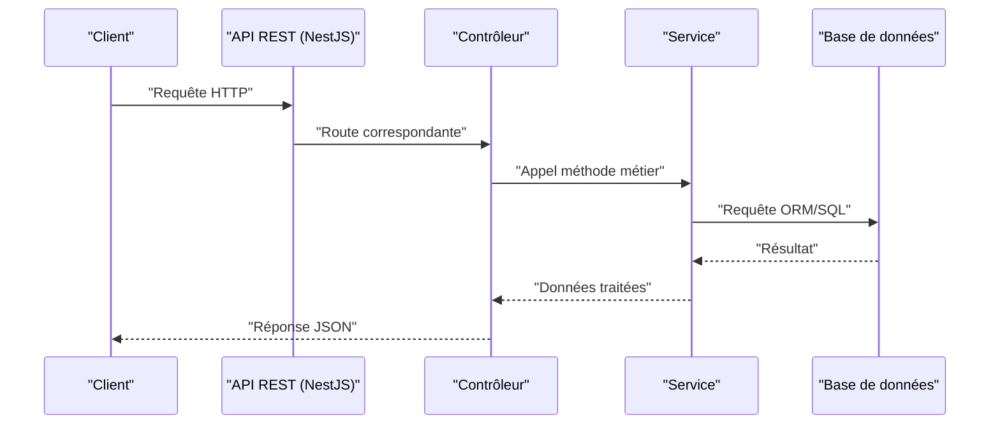
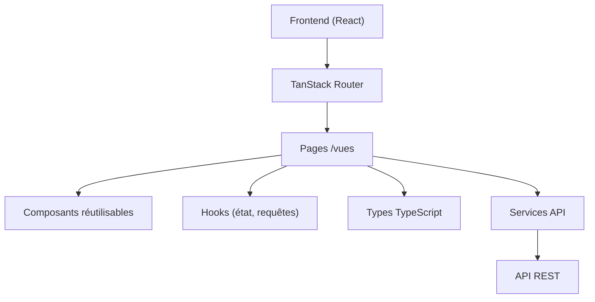
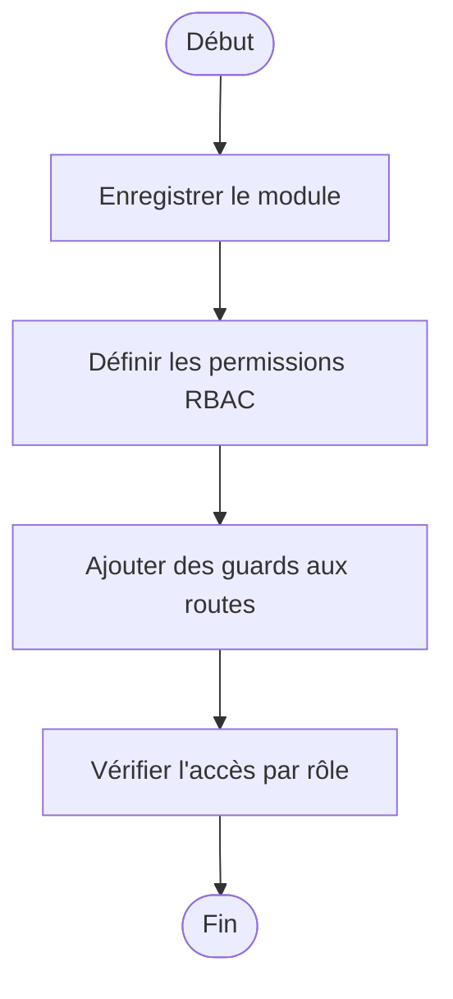
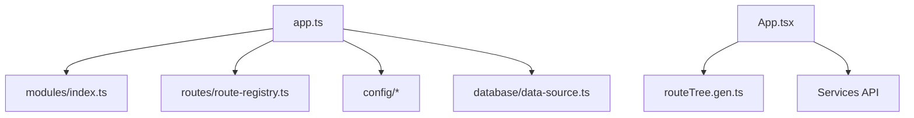

# Développement de Modules

<cite>
**Fichiers référencés dans ce document**
- [README.md](file://README.md)
- [backend/src/app.ts](file://backend/src/app.ts)
- [backend/src/index.ts](file://backend/src/index.ts)
- [backend/src/modules/index.ts](file://backend/src/modules/index.ts)
- [backend/src/routes/route-registry.ts](file://backend/src/routes/route-registry.ts)
- [backend/src/config/database.config.ts](file://backend/src/config/database.config.ts)
- [backend/src/config/env.config.ts](file://backend/src/config/env.config.ts)
- [backend/src/config/swagger.config.ts](file://backend/src/config/swagger.config.ts)
- [backend/src/database/data-source.ts](file://backend/src/database/data-source.ts)
- [backend/src/common/index.ts](file://backend/src/common/index.ts)
- [backend/package.json](file://backend/package.json)
- [frontend/src/App.tsx](file://frontend/src/App.tsx)
- [frontend/src/main.tsx](file://frontend/src/main.tsx)
- [frontend/src/routeTree.gen.ts](file://frontend/src/routeTree.gen.ts)
- [backend/docs/pagination-guide.md](file://backend/docs/pagination-guide.md)
- [backend/docs/DASHBOARD-FRONTEND-INTEGRATION.md](file://backend/docs/DASHBOARD-FRONTEND-INTEGRATION.md)
- [docs/CONVENTIONS-PERMISSIONS.md](file://docs/CONVENTIONS-PERMISSIONS.md)
- [docs/guide-implémentation-permissions.ts](file://docs/guide-implémentation-permissions.ts)
- [docs/checklists/CHECKLIST-NOUVEAU-MODULE.md](file://docs/checklists/CHECKLIST-NOUVEAU-MODULE.md)
- [scripts/deploy-migrations-phases.sh](file://scripts/deploy-migrations-phases.sh)
- [backend/scripts/run-migration.ts](file://backend/scripts/run-migration.ts)
</cite>

## Table des matières
1. [Introduction](#introduction)
2. [Structure du projet](#structure-du-projet)
3. [Composants clés](#composants-clés)
4. [Vue d'ensemble de l'architecture](#vue-densemble-de-larchitecture)
5. [Analyse détaillée des composants](#analyse-détaillée-des-composants)
6. [Analyse des dépendances](#analyse-des-dépendances)
7. [Considérations de performance](#considérations-de-performance)
8. [Guide de dépannage](#guide-de-dépannage)
9. [Conclusion](#conclusion)
10. [Annexes](#annexes)

## Introduction
Ce guide explique comment créer et intégrer un nouveau module dans eLISAschool, en suivant les conventions NestJS pour le backend et React/TanStack Router pour le frontend. Il couvre la structure modulaire, la création d’entités, services, contrôleurs et DTOs, l’exposition via API REST, l’intégration avec la base de données, la configuration RBAC, l’enregistrement du module, et l’ajout de la navigation dans l’interface utilisateur. Des exemples complets de flux CRUD sont fournis, ainsi que des bonnes pratiques, des stratégies de tests et de migration.

## Structure du projet
Le projet est organisé en deux grands sous-répertoires :
- backend : application NestJS avec modules par fonctionnalité, configuration, migrations, scripts et documentation.
- frontend : application React avec TanStack Router, features par domaine, hooks, types et pages.

**Sources de diagramme**
- [backend/src/app.ts](file://backend/src/app.ts)
- [backend/src/index.ts](file://backend/src/index.ts)
- [backend/src/modules/index.ts](file://backend/src/modules/index.ts)
- [backend/src/routes/route-registry.ts](file://backend/src/routes/route-registry.ts)
- [backend/src/config/database.config.ts](file://backend/src/config/database.config.ts)
- [backend/src/config/env.config.ts](file://backend/src/config/env.config.ts)
- [backend/src/config/swagger.config.ts](file://backend/src/config/swagger.config.ts)
- [backend/src/database/data-source.ts](file://backend/src/database/data-source.ts)
- [frontend/src/main.tsx](file://frontend/src/main.tsx)
- [frontend/src/App.tsx](file://frontend/src/App.tsx)
- [frontend/src/routeTree.gen.ts](file://frontend/src/routeTree.gen.ts)

**Sources de section**
- [README.md](file://README.md)
- [backend/src/app.ts](file://backend/src/app.ts)
- [backend/src/index.ts](file://backend/src/index.ts)
- [backend/src/modules/index.ts](file://backend/src/modules/index.ts)
- [backend/src/routes/route-registry.ts](file://backend/src/routes/route-registry.ts)
- [backend/src/config/database.config.ts](file://backend/src/config/database.config.ts)
- [backend/src/config/env.config.ts](file://backend/src/config/env.config.ts)
- [backend/src/config/swagger.config.ts](file://backend/src/config/swagger.config.ts)
- [backend/src/database/data-source.ts](file://backend/src/database/data-source.ts)
- [frontend/src/main.tsx](file://frontend/src/main.tsx)
- [frontend/src/App.tsx](file://frontend/src/App.tsx)
- [frontend/src/routeTree.gen.ts](file://frontend/src/routeTree.gen.ts)

## Composants clés
- Application NestJS : point d’entrée principal, bootstrap, chargement des modules et configuration globale.
- Registre de routes : centralise les routes et permet une organisation cohérente.
- Configuration : variables d’environnement, connexion à la base de données, Swagger.
- Data Source : configuration TypeORM/DataSource pour les entités et migrations.
- Frontend : bootstrap React, routage généré, features par domaine.

**Sources de section**
- [backend/src/app.ts](file://backend/src/app.ts)
- [backend/src/index.ts](file://backend/src/index.ts)
- [backend/src/routes/route-registry.ts](file://backend/src/routes/route-registry.ts)
- [backend/src/config/database.config.ts](file://backend/src/config/database.config.ts)
- [backend/src/config/env.config.ts](file://backend/src/config/env.config.ts)
- [backend/src/config/swagger.config.ts](file://backend/src/config/swagger.config.ts)
- [backend/src/database/data-source.ts](file://backend/src/database/data-source.ts)
- [frontend/src/main.tsx](file://frontend/src/main.tsx)
- [frontend/src/App.tsx](file://frontend/src/App.tsx)
- [frontend/src/routeTree.gen.ts](file://frontend/src/routeTree.gen.ts)

## Vue d'ensemble de l'architecture
Le backend suit une architecture modulaire NestJS où chaque fonctionnalité est un module contenant ses propres contrôleurs, services, entités et DTOs. Le registre de routes expose les endpoints. Le frontend utilise React avec TanStack Router pour naviguer entre les pages définies par features.

[Ce diagramme est conceptuel et ne mape pas directement des fichiers spécifiques]

## Analyse détaillée des composants

### Backend : Création d’un module NestJS complet (CRUD)
Pour ajouter un nouveau module, suivez ces étapes :
- Créer le module NestJS avec ses dossiers : controllers, services, entities, dto, guards, pipes, interceptors si nécessaire.
- Définir l’entité (TypeORM) et les DTOs de validation.
- Implémenter le service (logique métier) et le contrôleur (routes HTTP).
- Enregistrer le module dans le registre ou le module racine.
- Exposer les routes via le registre de routes.
- Configurer les permissions RBAC et les guards associés.
- Ajouter les migrations SQL ou TypeORM pour la base de données.
- Tester les endpoints et les cas limites.

**Sources de diagramme**
- [backend/src/modules/index.ts](file://backend/src/modules/index.ts)
- [backend/src/routes/route-registry.ts](file://backend/src/routes/route-registry.ts)
- [backend/src/database/data-source.ts](file://backend/src/database/data-source.ts)

**Sources de section**
- [backend/src/modules/index.ts](file://backend/src/modules/index.ts)
- [backend/src/routes/route-registry.ts](file://backend/src/routes/route-registry.ts)
- [backend/src/database/data-source.ts](file://backend/src/database/data-source.ts)

### Intégration avec la base de données
- Utiliser DataSource pour configurer les connexions et charger les entités.
- Écrire des migrations SQL ou TypeORM pour évoluer le schéma.
- Appliquer les migrations via les scripts dédiés.

**Sources de diagramme**
- [backend/src/database/data-source.ts](file://backend/src/database/data-source.ts)
- [backend/scripts/run-migration.ts](file://backend/scripts/run-migration.ts)
- [scripts/deploy-migrations-phases.sh](file://scripts/deploy-migrations-phases.sh)

**Sources de section**
- [backend/src/database/data-source.ts](file://backend/src/database/data-source.ts)
- [backend/scripts/run-migration.ts](file://backend/scripts/run-migration.ts)
- [scripts/deploy-migrations-phases.sh](file://scripts/deploy-migrations-phases.sh)

### Exposition via l’API REST
- Déclarer les routes dans le contrôleur.
- Enregistrer les routes via le registre.
- Documenter avec Swagger si configuré.

**Sources de diagramme**
- [backend/src/routes/route-registry.ts](file://backend/src/routes/route-registry.ts)
- [backend/src/config/swagger.config.ts](file://backend/src/config/swagger.config.ts)

**Sources de section**
- [backend/src/routes/route-registry.ts](file://backend/src/routes/route-registry.ts)
- [backend/src/config/swagger.config.ts](file://backend/src/config/swagger.config.ts)

### Frontend : Création d’une feature React
- Créer une feature dans src/features/<nom-feature>.
- Ajouter des composants, hooks, types et pages.
- Enregistrer la route dans TanStack Router (génération automatique).
- Appeler l’API via des services ou hooks personnalisés.

**Sources de diagramme**
- [frontend/src/App.tsx](file://frontend/src/App.tsx)
- [frontend/src/routeTree.gen.ts](file://frontend/src/routeTree.gen.ts)

**Sources de section**
- [frontend/src/App.tsx](file://frontend/src/App.tsx)
- [frontend/src/routeTree.gen.ts](file://frontend/src/routeTree.gen.ts)

### Enregistrement du module et configuration RBAC
- Enregistrer le module dans le registre ou le module racine.
- Configurer les permissions RBAC selon les conventions du projet.
- Appliquer des guards pour protéger les routes.

**Sources de diagramme**
- [backend/src/modules/index.ts](file://backend/src/modules/index.ts)
- [docs/CONVENTIONS-PERMISSIONS.md](file://docs/CONVENTIONS-PERMISSIONS.md)
- [docs/guide-implémentation-permissions.ts](file://docs/guide-implémentation-permissions.ts)

**Sources de section**
- [backend/src/modules/index.ts](file://backend/src/modules/index.ts)
- [docs/CONVENTIONS-PERMISSIONS.md](file://docs/CONVENTIONS-PERMISSIONS.md)
- [docs/guide-implémentation-permissions.ts](file://docs/guide-implémentation-permissions.ts)

### Ajout de la navigation dans l’interface
- Ajouter la page dans le router généré.
- Lier le menu de navigation vers la nouvelle route.
- Vérifier les permissions d’accès côté frontend.

**Sources de section**
- [frontend/src/routeTree.gen.ts](file://frontend/src/routeTree.gen.ts)
- [backend/docs/DASHBOARD-FRONTEND-INTEGRATION.md](file://backend/docs/DASHBOARD-FRONTEND-INTEGRATION.md)

### Bonnes pratiques de séparation des responsabilités
- Séparer clairement contrôleurs (HTTP), services (métier), entités (données) et DTOs (validation).
- Centraliser la logique de validation et transformation dans les DTOs.
- Utiliser des guards et interceptors pour la sécurité et la gestion transversale.

**Sources de section**
- [backend/src/common/index.ts](file://backend/src/common/index.ts)
- [backend/package.json](file://backend/package.json)

### Tests spécifiques aux modules
- Tests unitaires pour services et utilitaires.
- Tests d’intégration pour contrôleurs et endpoints.
- Scripts de test automatisés.

**Sources de section**
- [backend/package.json](file://backend/package.json)

### Stratégies de migration de données
- Écrire des migrations SQL ou TypeORM pour chaque évolution du schéma.
- Versionner les migrations et les appliquer systématiquement.
- Utiliser les scripts de déploiement pour exécuter les migrations en environnement cible.

**Sources de section**
- [backend/scripts/run-migration.ts](file://backend/scripts/run-migration.ts)
- [scripts/deploy-migrations-phases.sh](file://scripts/deploy-migrations-phases.sh)

## Analyse des dépendances
Les modules dépendent de la configuration, de la base de données et du registre de routes. Le frontend dépend du router et des services API.

**Sources de diagramme**
- [backend/src/app.ts](file://backend/src/app.ts)
- [backend/src/modules/index.ts](file://backend/src/modules/index.ts)
- [backend/src/routes/route-registry.ts](file://backend/src/routes/route-registry.ts)
- [backend/src/config/database.config.ts](file://backend/src/config/database.config.ts)
- [backend/src/config/env.config.ts](file://backend/src/config/env.config.ts)
- [backend/src/config/swagger.config.ts](file://backend/src/config/swagger.config.ts)
- [backend/src/database/data-source.ts](file://backend/src/database/data-source.ts)
- [frontend/src/App.tsx](file://frontend/src/App.tsx)
- [frontend/src/routeTree.gen.ts](file://frontend/src/routeTree.gen.ts)

**Sources de section**
- [backend/src/app.ts](file://backend/src/app.ts)
- [backend/src/modules/index.ts](file://backend/src/modules/index.ts)
- [backend/src/routes/route-registry.ts](file://backend/src/routes/route-registry.ts)
- [backend/src/config/database.config.ts](file://backend/src/config/database.config.ts)
- [backend/src/config/env.config.ts](file://backend/src/config/env.config.ts)
- [backend/src/config/swagger.config.ts](file://backend/src/swagger.config.ts)
- [backend/src/database/data-source.ts](file://backend/src/database/data-source.ts)
- [frontend/src/App.tsx](file://frontend/src/App.tsx)
- [frontend/src/routeTree.gen.ts](file://frontend/src/routeTree.gen.ts)

## Considérations de performance
- Pagination : utiliser les guides et outils disponibles pour optimiser les requêtes et réponses.
- Indexation : vérifier les index et performances des requêtes SQL.
- Cache : envisager Redis ou autres mécanismes de cache pour les données fréquentes.

**Sources de section**
- [backend/docs/pagination-guide.md](file://backend/docs/pagination-guide.md)

## Guide de dépannage
- Erreurs de connexion à la base de données : vérifier la configuration DataSource et les variables d’environnement.
- Erreurs de permission RBAC : s’assurer que les guards et permissions sont correctement configurés.
- Problèmes de routage frontend : vérifier le fichier routeTree généré et les chemins de navigation.

**Sources de section**
- [backend/src/config/database.config.ts](file://backend/src/config/database.config.ts)
- [backend/src/config/env.config.ts](file://backend/src/config/env.config.ts)
- [docs/CONVENTIONS-PERMISSIONS.md](file://docs/CONVENTIONS-PERMISSIONS.md)
- [frontend/src/routeTree.gen.ts](file://frontend/src/routeTree.gen.ts)

## Conclusion
Ce guide fournit une approche structurée pour développer et intégrer de nouveaux modules dans eLISAschool, en respectant les conventions NestJS et React. En suivant les étapes décrites, vous pouvez créer des fonctionnalités robustes, sécurisées et maintenables, tout en assurant une intégration fluide avec la base de données et l’interface utilisateur.

## Annexes
- Checklist pour nouveau module : référence pour valider toutes les étapes de développement et d’intégration.
- Documentation sur les permissions et l’intégration frontend.

**Sources de section**
- [docs/checklists/CHECKLIST-NOUVEAU-MODULE.md](file://docs/checklists/CHECKLIST-NOUVEAU-MODULE.md)
- [backend/docs/DASHBOARD-FRONTEND-INTEGRATION.md](file://backend/docs/DASHBOARD-FRONTEND-INTEGRATION.md)