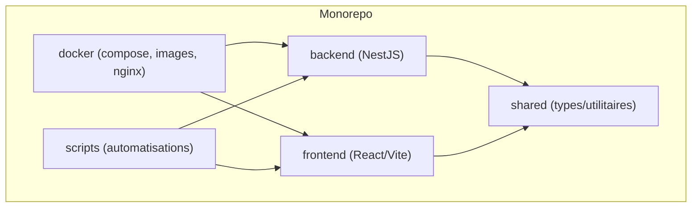
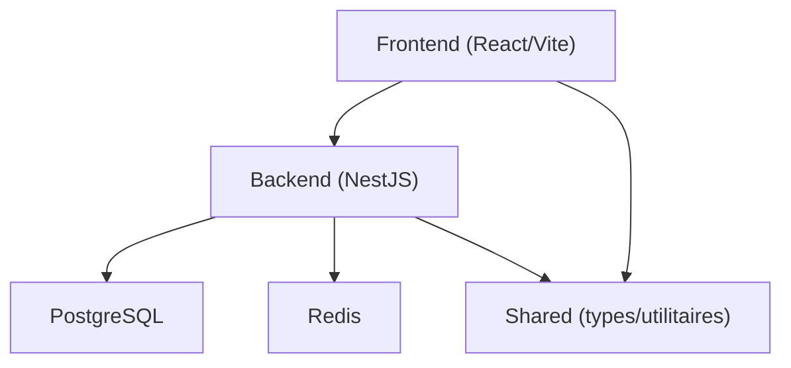

# Environnement de Développement

<cite>
**Fichiers référencés dans ce document**
- [package.json](file://package.json)
- [backend/package.json](file://backend/package.json)
- [frontend/package.json](file://frontend/package.json)
- [shared/package.json](file://shared/package.json)
- [docker-compose.yml](file://docker/docker-compose.yml)
- [docker-compose.local.dev.yml](file://docker/docker-compose.local.dev.yml)
- [Dockerfile.backend](file://docker/Dockerfile.backend)
- [Dockerfile.frontend](file://docker/Dockerfile.frontend)
- [nginx.conf](file://docker/nginx.conf)
- [QUICKSTART.md](file://QUICKSTART.md)
- [README.md](file://README.md)
- [scripts/start-dev.sh](file://scripts/start-dev.sh)
- [backend/start-dev.sh](file://backend/start-dev.sh)
- [backend/tsconfig.json](file://backend/tsconfig.json)
- [frontend/tsconfig.json](file://frontend/tsconfig.json)
- [shared/tsconfig.json](file://shared/tsconfig.json)
- [backend/src/config/env.config.ts](file://backend/src/config/env.config.ts)
- [backend/src/config/database.config.ts](file://backend/src/config/database.config.ts)
- [backend/src/app.ts](file://backend/src/app.ts)
- [backend/src/index.ts](file://backend/src/index.ts)
- [frontend/vite.config.ts](file://frontend/vite.config.ts)
- [backend/nodemon.json](file://backend/nodemon.json)
- [backend/jest.config.ts](file://backend/jest.config.ts)
- [backend/.env.example](file://backend/.env.example)
- [frontend/.env.example](file://frontend/.env.example)
</cite>

## Table des matières
1. [Introduction](#introduction)
2. [Structure du projet](#structure-du-projet)
3. [Prérequis système](#prerequis-systeme)
4. [Installation et initialisation](#installation-et-initialisation)
5. [Configuration Docker](#configuration-docker)
6. [Variables d'environnement](#variables-denvironnement)
7. [Scripts npm et commandes utiles](#scripts-npm-et-commandes-utiles)
8. [Configuration TypeScript](#configuration-typescript)
9. [Démarrage du serveur de développement](#démarrage-du-serveur-de-développement)
10. [Analyse des dépendances](#analyse-des-dépendances)
11. [Performance et bonnes pratiques](#performance-et-bonnes-pratiques)
12. [Dépannage](#dépannage)
13. [Conclusion](#conclusion)
14. [Annexes](#annexes)

## Introduction
Ce guide décrit comment configurer l’environnement de développement pour eLISAschool, un monorepo Node.js/TypeScript avec backend NestJS, frontend React/Vite, base de données PostgreSQL et cache Redis. Il couvre les prérequis, l’installation des dépendances, la configuration Docker, le démarrage en local, les scripts disponibles, les configurations TypeScript, ainsi que les problèmes courants et leurs résolutions.

## Structure du projet
Le projet est organisé en monorepo :
- backend : API NestJS, migrations SQL, seeds, tests, configuration environnement.
- frontend : application React/Vite, routes, hooks, stores, composants.
- shared : types, constantes et utilitaires partagés entre backend et frontend.
- docker : fichiers Docker, compose, Nginx, scripts de maintenance.
- scripts : outils shell/TS pour déploiement, vérification et automatisation.

[Diagramme conceptuel]

## Prérequis système
- Node.js : version recommandée conforme aux engines spécifiés dans les package.json racine, backend et frontend.
- PostgreSQL : service disponible localement ou via Docker.
- Redis : service disponible localement ou via Docker.
- Docker et Docker Compose : pour exécuter les services infrastructure (PostgreSQL, Redis, pgAdmin).
- Outils IDE recommandés : VS Code avec extensions TypeScript, ESLint, Prettier, Docker, Tailwind CSS IntelliSense (si utilisé), et les configurations de debugging intégrées.

Vérifiez les versions compatibles dans les fichiers package.json du projet.

**Section sources**
- [package.json](file://package.json)
- [backend/package.json](file://backend/package.json)
- [frontend/package.json](file://frontend/package.json)

## Installation et initialisation
Étapes recommandées :
1. Installer les dépendances à la racine et dans chaque workspace si nécessaire.
2. Créer les fichiers .env locaux à partir des exemples fournis.
3. Initialiser la base de données et exécuter les migrations.
4. Démarrer les services infrastructure (PostgreSQL, Redis) via Docker.
5. Lancer le backend et le frontend en mode développement.

Commandes typiques (à adapter selon votre configuration) :
- Installer les dépendances : npm install à la racine et dans les dossiers backend/frontend/shared.
- Copier les variables d’environnement : cp backend/.env.example backend/.env et cp frontend/.env.example frontend/.env.
- Construire et démarrer les services Docker : docker compose -f docker/docker-compose.yml up -d postgres redis.
- Exécuter les migrations : utiliser les scripts fournis dans backend/scripts ou les commandes npm définies dans package.json.

**Section sources**
- [QUICKSTART.md](file://QUICKSTART.md)
- [README.md](file://README.md)
- [backend/package.json](file://backend/package.json)
- [frontend/package.json](file://frontend/package.json)
- [package.json](file://package.json)

## Configuration Docker
Le projet propose des fichiers Docker et des compositions pour le développement local et le cloud :
- docker-compose.yml : orchestre les services principaux (base de données, cache, etc.).
- docker-compose.local.dev.yml : composition dédiée au développement local.
- Dockerfile.backend et Dockerfile.frontend : définitions des images pour le build.
- nginx.conf : configuration proxy/reverse proxy pour le frontend et l’API.

Points clés :
- Les ports exposés sont définis dans les fichiers compose ; vérifier qu’ils ne conflictent pas avec vos services locaux.
- Les volumes permettent de persister les données PostgreSQL et de partager les modules node_modules.
- Le fichier nginx peut servir le frontend et rediriger les requêtes API vers le backend.

Pour lancer l’infrastructure en développement :
- docker compose -f docker/docker-compose.local.dev.yml up -d
- Vérifier les logs et l’état des conteneurs.

**Section sources**
- [docker/docker-compose.yml](file://docker/docker-compose.yml)
- [docker/docker-compose.local.dev.yml](file://docker/docker-compose.local.dev.yml)
- [docker/Dockerfile.backend](file://docker/Dockerfile.backend)
- [docker/Dockerfile.frontend](file://docker/Dockerfile.frontend)
- [docker/nginx.conf](file://docker/nginx.conf)

## Variables d’environnement
Les variables critiques incluent :
- Base de données : URL de connexion PostgreSQL, nom de la base, utilisateur, mot de passe.
- Redis : hôte, port, mot de passe (si activé).
- JWT : secret et expiration pour l’authentification.
- Frontend : URL de l’API, options de proxy Vite.
- Logging et monitoring : niveaux de log, flags de débogage.

Emplacements des exemples :
- backend/.env.example
- frontend/.env.example

Procédure :
- Dupliquer les exemples en .env dans chaque dossier.
- Remplir les valeurs adaptées à votre environnement local.
- S’assurer que les chemins et ports correspondent à ceux configurés dans Docker et Vite.

**Section sources**
- [backend/.env.example](file://backend/.env.example)
- [frontend/.env.example](file://frontend/.env.example)
- [backend/src/config/env.config.ts](file://backend/src/config/env.config.ts)
- [backend/src/config/database.config.ts](file://backend/src/config/database.config.ts)
- [frontend/vite.config.ts](file://frontend/vite.config.ts)

## Scripts npm et commandes utiles
Exemples de scripts à rechercher dans les package.json :
- build : compilation TypeScript et build du projet.
- dev : lancement en mode développement avec rechargement automatique.
- start : démarrage du serveur en production.
- test : exécution des tests unitaires et d’intégration.
- lint/format : validation et formatage du code.
- db:migrate / db:seed : exécution des migrations et seeds.

Commandes spécifiques :
- Backend : npm run dev dans backend pour démarrer le serveur NestJS avec nodemon.
- Frontend : npm run dev dans frontend pour démarrer le serveur Vite.
- Infrastructure : docker compose up -d pour PostgreSQL et Redis.

Vérifiez les scripts exacts dans les fichiers package.json.

**Section sources**
- [backend/package.json](file://backend/package.json)
- [frontend/package.json](file://frontend/package.json)
- [package.json](file://package.json)
- [backend/nodemon.json](file://backend/nodemon.json)

## Configuration TypeScript
Chaque workspace possède son propre tsconfig.json :
- backend/tsconfig.json : configuration du compilateur NestJS, chemins de sortie, modules, strictness.
- frontend/tsconfig.json : configuration React/Vite, JSX, alias de chemins.
- shared/tsconfig.json : configuration des types partagés.

Conseils :
- Utiliser les mêmes versions de TypeScript dans tous les workspaces.
- Configurer les chemins d’import pour faciliter les références croisées.
- Activer les vérifications strictes pour améliorer la qualité du code.

**Section sources**
- [backend/tsconfig.json](file://backend/tsconfig.json)
- [frontend/tsconfig.json](file://frontend/tsconfig.json)
- [shared/tsconfig.json](file://shared/tsconfig.json)

## Démarrage du serveur de développement
Deux approches principales :
- Mode natif (sans Docker) : installer les dépendances, configurer .env, démarrer PostgreSQL et Redis localement, puis lancer backend et frontend.
- Mode Docker : utiliser les fichiers compose pour orchestrer les services et les applications.

Commandes typiques :
- Démarrer l’infrastructure : docker compose -f docker/docker-compose.local.dev.yml up -d
- Lancer le backend : npm run dev dans backend
- Lancer le frontend : npm run dev dans frontend
- Arrêter les services : docker compose -f docker/docker-compose.local.dev.yml down

Scripts d’aide :
- scripts/start-dev.sh : script global pour démarrer les services de développement.
- backend/start-dev.sh : script spécifique au backend.

**Section sources**
- [scripts/start-dev.sh](file://scripts/start-dev.sh)
- [backend/start-dev.sh](file://backend/start-dev.sh)
- [docker/docker-compose.local.dev.yml](file://docker/docker-compose.local.dev.yml)

## Analyse des dépendances
Architecture des dépendances :
- Le backend dépend de NestJS, TypeORM/Prisma (selon configuration), PostgreSQL, Redis, JWT.
- Le frontend dépend de React, Vite, TanStack Router, bibliothèques UI.
- Le module shared fournit des types et utilitaires réutilisables.

Relations :
- Le frontend appelle l’API backend via HTTP.
- Le backend communique avec PostgreSQL et Redis.
- Docker orchestre les services et expose les ports nécessaires.

[Diagramme conceptuel]

## Performance et bonnes pratiques
- Utiliser le rechargement automatique (nodemon pour le backend, Vite HMR pour le frontend).
- Limiter les logs en développement pour éviter la surcharge.
- Optimiser les builds en excluant les fichiers inutiles (node_modules, dist).
- Préférer les connexions poolées pour la base de données.
- Mettre en place des caches Redis pour les données fréquemment consultées.
- Surveiller les performances avec des outils de profiling et de monitoring.

[Pas de sources spécifiques]

## Dépannage
Problèmes courants et solutions :
- Port déjà utilisé : modifier les ports dans docker-compose.yml ou vite.config.ts.
- Échec de connexion à PostgreSQL : vérifier les variables d’environnement et les permissions.
- Erreurs CORS : configurer les origines autorisées dans le backend et le proxy Vite.
- Migrations échouées : vérifier la cohérence du schéma et exécuter les scripts de réparation.
- Redémarrage du frontend : utiliser scripts/force-restart-frontend.sh ou scripts/restart-frontend.sh.

Outils de diagnostic :
- Tests unitaires et d’intégration : backend/jest.config.ts et scripts de test.
- Logs Docker : inspecter les conteneurs avec docker logs.
- Vérification des ports : scripts/verify-ports.sh.

**Section sources**
- [backend/jest.config.ts](file://backend/jest.config.ts)
- [scripts/verify-ports.sh](file://scripts/verify-ports.sh)
- [frontend/vite.config.ts](file://frontend/vite.config.ts)

## Conclusion
Ce guide vous permet de configurer rapidement l’environnement de développement eLISAschool en combinant Node.js, PostgreSQL, Redis et Docker. En suivant les étapes décrites, vous pouvez installer les dépendances, configurer les variables d’environnement, construire les images Docker et démarrer les services. Utilisez les scripts et les configurations TypeScript pour optimiser votre flux de travail et résoudre les problèmes courants.

[Pas de sources spécifiques]

## Annexes
- Extensions VS Code recommandées : TypeScript, ESLint, Prettier, Docker, Tailwind CSS IntelliSense, GitLens.
- Fichiers de configuration à consulter : package.json, tsconfig.json, .env.example, docker-compose.yml, vite.config.ts.
- Documentation additionnelle : QUICKSTART.md, README.md, guides dans docs/guides.

[Pas de sources spécifiques]