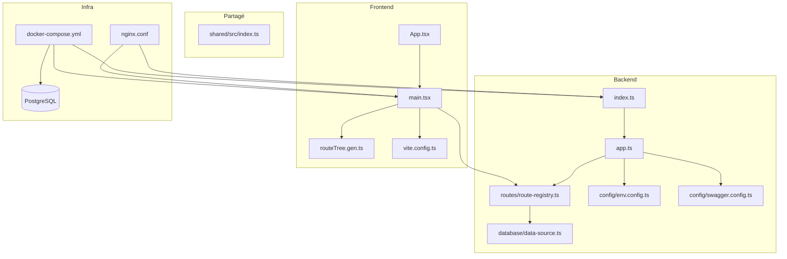
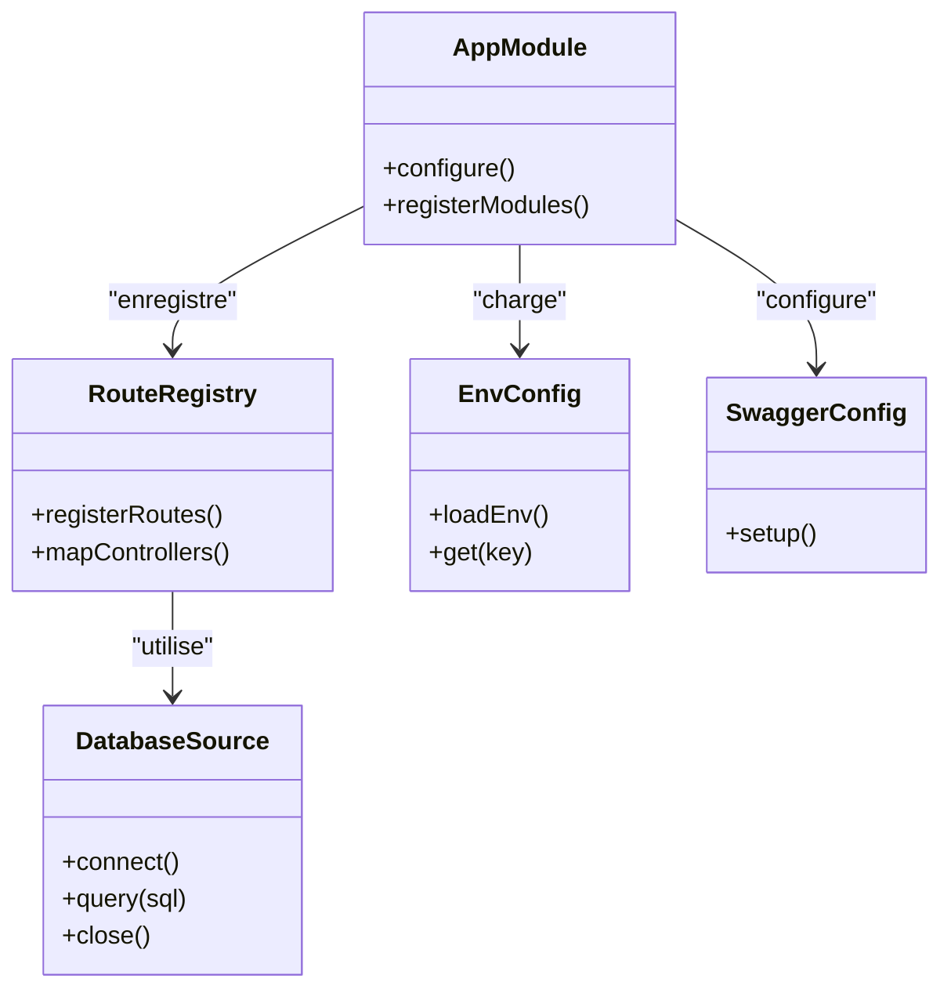
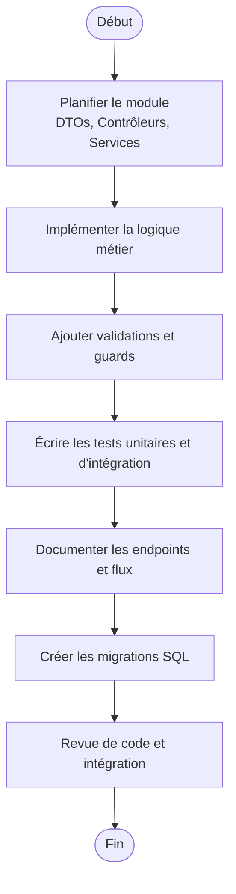
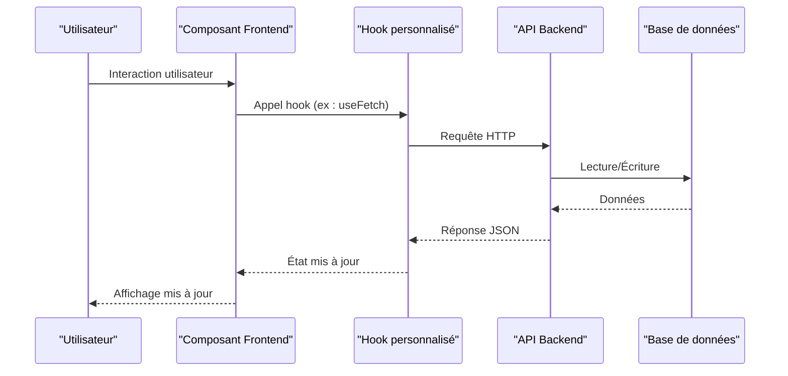
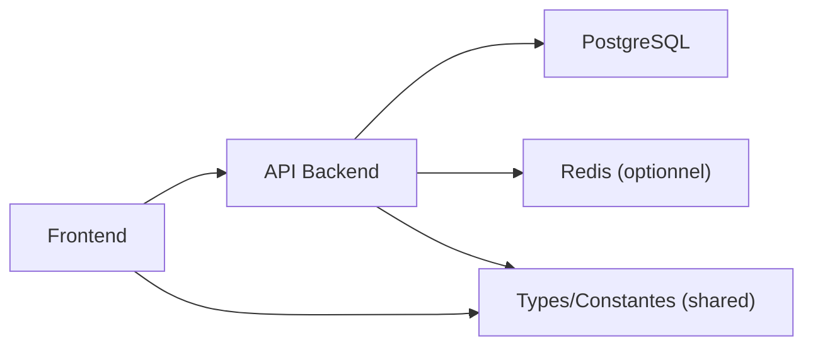

# Guide de Développement

<cite>
**Fichiers référencés dans ce document**
- [README.md](file://README.md)
- [package.json](file://package.json)
- [backend/package.json](file://backend/package.json)
- [frontend/package.json](file://frontend/package.json)
- [shared/package.json](file://shared/package.json)
- [docker-compose.yml](file://docker-compose.yml)
- [Dockerfile.backend](file://docker/Dockerfile.backend)
- [Dockerfile.frontend](file://docker/Dockerfile.frontend)
- [nginx.conf](file://docker/nginx.conf)
- [QUICKSTART.md](file://QUICKSTART.md)
- [GUIDE-DEVELOPPEMENT.md](file://docs/guides/GUIDE-DEVELOPPEMENT.md)
- [CHECKLIST-NOUVEAU-MODULE.md](file://docs/checklists/CHECKLIST-NOUVEAU-MODULE.md)
- [eslint.config.js](file://backend/eslint.config.js)
- [jest.config.ts](file://backend/jest.config.ts)
- [tsconfig.json](file://backend/tsconfig.json)
- [vite.config.ts](file://frontend/vite.config.ts)
- [app.ts](file://backend/src/app.ts)
- [index.ts](file://backend/src/index.ts)
- [route-registry.ts](file://backend/src/routes/route-registry.ts)
- [data-source.ts](file://backend/src/database/data-source.ts)
- [env.config.ts](file://backend/src/config/env.config.ts)
- [swagger.config.ts](file://backend/src/config/swagger.config.ts)
- [App.tsx](file://frontend/src/App.tsx)
- [main.tsx](file://frontend/src/main.tsx)
- [routeTree.gen.ts](file://frontend/src/routeTree.gen.ts)
- [index.ts](file://shared/src/index.ts)
</cite>

## Table des matières
1. [Introduction](#introduction)
2. [Structure du projet](#structure-du-projet)
3. [Environnement de développement](#environnement-de-developpement)
4. [Conventions de code et standards de qualité](#conventions-de-code-et-standards-de-qualite)
5. [Processus de test](#processus-de-test)
6. [Architecture et patterns de développement](#architecture-et-patterns-de-developpement)
7. [Utilitaires partagés et composants réutilisables](#utilitaires-partages-et-composants-reutilisables)
8. [Création d’un nouveau module backend](#creation-dun-nouveau-module-backend)
9. [Intégration de composants frontend](#integration-de-composants-frontend)
10. [Gestion d’état, hooks et services](#gestion-detat-hooks-et-services)
11. [Analyse des dépendances](#analyse-des-dependances)
12. [Considérations de performance](#considerations-de-performance)
13. [Guide de dépannage](#guide-de-depannage)
14. [Conclusion](#conclusion)
15. [Annexes](#annexes)

## Introduction
Ce guide de développement couvre l’ensemble des bonnes pratiques, outils et processus pour contribuer efficacement au projet eLISAschool. Il s’adresse aux développeurs souhaitant ajouter des fonctionnalités, améliorer les modules existants ou intégrer des composants frontend. Le projet est une application multi-modules avec un backend NestJS/TypeScript, un frontend React/Vite/TanStack Router, une base de données PostgreSQL, et une orchestration Docker complète. La documentation inclut la configuration de l’environnement, les conventions de codage, les tests unitaires et d’intégration, le linting, le débogage, ainsi que les workflows de contribution.

## Structure du projet
Le projet suit une architecture modulaire claire :
- Backend (NestJS) : modules par domaine, contrôleurs, services, DTOs, migrations, seeds, scripts utilitaires.
- Frontend (React + Vite + TanStack Router) : routes, features, composants, hooks, stores, lib utilitaire.
- Partagé (shared) : types, constantes, enums, validateurs, helpers communs.
- Infrastructure : Docker Compose, Nginx, scripts de déploiement, backups.
- Documentation : guides, rapports, audits, synthèses, checklists.

**Sources du diagramme**
- [app.ts](file://backend/src/app.ts)
- [index.ts](file://backend/src/index.ts)
- [route-registry.ts](file://backend/src/routes/route-registry.ts)
- [data-source.ts](file://backend/src/database/data-source.ts)
- [env.config.ts](file://backend/src/config/env.config.ts)
- [swagger.config.ts](file://backend/src/config/swagger.config.ts)
- [App.tsx](file://frontend/src/App.tsx)
- [main.tsx](file://frontend/src/main.tsx)
- [routeTree.gen.ts](file://frontend/src/routeTree.gen.ts)
- [vite.config.ts](file://frontend/vite.config.ts)
- [docker-compose.yml](file://docker-compose.yml)
- [nginx.conf](file://docker/nginx.conf)

**Sources de section**
- [README.md](file://README.md)
- [QUICKSTART.md](file://QUICKSTART.md)

## Environnement de développement
- Prérequis : Node.js LTS, Docker, Docker Compose, PostgreSQL (via Docker), IDE recommandé (VS Code).
- Installation : cloner le dépôt, installer les dépendances dans chaque dossier (backend, frontend, shared), configurer les variables d’environnement (.env).
- Démarrage : utiliser les scripts Docker pour lancer l’infrastructure et les services ; le script de démarrage rapide permet de démarrer rapidement en mode développement.
- Configuration IDE : activer TypeScript, ESLint, Prettier, extensions React et Tailwind si utilisées.

Commandes clés :
- Lancer l’infrastructure et les services : docker compose up -d
- Redémarrer le frontend/backend en développement : scripts dédiés dans scripts/
- Exécuter les migrations : scripts backend/scripts/run-migration.ts

**Sources de section**
- [docker-compose.yml](file://docker-compose.yml)
- [Dockerfile.backend](file://docker/Dockerfile.backend)
- [Dockerfile.frontend](file://docker/Dockerfile.frontend)
- [QUICKSTART.md](file://QUICKSTART.md)
- [GUIDE-DEVELOPPEMENT.md](file://docs/guides/GUIDE-DEVELOPPEMENT.md)

## Conventions de code et standards de qualité
- TypeScript strict : typage fort, interfaces claires, énumérations pour les états.
- ESLint : configuration centralisée dans le backend ; règles de style et de sécurité appliquées.
- Tests : Jest pour le backend, structure de tests unitaires et d’intégration séparée.
- Migrations SQL : numérotées et commentées, exécution via scripts.
- Architecture modulaire : chaque module encapsule ses contrôleurs, services, DTOs, validations et routes.

Outils :
- Linting : eslint.config.js
- Tests : jest.config.ts
- Configuration TS : tsconfig.json

**Sources de section**
- [eslint.config.js](file://backend/eslint.config.js)
- [jest.config.ts](file://backend/jest.config.ts)
- [tsconfig.json](file://backend/tsconfig.json)

## Processus de test
- Backend :
  - Tests unitaires : fichiers .spec.ts dans test/unit, couvrant services et utilitaires.
  - Tests d’intégration : fichiers .test.ts dans test/integration, vérifiant endpoints et interactions BDD.
  - Exécution : npm test ou npx jest selon la configuration.
- Frontend :
  - Tests unitaires et d’intégration recommandés avec Vitest/Jest selon la stack.
  - Tests E2E possibles avec Playwright/Cypress (à configurer si nécessaire).

Bonnes pratiques :
- Isoler les dépendances externes avec des mocks.
- Couvrir les cas limites et les erreurs.
- Utiliser des fixtures pour les données de test.

**Sources de section**
- [jest.config.ts](file://backend/jest.config.ts)

## Architecture et patterns de développement
- Backend NestJS :
  - Modules par domaine (eleves, finances, personnel, etc.).
  - Contrôleurs exposent les endpoints REST.
  - Services implémentent la logique métier.
  - DTOs pour la validation des entrées/sorties.
  - Middleware/Interceptors/Filters pour la gestion transversale.
- Frontend React :
  - Routes définies par TanStack Router (génération automatique routeTree.gen.ts).
  - Features organisées par domaine.
  - Hooks personnalisés pour la logique réutilisable.
  - Stores pour l’état global léger.
- Base de données :
  - TypeORM/Prisma (selon data-source.ts) avec migrations SQL.
  - Indexes et optimisations pour la performance.

**Sources du diagramme**
- [app.ts](file://backend/src/app.ts)
- [route-registry.ts](file://backend/src/routes/route-registry.ts)
- [data-source.ts](file://backend/src/database/data-source.ts)
- [env.config.ts](file://backend/src/config/env.config.ts)
- [swagger.config.ts](file://backend/src/config/swagger.config.ts)

**Sources de section**
- [app.ts](file://backend/src/app.ts)
- [index.ts](file://backend/src/index.ts)
- [route-registry.ts](file://backend/src/routes/route-registry.ts)

## Utilitaires partagés et composants réutilisables
- Partagé (shared) :
  - Types, constantes, enums, validateurs, helpers.
  - Export centralisé via index.ts.
- Frontend :
  - Composants UI réutilisables dans components/.
  - Hooks dans hooks/ pour la logique réutilisable.
  - Lib utilitaire dans lib/ pour les fonctions communes.

Exemples :
- Validation de formulaires avec des schémas partagés.
- Constantes globales pour les rôles, statuts, unités.
- Helpers pour la date, la monnaie, les permissions.

**Sources de section**
- [index.ts](file://shared/src/index.ts)

## Création d’un nouveau module backend
Suivre la checklist officielle pour garantir la cohérence et la maintenabilité :
- Créer le module avec ses contrôleurs, services, DTOs, validations.
- Ajouter les routes dans le registre.
- Écrire les tests unitaires et d’intégration.
- Documenter les endpoints et les flux.
- Ajouter les migrations nécessaires.

**Sources du diagramme**
- [CHECKLIST-NOUVEAU-MODULE.md](file://docs/checklists/CHECKLIST-NOUVEAU-MODULE.md)

**Sources de section**
- [CHECKLIST-NOUVEAU-MODULE.md](file://docs/checklists/CHECKLIST-NOUVEAU-MODULE.md)

## Intégration de composants frontend
- Définir les routes dans TanStack Router (génération automatique).
- Créer les composants dans features/ ou components/.
- Utiliser les hooks partagés pour la logique métier.
- Configurer le proxy Vite pour les appels API backend.
- Tester les composants isolément et en intégration.

**Sources du diagramme**
- [App.tsx](file://frontend/src/App.tsx)
- [main.tsx](file://frontend/src/main.tsx)
- [routeTree.gen.ts](file://frontend/src/routeTree.gen.ts)
- [vite.config.ts](file://frontend/vite.config.ts)

**Sources de section**
- [App.tsx](file://frontend/src/App.tsx)
- [main.tsx](file://frontend/src/main.tsx)
- [routeTree.gen.ts](file://frontend/src/routeTree.gen.ts)
- [vite.config.ts](file://frontend/vite.config.ts)

## Gestion d’état, hooks et services
- Hooks personnalisés : encapsulent la logique réutilisable (fetch, mutations, cache).
- Stores : état global léger pour les données partagées.
- Services backend : logique métier isolée, testable et réutilisable.
- Patterns :
  - Séparation des responsabilités (contrôleurs, services, DTOs).
  - Validation stricte des entrées/sorties.
  - Gestion d’erreurs centralisée.

**Sources de section**
- [route-registry.ts](file://backend/src/routes/route-registry.ts)
- [data-source.ts](file://backend/src/database/data-source.ts)

## Analyse des dépendances
- Backend :
  - Dépendances principales : NestJS, TypeORM/Prisma, JWT, Redis (optionnel), Swagger.
  - Scripts utilitaires pour les migrations et les seeds.
- Frontend :
  - Dépendances principales : React, Vite, TanStack Router, Tailwind (si utilisé).
- Partagé :
  - Types, constantes, validateurs communs.

**Sources du diagramme**
- [package.json](file://package.json)
- [backend/package.json](file://backend/package.json)
- [frontend/package.json](file://frontend/package.json)
- [shared/package.json](file://shared/package.json)

**Sources de section**
- [package.json](file://package.json)
- [backend/package.json](file://backend/package.json)
- [frontend/package.json](file://frontend/package.json)
- [shared/package.json](file://shared/package.json)

## Considérations de performance
- Backend :
  - Indexes sur les tables critiques.
  - Pagination et filtrage efficaces.
  - Cache Redis pour les données fréquemment consultées.
- Frontend :
  - Chargement paresseux des routes.
  - Optimisation des bundles avec Vite.
  - Mise en cache des requêtes API.
- Base de données :
  - Requêtes optimisées, jointures minimisées.
  - Migrations et indexes régulièrement audités.

[Pas de sources nécessaires car cette section fournit des conseils généraux]

## Guide de dépannage
- Erreurs courantes :
  - Connexion BDD : vérifier les variables d’environnement et les credentials.
  - Ports bloqués : redémarrer les services Docker.
  - Erreurs CORS : configurer correctement les origines autorisées.
- Outils de débogage :
  - Logs détaillés dans les services.
  - Swagger pour tester les endpoints.
  - Outils réseau dans le navigateur.

**Sources de section**
- [GUIDE-DEVELOPPEMENT.md](file://docs/guides/GUIDE-DEVELOPPEMENT.md)

## Conclusion
eLISAschool est une application robuste et modulaire conçue pour évoluer facilement. En suivant les conventions, les processus de test et les bonnes pratiques décrits dans ce guide, les contributeurs peuvent développer, tester et déployer des fonctionnalités de manière fiable et efficace. La documentation structurée et les outils automatisés facilitent la collaboration et la maintenance à long terme.

[Pas de sources nécessaires car cette section résume sans analyser de fichiers spécifiques]

## Annexes
- Commandes utiles :
  - Lancer l’infrastructure : docker compose up -d
  - Exécuter les tests : npm test
  - Appliquer les migrations : npm run migrate
- Liens vers la documentation :
  - Guides de développement et de déploiement dans docs/guides/
  - Checklists et rapports dans docs/checklists/ et docs/rapports/

[Pas de sources nécessaires car cette section fournit des informations générales]