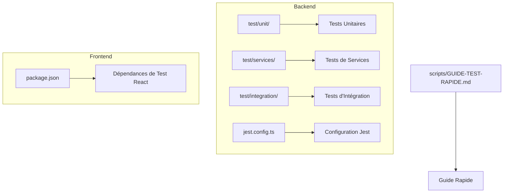
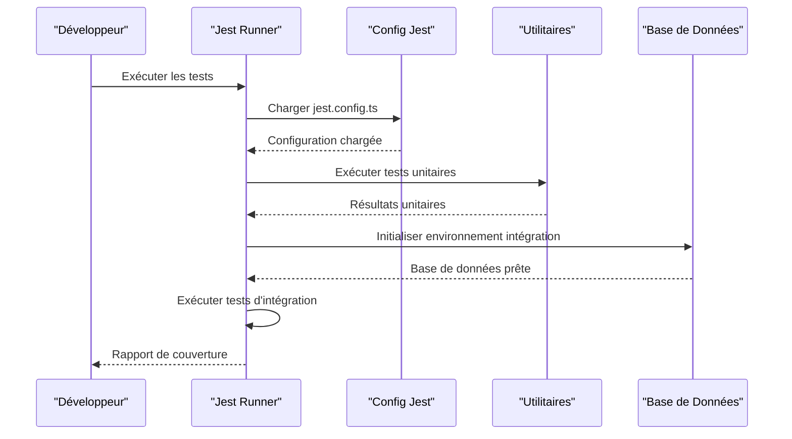
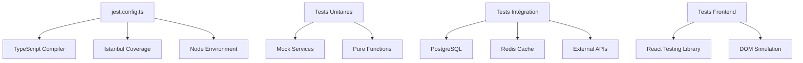

# Guide de Tests

<cite>
**Fichiers référencés dans ce document**
- [backend/jest.config.ts](file://backend/jest.config.ts)
- [backend/package.json](file://backend/package.json)
- [backend/test/README.md](file://backend/test/README.md)
- [backend/test/unit/pagination.util.spec.ts](file://backend/test/unit/pagination.util.spec.ts)
- [backend/test/unit/redis.service.spec.ts](file://backend/test/unit/redis.service.spec.ts)
- [backend/test/services/utilisateur-etablissement.service.test.ts](file://backend/test/services/utilisateur-etablissement.service.test.ts)
- [backend/test/services/utilisateurs.service.test.ts](file://backend/test/services/utilisateurs.service.test.ts)
- [backend/test/integration/auth-multi-etablissement.spec.ts](file://backend/test/integration/auth-multi-etablissement.spec.ts)
- [backend/test/integration/configuration-multi-tenant.spec.ts](file://backend/test/integration/configuration-multi-tenant.spec.ts)
- [backend/tests/integration/corrections-academique.test.ts](file://backend/tests/integration/corrections-academique.test.ts)
- [backend/src/config/database.config.ts](file://backend/src/config/database.config.ts)
- [backend/src/modules/auth/guards/roles.guard.ts](file://backend/src/modules/auth/guards/roles.guard.ts)
- [backend/src/common/middlewares/request-context.middleware.ts](file://backend/src/common/middlewares/request-context.middleware.ts)
- [backend/src/common/utils/pagination.util.ts](file://backend/src/common/utils/pagination.util.ts)
- [backend/src/modules/dashboard/services/dashboard.service.ts](file://backend/src/modules/dashboard/services/dashboard.service.ts)
- [backend/src/modules/eleves/controllers/eleves.controller.ts](file://backend/src/modules/eleves/controllers/eleves.controller.ts)
- [backend/src/modules/eleves/entities/eleve.entity.ts](file://backend/src/modules/eleves/entities/eleve.entity.ts)
- [frontend/package.json](file://frontend/package.json)
- [scripts/GUIDE-TEST-RAPIDE.md](file://scripts/GUIDE-TEST-RAPIDE.md)
</cite>

## Table des matières
1. [Introduction](#introduction)
2. [Structure du projet](#structure-du-projet)
3. [Composants clés](#composants-clés)
4. [Vue d'ensemble de l'architecture](#vue-densemble-de-larchitecture)
5. [Analyse détaillée des composants](#analyse-detaillee-des-composants)
6. [Analyse des dépendances](#analyse-des-dependances)
7. [Considérations de performance](#considerations-de-performance)
8. [Guide de dépannage](#guide-de-depannage)
9. [Conclusion](#conclusion)
10. [Annexes](#annexes)

## Introduction
Ce guide de tests pour eLISAschool couvre la configuration Jest, la structure des tests unitaires et d'intégration, les stratégies de mocking, ainsi que les bonnes pratiques pour tester les services NestJS, contrôleurs, entités TypeORM et composants React. Il inclut également des directives pour les tests d'intégration avec PostgreSQL et Redis, la gestion des fixtures, l'automatisation CI/CD et l'organisation des fichiers de test.

## Structure du projet
Le backend utilise Jest pour les tests unitaires et d'intégration, organisé en dossiers séparés pour les tests unitaires, les tests de services et les tests d'intégration. Le frontend dispose de son propre package.json pour les outils de test React.



**Diagramme sources**
- [backend/jest.config.ts:1-50](file://backend/jest.config.ts#L1-L50)
- [backend/package.json:1-100](file://backend/package.json#L1-L100)
- [frontend/package.json:1-50](file://frontend/package.json#L1-L50)

**Section sources**
- [backend/test/README.md:1-100](file://backend/test/README.md#L1-L100)
- [backend/jest.config.ts:1-50](file://backend/jest.config.ts#L1-L50)

## Composants clés
Le système de testing comprend plusieurs composants essentiels :

### Configuration Jest
La configuration principale se trouve dans `jest.config.ts` qui définit les patterns de fichiers, les transformateurs TypeScript et les options de couverture.

### Stratégies de Mocking
Les tests utilisent différentes approches de mocking selon le type de dépendance :
- Mocking de services NestJS via le système d'injection de dépendances
- Mocking de bases de données avec des repositories simulés
- Mocking de Redis pour les opérations de cache
- Mocking de middlewares et guards

### Organisation des Tests
- **Unitaires** (`test/unit/`) : Tests isolés de fonctions et utilitaires
- **Services** (`test/services/`) : Tests de logique métier
- **Intégration** (`test/integration/`) : Tests avec base de données et services externes

**Section sources**
- [backend/jest.config.ts:1-50](file://backend/jest.config.ts#L1-L50)
- [backend/test/unit/pagination.util.spec.ts:1-100](file://backend/test/unit/pagination.util.spec.ts#L1-L100)
- [backend/test/unit/redis.service.spec.ts:1-100](file://backend/test/unit/redis.service.spec.ts#L1-L100)

## Vue d'ensemble de l'architecture
Le système de tests suit une architecture en couches où chaque niveau teste des aspects spécifiques du code.



**Diagramme sources**
- [backend/jest.config.ts:1-50](file://backend/jest.config.ts#L1-L50)
- [backend/test/integration/auth-multi-etablissement.spec.ts:1-100](file://backend/test/integration/auth-multi-etablissement.spec.ts#L1-L100)

## Analyse détaillée des composants

### Configuration Jest Avancée
La configuration Jest est optimisée pour un projet NestJS avec TypeScript, incluant le support pour les decorators et les modules dynamiques.

#### Transformateurs et Extensions
- Support TypeScript complet avec ts-jest
- Gestion des fichiers `.spec.ts` et `.test.ts`
- Configuration de la couverture de code avec istanbul

#### Environnements de Test
- Environnement Node.js par défaut
- Configuration spécifique pour les tests d'intégration avec PostgreSQL
- Mocking de Redis pour les tests unitaires

**Section sources**
- [backend/jest.config.ts:1-50](file://backend/jest.config.ts#L1-L50)
- [backend/package.json:1-100](file://backend/package.json#L1-L100)

### Tests Unitaires
Les tests unitaires couvrent les utilitaires et fonctions pures sans dépendances externes.

#### Exemple de Test d'Utilitaire
Le fichier `pagination.util.spec.ts` montre comment tester les fonctions d'utilitaire avec différents cas de figure.

#### Mocking de Redis
Le fichier `redis.service.spec.ts` illustre le mocking des services Redis pour les tests unitaires.

**Section sources**
- [backend/test/unit/pagination.util.spec.ts:1-100](file://backend/test/unit/pagination.util.spec.ts#L1-L100)
- [backend/test/unit/redis.service.spec.ts:1-100](file://backend/test/unit/redis.service.spec.ts#L1-L100)

### Tests de Services
Les tests de services vérifient la logique métier et les interactions avec les repositories.

#### Test de Service Utilisateur
Le fichier `utilisateurs.service.test.ts` montre comment tester les services NestJS avec injection de dépendances mockées.

#### Test Multi-Tenant
Le fichier `utilisateur-etablissement.service.test.ts` couvre les scénarios multi-tenants.

**Section sources**
- [backend/test/services/utilisateurs.service.test.ts:1-100](file://backend/test/services/utilisateurs.service.test.ts#L1-L100)
- [backend/test/services/utilisateur-etablissement.service.test.ts:1-100](file://backend/test/services/utilisateur-etablissement.service.test.ts#L1-L100)

### Tests d'Intégration
Les tests d'intégration vérifient les interactions entre les composants et les services externes.

#### Test d'Authentification Multi-Établissement
Le fichier `auth-multi-etablissement.spec.ts` teste le flux d'authentification dans un contexte multi-tenants.

#### Test de Configuration Multi-Tenant
Le fichier `configuration-multi-tenant.spec.ts` valide la configuration et l'isolation des tenants.

**Section sources**
- [backend/test/integration/auth-multi-etablissement.spec.ts:1-100](file://backend/test/integration/auth-multi-etablissement.spec.ts#L1-L100)
- [backend/test/integration/configuration-multi-tenant.spec.ts:1-100](file://backend/test/integration/configuration-multi-tenant.spec.ts#L1-L100)

### Tests Frontend React
Le frontend utilise Jest avec React Testing Library pour les tests de composants.

#### Configuration de Test React
Le `package.json` du frontend contient les dépendances nécessaires pour les tests React.

#### Stratégies de Test Frontend
- Tests de composants avec rendu et interactions utilisateur
- Mocking des hooks et des appels API
- Tests d'état global avec stores

**Section sources**
- [frontend/package.json:1-100](file://frontend/package.json#L1-L100)

## Analyse des dépendances
L'analyse des dépendances montre comment les différents composants de test interagissent entre eux.



**Diagramme sources**
- [backend/jest.config.ts:1-50](file://backend/jest.config.ts#L1-L50)
- [backend/package.json:1-100](file://backend/package.json#L1-L100)

**Section sources**
- [backend/jest.config.ts:1-50](file://backend/jest.config.ts#L1-L50)
- [backend/package.json:1-100](file://backend/package.json#L1-L100)

## Considérations de performance
Pour optimiser les performances des tests :

### Parallelisation
- Exécution parallèle des tests unitaires
- Isolation des tests d'intégration pour éviter les conflits
- Utilisation de workers Jest pour accélérer l'exécution

### Optimisation des Mocks
- Réutilisation des mocks entre les tests
- Nettoyage approprié après chaque test
- Minimisation des mocks complexes

### Gestion de la Mémoire
- Fermeture des connexions base de données
- Nettoyage des caches Redis
- Libération des ressources après les tests

[No sources needed since this section provides general guidance]

## Guide de dépannage
Problèmes courants et solutions :

### Erreurs de Configuration Jest
- Vérifier les chemins de transformation TypeScript
- S'assurer que tous les modules sont correctement importés
- Valider les configurations d'environnement

### Problèmes de Connexion Base de Données
- Vérifier les credentials de connexion
- S'assurer que la base de données est accessible
- Nettoyer les transactions non validées

### Échecs de Tests d'Intégration
- Vérifier l'ordre d'exécution des migrations
- S'assurer que les fixtures sont correctement chargées
- Valider les permissions d'accès aux ressources

**Section sources**
- [backend/jest.config.ts:1-50](file://backend/jest.config.ts#L1-L50)
- [backend/test/README.md:1-100](file://backend/test/README.md#L1-L100)

## Conclusion
Ce guide fournit une vue complète du système de tests pour eLISAschool. La structure organisée, les stratégies de mocking appropriées et les bonnes pratiques de test assurent la qualité et la fiabilité de l'application. L'automatisation dans le pipeline CI/CD garantit que les tests s'exécutent régulièrement et détectent les régressions potentielles.

[No sources needed since this section summarizes without analyzing specific files]

## Annexes

### Commandes Utiles
Exécution des tests unitaires :
```bash
npm run test:unit
```

Exécution des tests d'intégration :
```bash
npm run test:integration
```

Génération du rapport de couverture :
```bash
npm run test:coverage
```

### Bonnes Pratiques de Naming
- Utiliser `.spec.ts` pour les tests unitaires
- Utiliser `.test.ts` pour les tests d'intégration
- Nommer les fichiers de test correspondant au fichier source
- Organiser les tests par fonctionnalité ou module

### Organisation des Fichiers de Test
```
test/
├── unit/           # Tests unitaires
├── services/       # Tests de services
├── integration/    # Tests d'intégration
└── helpers/        # Helpers et utilitaires de test
```

**Section sources**
- [scripts/GUIDE-TEST-RAPIDE.md:1-100](file://scripts/GUIDE-TEST-RAPIDE.md#L1-L100)
- [backend/test/README.md:1-100](file://backend/test/README.md#L1-L100)