# Outils de Développement

<cite>
**Fichiers référencés dans ce document**
- [package.json](file://package.json)
- [backend/package.json](file://backend/package.json)
- [frontend/package.json](file://frontend/package.json)
- [shared/package.json](file://shared/package.json)
- [backend/nodemon.json](file://backend/nodemon.json)
- [frontend/vite.config.ts](file://frontend/vite.config.ts)
- [docker-compose.yml](file://docker-compose.yml)
- [scripts/start-dev.sh](file://scripts/start-dev.sh)
- [scripts/stop-dev.sh](file://scripts/stop-dev.sh)
- [scripts/rebuild-docker.sh](file://scripts/rebuild-docker.sh)
- [backend/eslint.config.js](file://backend/eslint.config.js)
- [backend/jest.config.ts](file://backend/jest.config.ts)
- [backend/src/index.ts](file://backend/src/index.ts)
- [frontend/src/main.tsx](file://frontend/src/main.tsx)
- [docker/Dockerfile.backend.dev](file://docker/Dockerfile.backend.dev)
- [docker/Dockerfile.frontend](file://docker/Dockerfile.frontend)
- [docker/nginx.conf](file://docker/nginx.conf)
- [scripts/test-rapide-modules.sh](file://scripts/test-rapide-modules.sh)
- [scripts/verify-setup.sh](file://scripts/verify-setup.sh)
- [scripts/force-restart-frontend.sh](file://scripts/force-restart-frontend.sh)
- [scripts/config-reseau-local.sh](file://scripts/config-reseau-local.sh)
- [scripts/config-acces-reseau-local.sh](file://scripts/config-acces-reseau-local.sh)
</cite>

## Table des matières
1. [Introduction](#introduction)
2. [Structure du projet](#structure-du-projet)
3. [Composants clés](#composants-clés)
4. [Vue d'ensemble de l'architecture](#vue-densemble-de-larchitecture)
5. [Analyse détaillée des composants](#analyse-detaillee-des-composants)
6. [Analyse des dépendances](#analyse-des-dependances)
7. [Considérations de performance](#considerations-de-performance)
8. [Guide de dépannage](#guide-de-depannage)
9. [Conclusion](#conclusion)
10. [Annexes](#annexes)

## Introduction
Ce guide présente les outils et configurations de développement pour eLISAschool : nodemon, Vite, scripts d’automatisation, debugging (Node.js et React), profiling, logs, monitoring local, extensions VS Code recommandées, hooks Git, intégrations qualité de code, templates de commit et checklists de review. Il s’appuie sur la structure monorepo avec backend NestJS, frontend React/Vite, et un partage de types via shared.

## Structure du projet
Le projet est organisé en plusieurs packages :
- backend : API NestJS, migrations, scripts de test et utilitaires
- frontend : application React avec Vite et TanStack Router
- shared : types et constantes partagés
- docker : images, compose, nginx, scripts de déploiement
- scripts : automatisation globale (démarrage, tests, vérifications)

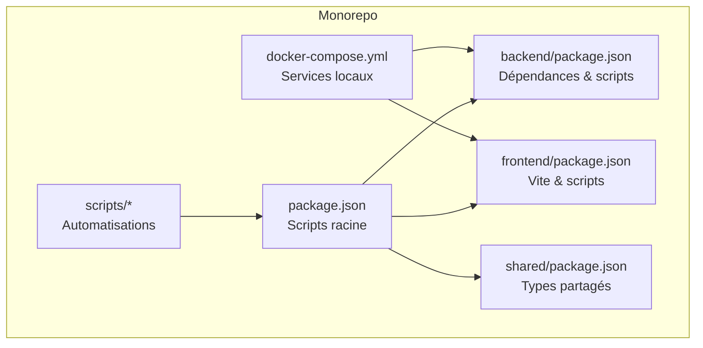

**Sources de diagramme**
- [package.json](file://package.json)
- [backend/package.json](file://backend/package.json)
- [frontend/package.json](file://frontend/package.json)
- [shared/package.json](file://shared/package.json)
- [docker-compose.yml](file://docker-compose.yml)
- [scripts/start-dev.sh](file://scripts/start-dev.sh)

**Sources de section**
- [package.json](file://package.json)
- [backend/package.json](file://backend/package.json)
- [frontend/package.json](file://frontend/package.json)
- [shared/package.json](file://shared/package.json)
- [docker-compose.yml](file://docker-compose.yml)

## Composants clés
- Serveur de développement backend : nodemon pour rechargement à chaud
- Build et dev serveur frontend : Vite avec HMR
- Orchestration locale : Docker Compose (PostgreSQL, Redis, services)
- Scripts d’automatisation : démarrage, tests, vérifications, rebuild
- Qualité de code : ESLint (backend), Jest (tests unitaires/intégration)
- Debugging : configurations VS Code pour Node.js et React

**Sources de section**
- [backend/nodemon.json](file://backend/nodemon.json)
- [frontend/vite.config.ts](file://frontend/vite.config.ts)
- [docker-compose.yml](file://docker-compose.yml)
- [backend/eslint.config.js](file://backend/eslint.config.js)
- [backend/jest.config.ts](file://backend/jest.config.ts)

## Vue d'ensemble de l'architecture
Le flux de développement local démarre le backend (NestJS + nodemon) et le frontend (Vite). Les deux sont conteneurisés via Docker Compose pour PostgreSQL et Redis. Le proxy Nginx peut être utilisé en mode containerisé.

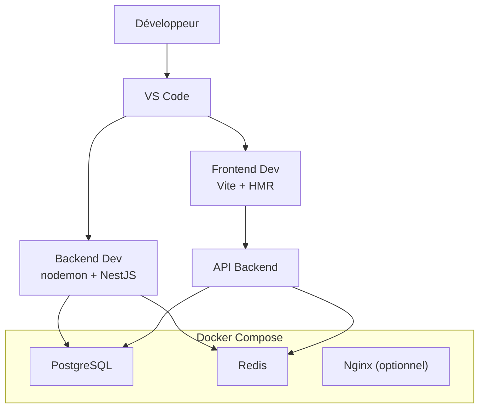

**Sources de diagramme**
- [docker-compose.yml](file://docker-compose.yml)
- [docker/nginx.conf](file://docker/nginx.conf)
- [backend/src/index.ts](file://backend/src/index.ts)
- [frontend/src/main.tsx](file://frontend/src/main.tsx)

## Analyse détaillée des composants

### Configuration de développement backend (nodemon)
- Rechargement automatique lors des modifications TypeScript/JS
- Exécution du build ou du transpileur selon la configuration
- Variables d’environnement chargées depuis .env.local ou fichier dédié
- Intégration avec les scripts npm du package backend

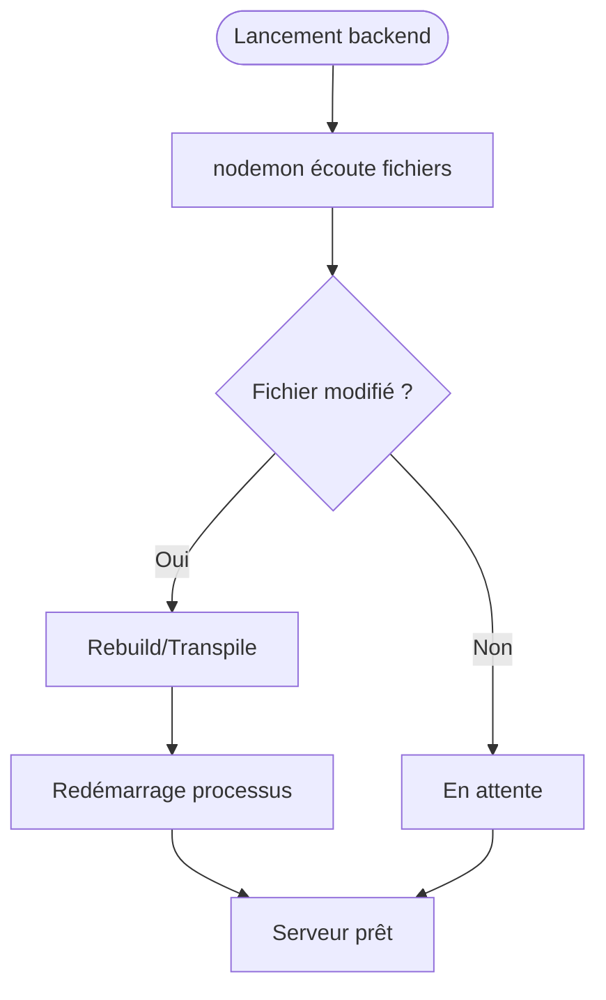

**Sources de diagramme**
- [backend/nodemon.json](file://backend/nodemon.json)
- [backend/package.json](file://backend/package.json)

**Sources de section**
- [backend/nodemon.json](file://backend/nodemon.json)
- [backend/package.json](file://backend/package.json)

### Configuration de développement frontend (Vite)
- Serveur de développement avec HMR
- Proxy vers l’API backend pour éviter les problèmes CORS
- Optimisations de build et gestion des assets
- Intégration avec React et TanStack Router

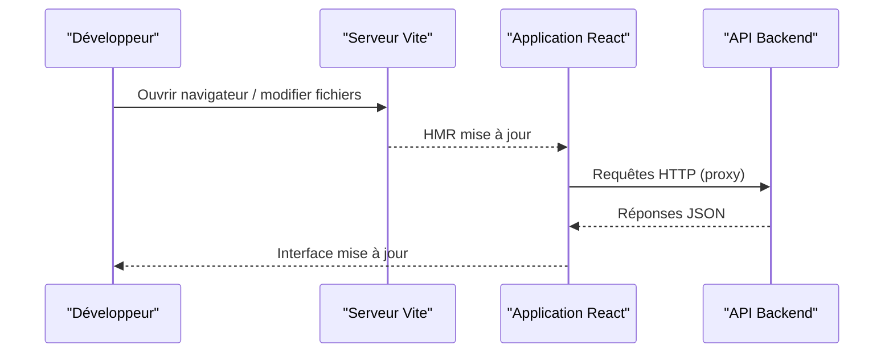

**Sources de diagramme**
- [frontend/vite.config.ts](file://frontend/vite.config.ts)
- [frontend/src/main.tsx](file://frontend/src/main.tsx)

**Sources de section**
- [frontend/vite.config.ts](file://frontend/vite.config.ts)
- [frontend/package.json](file://frontend/package.json)

### Scripts d’automatisation
- Démarrage rapide : scripts start/stop pour orchestrer les services
- Tests rapides : exécution ciblée de modules ou endpoints
- Vérification setup : contrôle des ports, dépendances, variables
- Rebuild Docker : reconstruction des images locales

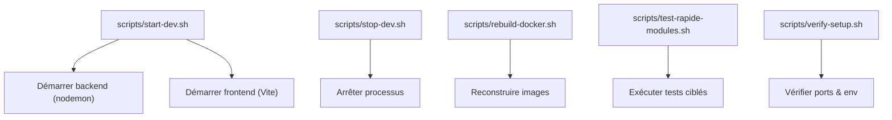

**Sources de diagramme**
- [scripts/start-dev.sh](file://scripts/start-dev.sh)
- [scripts/stop-dev.sh](file://scripts/stop-dev.sh)
- [scripts/rebuild-docker.sh](file://scripts/rebuild-docker.sh)
- [scripts/test-rapide-modules.sh](file://scripts/test-rapide-modules.sh)
- [scripts/verify-setup.sh](file://scripts/verify-setup.sh)

**Sources de section**
- [scripts/start-dev.sh](file://scripts/start-dev.sh)
- [scripts/stop-dev.sh](file://scripts/stop-dev.sh)
- [scripts/rebuild-docker.sh](file://scripts/rebuild-docker.sh)
- [scripts/test-rapide-modules.sh](file://scripts/test-rapide-modules.sh)
- [scripts/verify-setup.sh](file://scripts/verify-setup.sh)

### Debugging (Node.js et React)
- Backend : configuration de débogage Node.js dans VS Code pour lancer le serveur en mode debug
- Frontend : configuration de débogage Chrome/Edge pour React et Vite
- Points d’arrêt sur middlewares, contrôleurs, services
- Inspection des variables d’environnement et des requêtes HTTP

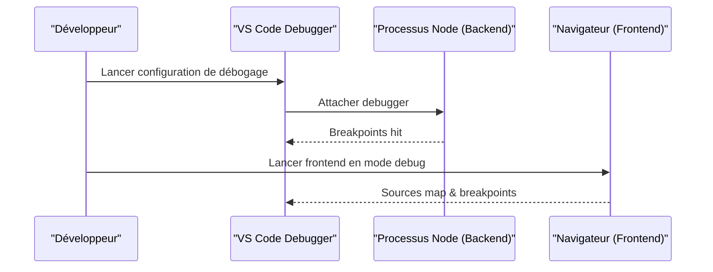

**Sources de diagramme**
- [backend/src/index.ts](file://backend/src/index.ts)
- [frontend/src/main.tsx](file://frontend/src/main.tsx)

**Sources de section**
- [backend/src/index.ts](file://backend/src/index.ts)
- [frontend/src/main.tsx](file://frontend/src/main.tsx)

### Profiling et logs
- Backend : activation des logs de requêtes, temps de réponse, erreurs
- Frontend : outils de performance navigateur (Network, Performance)
- Monitoring local : Prometheus/Grafana optionnels via Docker Compose
- Logs centralisés : fichiers journalisés par service

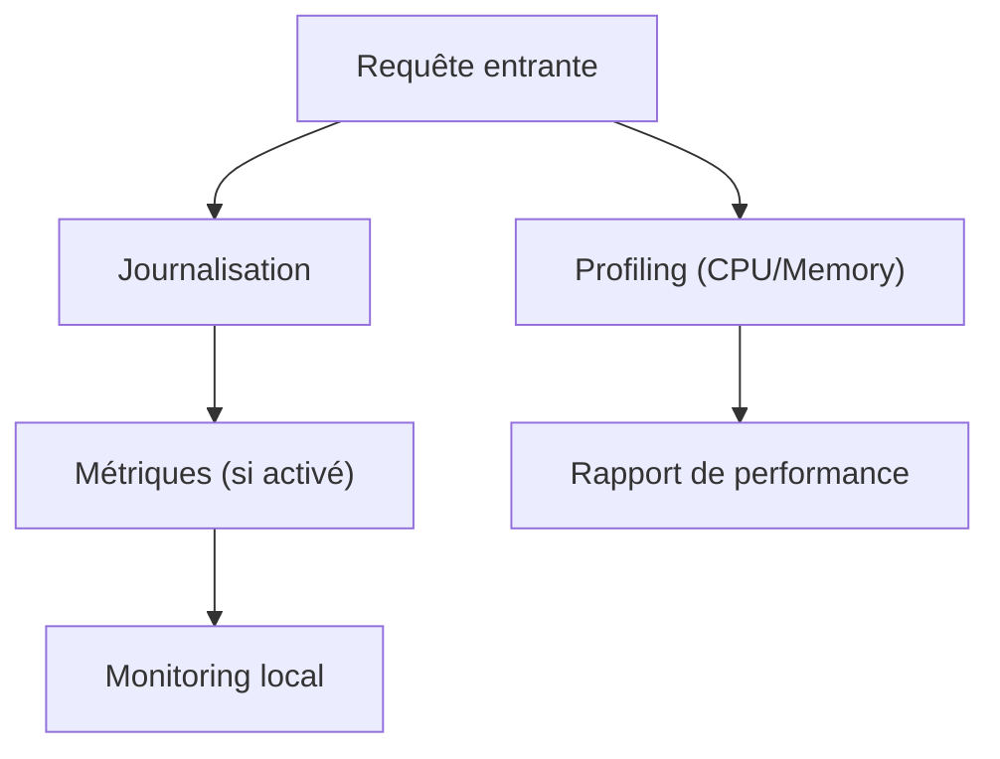

**Sources de diagramme**
- [docker-compose.yml](file://docker-compose.yml)
- [backend/package.json](file://backend/package.json)

**Sources de section**
- [docker-compose.yml](file://docker-compose.yml)
- [backend/package.json](file://backend/package.json)

### Outils de qualité de code et hooks Git
- ESLint pour linting backend
- Jest pour tests unitaires et d’intégration
- Hooks Git (pre-commit) pour exécuter lint et tests avant validation
- Templates de commit pour standardiser les messages

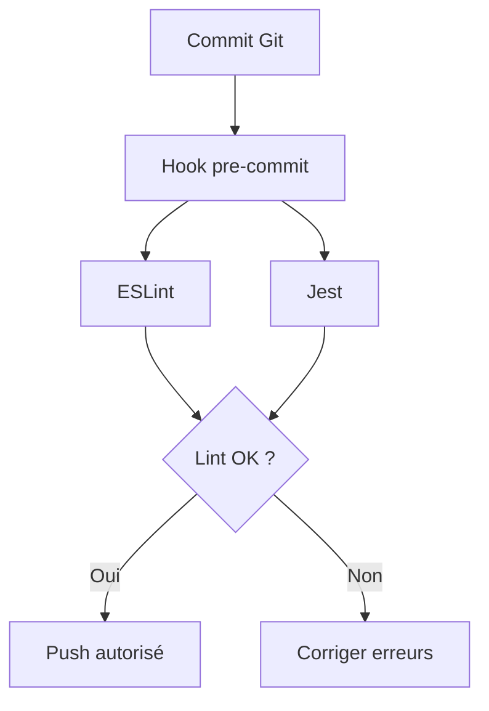

**Sources de diagramme**
- [backend/eslint.config.js](file://backend/eslint.config.js)
- [backend/jest.config.ts](file://backend/jest.config.ts)

**Sources de section**
- [backend/eslint.config.js](file://backend/eslint.config.js)
- [backend/jest.config.ts](file://backend/jest.config.ts)

### Intégrations Docker et Nginx
- Images Docker pour backend et frontend
- Nginx comme reverse proxy en production locale
- Variables d’environnement et volumes persistants

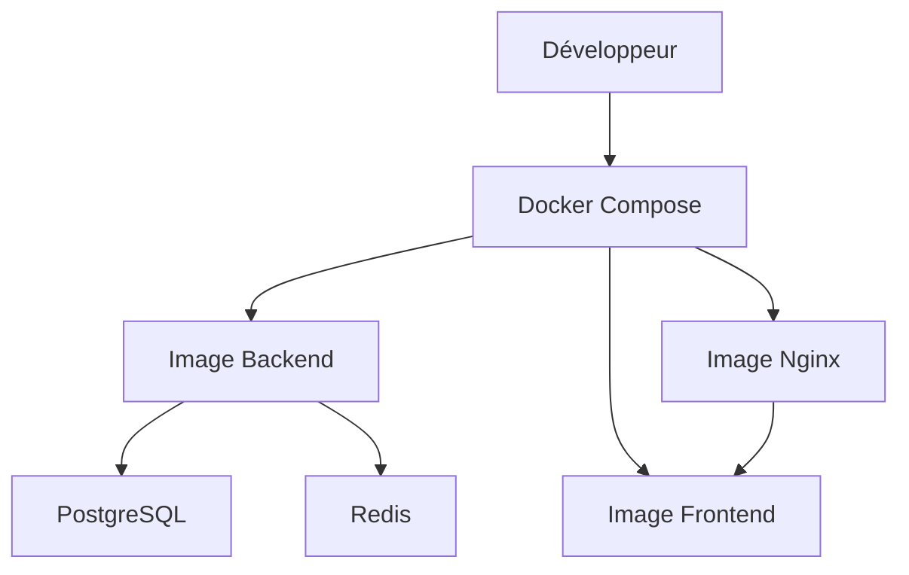

**Sources de diagramme**
- [docker/Dockerfile.backend.dev](file://docker/Dockerfile.backend.dev)
- [docker/Dockerfile.frontend](file://docker/Dockerfile.frontend)
- [docker/nginx.conf](file://docker/nginx.conf)
- [docker-compose.yml](file://docker-compose.yml)

**Sources de section**
- [docker/Dockerfile.backend.dev](file://docker/Dockerfile.backend.dev)
- [docker/Dockerfile.frontend](file://docker/Dockerfile.frontend)
- [docker/nginx.conf](file://docker/nginx.conf)
- [docker-compose.yml](file://docker-compose.yml)

## Analyse des dépendances
Les scripts racine orchestrent les sous-packages et Docker. Les dépendances de développement sont définies dans chaque package.json.

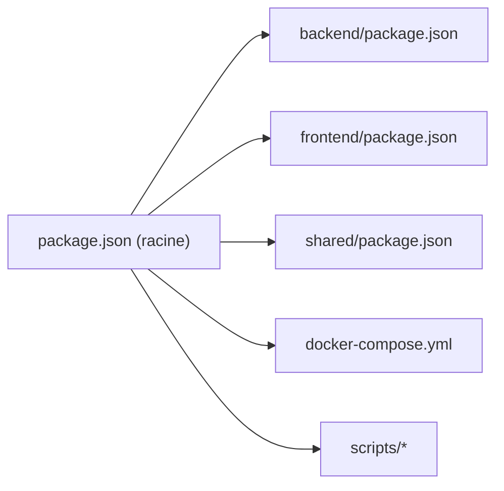

**Sources de diagramme**
- [package.json](file://package.json)
- [backend/package.json](file://backend/package.json)
- [frontend/package.json](file://frontend/package.json)
- [shared/package.json](file://shared/package.json)
- [docker-compose.yml](file://docker-compose.yml)

**Sources de section**
- [package.json](file://package.json)
- [backend/package.json](file://backend/package.json)
- [frontend/package.json](file://frontend/package.json)
- [shared/package.json](file://shared/package.json)
- [docker-compose.yml](file://docker-compose.yml)

## Considérations de performance
- Utiliser nodemon uniquement en développement ; désactiver le rechargement excessif
- Activer le cache Vite et optimiser les imports côté frontend
- Limiter les logs verbeux en production ; utiliser des niveaux de log appropriés
- Profiler les requêtes critiques et indexer les bases de données si nécessaire
- Surveiller les métriques CPU/mémoire avec des outils locaux

[Pas de sources nécessaires car cette section fournit des conseils généraux]

## Guide de dépannage
- Problèmes de ports : vérifier les ports occupés et redémarrer les services
- Erreurs CORS : configurer le proxy Vite correctement
- Connexion base de données : vérifier les variables d’environnement et les credentials
- Redémarrage forcé : scripts de restart frontend/backend
- Accès réseau local : scripts de configuration pour multi-machine

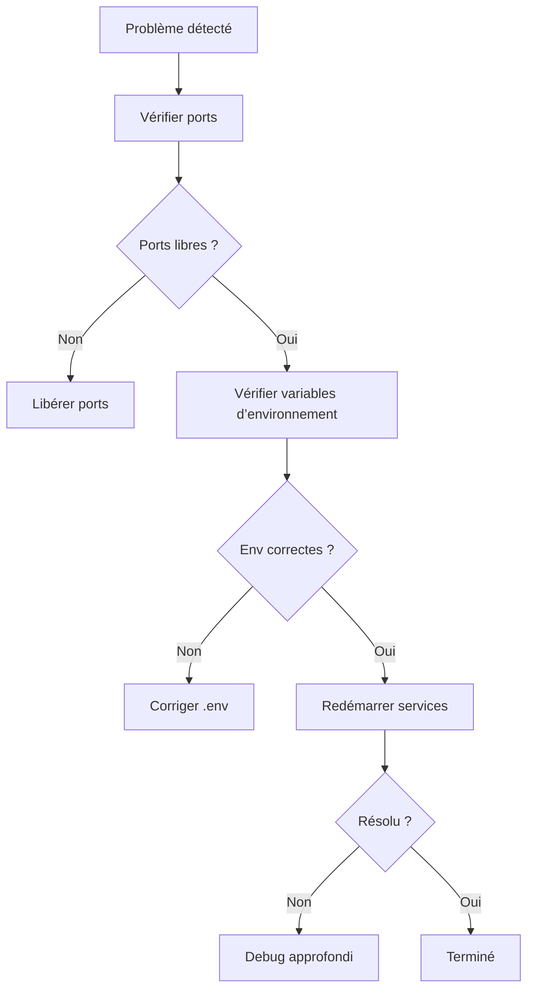

**Sources de diagramme**
- [scripts/force-restart-frontend.sh](file://scripts/force-restart-frontend.sh)
- [scripts/config-reseau-local.sh](file://scripts/config-reseau-local.sh)
- [scripts/config-acces-reseau-local.sh](file://scripts/config-acces-reseau-local.sh)

**Sources de section**
- [scripts/force-restart-frontend.sh](file://scripts/force-restart-frontend.sh)
- [scripts/config-reseau-local.sh](file://scripts/config-reseau-local.sh)
- [scripts/config-acces-reseau-local.sh](file://scripts/config-acces-reseau-local.sh)

## Conclusion
Ce guide couvre les outils essentiels pour développer eLISAschool localement : nodemon, Vite, Docker, scripts d’automatisation, debugging, profiling, logs, monitoring, qualité de code et hooks Git. Suivre ces bonnes pratiques permet une expérience de développement fluide et productive.

[Pas de sources nécessaires car cette section résume sans analyser de fichiers spécifiques]

## Annexes
- Extensions VS Code recommandées : ESLint, Prettier, Docker, REST Client, Thunder Client
- Templates de commit : conventionnelle (feat, fix, docs, refactor, test, chore)
- Checklists de review : couverture de tests, lint, sécurité, performances, documentation

[Pas de sources nécessaires car cette section fournit des informations générales]