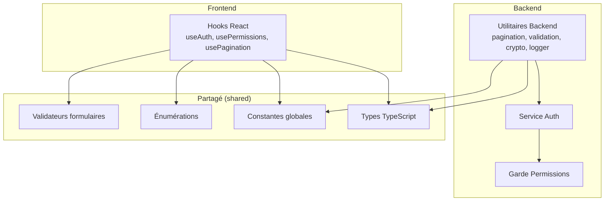
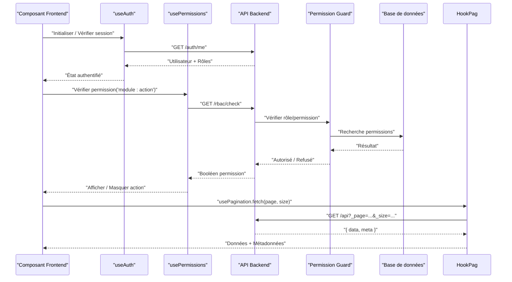
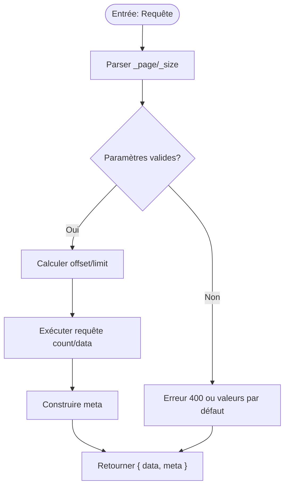
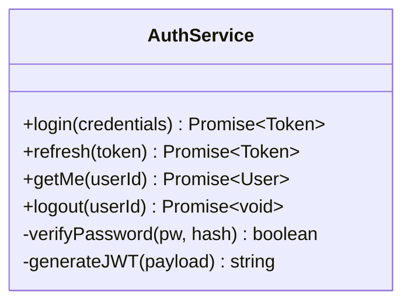
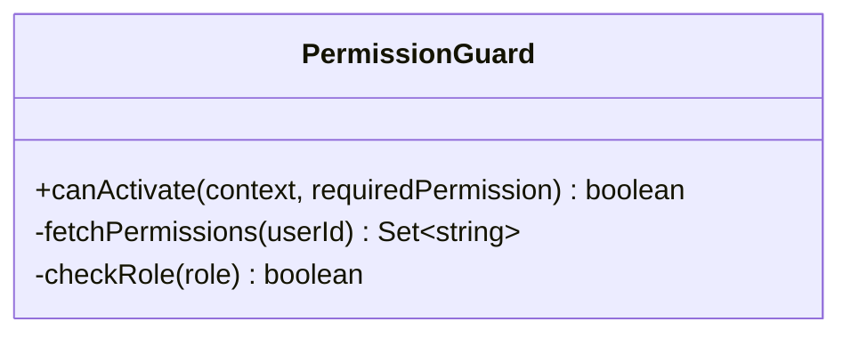
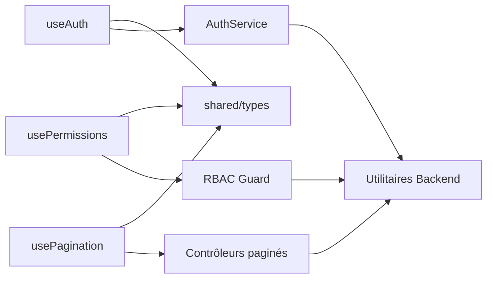

# Utilitaires et Hooks Partagés

<cite>
**Fichiers référencés dans ce document**
- [backend/src/common/utils/pagination.util.ts](file://backend/src/common/utils/pagination.util.ts)
- [backend/src/common/utils/validation.util.ts](file://backend/src/common/utils/validation.util.ts)
- [backend/src/common/utils/crypto.util.ts](file://backend/src/common/utils/crypto.util.ts)
- [backend/src/common/utils/logger.util.ts](file://backend/src/common/utils/logger.util.ts)
- [backend/src/modules/auth/services/auth.service.ts](file://backend/src/modules/auth/services/auth.service.ts)
- [backend/src/modules/rbac/guards/permission.guard.ts](file://backend/src/modules/rbac/guards/permission.guard.ts)
- [frontend/src/hooks/useAuth.ts](file://frontend/src/hooks/useAuth.ts)
- [frontend/src/hooks/usePermissions.ts](file://frontend/src/hooks/usePermissions.ts)
- [frontend/src/hooks/usePagination.ts](file://frontend/src/hooks/usePagination.ts)
- [shared/src/types/index.ts](file://shared/src/types/index.ts)
- [shared/src/constants/app.constants.ts](file://shared/src/constants/app.constants.ts)
- [shared/src/enums/status.enum.ts](file://shared/src/enums/status.enum.ts)
- [shared/src/validators/form.validators.ts](file://shared/src/validators/form.validators.ts)
- [backend/docs/pagination-guide.md](file://backend/docs/pagination-guide.md)
- [backend/test/unit/pagination.util.spec.ts](file://backend/test/unit/pagination.util.spec.ts)
</cite>

## Table des matières
1. [Introduction](#introduction)
2. [Structure du projet](#structure-du-projet)
3. [Composants clés](#composants-clés)
4. [Vue d'ensemble de l'architecture](#vue-densemble-de-larchitecture)
5. [Analyse détaillée des composants](#analyse-detallee-des-composants)
6. [Analyse des dépendances](#analyse-des-dependances)
7. [Considérations de performance](#considerations-de-performance)
8. [Guide de dépannage](#guide-de-depannage)
9. [Conclusion](#conclusion)
10. [Annexes](#annexes)

## Introduction
Ce document présente les utilitaires backend et les hooks React partagés dans eLISAschool, ainsi que les types et constantes réutilisables entre le frontend et le backend. Il couvre la pagination, la validation, le chiffrement, la journalisation, l’authentification et les permissions, avec des exemples d’intégration, des bonnes pratiques, des stratégies de tests et de versioning des APIs internes.

## Structure du projet
Le code partage des utilitaires et des types via un package partagé (shared), tandis que le backend expose des utilitaires spécifiques au serveur et le frontend des hooks React pour l’état utilisateur, les permissions et la pagination.

**Diagramme sources**
- [backend/src/common/utils/pagination.util.ts](file://backend/src/common/utils/pagination.util.ts)
- [backend/src/common/utils/validation.util.ts](file://backend/src/common/utils/validation.util.ts)
- [backend/src/common/utils/crypto.util.ts](file://backend/src/common/utils/crypto.util.ts)
- [backend/src/common/utils/logger.util.ts](file://backend/src/common/utils/logger.util.ts)
- [backend/src/modules/auth/services/auth.service.ts](file://backend/src/modules/auth/services/auth.service.ts)
- [backend/src/modules/rbac/guards/permission.guard.ts](file://backend/src/modules/rbac/guards/permission.guard.ts)
- [frontend/src/hooks/useAuth.ts](file://frontend/src/hooks/useAuth.ts)
- [frontend/src/hooks/usePermissions.ts](file://frontend/src/hooks/usePermissions.ts)
- [frontend/src/hooks/usePagination.ts](file://frontend/src/hooks/usePagination.ts)
- [shared/src/types/index.ts](file://shared/src/types/index.ts)
- [shared/src/constants/app.constants.ts](file://shared/src/constants/app.constants.ts)
- [shared/src/enums/status.enum.ts](file://shared/src/enums/status.enum.ts)
- [shared/src/validators/form.validators.ts](file://shared/src/validators/form.validators.ts)

**Sources de section**
- [backend/docs/pagination-guide.md](file://backend/docs/pagination-guide.md)

## Composants clés
- Utilitaires backend:
  - Pagination: fonctions pour générer les métadonnées de pagination et valider les paramètres.
  - Validation: helpers pour valider payloads entrants et formats courants.
  - Crypto: hashage, hachage sécurisé, génération de tokens sécurisés.
  - Logger: journalisation structurée, niveaux de log, filtres par contexte.
- Hooks React:
  - useAuth: gestion de l’identité, du token, de l’expiration et de la reconnexion.
  - usePermissions: vérification des permissions basées sur RBAC.
  - usePagination: état local de pagination, requêtes paginées, mise à jour synchrone.
- Types et constantes partagés:
  - Types communs (réponses paginées, erreurs, statuts).
  - Constantes globales (limites, codes HTTP, messages standards).
  - Énumérations (états, rôles, modules).
  - Validateurs frontaux (formats email, téléphone, montants).

**Sources de section**
- [backend/src/common/utils/pagination.util.ts](file://backend/src/common/utils/pagination.util.ts)
- [backend/src/common/utils/validation.util.ts](file://backend/src/common/utils/validation.util.ts)
- [backend/src/common/utils/crypto.util.ts](file://backend/src/common/utils/crypto.util.ts)
- [backend/src/common/utils/logger.util.ts](file://backend/src/common/utils/logger.util.ts)
- [frontend/src/hooks/useAuth.ts](file://frontend/src/hooks/useAuth.ts)
- [frontend/src/hooks/usePermissions.ts](file://frontend/src/hooks/usePermissions.ts)
- [frontend/src/hooks/usePagination.ts](file://frontend/src/hooks/usePagination.ts)
- [shared/src/types/index.ts](file://shared/src/types/index.ts)
- [shared/src/constants/app.constants.ts](file://shared/src/constants/app.constants.ts)
- [shared/src/enums/status.enum.ts](file://shared/src/enums/status.enum.ts)
- [shared/src/validators/form.validators.ts](file://shared/src/validators/form.validators.ts)

## Vue d'ensemble de l'architecture
La séquence typique d’une opération protégée passe par le hook useAuth qui interroge le service backend, puis utilise usePermissions pour vérifier les droits avant d’appeler une API. La réponse est souvent paginée via usePagination.

**Diagramme sources**
- [frontend/src/hooks/useAuth.ts](file://frontend/src/hooks/useAuth.ts)
- [frontend/src/hooks/usePermissions.ts](file://frontend/src/hooks/usePermissions.ts)
- [frontend/src/hooks/usePagination.ts](file://frontend/src/hooks/usePagination.ts)
- [backend/src/modules/auth/services/auth.service.ts](file://backend/src/modules/auth/services/auth.service.ts)
- [backend/src/modules/rbac/guards/permission.guard.ts](file://backend/src/modules/rbac/guards/permission.guard.ts)

## Analyse détaillée des composants

### Utilitaire de pagination (Backend)
- Responsabilités:
  - Valider les paramètres _page et _size.
  - Calculer les limites SQL (offset/limit).
  - Générer les métadonnées (total, pages, hasNext, hasPrev).
- Méthodes principales:
  - parseQueryParams(query): retourne page, size, offset, limit.
  - buildMeta(total, page, size): retourne objet meta standard.
- Complexité:
  - O(1) pour le calcul des métadonnées; O(n) pour le comptage total selon la requête.
- Bonnes pratiques:
  - Limiter max size pour éviter les surcharges.
  - Normaliser les valeurs par défaut.
- Exemple d’utilisation:
  - Dans un contrôleur, parser les paramètres, exécuter la requête, retourner { data, meta }.

**Diagramme sources**
- [backend/src/common/utils/pagination.util.ts](file://backend/src/common/utils/pagination.util.ts)

**Sources de section**
- [backend/src/common/utils/pagination.util.ts](file://backend/src/common/utils/pagination.util.ts)
- [backend/test/unit/pagination.util.spec.ts](file://backend/test/unit/pagination.util.spec.ts)
- [backend/docs/pagination-guide.md](file://backend/docs/pagination-guide.md)

### Utilitaire de validation (Backend)
- Responsabilités:
  - Valider formats (email, téléphone, UUID, montant).
  - Appliquer règles de longueur, regex, plages.
- Méthodes principales:
  - validateEmail(value), validatePhone(value), validateUUID(value), validateAmount(value).
  - validatePayload(schema, data): renvoie { ok, errors }.
- Complexité:
  - O(k) où k est le nombre de champs validés.
- Bonnes pratiques:
  - Centraliser les messages d’erreur.
  - Utiliser des schémas réutilisables.

**Sources de section**
- [backend/src/common/utils/validation.util.ts](file://backend/src/common/utils/validation.util.ts)

### Utilitaire de chiffrement (Backend)
- Responsabilités:
  - Hacher les mots de passe (bcrypt/argon2).
  - Générer des tokens JWT sécurisés.
  - Chiffrer/déchiffrer des données sensibles si nécessaire.
- Méthodes principales:
  - hashPassword(password), verifyPassword(password, hash), generateToken(payload), encrypt(data), decrypt(data).
- Complexité:
  - Hachage: coût configurable; Token: O(1).
- Bonnes pratiques:
  - Ne jamais stocker de secrets en clair.
  - Rotation des secrets et expiration courte des tokens.

**Sources de section**
- [backend/src/common/utils/crypto.util.ts](file://backend/src/common/utils/crypto.util.ts)

### Utilitaire de journalisation (Backend)
- Responsabilités:
  - Journalisation structurée (JSON) avec niveau, timestamp, contexte.
  - Filtrage par environnement (dev/prod).
- Méthodes principales:
  - log(level, message, context), error(message, context), warn(message, context).
- Complexité:
  - O(1) par appel; I/O asynchrone.
- Bonnes pratiques:
  - Éviter les logs sensibles.
  - Structurer les messages pour analyse.

**Sources de section**
- [backend/src/common/utils/logger.util.ts](file://backend/src/common/utils/logger.util.ts)

### Service d’authentification (Backend)
- Responsabilités:
  - Connexion, renouvellement de token, vérification de session.
  - Liaison utilisateur/établissement et rôles.
- Méthodes principales:
  - login(credentials), refresh(token), getMe(userId), logout(userId).
- Flux:
  - Authentification -> Génération JWT -> Stockage côté client -> Vérification à chaque requête.

**Diagramme sources**
- [backend/src/modules/auth/services/auth.service.ts](file://backend/src/modules/auth/services/auth.service.ts)

**Sources de section**
- [backend/src/modules/auth/services/auth.service.ts](file://backend/src/modules/auth/services/auth.service.ts)

### Garde de permissions (Backend)
- Responsabilités:
  - Interdire l’accès si la permission n’est pas accordée.
  - Lire les rôles/permissions depuis la base ou cache.
- Méthodes principales:
  - canActivate(context, requiredPermission): boolean.
- Intégration:
  - Middleware global ou par route.

**Diagramme sources**
- [backend/src/modules/rbac/guards/permission.guard.ts](file://backend/src/modules/rbac/guards/permission.guard.ts)

**Sources de section**
- [backend/src/modules/rbac/guards/permission.guard.ts](file://backend/src/modules/rbac/guards/permission.guard.ts)

### Hook useAuth (Frontend)
- Props/options:
  - autoRefresh, storageKey, onUnauthorized callback.
- État interne:
  - isAuthenticated, user, token, expiresAt, loading, error.
- Cas d’usage:
  - Garder l’utilisateur connecté, rediriger vers login si non autorisé, rafraîchir le token.
- Intégration:
  - Envelopper les appels API pour injecter le token.

**Sources de section**
- [frontend/src/hooks/useAuth.ts](file://frontend/src/hooks/useAuth.ts)

### Hook usePermissions (Frontend)
- Props/options:
  - userId, roles, permissionsFromServer.
- État interne:
  - hasPermission(permission), isLoading, error.
- Cas d’usage:
  - Afficher/masquer des boutons, routes conditionnelles.
- Intégration:
  - Appeler hasPermission('module:action') avant d’exécuter une action.

**Sources de section**
- [frontend/src/hooks/usePermissions.ts](file://frontend/src/hooks/usePermissions.ts)

### Hook usePagination (Frontend)
- Props/options:
  - endpoint, params, pageSize, autoFetch.
- État interne:
  - data, meta, page, size, loading, error.
- Cas d’usage:
  - Charger des listes paginées, naviguer entre les pages, filtrer.
- Intégration:
  - Utiliser fetch() pour appeler l’endpoint avec _page/_size.

**Sources de section**
- [frontend/src/hooks/usePagination.ts](file://frontend/src/hooks/usePagination.ts)

### Types et constantes partagés (shared)
- Types:
  - PaginatedResponse<T>, ApiError, User, Role, Permission.
- Constantes:
  - DEFAULT_PAGE_SIZE, MAX_PAGE_SIZE, HTTP_STATUS, MODULES.
- Énumérations:
  - StatusEnum, ModuleEnum, RoleEnum.
- Validateurs:
  - isEmail, isPhone, isAmount, validateForm(fields).

**Sources de section**
- [shared/src/types/index.ts](file://shared/src/types/index.ts)
- [shared/src/constants/app.constants.ts](file://shared/src/constants/app.constants.ts)
- [shared/src/enums/status.enum.ts](file://shared/src/enums/status.enum.ts)
- [shared/src/validators/form.validators.ts](file://shared/src/validators/form.validators.ts)

## Analyse des dépendances
Les hooks frontend dépendent des types et constantes partagés et appellent les services backend. Le backend centralise les utilitaires et les expose via des contrôleurs.

**Diagramme sources**
- [frontend/src/hooks/useAuth.ts](file://frontend/src/hooks/useAuth.ts)
- [frontend/src/hooks/usePermissions.ts](file://frontend/src/hooks/usePermissions.ts)
- [frontend/src/hooks/usePagination.ts](file://frontend/src/hooks/usePagination.ts)
- [backend/src/modules/auth/services/auth.service.ts](file://backend/src/modules/auth/services/auth.service.ts)
- [backend/src/modules/rbac/guards/permission.guard.ts](file://backend/src/modules/rbac/guards/permission.guard.ts)
- [shared/src/types/index.ts](file://shared/src/types/index.ts)

**Sources de section**
- [shared/src/types/index.ts](file://shared/src/types/index.ts)

## Considérations de performance
- Pagination:
  - Utiliser des index composites sur les colonnes filtrées.
  - Limiter le nombre de résultats par page (MAX_PAGE_SIZE).
- Cache:
  - Mettre en cache les permissions et les profils utilisateurs quand possible.
- Logging:
  - Désactiver les logs verbeux en production.
- Validation:
  - Valider tôt pour réduire les traitements inutiles.
- Tokens:
  - Court TTL + refresh silencieux pour limiter les re-authentifications.

[Pas de sources nécessaires car cette section fournit des conseils généraux]

## Guide de dépannage
- Erreurs d’authentification:
  - Vérifier l’expiration du token et le rafraîchissement.
  - Contrôler les scopes/permissions attribuées.
- Pagination:
  - Vérifier _page/_size et les index DB.
  - Confirmer que le meta correspond aux données retournées.
- Validation:
  - Examiner les messages d’erreur normalisés.
  - Tester les cas limites (valeurs vides, formats invalides).
- Logs:
  - Activer le niveau debug temporairement.
  - Filtrer par contexte pour isoler le problème.

**Sources de section**
- [backend/test/unit/pagination.util.spec.ts](file://backend/test/unit/pagination.util.spec.ts)

## Conclusion
eLISAschool repose sur des utilitaires backend robustes et des hooks React bien structurés, soutenus par des types et constantes partagés. Cette architecture favorise la cohérence, la maintenabilité et la performance. Suivre les bonnes pratiques de validation, logging, pagination et gestion des permissions garantit une expérience fiable et évolutive.

[Pas de sources nécessaires car cette section résume sans analyser de fichiers spécifiques]

## Annexes
- Tests unitaires:
  - Couvrir les utilitaires de pagination, validation et crypto.
  - Simuler des réponses paginées et des états d’erreur.
- Versioning des APIs internes:
  - Préfixer les endpoints par version (/v1/, /v2/).
  - Documenter les changements incompatibles.
  - Maintenir une compatibilité ascendante pendant une période de transition.

[Pas de sources nécessaires car cette section propose des recommandations générales]