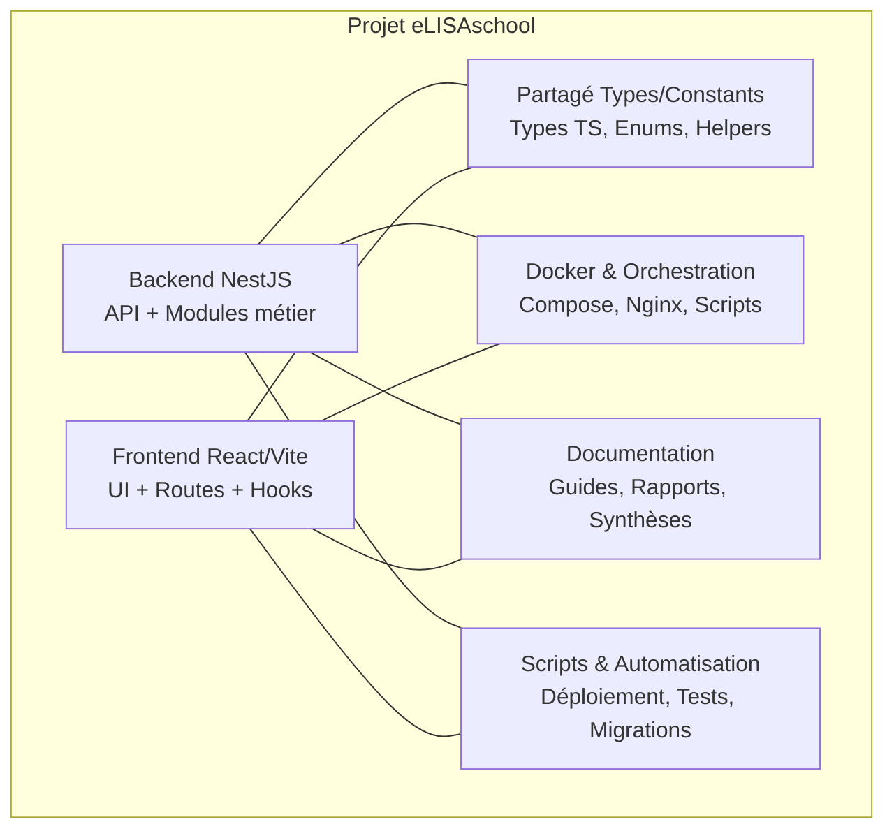
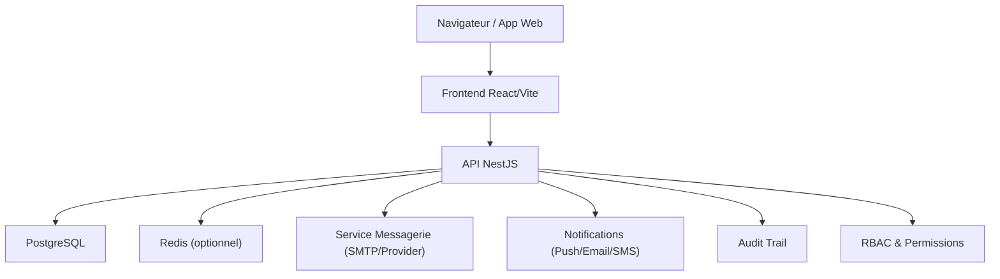
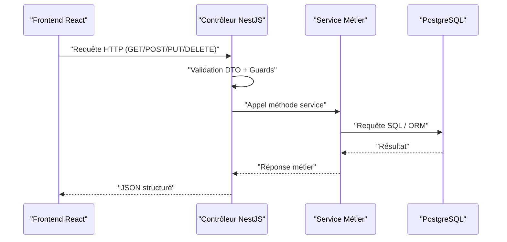
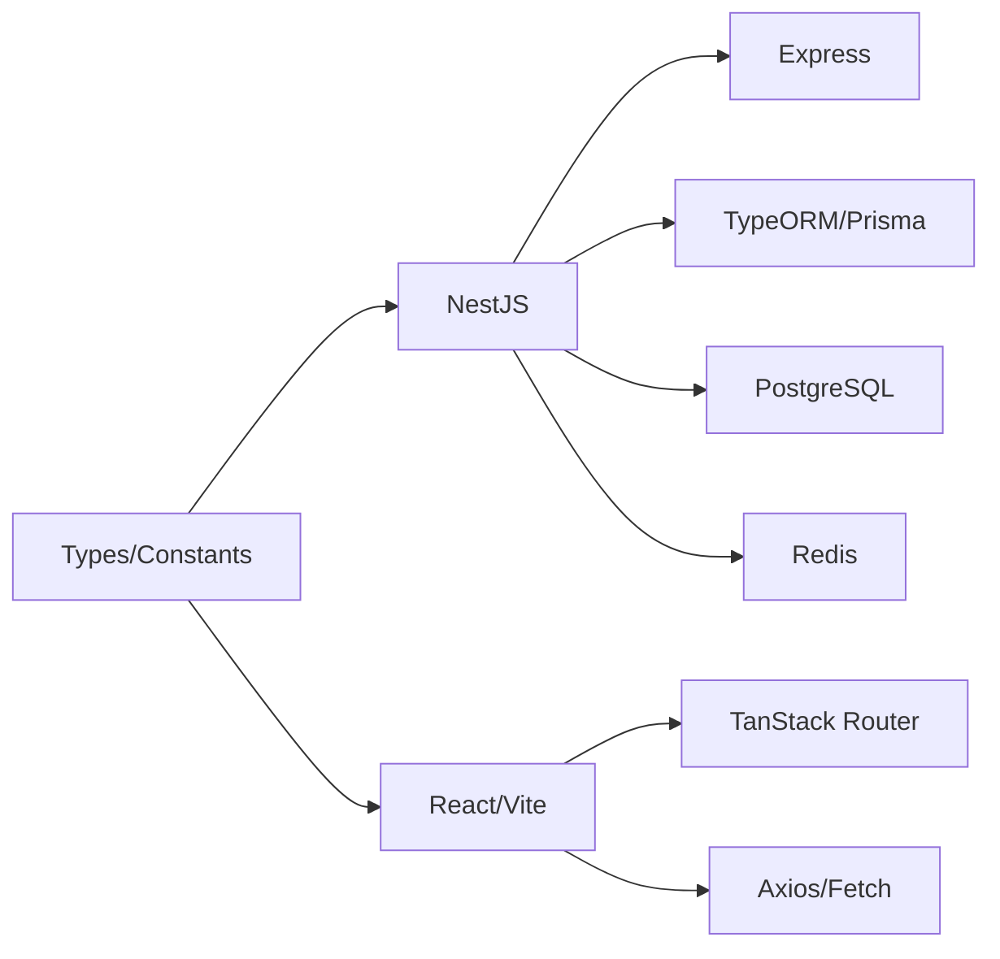

# Introduction et Vue d'Ensemble

<cite>
**Fichiers référencés dans ce document**
- [README.md](file://README.md)
- [package.json](file://backend/package.json)
- [index.ts](file://backend/src/index.ts)
- [app.ts](file://backend/src/app.ts)
- [docker-compose.yml](file://docker/docker-compose.yml)
- [QUICKSTART.md](file://QUICKSTART.md)
- [ANALYSE-CONTEXTE-AFRICAIN-CAMEROUN.md](file://docs/analyses/ANALYSE-CONTEXTE-AFRICAIN-CAMEROUN.md)
- [SYNTHESE-FINALE.md](file://docs/syntheses/SYNTHESE-FINALE.md)
- [RAPPORT-FINAL-MODULES-FRONTEND.md](file://docs/rapports/RAPPORT-FINAL-MODULES-FRONTEND.md)
- [GUIDE-DEVELOPPEMENT.md](file://docs/guides/GUIDE-DEVELOPPEMENT.md)
</cite>

## Table des matières
1. [Introduction](#introduction)
2. [Structure du projet](#structure-du-projet)
3. [Composants clés](#composants-clés)
4. [Vue d’ensemble de l’architecture](#vue-densemble-de-larchitecture)
5. [Analyse détaillée des composants](#analyse-detailee-des-composants)
6. [Analyse des dépendances](#analyse-des-dependances)
7. [Considérations de performance](#considerations-de-performance)
8. [Guide de dépannage](#guide-de-depannage)
9. [Conclusion](#conclusion)
10. [Annexes](#annexes)

## Introduction
eLISAschool est une plateforme de gestion scolaire conçue pour les établissements éducatifs, avec une attention particulière au contexte africain. Elle unifie la gestion académique, financière, des ressources humaines et organisationnelle autour d’une architecture moderne et modulaire. Le système s’adresse aux administrateurs d’établissements, aux enseignants, aux parents et aux équipes de direction, en leur offrant des outils intégrés pour piloter le quotidien scolaire, suivre les apprentissages, gérer les finances et optimiser l’organisation interne.

Les objectifs principaux sont :
- Centraliser les processus scolaires dans un seul système fiable et évolutif
- Adapter les fonctionnalités aux réalités locales (périodes scolaires, paiements, communication parents-école)
- Offrir une expérience utilisateur fluide sur navigateur, accessible depuis divers appareils
- Permettre une intégration aisée avec les infrastructures existantes (base de données, messagerie, notifications)

La valeur ajoutée par rapport aux solutions existantes réside dans sa conception modulaire, son adaptation au contexte africain, sa sécurité renforcée via RBAC, et sa capacité à évoluer sans refonte majeure grâce à une architecture micro-services légère et des migrations structurées.

**Section sources**
- [README.md](file://README.md)
- [ANALYSE-CONTEXTE-AFRICAIN-CAMEROUN.md](file://docs/analyses/ANALYSE-CONTEXTE-AFRICAIN-CAMEROUN.md)
- [SYNTHESE-FINALE.md](file://docs/syntheses/SYNTHESE-FINALE.md)

## Structure du projet
Le projet suit une architecture monorepo claire séparant backend, frontend, partage de types/constants, scripts de déploiement et documentation. Les répertoires principaux incluent :
- backend : API NestJS, modules métier, migrations, configuration, tests
- frontend : application React/Vite, routes, hooks, stores, features
- shared : types, constantes et utilitaires partagés entre frontend et backend
- docker : conteneurisation, orchestration, scripts de déploiement et maintenance
- docs : documentation technique, guides, rapports et synthèses
- scripts : automatisation, déploiement, vérifications et outils de développement

**Diagramme sources**
- [docker-compose.yml](file://docker/docker-compose.yml)
- [package.json](file://backend/package.json)

**Section sources**
- [package.json](file://backend/package.json)
- [docker-compose.yml](file://docker/docker-compose.yml)
- [GUIDE-DEVELOPPEMENT.md](file://docs/guides/GUIDE-DEVELOPPEMENT.md)

## Composants clés
- Backend NestJS : API RESTful, modules métier, contrôleurs, services, DTOs, guards, interceptors, middlewares, configuration, base de données PostgreSQL, migrations, seeds, tests unitaires et d’intégration
- Frontend React : UI moderne, routing TanStack Router, hooks personnalisés, stores, features par module, i18n, styles, exemples
- Base de données PostgreSQL : schéma normalisé, migrations versionnées, index de performance, vues matérialisées, triggers, séquences
- Docker : conteneurs backend/frontend, orchestration compose, volumes, réseaux, scripts de backup/restauration
- Documentation et scripts : guides d’installation, déploiement, migration, tests, audits, rapports de progression

Ces composants interagissent via des APIs REST sécurisées, des types partagés et des configurations centralisées, permettant une évolution indépendante et une maintenabilité accrue.

**Section sources**
- [index.ts](file://backend/src/index.ts)
- [app.ts](file://backend/src/app.ts)
- [QUICKSTART.md](file://QUICKSTART.md)

## Vue d’ensemble de l’architecture
L’architecture combine un backend NestJS modulaire avec un frontend React/Vite, communiquant via HTTP/REST. La base de données PostgreSQL stocke les entités métiers et les configurations. Docker assure la portabilité et la reproductibilité de l’environnement.

**Diagramme sources**
- [index.ts](file://backend/src/index.ts)
- [app.ts](file://backend/src/app.ts)
- [docker-compose.yml](file://docker/docker-compose.yml)

## Analyse détaillée des composants

### Backend NestJS
Le backend expose des endpoints REST organisés par modules (académique, finances, RH, organisation, etc.). Il utilise des contrôleurs pour les routes, des services pour la logique métier, des DTOs pour la validation, et des guards/interceptors pour la sécurité et le traitement transversal. La configuration centralisée gère la base de données, les environnements et Swagger.

Points forts :
- Modularité forte : chaque domaine métier est isolé et évolutif
- Sécurité : RBAC, permissions granulaires, audit trail
- Performance : index, vues matérialisées, pagination, cache optionnel
- Qualité : tests unitaires et d’intégration, linting, typage strict

Exemple de flux d’appel :

**Diagramme sources**
- [index.ts](file://backend/src/index.ts)
- [app.ts](file://backend/src/app.ts)

**Section sources**
- [index.ts](file://backend/src/index.ts)
- [app.ts](file://backend/src/app.ts)
- [package.json](file://backend/package.json)

### Frontend React/Vite
Le frontend propose une interface moderne avec routing, hooks personnalisés, stores d’état et features par module. Il communique avec l’API via des appels HTTP sécurisés et affiche les données sous forme de tableaux, formulaires et dashboards.

Points forts :
- Réactivité et modularité : composants réutilisables, hooks dédiés
- Expérience utilisateur : navigation fluide, thèmes, accessibilité
- Intégration API : typage partagé, gestion d’erreurs, chargements
- Développement : Vite, TypeScript, linting, tests

**Section sources**
- [QUICKSTART.md](file://QUICKSTART.md)
- [RAPPORT-FINAL-MODULES-FRONTEND.md](file://docs/rapports/RAPPORT-FINAL-MODULES-FRONTEND.md)

### Base de données PostgreSQL
Le schéma est structuré en tables liées, avec des migrations versionnées, des index pour la performance, et des triggers pour l’intégrité référentielle. Les vues matérialisées accélèrent les requêtes complexes.

Points forts :
- Évolutivité : migrations incrémentales, scripts de seed
- Performance : index composites, partitions, vues matérialisées
- Fiabilité : contraintes FK, transactions, backups automatisés

**Section sources**
- [docker-compose.yml](file://docker/docker-compose.yml)
- [QUICKSTART.md](file://QUICKSTART.md)

### Docker et Orchestration
Docker encapsule les services (backend, frontend, base de données, redis, nginx) avec des configurations reproductibles. Les scripts facilitent le déploiement local et cloud, les backups et restaurations.

Points forts :
- Portabilité : images standardisées, variables d’environnement
- Scalabilité : scaling horizontal, load balancing
- Maintenance : scripts de mise à jour, monitoring, logs

**Section sources**
- [docker-compose.yml](file://docker/docker-compose.yml)
- [QUICKSTART.md](file://QUICKSTART.md)

## Analyse des dépendances
Les dépendances principales incluent NestJS, Express, TypeORM/Prisma, PostgreSQL, Redis, React, Vite, TanStack Router, et des bibliothèques utilitaires. Les modules backend dépendent de services communs (auth, config, utils), tandis que le frontend importe des types et helpers partagés.

**Diagramme sources**
- [package.json](file://backend/package.json)
- [docker-compose.yml](file://docker/docker-compose.yml)

**Section sources**
- [package.json](file://backend/package.json)
- [docker-compose.yml](file://docker/docker-compose.yml)

## Considérations de performance
- Indexation stratégique : index composites sur colonnes fréquemment filtrées
- Vues matérialisées : pré-calcul de statistiques et agrégations
- Pagination : limitation de résultats côté serveur et client
- Cache : Redis pour sessions, tokens, données fréquentes
- Monitoring : métriques, logs structurés, alertes

[Pas de sources nécessaires car cette section fournit des conseils généraux]

## Guide de dépannage
Problèmes courants et résolutions :
- Connexion base de données : vérifier credentials, ports, réseau Docker
- Erreurs CORS : configurer allow-origin, methods, headers
- Permissions 403 : vérifier RBAC, rôles, permissions attribuées
- Performances lentes : analyser index, requêtes lentes, cache
- Déploiement échoué : vérifier logs, variables d’environnement, dépendances

**Section sources**
- [GUIDE-DEVELOPPEMENT.md](file://docs/guides/GUIDE-DEVELOPPEMENT.md)
- [QUICKSTART.md](file://QUICKSTART.md)

## Conclusion
eLISAschool offre une solution complète et adaptée pour la gestion scolaire en Afrique, combinant robustesse technique, modularité et expérience utilisateur. Son architecture moderne permet une évolution continue, une intégration facile et une maintenance simplifiée. Pour les établissements souhaitant digitaliser leurs processus, c’est un choix stratégique alliant fonctionnalités, sécurité et scalabilité.

[Pas de sources nécessaires car cette section résume sans analyser de fichiers spécifiques]

## Annexes
- Exemples d’utilisation : inscription élèves, suivi notes, gestion paie, planning cours
- Valeur ajoutée : adaptation locale, RBAC avancé, multi-tenant, audit trail
- Public cible : administrateurs, enseignants, parents, direction

[Pas de sources nécessaires car cette section est informative générale]