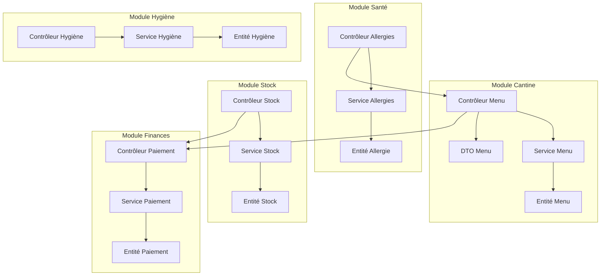
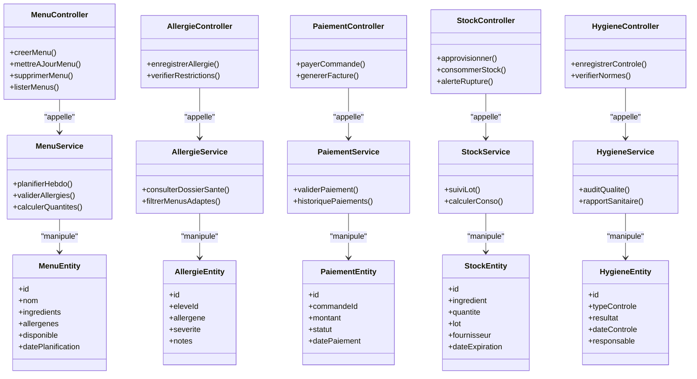
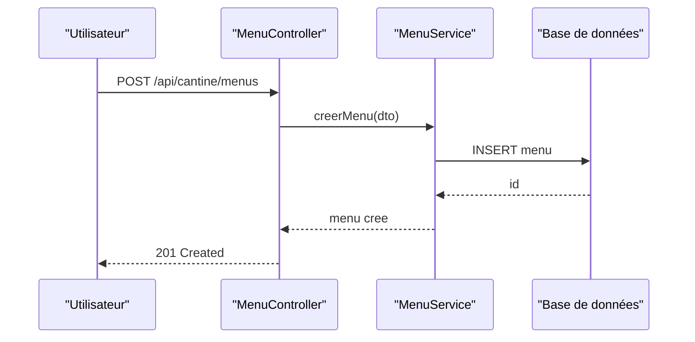
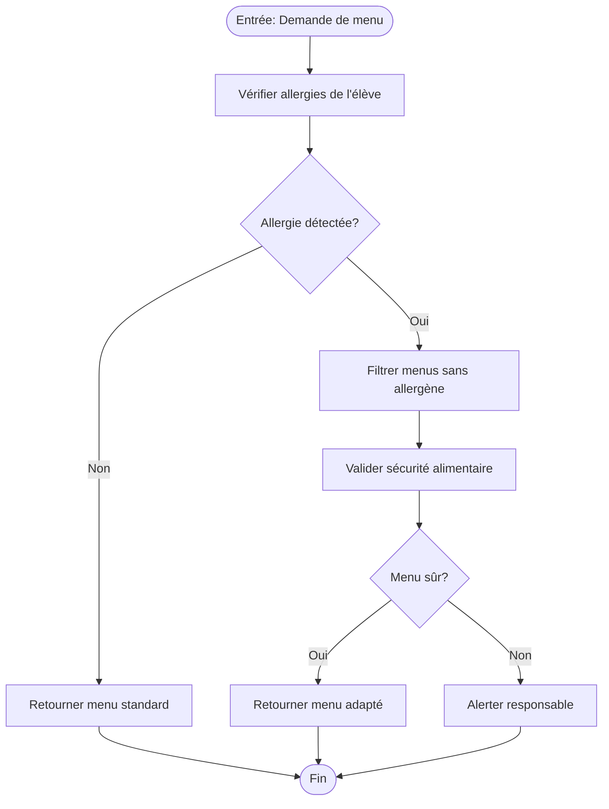
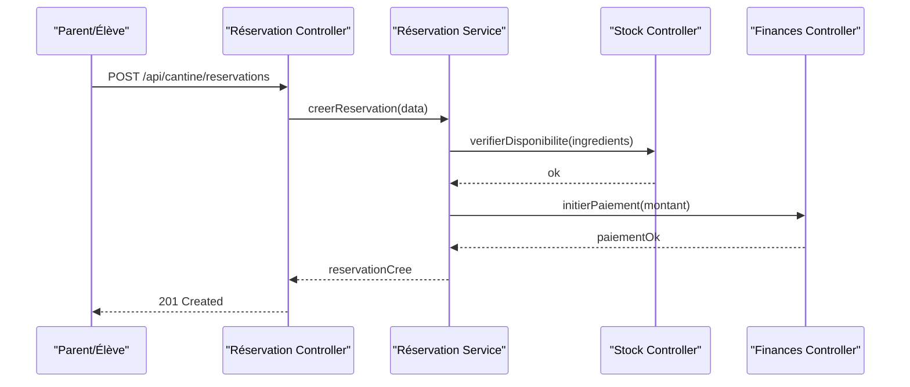
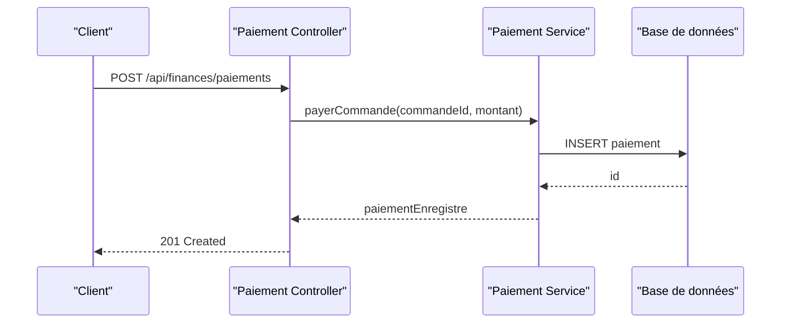
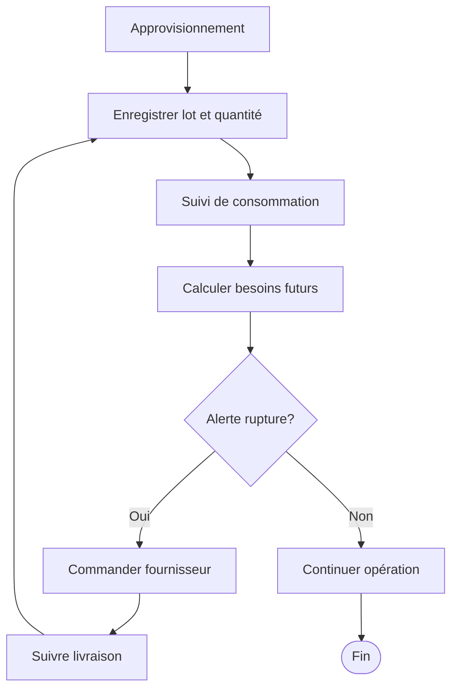
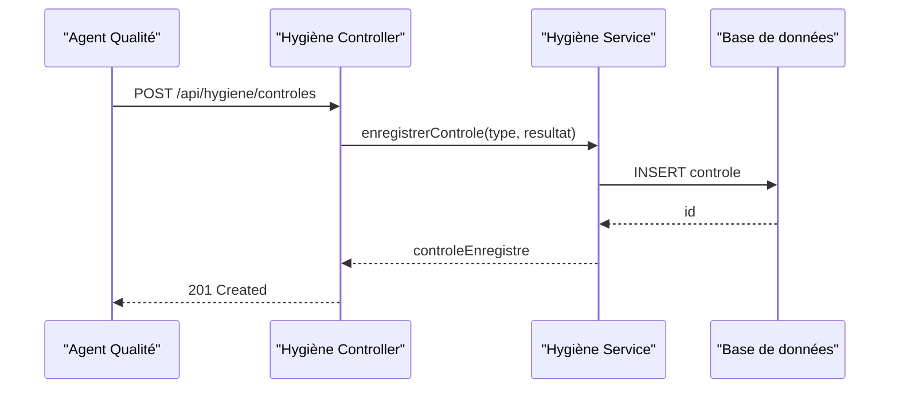
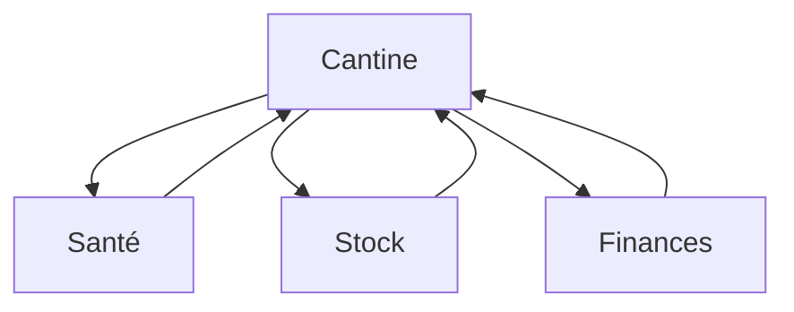

# Cantine et Restauration

<cite>
**Fichiers référencés dans ce document**
- [cantine/index.ts](file://backend/src/modules/cantine/index.ts)
- [cantine/controllers/menu.controller.ts](file://backend/src/modules/cantine/controllers/menu.controller.ts)
- [cantine/services/menu.service.ts](file://backend/src/modules/cantine/services/menu.service.ts)
- [cantine/entities/menu.entity.ts](file://backend/src/modules/cantine/entities/menu.entity.ts)
- [cantine/dto/menu.dto.ts](file://backend/src/modules/cantine/dto/menu.dto.ts)
- [cantine/migrations/050-cantine-menu.sql](file://backend/database/migrations/050-cantine-menu.sql)
- [finances/controllers/paiement.controller.ts](file://backend/src/modules/finances/controllers/paiement.controller.ts)
- [finances/services/paiement.service.ts](file://backend/src/modules/finances/services/paiement.service.ts)
- [finances/entities/paiement.entity.ts](file://backend/src/modules/finances/entities/paiement.entity.ts)
- [finances/migrations/010-module-finances.sql](file://backend/database/migrations/010-module-finances.sql)
- [sante/controllers/allergie.controller.ts](file://backend/src/modules/sante/controllers/allergie.controller.ts)
- [sante/services/allergie.service.ts](file://backend/src/modules/sante/services/allergie.service.ts)
- [sante/entities/allergie.entity.ts](file://backend/src/modules/sante/entities/allergie.entity.ts)
- [sante/migrations/032-sante.sql](file://backend/database/migrations/032-sante.sql)
- [stock/controllers/stock.controller.ts](file://backend/src/modules/stock/controllers/stock.controller.ts)
- [stock/services/stock.service.ts](file://backend/src/modules/stock/services/stock.service.ts)
- [stock/entities/stock.entity.ts](file://backend/src/modules/stock/entities/stock.entity.ts)
- [stock/migrations/060-stock-alimentaire.sql](file://backend/database/migrations/060-stock-alimentaire.sql)
- [hygiene/controllers/hygiene.controller.ts](file://backend/src/modules/hygiene/controllers/hygiene.controller.ts)
- [hygiene/services/hygiene.service.ts](file://backend/src/modules/hygiene/services/hygiene.service.ts)
- [hygiene/entities/hygiene.entity.ts](file://backend/src/modules/hygiene/entities/hygiene.entity.ts)
- [hygiene/migrations/070-hygiene-sanitaire.sql](file://backend/database/migrations/070-hygiene-sanitaire.sql)
</cite>

## Table des matières
1. [Introduction](#introduction)
2. [Structure du projet](#structure-du-projet)
3. [Composants principaux](#composants-principaux)
4. [Vue d'ensemble de l'architecture](#vue-densemble-de-larchitecture)
5. [Analyse détaillée des composants](#analyse-detaillee-des-composants)
6. [Analyse des dépendances](#analyse-des-dependances)
7. [Considérations de performance](#considerations-de-performance)
8. [Guide de dépannage](#guide-de-depannage)
9. [Conclusion](#conclusion)
10. [Annexes](#annexes)

## Introduction
Ce document présente la documentation complète du module de cantine et restauration d'eLISAschool. Il couvre la gestion des menus, les régimes alimentaires spéciaux, les réservations de repas, les paiements, ainsi que les workflows de commande, préparation, distribution et gestion des stocks alimentaires. Il inclut également les intégrations avec le système financier pour la facturation, les livraisons fournisseurs, la traçabilité alimentaire, la gestion des déchets, l’hygiène alimentaire et les normes sanitaires. L’objectif est de fournir une vision claire et accessible aux utilisateurs techniques et non techniques.

## Structure du projet
Le module cantine s’intègre dans l’architecture modulaire du backend eLISAschool. Les entités, services, contrôleurs et DTOs sont organisés par fonctionnalité (menus, allergies, stock, hygiène), tandis que les migrations SQL définissent le schéma de base de données. Le module finances gère les paiements et la facturation liés aux commandes de repas.

**Sources du diagramme**
- [cantine/controllers/menu.controller.ts](file://backend/src/modules/cantine/controllers/menu.controller.ts)
- [cantine/services/menu.service.ts](file://backend/src/modules/cantine/services/menu.service.ts)
- [cantine/entities/menu.entity.ts](file://backend/src/modules/cantine/entities/menu.entity.ts)
- [cantine/dto/menu.dto.ts](file://backend/src/modules/cantine/dto/menu.dto.ts)
- [sante/controllers/allergie.controller.ts](file://backend/src/modules/sante/controllers/allergie.controller.ts)
- [sante/services/allergie.service.ts](file://backend/src/modules/sante/services/allergie.service.ts)
- [sante/entities/allergie.entity.ts](file://backend/src/modules/sante/entities/allergie.entity.ts)
- [stock/controllers/stock.controller.ts](file://backend/src/modules/stock/controllers/stock.controller.ts)
- [stock/services/stock.service.ts](file://backend/src/modules/stock/services/stock.service.ts)
- [stock/entities/stock.entity.ts](file://backend/src/modules/stock/entities/stock.entity.ts)
- [hygiene/controllers/hygiene.controller.ts](file://backend/src/modules/hygiene/controllers/hygiene.controller.ts)
- [hygiene/services/hygiene.service.ts](file://backend/src/modules/hygiene/services/hygiene.service.ts)
- [hygiene/entities/hygiene.entity.ts](file://backend/src/modules/hygiene/entities/hygiene.entity.ts)
- [finances/controllers/paiement.controller.ts](file://backend/src/modules/finances/controllers/paiement.controller.ts)
- [finances/services/paiement.service.ts](file://backend/src/modules/finances/services/paiement.service.ts)
- [finances/entities/paiement.entity.ts](file://backend/src/modules/finances/entities/paiement.entity.ts)

**Sources de section**
- [cantine/index.ts](file://backend/src/modules/cantine/index.ts)

## Composants principaux
- Gestion des menus: définition des plats, planification hebdomadaire, restrictions alimentaires, et disponibilité.
- Régimes alimentaires spéciaux: enregistrement des allergies et préférences, validation des menus adaptés.
- Réservations de repas: création, modification, annulation, et suivi des commandes par élève ou groupe.
- Paiements et facturation: intégration avec le module finances pour générer les factures et enregistrer les paiements.
- Gestion des stocks: suivi des ingrédients, approvisionnement fournisseur, consommation et alertes de rupture.
- Traçabilité alimentaire: historique des lots, fournisseurs, et conformité sanitaire.
- Hygiène et normes: enregistrements de contrôles, protocoles, et audits qualité.

**Sources de section**
- [cantine/entities/menu.entity.ts](file://backend/src/modules/cantine/entities/menu.entity.ts)
- [cantine/dto/menu.dto.ts](file://backend/src/modules/cantine/dto/menu.dto.ts)
- [sante/entities/allergie.entity.ts](file://backend/src/modules/sante/entities/allergie.entity.ts)
- [finances/entities/paiement.entity.ts](file://backend/src/modules/finances/entities/paiement.entity.ts)
- [stock/entities/stock.entity.ts](file://backend/src/modules/stock/entities/stock.entity.ts)
- [hygiene/entities/hygiene.entity.ts](file://backend/src/modules/hygiene/entities/hygiene.entity.ts)

## Vue d'ensemble de l'architecture
L’architecture suit un modèle MVC (Modèle-Vue-Contrôleur) avec des services encapsulant la logique métier. Les contrôleurs exposent les endpoints API, les services orchestrent les opérations, et les entités représentent les structures de données persistées via les migrations SQL.

**Sources du diagramme**
- [cantine/controllers/menu.controller.ts](file://backend/src/modules/cantine/controllers/menu.controller.ts)
- [cantine/services/menu.service.ts](file://backend/src/modules/cantine/services/menu.service.ts)
- [cantine/entities/menu.entity.ts](file://backend/src/modules/cantine/entities/menu.entity.ts)
- [sante/controllers/allergie.controller.ts](file://backend/src/modules/sante/controllers/allergie.controller.ts)
- [sante/services/allergie.service.ts](file://backend/src/modules/sante/services/allergie.service.ts)
- [sante/entities/allergie.entity.ts](file://backend/src/modules/sante/entities/allergie.entity.ts)
- [finances/controllers/paiement.controller.ts](file://backend/src/modules/finances/controllers/paiement.controller.ts)
- [finances/services/paiement.service.ts](file://backend/src/modules/finances/services/paiement.service.ts)
- [finances/entities/paiement.entity.ts](file://backend/src/modules/finances/entities/paiement.entity.ts)
- [stock/controllers/stock.controller.ts](file://backend/src/modules/stock/controllers/stock.controller.ts)
- [stock/services/stock.service.ts](file://backend/src/modules/stock/services/stock.service.ts)
- [stock/entities/stock.entity.ts](file://backend/src/modules/stock/entities/stock.entity.ts)
- [hygiene/controllers/hygiene.controller.ts](file://backend/src/modules/hygiene/controllers/hygiene.controller.ts)
- [hygiene/services/hygiene.service.ts](file://backend/src/modules/hygiene/services/hygiene.service.ts)
- [hygiene/entities/hygiene.entity.ts](file://backend/src/modules/hygiene/entities/hygiene.entity.ts)

## Analyse détaillée des composants

### Gestion des menus et planification hebdomadaire
Les contrôleurs et services de menu permettent de créer, mettre à jour, supprimer et lister les menus. La planification hebdomadaire intègre les allergènes et les restrictions alimentaires.

**Sources du diagramme**
- [cantine/controllers/menu.controller.ts](file://backend/src/modules/cantine/controllers/menu.controller.ts)
- [cantine/services/menu.service.ts](file://backend/src/modules/cantine/services/menu.service.ts)
- [cantine/entities/menu.entity.ts](file://backend/src/modules/cantine/entities/menu.entity.ts)
- [cantine/migrations/050-cantine-menu.sql](file://backend/database/migrations/050-cantine-menu.sql)

**Sources de section**
- [cantine/controllers/menu.controller.ts](file://backend/src/modules/cantine/controllers/menu.controller.ts)
- [cantine/services/menu.service.ts](file://backend/src/modules/cantine/services/menu.service.ts)
- [cantine/entities/menu.entity.ts](file://backend/src/modules/cantine/entities/menu.entity.ts)
- [cantine/dto/menu.dto.ts](file://backend/src/modules/cantine/dto/menu.dto.ts)
- [cantine/migrations/050-cantine-menu.sql](file://backend/database/migrations/050-cantine-menu.sql)

### Régimes alimentaires spéciaux et allergies
Le module santé gère les allergies et préférences alimentaires. Les services vérifient les restrictions et filtrent les menus adaptés.

**Sources du diagramme**
- [sante/controllers/allergie.controller.ts](file://backend/src/modules/sante/controllers/allergie.controller.ts)
- [sante/services/allergie.service.ts](file://backend/src/modules/sante/services/allergie.service.ts)
- [sante/entities/allergie.entity.ts](file://backend/src/modules/sante/entities/allergie.entity.ts)
- [sante/migrations/032-sante.sql](file://backend/database/migrations/032-sante.sql)

**Sources de section**
- [sante/controllers/allergie.controller.ts](file://backend/src/modules/sante/controllers/allergie.controller.ts)
- [sante/services/allergie.service.ts](file://backend/src/modules/sante/services/allergie.service.ts)
- [sante/entities/allergie.entity.ts](file://backend/src/modules/sante/entities/allergie.entity.ts)
- [sante/migrations/032-sante.sql](file://backend/database/migrations/032-sante.sql)

### Réservations de repas et workflow de commande
La réservation de repas implique la création d’une commande, la validation des disponibilités, et la coordination avec le stock et les paiements.

**Sources du diagramme**
- [cantine/controllers/menu.controller.ts](file://backend/src/modules/cantine/controllers/menu.controller.ts)
- [stock/controllers/stock.controller.ts](file://backend/src/modules/stock/controllers/stock.controller.ts)
- [finances/controllers/paiement.controller.ts](file://backend/src/modules/finances/controllers/paiement.controller.ts)

**Sources de section**
- [cantine/controllers/menu.controller.ts](file://backend/src/modules/cantine/controllers/menu.controller.ts)
- [stock/controllers/stock.controller.ts](file://backend/src/modules/stock/controllers/stock.controller.ts)
- [finances/controllers/paiement.controller.ts](file://backend/src/modules/finances/controllers/paiement.controller.ts)

### Intégration financière: facturation et paiements
Le module finances enregistre les paiements et génère les factures liées aux commandes de repas.

**Sources du diagramme**
- [finances/controllers/paiement.controller.ts](file://backend/src/modules/finances/controllers/paiement.controller.ts)
- [finances/services/paiement.service.ts](file://backend/src/modules/finances/services/paiement.service.ts)
- [finances/entities/paiement.entity.ts](file://backend/src/modules/finances/entities/paiement.entity.ts)
- [finances/migrations/010-module-finances.sql](file://backend/database/migrations/010-module-finances.sql)

**Sources de section**
- [finances/controllers/paiement.controller.ts](file://backend/src/modules/finances/controllers/paiement.controller.ts)
- [finances/services/paiement.service.ts](file://backend/src/modules/finances/services/paiement.service.ts)
- [finances/entities/paiement.entity.ts](file://backend/src/modules/finances/entities/paiement.entity.ts)
- [finances/migrations/010-module-finances.sql](file://backend/database/migrations/010-module-finances.sql)

### Gestion des stocks alimentaires et livraison fournisseur
Le module stock permet de suivre les ingrédients, les lots, les fournisseurs, et de gérer les alertes de rupture.

**Sources du diagramme**
- [stock/controllers/stock.controller.ts](file://backend/src/modules/stock/controllers/stock.controller.ts)
- [stock/services/stock.service.ts](file://backend/src/modules/stock/services/stock.service.ts)
- [stock/entities/stock.entity.ts](file://backend/src/modules/stock/entities/stock.entity.ts)
- [stock/migrations/060-stock-alimentaire.sql](file://backend/database/migrations/060-stock-alimentaire.sql)

**Sources de section**
- [stock/controllers/stock.controller.ts](file://backend/src/modules/stock/controllers/stock.controller.ts)
- [stock/services/stock.service.ts](file://backend/src/modules/stock/services/stock.service.ts)
- [stock/entities/stock.entity.ts](file://backend/src/modules/stock/entities/stock.entity.ts)
- [stock/migrations/060-stock-alimentaire.sql](file://backend/database/migrations/060-stock-alimentaire.sql)

### Hygiène alimentaire et normes sanitaires
Le module hygiène enregistre les contrôles, vérifie les normes, et produit des rapports sanitaires.

**Sources du diagramme**
- [hygiene/controllers/hygiene.controller.ts](file://backend/src/modules/hygiene/controllers/hygiene.controller.ts)
- [hygiene/services/hygiene.service.ts](file://backend/src/modules/hygiene/services/hygiene.service.ts)
- [hygiene/entities/hygiene.entity.ts](file://backend/src/modules/hygiene/entities/hygiene.entity.ts)
- [hygiene/migrations/070-hygiene-sanitaire.sql](file://backend/database/migrations/070-hygiene-sanitaire.sql)

**Sources de section**
- [hygiene/controllers/hygiene.controller.ts](file://backend/src/modules/hygiene/controllers/hygiene.controller.ts)
- [hygiene/services/hygiene.service.ts](file://backend/src/modules/hygiene/services/hygiene.service.ts)
- [hygiene/entities/hygiene.entity.ts](file://backend/src/modules/hygiene/entities/hygiene.entity.ts)
- [hygiene/migrations/070-hygiene-sanitaire.sql](file://backend/database/migrations/070-hygiene-sanitaire.sql)

## Analyse des dépendances
Les modules interagissent via des appels de contrôleurs et de services. Les dépendances critiques incluent l’intégration entre cantine, santé, stock, et finances.

**Sources du diagramme**
- [cantine/controllers/menu.controller.ts](file://backend/src/modules/cantine/controllers/menu.controller.ts)
- [sante/controllers/allergie.controller.ts](file://backend/src/modules/sante/controllers/allergie.controller.ts)
- [stock/controllers/stock.controller.ts](file://backend/src/modules/stock/controllers/stock.controller.ts)
- [finances/controllers/paiement.controller.ts](file://backend/src/modules/finances/controllers/paiement.controller.ts)

**Sources de section**
- [cantine/index.ts](file://backend/src/modules/cantine/index.ts)

## Considérations de performance
- Indexation des tables critiques pour les requêtes fréquentes (menus, paiements, stock).
- Mise en cache des menus hebdomadaires pour réduire la charge serveur.
- Validation asynchrone des allergies pour éviter les blocages lors des créations de commandes.
- Optimisation des transactions lors des mises à jour de stock et des paiements.

[Pas de sources nécessaires car cette section fournit des conseils généraux]

## Guide de dépannage
- Erreurs de validation des allergies: vérifier les dossiers santé et les filtres de menus.
- Problèmes de paiement: examiner les logs de transaction et les statuts de paiement.
- Ruptures de stock: surveiller les alertes et les commandes fournisseurs.
- Non-conformité hygiène: consulter les rapports de contrôle et les actions correctives.

**Sources de section**
- [sante/controllers/allergie.controller.ts](file://backend/src/modules/sante/controllers/allergie.controller.ts)
- [finances/controllers/paiement.controller.ts](file://backend/src/modules/finances/controllers/paiement.controller.ts)
- [stock/controllers/stock.controller.ts](file://backend/src/modules/stock/controllers/stock.controller.ts)
- [hygiene/controllers/hygiene.controller.ts](file://backend/src/modules/hygiene/controllers/hygiene.controller.ts)

## Conclusion
Le module de cantine et restauration d’eLISAschool offre une solution complète pour la gestion des menus, régimes spéciaux, réservations, paiements, stocks, et hygiène. Son architecture modulaire facilite l’intégration et la maintenance, tout en garantissant la sécurité alimentaire et la conformité sanitaire.

[Pas de sources nécessaires car cette section résume sans analyser de fichiers spécifiques]

## Annexes
- Exemples de configuration des menus hebdomadaires: utiliser les DTOs et services de menu pour planifier les repas.
- Statistiques de consommation: exploiter les données de stock et de commandes pour générer des rapports.
- Traçabilité alimentaire: suivre les lots et fournisseurs via le module stock.

[Pas de sources nécessaires car cette section fournit des informations générales]