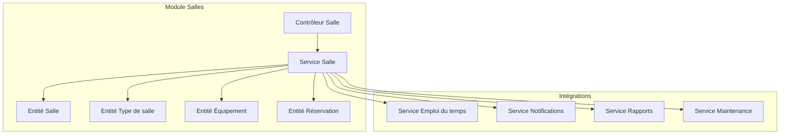
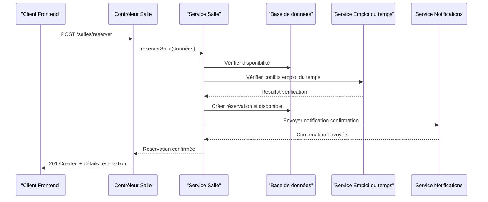
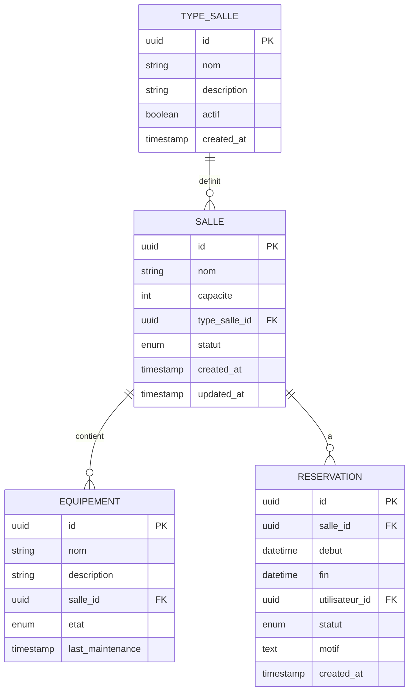
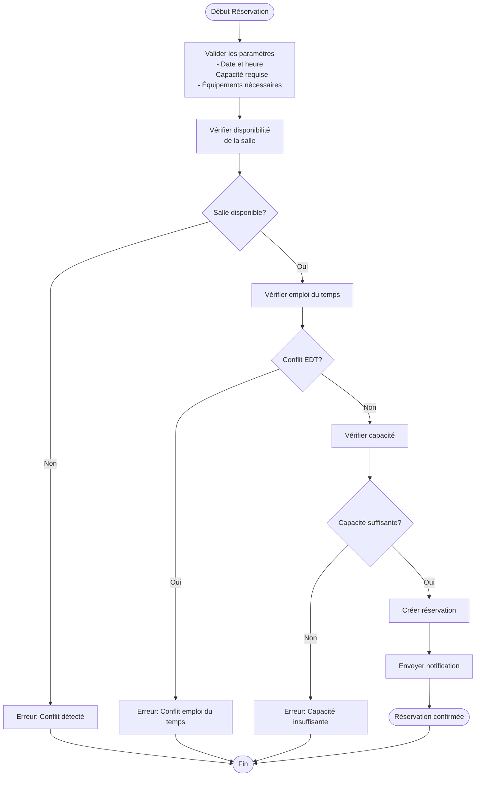
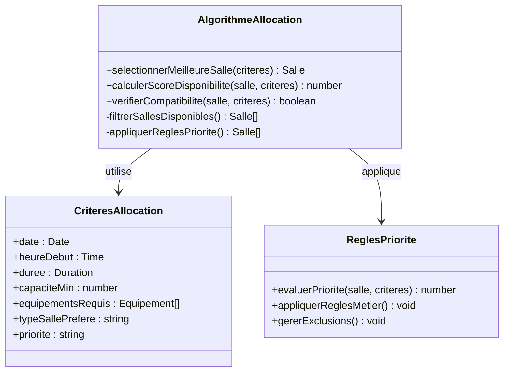
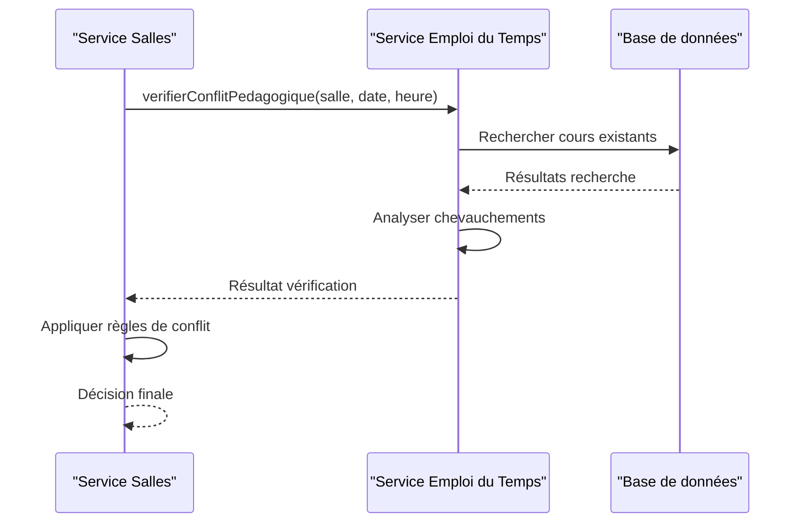
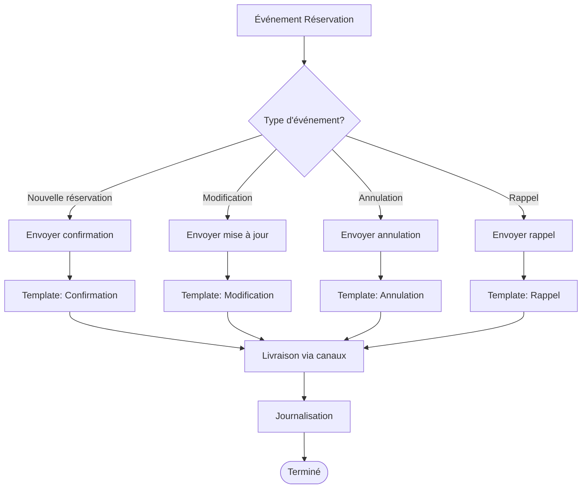
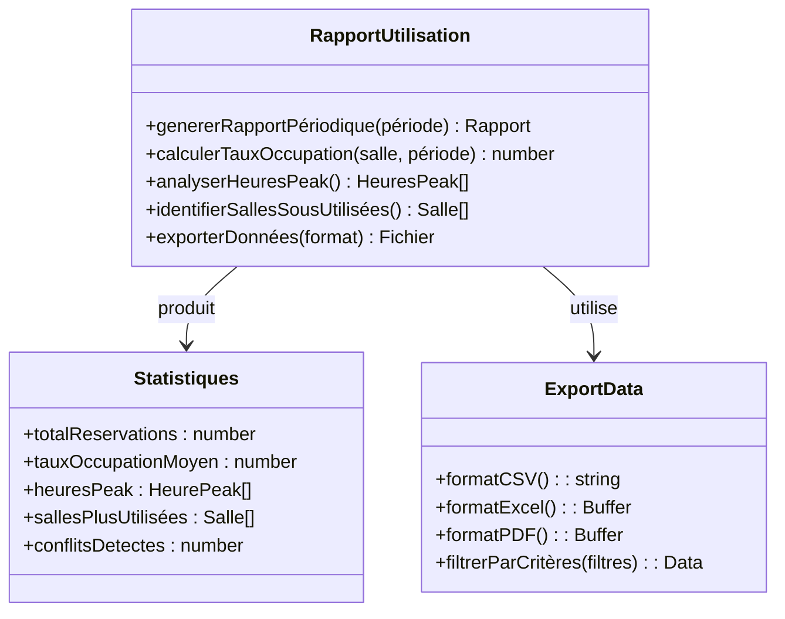
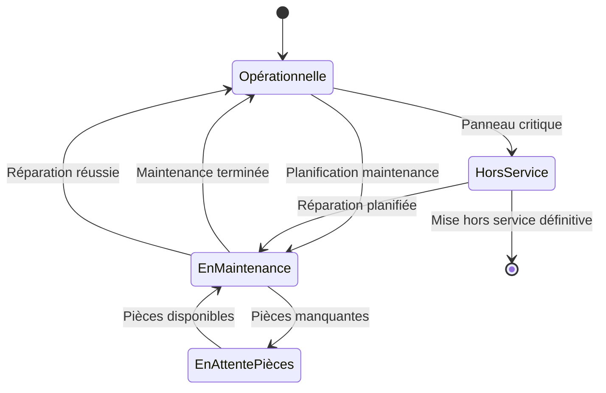
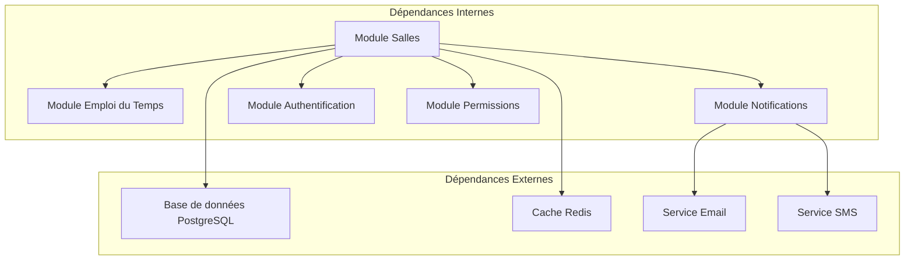

# Gestion des Salles et Équipements

<cite>
**Fichiers référencés dans ce document**
- [070-module-salles.sql](file://backend/database/migrations/070-module-salles.sql)
- [108-refonte-salle-principale.sql](file://backend/database/migrations/108-refonte-salle-principale.sql)
- [route-registry.ts](file://backend/src/routes/route-registry.ts)
- [index.ts](file://backend/src/modules/salles/index.ts)
- [salle.controller.ts](file://backend/src/modules/salles/controllers/salle.controller.ts)
- [salle.service.ts](file://backend/src/modules/salles/services/salle.service.ts)
- [salle.entity.ts](file://backend/src/modules/salles/entities/salle.entity.ts)
- [type-salle.entity.ts](file://backend/src/modules/salles/entities/type-salle.entity.ts)
- [equipement.entity.ts](file://backend/src/modules/salles/entities/equipement.entity.ts)
- [reservation.entity.ts](file://backend/src/modules/salles/entities/reservation.entity.ts)
- [emploi-du-temps.service.ts](file://backend/src/modules/emploi-du-temps/services/emploi-du-temps.service.ts)
- [notifications.service.ts](file://backend/src/modules/notifications/services/notifications.service.ts)
- [maintenance.service.ts](file://backend/src/modules/salles/services/maintenance.service.ts)
- [rapports.service.ts](file://backend/src/modules/salles/services/rapports.service.ts)
- [deploy-salles.sh](file://scripts/deploy-salles.sh)
- [test-salles-api.sh](file://scripts/test-salles-api.sh)
</cite>

## Table des matières
1. [Introduction](#introduction)
2. [Structure du projet](#structure-du-projet)
3. [Composants principaux](#composants-principaux)
4. [Vue d'ensemble de l'architecture](#vue-densemble-de-larchitecture)
5. [Analyse détaillée des composants](#analyse-detaillee-des-composants)
6. [Analyse des dépendances](#analyse-des-dependances)
7. [Considérations de performance](#considerations-de-performance)
8. [Guide de dépannage](#guide-de-depannage)
9. [Conclusion](#conclusion)
10. [Annexes](#annexes)

## Introduction
Ce document présente le module de gestion des salles et équipements d'eLISAschool. Il couvre les entités Salle, Type de salle, Capacité, Équipements associés, et Calendrier d'utilisation. Il explique les workflows de réservation, la détection de conflits, l'allocation automatique, la gestion des disponibilités, ainsi que les intégrations avec l'emploi du temps, les rapports d'utilisation et les fonctionnalités de maintenance préventive. Des exemples de configuration des types de salles (classes, laboratoires, salles polyvalentes), les règles de priorité de réservation et les notifications automatiques sont également fournis.

## Structure du projet
Le module salles est implémenté dans le backend sous forme de module NestJS avec ses propres entités, services, contrôleurs et migrations SQL. Les fichiers clés incluent:
- Migrations SQL pour la création et évolution du schéma des salles et réservations
- Entités TypeScript définissant les modèles de données
- Services encapsulant la logique métier (réservation, disponibilité, allocation, rapports, maintenance)
- Contrôleurs exposant les endpoints REST
- Registre de routes assurant l'enregistrement des routes du module
- Scripts de déploiement et tests spécifiques au module

**Sources de diagramme**
- [salle.controller.ts](file://backend/src/modules/salles/controllers/salle.controller.ts)
- [salle.service.ts](file://backend/src/modules/salles/services/salle.service.ts)
- [salle.entity.ts](file://backend/src/modules/salles/entities/salle.entity.ts)
- [type-salle.entity.ts](file://backend/src/modules/salles/entities/type-salle.entity.ts)
- [equipement.entity.ts](file://backend/src/modules/salles/entities/equipement.entity.ts)
- [reservation.entity.ts](file://backend/src/modules/salles/entities/reservation.entity.ts)
- [emploi-du-temps.service.ts](file://backend/src/modules/emploi-du-temps/services/emploi-du-temps.service.ts)
- [notifications.service.ts](file://backend/src/modules/notifications/services/notifications.service.ts)
- [maintenance.service.ts](file://backend/src/modules/salles/services/maintenance.service.ts)
- [rapports.service.ts](file://backend/src/modules/salles/services/rapports.service.ts)

**Sources de section**
- [index.ts](file://backend/src/modules/salles/index.ts)
- [route-registry.ts](file://backend/src/routes/route-registry.ts)

## Composants principaux
Le module comprend les composants suivants:
- **Entité Salle**: représente une salle physique avec ses attributs (nom, capacité, type, état, etc.)
- **Entité Type de salle**: définit les catégories de salles (classe, laboratoire, salle polyvalente, etc.)
- **Entité Équipement**: associe des équipements matériels aux salles
- **Entité Réservation**: gère les créneaux horaires réservés pour chaque salle
- **Service Salle**: orchestre les opérations CRUD, la validation des réservations, la détection de conflits et l'allocation automatique
- **Contrôleur Salle**: expose les API REST pour la gestion des salles et réservations
- **Services d'intégration**: emploi du temps, notifications, rapports et maintenance

**Sources de section**
- [salle.entity.ts](file://backend/src/modules/salles/entities/salle.entity.ts)
- [type-salle.entity.ts](file://backend/src/modules/salles/entities/type-salle.entity.ts)
- [equipement.entity.ts](file://backend/src/modules/salles/entities/equipement.entity.ts)
- [reservation.entity.ts](file://backend/src/modules/salles/entities/reservation.entity.ts)
- [salle.service.ts](file://backend/src/modules/salles/services/salle.service.ts)
- [salle.controller.ts](file://backend/src/modules/salles/controllers/salle.controller.ts)

## Vue d'ensemble de l'architecture
L'architecture du module suit un pattern MVC (Modèle-Vue-Contrôleur) avec une séparation claire entre les couches de données, de logique métier et d'exposition API.

**Sources de diagramme**
- [salle.controller.ts](file://backend/src/modules/salles/controllers/salle.controller.ts)
- [salle.service.ts](file://backend/src/modules/salles/services/salle.service.ts)
- [emploi-du-temps.service.ts](file://backend/src/modules/emploi-du-temps/services/emploi-du-temps.service.ts)
- [notifications.service.ts](file://backend/src/modules/notifications/services/notifications.service.ts)

## Analyse détaillée des composants

### Entités et Modèle de Données
Les entités définissent la structure des données du module avec leurs relations et contraintes.

**Sources de diagramme**
- [salle.entity.ts](file://backend/src/modules/salles/entities/salle.entity.ts)
- [type-salle.entity.ts](file://backend/src/modules/salles/entities/type-salle.entity.ts)
- [equipement.entity.ts](file://backend/src/modules/salles/entities/equipement.entity.ts)
- [reservation.entity.ts](file://backend/src/modules/salles/entities/reservation.entity.ts)

**Sources de section**
- [070-module-salles.sql](file://backend/database/migrations/070-module-salles.sql)
- [108-refonte-salle-principale.sql](file://backend/database/migrations/108-refonte-salle-principale.sql)

### Workflow de Réservation et Détection de Conflits
Le processus de réservation implique plusieurs étapes de validation et de vérification.

**Sources de diagramme**
- [salle.service.ts](file://backend/src/modules/salles/services/salle.service.ts)

**Sources de section**
- [salle.service.ts](file://backend/src/modules/salles/services/salle.service.ts)

### Allocation Automatique des Salles
L'allocation automatique utilise des critères de sélection basés sur les préférences et les contraintes.

**Sources de diagramme**
- [salle.service.ts](file://backend/src/modules/salles/services/salle.service.ts)

**Sources de section**
- [salle.service.ts](file://backend/src/modules/salles/services/salle.service.ts)

### Intégration avec l'Emploi du Temps
Le module salles communique avec le module emploi du temps pour éviter les conflits pédagogiques.

**Sources de diagramme**
- [emploi-du-temps.service.ts](file://backend/src/modules/emploi-du-temps/services/emploi-du-temps.service.ts)
- [salle.service.ts](file://backend/src/modules/salles/services/salle.service.ts)

**Sources de section**
- [emploi-du-temps.service.ts](file://backend/src/modules/emploi-du-temps/services/emploi-du-temps.service.ts)

### Notifications Automatiques
Le système envoie des notifications automatiques pour les événements importants liés aux réservations.

**Sources de diagramme**
- [notifications.service.ts](file://backend/src/modules/notifications/services/notifications.service.ts)

**Sources de section**
- [notifications.service.ts](file://backend/src/modules/notifications/services/notifications.service.ts)

### Rapports d'Utilisation
Le module génère des rapports statistiques sur l'utilisation des salles.

**Sources de diagramme**
- [rapports.service.ts](file://backend/src/modules/salles/services/rapports.service.ts)

**Sources de section**
- [rapports.service.ts](file://backend/src/modules/salles/services/rapports.service.ts)

### Maintenance Préventive
Le système de maintenance permet de planifier et suivre la maintenance des équipements et salles.

**Sources de diagramme**
- [maintenance.service.ts](file://backend/src/modules/salles/services/maintenance.service.ts)

**Sources de section**
- [maintenance.service.ts](file://backend/src/modules/salles/services/maintenance.service.ts)

## Analyse des dépendances
Le module salles dépend de plusieurs autres modules et services pour fonctionner correctement.

**Sources de diagramme**
- [index.ts](file://backend/src/modules/salles/index.ts)
- [route-registry.ts](file://backend/src/routes/route-registry.ts)

**Sources de section**
- [index.ts](file://backend/src/modules/salles/index.ts)
- [route-registry.ts](file://backend/src/routes/route-registry.ts)

## Considérations de performance
Pour optimiser les performances du module de gestion des salles:

### Optimisations Base de Données
- Indexation composite sur les colonnes de date et heure pour les requêtes de disponibilité
- Partitionnement des tables de réservation par période
- Vues matérialisées pour les statistiques d'utilisation
- Cache Redis pour les données de disponibilité fréquemment consultées

### Optimisations Algorithmiques
- Algorithmes de détection de conflits en O(n log n) utilisant des arbres intervalles
- Mémoïsation des résultats de vérification de disponibilité
- Traitement asynchrone des notifications et rapports
- Batch processing pour les opérations de maintenance

### Scalabilité
- Architecture microservices permettant le scaling horizontal
- File d'attente pour les tâches lourdes (génération de rapports)
- Load balancing entre instances de service
- Monitoring et alerting proactifs

## Guide de dépannage

### Problèmes Courants de Réservation
- **Conflits de dates/heures**: Vérifier les index de base de données et les caches
- **Erreurs de capacité**: Valider les seuils de capacité configurés
- **Problèmes de permissions**: Vérifier les rôles RBAC et les permissions d'accès

### Diagnostic des Performances
- Surveiller les temps de réponse des endpoints de réservation
- Analyser les requêtes SQL lentes avec EXPLAIN ANALYZE
- Monitorer l'utilisation du cache Redis
- Vérifier les files d'attente des tâches asynchrones

### Procédures de Récupération
- Restauration des données depuis les backups automatisés
- Réinitialisation des caches en cas de corruption
- Rebuild des index de base de données
- Redémarrage contrôlé des services

**Sources de section**
- [test-salles-api.sh](file://scripts/test-salles-api.sh)
- [deploy-salles.sh](file://scripts/deploy-salles.sh)

## Conclusion
Le module de gestion des salles et équipements d'eLISAschool offre une solution complète et robuste pour la planification et l'allocation des ressources spatiales. Grâce à son architecture modulaire, ses algorithmes d'optimisation avancés et ses intégrations avec les autres modules du système, il permet une gestion efficace des salles tout en garantissant la cohérence avec l'emploi du temps pédagogique. Les fonctionnalités de maintenance préventive, de reporting et de notifications automatisées en font un outil essentiel pour l'administration scolaire moderne.

## Annexes

### Configuration des Types de Salles
Exemples de configuration pour différents types de salles:

#### Classes
- Capacité typique: 25-35 élèves
- Équipements: tableau, projecteur, sonorisation
- Priorité: haute pour les cours réguliers

#### Laboratoires
- Capacité: 20-25 personnes
- Équipements: postes informatiques, matériel scientifique
- Contraintes: accès restreint, ventilation spécifique

#### Salles Polyvalentes
- Capacité variable: 50-200 personnes
- Équipements modulables, scène, éclairage scénique
- Usage: réunions, cérémonies, événements

### Règles de Priorité de Réservation
1. **Cours obligatoires** > Cours optionnels
2. **Examens nationaux** > Examens internes
3. **Urgences administratives** > Planifications régulières
4. **Salles spécialisées** > Salles standard

### Scripts et Outils Disponibles
- `deploy-salles.sh`: Script de déploiement complet du module
- `test-salles-api.sh`: Suite de tests API pour valider les fonctionnalités
- Scripts de monitoring et d'alerte intégrés

**Sources de section**
- [deploy-salles.sh](file://scripts/deploy-salles.sh)
- [test-salles-api.sh](file://scripts/test-salles-api.sh)