# Matériel et Inventaire

<cite>
**Fichiers référencés dans ce document**
- [backend/src/modules/materiel/index.ts](file://backend/src/modules/materiel/index.ts)
- [backend/src/modules/materiel/controllers/materiel.controller.ts](file://backend/src/modules/materiel/controllers/materiel.controller.ts)
- [backend/src/modules/materiel/services/materiel.service.ts](file://backend/src/modules/materiel/services/materiel.service.ts)
- [backend/src/modules/materiel/entities/materiel.entity.ts](file://backend/src/modules/materiel/entities/materiel.entity.ts)
- [backend/src/modules/materiel/dto/materiel.dto.ts](file://backend/src/modules/materiel/dto/materiel.dto.ts)
- [backend/database/migrations/010-module-finances.sql](file://backend/database/migrations/010-module-finances.sql)
- [backend/database/migrations/013-module-finances-phase1-granularite.sql](file://backend/database/migrations/013-module-finances-phase1-granularite.sql)
- [backend/database/migrations/014-module-finances-phase2-section.sql](file://backend/database/migrations/014-module-finances-phase2-section.sql)
- [backend/database/migrations/013-sync-modules-actifs.sql](file://backend/database/migrations/013-sync-modules-actifs.sql)
- [backend/src/routes/route-registry.ts](file://backend/src/routes/route-registry.ts)
- [backend/src/app.ts](file://backend/src/app.ts)
</cite>

## Table des matières
1. [Introduction](#introduction)
2. [Structure du projet](#structure-du-projet)
3. [Composants clés](#composants-clés)
4. [Vue d'ensemble de l'architecture](#vue-densemble-de-larchitecture)
5. [Analyse détaillée des composants](#analyse-detailee-des-composants)
6. [Analyse des dépendances](#analyse-des-dependances)
7. [Considérations de performance](#considerations-de-performance)
8. [Guide de dépannage](#guide-de-depannage)
9. [Conclusion](#conclusion)
10. [Annexes](#annexes)

## Introduction
Ce document présente la documentation complète du module Matériel et Inventaire d'eLISAschool. Il couvre la gestion des catégories de matériel, les fiches inventaire, les mouvements de stock, la localisation des équipements, ainsi que les workflows de demande, prêt, retour, maintenance et mise au rebut. Il détaille également les alertes de stock minimum, les inventaires périodiques, les rapports d'utilisation, l’amortissement du matériel, la valorisation patrimoniale et l’intégration avec la comptabilité. L’objectif est de fournir une vision claire pour les utilisateurs non techniques comme pour les développeurs.

## Structure du projet
Le module Matériel et Inventaire s’appuie sur une architecture modulaire standardisée :
- Un point d’entrée de module qui expose les routes et services.
- Des contrôleurs REST pour exposer les endpoints.
- Des services encapsulant la logique métier (demande, prêt, retour, maintenance, amortissement).
- Des entités TypeORM définissant le schéma de données.
- Des DTOs pour la validation et le transfert de données.
- Des migrations SQL pour la structure de base de données et l’intégration financière.
- Une inscription des routes dans le registre global et l’initialisation de l’application.

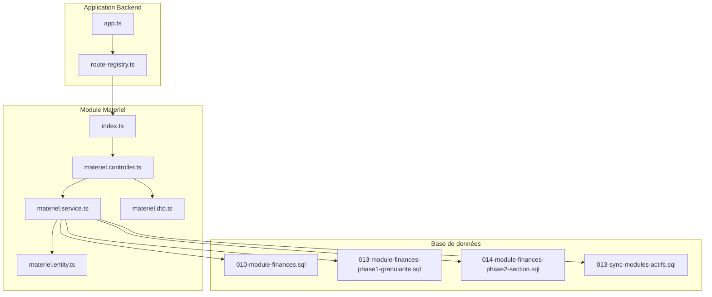

**Sources du diagramme**
- [backend/src/modules/materiel/index.ts](file://backend/src/modules/materiel/index.ts)
- [backend/src/modules/materiel/controllers/materiel.controller.ts](file://backend/src/modules/materiel/controllers/materiel.controller.ts)
- [backend/src/modules/materiel/services/materiel.service.ts](file://backend/src/modules/materiel/services/materiel.service.ts)
- [backend/src/modules/materiel/entities/materiel.entity.ts](file://backend/src/modules/materiel/entities/materiel.entity.ts)
- [backend/src/modules/materiel/dto/materiel.dto.ts](file://backend/src/modules/materiel/dto/materiel.dto.ts)
- [backend/src/routes/route-registry.ts](file://backend/src/routes/route-registry.ts)
- [backend/src/app.ts](file://backend/src/app.ts)
- [backend/database/migrations/010-module-finances.sql](file://backend/database/migrations/010-module-finances.sql)
- [backend/database/migrations/013-module-finances-phase1-granularite.sql](file://backend/database/migrations/013-module-finances-phase1-granularite.sql)
- [backend/database/migrations/014-module-finances-phase2-section.sql](file://backend/database/migrations/014-module-finances-phase2-section.sql)
- [backend/database/migrations/013-sync-modules-actifs.sql](file://backend/database/migrations/013-sync-modules-actifs.sql)

**Sources de section**
- [backend/src/modules/materiel/index.ts](file://backend/src/modules/materiel/index.ts)
- [backend/src/routes/route-registry.ts](file://backend/src/routes/route-registry.ts)
- [backend/src/app.ts](file://backend/src/app.ts)

## Composants clés
- Contrôleurs: exposent les opérations CRUD et les flux métier (demande, prêt, retour, maintenance, mise au rebut).
- Services: implémentent la logique métier, la gestion des mouvements de stock, les alertes de seuils, l’amortissement et les rapports.
- Entités: définissent les modèles de données (catégories, fiches inventaire, mouvements, localisations, états).
- DTOs: valident les payloads entrants et formatent les réponses.
- Migrations: assurent la cohérence du schéma et l’intégration avec le module finances (amortissement, sections, granularité).

**Sources de section**
- [backend/src/modules/materiel/controllers/materiel.controller.ts](file://backend/src/modules/materiel/controllers/materiel.controller.ts)
- [backend/src/modules/materiel/services/materiel.service.ts](file://backend/src/modules/materiel/services/materiel.service.ts)
- [backend/src/modules/materiel/entities/materiel.entity.ts](file://backend/src/modules/materiel/entities/materiel.entity.ts)
- [backend/src/modules/materiel/dto/materiel.dto.ts](file://backend/src/modules/materiel/dto/materiel.dto.ts)

## Vue d'ensemble de l'architecture
Le module suit un pattern MVC classique couplé à des services métier et des entités persistantes. Les routes sont enregistrées via le registre global et initialisées dans l’application principale. La persistance repose sur des migrations SQL qui garantissent la structure et l’intégration financière.

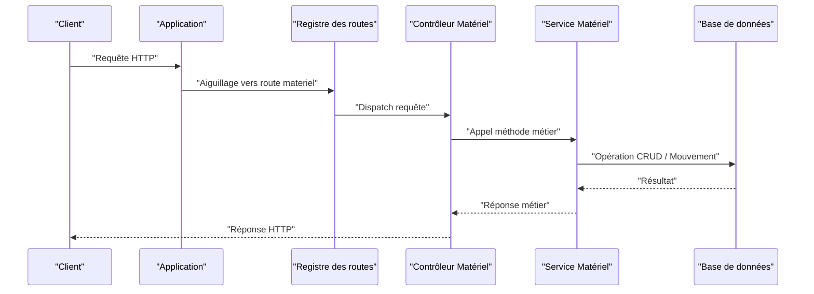

**Sources du diagramme**
- [backend/src/app.ts](file://backend/src/app.ts)
- [backend/src/routes/route-registry.ts](file://backend/src/routes/route-registry.ts)
- [backend/src/modules/materiel/controllers/materiel.controller.ts](file://backend/src/modules/materiel/controllers/materiel.controller.ts)
- [backend/src/modules/materiel/services/materiel.service.ts](file://backend/src/modules/materiel/services/materiel.service.ts)

## Analyse détaillée des composants

### Gestion des catégories de matériel
Les catégories permettent de classifier le matériel (pédagogique, sportif, technique, administratif, etc.). Elles facilitent le filtrage, les rapports et la valorisation patrimoniale par famille.

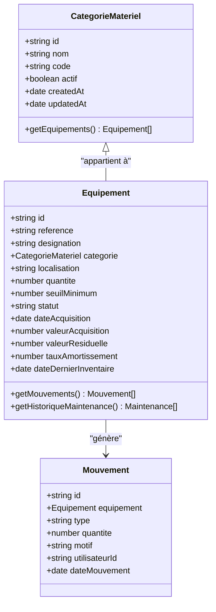

**Sources du diagramme**
- [backend/src/modules/materiel/entities/materiel.entity.ts](file://backend/src/modules/materiel/entities/materiel.entity.ts)

**Sources de section**
- [backend/src/modules/materiel/entities/materiel.entity.ts](file://backend/src/modules/materiel/entities/materiel.entity.ts)
- [backend/src/modules/materiel/dto/materiel.dto.ts](file://backend/src/modules/materiel/dto/materiel.dto.ts)

### Fiches inventaire et localisation
Chaque fiche inventaire décrit un équipement avec sa référence, sa désignation, sa catégorie, sa localisation, ses quantités, son statut, sa date d’acquisition et sa valeur. La localisation peut être un lieu physique ou un service.

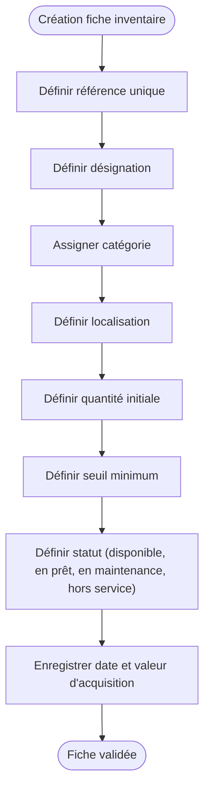

**Sources du diagramme**
- [backend/src/modules/materiel/entities/materiel.entity.ts](file://backend/src/modules/materiel/entities/materiel.entity.ts)
- [backend/src/modules/materiel/dto/materiel.dto.ts](file://backend/src/modules/materiel/dto/materiel.dto.ts)

**Sources de section**
- [backend/src/modules/materiel/entities/materiel.entity.ts](file://backend/src/modules/materiel/entities/materiel.entity.ts)
- [backend/src/modules/materiel/dto/materiel.dto.ts](file://backend/src/modules/materiel/dto/materiel.dto.ts)

### Mouvements de stock
Les mouvements de stock incluent les entrées, sorties, transferts, prêts et retours. Chaque mouvement est tracé avec un type, une quantité, un motif et l’utilisateur responsable.

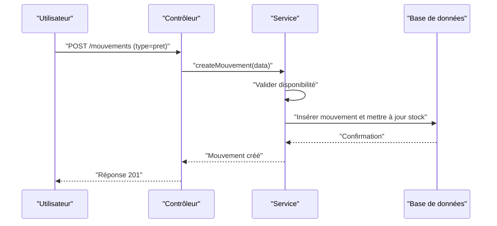

**Sources du diagramme**
- [backend/src/modules/materiel/controllers/materiel.controller.ts](file://backend/src/modules/materiel/controllers/materiel.controller.ts)
- [backend/src/modules/materiel/services/materiel.service.ts](file://backend/src/modules/materiel/services/materiel.service.ts)
- [backend/src/modules/materiel/entities/materiel.entity.ts](file://backend/src/modules/materiel/entities/materiel.entity.ts)

**Sources de section**
- [backend/src/modules/materiel/controllers/materiel.controller.ts](file://backend/src/modules/materiel/controllers/materiel.controller.ts)
- [backend/src/modules/materiel/services/materiel.service.ts](file://backend/src/modules/materiel/services/materiel.service.ts)
- [backend/src/modules/materiel/entities/materiel.entity.ts](file://backend/src/modules/materiel/entities/materiel.entity.ts)

### Workflow de demande, prêt, retour
La demande est initiée par un utilisateur, validée par un responsable, puis transformée en prêt. Le retour met à jour le statut et la localisation.

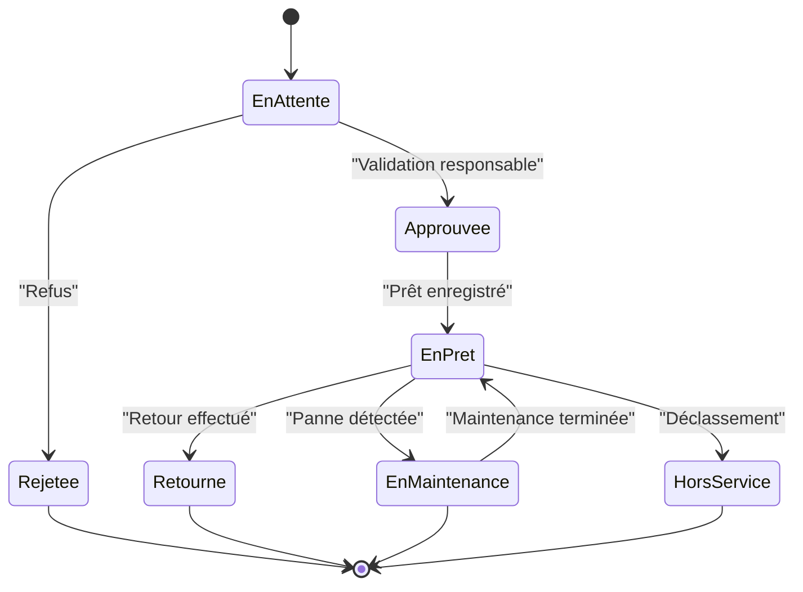

**Sources du diagramme**
- [backend/src/modules/materiel/services/materiel.service.ts](file://backend/src/modules/materiel/services/materiel.service.ts)
- [backend/src/modules/materiel/entities/materiel.entity.ts](file://backend/src/modules/materiel/entities/materiel.entity.ts)

**Sources de section**
- [backend/src/modules/materiel/services/materiel.service.ts](file://backend/src/modules/materiel/services/materiel.service.ts)
- [backend/src/modules/materiel/entities/materiel.entity.ts](file://backend/src/modules/materiel/entities/materiel.entity.ts)

### Maintenance et mise au rebut
La maintenance permet de planifier et tracer les interventions. La mise au rebut déclasse l’équipement et met fin à son suivi opérationnel.

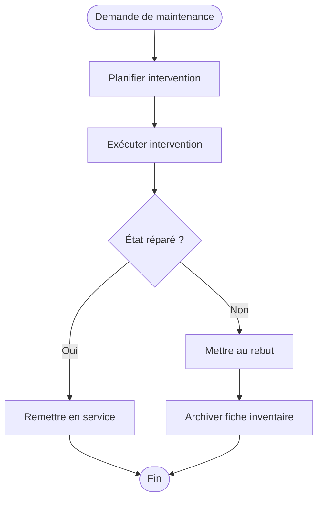

**Sources du diagramme**
- [backend/src/modules/materiel/services/materiel.service.ts](file://backend/src/modules/materiel/services/materiel.service.ts)
- [backend/src/modules/materiel/entities/materiel.entity.ts](file://backend/src/modules/materiel/entities/materiel.entity.ts)

**Sources de section**
- [backend/src/modules/materiel/services/materiel.service.ts](file://backend/src/modules/materiel/services/materiel.service.ts)
- [backend/src/modules/materiel/entities/materiel.entity.ts](file://backend/src/modules/materiel/entities/materiel.entity.ts)

### Alertes de stock minimum
Le système surveille les niveaux de stock et émet des alertes lorsque la quantité descend sous le seuil minimum configuré.

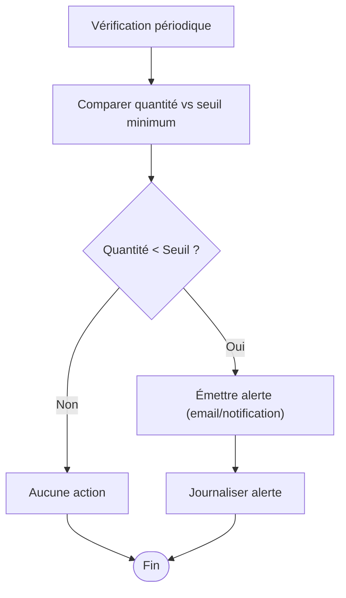

**Sources du diagramme**
- [backend/src/modules/materiel/services/materiel.service.ts](file://backend/src/modules/materiel/services/materiel.service.ts)
- [backend/src/modules/materiel/entities/materiel.entity.ts](file://backend/src/modules/materiel/entities/materiel.entity.ts)

**Sources de section**
- [backend/src/modules/materiel/services/materiel.service.ts](file://backend/src/modules/materiel/services/materiel.service.ts)
- [backend/src/modules/materiel/entities/materiel.entity.ts](file://backend/src/modules/materiel/entities/materiel.entity.ts)

### Inventaires périodiques et rapports d'utilisation
Des inventaires réguliers permettent de vérifier la conformité physique et de mettre à jour les valeurs résiduelles. Les rapports d’utilisation agrègent les mouvements et l’état des équipements.

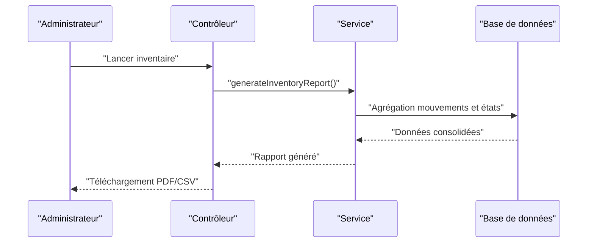

**Sources du diagramme**
- [backend/src/modules/materiel/controllers/materiel.controller.ts](file://backend/src/modules/materiel/controllers/materiel.controller.ts)
- [backend/src/modules/materiel/services/materiel.service.ts](file://backend/src/modules/materiel/services/materiel.service.ts)

**Sources de section**
- [backend/src/modules/materiel/controllers/materiel.controller.ts](file://backend/src/modules/materiel/controllers/materiel.controller.ts)
- [backend/src/modules/materiel/services/materiel.service.ts](file://backend/src/modules/materiel/services/materiel.service.ts)

### Amortissement et valorisation patrimoniale
L’amortissement calcule la perte de valeur du matériel au fil du temps. La valorisation patrimoniale intègre ces données financières pour le bilan.

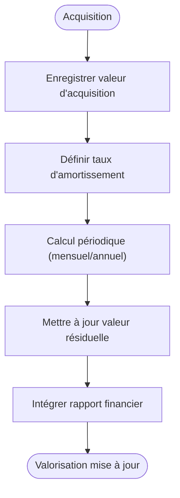

**Sources du diagramme**
- [backend/src/modules/materiel/entities/materiel.entity.ts](file://backend/src/modules/materiel/entities/materiel.entity.ts)
- [backend/database/migrations/010-module-finances.sql](file://backend/database/migrations/010-module-finances.sql)
- [backend/database/migrations/013-module-finances-phase1-granularite.sql](file://backend/database/migrations/013-module-finances-phase1-granularite.sql)
- [backend/database/migrations/014-module-finances-phase2-section.sql](file://backend/database/migrations/014-module-finances-phase2-section.sql)

**Sources de section**
- [backend/src/modules/materiel/entities/materiel.entity.ts](file://backend/src/modules/materiel/entities/materiel.entity.ts)
- [backend/database/migrations/010-module-finances.sql](file://backend/database/migrations/010-module-finances.sql)
- [backend/database/migrations/013-module-finances-phase1-granularite.sql](file://backend/database/migrations/013-module-finances-phase1-granularite.sql)
- [backend/database/migrations/014-module-finances-phase2-section.sql](file://backend/database/migrations/014-module-finances-phase2-section.sql)

### Intégration avec la comptabilité
Les mouvements de matériel peuvent être liés aux écritures comptables grâce aux migrations financières. La granularité et les sections permettent de segmenter les charges et immobilisations.

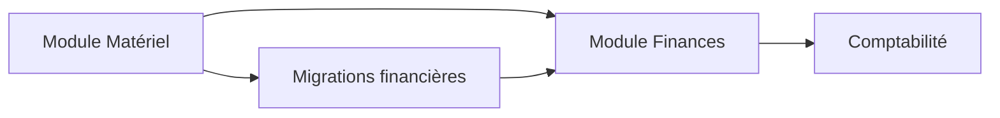

**Sources du diagramme**
- [backend/database/migrations/010-module-finances.sql](file://backend/database/migrations/010-module-finances.sql)
- [backend/database/migrations/013-module-finances-phase1-granularite.sql](file://backend/database/migrations/013-module-finances-phase1-granularite.sql)
- [backend/database/migrations/014-module-finances-phase2-section.sql](file://backend/database/migrations/014-module-finances-phase2-section.sql)
- [backend/database/migrations/013-sync-modules-actifs.sql](file://backend/database/migrations/013-sync-modules-actifs.sql)

**Sources de section**
- [backend/database/migrations/010-module-finances.sql](file://backend/database/migrations/010-module-finances.sql)
- [backend/database/migrations/013-module-finances-phase1-granularite.sql](file://backend/database/migrations/013-module-finances-phase1-granularite.sql)
- [backend/database/migrations/014-module-finances-phase2-section.sql](file://backend/database/migrations/014-module-finances-phase2-section.sql)
- [backend/database/migrations/013-sync-modules-actifs.sql](file://backend/database/migrations/013-sync-modules-actifs.sql)

## Analyse des dépendances
Le module Matériel dépend des entités et DTOs internes, des services métier, et des migrations financières. Les routes sont enregistrées globalement et l’application initialise le module.

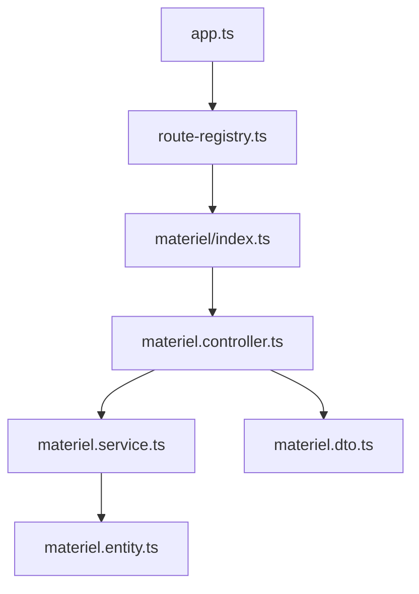

**Sources du diagramme**
- [backend/src/modules/materiel/index.ts](file://backend/src/modules/materiel/index.ts)
- [backend/src/modules/materiel/controllers/materiel.controller.ts](file://backend/src/modules/materiel/controllers/materiel.controller.ts)
- [backend/src/modules/materiel/services/materiel.service.ts](file://backend/src/modules/materiel/services/materiel.service.ts)
- [backend/src/modules/materiel/entities/materiel.entity.ts](file://backend/src/modules/materiel/entities/materiel.entity.ts)
- [backend/src/modules/materiel/dto/materiel.dto.ts](file://backend/src/modules/materiel/dto/materiel.dto.ts)
- [backend/src/routes/route-registry.ts](file://backend/src/routes/route-registry.ts)
- [backend/src/app.ts](file://backend/src/app.ts)

**Sources de section**
- [backend/src/modules/materiel/index.ts](file://backend/src/modules/materiel/index.ts)
- [backend/src/routes/route-registry.ts](file://backend/src/routes/route-registry.ts)
- [backend/src/app.ts](file://backend/src/app.ts)

## Considérations de performance
- Indexation des colonnes critiques (référence, catégorie, localisation, statut) pour accélérer les recherches et les rapports.
- Pagination des listes d’équipements et des mouvements pour limiter la charge mémoire.
- Agrégation des données de rapports en requêtes optimisées plutôt qu’en traitements côté application.
- Mise en cache des configurations de seuils et des catégories fréquemment consultées.

[Pas de sources nécessaires car cette section fournit des conseils généraux]

## Guide de dépannage
- Vérifier les logs d’erreurs lors des mouvements de stock pour identifier les violations de contraintes (quantité négative, état invalide).
- Confirmer la présence des migrations financières appliquées pour garantir la cohérence comptable.
- Valider les permissions RBAC pour les actions sensibles (mise au rebut, modification de valeur d’acquisition).
- Utiliser les rapports d’inventaire pour détecter les écarts physiques et corriger les fiches inventaire.

**Sources de section**
- [backend/src/modules/materiel/services/materiel.service.ts](file://backend/src/modules/materiel/services/materiel.service.ts)
- [backend/database/migrations/010-module-finances.sql](file://backend/database/migrations/010-module-finances.sql)
- [backend/database/migrations/013-module-finances-phase1-granularite.sql](file://backend/database/migrations/013-module-finances-phase1-granularite.sql)
- [backend/database/migrations/014-module-finances-phase2-section.sql](file://backend/database/migrations/014-module-finances-phase2-section.sql)

## Conclusion
Le module Matériel et Inventaire d’eLISAschool offre une gestion complète du cycle de vie du matériel, depuis l’acquisition jusqu’à la mise au rebut, en passant par les demandes, prêts, retours et maintenance. Il intègre alertes de stock, inventaires périodiques, rapports d’utilisation, amortissement et valorisation patrimoniale, tout en assurant une intégration robuste avec la comptabilité via des migrations financières. Cette documentation vise à faciliter l’usage et l’extension du module par les équipes techniques et les responsables patrimoniaux.

[Pas de sources nécessaires car cette section résume sans analyser de fichiers spécifiques]

## Annexes
- Exemples de classification du matériel pédagogique, sportif et technique basés sur les catégories configurables.
- Procédures recommandées pour la tenue des inventaires et la traçabilité des mouvements.
- Bonnes pratiques pour la configuration des seuils minimum et la planification des alertes.

[Pas de sources nécessaires car cette section propose des recommandations générales]