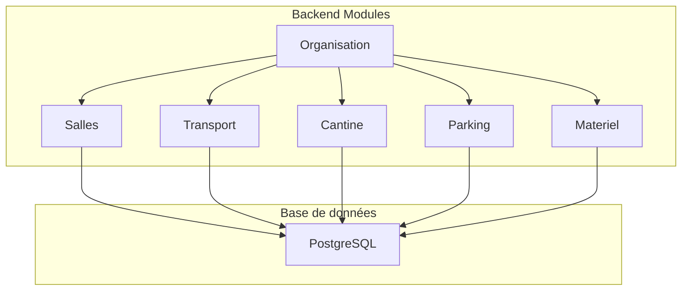
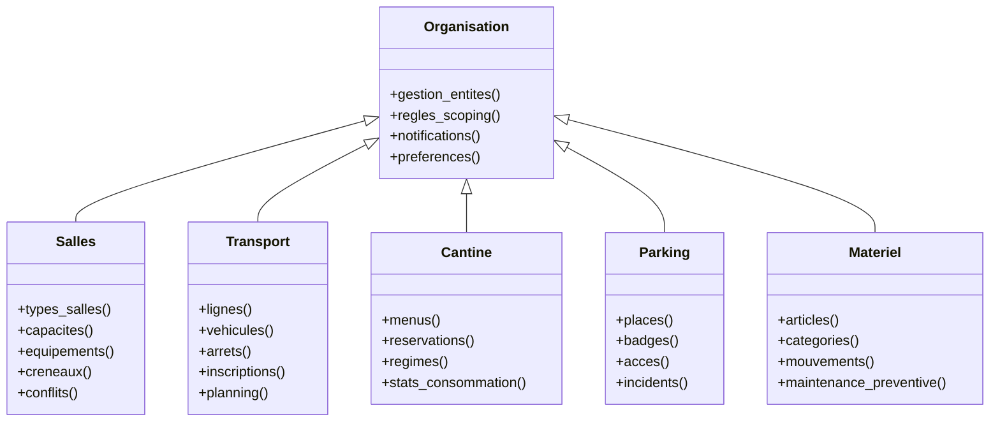
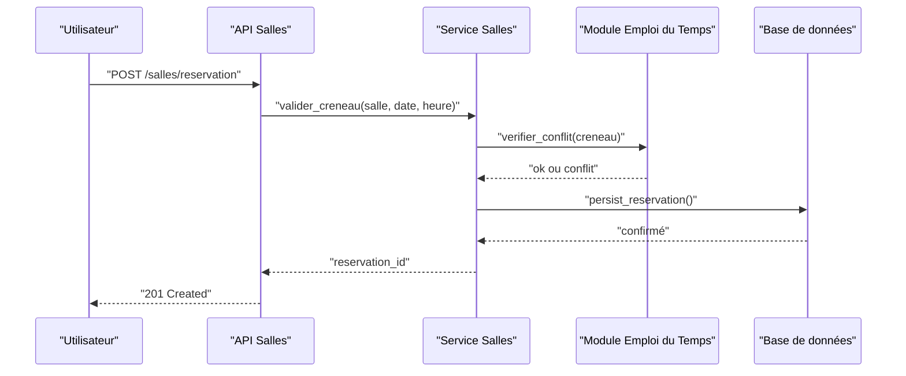
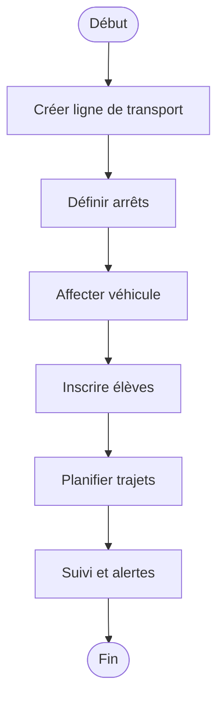
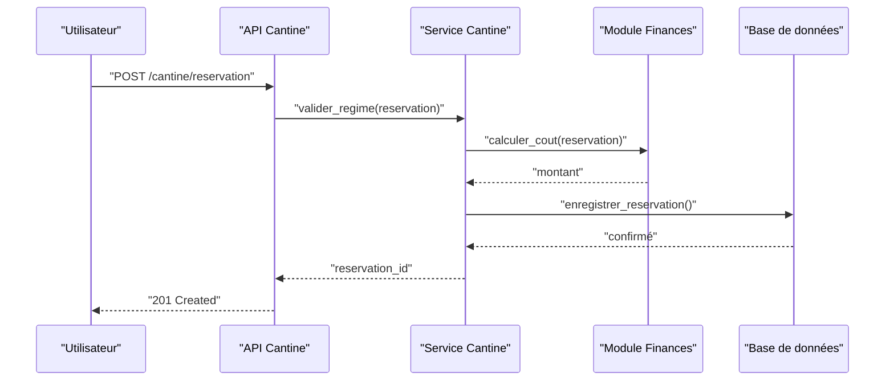
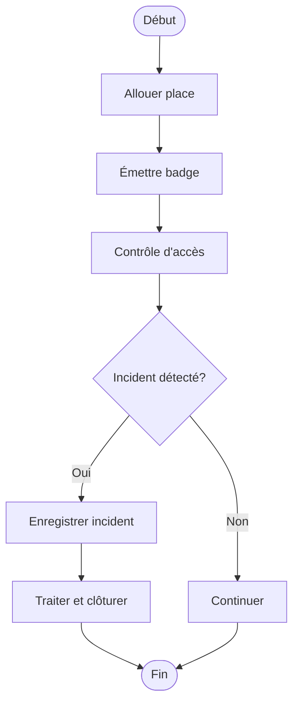
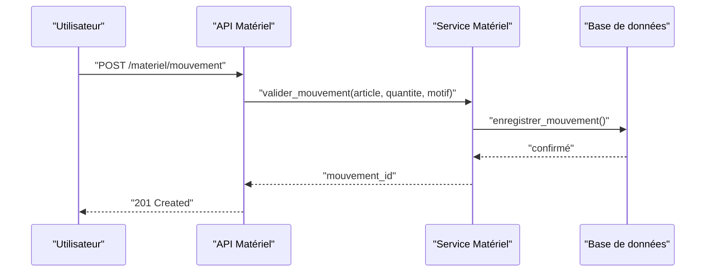
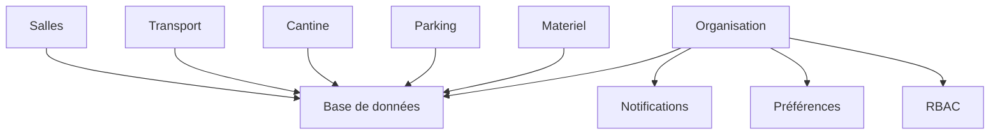

# Organisation et Infrastructure

<cite>
**Fichiers référencés dans ce document**
- [backend/src/modules/organisation/index.ts](file://backend/src/modules/organisation/index.ts)
- [backend/src/modules/salles/index.ts](file://backend/src/modules/salles/index.ts)
- [backend/src/modules/transport/index.ts](file://backend/src/modules/transport/index.ts)
- [backend/src/modules/cantine/index.ts](file://backend/src/modules/cantine/index.ts)
- [backend/src/modules/parking/index.ts](file://backend/src/modules/parking/index.ts)
- [backend/src/modules/materiel/index.ts](file://backend/src/modules/materiel/index.ts)
- [backend/database/migrations/044-module-organisation.sql](file://backend/database/migrations/044-module-organisation.sql)
- [backend/database/migrations/109-refonte-organisation.sql](file://backend/database/migrations/109-refonte-organisation.sql)
- [backend/database/migrations/110-consolidation-organisation.sql](file://backend/database/migrations/110-consolidation-organisation.sql)
- [backend/database/migrations/112-refonte-organisation-v4.sql](file://backend/database/migrations/112-refonte-organisation-v4.sql)
- [backend/database/migrations/120-correction-vues-materialisees-organisation.sql](file://backend/database/migrations/120-correction-vues-materialisees-organisation.sql)
- [backend/database/migrations/070-module-salles.sql](file://backend/database/migrations/070-module-salles.sql)
- [backend/database/migrations/063-creer-module-emploi-du-temps.sql](file://backend/database/migrations/063-creer-module-emploi-du-temps.sql)
- [backend/database/migrations/016-module-personnel-rh-phase1.sql](file://backend/database/migrations/016-module-personnel-rh-phase1.sql)
- [backend/database/migrations/010-module-finances-part2.sql](file://backend/database/migrations/010-module-finances-part2.sql)
- [backend/database/migrations/059-ajouter-affectation-matiere-coefficient.sql](file://backend/database/migrations/059-ajouter-affectation-matiere-coefficient.sql)
- [backend/database/migrations/060-creer-table-bulletins-matieres.sql](file://backend/database/migrations/060-creer-table-bulletins-matieres.sql)
- [backend/database/migrations/061-creer-table-evaluations-competences.sql](file://backend/database/migrations/061-creer-table-evaluations-competences.sql)
- [backend/database/migrations/065-creer-templates-emploi-du-temps.sql](file://backend/database/migrations/065-creer-templates-emploi-du-temps.sql)
- [backend/database/migrations/108-refactor-salle-principale.sql](file://backend/database/migrations/108-refactor-salle-principale.sql)
- [backend/database/migrations/100-classes-salle-principale.sql](file://backend/database/migrations/100-classes-salle-principale.sql)
- [backend/database/migrations/114-fusion-creneaux-horaires.sql](file://backend/database/migrations/114-fusion-creneaux-horaires.sql)
- [backend/database/migrations/118-preferences-edt-enrichi.sql](file://backend/database/migrations/118-preferences-edt-enrichi.sql)
- [backend/database/migrations/046-organisation-performance-avancee.sql](file://backend/database/migrations/046-organisation-performance-avancee.sql)
- [backend/database/migrations/045-organisation-optimisations.sql](file://backend/database/migrations/045-organisation-optimisations.sql)
- [backend/database/migrations/046-types-contrat-personnalises.sql](file://backend/database/migrations/046-types-contrat-personnalises.sql)
- [backend/database/migrations/046-dashboard-config.sql](file://backend/database/migrations/046-dashboard-config.sql)
- [backend/database/migrations/046-preferences-utilisateur-et-config.sql](file://backend/database/migrations/046-preferences-utilisateur-et-config.sql)
- [backend/database/migrations/046-preferences-role.sql](file://backend/database/migrations/046-preferences-role.sql)
- [backend/database/migrations/047-notifications-ameliorations.sql](file://backend/database/migrations/047-notifications-ameliorations.sql)
- [backend/database/migrations/048-notifications-performance-optimizations.sql](file://backend/database/migrations/048-notifications-performance-optimizations.sql)
- [backend/database/migrations/049-ameliorations-inscription-finances.sql](file://backend/database/migrations/049-ameliorations-inscription-finances.sql)
- [backend/database/migrations/050-ameliorations-inscription-relances.sql](file://backend/database/migrations/050-ameliorations-inscription-relances.sql)
- [backend/database/migrations/050-etablissements-couleurs.sql](file://backend/database/migrations/050-etablissements-couleurs.sql)
- [backend/database/migrations/050-multi-tenant-v3-max-etablissements.sql](file://backend/database/migrations/050-multi-tenant-v3-max-etablissements.sql)
- [backend/database/migrations/050-suppression-utilisateur-etablissementId.sql](file://backend/database/migrations/050-suppression-utilisateur-etablissementId.sql)
- [backend/database/migrations/051-champs-preinscription-enrichis.sql](file://backend/database/migrations/051-champs-preinscription-enrichis.sql)
- [backend/database/migrations/052-approche-hybride-parents.sql](file://backend/database/migrations/052-approche-hybride-parents.sql)
- [backend/database/migrations/053-structure-academique-complete.sql](file://backend/database/migrations/053-structure-academique-complete.sql)
- [backend/database/migrations/054-refonte-structure-academique-v2.sql](file://backend/database/migrations/054-refonte-structure-academique-v2.sql)
- [backend/database/migrations/055-structure-academique-ameliorations.sql](file://backend/database/migrations/055-structure-academique-ameliorations.sql)
- [backend/database/migrations/056-refactor-note-enseignant-membre-personnel.sql](file://backend/database/migrations/056-refactor-note-enseignant-membre-personnel.sql)
- [backend/database/migrations/056-suppression-cycle-scolaire.sql](file://backend/database/migrations/056-suppression-cycle-scolaire.sql)
- [backend/database/migrations/057-supprimer-niveau-filiere-id.sql](file://backend/database/migrations/057-supprimer-niveau-filiere-id.sql)
- [backend/database/migrations/057-supprimer-parametres-dupliques-etablissement.sql](file://backend/database/migrations/057-supprimer-parametres-dupliques-etablissement.sql)
- [backend/database/migrations/058-multi-tenant-structure-academique.sql](file://backend/database/migrations/058-multi-tenant-structure-academique.sql)
- [backend/database/migrations/058-unifier-periode-cloturee-statut.sql](file://backend/database/migrations/058-unifier-periode-cloturee-statut.sql)
- [backend/database/migrations/059-ajouter-affectation-matiere-coefficient.sql](file://backend/database/migrations/059-ajouter-affectation-matiere-coefficient.sql)
- [backend/database/migrations/060-creer-table-bulletins-matieres.sql](file://backend/database/migrations/060-creer-table-bulletins-matieres.sql)
- [backend/database/migrations/061-creer-table-evaluations-competences.sql](file://backend/database/migrations/061-creer-table-evaluations-competences.sql)
- [backend/database/migrations/063-creer-module-emploi-du-temps.sql](file://backend/database/migrations/063-creer-module-emploi-du-temps.sql)
- [backend/database/migrations/064-validateur-sous-systeme.sql](file://backend/database/migrations/064-validateur-sous-systeme.sql)
- [backend/database/migrations/065-creer-templates-emploi-du-temps.sql](file://backend/database/migrations/065-creer-templates-emploi-du-temps.sql)
- [backend/database/migrations/069-fix-super-admin-permissions.sql](file://backend/database/migrations/069-fix-super-admin-permissions.sql)
- [backend/database/migrations/070-fix-super-admin-all-permission.sql](file://backend/database/migrations/070-fix-super-admin-all-permission.sql)
- [backend/database/migrations/070-module-salles.sql](file://backend/database/migrations/070-module-salles.sql)
- [backend/database/migrations/072-scoping-cycles-niveaux.sql](file://backend/database/migrations/072-scoping-cycles-niveaux.sql)
- [backend/database/migrations/073-competence-unique-composite.sql](file://backend/database/migrations/073-competence-unique-composite.sql)
- [backend/database/migrations/074-matiere-niveau-unique-composite.sql](file://backend/database/migrations/074-matiere-niveau-unique-composite.sql)
- [backend/database/migrations/075-module-groupes-etablissements.sql](file://backend/database/migrations/075-module-groupes-etablissements.sql)
- [backend/database/migrations/076-permissions-groupes-etablissements.sql](file://backend/database/migrations/076-permissions-groupes-etablissements.sql)
- [backend/database/migrations/077-update-permissions-groupes.sql](file://backend/database/migrations/077-update-permissions-groupes.sql)
- [backend/database/migrations/078-utilisateur-test-groupes.sql](file://backend/database/migrations/078-utilisateur-test-groupes.sql)
- [backend/database/migrations/079-add-roleId-utilisateur-etablissements.sql](file://backend/database/migrations/079-add-roleId-utilisateur-etablissements.sql)
- [backend/database/migrations/079-correction-permissions-groupes.sql](file://backend/database/migrations/079-correction-permissions-groupes.sql)
- [backend/database/migrations/080-preferences-utilisateur-multi-tenant.sql](file://backend/database/migrations/080-preferences-utilisateur-multi-tenant.sql)
- [backend/database/migrations/081-module-apparence-fonds.sql](file://backend/database/migrations/081-module-apparence-fonds.sql)
- [backend/database/migrations/082-fix-contrainte-unique-preferences.sql](file://backend/database/migrations/082-fix-contrainte-unique-preferences.sql)
- [backend/database/migrations/083-fix-contrainte-unique-parametres.sql](file://backend/database/migrations/083-fix-contrainte-unique-parametres.sql)
- [backend/database/migrations/084-cleanup-classe-id-notes.sql](file://backend/database/migrations/084-cleanup-classe-id-notes.sql)
- [backend/database/migrations/085-periode-etablissement-id.sql](file://backend/database/migrations/085-periode-etablissement-id.sql)
- [backend/database/migrations/086-affectation-matiere-etablissement-id.sql](file://backend/database/migrations/086-affectation-matiere-etablissement-id.sql)
- [backend/database/migrations/087-affectation-matiere-verifications.sql](file://backend/database/migrations/087-affectation-matiere-verifications.sql)
- [backend/database/migrations/088-refactorisation-architecture-academique.sql](file://backend/database/migrations/088-refactorisation-architecture-academique.sql)
- [backend/database/migrations/089-finalisation-architecture-academique-v2.sql](file://backend/database/migrations/089-finalisation-architecture-academique-v2.sql)
- [backend/database/migrations/090-correction-migration-088-camelcase.sql](file://backend/database/migrations/090-correction-migration-088-camelcase.sql)
- [backend/database/migrations/091-peuplement-architecture-academique.sql](file://backend/database/migrations/091-peuplement-architecture-academique.sql)
- [backend/database/migrations/092-refactorisation-classeAnneeId.sql](file://backend/database/migrations/092-refactorisation-classeAnneeId.sql)
- [backend/database/migrations/099-add-monitoring-params.sql](file://backend/database/migrations/099-add-monitoring-params.sql)
- [backend/database/migrations/100-classes-salle-principale.sql](file://backend/database/migrations/100-classes-salle-principale.sql)
- [backend/database/migrations/101-normalisation-annee-scolaire-cloture.sql](file://backend/database/migrations/101-normalisation-annee-scolaire-cloture.sql)
- [backend/database/migrations/102-periodes-hierarchie.sql](file://backend/database/migrations/102-periodes-hierarchie.sql)
- [backend/database/migrations/103-templates-periode-personnalisables.sql](file://backend/database/migrations/103-templates-periode-personnalisables.sql)
- [backend/database/migrations/104-refonte-periodes-niveaux-configurables.sql](file://backend/database/migrations/104-refonte-periodes-niveaux-configurables.sql)
- [backend/database/migrations/105-migration-templates-v5.sql](file://backend/database/migrations/105-migration-templates-v5.sql)
- [backend/database/migrations/106-rename-sequence-to-evaluation.sql](file://backend/database/migrations/106-rename-sequence-to-evaluation.sql)
- [backend/database/migrations/107-cleanup-configuration-modules-actif.sql](file://backend/database/migrations/107-cleanup-configuration-modules-actif.sql)
- [backend/database/migrations/108-refactor-salle-principale.sql](file://backend/database/migrations/108-refactor-salle-principale.sql)
- [backend/database/migrations/109-refonte-organisation.sql](file://backend/database/migrations/109-refonte-organisation.sql)
- [backend/database/migrations/110-consolidation-organisation.sql](file://backend/database/migrations/110-consolidation-organisation.sql)
- [backend/database/migrations/111-cleanup-trigger-occupantid.sql](file://backend/database/migrations/111-cleanup-trigger-occupantid.sql)
- [backend/database/migrations/112-refonte-organisation-v4.sql](file://backend/database/migrations/112-refonte-organisation-v4.sql)
- [backend/database/migrations/113-fix-unique-constraints-nomenclatures.sql](file://backend/database/migrations/113-fix-unique-constraints-nomenclatures.sql)
- [backend/database/migrations/114-fusion-creneaux-horaires.sql](file://backend/database/migrations/114-fusion-creneaux-horaires.sql)
- [backend/database/migrations/115-supprimer-config-matiere-classe.sql](file://backend/database/migrations/115-supprimer-config-matiere-classe.sql)
- [backend/database/migrations/116-programme-intemporel.sql](file://backend/database/migrations/116-programme-intemporel.sql)
- [backend/database/migrations/117-heure-cours-classe-annee.sql](file://backend/database/migrations/117-heure-cours-classe-annee.sql)
- [backend/database/migrations/118-preferences-edt-enrichi.sql](file://backend/database/migrations/118-preferences-edt-enrichi.sql)
- [backend/database/migrations/119-normalisation-echelons-structuraux.sql](file://backend/database/migrations/119-normalisation-echelons-structuraux.sql)
- [backend/database/migrations/120-correction-vues-materialisees-organisation.sql](file://backend/database/migrations/120-correction-vues-materialisees-organisation.sql)
- [backend/database/migrations/121-fonction-categorie-drop-type-personnel.sql](file://backend/database/migrations/121-fonction-categorie-drop-type-personnel.sql)
- [backend/database/migrations/122-hierarchie-superieur-poste.sql](file://backend/database/migrations/122-hierarchie-superieur-poste.sql)
- [backend/database/migrations/123-refonte-notes-bulletins.sql](file://backend/database/migrations/123-refonte-notes-bulletins.sql)
- [backend/database/migrations/124-fix-hierarchie-orphelins.sql](file://backend/database/migrations/124-fix-hierarchie-orphelins.sql)
- [backend/database/migrations/125-organigramme-read-tous-roles.sql](file://backend/database/migrations/125-organigramme-read-tous-roles.sql)
- [backend/database/migrations/126-fix-vues-materialisees-statuts.sql](file://backend/database/migrations/126-fix-vues-materialisees-statuts.sql)
- [backend/database/migrations/127-templates-organisation-categorisation.sql](file://backend/database/migrations/127-templates-organisation-categorisation.sql)
</cite>

## Table des matières
1. [Introduction](#introduction)
2. [Structure du projet](#structure-du-projet)
3. [Composants clés](#composants-clés)
4. [Vue d'ensemble de l'architecture](#vue-densemble-de-larchitecture)
5. [Analyse détaillée des composants](#analyse-detallee-des-composants)
6. [Analyse des dépendances](#analyse-des-dependances)
7. [Considérations de performance](#considerations-de-performance)
8. [Guide de dépannage](#guide-de-depannage)
9. [Conclusion](#conclusion)
10. [Annexes](#annexes)

## Introduction
Ce document décrit le module Organisation et Infrastructure d'eLISAschool, qui centralise la gestion des salles et équipements, du transport scolaire, de la cantine et restauration, du parking et sécurité, ainsi que de l'inventaire matériel. Il explique les entités organisationnelles, les workflows de réservation, les calendriers d'utilisation, et les systèmes de suivi. Il détaille également les relations avec les modules Emploi du temps, Personnel, Finances, les options de configuration, les rapports de gestion, et les fonctionnalités avancées telles que la maintenance préventive, la gestion des incidents et l'optimisation des ressources.

## Structure du projet
Le backend expose un ensemble de modules par domaine (salles, transport, cantine, parking, materiel) et un module Organisation qui orchestre les entités et les règles transversales. Les migrations SQL définissent le schéma de base de données et les évolutions successives du modèle.

**Diagramme sources**
- [backend/src/modules/organisation/index.ts](file://backend/src/modules/organisation/index.ts)
- [backend/src/modules/salles/index.ts](file://backend/src/modules/salles/index.ts)
- [backend/src/modules/transport/index.ts](file://backend/src/modules/transport/index.ts)
- [backend/src/modules/cantine/index.ts](file://backend/src/modules/cantine/index.ts)
- [backend/src/modules/parking/index.ts](file://backend/src/modules/parking/index.ts)
- [backend/src/modules/materiel/index.ts](file://backend/src/modules/materiel/index.ts)

**Section sources**
- [backend/src/modules/organisation/index.ts](file://backend/src/modules/organisation/index.ts)
- [backend/src/modules/salles/index.ts](file://backend/src/modules/salles/index.ts)
- [backend/src/modules/transport/index.ts](file://backend/src/modules/transport/index.ts)
- [backend/src/modules/cantine/index.ts](file://backend/src/modules/cantine/index.ts)
- [backend/src/modules/parking/index.ts](file://backend/src/modules/parking/index.ts)
- [backend/src/modules/materiel/index.ts](file://backend/src/modules/materiel/index.ts)

## Composants clés
- Entités organisationnelles : établissements, unités, catégories, rôles et permissions liés à l’organisation.
- Salles et équipements : types de salles, capacités, équipements associés, créneaux horaires, conflits et validations.
- Transport scolaire : lignes, véhicules, arrêts, inscriptions élèves, planning et suivi.
- Cantine et restauration : menus, réservations, régimes alimentaires, statistiques de consommation.
- Parking et sécurité : places, badges, accès, incidents et registres.
- Inventaire matériel : fiches articles, catégories, mouvements, maintenance préventive.

**Section sources**
- [backend/database/migrations/044-module-organisation.sql](file://backend/database/migrations/044-module-organisation.sql)
- [backend/database/migrations/109-refonte-organisation.sql](file://backend/database/migrations/109-refonte-organisation.sql)
- [backend/database/migrations/110-consolidation-organisation.sql](file://backend/database/migrations/110-consolidation-organisation.sql)
- [backend/database/migrations/112-refonte-organisation-v4.sql](file://backend/database/migrations/112-refonte-organisation-v4.sql)
- [backend/database/migrations/070-module-salles.sql](file://backend/database/migrations/070-module-salles.sql)
- [backend/database/migrations/063-creer-module-emploi-du-temps.sql](file://backend/database/migrations/063-creer-module-emploi-du-temps.sql)
- [backend/database/migrations/016-module-personnel-rh-phase1.sql](file://backend/database/migrations/016-module-personnel-rh-phase1.sql)
- [backend/database/migrations/010-module-finances-part2.sql](file://backend/database/migrations/010-module-finances-part2.sql)

## Vue d'ensemble de l'architecture
L’architecture est modulaire et orientée services. Le module Organisation définit les entités communes et les règles de scoping multi-tenant. Les modules spécialisés (salles, transport, cantine, parking, materiel) implémentent leurs propres contrôleurs, services et routes, tout en partageant des mécanismes communs (permissions, notifications, préférences).

**Diagramme sources**
- [backend/src/modules/organisation/index.ts](file://backend/src/modules/organisation/index.ts)
- [backend/src/modules/salles/index.ts](file://backend/src/modules/salles/index.ts)
- [backend/src/modules/transport/index.ts](file://backend/src/modules/transport/index.ts)
- [backend/src/modules/cantine/index.ts](file://backend/src/modules/cantine/index.ts)
- [backend/src/modules/parking/index.ts](file://backend/src/modules/parking/index.ts)
- [backend/src/modules/materiel/index.ts](file://backend/src/modules/materiel/index.ts)

## Analyse détaillée des composants

### Gestion des salles et équipements
- Modélisation : types de salles, capacités, équipements, créneaux horaires, conflits et validations croisées avec l’emploi du temps.
- Workflows : création de salle, affectation d’équipements, planification de créneaux, vérification de conflits, validation et publication.
- Calendrier d’utilisation : vue consolidée des réservations, chevauchements et disponibilité.
- Intégrations : emploi du temps (créneaux), personnel (affectations), finances (coûts d’équipement si applicable).

**Diagramme sources**
- [backend/database/migrations/070-module-salles.sql](file://backend/database/migrations/070-module-salles.sql)
- [backend/database/migrations/063-creer-module-emploi-du-temps.sql](file://backend/database/migrations/063-creer-module-emploi-du-temps.sql)
- [backend/database/migrations/108-refactor-salle-principale.sql](file://backend/database/migrations/108-refactor-salle-principale.sql)
- [backend/database/migrations/100-classes-salle-principale.sql](file://backend/database/migrations/100-classes-salle-principale.sql)
- [backend/database/migrations/114-fusion-creneaux-horaires.sql](file://backend/database/migrations/114-fusion-creneaux-horaires.sql)

**Section sources**
- [backend/database/migrations/070-module-salles.sql](file://backend/database/migrations/070-module-salles.sql)
- [backend/database/migrations/063-creer-module-emploi-du-temps.sql](file://backend/database/migrations/063-creer-module-emploi-du-temps.sql)
- [backend/database/migrations/108-refactor-salle-principale.sql](file://backend/database/migrations/108-refactor-salle-principale.sql)
- [backend/database/migrations/100-classes-salle-principale.sql](file://backend/database/migrations/100-classes-salle-principale.sql)
- [backend/database/migrations/114-fusion-creneaux-horaires.sql](file://backend/database/migrations/114-fusion-creneaux-horaires.sql)

### Transport scolaire
- Entités : lignes, véhicules, arrêts, inscriptions élèves, planning.
- Workflows : création de ligne, définition d’arrêts, affectation véhicule, inscription élève, planification trajets, suivi et alertes.
- Calendrier : planning hebdomadaire, retards, modifications et historique.
- Intégrations : emplois du temps (départs/retours), personnel (chauffeurs), finances (coûts de transport).

**Diagramme sources**
- [backend/database/migrations/063-creer-module-emploi-du-temps.sql](file://backend/database/migrations/063-creer-module-emploi-du-temps.sql)
- [backend/database/migrations/016-module-personnel-rh-phase1.sql](file://backend/database/migrations/016-module-personnel-rh-phase1.sql)
- [backend/database/migrations/010-module-finances-part2.sql](file://backend/database/migrations/010-module-finances-part2.sql)

**Section sources**
- [backend/database/migrations/063-creer-module-emploi-du-temps.sql](file://backend/database/migrations/063-creer-module-emploi-du-temps.sql)
- [backend/database/migrations/016-module-personnel-rh-phase1.sql](file://backend/database/migrations/016-module-personnel-rh-phase1.sql)
- [backend/database/migrations/010-module-finances-part2.sql](file://backend/database/migrations/010-module-finances-part2.sql)

### Cantine et restauration
- Entités : menus, réservations, régimes alimentaires, statistiques de consommation.
- Workflows : création de menu, réservation repas, validation régimes, comptage et rapports.
- Calendrier : planning des menus, pics de fréquentation, ajustements.
- Intégrations : finances (facturation), personnel (traiteurs), emplois du temps (horaires de service).

**Diagramme sources**
- [backend/database/migrations/010-module-finances-part2.sql](file://backend/database/migrations/010-module-finances-part2.sql)
- [backend/database/migrations/063-creer-module-emploi-du-temps.sql](file://backend/database/migrations/063-creer-module-emploi-du-temps.sql)

**Section sources**
- [backend/database/migrations/010-module-finances-part2.sql](file://backend/database/migrations/010-module-finances-part2.sql)
- [backend/database/migrations/063-creer-module-emploi-du-temps.sql](file://backend/database/migrations/063-creer-module-emploi-du-temps.sql)

### Parking et sécurité
- Entités : places, badges, accès, incidents, registres.
- Workflows : attribution place, émission badge, contrôle d’accès, déclaration incident, traitement et clôture.
- Calendrier : occupation journalière, pics, incidents récurrents.
- Intégrations : personnel (agents sécurité), finances (tarifs), emploi du temps (événements spéciaux).

**Diagramme sources**
- [backend/database/migrations/016-module-personnel-rh-phase1.sql](file://backend/database/migrations/016-module-personnel-rh-phase1.sql)
- [backend/database/migrations/010-module-finances-part2.sql](file://backend/database/migrations/010-module-finances-part2.sql)

**Section sources**
- [backend/database/migrations/016-module-personnel-rh-phase1.sql](file://backend/database/migrations/016-module-personnel-rh-phase1.sql)
- [backend/database/migrations/010-module-finances-part2.sql](file://backend/database/migrations/010-module-finances-part2.sql)

### Inventaire matériel
- Entités : articles, catégories, mouvements, maintenance préventive.
- Workflows : ajout article, catégorisation, mouvement (entrée/sortie), maintenance planifiée, alertes.
- Calendrier : planning de maintenance, inspections, remplacements.
- Intégrations : finances (amortissement/coûts), emplois du temps (prêt matériel pour cours), personnel (responsables).

**Diagramme sources**
- [backend/database/migrations/010-module-finances-part2.sql](file://backend/database/migrations/010-module-finances-part2.sql)
- [backend/database/migrations/063-creer-module-emploi-du-temps.sql](file://backend/database/migrations/063-creer-module-emploi-du-temps.sql)

**Section sources**
- [backend/database/migrations/010-module-finances-part2.sql](file://backend/database/migrations/010-module-finances-part2.sql)
- [backend/database/migrations/063-creer-module-emploi-du-temps.sql](file://backend/database/migrations/063-creer-module-emploi-du-temps.sql)

### Schéma de base de données (Organisation et Infrastructure)

```mermaid
erDiagram
ETABLISSEMENT {
uuid id PK
string nom
string adresse
timestamp created_at
timestamp updated_at
}
UNITE_ORGANISATIONNELLE {
uuid id PK
uuid etablissement_id FK
string nom
string type
timestamp created_at
timestamp updated_at
}
SALLE {
uuid id PK
uuid etablissement_id FK
string nom
int capacite
enum type
timestamp created_at
timestamp updated_at
}
EQUIPEMENT {
uuid id PK
uuid etablissement_id FK
string nom
string reference
timestamp created_at
timestamp updated_at
}
CRENEAU {
uuid id PK
uuid salle_id FK
date date_debut
time heure_debut
time heure_fin
boolean disponible
timestamp created_at
timestamp updated_at
}
LIGNE_TRANSPORT {
uuid id PK
uuid etablissement_id FK
string nom
string description
timestamp created_at
timestamp updated_at
}
VEHICULE {
uuid id PK
uuid etablissement_id FK
string immatriculation
int capacite
timestamp created_at
timestamp updated_at
}
ARRET {
uuid id PK
uuid etablissement_id FK
string nom
float latitude
float longitude
timestamp created_at
timestamp updated_at
}
MENU_CANTINE {
uuid id PK
uuid etablissement_id FK
date date_menu
jsonb plats
timestamp created_at
timestamp updated_at
}
RESERVATION_CANTINE {
uuid id PK
uuid etablissement_id FK
uuid utilisateur_id FK
date date_repas
int quantite
timestamp created_at
timestamp updated_at
}
PLACE_PARKING {
uuid id PK
uuid etablissement_id FK
string numero
boolean occupee
timestamp created_at
timestamp updated_at
}
BADGE_ACCES {
uuid id PK
uuid etablissement_id FK
uuid utilisateur_id FK
string code
boolean actif
timestamp created_at
timestamp updated_at
}
INCIDENT_PARKING {
uuid id PK
uuid etablissement_id FK
uuid place_id FK
text description
timestamp declare_at
timestamp resolu_at
}
ARTICLE_MATERIEL {
uuid id PK
uuid etablissement_id FK
string nom
string reference
string categorie
timestamp created_at
timestamp updated_at
}
MOUVEMENT_MATERIEL {
uuid id PK
uuid etablissement_id FK
uuid article_id FK
int quantite
string motif
timestamp date_mouvement
}
MAINTENANCE_PREVENTIVE {
uuid id PK
uuid etablissement_id FK
uuid article_id FK
date prochaine_date
string action
timestamp created_at
timestamp updated_at
}
ETABLISSEMENT ||--o{ UNITE_ORGANISATIONNELLE : "possède"
ETABLISSEMENT ||--o{ SALLE : "gère"
ETABLISSEMENT ||--o{ EQUIPEMENT : "gère"
ETABLISSEMENT ||--o{ LIGNE_TRANSPORT : "gère"
ETABLISSEMENT ||--o{ VEHICULE : "gère"
ETABLISSEMENT ||--o{ ARRET : "gère"
ETABLISSEMENT ||--o{ MENU_CANTINE : "publie"
ETABLISSEMENT ||--o{ RESERVATION_CANTINE : "enregistre"
ETABLISSEMENT ||--o{ PLACE_PARKING : "alloue"
ETABLISSEMENT ||--o{ BADGE_ACCES : "émet"
ETABLISSEMENT ||--o{ INCIDENT_PARKING : "suit"
ETABLISSEMENT ||--o{ ARTICLE_MATERIEL : "inventorie"
ETABLISSEMENT ||--o{ MOUVEMENT_MATERIEL : "trace"
ETABLISSEMENT ||--o{ MAINTENANCE_PREVENTIVE : "planifie"
```

**Diagramme sources**
- [backend/database/migrations/109-refonte-organisation.sql](file://backend/database/migrations/109-refonte-organisation.sql)
- [backend/database/migrations/110-consolidation-organisation.sql](file://backend/database/migrations/110-consolidation-organisation.sql)
- [backend/database/migrations/112-refonte-organisation-v4.sql](file://backend/database/migrations/112-refonte-organisation-v4.sql)
- [backend/database/migrations/070-module-salles.sql](file://backend/database/migrations/070-module-salles.sql)
- [backend/database/migrations/063-creer-module-emploi-du-temps.sql](file://backend/database/migrations/063-creer-module-emploi-du-temps.sql)
- [backend/database/migrations/010-module-finances-part2.sql](file://backend/database/migrations/010-module-finances-part2.sql)

**Section sources**
- [backend/database/migrations/109-refonte-organisation.sql](file://backend/database/migrations/109-refonte-organisation.sql)
- [backend/database/migrations/110-consolidation-organisation.sql](file://backend/database/migrations/110-consolidation-organisation.sql)
- [backend/database/migrations/112-refonte-organisation-v4.sql](file://backend/database/migrations/112-refonte-organisation-v4.sql)
- [backend/database/migrations/070-module-salles.sql](file://backend/database/migrations/070-module-salles.sql)
- [backend/database/migrations/063-creer-module-emploi-du-temps.sql](file://backend/database/migrations/063-creer-module-emploi-du-temps.sql)
- [backend/database/migrations/010-module-finances-part2.sql](file://backend/database/migrations/010-module-finances-part2.sql)

### Règles de gestion spécifiques
- Salles : capacité maximale, équipements requis, créneaux non chevauchants, validation avec emploi du temps.
- Transport : cohérence arrêts/lignes, respect des capacités véhicules, planning conforme aux horaires scolaires.
- Cantine : restrictions alimentaires validées, limites de réservation par jour, calcul financier intégré.
- Parking : unicité d’occupation par créneau, badges actifs uniquement, traçabilité des incidents.
- Matériel : mouvements obligatoires avec motifs, maintenance préventive planifiée, alertes avant échéance.

**Section sources**
- [backend/database/migrations/070-module-salles.sql](file://backend/database/migrations/070-module-salles.sql)
- [backend/database/migrations/063-creer-module-emploi-du-temps.sql](file://backend/database/migrations/063-creer-module-emploi-du-temps.sql)
- [backend/database/migrations/010-module-finances-part2.sql](file://backend/database/migrations/010-module-finances-part2.sql)

### Relations avec les autres modules
- Emploi du temps : synchronisation des créneaux, templates, préférences enrichies.
- Personnel : affectations, chauffeurs, agents sécurité, responsables matériel.
- Finances : coûts d’équipement, facturation cantine, tarifs parking, amortissement matériel.
- Notifications : alertes de conflits, retards, incidents, maintenance.

**Section sources**
- [backend/database/migrations/063-creer-module-emploi-du-temps.sql](file://backend/database/migrations/063-creer-module-emploi-du-temps.sql)
- [backend/database/migrations/016-module-personnel-rh-phase1.sql](file://backend/database/migrations/016-module-personnel-rh-phase1.sql)
- [backend/database/migrations/010-module-finances-part2.sql](file://backend/database/migrations/010-module-finances-part2.sql)
- [backend/database/migrations/047-notifications-ameliorations.sql](file://backend/database/migrations/047-notifications-ameliorations.sql)

### Options de configuration
- Préférences globales et rôle : activation de modules, seuils d’alerte, formats d’horaires.
- Paramètres multi-tenant : isolation des données, couleurs établissement, templates personnalisables.
- Dashboard : indicateurs clés, filtres par unité, export de rapports.

**Section sources**
- [backend/database/migrations/046-preferences-utilisateur-et-config.sql](file://backend/database/migrations/046-preferences-utilisateur-et-config.sql)
- [backend/database/migrations/046-preferences-role.sql](file://backend/database/migrations/046-preferences-role.sql)
- [backend/database/migrations/050-multi-tenant-v3-max-etablissements.sql](file://backend/database/migrations/050-multi-tenant-v3-max-etablissements.sql)
- [backend/database/migrations/050-etablissements-couleurs.sql](file://backend/database/migrations/050-etablissements-couleurs.sql)
- [backend/database/migrations/046-dashboard-config.sql](file://backend/database/migrations/046-dashboard-config.sql)

### Rapports de gestion
- Salles : taux d’occupation, conflits résolus, équipements sous-utilisés.
- Transport : ponctualité, remplissage véhicules, itinéraires optimisés.
- Cantine : consommation par régime, coûts moyens, pics de fréquentation.
- Parking : taux d’occupation, incidents traités, temps moyen de résolution.
- Matériel : rotation des stocks, maintenance en retard, coût total possession.

**Section sources**
- [backend/database/migrations/046-organisation-performance-avancee.sql](file://backend/database/migrations/046-organisation-performance-avancee.sql)
- [backend/database/migrations/045-organisation-optimisations.sql](file://backend/database/migrations/045-organisation-optimisations.sql)
- [backend/database/migrations/120-correction-vues-materialisees-organisation.sql](file://backend/database/migrations/120-correction-vues-materialisees-organisation.sql)

### Fonctionnalités avancées
- Maintenance préventive : planification automatique, alertes, suivi d’exécution.
- Gestion des incidents : déclaration, classification, assignation, clôture et analyse.
- Optimisation des ressources : algorithmes de répartition de salles, ajustement des trajets, recommandations de menus.

**Section sources**
- [backend/database/migrations/047-notifications-ameliorations.sql](file://backend/database/migrations/047-notifications-ameliorations.sql)
- [backend/database/migrations/048-notifications-performance-optimizations.sql](file://backend/database/migrations/048-notifications-performance-optimizations.sql)
- [backend/database/migrations/046-organisation-performance-avancee.sql](file://backend/database/migrations/046-organisation-performance-avancee.sql)

## Analyse des dépendances
Les modules partagent des dépendances communes : base de données, notifications, préférences et RBAC. Les migrations montrent une évolution progressive vers plus de modularité et de performance.

**Diagramme sources**
- [backend/database/migrations/047-notifications-ameliorations.sql](file://backend/database/migrations/047-notifications-ameliorations.sql)
- [backend/database/migrations/046-preferences-utilisateur-et-config.sql](file://backend/database/migrations/046-preferences-utilisateur-et-config.sql)
- [backend/database/migrations/046-preferences-role.sql](file://backend/database/migrations/046-preferences-role.sql)

**Section sources**
- [backend/database/migrations/047-notifications-ameliorations.sql](file://backend/database/migrations/047-notifications-ameliorations.sql)
- [backend/database/migrations/046-preferences-utilisateur-et-config.sql](file://backend/database/migrations/046-preferences-utilisateur-et-config.sql)
- [backend/database/migrations/046-preferences-role.sql](file://backend/database/migrations/046-preferences-role.sql)

## Considérations de performance
- Indexation et vues matérialisées pour les requêtes fréquentes (occupations, stats).
- Optimisations de migrations et nettoyage de triggers obsolètes.
- Préférences et configurations réduisant les charges de calcul.

**Section sources**
- [backend/database/migrations/046-organisation-performance-avancee.sql](file://backend/database/migrations/046-organisation-performance-avancee.sql)
- [backend/database/migrations/045-organisation-optimisations.sql](file://backend/database/migrations/045-organisation-optimisations.sql)
- [backend/database/migrations/120-correction-vues-materialisees-organisation.sql](file://backend/database/migrations/120-correction-vues-materialisees-organisation.sql)
- [backend/database/migrations/111-cleanup-trigger-occupantid.sql](file://backend/database/migrations/111-cleanup-trigger-occupantid.sql)

## Guide de dépannage
- Conflits de réservation : vérifier les créneaux et l’emploi du temps, valider les capacités.
- Incidents non résolus : inspecter les registres, relancer les agents, analyser les causes racines.
- Erreurs de mouvement matériel : s’assurer des motifs et des quantités, vérifier les stocks.
- Problèmes de notification : examiner les paramètres et les logs de livraison.

**Section sources**
- [backend/database/migrations/047-notifications-ameliorations.sql](file://backend/database/migrations/047-notifications-ameliorations.sql)
- [backend/database/migrations/048-notifications-performance-optimizations.sql](file://backend/database/migrations/048-notifications-performance-optimizations.sql)

## Conclusion
Le module Organisation et Infrastructure d’eLISAschool offre une plateforme robuste pour gérer les ressources physiques et logistiques de l’établissement. Grâce à une architecture modulaire, des workflows clairs et des intégrations fortes avec les modules académiques, RH et financiers, il permet d’optimiser l’usage des salles, du transport, de la cantine, du parking et du matériel. Les fonctionnalités avancées de maintenance, d’incidents et d’optimisation renforcent la fiabilité et l’efficacité opérationnelle.

## Annexes
- Exemples d’implémentation : consulter les fichiers index des modules pour les points d’entrée et les routes.
- Migrations clés : suivre l’évolution du schéma via les numéros de migration listés ci-dessus.
- Guides utilisateurs : se référer aux documents de déploiement et aux scripts de test pour valider les fonctionnalités.

[No sources needed since this section summarizes without analyzing specific files]