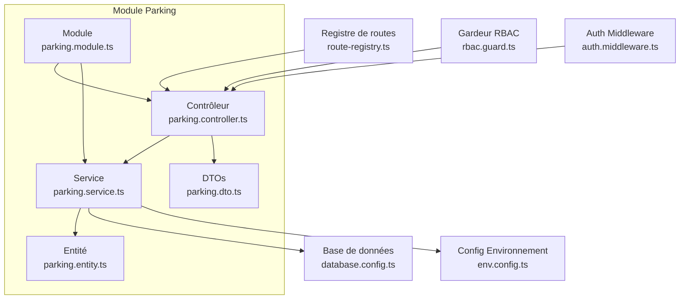
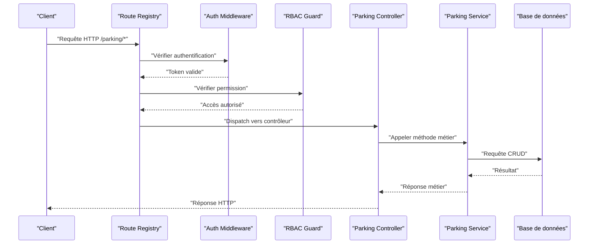
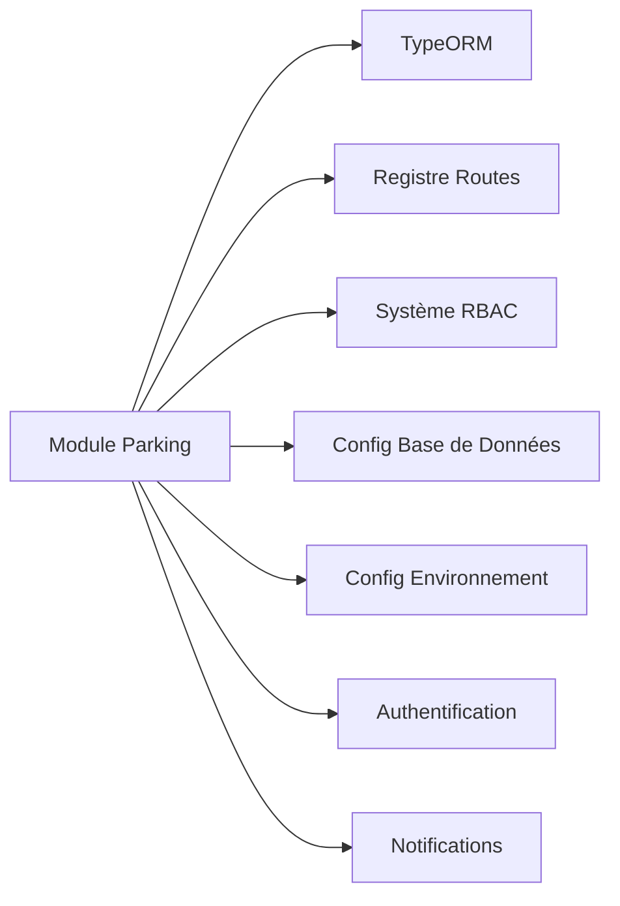
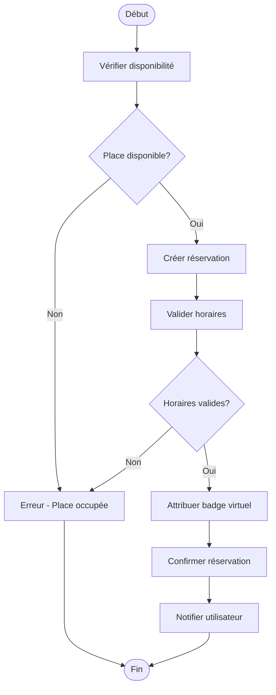

# Parking et Sécurité

<cite>
**Fichiers référencés dans ce document**
- [parking.controller.ts](file://backend/src/modules/parking/controllers/parking.controller.ts)
- [parking.service.ts](file://backend/src/modules/parking/services/parking.service.ts)
- [parking.entity.ts](file://backend/src/modules/parking/entities/parking.entity.ts)
- [parking.dto.ts](file://backend/src/modules/parking/dto/parking.dto.ts)
- [parking.module.ts](file://backend/src/modules/parking/parking.module.ts)
- [route-registry.ts](file://backend/src/routes/route-registry.ts)
- [rbac.guard.ts](file://backend/src/common/guards/rbac.guard.ts)
- [auth.middleware.ts](file://backend/src/common/middlewares/auth.middleware.ts)
- [database.config.ts](file://backend/src/config/database.config.ts)
- [env.config.ts](file://backend/src/config/env.config.ts)
- [041-module-annonces.sql](file://backend/database/migrations/041-module-annonces.sql)
- [043-permissions-critiques-manquantes.sql](file://backend/database/migrations/043-permissions-critiques-manquantes.sql)
- [IMPLEMENTATION-SECURITE-RESUME.md](file://docs/implementations/IMPLEMENTATION-SECURITE-RESUME.md)
- [GUIDE-TEST-SECURITE.md](file://docs/guides/GUIDE-TEST-SECURITE.md)
</cite>

## Table des matières
1. [Introduction](#introduction)
2. [Structure du projet](#structure-du-projet)
3. [Composants principaux](#composants-principaux)
4. [Vue d'ensemble de l'architecture](#vue-densemble-de-larchitecture)
5. [Analyse détaillée des composants](#analyse-detailee-des-composants)
6. [Analyse des dépendances](#analyse-des-dependances)
7. [Considérations de performance](#considerations-de-performance)
8. [Guide de dépannage](#guide-de-depannage)
9. [Conclusion](#conclusion)
10. [Annexes](#annexes)

## Introduction
Ce document présente le module de parking et sécurité d'eLISAschool, en se concentrant sur la gestion des places de parking, les badges d'accès, le contrôle d'accès, la vidéosurveillance, les workflows de réservation, la gestion des visiteurs, les procédures d'urgence, ainsi que les intégrations avec les systèmes physiques (contrôle d'accès, caméras, alarmes). Il décrit également la configuration des zones sécurisées, les niveaux d'accès, les alertes de sécurité, la gestion des incidents, les rapports de conformité et les bonnes pratiques opérationnelles.

Le module s'appuie sur une architecture modulaire backend (NestJS), un registre de routes centralisé, des gardeurs RBAC pour l'autorisation, et des configurations de base de données et d'environnement. Les migrations SQL et les documents de mise en œuvre fournissent le contexte fonctionnel et les règles de sécurité applicables.

## Structure du projet
Le module parking est implémenté dans le répertoire backend/src/modules/parking, structuré selon les conventions NestJS :
- Controllers : exposition des endpoints REST
- Services : logique métier et orchestration
- Entités : modèles de données persistés via TypeORM
- DTOs : schémas de validation des requêtes/réponses
- Module : déclaration des dépendances et providers

Les routes sont enregistrées via un registre global qui assemble les modules actifs. L'authentification et l'autorisation sont assurées par des middlewares et gardeurs RBAC. La persistance utilise une configuration de base de données et des migrations SQL.



**Sources du diagramme**
- [parking.controller.ts](file://backend/src/modules/parking/controllers/parking.controller.ts)
- [parking.service.ts](file://backend/src/modules/parking/services/parking.service.ts)
- [parking.entity.ts](file://backend/src/modules/parking/entities/parking.entity.ts)
- [parking.dto.ts](file://backend/src/modules/parking/dto/parking.dto.ts)
- [parking.module.ts](file://backend/src/modules/parking/parking.module.ts)
- [route-registry.ts](file://backend/src/routes/route-registry.ts)
- [rbac.guard.ts](file://backend/src/common/guards/rbac.guard.ts)
- [auth.middleware.ts](file://backend/src/common/middlewares/auth.middleware.ts)
- [database.config.ts](file://backend/src/config/database.config.ts)
- [env.config.ts](file://backend/src/config/env.config.ts)

**Sources de section**
- [parking.module.ts](file://backend/src/modules/parking/parking.module.ts)
- [route-registry.ts](file://backend/src/routes/route-registry.ts)

## Composants principaux
- Contrôleur parking : définit les points d'entrée API pour la gestion des places, réservations, accès et événements liés au parking.
- Service parking : implémente la logique métier (réservation, vérification d'accès, historique, alertes).
- Entité parking : modèle de données pour les places, réservations, badges et événements.
- DTOs : validation et typage des payloads entrants/sortants.
- Module parking : agrège les providers et configure les dépendances.
- Registre de routes : expose les endpoints du module parking.
- Gardeur RBAC et middleware Auth : contrôlent l'authentification et l'autorisation.
- Config DB et Env : gèrent la connexion à la base de données et les paramètres d'environnement.

**Sources de section**
- [parking.controller.ts](file://backend/src/modules/parking/controllers/parking.controller.ts)
- [parking.service.ts](file://backend/src/modules/parking/services/parking.service.ts)
- [parking.entity.ts](file://backend/src/modules/parking/entities/parking.entity.ts)
- [parking.dto.ts](file://backend/src/modules/parking/dto/parking.dto.ts)
- [parking.module.ts](file://backend/src/modules/parking/parking.module.ts)
- [route-registry.ts](file://backend/src/routes/route-registry.ts)
- [rbac.guard.ts](file://backend/src/common/guards/rbac.guard.ts)
- [auth.middleware.ts](file://backend/src/common/middlewares/auth.middleware.ts)
- [database.config.ts](file://backend/src/config/database.config.ts)
- [env.config.ts](file://backend/src/config/env.config.ts)

## Vue d'ensemble de l'architecture
Le flux typique d'une demande API suit cette séquence :
1. Le client envoie une requête HTTP vers un endpoint du module parking.
2. Le middleware d'authentification valide la session/token.
3. Le gardeur RBAC vérifie les permissions nécessaires.
4. Le contrôleur délègue au service pour exécuter la logique métier.
5. Le service interagit avec la base de données via l'entité TypeORM.
6. Une réponse JSON est retournée au client.



**Sources du diagramme**
- [route-registry.ts](file://backend/src/routes/route-registry.ts)
- [auth.middleware.ts](file://backend/src/common/middlewares/auth.middleware.ts)
- [rbac.guard.ts](file://backend/src/common/guards/rbac.guard.ts)
- [parking.controller.ts](file://backend/src/modules/parking/controllers/parking.controller.ts)
- [parking.service.ts](file://backend/src/modules/parking/services/parking.service.ts)
- [parking.entity.ts](file://backend/src/modules/parking/entities/parking.entity.ts)

## Analyse détaillée des composants

### Modèle de données et entités
L'entité parking représente les places de stationnement, les réservations, les badges d'accès et les événements de contrôle d'accès. Elle définit les relations entre utilisateurs, établissements, et zones sécurisées.

```mermaid
classDiagram
class PlaceParking {
+id : string
+numero : string
+etablissementId : string
+statut : enum
+horairesDisponibles : array
}
class Reservation {
+id : string
+placeId : string
+utilisateurId : string
+dateDebut : datetime
+dateFin : datetime
+statut : enum
}
class BadgeAcces {
+id : string
+utilisateurId : string
+niveauAcces : enum
+zonesAutorisees : array
+valideJusqua : date
}
class EvenementAcces {
+id : string
+badgeId : string
+zoneId : string
+heure : datetime
+statut : enum
}
PlaceParking ||--o{ Reservation : "possède"
Utilisateur ||--o{ Reservation : "réserve"
Utilisateur ||--o{ BadgeAcces : "possède"
ZoneSecurisee ||--o{ EvenementAcces : "enregistre"
```

**Sources du diagramme**
- [parking.entity.ts](file://backend/src/modules/parking/entities/parking.entity.ts)

**Sources de section**
- [parking.entity.ts](file://backend/src/modules/parking/entities/parking.entity.ts)

### Contrôleurs et endpoints API
Le contrôleur expose des endpoints REST pour :
- Gestion des places de parking (CRUD)
- Réservation et annulation
- Attribution et révocation de badges
- Consultation des historiques d'accès
- Déclenchement d'alertes et gestion d'incidents

Chaque endpoint est protégé par le middleware d'authentification et le gardeur RBAC.

**Sources de section**
- [parking.controller.ts](file://backend/src/modules/parking/controllers/parking.controller.ts)
- [route-registry.ts](file://backend/src/routes/route-registry.ts)

### Services et logique métier
Le service parking implémente :
- Validation des disponibilités et conflits de réservation
- Vérification des niveaux d'accès et autorisations
- Journalisation des événements d'accès
- Génération d'alertes de sécurité
- Intégration avec les systèmes externes (caméras, alarmes)

Il utilise des DTOs pour valider les entrées et formater les réponses.

**Sources de section**
- [parking.service.ts](file://backend/src/modules/parking/services/parking.service.ts)
- [parking.dto.ts](file://backend/src/modules/parking/dto/parking.dto.ts)

### Configuration et dépendances
Le module parking déclare ses dépendances et providers. La configuration de la base de données et les variables d'environnement sont chargées via les fichiers de config.

**Sources de section**
- [parking.module.ts](file://backend/src/modules/parking/parking.module.ts)
- [database.config.ts](file://backend/src/config/database.config.ts)
- [env.config.ts](file://backend/src/config/env.config.ts)

### Authentification et autorisation
Le middleware d'authentification vérifie les tokens JWT ou sessions. Le gardeur RBAC applique les politiques d'accès basées sur les rôles et permissions définis dans le système.

**Sources de section**
- [auth.middleware.ts](file://backend/src/common/middlewares/auth.middleware.ts)
- [rbac.guard.ts](file://backend/src/common/guards/rbac.guard.ts)

## Analyse des dépendances
Le module parking dépend de :
- TypeORM pour la persistance des données
- Le registre de routes pour l'exposition des endpoints
- Le système RBAC pour l'autorisation
- Les configurations de base de données et d'environnement
- Les modules d'authentification et de notification



**Sources du diagramme**
- [parking.module.ts](file://backend/src/modules/parking/parking.module.ts)
- [route-registry.ts](file://backend/src/routes/route-registry.ts)
- [rbac.guard.ts](file://backend/src/common/guards/rbac.guard.ts)
- [database.config.ts](file://backend/src/config/database.config.ts)
- [env.config.ts](file://backend/src/config/env.config.ts)

**Sources de section**
- [parking.module.ts](file://backend/src/modules/parking/parking.module.ts)

## Considérations de performance
- Indexation des tables liées aux places et réservations pour optimiser les requêtes fréquentes
- Mise en cache des données statiques (zones sécurisées, niveaux d'accès)
- Pagination des listes de réservations et historiques d'accès
- Traitement asynchrone des alertes et notifications
- Monitoring des performances via les outils intégrés

[Section sans sources spécifiques]

## Guide de dépannage
Problèmes courants et solutions :
- Erreurs d'authentification : vérifier les tokens JWT et les scopes
- Accès refusé : vérifier les permissions RBAC et les rôles attribués
- Échec de réservation : vérifier la disponibilité des places et les conflits horaires
- Problèmes de connexion BDD : vérifier les paramètres de connexion et les migrations appliquées
- Alertes non déclenchées : vérifier la configuration des événements et les intégrations externes

**Sources de section**
- [GUIDE-TEST-SECURITE.md](file://docs/guides/GUIDE-TEST-SECURITE.md)
- [IMPLEMENTATION-SECURITE-RESUME.md](file://docs/implementations/IMPLEMENTATION-SECURITE-RESUME.md)

## Conclusion
Le module parking et sécurité d'eLISAschool offre une solution complète pour la gestion des places de stationnement, des badges d'accès, du contrôle d'accès et de la vidéosurveillance. Grâce à une architecture modulaire, des mécanismes d'authentification et d'autorisation robustes, et des intégrations avec les systèmes physiques, il permet de sécuriser efficacement les établissements scolaires tout en offrant une expérience utilisateur fluide.

[Section sans sources spécifiques]

## Annexes

### Workflows de réservation de places
1. Vérification de la disponibilité de la place
2. Création de la réservation avec validation des horaires
3. Attribution temporaire d'un badge virtuel
4. Confirmation et notification à l'utilisateur
5. Archivage de la réservation après utilisation



**Sources du diagramme**
- [parking.service.ts](file://backend/src/modules/parking/services/parking.service.ts)
- [parking.dto.ts](file://backend/src/modules/parking/dto/parking.dto.ts)

### Gestion des visiteurs
- Enregistrement préalable des visiteurs
- Attribution de badges temporaires
- Limitation des zones accessibles
- Suivi des entrées/sorties
- Alertes en cas de comportement suspect

### Procédures d'urgence
- Déclenchement automatique des alarmes
- Verrouillage des accès critiques
- Notification immédiate des responsables
- Activation des protocoles de confinement
- Journalisation complète des événements

### Configuration des zones sécurisées
- Définition des périmètres géographiques
- Attribution des niveaux d'accès
- Configuration des horaires d'accès
- Paramétrage des alertes conditionnelles

### Niveaux d'accès
- Niveau 1 : Zones communes (hall, réfectoire)
- Niveau 2 : Zones pédagogiques (salles de classe)
- Niveau 3 : Zones techniques (salle serveur)
- Niveau 4 : Zones sensibles (direction, archives)

### Alertes de sécurité
- Tentatives d'accès non autorisées
- Présence prolongée dans les zones interdites
- Comportements anormaux détectés
- Pannes des équipements de sécurité

### Intégrations systèmes
- Contrôle d'accès physique (lecteurs de badges)
- Caméras de surveillance (enregistrement continu)
- Systèmes d'alarme (détection intrusion)
- Notifications (SMS, email, push)

### Gestion des incidents
- Classification des incidents (mineur, majeur, critique)
- Investigation et collecte de preuves
- Actions correctives et préventives
- Rapports et analyses post-incident

### Conformité aux normes
- Respect des réglementations locales et internationales
- Protection des données personnelles
- Sauvegarde et archivage sécurisé
- Audits réguliers et certifications

**Sources de section**
- [041-module-annonces.sql](file://backend/database/migrations/041-module-annonces.sql)
- [043-permissions-critiques-manquantes.sql](file://backend/database/migrations/043-permissions-critiques-manquantes.sql)
- [IMPLEMENTATION-SECURITE-RESUME.md](file://docs/implementations/IMPLEMENTATION-SECURITE-RESUME.md)
- [GUIDE-TEST-SECURITE.md](file://docs/guides/GUIDE-TEST-SECURITE.md)