# Transport Scolaire

<cite>
**Fichiers référencés dans ce document**
- [backend/src/modules/transport/index.ts](file://backend/src/modules/transport/index.ts)
- [backend/src/modules/transport/entities](file://backend/src/modules/transport/entities)
- [backend/src/modules/transport/controllers](file://backend/src/modules/transport/controllers)
- [backend/src/modules/transport/services](file://backend/src/modules/transport/services)
- [backend/src/modules/transport/dto](file://backend/src/modules/transport/dto)
- [backend/src/routes/route-registry.ts](file://backend/src/routes/route-registry.ts)
- [backend/database/migrations](file://backend/database/migrations)
- [backend/src/modules/finances](file://backend/src/modules/finances)
- [backend/src/modules/notifications](file://backend/src/modules/notifications)
- [backend/src/modules/auth](file://backend/src/modules/auth)
- [backend/src/modules/eleves](file://backend/src/modules/eleves)
- [backend/src/modules/personnel](file://backend/src/modules/personnel)
</cite>

## Table des matières
1. [Introduction](#introduction)
2. [Structure du projet](#structure-du-projet)
3. [Composants clés](#composants-clés)
4. [Vue d’ensemble de l’architecture](#vue-densemble-de-larchitecture)
5. [Analyse détaillée des composants](#analyse-detaillee-des-composants)
6. [Analyse des dépendances](#analyse-des-dependances)
7. [Considérations de performance](#considerations-de-performance)
8. [Guide de dépannage](#guide-de-depannage)
9. [Conclusion](#conclusion)
10. [Annexes](#annexes)

## Introduction
Ce document présente la documentation technique et fonctionnelle du module de transport scolaire d’eLISAschool. Il couvre la gestion des itinéraires, véhicules, chauffeurs, arrêts et horaires, ainsi que les workflows d’affectation des élèves aux trajets, planification des courses, suivi en temps réel, gestion des retards ou annulations, notifications aux parents, intégrations avec le système de paiement pour les frais de transport, rapports de consommation de carburant et maintenance des véhicules. Les aspects sécurité, assurance et conformité réglementaire sont également abordés.

## Structure du projet
Le module de transport est organisé selon une architecture modulaire standardisée : entités (modèles de données), contrôleurs (API REST), services (logique métier), DTOs (contrats de données) et migrations (schéma de base de données). Le registre des routes centralise l’exposition des endpoints.

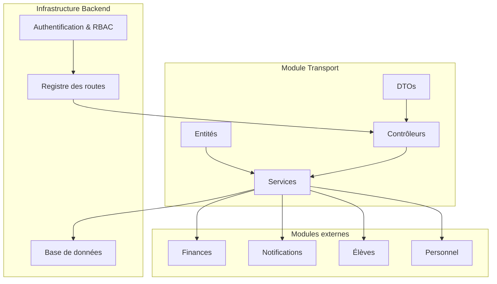

**Diagramme sources**
- [backend/src/modules/transport/index.ts](file://backend/src/modules/transport/index.ts)
- [backend/src/routes/route-registry.ts](file://backend/src/routes/route-registry.ts)

**Section sources**
- [backend/src/modules/transport/index.ts](file://backend/src/modules/transport/index.ts)
- [backend/src/routes/route-registry.ts](file://backend/src/routes/route-registry.ts)

## Composants clés
- Entités : modèles de données pour itinéraires, véhicules, chauffeurs, arrêts, courses, affectations élèves, planning, suivi, alertes, paiements, consommations, maintenance.
- Contrôleurs : exposition des API REST pour chaque ressource.
- Services : logique métier (planification, optimisation d’itinéraires, calculs de coûts, notifications, intégrations financières).
- DTOs : validation et typage des requêtes/réponses.
- Migrations : schéma de base de données et évolutions.

**Section sources**
- [backend/src/modules/transport/entities](file://backend/src/modules/transport/entities)
- [backend/src/modules/transport/controllers](file://backend/src/modules/transport/controllers)
- [backend/src/modules/transport/services](file://backend/src/modules/transport/services)
- [backend/src/modules/transport/dto](file://backend/src/modules/transport/dto)
- [backend/database/migrations](file://backend/database/migrations)

## Vue d’ensemble de l’architecture
Le module expose des endpoints sécurisés via le registre des routes. Les contrôleurs délèguent au service qui orchestre les opérations métier en interagissant avec la base de données et les modules externes (finances, notifications, élèves, personnel).

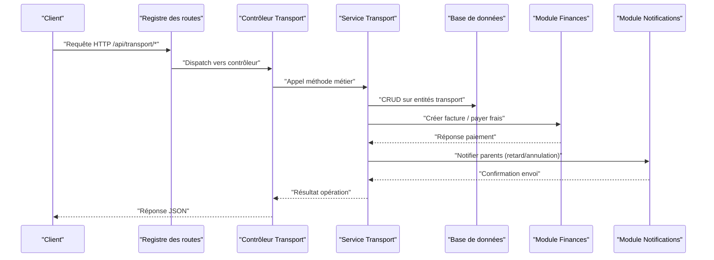

**Diagramme sources**
- [backend/src/routes/route-registry.ts](file://backend/src/routes/route-registry.ts)
- [backend/src/modules/transport/controllers](file://backend/src/modules/transport/controllers)
- [backend/src/modules/transport/services](file://backend/src/modules/transport/services)
- [backend/src/modules/finances](file://backend/src/modules/finances)
- [backend/src/modules/notifications](file://backend/src/modules/notifications)

## Analyse détaillée des composants

### Gestion des itinéraires
- Modélisation : points d’arrêt, séquence d’ordre, distances estimées, temps de trajet, conditions spéciales (zones scolaires, péages).
- Optimisation : algorithmes de minimisation de distance/temps, contraintes de capacité véhicule, fenêtres horaires.
- Configuration complexe : regroupement d’arrêts par zone, itinéraires alternatifs, variations saisonnières.

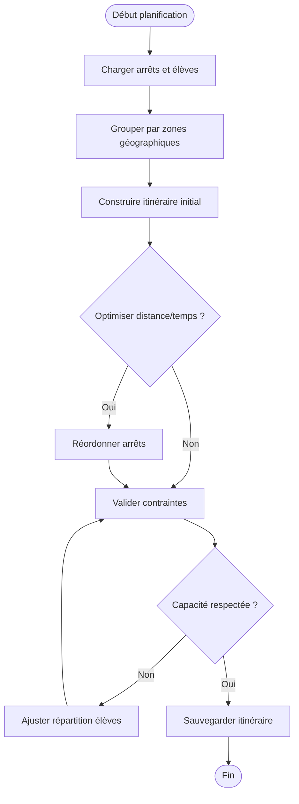

**Diagramme sources**
- [backend/src/modules/transport/services](file://backend/src/modules/transport/services)
- [backend/src/modules/transport/entities](file://backend/src/modules/transport/entities)

**Section sources**
- [backend/src/modules/transport/services](file://backend/src/modules/transport/services)
- [backend/src/modules/transport/entities](file://backend/src/modules/transport/entities)

### Gestion des véhicules et chauffeurs
- Véhicules : immatriculation, capacité, type, état, localisation, historique maintenance.
- Chauffeurs : identités, qualifications, disponibilités, affectations, suivi GPS.
- Affectation : attribution dynamique basée sur disponibilité, compétences, charge de travail.

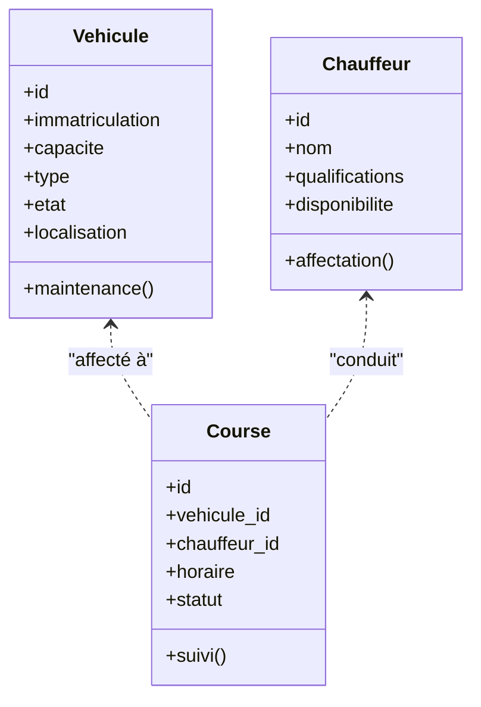

**Diagramme sources**
- [backend/src/modules/transport/entities](file://backend/src/modules/transport/entities)
- [backend/src/modules/transport/services](file://backend/src/modules/transport/services)

**Section sources**
- [backend/src/modules/transport/entities](file://backend/src/modules/transport/entities)
- [backend/src/modules/transport/services](file://backend/src/modules/transport/services)

### Arrêts et horaires
- Arrêts : coordonnées, nom, capacité, horaires d’ouverture/fermeture.
- Horaires : créneaux matinal et vespéral, tolérances, répétitions hebdomadaires.
- Planification : génération automatique des courses par jour, ajustements dynamiques.

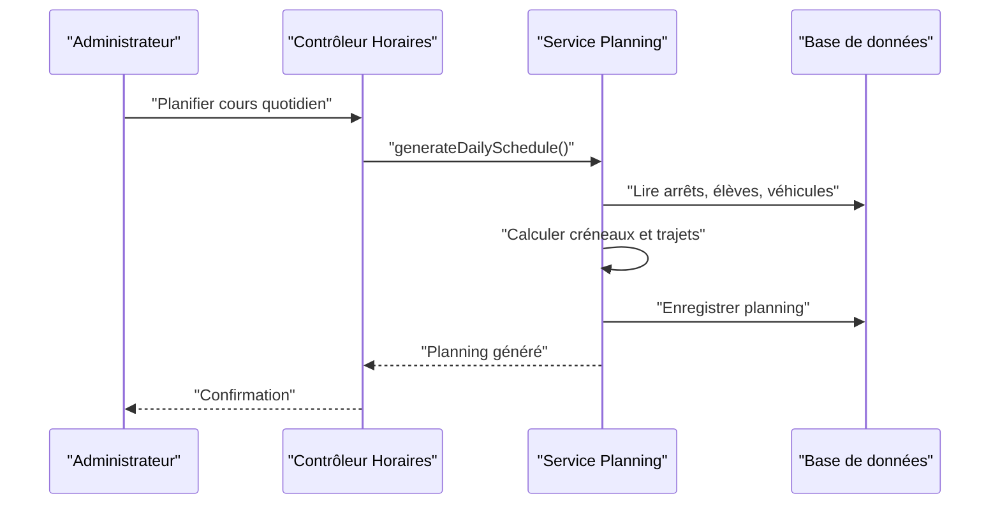

**Diagramme sources**
- [backend/src/modules/transport/controllers](file://backend/src/modules/transport/controllers)
- [backend/src/modules/transport/services](file://backend/src/modules/transport/services)

**Section sources**
- [backend/src/modules/transport/controllers](file://backend/src/modules/transport/controllers)
- [backend/src/modules/transport/services](file://backend/src/modules/transport/services)

### Affectation des élèves aux trajets
- Règles : proximité domicile-école, capacité véhicule, préférences responsables, besoins spéciaux.
- Workflow : extraction liste élèves, clustering géographique, assignation dynamique, validation.

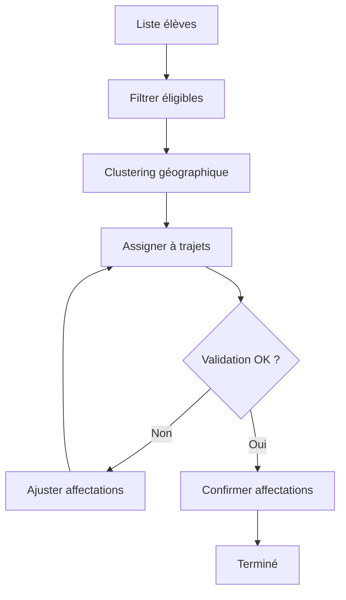

**Diagramme sources**
- [backend/src/modules/transport/services](file://backend/src/modules/transport/services)
- [backend/src/modules/eleves](file://backend/src/modules/eleves)

**Section sources**
- [backend/src/modules/transport/services](file://backend/src/modules/transport/services)
- [backend/src/modules/eleves](file://backend/src/modules/eleves)

### Planification des courses et suivi en temps réel
- Planification : génération automatique, modifications manuelles, validations croisées.
- Suivi : position GPS véhicule, statut course (en route, retard, terminé), alertes automatiques.

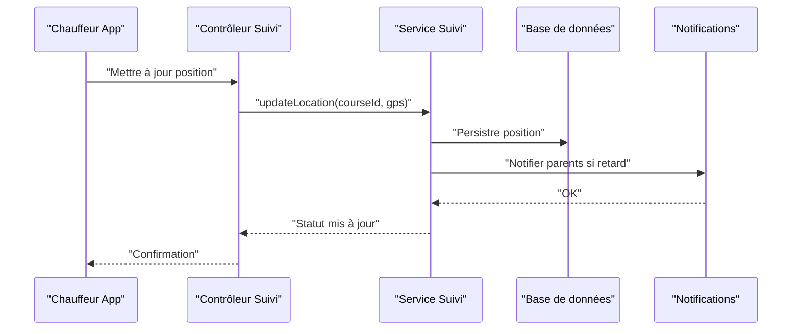

**Diagramme sources**
- [backend/src/modules/transport/controllers](file://backend/src/modules/transport/controllers)
- [backend/src/modules/transport/services](file://backend/src/modules/transport/services)
- [backend/src/modules/notifications](file://backend/src/modules/notifications)

**Section sources**
- [backend/src/modules/transport/controllers](file://backend/src/modules/transport/controllers)
- [backend/src/modules/transport/services](file://backend/src/modules/transport/services)
- [backend/src/modules/notifications](file://backend/src/modules/notifications)

### Gestion des retards et annulations
- Détection : seuils de retard basés sur ETA vs horaire prévu.
- Actions : notification parents, reprogrammation partielle, journalisation.

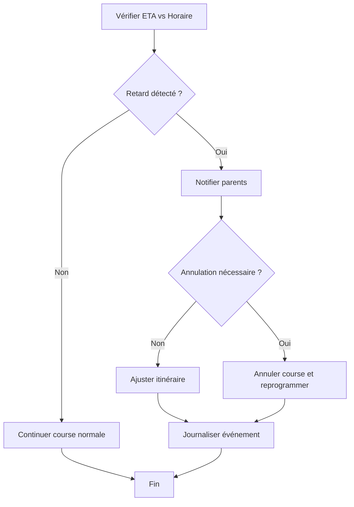

**Diagramme sources**
- [backend/src/modules/transport/services](file://backend/src/modules/transport/services)
- [backend/src/modules/notifications](file://backend/src/modules/notifications)

**Section sources**
- [backend/src/modules/transport/services](file://backend/src/modules/transport/services)
- [backend/src/modules/notifications](file://backend/src/modules/notifications)

### Intégration avec le système de paiement
- Frais de transport : tarification par élève, abonnements, réductions.
- Flux : création facture, paiement, confirmation, remboursement si annulation.

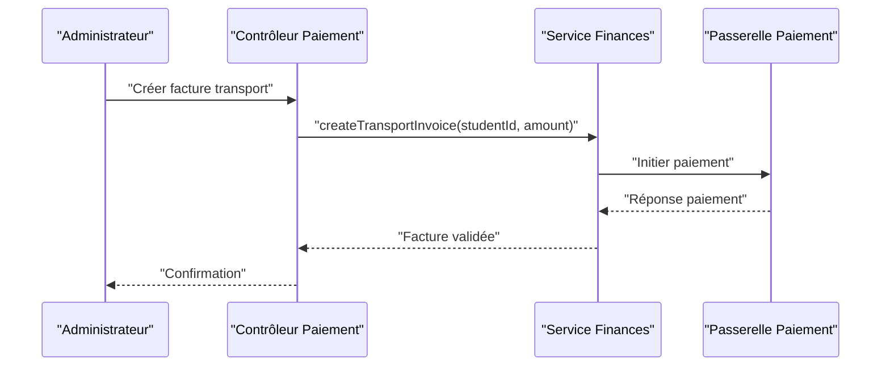

**Diagramme sources**
- [backend/src/modules/transport/controllers](file://backend/src/modules/transport/controllers)
- [backend/src/modules/finances](file://backend/src/modules/finances)

**Section sources**
- [backend/src/modules/transport/controllers](file://backend/src/modules/transport/controllers)
- [backend/src/modules/finances](file://backend/src/modules/finances)

### Rapports de consommation de carburant et maintenance
- Consommation : relevés kilométriques, litres consommés, coût unitaire.
- Maintenance : interventions planifiées, historiques, alertes préventives.

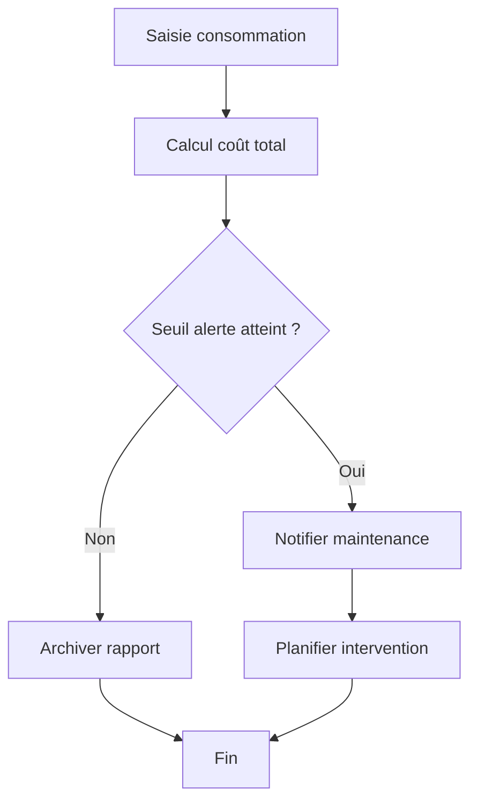

**Diagramme sources**
- [backend/src/modules/transport/services](file://backend/src/modules/transport/services)

**Section sources**
- [backend/src/modules/transport/services](file://backend/src/modules/transport/services)

### Sécurité, assurance et conformité réglementaire
- Authentification et autorisation : JWT, RBAC, vérification des rôles pour accès aux ressources sensibles.
- Assurance : couverture des véhicules, responsabilités, documents obligatoires.
- Conformité : règles locales de transport scolaire, limites de vitesse, heures de conduite, formation chauffeurs.

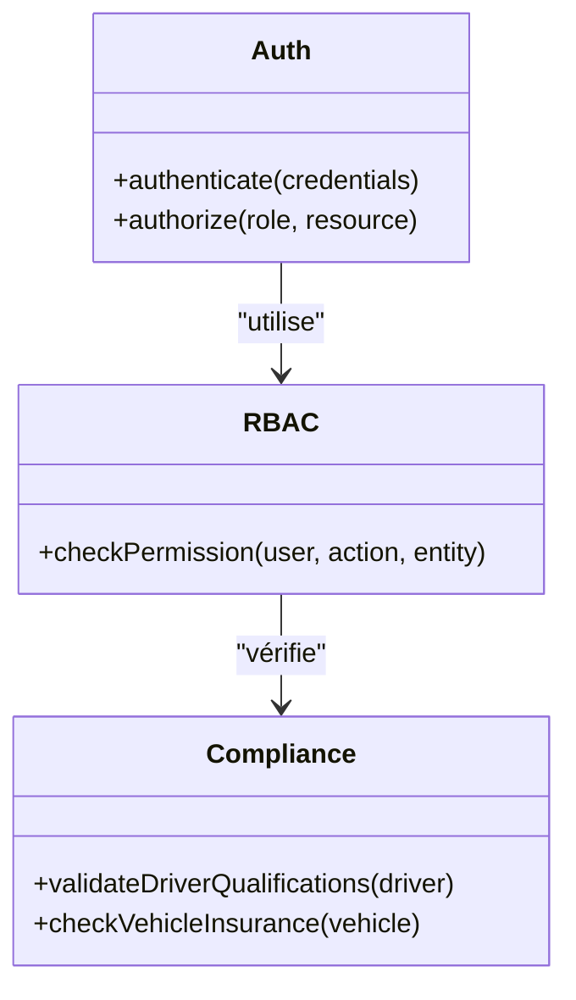

**Diagramme sources**
- [backend/src/modules/auth](file://backend/src/modules/auth)
- [backend/src/modules/personnel](file://backend/src/modules/personnel)

**Section sources**
- [backend/src/modules/auth](file://backend/src/modules/auth)
- [backend/src/modules/personnel](file://backend/src/modules/personnel)

## Analyse des dépendances
Le module transport dépend de plusieurs modules internes : finances pour les paiements, notifications pour les alertes, élèves pour les données d’affectation, personnel pour les chauffeurs. L’authentification et RBAC protègent les accès.

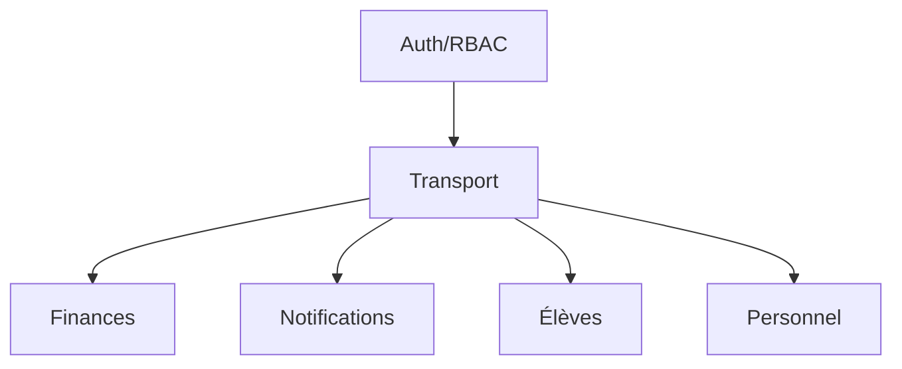

**Diagramme sources**
- [backend/src/modules/transport/index.ts](file://backend/src/modules/transport/index.ts)
- [backend/src/modules/finances](file://backend/src/modules/finances)
- [backend/src/modules/notifications](file://backend/src/modules/notifications)
- [backend/src/modules/eleves](file://backend/src/modules/eleves)
- [backend/src/modules/personnel](file://backend/src/modules/personnel)
- [backend/src/modules/auth](file://backend/src/modules/auth)

**Section sources**
- [backend/src/modules/transport/index.ts](file://backend/src/modules/transport/index.ts)
- [backend/src/modules/finances](file://backend/src/modules/finances)
- [backend/src/modules/notifications](file://backend/src/modules/notifications)
- [backend/src/modules/eleves](file://backend/src/modules/eleves)
- [backend/src/modules/personnel](file://backend/src/modules/personnel)
- [backend/src/modules/auth](file://backend/src/modules/auth)

## Considérations de performance
- Indexation des tables critiques : arrêts, courses, affectations, positions GPS.
- Mise en cache des itinéraires fréquents et statuts de courses.
- Traitement asynchrone des notifications et calculs d’optimisation.
- Pagination et filtrage efficace des listes volumineuses.

[Pas de sources nécessaires car cette section fournit des conseils généraux]

## Guide de dépannage
- Erreurs d’authentification : vérifier JWT, permissions RBAC, rôles utilisateur.
- Problèmes de synchronisation GPS : valider flux de mise à jour, persistance, latence réseau.
- Échecs de paiement : logs passerelle, cohérence factures, remboursements.
- Retards non détectés : seuils ETA, fuseaux horaires, mises à jour course.

**Section sources**
- [backend/src/modules/auth](file://backend/src/modules/auth)
- [backend/src/modules/transport/services](file://backend/src/modules/transport/services)
- [backend/src/modules/finances](file://backend/src/modules/finances)

## Conclusion
Le module de transport scolaire d’eLISAschool offre une solution complète couvrant la planification, l’optimisation, le suivi en temps réel, les paiements, les notifications et la conformité réglementaire. Son architecture modulaire permet une intégration fluide avec les autres modules et une évolutivité adaptée aux besoins complexes des établissements scolaires.

[Pas de sources nécessaires car cette section résume sans analyser de fichiers spécifiques]

## Annexes
- Exemples de configuration d’itinéraires complexes : regroupements par zones, horaires variables, capacités dynamiques.
- Calculs d’itinéraires optimisés : algorithmes de clustering, contraintes de temps et distance.
- Notifications aux parents : templates, canaux (SMS, email, push), déclencheurs.
- Rapports de carburant et maintenance : formats d’export, alertes automatiques.

[Pas de sources nécessaires car cette section propose des informations conceptuelles]