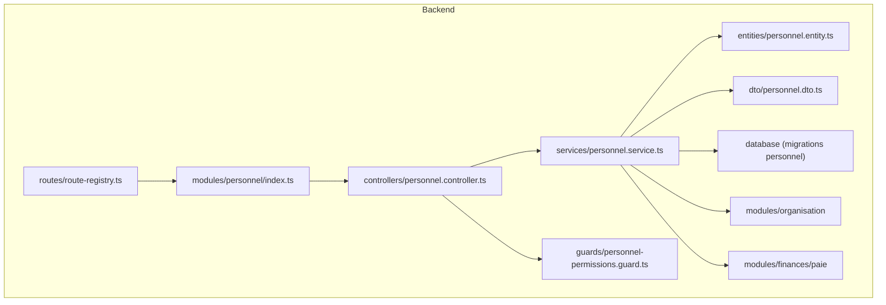
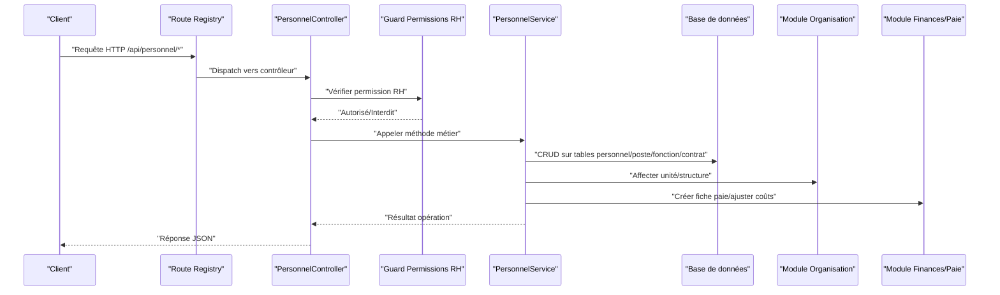
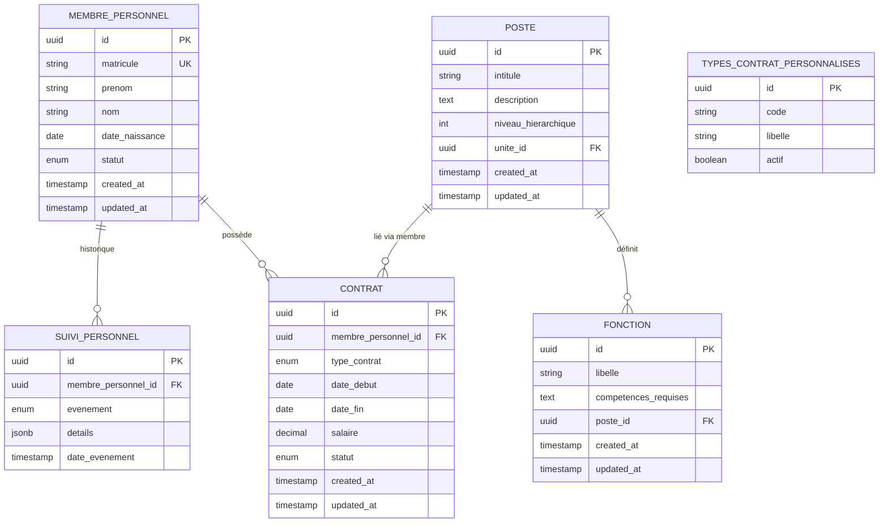
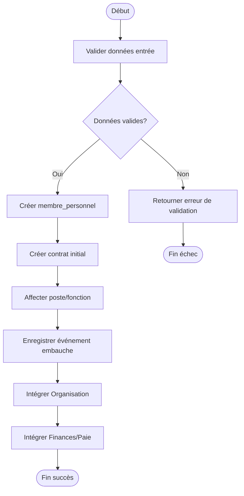
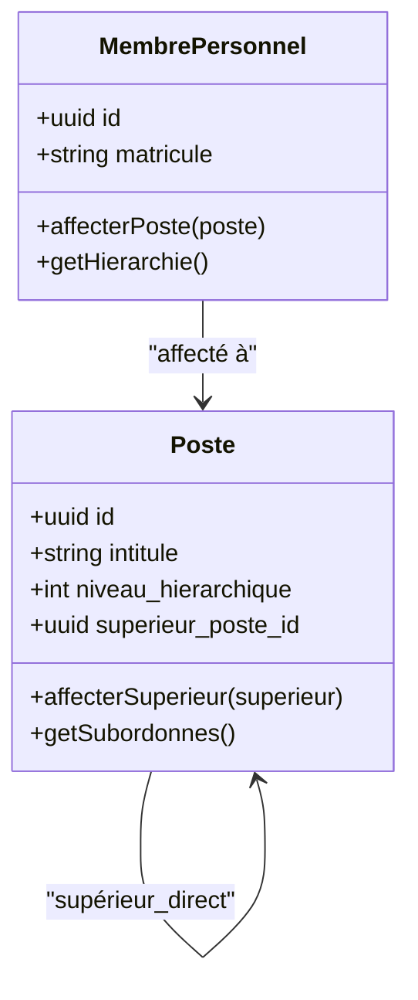
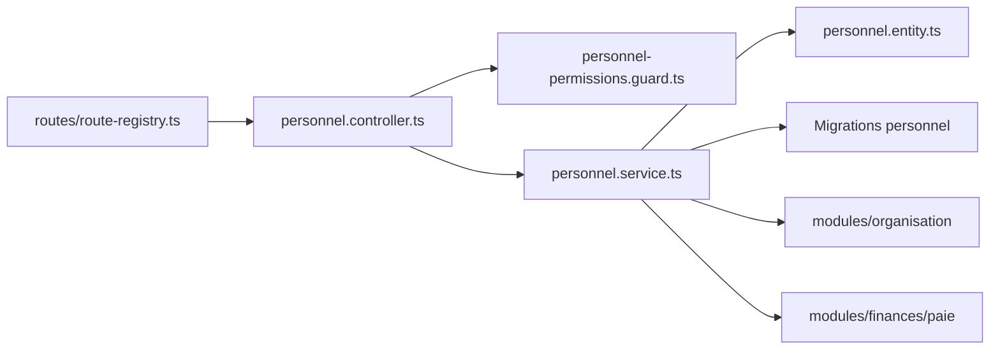

# Gestion du Personnel

<cite>
**Fichiers référencés dans ce document**
- [016-module-personnel-rh-phase1.sql](file://backend/database/migrations/016-module-personnel-rh-phase1.sql)
- [017-module-personnel-rh-phase2.sql](file://backend/database/migrations/017-module-personnel-rh-phase2.sql)
- [018-module-personnel-rh-phase3.sql](file://backend/database/migrations/018-module-personnel-rh-phase3.sql)
- [019-module-personnel-rh-phase4.sql](file://backend/database/migrations/019-module-personnel-rh-phase4.sql)
- [020-module-personnel-rh-phase5.sql](file://backend/database/migrations/020-module-personnel-rh-phase5.sql)
- [021-module-personnel-rh-permissions-attribution.sql](file://backend/database/migrations/021-module-personnel-rh-permissions-attribution.sql)
- [022-module-personnel-rh-complete.sql](file://backend/database/migrations/022-module-personnel-rh-complete.sql)
- [026-personnel-champs-additionnels.sql](file://backend/database/migrations/026-personnel-champs-additionnels.sql)
- [046-types-contrat-personnalises.sql](file://backend/database/migrations/046-types-contrat-personnalises.sql)
- [031-suivi-personnel.ts](file://backend/database/migrations/031-suivi-personnel.ts)
- [personnel.constants.ts](file://backend/src/shared/constants/personnel.constants.ts)
- [route-registry.ts](file://backend/src/routes/route-registry.ts)
- [index.ts (modules personnel)](file://backend/src/modules/personnel/index.ts)
- [controller personnel](file://backend/src/modules/personnel/controllers/personnel.controller.ts)
- [service personnel](file://backend/src/modules/personnel/services/personnel.service.ts)
- [entity personnel](file://backend/src/modules/personnel/entities/personnel.entity.ts)
- [dto personnel](file://backend/src/modules/personnel/dto/personnel.dto.ts)
- [guard permissions RH](file://backend/src/modules/personnel/guards/personnel-permissions.guard.ts)
- [module organisation](file://backend/src/modules/organisation/index.ts)
- [migration organisation](file://backend/database/migrations/109-refonte-organisation.sql)
- [migration 122-hierarchie-superieur-poste.sql](file://backend/database/migrations/122-hierarchie-superieur-poste.sql)
- [migration 125-organigramme-read-tous-roles.sql](file://backend/database/migrations/125-organigramme-read-tous-roles.sql)
- [migration finances phase1](file://backend/database/migrations/010-module-finances.sql)
- [migration paie étendue](file://backend/database/migrations/029-paie-etendue.sql)
</cite>

## Table des matières
1. [Introduction](#introduction)
2. [Structure du projet](#structure-du-projet)
3. [Composants clés](#composants-clés)
4. [Vue d'ensemble de l'architecture](#vue-densemble-de-larchitecture)
5. [Analyse détaillée des composants](#analyse-detaillee-des-composants)
6. [Analyse des dépendances](#analyse-des-dependances)
7. [Considérations de performance](#considerations-de-performance)
8. [Guide de dépannage](#guide-de-depannage)
9. [Conclusion](#conclusion)
10. [Annexes](#annexes)

## Introduction
Ce document décrit le module de gestion du personnel d'eLISAschool, centré sur les entités membre_personnel, poste, fonction et contrat, ainsi que les workflows de création et modification de fiches employé, la hiérarchie et les rapports hiérarchiques. Il couvre également les API REST pour le CRUD du personnel, les validations métier, les permissions RBAC spécifiques aux Ressources Humaines, et les intégrations avec les modules Organisation et Finances/Paie. Des exemples concrets illustrent les scénarios d'embauche, promotion, transfert et fin de contrat.

## Structure du projet
Le module personnel est implémenté sous backend/src/modules/personnel avec ses contrôleurs, services, entités et DTOs. Les schémas de base de données sont définis par les migrations SQL/TS dédiées au personnel RH. Les routes sont enregistrées via le registre central.

**Sources de diagramme**
- [route-registry.ts](file://backend/src/routes/route-registry.ts)
- [index.ts (modules personnel)](file://backend/src/modules/personnel/index.ts)
- [controller personnel](file://backend/src/modules/personnel/controllers/personnel.controller.ts)
- [service personnel](file://backend/src/modules/personnel/services/personnel.service.ts)
- [entity personnel](file://backend/src/modules/personnel/entities/personnel.entity.ts)
- [dto personnel](file://backend/src/modules/personnel/dto/personnel.dto.ts)
- [guard permissions RH](file://backend/src/modules/personnel/guards/personnel-permissions.guard.ts)

**Sources de section**
- [route-registry.ts](file://backend/src/routes/route-registry.ts)
- [index.ts (modules personnel)](file://backend/src/modules/personnel/index.ts)

## Composants clés
- Entités et modèles: membre_personnel, poste, fonction, contrat, suivi_personnel, types_contrat_personnalises.
- Contrôleurs: endpoints REST pour le personnel (CRUD, affectation poste/fonction, contrats).
- Services: logique métier, validations, orchestration entre entités et modules externes.
- DTOs: validation et typage des requêtes/réponses.
- Guards: vérification des permissions RBAC spécifiques RH.
- Migrations: définition du schéma, index, contraintes et évolutions.

**Sources de section**
- [016-module-personnel-rh-phase1.sql](file://backend/database/migrations/016-module-personnel-rh-phase1.sql)
- [017-module-personnel-rh-phase2.sql](file://backend/database/migrations/017-module-personnel-rh-phase2.sql)
- [018-module-personnel-rh-phase3.sql](file://backend/database/migrations/018-module-personnel-rh-phase3.sql)
- [019-module-personnel-rh-phase4.sql](file://backend/database/migrations/019-module-personnel-rh-phase4.sql)
- [020-module-personnel-rh-phase5.sql](file://backend/database/migrations/020-module-personnel-rh-phase5.sql)
- [026-personnel-champs-additionnels.sql](file://backend/database/migrations/026-personnel-champs-additionnels.sql)
- [046-types-contrat-personnalises.sql](file://backend/database/migrations/046-types-contrat-personnalises.sql)
- [personnel.constants.ts](file://backend/src/shared/constants/personnel.constants.ts)
- [controller personnel](file://backend/src/modules/personnel/controllers/personnel.controller.ts)
- [service personnel](file://backend/src/modules/personnel/services/personnel.service.ts)
- [dto personnel](file://backend/src/modules/personnel/dto/personnel.dto.ts)
- [guard permissions RH](file://backend/src/modules/personnel/guards/personnel-permissions.guard.ts)

## Vue d'ensemble de l'architecture
Le module expose des endpoints REST protégés par un guard RBAC. Le contrôleur délègue au service qui applique les règles métier et interagit avec les entités et modules liés (Organisation, Finances/Paie). La base de données est versionnée par des migrations.

**Sources de diagramme**
- [route-registry.ts](file://backend/src/routes/route-registry.ts)
- [controller personnel](file://backend/src/modules/personnel/controllers/personnel.controller.ts)
- [guard permissions RH](file://backend/src/modules/personnel/guards/personnel-permissions.guard.ts)
- [service personnel](file://backend/src/modules/personnel/services/personnel.service.ts)
- [module organisation](file://backend/src/modules/organisation/index.ts)
- [migration paie étendue](file://backend/database/migrations/029-paie-etendue.sql)

## Analyse détaillée des composants

### Entités et modèle de données
Les tables principales incluent:
- membre_personnel: identifiants, informations personnelles, matricule, statut, dates clés.
- poste: intitulé, description, niveau hiérarchique, unité rattachée.
- fonction: rôle opérationnel, compétences requises, lien avec poste.
- contrat: type, dates, salaire, statut, lien avec membre_personnel.
- suivi_personnel: historique des événements (embauche, promotion, transfert, fin).
- types_contrat_personnalises: extension des types de contrat.

**Sources de diagramme**
- [016-module-personnel-rh-phase1.sql](file://backend/database/migrations/016-module-personnel-rh-phase1.sql)
- [017-module-personnel-rh-phase2.sql](file://backend/database/migrations/017-module-personnel-rh-phase2.sql)
- [018-module-personnel-rh-phase3.sql](file://backend/database/migrations/018-module-personnel-rh-phase3.sql)
- [019-module-personnel-rh-phase4.sql](file://backend/database/migrations/019-module-personnel-rh-phase4.sql)
- [020-module-personnel-rh-phase5.sql](file://backend/database/migrations/020-module-personnel-rh-phase5.sql)
- [026-personnel-champs-additionnels.sql](file://backend/database/migrations/026-personnel-champs-additionnels.sql)
- [046-types-contrat-personnalises.sql](file://backend/database/migrations/046-types-contrat-personnalises.sql)
- [031-suivi-personnel.ts](file://backend/database/migrations/031-suivi-personnel.ts)

**Sources de section**
- [016-module-personnel-rh-phase1.sql](file://backend/database/migrations/016-module-personnel-rh-phase1.sql)
- [017-module-personnel-rh-phase2.sql](file://backend/database/migrations/017-module-personnel-rh-phase2.sql)
- [018-module-personnel-rh-phase3.sql](file://backend/database/migrations/018-module-personnel-rh-phase3.sql)
- [019-module-personnel-rh-phase4.sql](file://backend/database/migrations/019-module-personnel-rh-phase4.sql)
- [020-module-personnel-rh-phase5.sql](file://backend/database/migrations/020-module-personnel-rh-phase5.sql)
- [026-personnel-champs-additionnels.sql](file://backend/database/migrations/026-personnel-champs-additionnels.sql)
- [046-types-contrat-personnalises.sql](file://backend/database/migrations/046-types-contrat-personnalises.sql)
- [031-suivi-personnel.ts](file://backend/database/migrations/031-suivi-personnel.ts)

### API Endpoints CRUD du personnel
Endpoints principaux (méthodes HTTP et chemins):
- GET /api/personnel: liste paginée, filtres (statut, unité, poste).
- GET /api/personnel/:id: détails d’un membre.
- POST /api/personnel: création d’une fiche employé.
- PUT /api/personnel/:id: mise à jour des informations.
- DELETE /api/personnel/:id: retrait/soft delete.
- POST /api/personnel/:id/affecter-poste: affectation ou changement de poste.
- POST /api/personnel/:id/affecter-fonction: attribution de fonction.
- POST /api/personnel/:id/contrat: création de contrat.
- PUT /api/personnel/:id/contrat/:contratId: modification de contrat.
- POST /api/personnel/:id/historique: ajout événement (promotion, transfert, fin).

Chaque endpoint est protégé par le guard RBAC RH.

**Sources de section**
- [controller personnel](file://backend/src/modules/personnel/controllers/personnel.controller.ts)
- [guard permissions RH](file://backend/src/modules/personnel/guards/personnel-permissions.guard.ts)

### Workflows de création et modification de fiches employé
Flux de création:
- Validation des champs obligatoires et cohérence des dates.
- Création de membre_personnel et premier contrat.
- Affectation initiale de poste/fonction.
- Enregistrement dans suivi_personnel (événement embauche).
- Intégration avec Organisation (unité) et Finances (fiche paie).

Flux de modification:
- Vérification des permissions et verrous (ex: contrat actif).
- Mise à jour des champs autorisés.
- Historisation des changements.
- Propagation vers modules liés si nécessaire.

**Sources de diagramme**
- [service personnel](file://backend/src/modules/personnel/services/personnel.service.ts)
- [dto personnel](file://backend/src/modules/personnel/dto/personnel.dto.ts)
- [031-suivi-personnel.ts](file://backend/database/migrations/031-suivi-personnel.ts)

**Sources de section**
- [service personnel](file://backend/src/modules/personnel/services/personnel.service.ts)
- [dto personnel](file://backend/src/modules/personnel/dto/personnel.dto.ts)
- [031-suivi-personnel.ts](file://backend/database/migrations/031-suivi-personnel.ts)

### Gestion des hiérarchies et rapports hiérarchiques
- Hiérarchie des postes: niveau hiérarchique, supérieur direct.
- Organigramme: lecture des rôles et relations supérieurs/subordonnés.
- Contraintes: éviter cycles, garantir unicité du supérieur par poste.

**Sources de diagramme**
- [122-hierarchie-superieur-poste.sql](file://backend/database/migrations/122-hierarchie-superieur-poste.sql)
- [125-organigramme-read-tous-roles.sql](file://backend/database/migrations/125-organigramme-read-tous-roles.sql)

**Sources de section**
- [122-hierarchie-superieur-poste.sql](file://backend/database/migrations/122-hierarchie-superieur-poste.sql)
- [125-organigramme-read-tous-roles.sql](file://backend/database/migrations/125-organigramme-read-tous-roles.sql)

### Permissions RBAC spécifiques RH
- Rôles: DRH, Responsable RH, Assistant RH.
- Permissions: lire, créer, modifier, supprimer, affecter poste/fonction, gérer contrats, voir organigramme.
- Guard: vérifie permission avant exécution des contrôleurs.

**Sources de section**
- [021-module-personnel-rh-permissions-attribution.sql](file://backend/database/migrations/021-module-personnel-rh-permissions-attribution.sql)
- [guard permissions RH](file://backend/src/modules/personnel/guards/personnel-permissions.guard.ts)

### Intégrations avec Organisation et Finances/Paie
- Organisation: affectation à une unité, structure académique, disponibilité horaire.
- Finances/Paie: création de fiche paie, ajustements salariaux, coûts par unité.

**Sources de section**
- [module organisation](file://backend/src/modules/organisation/index.ts)
- [migration organisation](file://backend/database/migrations/109-refonte-organisation.sql)
- [migration finances phase1](file://backend/database/migrations/010-module-finances.sql)
- [migration paie étendue](file://backend/database/migrations/029-paie-etendue.sql)

### Cas d'utilisation concrets
- Embauche: création membre, contrat, affectation poste/fonction, enregistrement événement, intégration paie.
- Promotion: changement de poste/niveau, mise à jour contrat, historique promotion.
- Transfert: changement d’unité/poste, validation disponibilité, synchronisation planning.
- Fin de contrat: clôture contrat, archivage, notification paie, événement fin.

**Sources de section**
- [service personnel](file://backend/src/modules/personnel/services/personnel.service.ts)
- [031-suivi-personnel.ts](file://backend/database/migrations/031-suivi-personnel.ts)

## Analyse des dépendances
Le module personnel dépend des migrations de schéma, du guard RBAC, des modules Organisation et Finances/Paie. Les routes sont centralisées.

**Sources de diagramme**
- [route-registry.ts](file://backend/src/routes/route-registry.ts)
- [controller personnel](file://backend/src/modules/personnel/controllers/personnel.controller.ts)
- [guard permissions RH](file://backend/src/modules/personnel/guards/personnel-permissions.guard.ts)
- [service personnel](file://backend/src/modules/personnel/services/personnel.service.ts)
- [entity personnel](file://backend/src/modules/personnel/entities/personnel.entity.ts)

**Sources de section**
- [route-registry.ts](file://backend/src/routes/route-registry.ts)
- [controller personnel](file://backend/src/modules/personnel/controllers/personnel.controller.ts)
- [guard permissions RH](file://backend/src/modules/personnel/guards/personnel-permissions.guard.ts)
- [service personnel](file://backend/src/modules/personnel/services/personnel.service.ts)
- [entity personnel](file://backend/src/modules/personnel/entities/personnel.entity.ts)

## Considérations de performance
- Indexation des colonnes fréquentes (matricule, statut, unite_id, poste_id).
- Pagination et filtrage côté serveur pour listes volumineuses.
- Transactions pour opérations multi-tables (création membre+contrat+affectation).
- Éviter N+1 queries lors de chargement organigramme.

[Pas de sources nécessaires car cette section fournit des conseils généraux]

## Guide de dépannage
- Erreurs de validation: vérifier DTOs et contraintes de base de données.
- Permissions refusées: vérifier attributions RBAC et rôles utilisateur.
- Incohérences hiérarchiques: détecter cycles, vérifier supérieur unique.
- Problèmes d’intégration: logs entre modules Organisation/Finances, rollback transactionnel.

**Sources de section**
- [dto personnel](file://backend/src/modules/personnel/dto/personnel.dto.ts)
- [guard permissions RH](file://backend/src/modules/personnel/guards/personnel-permissions.guard.ts)
- [122-hierarchie-superieur-poste.sql](file://backend/database/migrations/122-hierarchie-superieur-poste.sql)

## Conclusion
Le module personnel d’eLISAschool offre une gestion complète des membres, postes, fonctions et contrats, avec un workflow robuste, des validations métier, des permissions RBAC ciblées et des intégrations solides avec Organisation et Finances/Paie. Les migrations assurent l’évolution du schéma et la cohérence des données.

[Pas de sources nécessaires car cette section résume sans analyser de fichiers spécifiques]

## Annexes
- Exemples de schémas de base de données: tables membre_personnel, poste, fonction, contrat, suivi_personnel, types_contrat_personnalises.
- Scénarios complets: embauche, promotion, transfert, fin de contrat.
- Checklist de déploiement: migrations, seeds, tests d’intégration.

[Pas de sources nécessaires car cette section est informative]