# Ressources Humaines

<cite>
**Fichiers référencés dans ce document**
- [016-module-personnel-rh-phase1.sql](file://backend/database/migrations/016-module-personnel-rh-phase1.sql)
- [017-module-personnel-rh-phase2.sql](file://backend/database/migrations/017-module-personnel-rh-phase2.sql)
- [018-module-personnel-rh-phase3.sql](file://backend/database/migrations/018-module-personnel-rh-phase3.sql)
- [019-module-personnel-rh-phase4.sql](file://backend/database/migrations/019-module-personnel-rh-phase4.sql)
- [020-module-personnel-rh-phase5.sql](file://backend/database/migrations/020-module-personnel-rh-phase5.sql)
- [021-module-personnel-rh-permissions-attribution.sql](file://backend/database/migrations/021-module-personnel-rh-permissions-attribution.sql)
- [022-module-personnel-rh-complete.sql](file://backend/database/migrations/022-module-personnel-rh-complete.sql)
- [026-personnel-champs-additionnels.sql](file://backend/database/migrations/026-personnel-champs-additionnels.sql)
- [029-paie-etendue.sql](file://backend/database/migrations/029-paie-etendue.sql)
- [031-suivi-personnel.sql](file://backend/database/migrations/031-suivi-personnel.sql)
- [039-scoring-personnel.ts](file://backend/database/migrations/039-scoring-personnel.ts)
- [045-module-recrutement.sql](file://backend/database/migrations/045-module-recrutement.sql)
- [121-fonction-categorie-drop-type-personnel.sql](file://backend/database/migrations/121-fonction-categorie-drop-type-personnel.sql)
- [122-hierarchie-superieur-poste.sql](file://backend/database/migrations/122-hierarchie-superieur-poste.sql)
- [125-organigramme-read-tous-roles.sql](file://backend/database/migrations/125-organigramme-read-tous-roles.sql)
- [personnel.constants.ts](file://backend/src/shared/constants/personnel.constants.ts)
- [index.ts (modules)](file://backend/src/modules/index.ts)
- [route-registry.ts](file://backend/src/routes/route-registry.ts)
- [app.ts](file://backend/src/app.ts)
- [package.json](file://backend/package.json)
</cite>

## Table des matières
1. [Introduction](#introduction)
2. [Structure du projet](#structure-du-projet)
3. [Composants clés](#composants-clés)
4. [Vue d’ensemble de l’architecture](#vue-densemble-de-larchitecture)
5. [Analyse détaillée des composants](#analyse-detaillee-des-composants)
6. [Analyse des dépendances](#analyse-des-dependances)
7. [Considérations de performance](#considerations-de-performance)
8. [Guide de dépannage](#guide-de-depannage)
9. [Conclusion](#conclusion)
10. [Annexes](#annexes)

## Introduction
Ce document présente la documentation complète du module de ressources humaines d’eLISAschool, couvrant la gestion du personnel, le système de paie intégré, l’évaluation des performances avec scoring, la gestion des contrats et l’organigramme hiérarchique. Il explique les entités de personnel, les workflows de recrutement, les calculs de salaire, et les évaluations de performance. Il inclut des exemples d’endpoints API, des schémas de base de données RH, et des cas d’utilisation concrets. Les intégrations avec le module financier pour la paie, les workflows de validation, et les rapports RH sont également documentés, ainsi que les fonctionnalités avancées comme la gestion des congés, la formation et la planification des effectifs.

## Structure du projet
Le module RH est implémenté via des migrations SQL progressives et des scripts TypeScript, intégrés au sein de l’application NestJS. Les fichiers de migration définissent le schéma de la base de données pour le personnel, la paie, le recrutement, le suivi et le scoring. Les routes et modules sont enregistrés via un registre centralisé.

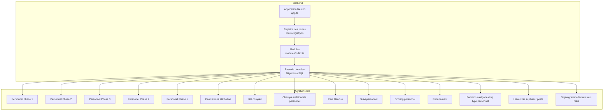

**Sources de diagramme**
- [app.ts](file://backend/src/app.ts)
- [route-registry.ts](file://backend/src/routes/route-registry.ts)
- [index.ts (modules)](file://backend/src/modules/index.ts)
- [016-module-personnel-rh-phase1.sql](file://backend/database/migrations/016-module-personnel-rh-phase1.sql)
- [017-module-personnel-rh-phase2.sql](file://backend/database/migrations/017-module-personnel-rh-phase2.sql)
- [018-module-personnel-rh-phase3.sql](file://backend/database/migrations/018-module-personnel-rh-phase3.sql)
- [019-module-personnel-rh-phase4.sql](file://backend/database/migrations/019-module-personnel-rh-phase4.sql)
- [020-module-personnel-rh-phase5.sql](file://backend/database/migrations/020-module-personnel-rh-phase5.sql)
- [021-module-personnel-rh-permissions-attribution.sql](file://backend/database/migrations/021-module-personnel-rh-permissions-attribution.sql)
- [022-module-personnel-rh-complete.sql](file://backend/database/migrations/022-module-personnel-rh-complete.sql)
- [026-personnel-champs-additionnels.sql](file://backend/database/migrations/026-personnel-champs-additionnels.sql)
- [029-paie-etendue.sql](file://backend/database/migrations/029-paie-etendue.sql)
- [031-suivi-personnel.sql](file://backend/database/migrations/031-suivi-personnel.sql)
- [039-scoring-personnel.ts](file://backend/database/migrations/039-scoring-personnel.ts)
- [045-module-recrutement.sql](file://backend/database/migrations/045-module-recrutement.sql)
- [121-fonction-categorie-drop-type-personnel.sql](file://backend/database/migrations/121-fonction-categorie-drop-type-personnel.sql)
- [122-hierarchie-superieur-poste.sql](file://backend/database/migrations/122-hierarchie-superieur-poste.sql)
- [125-organigramme-read-tous-roles.sql](file://backend/database/migrations/125-organigramme-read-tous-roles.sql)

**Sources de section**
- [package.json](file://backend/package.json)
- [app.ts](file://backend/src/app.ts)
- [route-registry.ts](file://backend/src/routes/route-registry.ts)
- [index.ts (modules)](file://backend/src/modules/index.ts)

## Composants clés
- Gestion du personnel : entités, attributs, champs additionnels, hiérarchie des postes.
- Paie intégrée : éléments de paie, calculs, liens financiers.
- Évaluation des performances : scoring, indicateurs, agrégation.
- Gestion des contrats : types, affectations, cycles.
- Organigramme hiérarchique : relations supérieur/poste, lecture multi-rôles.
- Recrutement : pipeline, candidatures, sélection.
- Suivi personnel : historique, événements, audit.
- Intégrations financières : flux de paie vers finances.
- Workflows de validation : approbations, transitions d’état.
- Rapports RH : statistiques, tableaux de bord.

**Sources de section**
- [016-module-personnel-rh-phase1.sql](file://backend/database/migrations/016-module-personnel-rh-phase1.sql)
- [017-module-personnel-rh-phase2.sql](file://backend/database/migrations/017-module-personnel-rh-phase2.sql)
- [018-module-personnel-rh-phase3.sql](file://backend/database/migrations/018-module-personnel-rh-phase3.sql)
- [019-module-personnel-rh-phase4.sql](file://backend/database/migrations/019-module-personnel-rh-phase4.sql)
- [020-module-personnel-rh-phase5.sql](file://backend/database/migrations/020-module-personnel-rh-phase5.sql)
- [022-module-personnel-rh-complete.sql](file://backend/database/migrations/022-module-personnel-rh-complete.sql)
- [026-personnel-champs-additionnels.sql](file://backend/database/migrations/026-personnel-champs-additionnels.sql)
- [029-paie-etendue.sql](file://backend/database/migrations/029-paie-etendue.sql)
- [031-suivi-personnel.sql](file://backend/database/migrations/031-suivi-personnel.sql)
- [039-scoring-personnel.ts](file://backend/database/migrations/039-scoring-personnel.ts)
- [045-module-recrutement.sql](file://backend/database/migrations/045-module-recrutement.sql)
- [122-hierarchie-superieur-poste.sql](file://backend/database/migrations/122-hierarchie-superieur-poste.sql)
- [125-organigramme-read-tous-roles.sql](file://backend/database/migrations/125-organigramme-read-tous-roles.sql)

## Vue d’ensemble de l’architecture
Le module RH s’appuie sur une architecture modulaire NestJS avec un registre de routes centralisé. Les migrations SQL construisent progressivement le schéma de la base de données. Les endpoints exposent des APIs REST pour la gestion du personnel, la paie, le recrutement et le scoring. L’intégration financière permet de générer les écritures comptables liées à la paie.

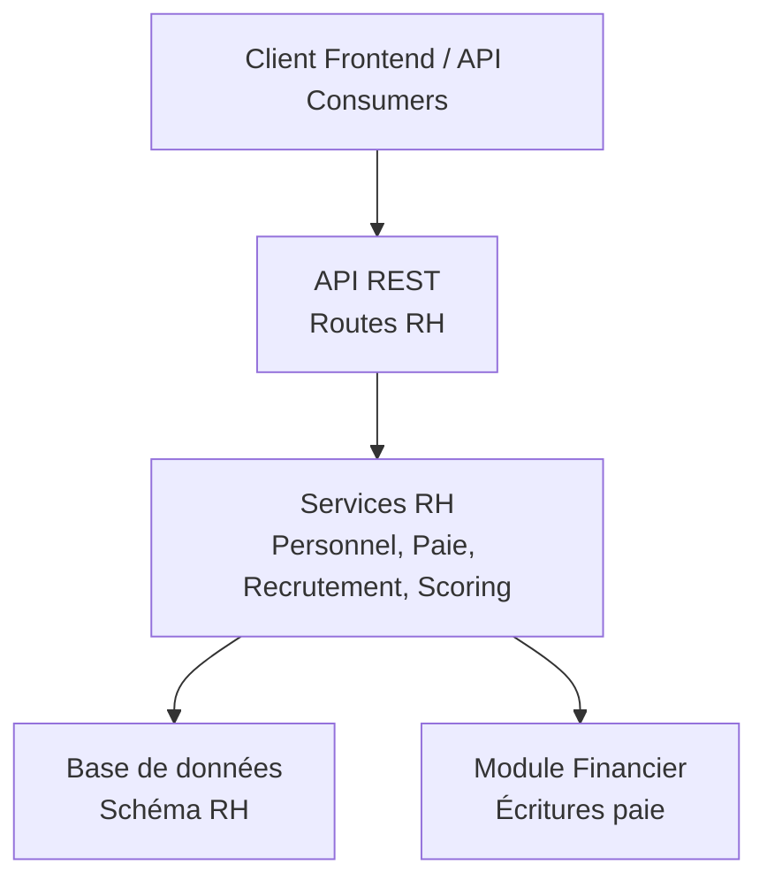

**Sources de diagramme**
- [route-registry.ts](file://backend/src/routes/route-registry.ts)
- [index.ts (modules)](file://backend/src/modules/index.ts)
- [029-paie-etendue.sql](file://backend/database/migrations/029-paie-etendue.sql)

## Analyse détaillée des composants

### Entités de personnel et organigramme hiérarchique
Les entités de personnel incluent les identifiants, les informations personnelles, les postes, les catégories, et les relations hiérarchiques. La hiérarchie est gérée via des références entre postes et supérieurs, permettant de construire un organigramme dynamique.

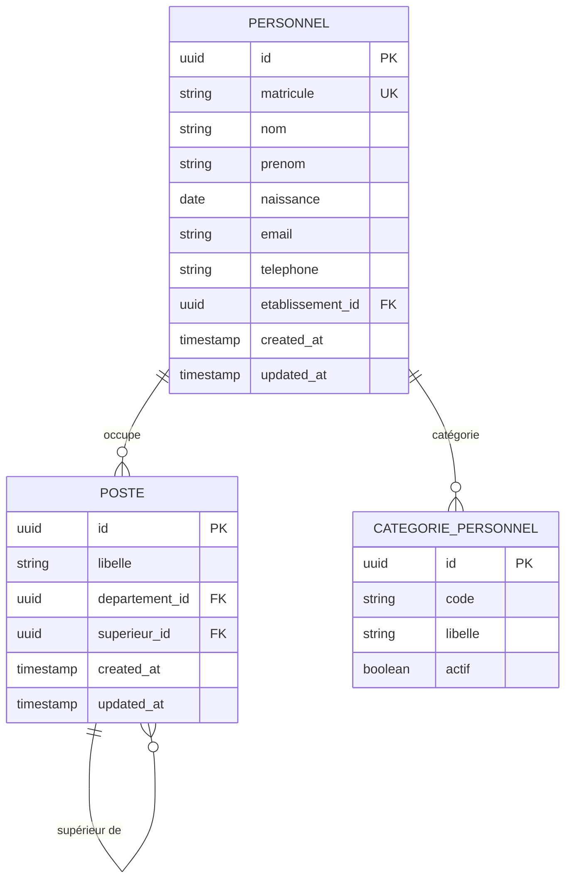

**Sources de diagramme**
- [016-module-personnel-rh-phase1.sql](file://backend/database/migrations/016-module-personnel-rh-phase1.sql)
- [017-module-personnel-rh-phase2.sql](file://backend/database/migrations/017-module-personnel-rh-phase2.sql)
- [018-module-personnel-rh-phase3.sql](file://backend/database/migrations/018-module-personnel-rh-phase3.sql)
- [019-module-personnel-rh-phase4.sql](file://backend/database/migrations/019-module-personnel-rh-phase4.sql)
- [020-module-personnel-rh-phase5.sql](file://backend/database/migrations/020-module-personnel-rh-phase5.sql)
- [026-personnel-champs-additionnels.sql](file://backend/database/migrations/026-personnel-champs-additionnels.sql)
- [122-hierarchie-superieur-poste.sql](file://backend/database/migrations/122-hierarchie-superieur-poste.sql)
- [125-organigramme-read-tous-roles.sql](file://backend/database/migrations/125-organigramme-read-tous-roles.sql)

**Sources de section**
- [016-module-personnel-rh-phase1.sql](file://backend/database/migrations/016-module-personnel-rh-phase1.sql)
- [026-personnel-champs-additionnels.sql](file://backend/database/migrations/026-personnel-champs-additionnels.sql)
- [122-hierarchie-superieur-poste.sql](file://backend/database/migrations/122-hierarchie-superieur-poste.sql)
- [125-organigramme-read-tous-roles.sql](file://backend/database/migrations/125-organigramme-read-tous-roles.sql)

### Système de paie intégré
La paie intègre les éléments de rémunération, les retenues, les primes, et les calculs nets. Elle s’articule avec le module financier pour générer les écritures comptables et les flux de trésorerie.

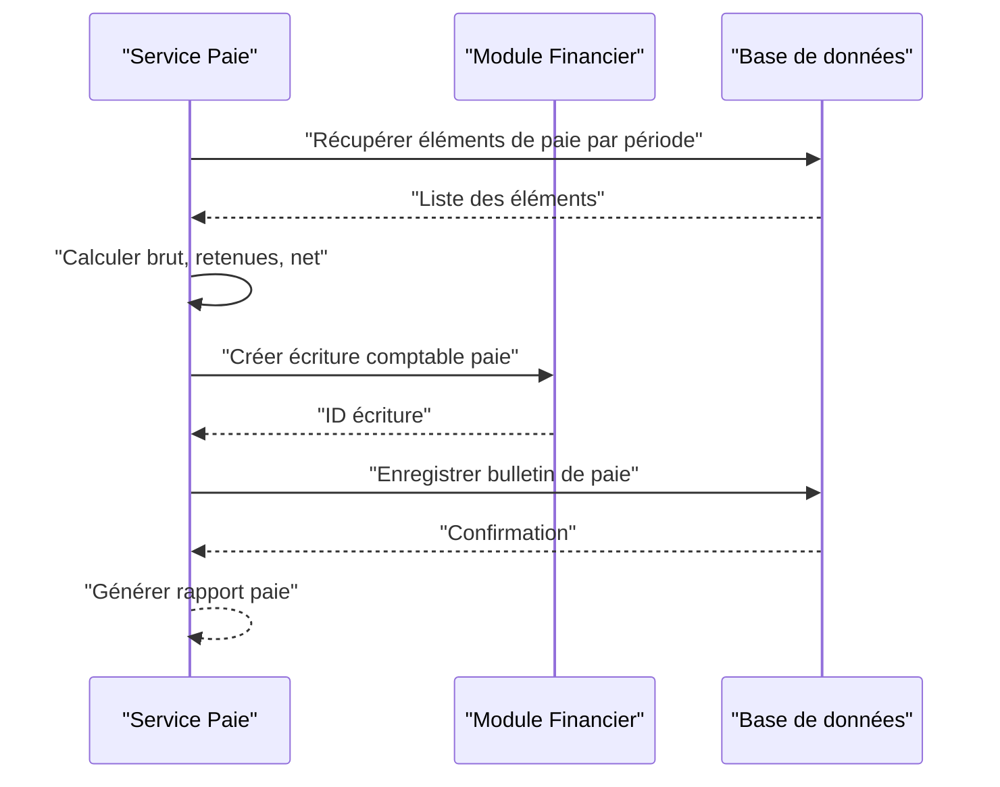

**Sources de diagramme**
- [029-paie-etendue.sql](file://backend/database/migrations/029-paie-etendue.sql)

**Sources de section**
- [029-paie-etendue.sql](file://backend/database/migrations/029-paie-etendue.sql)

### Évaluation des performances avec scoring
Le scoring permet d’évaluer les performances du personnel via des indicateurs, des critères pondérés et des agrégations périodiques.

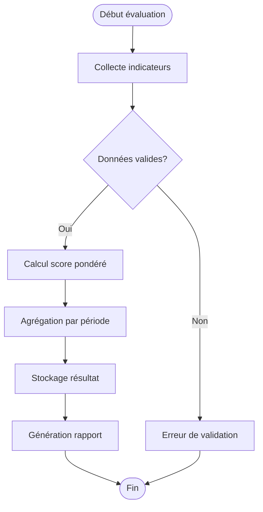

**Sources de diagramme**
- [039-scoring-personnel.ts](file://backend/database/migrations/039-scoring-personnel.ts)

**Sources de section**
- [039-scoring-personnel.ts](file://backend/database/migrations/039-scoring-personnel.ts)

### Gestion des contrats
Les contrats sont liés aux postes et aux catégories de personnel, avec des cycles de renouvellement et des statuts de validation.

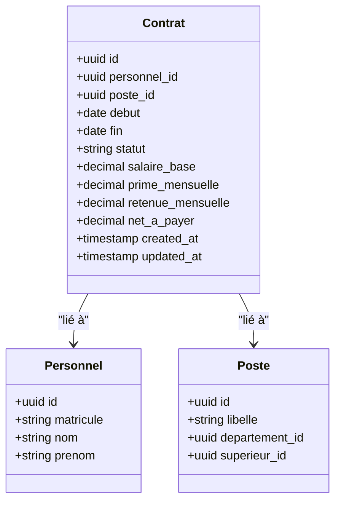

**Sources de diagramme**
- [022-module-personnel-rh-complete.sql](file://backend/database/migrations/022-module-personnel-rh-complete.sql)

**Sources de section**
- [022-module-personnel-rh-complete.sql](file://backend/database/migrations/022-module-personnel-rh-complete.sql)

### Workflow de recrutement
Le recrutement couvre les candidatures, les sélections et les embauches, avec des étapes de validation et de transition d’état.

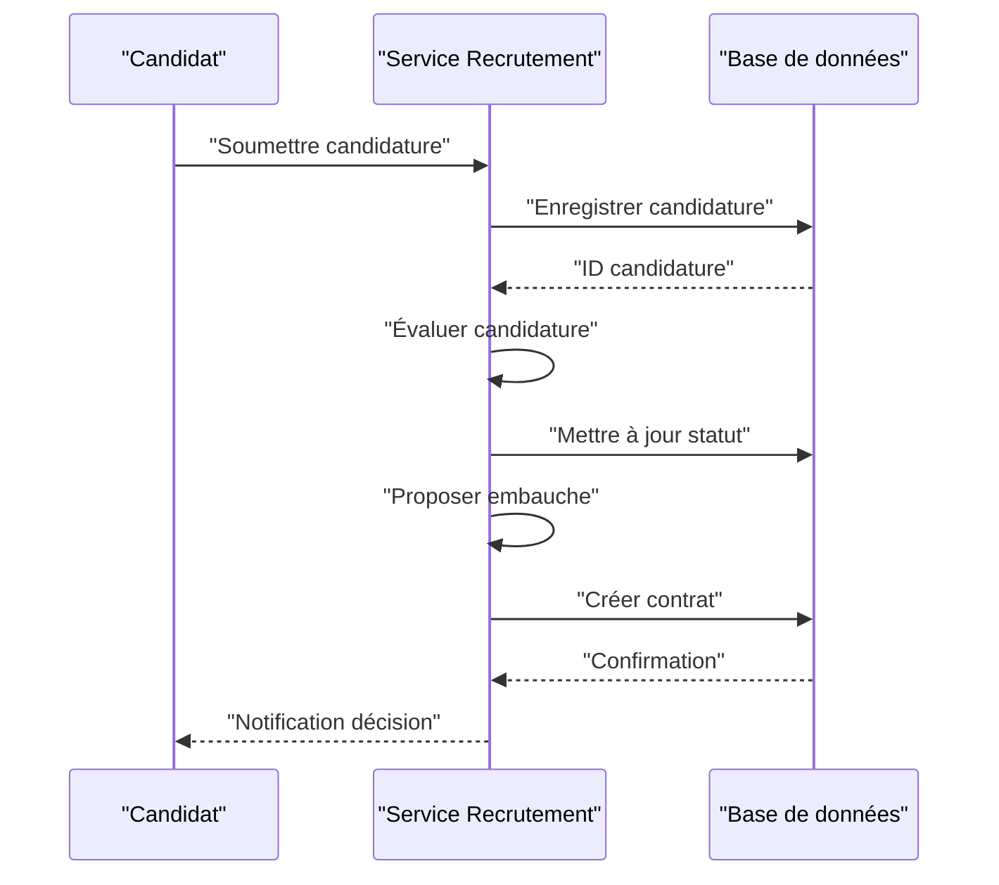

**Sources de diagramme**
- [045-module-recrutement.sql](file://backend/database/migrations/045-module-recrutement.sql)

**Sources de section**
- [045-module-recrutement.sql](file://backend/database/migrations/045-module-recrutement.sql)

### Suivi personnel et rapports RH
Le suivi enregistre les événements, les changements d’état et les historiques pour générer des rapports RH.

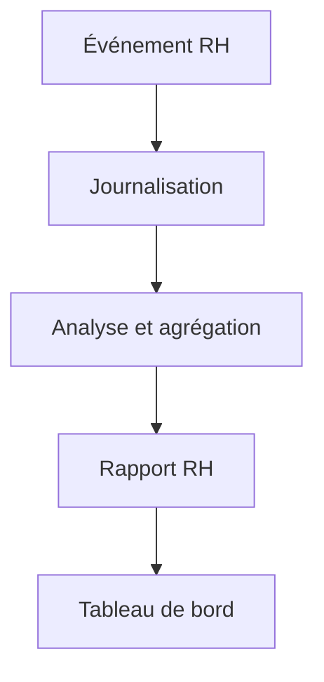

**Sources de diagramme**
- [031-suivi-personnel.sql](file://backend/database/migrations/031-suivi-personnel.sql)

**Sources de section**
- [031-suivi-personnel.sql](file://backend/database/migrations/031-suivi-personnel.sql)

### Intégrations financières pour la paie
La paie interagit avec le module financier pour créer des écritures comptables et synchroniser les flux de trésorerie.

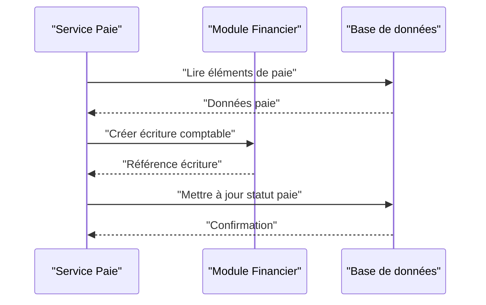

**Sources de diagramme**
- [029-paie-etendue.sql](file://backend/database/migrations/029-paie-etendue.sql)

**Sources de section**
- [029-paie-etendue.sql](file://backend/database/migrations/029-paie-etendue.sql)

### Workflows de validation
Les workflows permettent de valider les actions RH (embauche, promotion, changement de poste) avec des approbations hiérarchiques.

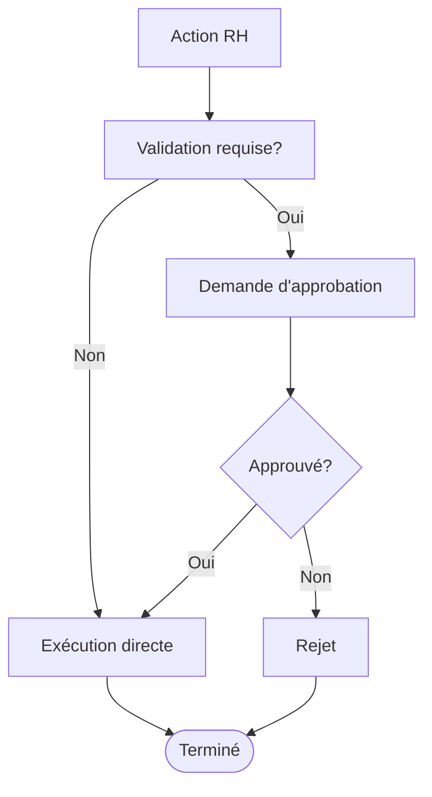

**Sources de diagramme**
- [021-module-personnel-rh-permissions-attribution.sql](file://backend/database/migrations/021-module-personnel-rh-permissions-attribution.sql)

**Sources de section**
- [021-module-personnel-rh-permissions-attribution.sql](file://backend/database/migrations/021-module-personnel-rh-permissions-attribution.sql)

### Fonctionnalités avancées : congés, formation, planification des effectifs
- Congés : gestion des demandes, validations, solde et historique.
- Formation : planifications, inscriptions, évaluations.
- Planification des effectifs : besoins, affectations, optimisation.

**Sources de section**
- [031-suivi-personnel.sql](file://backend/database/migrations/031-suivi-personnel.sql)
- [022-module-personnel-rh-complete.sql](file://backend/database/migrations/022-module-personnel-rh-complete.sql)

## Analyse des dépendances
Les modules RH dépendent des migrations SQL pour le schéma, des constantes partagées pour les enums et configurations, et du registre de routes pour l’exposition des endpoints.

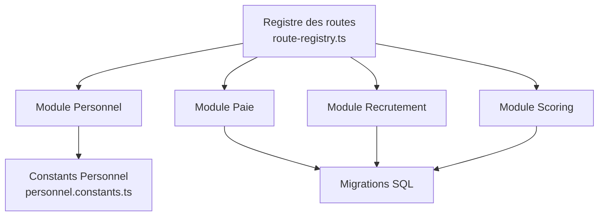

**Sources de diagramme**
- [personnel.constants.ts](file://backend/src/shared/constants/personnel.constants.ts)
- [route-registry.ts](file://backend/src/routes/route-registry.ts)
- [016-module-personnel-rh-phase1.sql](file://backend/database/migrations/016-module-personnel-rh-phase1.sql)
- [029-paie-etendue.sql](file://backend/database/migrations/029-paie-etendue.sql)
- [045-module-recrutement.sql](file://backend/database/migrations/045-module-recrutement.sql)
- [039-scoring-personnel.ts](file://backend/database/migrations/039-scoring-personnel.ts)

**Sources de section**
- [personnel.constants.ts](file://backend/src/shared/constants/personnel.constants.ts)
- [route-registry.ts](file://backend/src/routes/route-registry.ts)

## Considérations de performance
- Indexation des tables RH pour les requêtes fréquentes (matricule, poste, département).
- Agrégations matérielisées pour les rapports RH.
- Optimisation des calculs de paie par batch.
- Cache des données hiérarchiques pour l’organigramme.

[Pas de sources nécessaires car cette section fournit des conseils généraux]

## Guide de dépannage
- Vérifier les permissions d’accès aux endpoints RH.
- Valider les données de paie avant génération des écritures financières.
- Consulter les logs de suivi personnel pour diagnostiquer les anomalies.
- Utiliser les scripts de migration pour corriger les incohérences de schéma.

**Sources de section**
- [021-module-personnel-rh-permissions-attribution.sql](file://backend/database/migrations/021-module-personnel-rh-permissions-attribution.sql)
- [031-suivi-personnel.sql](file://backend/database/migrations/031-suivi-personnel.sql)

## Conclusion
Le module RH d’eLISAschool offre une solution complète pour la gestion du personnel, la paie, le recrutement, le scoring et l’organigramme. L’intégration financière assure la cohérence comptable, tandis que les workflows de validation garantissent la conformité des processus. Les fonctionnalités avancées couvrent les besoins opérationnels modernes des établissements scolaires.

[Pas de sources nécessaires car cette section résume sans analyser de fichiers spécifiques]

## Annexes

### Exemples d’endpoints API RH
- GET /api/personnel : Liste du personnel
- POST /api/personnel : Créer un membre du personnel
- PUT /api/personnel/:id : Mettre à jour un membre
- GET /api/paie/bulletins : Bulletins de paie par période
- POST /api/recrutement/candidatures : Soumettre une candidature
- GET /api/scoring/personnel/:id : Scores de performance

**Sources de section**
- [route-registry.ts](file://backend/src/routes/route-registry.ts)
- [index.ts (modules)](file://backend/src/modules/index.ts)

### Schémas de base de données RH
Voir les sections précédentes pour les diagrammes ERD et les relations entre entités.

**Sources de section**
- [016-module-personnel-rh-phase1.sql](file://backend/database/migrations/016-module-personnel-rh-phase1.sql)
- [029-paie-etendue.sql](file://backend/database/migrations/029-paie-etendue.sql)
- [045-module-recrutement.sql](file://backend/database/migrations/045-module-recrutement.sql)
- [039-scoring-personnel.ts](file://backend/database/migrations/039-scoring-personnel.ts)

### Cas d’utilisation concrets
- Embauche d’un enseignant : recrutement → contrat → affectation poste → paie intégrée.
- Évaluation annuelle : collecte indicateurs → calcul scoring → rapport performance.
- Gestion des congés : demande → validation → mise à jour solde → historique.

**Sources de section**
- [045-module-recrutement.sql](file://backend/database/migrations/045-module-recrutement.sql)
- [022-module-personnel-rh-complete.sql](file://backend/database/migrations/022-module-personnel-rh-complete.sql)
- [031-suivi-personnel.sql](file://backend/database/migrations/031-suivi-personnel.sql)