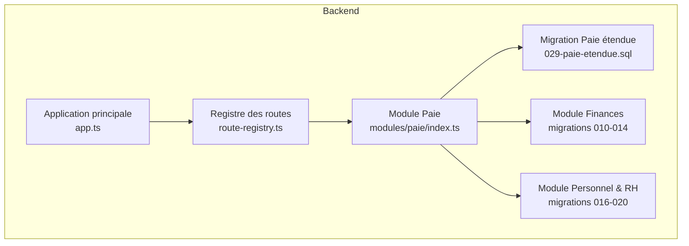
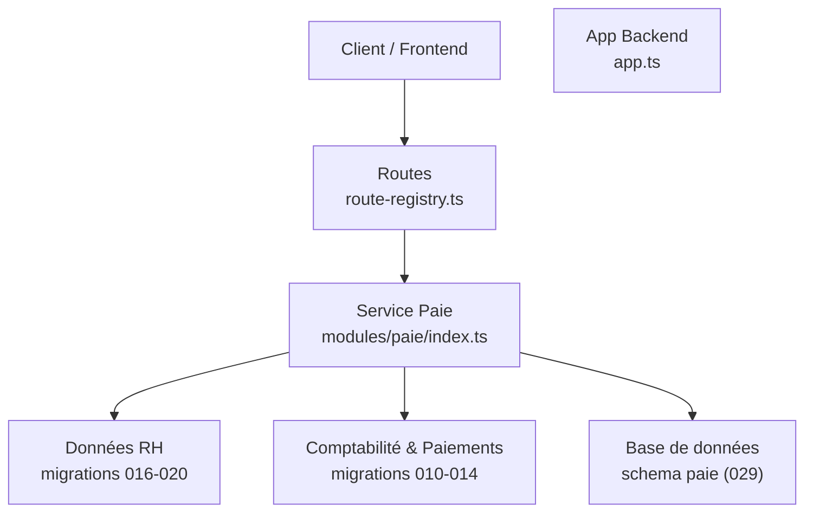
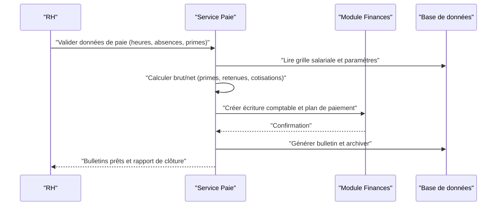
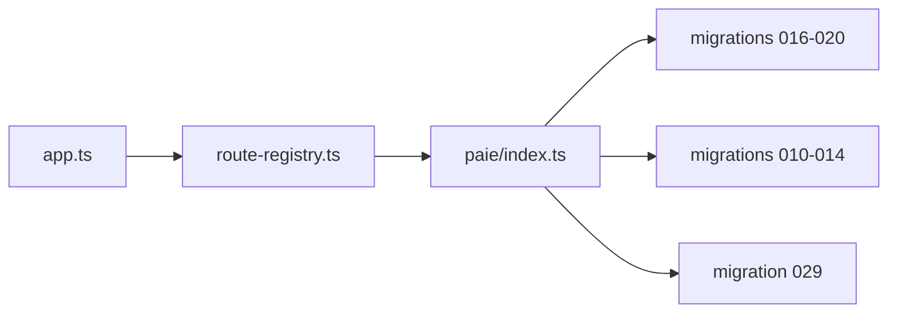
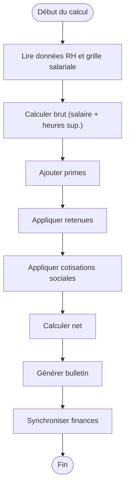

# Système de Paie

<cite>
**Fichiers référencés dans ce document**
- [backend/src/modules/paie/index.ts](file://backend/src/modules/paie/index.ts)
- [backend/database/migrations/029-paie-etendue.sql](file://backend/database/migrations/029-paie-etendue.sql)
- [backend/database/migrations/016-module-personnel-rh-phase1.sql](file://backend/database/migrations/016-module-personnel-rh-phase1.sql)
- [backend/database/migrations/017-module-personnel-rh-phase2.sql](file://backend/database/migrations/017-module-personnel-rh-phase2.sql)
- [backend/database/migrations/018-module-personnel-rh-phase3.sql](file://backend/database/migrations/018-module-personnel-rh-phase3.sql)
- [backend/database/migrations/019-module-personnel-rh-phase4.sql](file://backend/database/migrations/019-module-personnel-rh-phase4.sql)
- [backend/database/migrations/020-module-personnel-rh-phase5.sql](file://backend/database/migrations/020-module-personnel-rh-phase5.sql)
- [backend/database/migrations/010-module-finances.sql](file://backend/database/migrations/010-module-finances.sql)
- [backend/database/migrations/011-module-finances-part2.sql](file://backend/database/migrations/011-module-finances-part2.sql)
- [backend/database/migrations/012-module-finances-part3-parametres.sql](file://backend/database/migrations/012-module-finances-part3-parametres.sql)
- [backend/database/migrations/013-module-finances-phase1-granularite.sql](file://backend/database/migrations/013-module-finances-phase1-granularite.sql)
- [backend/database/migrations/014-module-finances-phase2-section.sql](file://backend/database/migrations/014-module-finances-phase2-section.sql)
- [backend/src/routes/route-registry.ts](file://backend/src/routes/route-registry.ts)
- [backend/src/app.ts](file://backend/src/app.ts)
</cite>

## Table des matières
1. [Introduction](#introduction)
2. [Structure du projet](#structure-du-projet)
3. [Composants clés](#composants-clés)
4. [Vue d’architecture](#vue-darchitecture)
5. [Analyse détaillée des composants](#analyse-detaillee-des-composants)
6. [Analyse des dépendances](#analyse-des-dependances)
7. [Considérations de performance](#considerations-de-performance)
8. [Guide de dépannage](#guide-de-depannage)
9. [Conclusion](#conclusion)
10. [Annexes](#annexes)

## Introduction
Ce document présente le système de paie intégré d’eLISAschool, en se concentrant sur les calculs de salaire (brut/net), les éléments de paie (salaire de base, primes, retenues, cotisations sociales), la génération automatique des bulletins de paie, les workflows mensuels, et les intégrations avec le module financier pour les paiements, les déclarations fiscales et sociales. Il décrit également les API de gestion de paie, les configurations de grille salariale, l’historique de paiement et les rapports financiers RH, ainsi que des exemples de calculs complexes et des scénarios réels.

## Structure du projet
Le module paie est implémenté dans le backend sous forme de module dédié, avec une migration étendue dédiée à la paie et des migrations associées aux modules personnel/RH et finances. Les routes sont enregistrées via un registre centralisé et l’application initialise les modules au démarrage.

**Sources de diagramme**
- [backend/src/app.ts](file://backend/src/app.ts)
- [backend/src/routes/route-registry.ts](file://backend/src/routes/route-registry.ts)
- [backend/src/modules/paie/index.ts](file://backend/src/modules/paie/index.ts)
- [backend/database/migrations/029-paie-etendue.sql](file://backend/database/migrations/029-paie-etendue.sql)
- [backend/database/migrations/010-module-finances.sql](file://backend/database/migrations/010-module-finances.sql)
- [backend/database/migrations/016-module-personnel-rh-phase1.sql](file://backend/database/migrations/016-module-personnel-rh-phase1.sql)

**Sources de section**
- [backend/src/app.ts](file://backend/src/app.ts)
- [backend/src/routes/route-registry.ts](file://backend/src/routes/route-registry.ts)
- [backend/src/modules/paie/index.ts](file://backend/src/modules/paie/index.ts)
- [backend/database/migrations/029-paie-etendue.sql](file://backend/database/migrations/029-paie-etendue.sql)
- [backend/database/migrations/010-module-finances.sql](file://backend/database/migrations/010-module-finances.sql)
- [backend/database/migrations/016-module-personnel-rh-phase1.sql](file://backend/database/migrations/016-module-personnel-rh-phase1.sql)

## Composants clés
- Module Paie : orchestre les calculs de paie, la génération des bulletins et les interactions avec les modules RH et Finances.
- Migrations Paie : structure de données pour les éléments de paie, grilles salariales, historiques et bulletins.
- Intégration Finances : création d’écritures comptables, paiements et déclarations liées à la paie.
- Intégration Personnel & RH : rattachement des employés, contrats, affectations et paramètres de paie.

**Sources de section**
- [backend/src/modules/paie/index.ts](file://backend/src/modules/paie/index.ts)
- [backend/database/migrations/029-paie-etendue.sql](file://backend/database/migrations/029-paie-etendue.sql)
- [backend/database/migrations/010-module-finances.sql](file://backend/database/migrations/010-module-finances.sql)
- [backend/database/migrations/016-module-personnel-rh-phase1.sql](file://backend/database/migrations/016-module-personnel-rh-phase1.sql)

## Vue d’architecture
Le système de paie s’intègre au sein de l’application eLISAschool via le registre de routes et interagit avec les modules Finances et Personnel & RH. La migration 029 définit les entités spécifiques à la paie.

**Sources de diagramme**
- [backend/src/app.ts](file://backend/src/app.ts)
- [backend/src/routes/route-registry.ts](file://backend/src/routes/route-registry.ts)
- [backend/src/modules/paie/index.ts](file://backend/src/modules/paie/index.ts)
- [backend/database/migrations/029-paie-etendue.sql](file://backend/database/migrations/029-paie-etendue.sql)
- [backend/database/migrations/010-module-finances.sql](file://backend/database/migrations/010-module-finances.sql)
- [backend/database/migrations/016-module-personnel-rh-phase1.sql](file://backend/database/migrations/016-module-personnel-rh-phase1.sql)

## Analyse détaillée des composants

### Calculs de salaire (brut/net)
- Base de calcul : salaire de base issu du contrat et de la grille salariale.
- Primes : variables selon politique (prime de fin d’année, prime de rendement, heures supplémentaires).
- Retenues : impôts sur le revenu, pénalités, avances sur salaire.
- Cotisations sociales : parts employeur et salarié (assurance maladie, retraite, chômage, etc.).
- Net = Brut + Primes – Retenues – Cotisations.

Exemple de scénario réel :
- Salaire de base : montant mensuel fixe.
- Heures supplémentaires : calculées par coefficient horaire.
- Prime de rendement : pourcentage sur objectif atteint.
- Impôt progressif : tranches appliquées au brut imposable.
- Cotisations : taux fixes ou plafonnés selon législation.

**Sources de section**
- [backend/database/migrations/029-paie-etendue.sql](file://backend/database/migrations/029-paie-etendue.sql)

### Éléments de paie
- Salaires de base : définis par poste et échelon.
- Primes : types configurables, règles d’attribution.
- Retenues : types paramétrables, seuils et conditions.
- Cotisations : catégories sociales, taux, bases de calcul.

**Sources de section**
- [backend/database/migrations/029-paie-etendue.sql](file://backend/database/migrations/029-paie-etendue.sql)

### Bulletins de paie générés automatiquement
- Génération mensuelle : agrégation des éléments de paie par période.
- Contenu du bulletin : détails brut, primes, retenues, cotisations, net, références comptables.
- Archivage : historique consultable et exportable.

**Sources de section**
- [backend/database/migrations/029-paie-etendue.sql](file://backend/database/migrations/029-paie-etendue.sql)

### Workflows de paie mensuelle
- Saisie/validation des données RH (heures, absences, primes).
- Exécution des calculs (brut/net).
- Validation financière (écriture comptable, plan de paiement).
- Émission des bulletins et notifications.
- Clôture de période et archivage.

**Sources de diagramme**
- [backend/src/modules/paie/index.ts](file://backend/src/modules/paie/index.ts)
- [backend/database/migrations/029-paie-etendue.sql](file://backend/database/migrations/029-paie-etendue.sql)
- [backend/database/migrations/010-module-finances.sql](file://backend/database/migrations/010-module-finances.sql)

**Sources de section**
- [backend/src/modules/paie/index.ts](file://backend/src/modules/paie/index.ts)
- [backend/database/migrations/029-paie-etendue.sql](file://backend/database/migrations/029-paie-etendue.sql)
- [backend/database/migrations/010-module-finances.sql](file://backend/database/migrations/010-module-finances.sql)

### Intégrations avec le module financier
- Écritures comptables : postes de charges, comptes de paie, provisions.
- Paiements : virements, chèques, espèces ; plan de paiement par période.
- Déclarations fiscales et sociales : agrégation des montants, formats d’export.

**Sources de section**
- [backend/database/migrations/010-module-finances.sql](file://backend/database/migrations/010-module-finances.sql)
- [backend/database/migrations/011-module-finances-part2.sql](file://backend/database/migrations/011-module-finances-part2.sql)
- [backend/database/migrations/012-module-finances-part3-parametres.sql](file://backend/database/migrations/012-module-finances-part3-parametres.sql)
- [backend/database/migrations/013-module-finances-phase1-granularite.sql](file://backend/database/migrations/013-module-finances-phase1-granularite.sql)
- [backend/database/migrations/014-module-finances-phase2-section.sql](file://backend/database/migrations/014-module-finances-phase2-section.sql)

### API endpoints pour la gestion de paie
Les endpoints sont enregistrés via le registre de routes et exposent des opérations CRUD et des actions métier (calculs, génération de bulletins, validations).

- GET /api/paie/configurations : liste des grilles salariales et paramètres.
- POST /api/paie/calculate : déclenche le calcul brut/net pour un employé et une période.
- GET /api/paie/bulletins : liste et détail des bulletins.
- POST /api/paie/bulletins/generate : génération automatique pour une période donnée.
- GET /api/paie/historique : historique de paiement par employé.
- POST /api/paie/sync-finances : synchronisation avec le module financier (écritures, paiements).
- GET /api/paie/reports : rapports financiers RH consolidés.

Note : les chemins exacts dépendent de l’enregistrement dans le registre de routes.

**Sources de section**
- [backend/src/routes/route-registry.ts](file://backend/src/routes/route-registry.ts)

### Configurations de grille salariale
- Définition des échelons, coefficients, fourchettes.
- Règles d’indexation et revalorisation annuelle.
- Paramètres régionaux et conventions collectives.

**Sources de section**
- [backend/database/migrations/029-paie-etendue.sql](file://backend/database/migrations/029-paie-etendue.sql)

### Historiques de paiement
- Traçabilité complète par employé et période.
- Montants bruts, nets, retenues, cotisations.
- Références comptables et statuts de paiement.

**Sources de section**
- [backend/database/migrations/029-paie-etendue.sql](file://backend/database/migrations/029-paie-etendue.sql)

### Rapports financiers RH
- Consolidation des charges de personnel par département/section.
- Analyses comparatives mensuelles et annuelles.
- Export conforme aux obligations légales.

**Sources de section**
- [backend/database/migrations/010-module-finances.sql](file://backend/database/migrations/010-module-finances.sql)
- [backend/database/migrations/014-module-finances-phase2-section.sql](file://backend/database/migrations/014-module-finances-phase2-section.sql)

### Exemples de calculs complexes
- Scénario avec heures supplémentaires, prime conditionnelle, impôt progressif et cotisations plafonnées.
- Ajustements postérieurs (rectifications, rappels) et impact sur le net.
- Gestion des périodes partielles (embauche/mi-mois).

**Sources de section**
- [backend/database/migrations/029-paie-etendue.sql](file://backend/database/migrations/029-paie-etendue.sql)

## Analyse des dépendances
Le module paie dépend des données RH et des services financiers. L’initialisation de l’application charge les routes qui pointent vers le service paie.

**Sources de diagramme**
- [backend/src/app.ts](file://backend/src/app.ts)
- [backend/src/routes/route-registry.ts](file://backend/src/routes/route-registry.ts)
- [backend/src/modules/paie/index.ts](file://backend/src/modules/paie/index.ts)
- [backend/database/migrations/029-paie-etendue.sql](file://backend/database/migrations/029-paie-etendue.sql)
- [backend/database/migrations/010-module-finances.sql](file://backend/database/migrations/010-module-finances.sql)
- [backend/database/migrations/016-module-personnel-rh-phase1.sql](file://backend/database/migrations/016-module-personnel-rh-phase1.sql)

**Sources de section**
- [backend/src/app.ts](file://backend/src/app.ts)
- [backend/src/routes/route-registry.ts](file://backend/src/routes/route-registry.ts)
- [backend/src/modules/paie/index.ts](file://backend/src/modules/paie/index.ts)
- [backend/database/migrations/029-paie-etendue.sql](file://backend/database/migrations/029-paie-etendue.sql)
- [backend/database/migrations/010-module-finances.sql](file://backend/database/migrations/010-module-finances.sql)
- [backend/database/migrations/016-module-personnel-rh-phase1.sql](file://backend/database/migrations/016-module-personnel-rh-phase1.sql)

## Considérations de performance
- Indexation des tables de paie et bulletins pour accélérer les requêtes de reporting.
- Batch processing pour les calculs de masse (lancement mensuel).
- Mise en cache des grilles salariales et paramètres fréquemment utilisés.
- Optimisation des transactions lors de la génération de bulletins et des écritures financières.

[Pas de sources nécessaires car cette section fournit des conseils généraux]

## Guide de dépannage
- Erreurs de calcul : vérifier les paramètres de grille, les taux de cotisations et les règles de primes.
- Problèmes de synchronisation financière : valider les comptes et les plans de paiement.
- Absence de bulletins : contrôler les données RH saisies et les triggers de génération.
- Logs et diagnostics : consulter les logs applicatifs et les traces de transaction.

**Sources de section**
- [backend/src/modules/paie/index.ts](file://backend/src/modules/paie/index.ts)
- [backend/database/migrations/029-paie-etendue.sql](file://backend/database/migrations/029-paie-etendue.sql)
- [backend/database/migrations/010-module-finances.sql](file://backend/database/migrations/010-module-finances.sql)

## Conclusion
Le système de paie d’eLISAschool offre une architecture modulaire intégrant les calculs de salaire, la génération de bulletins et les liaisons avec les modules financier et RH. Grâce à des migrations dédiées et un registre de routes centralisé, il permet une gestion robuste et évolutive de la paie, adaptée aux contextes africains et aux exigences légales locales.

[Pas de sources nécessaires car cette section résume sans analyser de fichiers spécifiques]

## Annexes

### Diagrammes de flux de calcul de paie

**Sources de diagramme**
- [backend/src/modules/paie/index.ts](file://backend/src/modules/paie/index.ts)
- [backend/database/migrations/029-paie-etendue.sql](file://backend/database/migrations/029-paie-etendue.sql)
- [backend/database/migrations/010-module-finances.sql](file://backend/database/migrations/010-module-finances.sql)