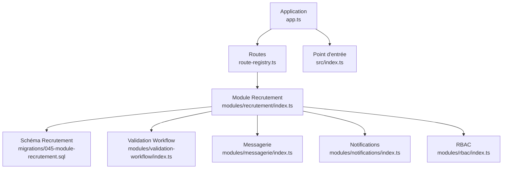
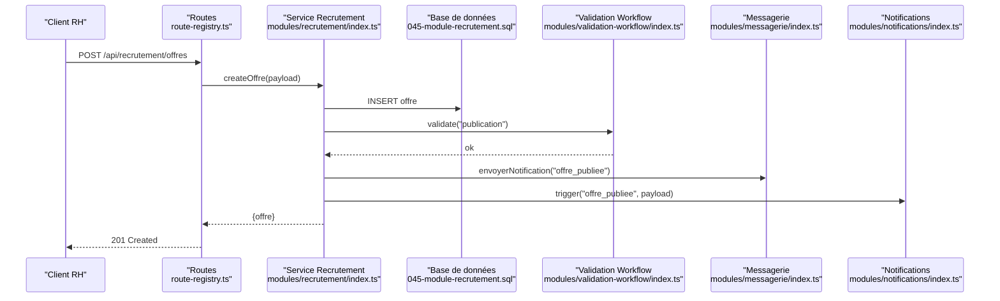
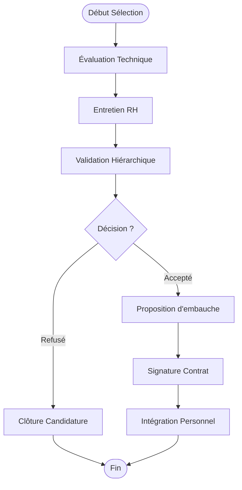
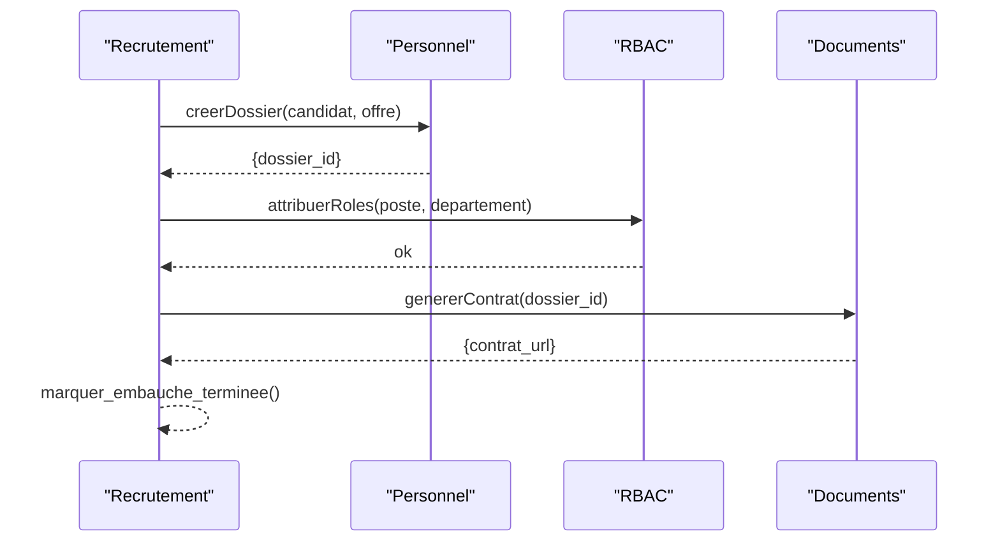
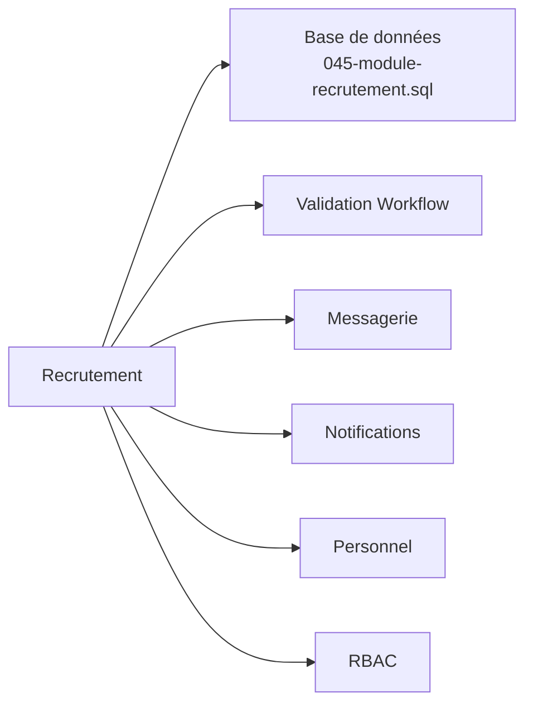

# Workflow de Recrutement

<cite>
**Fichiers référencés dans ce document**
- [045-module-recrutement.sql](file://backend/database/migrations/045-module-recrutement.sql)
- [recrutement/index.ts](file://backend/src/modules/recrutement/index.ts)
- [route-registry.ts](file://backend/src/routes/route-registry.ts)
- [app.ts](file://backend/src/app.ts)
- [index.ts](file://backend/src/index.ts)
- [personnel.constants.ts](file://backend/src/shared/constants/personnel.constants.ts)
- [validation-workflow/index.ts](file://backend/src/modules/validation-workflow/index.ts)
- [messagerie/index.ts](file://backend/src/modules/messagerie/index.ts)
- [notifications/index.ts](file://backend/src/modules/notifications/index.ts)
- [rbac/index.ts](file://backend/src/modules/rbac/index.ts)
</cite>

## Table des matières
1. [Introduction](#introduction)
2. [Structure du projet](#structure-du-projet)
3. [Composants clés](#composants-clés)
4. [Vue d'architecture](#vue-darchitecture)
5. [Analyse détaillée des composants](#analyse-detaillee-des-composants)
6. [Analyse des dépendances](#analyse-des-dependances)
7. [Considérations de performance](#considerations-de-performance)
8. [Guide de dépannage](#guide-de-depannage)
9. [Conclusion](#conclusion)
10. [Annexes](#annexes)

## Introduction
Ce document décrit le workflow de recrutement d'eLISAschool : publication d’offres, candidatures, sélection, entretiens et embauche. Il détaille les entités de recrutement, les templates d’offres, les communications automatiques aux candidats, l’intégration avec le module personnel pour l’embauche, ainsi que les API de gestion, les rapports et statistiques, et la personnalisation des workflows de validation multi-niveaux. L’objectif est de fournir une vue complète et accessible pour les équipes RH et techniques.

## Structure du projet
Le module de recrutement s’appuie sur une migration de schéma dédiée, un module backend structuré, et des intégrations transversales (RBAC, messagerie, notifications, validation de workflow). Les routes sont enregistrées via un registre centralisé et l’application initialise les modules au démarrage.

**Sources des diagrammes**
- [app.ts](file://backend/src/app.ts)
- [route-registry.ts](file://backend/src/routes/route-registry.ts)
- [recrutement/index.ts](file://backend/src/modules/recrutement/index.ts)
- [045-module-recrutement.sql](file://backend/database/migrations/045-module-recrutement.sql)
- [validation-workflow/index.ts](file://backend/src/modules/validation-workflow/index.ts)
- [messagerie/index.ts](file://backend/src/modules/messagerie/index.ts)
- [notifications/index.ts](file://backend/src/modules/notifications/index.ts)
- [rbac/index.ts](file://backend/src/modules/rbac/index.ts)

**Sources de section**
- [app.ts](file://backend/src/app.ts)
- [route-registry.ts](file://backend/src/routes/route-registry.ts)
- [recrutement/index.ts](file://backend/src/modules/recrutement/index.ts)
- [045-module-recrutement.sql](file://backend/database/migrations/045-module-recrutement.sql)

## Composants clés
- Entités de recrutement : offres d’emploi, candidatures, entretiens, sélections, embauches.
- Templates d’offres : modèles configurables pour publier rapidement des postes.
- Communications automatiques : notifications et messages envoyés aux candidats à chaque étape.
- Validation multi-niveaux : workflows configurables pour valider les étapes critiques (sélection, entretien, embauche).
- Intégration personnel : création ou mise à jour du dossier personnel lors de l’embauche.
- Rapports et statistiques : indicateurs de performance du processus de recrutement.

**Sources de section**
- [045-module-recrutement.sql](file://backend/database/migrations/045-module-recrutement.sql)
- [recrutement/index.ts](file://backend/src/modules/recrutement/index.ts)
- [validation-workflow/index.ts](file://backend/src/modules/validation-workflow/index.ts)
- [messagerie/index.ts](file://backend/src/modules/messagerie/index.ts)
- [notifications/index.ts](file://backend/src/modules/notifications/index.ts)
- [personnel.constants.ts](file://backend/src/shared/constants/personnel.constants.ts)

## Vue d'architecture
Le module de recrutement expose des endpoints REST gérés par des contrôleurs/services internes, qui interagissent avec la base de données via les entités définies dans la migration 045. Les validations de workflow garantissent la conformité des transitions d’état. La messagerie et les notifications assurent les communications automatiques. Le RBAC protège les accès selon les rôles RH.

**Sources des diagrammes**
- [route-registry.ts](file://backend/src/routes/route-registry.ts)
- [recrutement/index.ts](file://backend/src/modules/recrutement/index.ts)
- [045-module-recrutement.sql](file://backend/database/migrations/045-module-recrutement.sql)
- [validation-workflow/index.ts](file://backend/src/modules/validation-workflow/index.ts)
- [messagerie/index.ts](file://backend/src/modules/messagerie/index.ts)
- [notifications/index.ts](file://backend/src/modules/notifications/index.ts)

## Analyse détaillée des composants

### Entités et schéma de recrutement
Les entités principales incluent :
- Offre d’emploi : titre, description, département, compétences requises, statut, dates de validité.
- Candidature : candidat, offre associée, documents, statut, notes.
- Entretien : date, lieu, évaluateurs, résultats, commentaires.
- Sélection : décision, score, critères, approbations.
- Embauche : contrat, poste, département, date de début, statut.

Ces entités sont persistées via la migration 045, qui définit tables, relations et contraintes.

**Sources de section**
- [045-module-recrutement.sql](file://backend/database/migrations/045-module-recrutement.sql)

### Templates d’offres d’emploi
Les templates permettent de préconfigurer les champs obligatoires, les descriptions types et les compétences attendues. Ils accélèrent la publication d’offres et standardisent les contenus.

Bonnes pratiques :
- Centraliser les templates par famille de postes.
- Versionner les templates pour suivre les évolutions.
- Associer des règles de validation spécifiques par template.

**Sources de section**
- [recrutement/index.ts](file://backend/src/modules/recrutement/index.ts)

### Candidatures et suivi
Le flux de candidature comprend :
- Soumission de candidature avec pièces jointes.
- Attribution automatique ou manuelle à un recruteur.
- Suivi des statuts (reçu, en revue, retenu, refusé).
- Historique des actions et notes.

Points clés :
- Validation des documents et formats acceptés.
- Notifications automatiques à chaque changement de statut.
- Auditabilité des modifications.

**Sources de section**
- [recrutement/index.ts](file://backend/src/modules/recrutement/index.ts)
- [messagerie/index.ts](file://backend/src/modules/messagerie/index.ts)
- [notifications/index.ts](file://backend/src/modules/notifications/index.ts)

### Entretiens et évaluations
Gestion des entretiens :
- Planification avec créneaux et évaluateurs.
- Collecte des scores et commentaires.
- Agrégation des résultats pour la sélection.

Règles :
- Réservation de ressources (salles, outils).
- Rappel automatique avant l’entretien.
- Archivage des comptes-rendus.

**Sources de section**
- [recrutement/index.ts](file://backend/src/modules/recrutement/index.ts)
- [validation-workflow/index.ts](file://backend/src/modules/validation-workflow/index.ts)

### Sélection et validation multi-niveaux
La sélection suit un workflow configurable :
- Étape 1 : évaluation technique.
- Étape 2 : entretien RH.
- Étape 3 : validation hiérarchique.
- Étape 4 : décision finale.

Chaque transition est validée par le système de workflow, qui vérifie les permissions et les conditions métier.

**Sources des diagrammes**
- [validation-workflow/index.ts](file://backend/src/modules/validation-workflow/index.ts)
- [recrutement/index.ts](file://backend/src/modules/recrutement/index.ts)

**Sources de section**
- [validation-workflow/index.ts](file://backend/src/modules/validation-workflow/index.ts)
- [recrutement/index.ts](file://backend/src/modules/recrutement/index.ts)

### Embarquement et intégration avec le module personnel
À l’acceptation, le candidat devient membre du personnel :
- Création ou mise à jour du profil personnel.
- Attribution du poste et département.
- Configuration des accès et rôles via RBAC.
- Génération des documents contractuels.

**Sources des diagrammes**
- [recrutement/index.ts](file://backend/src/modules/recrutement/index.ts)
- [personnel.constants.ts](file://backend/src/shared/constants/personnel.constants.ts)
- [rbac/index.ts](file://backend/src/modules/rbac/index.ts)

**Sources de section**
- [recrutement/index.ts](file://backend/src/modules/recrutement/index.ts)
- [personnel.constants.ts](file://backend/src/shared/constants/personnel.constants.ts)
- [rbac/index.ts](file://backend/src/modules/rbac/index.ts)

### Communications automatiques
Le système envoie des notifications et messages aux candidats et recruteurs :
- Confirmation de réception de candidature.
- Invitation à l’entretien.
- Résultats de sélection.
- Notification d’embauche.

Ces communications sont déclenchées par des événements métier et peuvent être personnalisées via des templates.

**Sources de section**
- [messagerie/index.ts](file://backend/src/modules/messagerie/index.ts)
- [notifications/index.ts](file://backend/src/modules/notifications/index.ts)
- [recrutement/index.ts](file://backend/src/modules/recrutement/index.ts)

### API de gestion des recrutements
Endpoints principaux (méthodes HTTP et objectifs) :
- POST /api/recrutement/offres : créer une offre d’emploi.
- GET /api/recrutement/offres : lister les offres.
- PUT /api/recrutement/offres/:id : mettre à jour une offre.
- DELETE /api/recrutement/offres/:id : supprimer une offre.
- POST /api/recrutement/candidatures : soumettre une candidature.
- GET /api/recrutement/candidatures : lister les candidatures.
- PUT /api/recrutement/candidatures/:id/statut : changer le statut.
- POST /api/recrutement/entretiens : planifier un entretien.
- GET /api/recrutement/entretiens : lister les entretiens.
- POST /api/recrutement/sessions : enregistrer une session de sélection.
- GET /api/recrutement/stats : obtenir les statistiques.
- POST /api/recrutement/embauches : finaliser l’embauche.

Accès protégé par RBAC : seuls les utilisateurs avec les rôles RH appropriés peuvent accéder aux endpoints sensibles.

**Sources de section**
- [route-registry.ts](file://backend/src/routes/route-registry.ts)
- [recrutement/index.ts](file://backend/src/modules/recrutement/index.ts)
- [rbac/index.ts](file://backend/src/modules/rbac/index.ts)

### Rapports et statistiques
Indicateurs disponibles :
- Nombre d’offres actives et fermées.
- Volume de candidatures par offre et par période.
- Délai moyen de traitement.
- Taux de conversion (candidature → entretien → embauche).
- Performance des recruteurs.

Ces métriques sont agrégées depuis les entités de recrutement et exposées via des endpoints dédiés.

**Sources de section**
- [recrutement/index.ts](file://backend/src/modules/recrutement/index.ts)
- [045-module-recrutement.sql](file://backend/database/migrations/045-module-recrutement.sql)

### Workflows personnalisables
Le système de validation permet de configurer des workflows adaptés aux politiques RH :
- Définition des étapes et transitions.
- Règles de validation conditionnelles.
- Attributions dynamiques de responsables.
- Historique complet des validations.

**Sources de section**
- [validation-workflow/index.ts](file://backend/src/modules/validation-workflow/index.ts)

## Analyse des dépendances
Le module de recrutement dépend de plusieurs sous-systèmes :
- Base de données : schéma défini dans la migration 045.
- Validation de workflow : règles de transition et autorisations.
- Messagerie et notifications : communication automatisée.
- RBAC : contrôle d’accès basé sur les rôles.
- Module personnel : intégration pour l’embauche.

**Sources des diagrammes**
- [recrutement/index.ts](file://backend/src/modules/recrutement/index.ts)
- [045-module-recrutement.sql](file://backend/database/migrations/045-module-recrutement.sql)
- [validation-workflow/index.ts](file://backend/src/modules/validation-workflow/index.ts)
- [messagerie/index.ts](file://backend/src/modules/messagerie/index.ts)
- [notifications/index.ts](file://backend/src/modules/notifications/index.ts)
- [personnel.constants.ts](file://backend/src/shared/constants/personnel.constants.ts)
- [rbac/index.ts](file://backend/src/modules/rbac/index.ts)

**Sources de section**
- [recrutement/index.ts](file://backend/src/modules/recrutement/index.ts)
- [045-module-recrutement.sql](file://backend/database/migrations/045-module-recrutement.sql)
- [validation-workflow/index.ts](file://backend/src/modules/validation-workflow/index.ts)
- [messagerie/index.ts](file://backend/src/modules/messagerie/index.ts)
- [notifications/index.ts](file://backend/src/modules/notifications/index.ts)
- [personnel.constants.ts](file://backend/src/shared/constants/personnel.constants.ts)
- [rbac/index.ts](file://backend/src/modules/rbac/index.ts)

## Considérations de performance
- Indexation des tables de recrutement pour optimiser les requêtes fréquentes (listes, filtres, statistiques).
- Mise en cache des données statiques (templates, nomenclatures).
- Traitement asynchrone des notifications et messages pour éviter les blocages.
- Pagination et filtrage efficaces pour les listes volumineuses.
- Monitoring des temps de réponse et des erreurs pour détecter les goulets d’étranglement.

[Pas de sources nécessaires car cette section fournit des conseils généraux]

## Guide de dépannage
Problèmes courants et solutions :
- Erreur 403 sur les endpoints de recrutement : vérifier les permissions RBAC et les rôles attribués.
- Échec de validation de workflow : examiner les règles de transition et les conditions métier.
- Notifications non envoyées : vérifier la configuration du service de messagerie et les templates.
- Erreurs de base de données : inspecter les logs et les contraintes de la migration 045.
- Problèmes d’intégration personnel : valider les mappings entre offres et postes, et les droits d’écriture.

**Sources de section**
- [recrutement/index.ts](file://backend/src/modules/recrutement/index.ts)
- [validation-workflow/index.ts](file://backend/src/modules/validation-workflow/index.ts)
- [messagerie/index.ts](file://backend/src/modules/messagerie/index.ts)
- [notifications/index.ts](file://backend/src/modules/notifications/index.ts)
- [045-module-recrutement.sql](file://backend/database/migrations/045-module-recrutement.sql)

## Conclusion
Le module de recrutement d’eLISAschool offre un processus complet et personnalisable, allant de la publication d’offres à l’embauche, en passant par la gestion des candidatures, entretiens et sélections. Grâce à l’intégration avec le module personnel, la messagerie, les notifications et le RBAC, il garantit traçabilité, sécurité et efficacité. Les rapports et statistiques permettent un pilotage fin des performances RH.

[Pas de sources nécessaires car cette section résume sans analyser de fichiers spécifiques]

## Annexes
- Exemples de processus typiques :
  - Recrutement interne : validation simplifiée, attribution directe de poste.
  - Recrutement externe : processus complet avec entretiens et validations hiérarchiques.
- Bonnes pratiques RH :
  - Standardiser les templates d’offres.
  - Automatiser les communications pour améliorer l’expérience candidat.
  - Former les recruteurs aux workflows et aux outils de reporting.
  - Auditer régulièrement les accès et les permissions.

[Pas de sources nécessaires car cette section propose des recommandations générales]