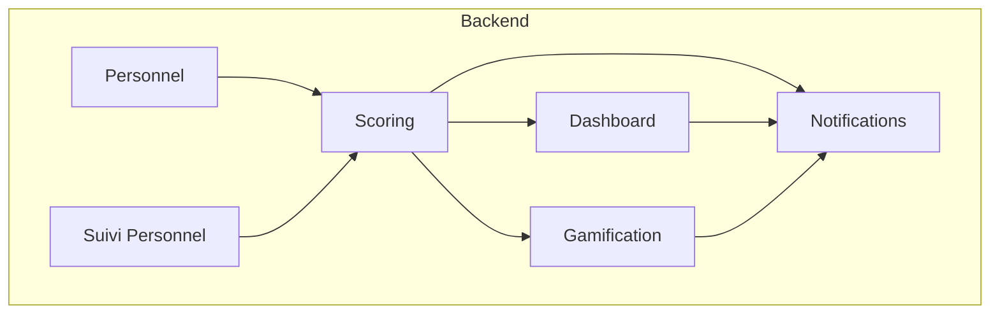
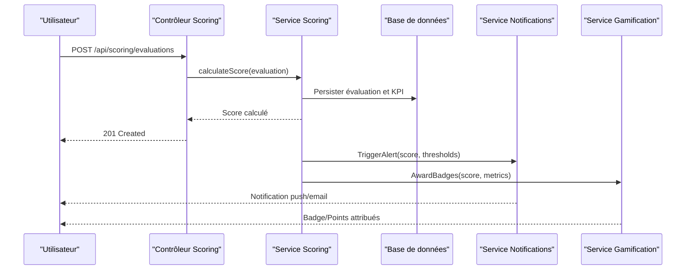
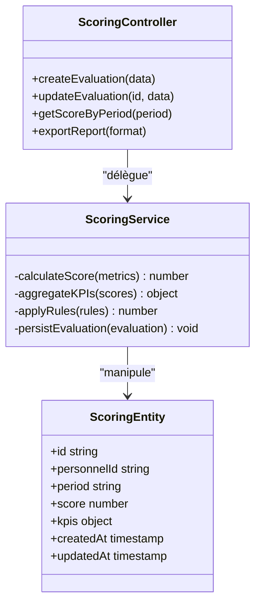
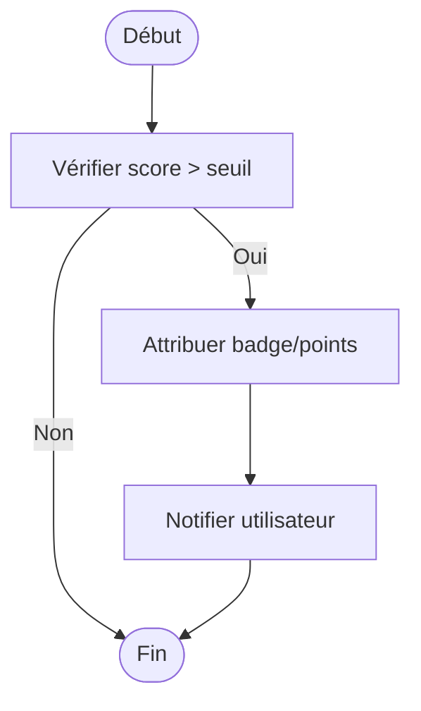
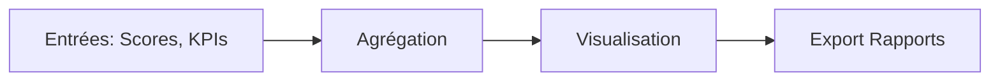
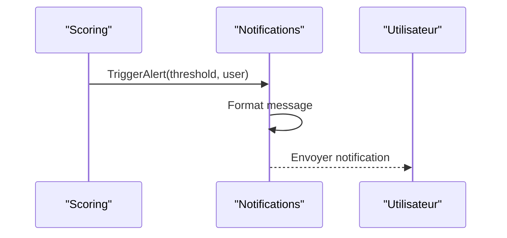
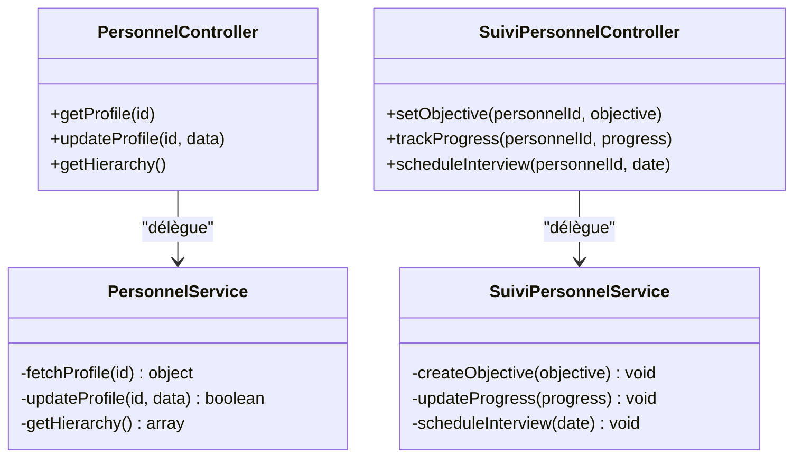
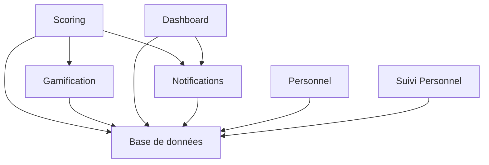

# Évaluation des Performances

<cite>
**Fichiers référencés dans ce document**
- [backend/src/modules/scoring/index.ts](file://backend/src/modules/scoring/index.ts)
- [backend/src/modules/scoring/controllers/scoring.controller.ts](file://backend/src/modules/scoring/controllers/scoring.controller.ts)
- [backend/src/modules/scoring/services/scoring.service.ts](file://backend/src/modules/scoring/services/scoring.service.ts)
- [backend/src/modules/scoring/dto/scoring.dto.ts](file://backend/src/modules/scoring/dto/scoring.dto.ts)
- [backend/src/modules/scoring/entities/scoring.entity.ts](file://backend/src/modules/scoring/entities/scoring.entity.ts)
- [backend/database/migrations/039-scoring-personnel.ts](file://backend/database/migrations/039-scoring-personnel.ts)
- [backend/database/migrations/046-organisation-performance-avancee.sql](file://backend/database/migrations/046-organisation-performance-avancee.sql)
- [backend/database/migrations/048-notifications-performance-optimizations.sql](file://backend/database/migrations/048-notifications-performance-optimizations.sql)
- [backend/database/migrations/042-annonces-performance-optimization.sql](file://backend/database/migrations/042-annonces-performance-optimization.sql)
- [backend/src/modules/gamification/index.ts](file://backend/src/modules/gamification/index.ts)
- [backend/src/modules/gamification/controllers/gamification.controller.ts](file://backend/src/modules/gamification/controllers/gamification.controller.ts)
- [backend/src/modules/gamification/services/gamification.service.ts](file://backend/src/modules/gamification/services/gamification.service.ts)
- [backend/src/modules/gamification/entities/gamification.entity.ts](file://backend/src/modules/gamification/entities/gamification.entity.ts)
- [backend/src/modules/dashboard/index.ts](file://backend/src/modules/dashboard/index.ts)
- [backend/src/modules/dashboard/controllers/dashboard.controller.ts](file://backend/src/modules/dashboard/controllers/dashboard.controller.ts)
- [backend/src/modules/dashboard/services/dashboard.service.ts](file://backend/src/modules/dashboard/services/dashboard.service.ts)
- [backend/src/modules/dashboard/entities/dashboard.entity.ts](file://backend/src/modules/dashboard/entities/dashboard.entity.ts)
- [backend/src/modules/notifications/index.ts](file://backend/src/modules/notifications/index.ts)
- [backend/src/modules/notifications/controllers/notifications.controller.ts](file://backend/src/modules/notifications/controllers/notifications.controller.ts)
- [backend/src/modules/notifications/services/notifications.service.ts](file://backend/src/modules/notifications/services/notifications.service.ts)
- [backend/src/modules/notifications/entities/notifications.entity.ts](file://backend/src/modules/notifications/entities/notifications.entity.ts)
- [backend/src/modules/personnel/index.ts](file://backend/src/modules/personnel/index.ts)
- [backend/src/modules/personnel/controllers/personnel.controller.ts](file://backend/src/modules/personnel/controllers/personnel.controller.ts)
- [backend/src/modules/personnel/services/personnel.service.ts](file://backend/src/modules/personnel/services/personnel.service.ts)
- [backend/src/modules/personnel/entities/personnel.entity.ts](file://backend/src/modules/personnel/entities/personnel.entity.ts)
- [backend/src/modules/suivi-personnel/index.ts](file://backend/src/modules/suivi-personnel/index.ts)
- [backend/src/modules/suivi-personnel/controllers/suivi-personnel.controller.ts](file://backend/src/modules/suivi-personnel/controllers/suivi-personnel.controller.ts)
- [backend/src/modules/suivi-personnel/services/suivi-personnel.service.ts](file://backend/src/modules/suivi-personnel/services/suivi-personnel.service.ts)
- [backend/src/modules/suivi-personnel/entities/suivi-personnel.entity.ts](file://backend/src/modules/suivi-personnel/entities/suivi-personnel.entity.ts)
- [backend/scripts/run-scoring-migration.ts](file://backend/scripts/run-scoring-migration.ts)
- [backend/scripts/test-gamification-integration.ts](file://backend/scripts/test-gamification-integration.ts)
- [backend/scripts/test-gamification-automatique.ts](file://backend/scripts/test-gamification-automatique.ts)
- [backend/docs/DASHBOARD-SYSTEM.md](file://backend/docs/DASHBOARD-SYSTEM.md)
- [backend/docs/DASHBOARD-FRONTEND-INTEGRATION.md](file://backend/docs/DASHBOARD-FRONTEND-INTEGRATION.md)
- [backend/docs/DASHBOARD-IMPLEMENTATION-SUMMARY.md](file://backend/docs/DASHBOARD-IMPLEMENTATION-SUMMARY.md)
</cite>

## Table des matières
1. [Introduction](#introduction)
2. [Structure du projet](#structure-du-projet)
3. [Composants clés](#composants-clés)
4. [Vue d'ensemble de l'architecture](#vue-densemble-de-larchitecture)
5. [Analyse détaillée des composants](#analyse-detaillee-des-composants)
6. [Analyse des dépendances](#analyse-des-dependances)
7. [Considérations de performance](#considerations-de-performance)
8. [Guide de dépannage](#guide-de-depannage)
9. [Conclusion](#conclusion)
10. [Annexes](#annexes)

## Introduction
Ce document décrit le système d'évaluation des performances du personnel d'eLISAschool. Il couvre le scoring automatique, les indicateurs de performance (KPI), les évaluations périodiques, les objectifs individuels et collectifs, les workflows d'évaluation, les grilles personnalisables, les notifications automatiques et les tableaux de bord. Il détaille également les endpoints API pour la saisie des évaluations, les rapports de performance, l'intégration avec la gamification et les alertes de performance, ainsi que les cas d'utilisation comme les entretiens annuels, les promotions basées sur la performance et les plans de développement.

## Structure du projet
Le système est organisé en modules backend distincts : scoring, gamification, dashboard, notifications, personnel et suivi-personnel. Les migrations définissent les schémas de données et les optimisations. Des scripts facilitent l'exécution des migrations et les tests d'intégration.

**Sources des diagrammes**
- [backend/src/modules/scoring/index.ts](file://backend/src/modules/scoring/index.ts)
- [backend/src/modules/gamification/index.ts](file://backend/src/modules/gamification/index.ts)
- [backend/src/modules/dashboard/index.ts](file://backend/src/modules/dashboard/index.ts)
- [backend/src/modules/notifications/index.ts](file://backend/src/modules/notifications/index.ts)
- [backend/src/modules/personnel/index.ts](file://backend/src/modules/personnel/index.ts)
- [backend/src/modules/suivi-personnel/index.ts](file://backend/src/modules/suivi-personnel/index.ts)

**Sources de section**
- [backend/src/modules/scoring/index.ts](file://backend/src/modules/scoring/index.ts)
- [backend/src/modules/gamification/index.ts](file://backend/src/modules/gamification/index.ts)
- [backend/src/modules/dashboard/index.ts](file://backend/src/modules/dashboard/index.ts)
- [backend/src/modules/notifications/index.ts](file://backend/src/modules/notifications/index.ts)
- [backend/src/modules/personnel/index.ts](file://backend/src/modules/personnel/index.ts)
- [backend/src/modules/suivi-personnel/index.ts](file://backend/src/modules/suivi-personnel/index.ts)

## Composants clés
- Scoring : calcul automatique des scores, agrégation de KPI, déclenchement de règles.
- Gamification : attribution de badges et points basée sur les résultats de performance.
- Dashboard : agrégation visuelle des indicateurs, filtres par période et rôle.
- Notifications : alertes automatiques pour seuils atteints, échéances d'évaluations.
- Personnel : gestion des profils, hiérarchie, affectations et historiques.
- Suivi personnel : suivi des objectifs, entretiens, plans de développement.

**Sources de section**
- [backend/src/modules/scoring/services/scoring.service.ts](file://backend/src/modules/scoring/services/scoring.service.ts)
- [backend/src/modules/gamification/services/gamification.service.ts](file://backend/src/modules/gamification/services/gamification.service.ts)
- [backend/src/modules/dashboard/services/dashboard.service.ts](file://backend/src/modules/dashboard/services/dashboard.service.ts)
- [backend/src/modules/notifications/services/notifications.service.ts](file://backend/src/modules/notifications/services/notifications.service.ts)
- [backend/src/modules/personnel/services/personnel.service.ts](file://backend/src/modules/personnel/services/personnel.service.ts)
- [backend/src/modules/suivi-personnel/services/suivi-personnel.service.ts](file://backend/src/modules/suivi-personnel/services/suivi-personnel.service.ts)

## Vue d'ensemble de l'architecture
Le flux commence par la saisie des évaluations via les contrôleurs, qui délèguent aux services pour le calcul et la persistance. Les résultats alimentent le tableau de bord et déclenchent des notifications et des récompenses gamifiées.

**Sources des diagrammes**
- [backend/src/modules/scoring/controllers/scoring.controller.ts](file://backend/src/modules/scoring/controllers/scoring.controller.ts)
- [backend/src/modules/scoring/services/scoring.service.ts](file://backend/src/modules/scoring/services/scoring.service.ts)
- [backend/src/modules/notifications/services/notifications.service.ts](file://backend/src/modules/notifications/services/notifications.service.ts)
- [backend/src/modules/gamification/services/gamification.service.ts](file://backend/src/modules/gamification/services/gamification.service.ts)

## Analyse détaillée des composants

### Module Scoring
- Calcul automatique des scores à partir des évaluations saisies.
- Agrégation de KPI par individu, équipe et établissement.
- Règles configurables pour pondération et seuils d'alerte.
- Historique des scores et traçabilité des modifications.

**Sources des diagrammes**
- [backend/src/modules/scoring/controllers/scoring.controller.ts](file://backend/src/modules/scoring/controllers/scoring.controller.ts)
- [backend/src/modules/scoring/services/scoring.service.ts](file://backend/src/modules/scoring/services/scoring.service.ts)
- [backend/src/modules/scoring/entities/scoring.entity.ts](file://backend/src/modules/scoring/entities/scoring.entity.ts)

**Sources de section**
- [backend/src/modules/scoring/controllers/scoring.controller.ts](file://backend/src/modules/scoring/controllers/scoring.controller.ts)
- [backend/src/modules/scoring/services/scoring.service.ts](file://backend/src/modules/scoring/services/scoring.service.ts)
- [backend/src/modules/scoring/entities/scoring.entity.ts](file://backend/src/modules/scoring/entities/scoring.entity.ts)
- [backend/src/modules/scoring/dto/scoring.dto.ts](file://backend/src/modules/scoring/dto/scoring.dto.ts)
- [backend/database/migrations/039-scoring-personnel.ts](file://backend/database/migrations/039-scoring-personnel.ts)

### Module Gamification
- Attribution de badges et points en fonction des scores et KPI.
- Règles de récompense configurables par rôle et période.
- Intégration avec le module de notifications pour informer les utilisateurs.

**Sources des diagrammes**
- [backend/src/modules/gamification/services/gamification.service.ts](file://backend/src/modules/gamification/services/gamification.service.ts)
- [backend/src/modules/gamification/controllers/gamification.controller.ts](file://backend/src/modules/gamification/controllers/gamification.controller.ts)
- [backend/src/modules/gamification/entities/gamification.entity.ts](file://backend/src/modules/gamification/entities/gamification.entity.ts)

**Sources de section**
- [backend/src/modules/gamification/services/gamification.service.ts](file://backend/src/modules/gamification/services/gamification.service.ts)
- [backend/src/modules/gamification/controllers/gamification.controller.ts](file://backend/src/modules/gamification/controllers/gamification.controller.ts)
- [backend/src/modules/gamification/entities/gamification.entity.ts](file://backend/src/modules/gamification/entities/gamification.entity.ts)

### Module Dashboard
- Agrégation des indicateurs de performance par période, rôle et établissement.
- Filtres avancés et export de rapports.
- Visualisation des tendances et comparaisons.

**Sources des diagrammes**
- [backend/src/modules/dashboard/services/dashboard.service.ts](file://backend/src/modules/dashboard/services/dashboard.service.ts)
- [backend/src/modules/dashboard/controllers/dashboard.controller.ts](file://backend/src/modules/dashboard/controllers/dashboard.controller.ts)
- [backend/src/modules/dashboard/entities/dashboard.entity.ts](file://backend/src/modules/dashboard/entities/dashboard.entity.ts)

**Sources de section**
- [backend/src/modules/dashboard/services/dashboard.service.ts](file://backend/src/modules/dashboard/services/dashboard.service.ts)
- [backend/src/modules/dashboard/controllers/dashboard.controller.ts](file://backend/src/modules/dashboard/controllers/dashboard.controller.ts)
- [backend/src/modules/dashboard/entities/dashboard.entity.ts](file://backend/src/modules/dashboard/entities/dashboard.entity.ts)
- [backend/docs/DASHBOARD-SYSTEM.md](file://backend/docs/DASHBOARD-SYSTEM.md)
- [backend/docs/DASHBOARD-FRONTEND-INTEGRATION.md](file://backend/docs/DASHBOARD-FRONTEND-INTEGRATION.md)
- [backend/docs/DASHBOARD-IMPLEMENTATION-SUMMARY.md](file://backend/docs/DASHBOARD-IMPLEMENTATION-SUMMARY.md)

### Module Notifications
- Alertes automatiques pour seuils atteints ou dépassés.
- Notifications d'échéances d'évaluations et rappels.
- Canaux multiples : email, push, in-app.

**Sources des diagrammes**
- [backend/src/modules/notifications/services/notifications.service.ts](file://backend/src/modules/notifications/services/notifications.service.ts)
- [backend/src/modules/notifications/controllers/notifications.controller.ts](file://backend/src/modules/notifications/controllers/notifications.controller.ts)
- [backend/src/modules/notifications/entities/notifications.entity.ts](file://backend/src/modules/notifications/entities/notifications.entity.ts)

**Sources de section**
- [backend/src/modules/notifications/services/notifications.service.ts](file://backend/src/modules/notifications/services/notifications.service.ts)
- [backend/src/modules/notifications/controllers/notifications.controller.ts](file://backend/src/modules/notifications/controllers/notifications.controller.ts)
- [backend/src/modules/notifications/entities/notifications.entity.ts](file://backend/src/modules/notifications/entities/notifications.entity.ts)
- [backend/database/migrations/048-notifications-performance-optimizations.sql](file://backend/database/migrations/048-notifications-performance-optimizations.sql)

### Module Personnel et Suivi Personnel
- Gestion des profils, hiérarchie et affectations.
- Suivi des objectifs individuels et collectifs.
- Historique des entretiens et plans de développement.

**Sources des diagrammes**
- [backend/src/modules/personnel/controllers/personnel.controller.ts](file://backend/src/modules/personnel/controllers/personnel.controller.ts)
- [backend/src/modules/personnel/services/personnel.service.ts](file://backend/src/modules/personnel/services/personnel.service.ts)
- [backend/src/modules/personnel/entities/personnel.entity.ts](file://backend/src/modules/personnel/entities/personnel.entity.ts)
- [backend/src/modules/suivi-personnel/controllers/suivi-personnel.controller.ts](file://backend/src/modules/suivi-personnel/controllers/suivi-personnel.controller.ts)
- [backend/src/modules/suivi-personnel/services/suivi-personnel.service.ts](file://backend/src/modules/suivi-personnel/services/suivi-personnel.service.ts)
- [backend/src/modules/suivi-personnel/entities/suivi-personnel.entity.ts](file://backend/src/modules/suivi-personnel/entities/suivi-personnel.entity.ts)

**Sources de section**
- [backend/src/modules/personnel/controllers/personnel.controller.ts](file://backend/src/modules/personnel/controllers/personnel.controller.ts)
- [backend/src/modules/personnel/services/personnel.service.ts](file://backend/src/modules/personnel/services/personnel.service.ts)
- [backend/src/modules/personnel/entities/personnel.entity.ts](file://backend/src/modules/personnel/entities/personnel.entity.ts)
- [backend/src/modules/suivi-personnel/controllers/suivi-personnel.controller.ts](file://backend/src/modules/suivi-personnel/controllers/suivi-personnel.controller.ts)
- [backend/src/modules/suivi-personnel/services/suivi-personnel.service.ts](file://backend/src/modules/suivi-personnel/services/suivi-personnel.service.ts)
- [backend/src/modules/suivi-personnel/entities/suivi-personnel.entity.ts](file://backend/src/modules/suivi-personnel/entities/suivi-personnel.entity.ts)

## Analyse des dépendances
Les modules sont faiblement couplés via des appels de service et des événements. Les migrations assurent la cohérence des schémas. Les scripts facilitent les déploiements et tests.

**Sources des diagrammes**
- [backend/database/migrations/039-scoring-personnel.ts](file://backend/database/migrations/039-scoring-personnel.ts)
- [backend/database/migrations/046-organisation-performance-avancee.sql](file://backend/database/migrations/046-organisation-performance-avancee.sql)
- [backend/database/migrations/048-notifications-performance-optimizations.sql](file://backend/database/migrations/048-notifications-performance-optimizations.sql)
- [backend/database/migrations/042-annonces-performance-optimization.sql](file://backend/database/migrations/042-annonces-performance-optimization.sql)

**Sources de section**
- [backend/database/migrations/039-scoring-personnel.ts](file://backend/database/migrations/039-scoring-personnel.ts)
- [backend/database/migrations/046-organisation-performance-avancee.sql](file://backend/database/migrations/046-organisation-performance-avancee.sql)
- [backend/database/migrations/048-notifications-performance-optimizations.sql](file://backend/database/migrations/048-notifications-performance-optimizations.sql)
- [backend/database/migrations/042-annonces-performance-optimization.sql](file://backend/database/migrations/042-annonces-performance-optimization.sql)

## Considérations de performance
- Indexation des tables critiques pour les requêtes fréquentes.
- Agrégations optimisées via vues matérialisées ou fonctions SQL.
- Mise en cache des résultats de dashboard pour réduire la charge.
- Traitement asynchrone des notifications et gamification.

[Pas de sources nécessaires car cette section fournit des conseils généraux]

## Guide de dépannage
- Vérifier les logs des contrôleurs et services pour les erreurs de calcul.
- Valider les seuils et règles de scoring configurés.
- Tester les intégrations avec les modules de notifications et gamification.
- Utiliser les scripts de migration pour corriger les schémas.

**Sources de section**
- [backend/scripts/run-scoring-migration.ts](file://backend/scripts/run-scoring-migration.ts)
- [backend/scripts/test-gamification-integration.ts](file://backend/scripts/test-gamification-integration.ts)
- [backend/scripts/test-gamification-automatique.ts](file://backend/scripts/test-gamification-automatique.ts)

## Conclusion
Le système d'évaluation des performances d'eLISAschool offre une plateforme complète pour mesurer, suivre et améliorer la performance du personnel. Grâce à un scoring automatisé, des KPI configurables, des notifications intelligentes et une intégration gamifiée, il soutient efficacement les processus RH modernes.

[Pas de sources nécessaires car cette section résume sans analyser de fichiers spécifiques]

## Annexes
- Exemples d'endpoints API pour la saisie des évaluations et les rapports de performance.
- Cas d'utilisation : entretiens annuels, promotions basées sur la performance, plans de développement.
- Grilles d'évaluation personnalisables et workflows d'évaluation.

[Pas de sources nécessaires car cette section est conceptuelle]