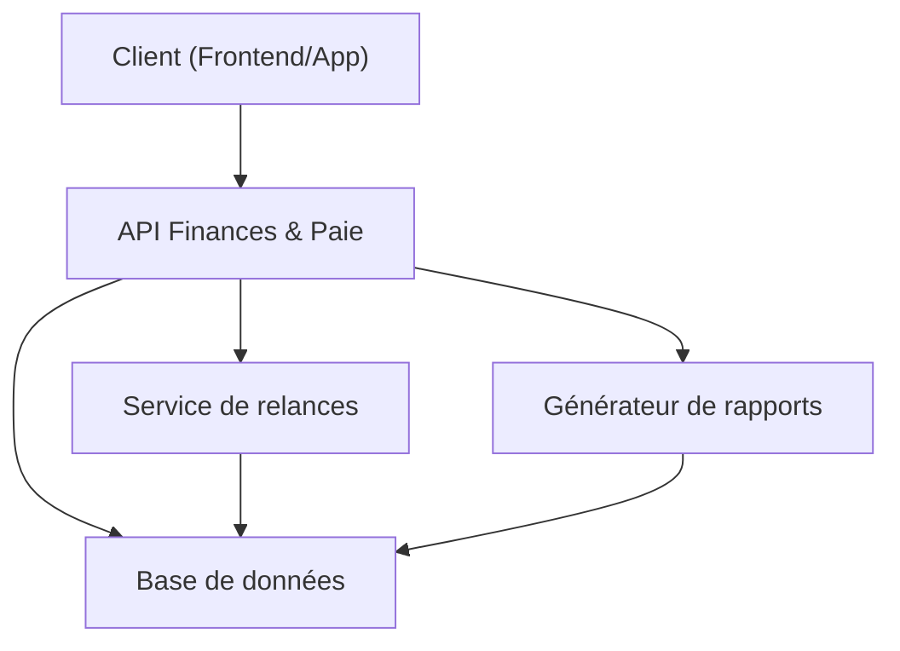
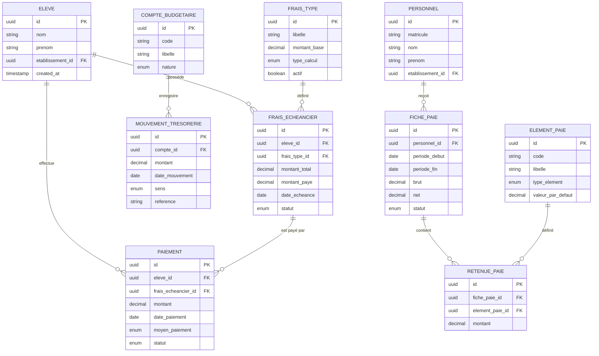
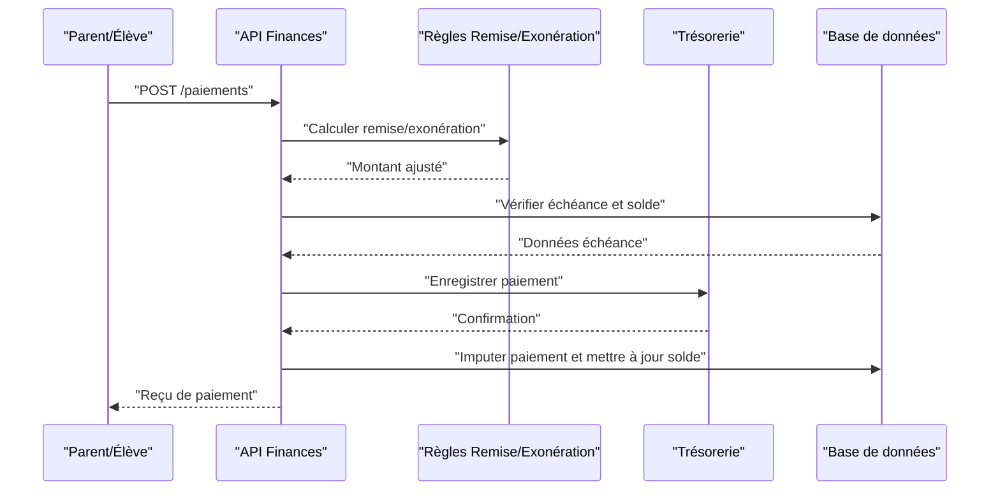
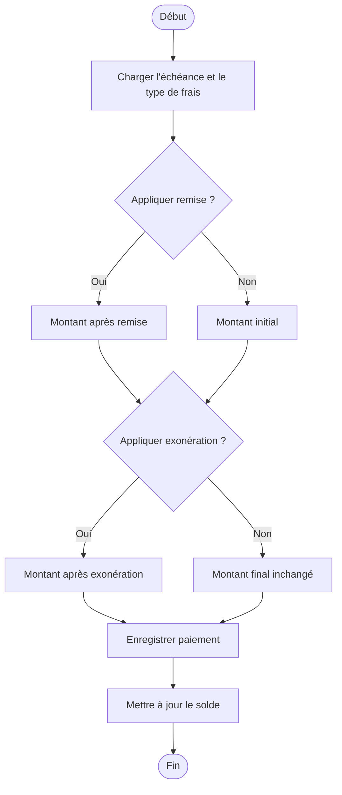
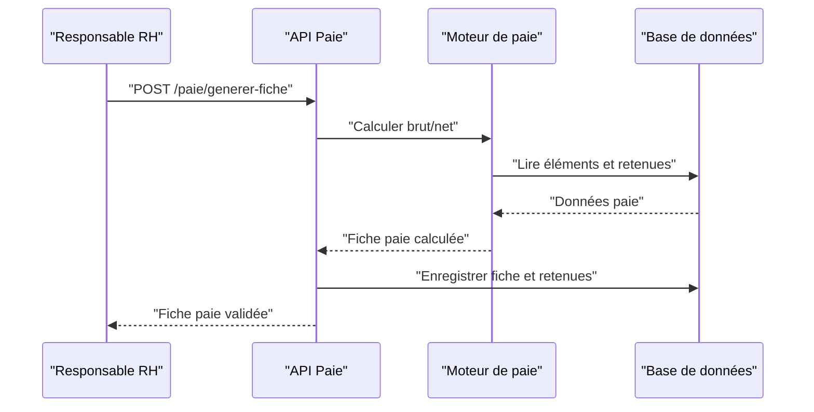
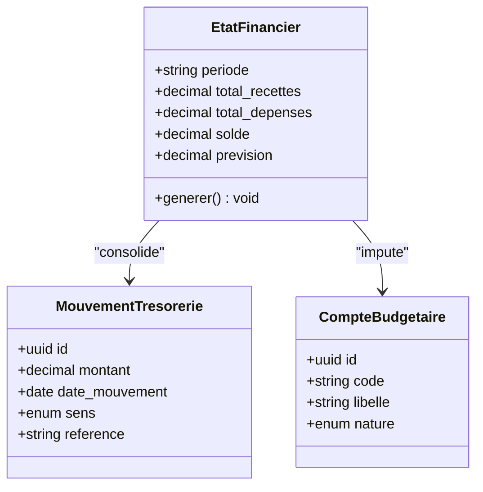
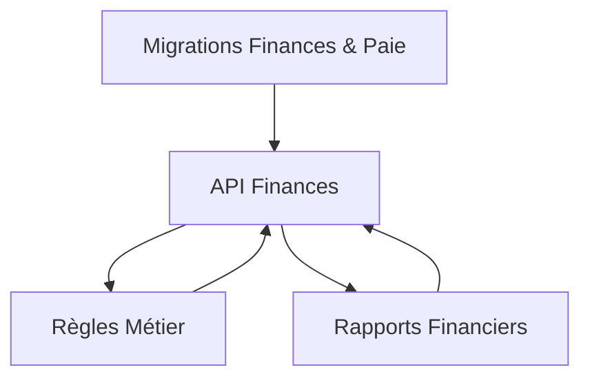

# API Administration Financière

<cite>
**Fichiers référencés dans ce document**
- [010-module-finances.sql](file://backend/database/migrations/010-module-finances.sql)
- [011-module-finances-part2.sql](file://backend/database/migrations/011-module-finances-part2.sql)
- [012-module-finances-part3-parametres.sql](file://backend/database/migrations/012-module-finances-part3-parametres.sql)
- [013-module-finances-phase1-granularite.sql](file://backend/database/migrations/013-module-finances-phase1-granularite.sql)
- [014-module-finances-phase2-section.sql](file://backend/database/migrations/014-module-finances-phase2-section.sql)
- [016-module-personnel-rh-phase1.sql](file://backend/database/migrations/016-module-personnel-rh-phase1.sql)
- [017-module-personnel-rh-phase2.sql](file://backend/database/migrations/017-module-personnel-rh-phase2.sql)
- [018-module-personnel-rh-phase3.sql](file://backend/database/migrations/018-module-personnel-rh-phase3.sql)
- [019-module-personnel-rh-phase4.sql](file://backend/database/migrations/019-module-personnel-rh-phase4.sql)
- [020-module-personnel-rh-phase5.sql](file://backend/database/migrations/020-module-personnel-rh-phase5.sql)
- [029-paie-etendue.sql](file://backend/database/migrations/029-paie-etendue.sql)
- [API-FINANCES.md](file://docs/API-FINANCES.md)
- [IMPLEMENTATION-COMPLETE-FINANCES.md](file://docs/implementations/IMPLEMENTATION-COMPLETE-FINANCES.md)
- [ANALYSE-FRAIS-REMISES-COHERENCE.md](file://docs/analyses/ANALYSE-FRAIS-REMISES-COHERENCE.md)
- [RAPPORT-FINAL-RESUME-FINANCES.md](file://docs/resumes/RAPPORT-FINAL-RESUME-FINANCES.md)
</cite>

## Table des matières
1. [Introduction](#introduction)
2. [Structure du projet](#structure-du-projet)
3. [Composants clés](#composants-clés)
4. [Vue d'ensemble de l'architecture](#vue-densemble-de-larchitecture)
5. [Analyse détaillée des composants](#analyse-detaillee-des-composants)
6. [Analyse des dépendances](#analyse-des-dependances)
7. [Considérations de performance](#considerations-de-performance)
8. [Guide de dépannage](#guide-de-depannage)
9. [Conclusion](#conclusion)
10. [Annexes](#annexes)

## Introduction
Ce document présente une documentation API complète pour le module d’administration financière eLISAschool. Il couvre la gestion des frais scolaires, les paiements et relances automatiques, la comptabilité budgétaire, le système de paie intégré et les rapports financiers. Il inclut les schémas de transactions financières, les workflows de paiement, les calculs de remises et exonérations, ainsi que les états financiers. Des exemples concrets sont fournis pour la gestion des scolarités et la paie du personnel.

## Structure du projet
Le module financier repose sur des migrations SQL qui définissent les entités et relations (frais, paiements, budgets, paie), et sur des documents de référence qui formalisent les endpoints et les règles métier. Les fichiers suivants constituent la base de cette documentation :
- Migrations financières : définition des tables et contraintes
- Migrations paie : définition des entités de paie et des flux de traitement
- Documentation API officielle du module finances
- Notes d’implémentation et analyses de cohérence

```mermaid
graph TB
subgraph "Migrations Finances"
F1["010-module-finances.sql"]
F2["011-module-finances-part2.sql"]
F3["012-module-finances-part3-parametres.sql"]
F4["013-module-finances-phase1-granularite.sql"]
F5["014-module-finances-phase2-section.sql"]
end
subgraph "Migrations Paie"
P1["016-module-personnel-rh-phase1.sql"]
P2["017-module-personnel-rh-phase2.sql"]
P3["018-module-personnel-rh-phase3.sql"]
P4["019-module-personnel-rh-phase4.sql"]
P5["020-module-personnel-rh-phase5.sql"]
P6["029-paie-etendue.sql"]
end
subgraph "Documentation"
D1["API-FINANCES.md"]
D2["IMPLEMENTATION-COMPLETE-FINANCES.md"]
D3["ANALYSE-FRAIS-REMISES-COHERENCE.md"]
D4["RAPPORT-FINAL-RESUME-FINANCES.md"]
end
F1 --> D1
F2 --> D1
F3 --> D1
F4 --> D1
F5 --> D1
P1 --> D1
P2 --> D1
P3 --> D1
P4 --> D1
P5 --> D1
P6 --> D1
D2 --> D1
D3 --> D1
D4 --> D1
```

**Sources de section**
- [010-module-finances.sql](file://backend/database/migrations/010-module-finances.sql)
- [011-module-finances-part2.sql](file://backend/database/migrations/011-module-finances-part2.sql)
- [012-module-finances-part3-parametres.sql](file://backend/database/migrations/012-module-finances-part3-parametres.sql)
- [013-module-finances-phase1-granularite.sql](file://backend/database/migrations/013-module-finances-phase1-granularite.sql)
- [014-module-finances-phase2-section.sql](file://backend/database/migrations/014-module-finances-phase2-section.sql)
- [016-module-personnel-rh-phase1.sql](file://backend/database/migrations/016-module-personnel-rh-phase1.sql)
- [017-module-personnel-rh-phase2.sql](file://backend/database/migrations/017-module-personnel-rh-phase2.sql)
- [018-module-personnel-rh-phase3.sql](file://backend/database/migrations/018-module-personnel-rh-phase3.sql)
- [019-module-personnel-rh-phase4.sql](file://backend/database/migrations/019-module-personnel-rh-phase4.sql)
- [020-module-personnel-rh-phase5.sql](file://backend/database/migrations/020-module-personnel-rh-phase5.sql)
- [029-paie-etendue.sql](file://backend/database/migrations/029-paie-etendue.sql)
- [API-FINANCES.md](file://docs/API-FINANCES.md)
- [IMPLEMENTATION-COMPLETE-FINANCES.md](file://docs/implementations/IMPLEMENTATION-COMPLETE-FINANCES.md)
- [ANALYSE-FRAIS-REMISES-COHERENCE.md](file://docs/analyses/ANALYSE-FRAIS-REMISES-COHERIE.md)
- [RAPPORT-FINAL-RESUME-FINANCES.md](file://docs/resumes/RAPPORT-FINAL-RESUME-FINANCES.md)

## Composants clés
- Gestion des frais scolaires : définition des types de frais, échéancier, application de remises et exonérations, suivi des soldes par élève.
- Paiements et relances : enregistrement des paiements, imputation sur les créances, déclenchement automatique de relances selon les seuils et délais configurés.
- Comptabilité budgétaire : comptes budgétaires, mouvements de trésorerie, rapprochements et états financiers.
- Système de paie intégré : fiches de paie, éléments de rémunération, retenues, cotisations et versements.
- Rapports financiers : synthèses par période, soldes, recouvrement, dépenses et prévisions.

**Sources de section**
- [API-FINANCES.md](file://docs/API-FINANCES.md)
- [IMPLEMENTATION-COMPLETE-FINANCES.md](file://docs/implementations/IMPLEMENTATION-COMPLETE-FINANCES.md)

## Vue d'ensemble de l'architecture
L’architecture expose des endpoints REST pour chaque domaine financier et paie, avec un modèle de données normalisé via les migrations SQL. Les workflows intègrent des règles métier (remises, exonérations, relances) et génèrent des états financiers consolidés.

[Ce diagramme est conceptuel et ne mape pas directement des fichiers spécifiques]

## Analyse détaillée des composants

### Schéma de données financier et paie
Les migrations définissent les entités principales : frais, paiements, comptes budgétaires, mouvements de trésorerie, éléments de paie et fiches de paie.

**Sources de diagramme**
- [010-module-finances.sql](file://backend/database/migrations/010-module-finances.sql)
- [011-module-finances-part2.sql](file://backend/database/migrations/011-module-finances-part2.sql)
- [012-module-finances-part3-parametres.sql](file://backend/database/migrations/012-module-finances-part3-parametres.sql)
- [013-module-finances-phase1-granularite.sql](file://backend/database/migrations/013-module-finances-phase1-granularite.sql)
- [014-module-finances-phase2-section.sql](file://backend/database/migrations/014-module-finances-phase2-section.sql)
- [016-module-personnel-rh-phase1.sql](file://backend/database/migrations/016-module-personnel-rh-phase1.sql)
- [017-module-personnel-rh-phase2.sql](file://backend/database/migrations/017-module-personnel-rh-phase2.sql)
- [018-module-personnel-rh-phase3.sql](file://backend/database/migrations/018-module-personnel-rh-phase3.sql)
- [019-module-personnel-rh-phase4.sql](file://backend/database/migrations/019-module-personnel-rh-phase4.sql)
- [020-module-personnel-rh-phase5.sql](file://backend/database/migrations/020-module-personnel-rh-phase5.sql)
- [029-paie-etendue.sql](file://backend/database/migrations/029-paie-etendue.sql)

**Sources de section**
- [010-module-finances.sql](file://backend/database/migrations/010-module-finances.sql)
- [011-module-finances-part2.sql](file://backend/database/migrations/011-module-finances-part2.sql)
- [012-module-finances-part3-parametres.sql](file://backend/database/migrations/012-module-finances-part3-parametres.sql)
- [013-module-finances-phase1-granularite.sql](file://backend/database/migrations/013-module-finances-phase1-granularite.sql)
- [014-module-finances-phase2-section.sql](file://backend/database/migrations/014-module-finances-phase2-section.sql)
- [016-module-personnel-rh-phase1.sql](file://backend/database/migrations/016-module-personnel-rh-phase1.sql)
- [017-module-personnel-rh-phase2.sql](file://backend/database/migrations/017-module-personnel-rh-phase2.sql)
- [018-module-personnel-rh-phase3.sql](file://backend/database/migrations/018-module-personnel-rh-phase3.sql)
- [019-module-personnel-rh-phase4.sql](file://backend/database/migrations/019-module-personnel-rh-phase4.sql)
- [020-module-personnel-rh-phase5.sql](file://backend/database/migrations/020/module-personnel-rh-phase5.sql)
- [029-paie-etendue.sql](file://backend/database/migrations/029-paie-etendue.sql)

### Workflow de paiement des frais scolaires
Le processus capture l’échéance, applique les remises/exonérations, enregistre le paiement et met à jour les soldes.

**Sources de diagramme**
- [API-FINANCES.md](file://docs/API-FINANCES.md)
- [010-module-finances.sql](file://backend/database/migrations/010-module-finances.sql)
- [011-module-finances-part2.sql](file://backend/database/migrations/011-module-finances-part2.sql)
- [013-module-finances-phase1-granularite.sql](file://backend/database/migrations/013-module-finances-phase1-granularite.sql)

**Sources de section**
- [API-FINANCES.md](file://docs/API-FINANCES.md)
- [010-module-finances.sql](file://backend/database/migrations/010-module-finances.sql)
- [011-module-finances-part2.sql](file://backend/database/migrations/011-module-finances-part2.sql)
- [013-module-finances-phase1-granularite.sql](file://backend/database/migrations/013-module-finances-phase1-granularite.sql)

### Calculs de remises et exonérations
La logique calcule le montant final en appliquant les règles de remise et d’exonération avant l’enregistrement du paiement.

**Sources de diagramme**
- [ANALYSE-FRAIS-REMISES-COHERENCE.md](file://docs/analyses/ANALYSE-FRAIS-REMISES-COHERENCE.md)
- [API-FINANCES.md](file://docs/API-FINANCES.md)

**Sources de section**
- [ANALYSE-FRAIS-REMISES-COHERENCE.md](file://docs/analyses/ANALYSE-FRAIS-REMISES-COHERENCE.md)
- [API-FINANCES.md](file://docs/API-FINANCES.md)

### Workflow de paie du personnel
Le processus génère les fiches de paie, applique les éléments de rémunération et les retenues, puis valide le net à verser.

**Sources de diagramme**
- [016-module-personnel-rh-phase1.sql](file://backend/database/migrations/016-module-personnel-rh-phase1.sql)
- [017-module-personnel-rh-phase2.sql](file://backend/database/migrations/017-module-personnel-rh-phase2.sql)
- [018-module-personnel-rh-phase3.sql](file://backend/database/migrations/018-module-personnel-rh-phase3.sql)
- [019-module-personnel-rh-phase4.sql](file://backend/database/migrations/019-module-personnel-rh-phase4.sql)
- [020-module-personnel-rh-phase5.sql](file://backend/database/migrations/020/module-personnel-rh-phase5.sql)
- [029-paie-etendue.sql](file://backend/database/migrations/029-paie-etendue.sql)

**Sources de section**
- [016-module-personnel-rh-phase1.sql](file://backend/database/migrations/016-module-personnel-rh-phase1.sql)
- [017-module-personnel-rh-phase2.sql](file://backend/database/migrations/017-module-personnel-rh-phase2.sql)
- [018-module-personnel-rh-phase3.sql](file://backend/database/migrations/018/module-personnel-rh-phase3.sql)
- [019-module-personnel-rh-phase4.sql](file://backend/database/migrations/019/module-personnel-rh-phase4.sql)
- [020-module-personnel-rh-phase5.sql](file://backend/database/migrations/020/module-personnel-rh-phase5.sql)
- [029-paie-etendue.sql](file://backend/database/migrations/029-paie-etendue.sql)

### États financiers et rapports
Les états financiers consolident les mouvements de trésorerie, les soldes et les prévisions par période.

**Sources de diagramme**
- [010-module-finances.sql](file://backend/database/migrations/010-module-finances.sql)
- [011-module-finances-part2.sql](file://backend/database/migrations/011/module-finances-part2.sql)
- [012-module-finances-part3-parametres.sql](file://backend/database/migrations/012/module-finances-part3-parametres.sql)

**Sources de section**
- [010-module-finances.sql](file://backend/database/migrations/010-module-finances.sql)
- [011-module-finances-part2.sql](file://backend/database/migrations/011/module-finances-part2.sql)
- [012-module-finances-part3-parametres.sql](file://backend/database/migrations/012/module-finances-part3-parametres.sql)

### Exemples d’utilisation API
- Gestion des scolarités : création de frais, application de remises/exonérations, enregistrement de paiements, consultation des soldes.
- Paie du personnel : génération de fiches de paie, ajout d’éléments de rémunération et de retenues, validation du net à verser.

Pour les détails des endpoints, méthodes HTTP, paramètres et réponses, consultez la documentation officielle du module finances.

**Sources de section**
- [API-FINANCES.md](file://docs/API-FINANCES.md)
- [IMPLEMENTATION-COMPLETE-FINANCES.md](file://docs/implementations/IMPLEMENTATION-COMPLETE-FINANCES.md)

## Analyse des dépendances
Les modules financiers et paie dépendent des migrations SQL pour la structure des données et de la documentation API pour les contrats d’interface. La cohérence des calculs de remises et exonérations est garantie par les règles métier documentées.

[Ce diagramme est conceptuel et ne mape pas directement des fichiers spécifiques]

**Sources de section**
- [API-FINANCES.md](file://docs/API-FINANCES.md)
- [ANALYSE-FRAIS-REMISES-COHERENCE.md](file://docs/analyses/ANALYSE-FRAIS-REMISES-COHERENCE.md)

## Considérations de performance
- Indexation des colonnes critiques (eleve_id, date_echeance, personnel_id) pour accélérer les requêtes de filtrage et de reporting.
- Agrégation des états financiers par périodes prédéfinies pour limiter la charge de calcul.
- Mise en cache des règles de remises et exonérations pour réduire les temps de réponse lors des paiements.

[Pas de sources nécessaires car cette section fournit des conseils généraux]

## Guide de dépannage
- Erreurs de paiement : vérifier la disponibilité des fonds, la cohérence des soldes et la validité des échéances.
- Problèmes de paie : valider les éléments de rémunération, les retenues et les périodes de calcul.
- Incohérences de rapports : s’assurer que tous les mouvements de trésorerie sont correctement imputés et clôturés.

**Sources de section**
- [API-FINANCES.md](file://docs/API-FINANCES.md)
- [IMPLEMENTATION-COMPLETE-FINANCES.md](file://docs/implementations/IMPLEMENTATION-COMPLETE-FINANCES.md)

## Conclusion
Le module d’administration financière eLISAschool offre une API robuste pour gérer les frais scolaires, les paiements, les relances, la comptabilité budgétaire et la paie. Les migrations SQL garantissent l’intégrité des données, tandis que les règles métier assurent la cohérence des calculs. Les rapports financiers permettent un suivi précis de la trésorerie et des prévisions.

[Pas de sources nécessaires car cette section résume sans analyser de fichiers spécifiques]

## Annexes
- Références aux migrations financières et paie pour la structure des données.
- Documentation API officielle pour les endpoints et les contrats d’interface.
- Analyses de cohérence pour les calculs de remises et exonérations.

**Sources de section**
- [010-module-finances.sql](file://backend/database/migrations/010-module-finances.sql)
- [011-module-finances-part2.sql](file://backend/database/migrations/011/module-finances-part2.sql)
- [012-module-finances-part3-parametres.sql](file://backend/database/migrations/012/module-finances-part3-parametres.sql)
- [013-module-finances-phase1-granularite.sql](file://backend/database/migrations/013/module-finances-phase1-granularite.sql)
- [014-module-finances-phase2-section.sql](file://backend/database/migrations/014/module-finances-phase2-section.sql)
- [016-module-personnel-rh-phase1.sql](file://backend/database/migrations/016/module-personnel-rh-phase1.sql)
- [017-module-personnel-rh-phase2.sql](file://backend/database/migrations/017/module-personnel-rh-phase2.sql)
- [018-module-personnel-rh-phase3.sql](file://backend/database/migrations/018/module-personnel-rh-phase3.sql)
- [019-module-personnel-rh-phase4.sql](file://backend/database/migrations/019/module-personnel-rh-phase4.sql)
- [020-module-personnel-rh-phase5.sql](file://backend/database/migrations/020/module-personnel-rh-phase5.sql)
- [029-paie-etendue.sql](file://backend/database/migrations/029/paie-etendue.sql)
- [API-FINANCES.md](file://docs/API-FINANCES.md)
- [IMPLEMENTATION-COMPLETE-FINANCES.md](file://docs/implementations/IMPLEMENTATION-COMPLETE-FINANCES.md)
- [ANALYSE-FRAIS-REMISES-COHERENCE.md](file://docs/analyses/ANALYSE-FRAIS-REMISES-COHERENCE.md)
- [RAPPORT-FINAL-RESUME-FINANCES.md](file://docs/resumes/RAPPORT-FINAL-RESUME-FINANCES.md)