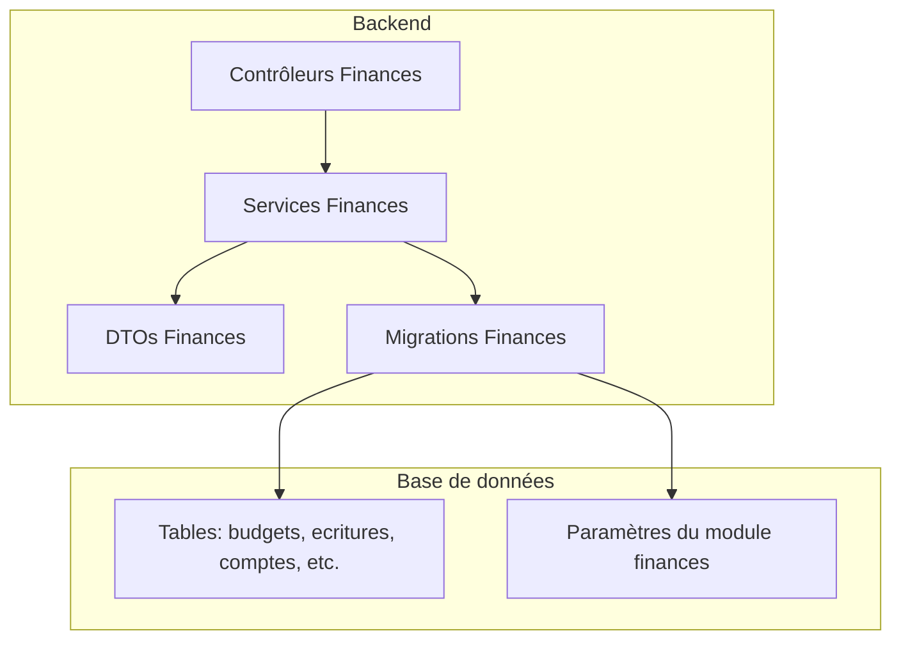
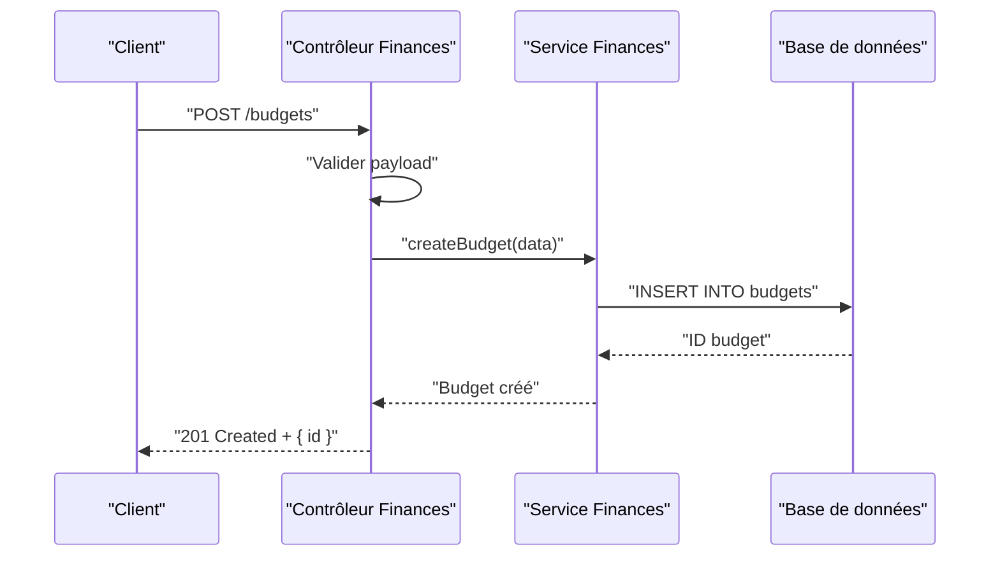
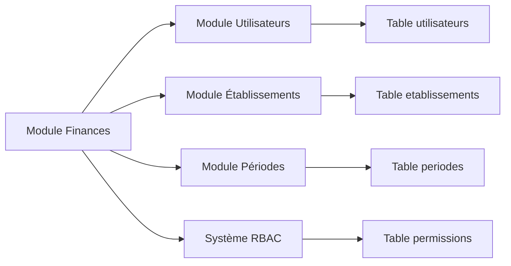
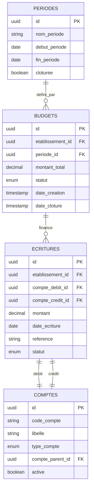

# API Comptabilité et Budget

<cite>
**Fichiers référencés dans ce document**
- [010-module-finances.sql](file://backend/database/migrations/010-module-finances.sql)
- [011-module-finances-part2.sql](file://backend/database/migrations/011-module-finances-part2.sql)
- [012-module-finances-part3-parametres.sql](file://backend/database/migrations/012-module-finances-part3-parametres.sql)
- [013-module-finances-phase1-granularite.sql](file://backend/database/migrations/013-module-finances-phase1-granularite.sql)
- [014-module-finances-phase2-section.sql](file://backend/database/migrations/014-module-finances-phase2-section.sql)
- [API-FINANCES.md](file://docs/API-FINANCES.md)
- [IMPLEMENTATION-COMPLETE-FINANCES.md](file://docs/implementations/IMPLEMENTATION-COMPLETE-FINANCES.md)
- [ANALYSE-GESTION-FINANCIERE.md](file://docs/analyses/ANALYSE-GESTION-FINANCIERE.md)
- [AMÉLIORATIONS-FINANCES-FINAL.md](file://docs/ameliorations/AMELIORATIONS-FINANCES-FINAL.md)
- [test-finance-module.sh](file://scripts/test-finance-module.sh)
</cite>

## Table des matières
1. [Introduction](#introduction)
2. [Structure du projet](#structure-du-projet)
3. [Composants principaux](#composants-principaux)
4. [Vue d’ensemble de l’architecture](#vue-densemble-de-larchitecture)
5. [Analyse détaillée des composants](#analyse-detallee-des-composants)
6. [Analyse des dépendances](#analyse-des-dependances)
7. [Considérations de performance](#considerations-de-performance)
8. [Guide de dépannage](#guide-de-depannage)
9. [Conclusion](#conclusion)
10. [Annexes](#annexes)

## Introduction
Ce document présente une documentation API complète pour la comptabilité et le budget eLISAschool. Il couvre les endpoints pour la gestion budgétaire, les écritures comptables, les rapports financiers, les soldes et bilans, ainsi que les analyses financières. Il inclut également les schémas de données comptables, les plans de comptes, les flux de trésorerie et les indicateurs financiers, accompagnés d’exemples pratiques pour créer des budgets, enregistrer des opérations comptables et générer des rapports financiers périodiques.

## Structure du projet
Le module Finances est implémenté dans le backend sous forme de migrations SQL et de code TypeScript (controllers, services, DTOs). Les migrations définissent le schéma de base de données et les paramètres du module. La documentation API officielle se trouve dans docs/API-FINANCES.md, tandis que les détails d’implémentation sont disponibles dans les documents d’implémentation et d’analyse.



**Sources de diagramme**
- [010-module-finances.sql](file://backend/database/migrations/010-module-finances.sql)
- [011-module-finances-part2.sql](file://backend/database/migrations/011-module-finances-part2.sql)
- [012-module-finances-part3-parametres.sql](file://backend/database/migrations/012-module-finances-part3-parametres.sql)
- [013-module-finances-phase1-granularite.sql](file://backend/database/migrations/013-module-finances-phase1-granularite.sql)
- [014-module-finances-phase2-section.sql](file://backend/database/migrations/014-module-finances-phase2-section.sql)

**Sources de section**
- [API-FINANCES.md](file://docs/API-FINANCES.md)
- [IMPLEMENTATION-COMPLETE-FINANCES.md](file://docs/implementations/IMPLEMENTATION-COMPLETE-FINANCES.md)

## Composants principaux
- Gestion des budgets: création, modification, validation et clôture des budgets par période ou année scolaire.
- Écritures comptables: saisie, validation et archivage des écritures avec imputation sur le plan de comptes.
- Plan de comptes: hiérarchie des comptes, catégories et sous-catégories pour structurer les opérations.
- Rapports financiers: bilan, compte de résultat, flux de trésorerie et analyses par période.
- Soldes et bilans: calcul des soldes par compte, agrégation par entité et consolidation multi-établissements.
- Analyses financières: indicateurs clés (trésorerie nette, ratio de liquidité, marge brute, etc.).

**Sources de section**
- [API-FINANCES.md](file://docs/API-FINANCES.md)
- [ANALYSE-GESTION-FINANCIERE.md](file://docs/analyses/ANALYSE-GESTION-FINANCIERE.md)

## Vue d’ensemble de l’architecture
L’architecture suit un modèle MVC classique avec séparation claire entre contrôleurs, services et accès aux données via les migrations et requêtes SQL. Les endpoints REST exposent les fonctionnalités de gestion budgétaire et comptable.



**Sources de diagramme**
- [API-FINANCES.md](file://docs/API-FINANCES.md)
- [010-module-finances.sql](file://backend/database/migrations/010-module-finances.sql)

## Analyse détaillée des composants

### Endpoints de gestion budgétaire
- POST /budgets: Créer un budget avec montant prévu, période et responsable.
- GET /budgets: Lister les budgets avec filtres (période, statut).
- PUT /budgets/:id: Modifier un budget existant.
- DELETE /budgets/:id: Supprimer un budget (si non validé).
- POST /budgets/:id/valider: Valider un budget pour verrouillage.
- POST /budgets/:id/cloturer: Clôturer un budget à la fin de la période.

Exemple de création de budget:
- Payload attendu: { periode_id, montant_total, devise, responsable_id, notes }
- Réponse: { id, statut, date_creation }

**Sources de section**
- [API-FINANCES.md](file://docs/API-FINANCES.md)
- [010-module-finances.sql](file://backend/database/migrations/010-module-finances.sql)

### Endpoints d’écriture comptable
- POST /ecritures: Enregistrer une écriture avec debit/credit, compte et référence.
- GET /ecritures: Lister les écritures avec pagination et filtres.
- PUT /ecritures/:id: Modifier une écriture (si non validée).
- POST /ecritures/:id/valider: Valider une écriture pour engagement.
- POST /ecritures/batch: Saisie groupée d’écritures.

Exemple d’enregistrement d’opération comptable:
- Payload: { date, reference, libelle, debit_compte_id, credit_compte_id, montant, piece_jointe_url }
- Réponse: { id, statut, date_validation }

**Sources de section**
- [API-FINANCES.md](file://docs/API-FINANCES.md)
- [011-module-finances-part2.sql](file://backend/database/migrations/011-module-finances-part2.sql)

### Plan de comptes
Le plan de comptes est structuré en hiérarchie:
- Classe 1: Actif
- Classe 2: Passif
- Classe 3: Charges
- Classe 4: Produits
- Sous-catégories: Immobilisations, Stocks, Clients, Fournisseurs, Salaires, Impôts, etc.

Chaque compte possède:
- Code unique (ex: 411000 pour Clients)
- Libellé
- Type (actif, passif, charge, produit)
- Compte parent (pour la hiérarchie)

**Sources de section**
- [010-module-finances.sql](file://backend/database/migrations/010-module-finances.sql)
- [013-module-finances-phase1-granularite.sql](file://backend/database/migrations/013-module-finances-phase1-granularite.sql)

### Rapports financiers
Endpoints pour générer des rapports:
- GET /rapports/bilan: Bilan consolidé par période
- GET /rapports/compte-resultat: Compte de résultat par exercice
- GET /rapports/flux-tresorerie: Tableau des flux de trésorerie
- GET /rapports/solde-comptes: Soldes par compte avec variations

Les rapports supportent:
- Filtrage par établissement, période, classe de comptes
- Agrégation automatique des soldes
- Export PDF/CSV

**Sources de section**
- [API-FINANCES.md](file://docs/API-FINANCES.md)
- [014-module-finances-phase2-section.sql](file://backend/database/migrations/014-module-finances-phase2-section.sql)

### Soldes et bilans
Calcul des soldes:
- Solde débiteur = Total des débits - Total des crédits
- Solde créditeur = Total des crédits - Total des débits
- Solde net = Débits - Crédits (positif = actif, négatif = passif)

Bilan consolidé:
- Actif total = Immobilisations + Stocks + Créances + Trésorerie
- Passif total = Capitaux propres + Dettes
- Équilibre: Actif = Passif

**Sources de section**
- [012-module-finances-part3-parametres.sql](file://backend/database/migrations/012-module-finances-part3-parametres.sql)
- [ANALYSE-GESTION-FINANCIERE.md](file://docs/analyses/ANALYSE-GESTION-FINANCIERE.md)

### Analyses financières
Indicateurs clés calculés:
- Trésorerie nette = Disponibilités + Valeurs mobilières de placement - Concours bancaires
- Ratio de liquidité générale = Actif circulant / Passif à court terme
- Marge brute = Chiffre d'affaires - Coût des ventes
- Rentabilité nette = Résultat net / Chiffre d'affaires

Analyses temporelles:
- Évolution mensuelle des soldes
- Comparaison budget vs réalisé
- Prévisions de trésorerie

**Sources de section**
- [AMÉLIORATIONS-FINANCES-FINAL.md](file://docs/ameliorations/AMELIORATIONS-FINANCES-FINAL.md)
- [API-FINANCES.md](file://docs/API-FINANCES.md)

## Analyse des dépendances
Le module Finances dépend de:
- Module Utilisateurs pour la gestion des responsables
- Module Établissements pour le multi-tenant
- Module Périodes pour le cadrage temporel
- Système RBAC pour les permissions



**Sources de diagramme**
- [010-module-finances.sql](file://backend/database/migrations/010-module-finances.sql)
- [012-module-finances-part3-parametres.sql](file://backend/database/migrations/012-module-finances-part3-parametres.sql)

**Sources de section**
- [IMPLEMENTATION-COMPLETE-FINANCES.md](file://docs/implementations/IMPLEMENTATION-COMPLETE-FINANCES.md)

## Considérations de performance
- Indexation des colonnes fréquemment filtrées (date, compte_id, etablissement_id)
- Pagination sur les listes d’écritures et de budgets
- Requêtes optimisées pour les rapports financiers avec vues matérialisées
- Cache des soldes mis à jour lors des validations d’écritures
- Transactions pour garantir la cohérence des écritures doubles

**Sources de section**
- [013-module-finances-phase1-granularite.sql](file://backend/database/migrations/013-module-finances-phase1-granularite.sql)
- [014-module-finances-phase2-section.sql](file://backend/database/migrations/014-module-finances-phase2-section.sql)

## Guide de dépannage
Problèmes courants et solutions:
- Erreur 403: Vérifier les permissions RBAC pour l’utilisateur
- Erreur 404: Contrôler l’existence du budget ou de l’écriture
- Erreur 422: Valider le format des dates et montants
- Erreur 500: Consulter les logs du service Finances
- Incohérence des soldes: Revenir en arrière et revalider les écritures

Outils de diagnostic:
- Script de test: scripts/test-finance-module.sh
- Logs applicatifs: journal des transactions financières
- Requêtes SQL de vérification des équilibres

**Sources de section**
- [test-finance-module.sh](file://scripts/test-finance-module.sh)
- [API-FINANCES.md](file://docs/API-FINANCES.md)

## Conclusion
L’API Comptabilité et Budget d’eLISAschool offre une solution complète pour la gestion financière des établissements scolaires. Elle permet de structurer les budgets, enregistrer les écritures comptables, générer des rapports financiers et analyser la santé financière de l’établissement. L’architecture modulaire et les bonnes pratiques de développement garantissent fiabilité et évolutivité.

## Annexes

### Schéma de données comptable


**Sources de diagramme**
- [010-module-finances.sql](file://backend/database/migrations/010-module-finances.sql)
- [011-module-finances-part2.sql](file://backend/database/migrations/011-module-finances-part2.sql)
- [012-module-finances-part3-parametres.sql](file://backend/database/migrations/012-module-finances-part3-parametres.sql)

### Exemples d’utilisation API

#### Création de budget
```http
POST /api/v1/budgets
Content-Type: application/json

{
  "periode_id": "uuid-periode",
  "montant_total": 150000.00,
  "devise": "XAF",
  "responsable_id": "uuid-responsable",
  "notes": "Budget annuel 2024"
}
```

#### Enregistrement d’écriture comptable
```http
POST /api/v1/ecritures
Content-Type: application/json

{
  "date": "2024-01-15",
  "reference": "REC-2024-001",
  "libelle": "Paiement scolarités janvier",
  "debit_compte_id": "uuid-compte-especes",
  "credit_compte_id": "uuid-compte-scolarites",
  "montant": 25000.00,
  "piece_jointe_url": "/documents/recu-paiement.pdf"
}
```

#### Génération de rapport bilan
```http
GET /api/v1/rapports/bilan?annee=2024&etablissement_id=uuid-etab
Accept: application/pdf
```

**Sources de section**
- [API-FINANCES.md](file://docs/API-FINANCES.md)
- [IMPLEMENTATION-COMPLETE-FINANCES.md](file://docs/implementations/IMPLEMENTATION-COMPLETE-FINANCES.md)