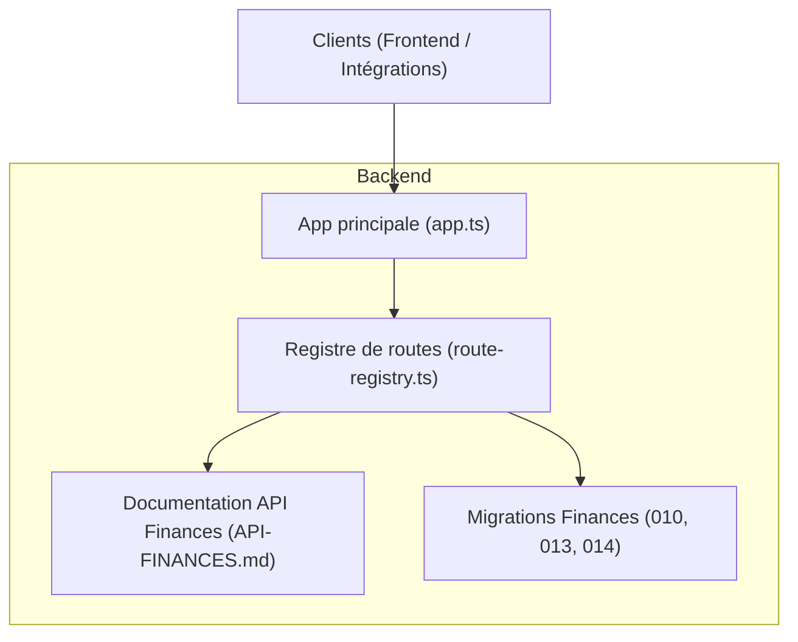
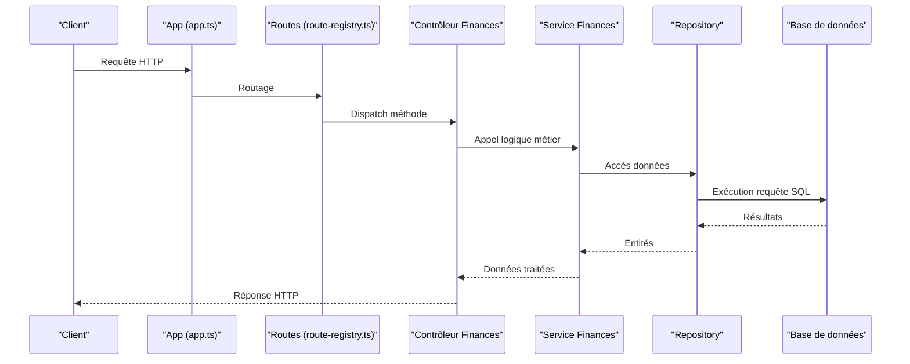
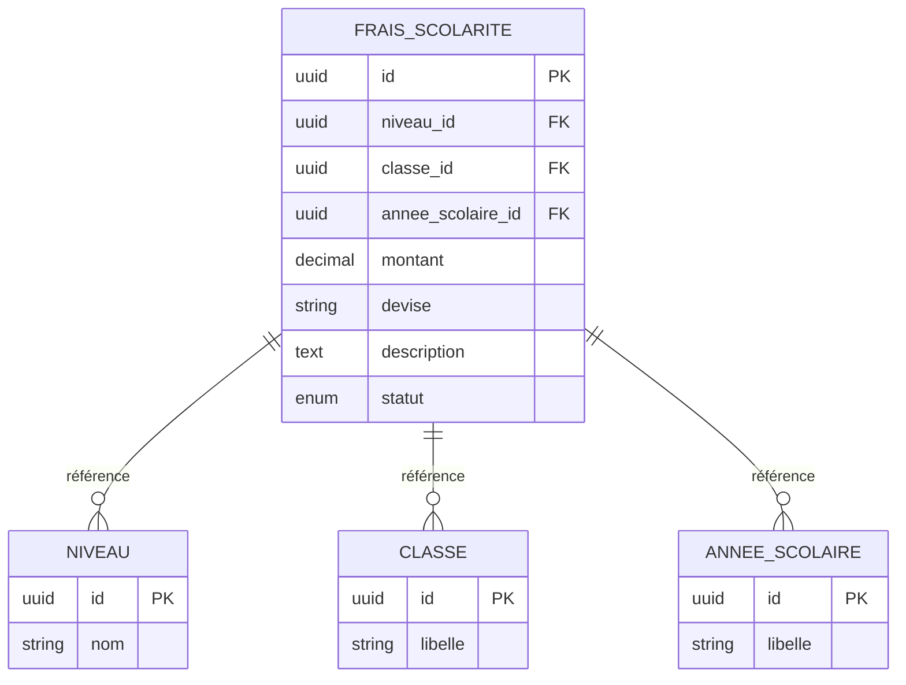
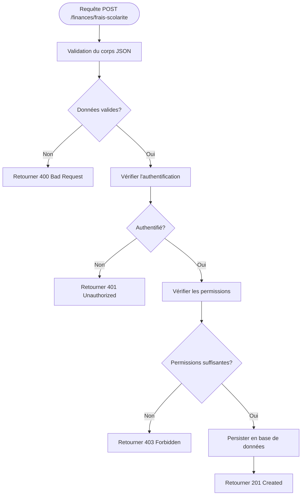
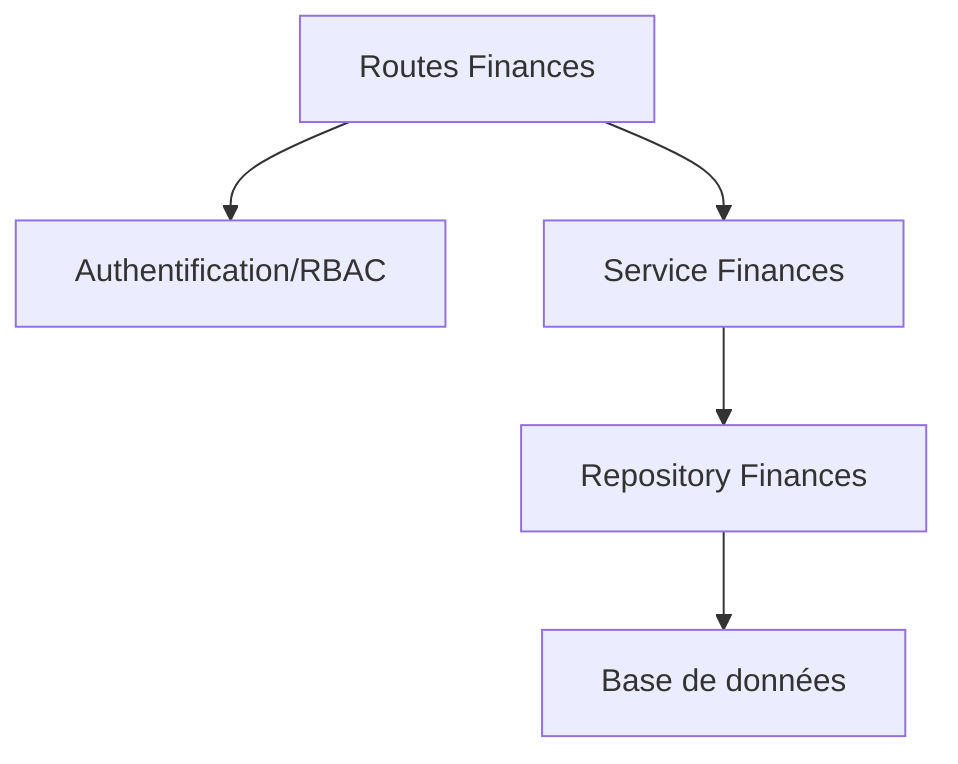

# API Gestion des Frais Scolaires

<cite>
**Fichiers référencés dans ce document**
- [API-FINANCES.md](file://docs/API-FINANCES.md)
- [IMPLEMENTATION-COMPLETE-FINANCES.md](file://docs/implementations/IMPLEMENTATION-COMPLETE-FINANCES.md)
- [010-module-finances.sql](file://backend/database/migrations/010-module-finances.sql)
- [013-module-finances-phase1-granularite.sql](file://backend/database/migrations/013-module-finances-phase1-granularite.sql)
- [014-module-finances-phase2-section.sql](file://backend/database/migrations/014-module-finances-phase2-section.sql)
- [route-registry.ts](file://backend/src/routes/route-registry.ts)
- [app.ts](file://backend/src/app.ts)
</cite>

## Table des matières
1. [Introduction](#introduction)
2. [Structure du projet](#structure-du-projet)
3. [Composants clés](#composants-clés)
4. [Vue d’ensemble de l’architecture](#vue-densemble-de-larchitecture)
5. [Analyse détaillée des composants](#analyse-detaillee-des-composants)
6. [Analyse des dépendances](#analyse-des-dependances)
7. [Considérations de performance](#considerations-de-performance)
8. [Guide de dépannage](#guide-de-depannage)
9. [Conclusion](#conclusion)
10. [Annexes](#annexes)

## Introduction
Ce document présente une documentation API complète pour la gestion des frais scolaires au sein du module Finances. Il couvre les méthodes HTTP pour créer, modifier, supprimer et récupérer les frais de scolarité par niveau/classe/année scolaire. Les schémas de données, les exemples de requêtes, les paramètres, les codes de réponse et les erreurs possibles sont explicitement décrits.

## Structure du projet
Le module Finances est implémenté dans le backend avec des migrations SQL définissant le schéma des tables liées aux frais, ainsi qu’un registre de routes qui expose les endpoints REST. La documentation officielle du module se trouve dans docs/API-FINANCES.md et les détails d’implémentation dans docs/implementations/IMPLEMENTATION-COMPLETE-FINANCES.md.

**Sources de diagramme**
- [app.ts](file://backend/src/app.ts)
- [route-registry.ts](file://backend/src/routes/route-registry.ts)
- [API-FINANCES.md](file://docs/API-FINANCES.md)
- [010-module-finances.sql](file://backend/database/migrations/010-module-finances.sql)
- [013-module-finances-phase1-granularite.sql](file://backend/database/migrations/013-module-finances-phase1-granularite.sql)
- [014-module-finances-phase2-section.sql](file://backend/database/migrations/014-module-finances-phase2-section.sql)

**Sources de section**
- [API-FINANCES.md](file://docs/API-FINANCES.md)
- [IMPLEMENTATION-COMPLETE-FINANCES.md](file://docs/implementations/IMPLEMENTATION-COMPLETE-FINANCES.md)
- [route-registry.ts](file://backend/src/routes/route-registry.ts)
- [app.ts](file://backend/src/app.ts)

## Composants clés
- Entités financières: frais_scolarite, sections, niveaux, classes, années scolaires.
- Endpoints REST: création, lecture, mise à jour, suppression, filtrage par contexte (niveau/classe/année).
- Schémas de données: objets JSON avec champs montant, devise, description, statut.
- Validation et autorisation: contrôles via le registre de routes et middlewares communs.

**Sources de section**
- [API-FINANCES.md](file://docs/API-FINANCES.md)
- [IMPLEMENTATION-COMPLETE-FINANCES.md](file://docs/implementations/IMPLEMENTATION-COMPLETE-FINANCES.md)

## Vue d’ensemble de l’architecture
L’API suit un modèle MVC classique : les routes exposent les endpoints, les contrôleurs traitent les requêtes, les services gèrent la logique métier, et les repositories accèdent aux données via les entités définies dans les migrations.

**Sources de diagramme**
- [app.ts](file://backend/src/app.ts)
- [route-registry.ts](file://backend/src/routes/route-registry.ts)

## Analyse détaillée des composants

### Modèle de données: frais_scolarite
Le modèle frais_scolarite représente les frais associés à un contexte académique (niveau/classe/année). Ses champs principaux incluent:
- id: identifiant unique
- niveau_id: référence au niveau
- classe_id: référence à la classe
- annee_scolaire_id: référence à l’année scolaire
- montant: valeur numérique du frais
- devise: code ISO de la monnaie
- description: texte libre décrivant le frais
- statut: état du frais (actif, inactif, etc.)

**Sources de diagramme**
- [010-module-finances.sql](file://backend/database/migrations/010-module-finances.sql)
- [013-module-finances-phase1-granularite.sql](file://backend/database/migrations/013-module-finances-phase1-granularite.sql)
- [014-module-finances-phase2-section.sql](file://backend/database/migrations/014-module-finances-phase2-section.sql)

**Sources de section**
- [010-module-finances.sql](file://backend/database/migrations/010-module-finances.sql)
- [013-module-finances-phase1-granularite.sql](file://backend/database/migrations/013-module-finances-phase1-granularite.sql)
- [014-module-finances-phase2-section.sql](file://backend/database/migrations/014-module-finances-phase2-section.sql)

### Endpoints REST: CRUD des frais scolaires
Les endpoints permettent de gérer les frais scolaires selon les opérations suivantes:
- POST /finances/frais-scolarite: Créer un nouveau frais
- GET /finances/frais-scolarite: Lister les frais (avec filtres par niveau/classe/année)
- GET /finances/frais-scolarite/:id: Récupérer un frais par identifiant
- PUT /finances/frais-scolarite/:id: Modifier un frais existant
- DELETE /finances/frais-scolarite/:id: Supprimer un frais

#### Schéma de données: objet frais_scolarite
Champs attendus dans les payloads:
- montant: number (obligatoire, > 0)
- devise: string (code ISO, ex: XAF, EUR)
- description: string (optionnel)
- statut: enum (actif, inactif, brouillon)

Exemple de payload POST:
- { "montant": 15000, "devise": "XAF", "description": "Frais d'inscription", "statut": "actif" }

#### Paramètres de requête
- Filtrage GET:
  - niveau_id: filtre par niveau
  - classe_id: filtre par classe
  - annee_scolaire_id: filtre par année scolaire
  - statut: filtre par statut

#### Codes de réponse
- 201 Created: Création réussie
- 200 OK: Lecture ou modification réussie
- 204 No Content: Suppression réussie
- 400 Bad Request: Erreur de validation
- 401 Unauthorized: Non authentifié
- 403 Forbidden: Permissions insuffisantes
- 404 Not Found: Ressource introuvable
- 500 Internal Server Error: Erreur serveur

#### Exemples concrets
- POST /finances/frais-scolarite:
  - Corps JSON: { "montant": 15000, "devise": "XAF", "description": "Frais d'inscription", "statut": "actif" }
  - Réponse: 201 avec l’objet créé
- GET /finances/frais-scolarite?classe_id=...&annee_scolaire_id=...:
  - Réponse: 200 avec liste des frais filtrés
- PUT /finances/frais-scolarite/:id:
  - Corps JSON: { "montant": 16000, "statut": "inactif" }
  - Réponse: 200 avec l’objet mis à jour
- DELETE /finances/frais-scolarite/:id:
  - Réponse: 204 sans contenu

**Sources de section**
- [API-FINANCES.md](file://docs/API-FINANCES.md)
- [IMPLEMENTATION-COMPLETE-FINANCES.md](file://docs/implementations/IMPLEMENTATION-COMPLETE-FINANCES.md)

### Flux de création d’un frais scolaire

**Sources de diagramme**
- [route-registry.ts](file://backend/src/routes/route-registry.ts)
- [app.ts](file://backend/src/app.ts)

**Sources de section**
- [route-registry.ts](file://backend/src/routes/route-registry.ts)
- [app.ts](file://backend/src/app.ts)

## Analyse des dépendances
Les endpoints dépendent des modules suivants:
- Authentification et autorisation (RBAC)
- Migrations de schéma (tables niveau, classe, annee_scolaire, frais_scolarite)
- Services financiers pour la logique métier
- Repository pour l’accès aux données

**Sources de diagramme**
- [route-registry.ts](file://backend/src/routes/route-registry.ts)
- [app.ts](file://backend/src/app.ts)

**Sources de section**
- [route-registry.ts](file://backend/src/routes/route-registry.ts)
- [app.ts](file://backend/src/app.ts)

## Considérations de performance
- Indexation sur les colonnes de jointure (niveau_id, classe_id, annee_scolaire_id) pour optimiser les requêtes de filtrage.
- Pagination sur les listes de frais pour éviter les réponses trop volumineuses.
- Cache côté client pour les données statiques (niveaux, classes, années scolaires).

[Pas de sources nécessaires car cette section fournit des conseils généraux]

## Guide de dépannage
Erreurs courantes:
- 400 Bad Request: Vérifier le format JSON et les types de champs (montant doit être un nombre positif).
- 401 Unauthorized: S’assurer que le token JWT est présent et valide.
- 403 Forbidden: Vérifier les permissions RBAC pour l’action demandée.
- 404 Not Found: Confirmer l’existence de l’identifiant de frais.
- 500 Internal Server Error: Consulter les logs backend pour plus de détails.

**Sources de section**
- [API-FINANCES.md](file://docs/API-FINANCES.md)

## Conclusion
L’API de gestion des frais scolaires offre une interface REST complète pour manipuler les frais par niveau/classe/année scolaire. Le schéma de données est bien structuré et les endpoints suivent les bonnes pratiques REST. La documentation fournie permet une intégration fiable et efficace.

[Pas de sources nécessaires car cette section résume sans analyser de fichiers spécifiques]

## Annexes
- Documentation complète du module Finances: [API-FINANCES.md](file://docs/API-FINANCES.md)
- Détails d’implémentation: [IMPLEMENTATION-COMPLETE-FINANCES.md](file://docs/implementations/IMPLEMENTATION-COMPLETE-FINANCES.md)
- Schémas de base de données: [010-module-finances.sql](file://backend/database/migrations/010-module-finances.sql), [013-module-finances-phase1-granularite.sql](file://backend/database/migrations/013-module-finances-phase1-granularite.sql), [014-module-finances-phase2-section.sql](file://backend/database/migrations/014-module-finances-phase2-section.sql)

**Sources de section**
- [API-FINANCES.md](file://docs/API-FINANCES.md)
- [IMPLEMENTATION-COMPLETE-FINANCES.md](file://docs/implementations/IMPLEMENTATION-COMPLETE-FINANCES.md)
- [010-module-finances.sql](file://backend/database/migrations/010-module-finances.sql)
- [013-module-finances-phase1-granularite.sql](file://backend/database/migrations/013-module-finances-phase1-granularite.sql)
- [014-module-finances-phase2-section.sql](file://backend/database/migrations/014-module-finances-phase2-section.sql)