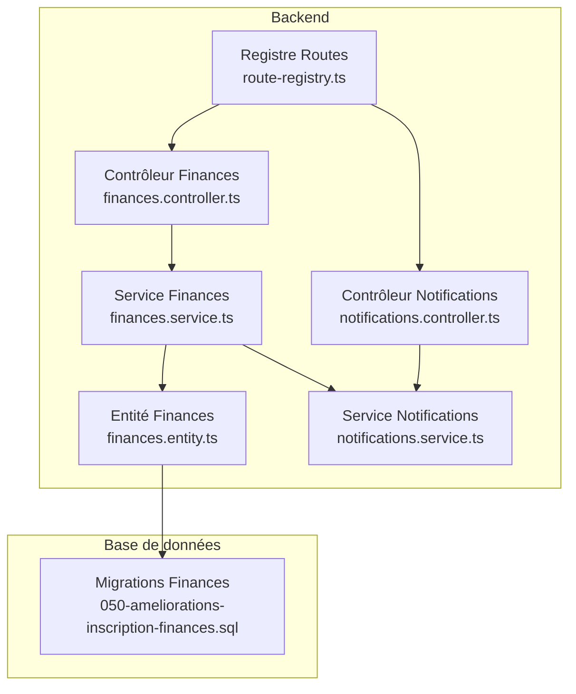
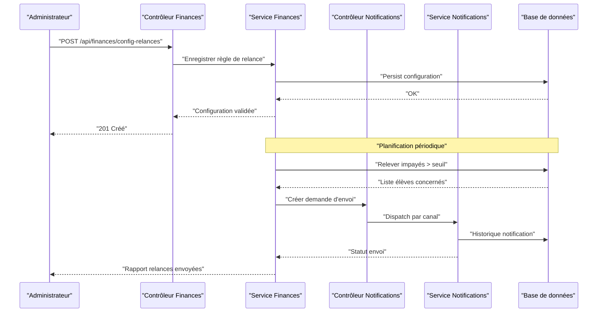
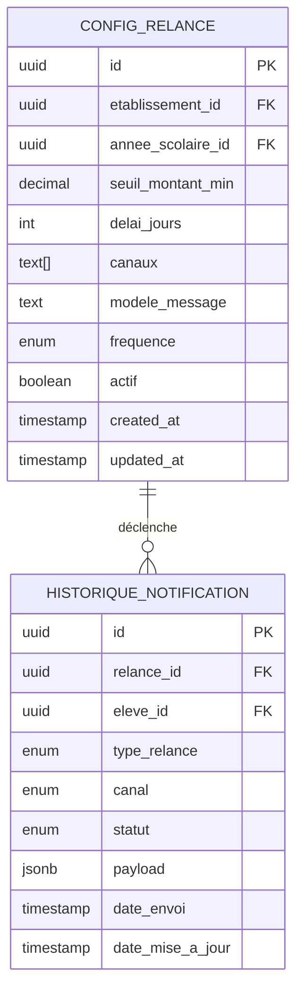
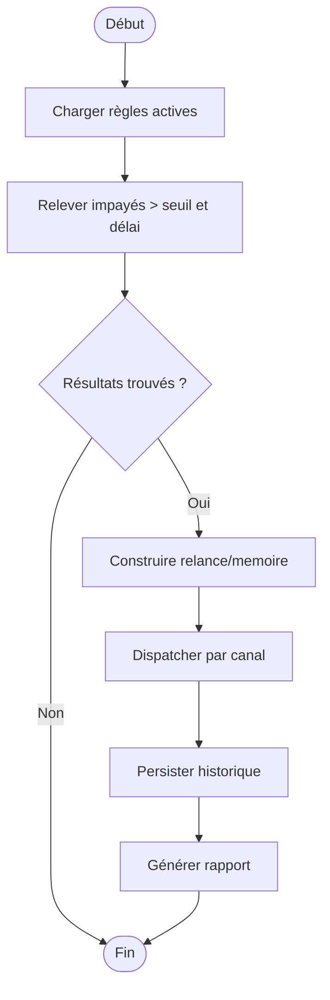
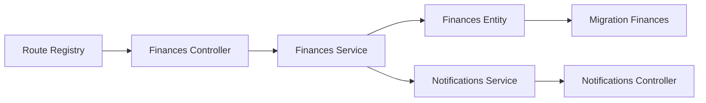

# API Relances et Mémoires

<cite>
**Fichiers référencés dans ce document**
- [050-ameliorations-inscription-finances.sql](file://backend/database/migrations/050-ameliorations-inscription-finances.sql)
- [finances.controller.ts](file://backend/src/modules/finances/controllers/finances.controller.ts)
- [finances.service.ts](file://backend/src/modules/finances/services/finances.service.ts)
- [finances.entity.ts](file://backend/src/modules/finances/entities/finances.entity.ts)
- [notifications.controller.ts](file://backend/src/modules/notifications/controllers/notifications.controller.ts)
- [notifications.service.ts](file://backend/src/modules/notifications/services/notifications.service.ts)
- [route-registry.ts](file://backend/src/routes/route-registry.ts)
- [API-FINANCES.md](file://docs/API-FINANCES.md)
</cite>

## Table des matières
1. [Introduction](#introduction)
2. [Structure du projet](#structure-du-projet)
3. [Composants clés](#composants-clés)
4. [Vue d'ensemble de l'architecture](#vue-densemble-de-larchitecture)
5. [Analyse détaillée des composants](#analyse-detaillee-des-composants)
6. [Analyse des dépendances](#analyse-des-dependances)
7. [Considérations de performance](#considerations-de-performance)
8. [Guide de dépannage](#guide-de-depannage)
9. [Conclusion](#conclusion)
10. [Annexes](#annexes)

## Introduction
Ce document décrit l’API dédiée à la gestion automatique des relances et mémoires pour les frais scolaires impayés. Il couvre :
- La configuration des règles de relance (délais, canaux de notification, seuils).
- La génération automatique des relances et leur envoi.
- Le suivi des relances envoyées et l’historique des notifications.
- Les schémas de données associés aux configurations et historiques.
- Des exemples de requêtes pour configurer les seuils, consulter les élèves concernés et suivre les relances.

L’objectif est de fournir une référence complète et accessible tant aux développeurs qu’aux administrateurs financiers.

## Structure du projet
Le module Finances expose les endpoints liés aux relances et s’intègre au système de Notifications pour l’envoi automatisé. Les migrations définissent les tables nécessaires à la persistance des configurations et historiques.

**Sources du diagramme**
- [finances.controller.ts](file://backend/src/modules/finances/controllers/finances.controller.ts)
- [finances.service.ts](file://backend/src/modules/finances/services/finances.service.ts)
- [finances.entity.ts](file://backend/src/modules/finances/entities/finances.entity.ts)
- [notifications.controller.ts](file://backend/src/modules/notifications/controllers/notifications.controller.ts)
- [notifications.service.ts](file://backend/src/modules/notifications/services/notifications.service.ts)
- [route-registry.ts](file://backend/src/routes/route-registry.ts)
- [050-ameliorations-inscription-finances.sql](file://backend/database/migrations/050-ameliorations-inscription-finances.sql)

**Sources de section**
- [API-FINANCES.md](file://docs/API-FINANCES.md)
- [route-registry.ts](file://backend/src/routes/route-registry.ts)

## Composants clés
- Contrôleur Finances : définit les routes REST pour la configuration des relances et le suivi.
- Service Finances : implémente la logique métier (détection des impayés, planification, déclenchement).
- Entité Finances : modèle de données persistant (frais, paiements, relances).
- Contrôleur/Service Notifications : gère l’envoi via les canaux configurés (SMS, email, messagerie interne).
- Migrations : structure de base de données pour les configurations de relance et historiques.

**Sources de section**
- [finances.controller.ts](file://backend/src/modules/finances/controllers/finances.controller.ts)
- [finances.service.ts](file://backend/src/modules/finances/services/finances.service.ts)
- [finances.entity.ts](file://backend/src/modules/finances/entities/finances.entity.ts)
- [notifications.controller.ts](file://backend/src/modules/notifications/controllers/notifications.controller.ts)
- [notifications.service.ts](file://backend/src/modules/notifications/services/notifications.service.ts)
- [050-ameliorations-inscription-finances.sql](file://backend/database/migrations/050-ameliorations-inscription-finances.sql)

## Vue d'ensemble de l'architecture
Le flux de relance suit un cycle planifié :
- Détection des impayés selon les seuils et délais configurés.
- Génération d’une relance ou mémoire.
- Envoi via le canal approprié.
- Persistance de l’historique et mise à jour du statut.

**Sources du diagramme**
- [finances.controller.ts](file://backend/src/modules/finances/controllers/finances.controller.ts)
- [finances.service.ts](file://backend/src/modules/finances/services/finances.service.ts)
- [notifications.controller.ts](file://backend/src/modules/notifications/controllers/notifications.controller.ts)
- [notifications.service.ts](file://backend/src/modules/notifications/services/notifications.service.ts)
- [050-ameliorations-inscription-finances.sql](file://backend/database/migrations/050-ameliorations-inscription-finances.sql)

## Analyse détaillée des composants

### Configuration des règles de relance
- Objectif : définir les seuils (montant minimum, retard en jours), les canaux (email, SMS, messagerie interne), les modèles de message et les fréquences.
- Endpoints typiques :
  - POST /api/finances/config-relances : créer ou mettre à jour une règle.
  - GET /api/finances/config-relances : lister les règles actives.
  - PUT /api/finances/config-relances/:id : modifier une règle.
  - DELETE /api/finances/config-relances/:id : désactiver/supprimer une règle.
- Schéma de données attendu :
  - id, etablissementId, anneeScolaireId, seuilMontantMin, delaiJours, canaux[], modeleMessage, frequence, actif, createdAt, updatedAt.

Exemple de requête (configuration) :
- POST /api/finances/config-relances
  - Corps JSON : { "anneeScolaireId": "...", "seuilMontantMin": 5000, "delaiJours": 7, "canaux": ["email","sms"], "modeleMessage": "relance_v1", "frequence": "hebdomadaire", "actif": true }

Suivi des élèves concernés :
- GET /api/finances/elevs-concernes?anneeScolaireId=...&seuilMontantMin=...&delaiJours=...

**Sources de section**
- [finances.controller.ts](file://backend/src/modules/finances/controllers/finances.controller.ts)
- [finances.service.ts](file://backend/src/modules/finances/services/finances.service.ts)
- [050-ameliorations-inscription-finances.sql](file://backend/database/migrations/050-ameliorations-inscription-finances.sql)

### Génération automatique des relances
- Déclencheur : tâche planifiée (cron) ou appel manuel via endpoint dédié.
- Logique :
  - Sélectionner les élèves avec des soldes impayés dépassant le seuil configuré depuis plus de X jours.
  - Générer une relance ou mémoire selon la phase (première relance, rappel, mise en demeure).
  - Envoyer via le canal choisi et enregistrer l’historique.
- Endpoints typiques :
  - POST /api/finances/generer-relances : exécution immédiate.
  - GET /api/finances/statistiques-relances : récapitulatif par période.

Exemple de requête (génération) :
- POST /api/finances/generer-relances
  - Corps JSON : { "anneeScolaireId": "...", "force": false }

**Sources de section**
- [finances.service.ts](file://backend/src/modules/finances/services/finances.service.ts)
- [notifications.service.ts](file://backend/src/modules/notifications/services/notifications.service.ts)

### Suivi des relances envoyées et historique des notifications
- Endpoints typiques :
  - GET /api/finances/historique-relances?eleveId=...&anneeScolaireId=...
  - GET /api/notifications/history?relanceId=...&canal=...
- Champs attendus :
  - relanceId, eleveId, typeRelance (relance, memoire), canal, statut (envoyé, échec, lu), dateEnvoi, reponse.

Exemple de requête (suivi) :
- GET /api/finances/historique-relances?anneeScolaireId=...&statut=envoyé

**Sources de section**
- [notifications.controller.ts](file://backend/src/modules/notifications/controllers/notifications.controller.ts)
- [notifications.service.ts](file://backend/src/modules/notifications/services/notifications.service.ts)
- [050-ameliorations-inscription-finances.sql](file://backend/database/migrations/050-ameliorations-inscription-finances.sql)

### Modèles de données (schémas)
- Configurations de relance :
  - id, etablissementId, anneeScolaireId, seuilMontantMin, delaiJours, canaux[], modeleMessage, frequence, actif, createdAt, updatedAt.
- Historique des notifications :
  - id, relanceId, eleveId, typeRelance, canal, statut, payload, dateEnvoi, dateMiseAJour.

**Sources du diagramme**
- [050-ameliorations-inscription-finances.sql](file://backend/database/migrations/050-ameliorations-inscription-finances.sql)

**Sources de section**
- [finances.entity.ts](file://backend/src/modules/finances/entities/finances.entity.ts)
- [050-ameliorations-inscription-finances.sql](file://backend/database/migrations/050-ameliorations-inscription-finances.sql)

### Flux de décision (logique métier)

**Sources du diagramme**
- [finances.service.ts](file://backend/src/modules/finances/services/finances.service.ts)
- [notifications.service.ts](file://backend/src/modules/notifications/services/notifications.service.ts)

## Analyse des dépendances
- Le contrôleur Finances dépend du service Finances pour la logique métier.
- Le service Finances dépend de l’entité Finances et du service Notifications pour l’envoi.
- Le registre de routes expose les endpoints aux clients.
- Les migrations assurent la cohérence du schéma de données.

**Sources du diagramme**
- [route-registry.ts](file://backend/src/routes/route-registry.ts)
- [finances.controller.ts](file://backend/src/modules/finances/controllers/finances.controller.ts)
- [finances.service.ts](file://backend/src/modules/finances/services/finances.service.ts)
- [finances.entity.ts](file://backend/src/modules/finances/entities/finances.entity.ts)
- [notifications.controller.ts](file://backend/src/modules/notifications/controllers/notifications.controller.ts)
- [notifications.service.ts](file://backend/src/modules/notifications/services/notifications.service.ts)
- [050-ameliorations-inscription-finances.sql](file://backend/database/migrations/050-ameliorations-inscription-finances.sql)

**Sources de section**
- [route-registry.ts](file://backend/src/routes/route-registry.ts)
- [finances.controller.ts](file://backend/src/modules/finances/controllers/finances.controller.ts)
- [finances.service.ts](file://backend/src/modules/finances/services/finances.service.ts)
- [notifications.controller.ts](file://backend/src/modules/notifications/controllers/notifications.controller.ts)
- [notifications.service.ts](file://backend/src/modules/notifications/services/notifications.service.ts)
- [050-ameliorations-inscription-finances.sql](file://backend/database/migrations/050-ameliorations-inscription-finances.sql)

## Considérations de performance
- Indexation sur les champs de filtrage (anneeScolaireId, eleveId, statut, dateEnvoi).
- Pagination et filtrage côté serveur pour les listes d’élèves concernés et historiques.
- Mise en file d’attente des envois de notifications pour éviter les blocages.
- Exécution planifiée hors heures de pointe pour la génération de relances.

[Section sources]
- [050-ameliorations-inscription-finances.sql](file://backend/database/migrations/050-ameliorations-inscription-finances.sql)

## Guide de dépannage
- Erreurs courantes :
  - Règle non active ou paramètres manquants : vérifier actif, seuilMontantMin, delaiJours.
  - Échec d’envoi : inspecter statut dans l’historique des notifications et logs du canal.
  - Données incohérentes : valider les relations entre eleveId, anneeScolaireId et solde impayé.
- Actions recommandées :
  - Recharger les règles actives et relancer manuellement la génération.
  - Consulter les statistiques de relances pour identifier les anomalies.
  - Vérifier les permissions et l’accès aux ressources financières.

**Sources de section**
- [notifications.service.ts](file://backend/src/modules/notifications/services/notifications.service.ts)
- [finances.service.ts](file://backend/src/modules/finances/services/finances.service.ts)

## Conclusion
L’API de relances et mémoires permet de configurer des règles précises, de générer automatiquement les relances et de suivre leur envoi via un historique complet. L’intégration avec le module Notifications garantit la flexibilité des canaux et la traçabilité des actions. Pour une mise en production robuste, privilégiez l’indexation, la pagination et la file d’attente des envois.

## Annexes
- Exemples complets de requêtes :
  - Configuration : POST /api/finances/config-relances
  - Consultation élèves concernés : GET /api/finances/elevs-concernes
  - Génération : POST /api/finances/generer-relances
  - Suivi : GET /api/finances/historique-relances
  - Statistiques : GET /api/finances/statistiques-relances

[Section sources]
- [API-FINANCES.md](file://docs/API-FINANCES.md)