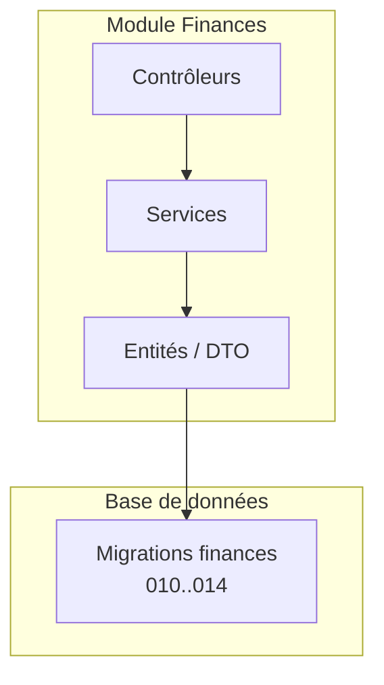
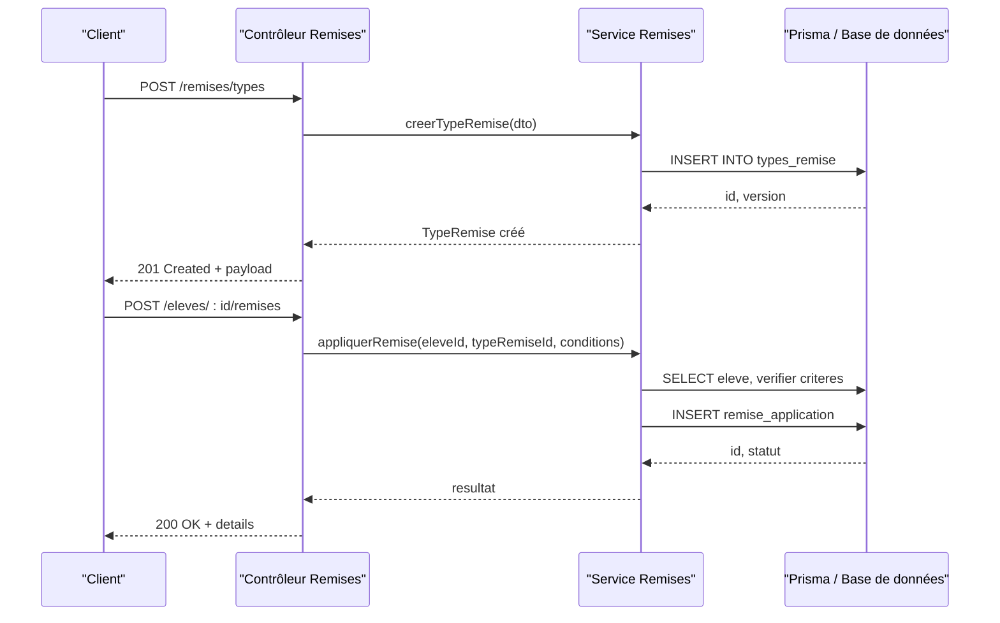
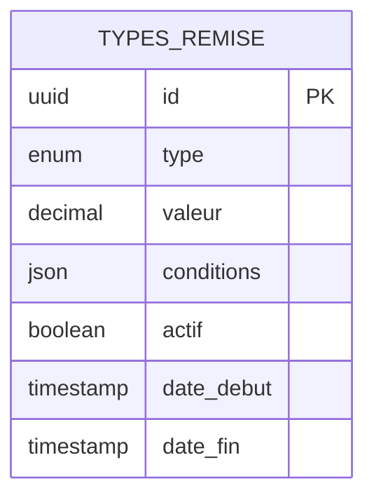
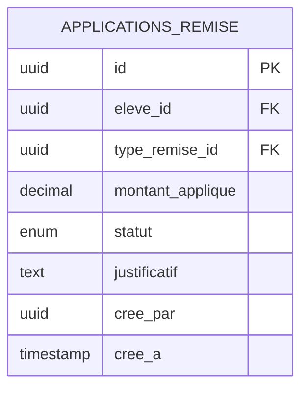
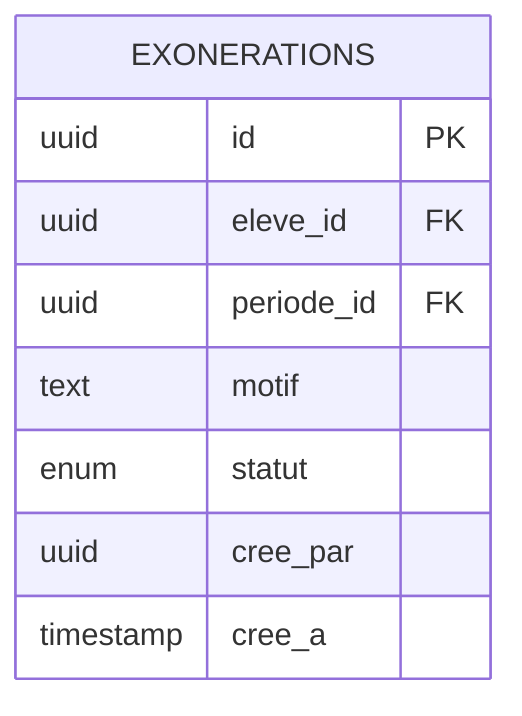
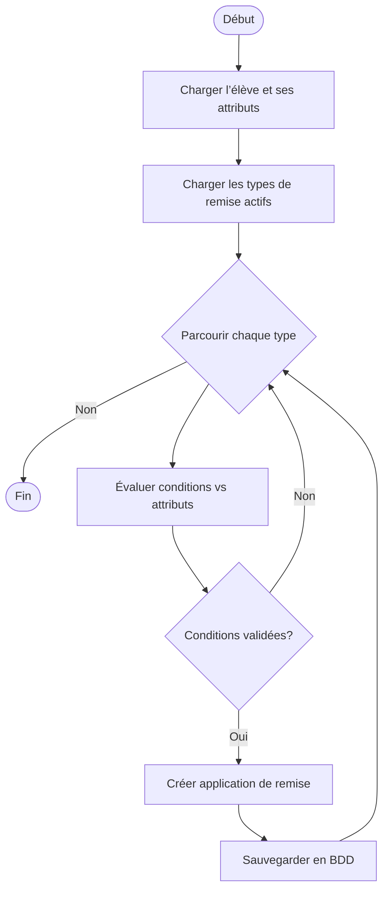
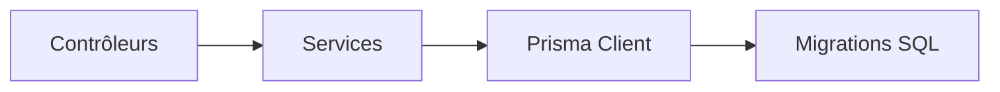

# API Remises et Exonérations

<cite>
**Fichiers référencés dans ce document**
- [backend/src/modules/finances](file://backend/src/modules/finances)
- [backend/database/migrations/010-module-finances.sql](file://backend/database/migrations/010-module-finances.sql)
- [backend/database/migrations/011-module-finances-part2.sql](file://backend/database/migrations/011-module-finances-part2.sql)
- [backend/database/migrations/012-module-finances-part3-parametres.sql](file://backend/database/migrations/012-module-finances-part3-parametres.sql)
- [backend/database/migrations/013-module-finances-phase1-granularite.sql](file://backend/database/migrations/013-module-finances-phase1-granularite.sql)
- [backend/database/migrations/014-module-finances-phase2-section.sql](file://backend/database/migrations/014-module-finances-phase2-section.sql)
- [docs/API-FINANCES.md](file://docs/API-FINANCES.md)
- [docs/ANALYSE-FRAIS-REMISES-COHERENCE.md](file://docs/ANALYSE-FRAIS-REMISES-COHERENCE.md)
- [docs/IMPLEMENTATION-PHASE1-FRAIS-REMISES.md](file://docs/IMPLEMENTATION-PHASE1-FRAIS-REMISES.md)
</cite>

## Table des matières
1. [Introduction](#introduction)
2. [Structure du projet](#structure-du-projet)
3. [Composants clés](#composants-clés)
4. [Vue d'ensemble de l'architecture](#vue-densemble-de-larchitecture)
5. [Analyse détaillée des composants](#analyse-detaillee-des-composants)
6. [Analyse des dépendances](#analyse-des-dependances)
7. [Considérations de performance](#considerations-de-performance)
8. [Guide de dépannage](#guide-de-depannage)
9. [Conclusion](#conclusion)
10. [Annexes](#annexes)

## Introduction
Ce document décrit l’API de gestion des remises et exonérations de frais scolaires. Il couvre les endpoints pour créer des types de remises (pourcentage, montant fixe), appliquer des réductions aux élèves, et gérer les exonérations complètes. Il inclut également les schémas de données des objets remise avec leurs propriétés (type, valeur, conditions d’application), ainsi que des exemples de requêtes pour l’application automatique de remises basées sur des critères (boursiers, frères/sœurs) et la gestion manuelle des exonérations.

## Structure du projet
Le module Finances est organisé en modules NestJS avec contrôleurs, services et entités Prisma. Les migrations SQL définissent les tables et relations nécessaires à la persistance des remises, exonérations et leur application aux élèves.

**Sources de diagramme**
- [backend/src/modules/finances](file://backend/src/modules/finances)
- [backend/database/migrations/010-module-finances.sql](file://backend/database/migrations/010-module-finances.sql)
- [backend/database/migrations/011-module-finances-part2.sql](file://backend/database/migrations/011-module-finances-part2.sql)
- [backend/database/migrations/012-module-finances-part3-parametres.sql](file://backend/database/migrations/012-module-finances-part3-parametres.sql)
- [backend/database/migrations/013-module-finances-phase1-granularite.sql](file://backend/database/migrations/013-module-finances-phase1-granularite.sql)
- [backend/database/migrations/014-module-finances-phase2-section.sql](file://backend/database/migrations/014-module-finances-phase2-section.sql)

**Sources de section**
- [backend/src/modules/finances](file://backend/src/modules/finances)
- [docs/API-FINANCES.md](file://docs/API-FINANCES.md)

## Composants clés
- Contrôleurs: exposent les routes REST pour les remises et exonérations.
- Services: implémentent la logique métier (calcul, règles d’application, validation).
- Entités/DTO: modélisent les objets remise, exonération et leurs relations.
- Migrations: définissent les tables et contraintes pour le stockage durable.

**Sources de section**
- [backend/src/modules/finances](file://backend/src/modules/finances)
- [docs/API-FINANCES.md](file://docs/API-FINANCES.md)

## Vue d'ensemble de l'architecture
L’API suit une architecture MVC classique au sein de NestJS. Les contrôleurs reçoivent les requêtes HTTP, délèguent au service qui applique les règles métier et interagit avec la base de données via Prisma. Les migrations assurent la cohérence du schéma.

**Sources de diagramme**
- [backend/src/modules/finances](file://backend/src/modules/finances)
- [backend/database/migrations/013-module-finances-phase1-granularite.sql](file://backend/database/migrations/013-module-finances-phase1-granularite.sql)

## Analyse détaillée des composants

### Schéma de données: Types de remise
Les types de remise permettent de définir comment une réduction est calculée. Propriétés principales:
- type: enum (pourcentage, montant_fixe)
- valeur: nombre (pourcentage ou montant selon le type)
- conditions: objet JSON décrivant les critères d’application (ex. boursier, fratrie, classe, période)
- actif: booléen indiquant si le type est applicable
- date_debut/date_fin: fenêtre temporelle d’application

**Sources de diagramme**
- [backend/database/migrations/013-module-finances-phase1-granularite.sql](file://backend/database/migrations/013-module-finances-phase1-granularite.sql)

**Sources de section**
- [backend/database/migrations/013-module-finances-phase1-granularite.sql](file://backend/database/migrations/013-module-finances-phase1-granularite.sql)

### Schéma de données: Applications de remise
Une application lie un élève à un type de remise et enregistre le résultat du calcul. Propriétés principales:
- eleve_id: référence à l’élève
- type_remise_id: référence au type de remise utilisé
- montant_applique: montant réduit ou pourcentage appliqué
- statut: enum (applique, annule, en_attente)
- justificatif: texte libre ou lien vers pièce justificative
- cree_par: utilisateur ayant effectué l’action
- cree_a: horodatage de création

**Sources de diagramme**
- [backend/database/migrations/013-module-finances-phase1-granularite.sql](file://backend/database/migrations/013-module-finances-phase1-granularite.sql)

**Sources de section**
- [backend/database/migrations/013-module-finances-phase1-granularite.sql](file://backend/database/migrations/013-module-finances-phase1-granularite.sql)

### Schéma de données: Exonérations complètes
Une exonération complète annule tout ou partie des frais pour un élève sur une période donnée. Propriétés principales:
- eleve_id: référence à l’élève
- periode_id: référence à la période concernée
- motif: texte expliquant la raison de l’exonération
- statut: enum (active, expiree, annulee)
- cree_par: utilisateur ayant créé l’exonération
- cree_a: horodatage de création

**Sources de diagramme**
- [backend/database/migrations/014-module-finances-phase2-section.sql](file://backend/database/migrations/014-module-finances-phase2-section.sql)

**Sources de section**
- [backend/database/migrations/014-module-finances-phase2-section.sql](file://backend/database/migrations/014-module-finances-phase2-section.sql)

### Endpoints: Gestion des types de remise
- POST /remises/types: créer un nouveau type de remise
- GET /remises/types: lister les types actifs/inactifs
- PUT /remises/types/:id: modifier un type existant
- DELETE /remises/types/:id: supprimer un type (soft delete recommandé)

Exemple de requête de création (format JSON):
- corps: { "type": "pourcentage", "valeur": 25, "conditions": { "boursier": true }, "actif": true, "date_debut": "2025-09-01T00:00:00Z", "date_fin": "2026-06-30T23:59:59Z" }

**Sources de section**
- [docs/API-FINANCES.md](file://docs/API-FINANCES.md)

### Endpoints: Application de remises aux élèves
- POST /eleves/:id/remises: appliquer une remise à un élève
- GET /eleves/:id/remises: obtenir l’historique des remises appliquées
- PUT /eleves/:id/remises/:remiseId: modifier une application (statut, justificatif)
- DELETE /eleves/:id/remises/:remiseId: annuler une application

Exemple de requête d’application:
- corps: { "type_remise_id": "<uuid>", "justificatif": "Bourse accordée par l’établissement" }

**Sources de section**
- [docs/API-FINANCES.md](file://docs/API-FINANCES.md)

### Endpoints: Gestion des exonérations complètes
- POST /eleves/:id/exonerations: créer une exonération complète
- GET /eleves/:id/exonerations: lister les exonérations actives/expirées
- PUT /eleves/:id/exonerations/:id: mettre à jour le statut ou le motif
- DELETE /eleves/:id/exonerations/:id: annuler l’exonération

Exemple de requête de création:
- corps: { "periode_id": "<uuid>", "motif": "Situation familiale exceptionnelle" }

**Sources de section**
- [docs/API-FINANCES.md](file://docs/API-FINANCES.md)

### Logique d’application automatique basée sur des critères
Le service évalue les conditions d’un type de remise contre les attributs de l’élève (boursier, fratrie, classe, période). Si les critères sont satisfaits, une application est créée automatiquement.

**Sources de diagramme**
- [backend/src/modules/finances](file://backend/src/modules/finances)
- [backend/database/migrations/013-module-finances-phase1-granularite.sql](file://backend/database/migrations/013-module-finances-phase1-granularite.sql)

**Sources de section**
- [backend/src/modules/finances](file://backend/src/modules/finances)
- [docs/ANALYSE-FRAIS-REMISES-COHERENCE.md](file://docs/ANALYSE-FRAIS-REMISES-COHERENCE.md)

### Exemples de scénarios
- Application automatique pour boursiers:
  - Conditions: { "boursier": true }
  - Action: créer une application de remise avec statut “applique”
- Application automatique pour fratrie:
  - Conditions: { "fratrie": true, "nb_freres_min": 2 }
  - Action: créer une application de remise avec statut “applique”
- Gestion manuelle d’exonération:
  - Action: créer une exonération complète pour une période donnée
  - Statut: “active”, puis “expiree” ou “annulee” selon évolution

**Sources de section**
- [docs/IMPLEMENTATION-PHASE1-FRAIS-REMISES.md](file://docs/IMPLEMENTATION-PHASE1-FRAIS-REMISES.md)
- [docs/API-FINANCES.md](file://docs/API-FINANCES.md)

## Analyse des dépendances
Les contrôleurs dépendent des services qui utilisent Prisma pour accéder aux tables définies par les migrations. Les DTOs valident les payloads entrants.

**Sources de diagramme**
- [backend/src/modules/finances](file://backend/src/modules/finances)
- [backend/database/migrations/010-module-finances.sql](file://backend/database/migrations/010-module-finances.sql)
- [backend/database/migrations/011-module-finances-part2.sql](file://backend/database/migrations/011-module-finances-part2.sql)
- [backend/database/migrations/012-module-finances-part3-parametres.sql](file://backend/database/migrations/012-module-finances-part3-parametres.sql)
- [backend/database/migrations/013-module-finances-phase1-granularite.sql](file://backend/database/migrations/013-module-finances-phase1-granularite.sql)
- [backend/database/migrations/014-module-finances-phase2-section.sql](file://backend/database/migrations/014-module-finances-phase2-section.sql)

**Sources de section**
- [backend/src/modules/finances](file://backend/src/modules/finances)

## Considérations de performance
- Indexation: ajouter des index sur eleve_id, type_remise_id, periode_id pour accélérer les jointures et filtres.
- Validation côté serveur: utiliser des DTOs stricts pour éviter des traitements inutiles.
- Batch processing: traiter les applications automatiques par lots pour limiter les charges en pointe.
- Cache: pré-calculer les types applicables par élève si nécessaire.

[Pas de sources nécessaires car cette section fournit des conseils généraux]

## Guide de dépannage
- Erreurs de validation: vérifier la structure du DTO et les valeurs autorisées (enum type, statut).
- Échec d’application: examiner les conditions et les attributs de l’élève; vérifier les dates de validité du type de remise.
- Conflits d’exonération: s’assurer qu’une seule exonération active existe par période pour un même élève.
- Logs: activer les logs au niveau du service pour tracer les étapes d’évaluation et de persistance.

**Sources de section**
- [docs/API-FINANCES.md](file://docs/API-FINANCES.md)
- [docs/ANALYSE-FRAIS-REMISES-COHERENCE.md](file://docs/ANALYSE-FRAIS-REMISES-COHERENCE.md)

## Conclusion
L’API de remises et exonérations permet de modéliser finement les réductions et exemptions de frais scolaires. Grâce à des types configurables et des conditions flexibles, elle supporte à la fois l’application automatique et la gestion manuelle. La structuration en modules NestJS et les migrations SQL garantissent une évolutivité et une maintenabilité robustes.

[Pas de sources nécessaires car cette section résume sans analyser de fichiers spécifiques]

## Annexes
- Références complémentaires:
  - Documentation API Finances: [docs/API-FINANCES.md](file://docs/API-FINANCES.md)
  - Analyse de cohérence frais/remises: [docs/ANALYSE-FRAIS-REMISES-COHERENCE.md](file://docs/ANALYSE-FRAIS-REMISES-COHERENCE.md)
  - Implémentation phase 1 frais/remises: [docs/IMPLEMENTATION-PHASE1-FRAIS-REMISES.md](file://docs/IMPLEMENTATION-PHASE1-FRAIS-REMISES.md)

[Pas de sources nécessaires car cette section liste des références sans analyse spécifique]