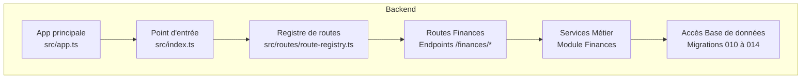
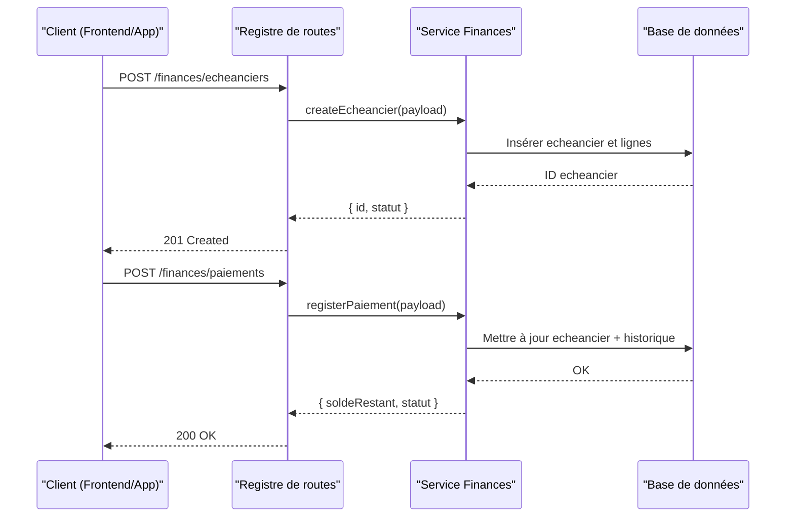
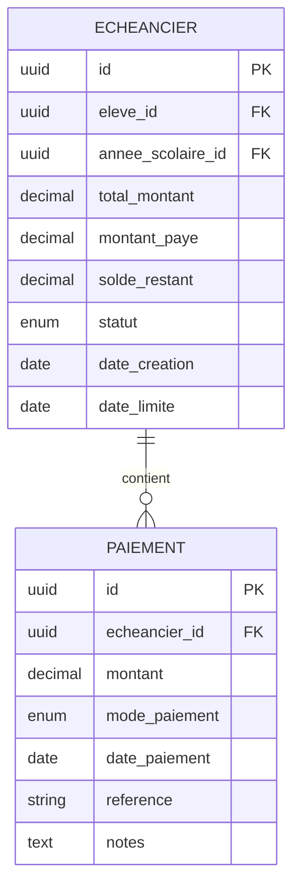
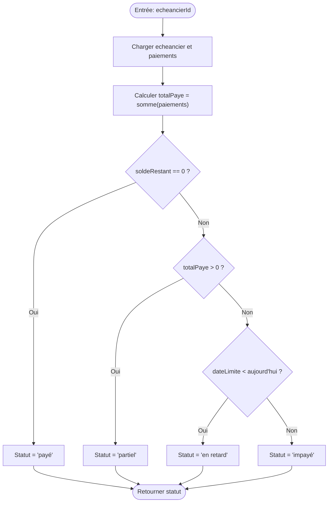
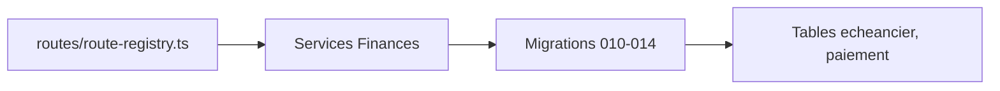

# API Échéanciers et Suivi des Paiements

<cite>
**Fichiers référencés dans ce document**
- [API-FINANCES.md](file://docs/API-FINANCES.md)
- [010-module-finances.sql](file://backend/database/migrations/010-module-finances.sql)
- [011-module-finances-part2.sql](file://backend/database/migrations/011-module-finances-part2.sql)
- [012-module-finances-part3-parametres.sql](file://backend/database/migrations/012-module-finances-part3-parametres.sql)
- [013-module-finances-phase1-granularite.sql](file://backend/database/migrations/013-module-finances-phase1-granularite.sql)
- [014-module-finances-phase2-section.sql](file://backend/database/migrations/014-module-finances-phase2-section.sql)
- [route-registry.ts](file://backend/src/routes/route-registry.ts)
- [index.ts](file://backend/src/index.ts)
- [app.ts](file://backend/src/app.ts)
- [IMPLEMENTATION-COMPLETE-FINANCES-PHASE1-2.md](file://docs/implementations/IMPLEMENTATION-COMPLETE-FINANCES-PHASE1-2.md)
- [ANALYSE-GESTION-FINANCIERE.md](file://docs/analyses/ANALYSE-GESTION-FINANCIERE.md)
- [GUIDE-DEPLOIEMENT-FINANCES.md](file://docs/GUIDE-DEPLOIEMENT-FINANCES.md)
</cite>

## Table des matières
1. [Introduction](#introduction)
2. [Structure du projet](#structure-du-projet)
3. [Composants clés](#composants-clés)
4. [Vue d’ensemble de l’architecture](#vue-densemble-de-larchitecture)
5. [Analyse détaillée des composants](#analyse-detaillee-des-composants)
6. [Analyse des dépendances](#analyse-des-dependances)
7. [Considérations de performance](#considerations-de-performance)
8. [Guide de dépannage](#guide-de-depannage)
9. [Conclusion](#conclusion)
10. [Annexes](#annexes)

## Introduction
Ce document présente l’API de gestion des échéanciers de paiement et le suivi des paiements du module Finances. Il couvre la création d’échéanciers (automatiques ou manuels), l’enregistrement de paiements partiels ou complets, ainsi que la consultation des statuts de paiement (payé, partiel, en retard, impayé). Vous y trouverez les schémas de données pour les objets echeancier et paiement, leurs relations, ainsi que des exemples de requêtes pour générer des échéanciers basés sur les frais scolaires, enregistrer des paiements avec différents modes de paiement, et consulter le solde restant.

## Structure du projet
Le module Finances est implémenté dans le backend sous forme de migrations SQL et de routes exposées via le registre de routes principal. Les fichiers de migration définissent le schéma de données (tables, contraintes, index) tandis que les routes permettent l’accès aux fonctionnalités depuis le frontend ou des clients externes.

**Sources du diagramme**
- [app.ts](file://backend/src/app.ts)
- [index.ts](file://backend/src/index.ts)
- [route-registry.ts](file://backend/src/routes/route-registry.ts)
- [010-module-finances.sql](file://backend/database/migrations/010-module-finances.sql)
- [011-module-finances-part2.sql](file://backend/database/migrations/011-module-finances-part2.sql)
- [012-module-finances-part3-parametres.sql](file://backend/database/migrations/012-module-finances-part3-parametres.sql)
- [013-module-finances-phase1-granularite.sql](file://backend/database/migrations/013-module-finances-phase1-granularite.sql)
- [014-module-finances-phase2-section.sql](file://backend/database/migrations/014-module-finances-phase2-section.sql)

**Sources de la section**
- [route-registry.ts](file://backend/src/routes/route-registry.ts)
- [index.ts](file://backend/src/index.ts)
- [app.ts](file://backend/src/app.ts)

## Composants clés
- Schéma de données Finances : tables echeancier, paiement, paramètres financiers, sections et granularité.
- Endpoints REST : création d’échéanciers (auto/manuel), enregistrement de paiements, consultation des soldes et statuts.
- Statuts de paiement : payé, partiel, en retard, impayé.
- Modes de paiement : espèces, virement, chèque, carte, mobile money, etc.

**Sources de la section**
- [API-FINANCES.md](file://docs/API-FINANCES.md)
- [010-module-finances.sql](file://backend/database/migrations/010-module-finances.sql)
- [011-module-finances-part2.sql](file://backend/database/migrations/011-module-finances-part2.sql)
- [012-module-finances-part3-parametres.sql](file://backend/database/migrations/012-module-finances-part3-parametres.sql)
- [013-module-finances-phase1-granularite.sql](file://backend/database/migrations/013-module-finances-phase1-granularite.sql)
- [014-module-finances-phase2-section.sql](file://backend/database/migrations/014-module-finances-phase2-section.sql)

## Vue d’ensemble de l’architecture
L’API expose des endpoints HTTP qui sont acheminés par le registre de routes vers les contrôleurs/services du module Finances. Ces derniers interagissent avec la base de données via les entités définies dans les migrations.

**Sources du diagramme**
- [route-registry.ts](file://backend/src/routes/route-registry.ts)
- [010-module-finances.sql](file://backend/database/migrations/010-module-finances.sql)
- [011-module-finances-part2.sql](file://backend/database/migrations/011-module-finances-part2.sql)

## Analyse détaillée des composants

### Schéma de données : echeancier et paiement
Les tables principales concernent les échéanciers et les paiements associés, avec des champs pour les montants, dates, statuts et références.

**Sources du diagramme**
- [010-module-finances.sql](file://backend/database/migrations/010-module-finances.sql)
- [011-module-finances-part2.sql](file://backend/database/migrations/011-module-finances-part2.sql)

**Sources de la section**
- [010-module-finances.sql](file://backend/database/migrations/010-module-finances.sql)
- [011-module-finances-part2.sql](file://backend/database/migrations/011-module-finances-part2.sql)

### Endpoints : Création d’échéanciers
- POST /finances/echeanciers : créer un échéancier automatique ou manuel.
- Paramètres courants : eleveId, anneeScolaireId, type (auto/manuel), lignes d’échéances (montant, date, référence), règles de génération (période, nombre de mensualités).

Exemple de requête (génération automatique basée sur les frais scolaires) :
- Méthode : POST
- URL : /finances/echeanciers
- Corps JSON : eleveId, anneeScolaireId, type=auto, configuration de génération (frais totaux, répartition, dates limites)

Réponse attendue :
- Identifiant de l’échéancier créé
- Liste des lignes générées
- Statut initial (en attente)

**Sources de la section**
- [API-FINANCES.md](file://docs/API-FINANCES.md)
- [013-module-finances-phase1-granularite.sql](file://backend/database/migrations/013-module-finances-phase1-granularite.sql)

### Endpoints : Enregistrement de paiements
- POST /finances/paiements : enregistrer un paiement (partiel ou complet).
- Paramètres courants : echeancierId, montant, modePaiement, datePaiement, référence, notes.

Exemple de requête (paiement partiel en espèces) :
- Méthode : POST
- URL : /finances/paiements
- Corps JSON : echeancierId, montant, modePaiement=especes, datePaiement, reference, notes

Réponse attendue :
- Solde restant mis à jour
- Statut recalculé (payé/partiel/en retard/impayé)
- Historique du paiement ajouté

**Sources de la section**
- [API-FINANCES.md](file://docs/API-FINANCES.md)
- [011-module-finances-part2.sql](file://backend/database/migrations/011-module-finances-part2.sql)

### Consultation des soldes et statuts
- GET /finances/echeanciers/{id} : détails de l’échéancier, solde restant, statut.
- GET /finances/paiements?echeancierId={id} : liste des paiements et cumul payé.

Statuts possibles :
- Payé : solde restant = 0
- Partiel : solde restant > 0 mais montant payé > 0
- En retard : date limite dépassée et solde restant > 0
- Impayé : aucun paiement enregistré et date limite dépassée

**Sources de la section**
- [API-FINANCES.md](file://docs/API-FINANCES.md)
- [010-module-finances.sql](file://backend/database/migrations/010-module-finances.sql)

### Flux métier : calcul du statut

**Sources du diagramme**
- [API-FINANCES.md](file://docs/API-FINANCES.md)
- [010-module-finances.sql](file://backend/database/migrations/010-module-finances.sql)
- [011-module-finances-part2.sql](file://backend/database/migrations/011-module-finances-part2.sql)

## Analyse des dépendances
Les routes Finances dépendent du registre de routes et des services métiers qui accèdent aux tables echeancier et paiement. Les migrations assurent la cohérence du schéma et les contraintes d’intégrité.

**Sources du diagramme**
- [route-registry.ts](file://backend/src/routes/route-registry.ts)
- [010-module-finances.sql](file://backend/database/migrations/010-module-finances.sql)
- [011-module-finances-part2.sql](file://backend/database/migrations/011-module-finances-part2.sql)

**Sources de la section**
- [route-registry.ts](file://backend/src/routes/route-registry.ts)
- [010-module-finances.sql](file://backend/database/migrations/010-module-finances.sql)
- [011-module-finances-part2.sql](file://backend/database/migrations/011-module-finances-part2.sql)

## Considérations de performance
- Indexation : s’assurer que les colonnes de jointure (eleveId, anneeScolaireId, echeancierId) sont correctement indexées pour accélérer les requêtes de consultation et de mise à jour.
- Agrégations : limiter les sommes et agrégations en temps réel ; envisager des vues matérialisées pour les tableaux de bord financiers si nécessaire.
- Transactions : utiliser des transactions pour garantir la cohérence lors de l’enregistrement de paiements et de la mise à jour des soldes.
- Pagination : appliquer une pagination robuste pour les listes de paiements et d’échéanciers.

[Section sans sources spécifiques]

## Guide de dépannage
- Erreurs de validation : vérifier la présence et le format des champs obligatoires (eleveId, echeancierId, montant, datePaiement).
- Incohérences de statut : s’assurer que le calcul du statut respecte bien les règles (solde, date limite, paiements enregistrés).
- Problèmes de transaction : en cas de mises à jour partielles, vérifier les logs de transaction et les rollback.
- Accès non autorisé : valider les permissions RBAC pour les utilisateurs Finances.

**Sources de la section**
- [API-FINANCES.md](file://docs/API-FINANCES.md)
- [ANALYSE-GESTION-FINANCIERE.md](file://docs/analyses/ANALYSE-GESTION-FINANCIERE.md)

## Conclusion
L’API Finances permet de gérer efficacement les échéanciers de paiement et le suivi des paiements, avec des endpoints clairs pour la création d’échéanciers, l’enregistrement de paiements et la consultation des soldes et statuts. Le schéma de données est structuré pour garantir l’intégrité et la traçabilité des opérations financières.

[Section sans sources spécifiques]

## Annexes
- Exemples de déploiement et intégration : consultez les guides de déploiement et les documents d’implémentation pour configurer et tester les endpoints.
- Références complémentaires : analyses et rapports sur la gestion financière du module.

**Sources de la section**
- [GUIDE-DEPLOIEMENT-FINANCES.md](file://docs/GUIDE-DEPLOIEMENT-FINANCES.md)
- [IMPLEMENTATION-COMPLETE-FINANCES-PHASE1-2.md](file://docs/implementations/IMPLEMENTATION-COMPLETE-FINANCES-PHASE1-2.md)
- [ANALYSE-GESTION-FINANCIERE.md](file://docs/analyses/ANALYSE-GESTION-FINANCIERE.md)