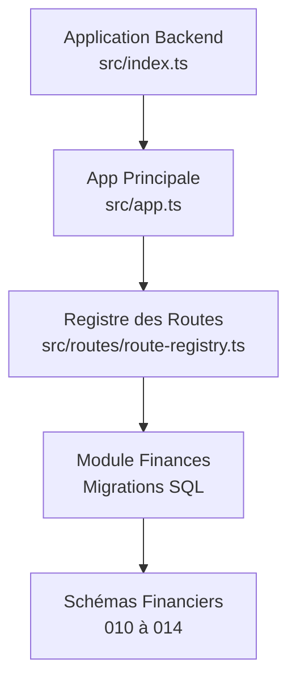
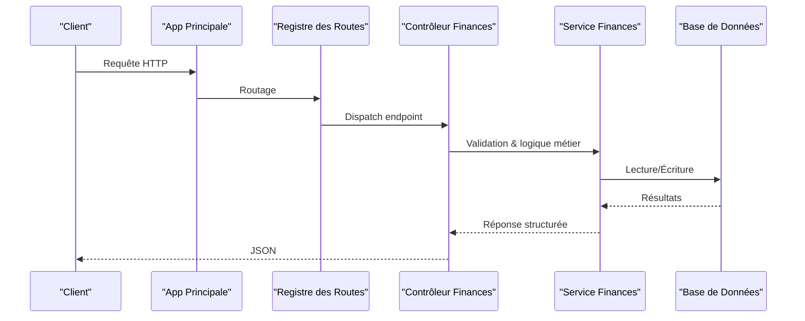
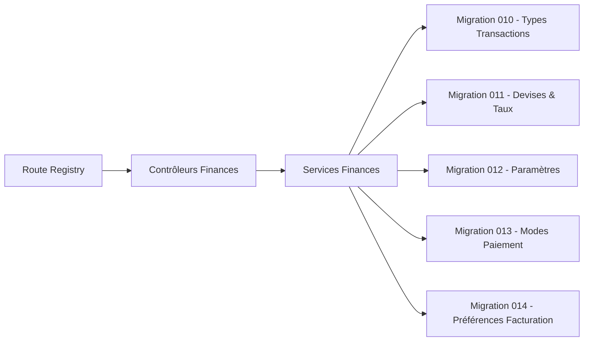

# API Options Financières

<cite>
**Fichiers référencés dans ce document**
- [API-FINANCES.md](file://docs/API-FINANCES.md)
- [IMPLEMENTATION-COMPLETE-FINANCES.md](file://docs/implementations/IMPLEMENTATION-COMPLETE-FINANCES.md)
- [ANALYSE-GESTION-FINANCIERE.md](file://docs/analyses/ANALYSE-GESTION-FINANCIERE.md)
- [010-module-finances.sql](file://backend/database/migrations/010-module-finances.sql)
- [011-module-finances-part2.sql](file://backend/database/migrations/011-module-finances-part2.sql)
- [012-module-finances-part3-parametres.sql](file://backend/database/migrations/012-module-finances-part3-parametres.sql)
- [013-module-finances-phase1-granularite.sql](file://backend/database/migrations/013-module-finances-phase1-granularite.sql)
- [014-module-finances-phase2-section.sql](file://backend/database/migrations/014-module-finances-phase2-section.sql)
- [route-registry.ts](file://backend/src/routes/route-registry.ts)
- [app.ts](file://backend/src/app.ts)
- [index.ts](file://backend/src/index.ts)
</cite>

## Table des matières
1. [Introduction](#introduction)
2. [Structure du projet](#structure-du-projet)
3. [Composants clés](#composants-clés)
4. [Vue d’ensemble de l’architecture](#vue-densemble-de-larchitecture)
5. [Analyse détaillée des composants](#analyse-detailee-des-composants)
6. [Analyse des dépendances](#analyse-des-dependances)
7. [Considérations de performance](#considerations-de-performance)
8. [Guide de dépannage](#guide-de-depannage)
9. [Conclusion](#conclusion)
10. [Annexes](#annexes)

## Introduction
Ce document présente une documentation API complète pour les options financières d’eLISAschool. Il couvre la configuration des paramètres financiers, les types de transactions, les devises et taux de change, les modes de paiement, ainsi que les préférences de facturation. Vous y trouverez les schémas de configuration, les validations métier et les règles de calcul associées, accompagnés d’exemples concrets pour la configuration initiale, l’ajout de nouveaux modes de paiement et la personnalisation des règles financières.

## Structure du projet
Le module financier est structuré autour de migrations de base de données qui définissent le schéma, d’un registre de routes qui expose les endpoints, et de fichiers de documentation qui détaillent les fonctionnalités et les règles métier. Les points d’entrée de l’application backend orchestrent le chargement des modules et des routes.

**Sources du diagramme**
- [index.ts](file://backend/src/index.ts)
- [app.ts](file://backend/src/app.ts)
- [route-registry.ts](file://backend/src/routes/route-registry.ts)
- [010-module-finances.sql](file://backend/database/migrations/010-module-finances.sql)
- [011-module-finances-part2.sql](file://backend/database/migrations/011-module-finances-part2.sql)
- [012-module-finances-part3-parametres.sql](file://backend/database/migrations/012-module-finances-part3-parametres.sql)
- [013-module-finances-phase1-granularite.sql](file://backend/database/migrations/013-module-finances-phase1-granularite.sql)
- [014-module-finances-phase2-section.sql](file://backend/database/migrations/014-module-finances-phase2-section.sql)

**Sources de section**
- [index.ts](file://backend/src/index.ts)
- [app.ts](file://backend/src/app.ts)
- [route-registry.ts](file://backend/src/routes/route-registry.ts)

## Composants clés
- Paramètres financiers : configuration globale de l’établissement (devise par défaut, arrondi, taxes, seuils).
- Types de transactions : catégories et libellés normalisés pour les flux financiers.
- Devises et taux de change : gestion multi-devises et conversion.
- Modes de paiement : méthodes acceptées et règles applicables.
- Préférences de facturation : règles d’émission, relances, échéances et rappels.

Ces composants sont implémentés via des entités et des tables définies dans les migrations financières, exposées par des endpoints REST.

**Sources de section**
- [API-FINANCES.md](file://docs/API-FINANCES.md)
- [IMPLEMENTATION-COMPLETE-FINANCES.md](file://docs/implementations/IMPLEMENTATION-COMPLETE-FINANCES.md)
- [ANALYSE-GESTION-FINANCIERE.md](file://docs/analyses/ANALYSE-GESTION-FINANCIERE.md)

## Vue d’ensemble de l’architecture
L’architecture suit un pattern modulaire : l’application charge les routes, qui pointent vers des contrôleurs/services du module finances. Les données sont persistées via les tables définies dans les migrations SQL. La sécurité et l’autorisation sont gérées par le système RBAC intégré.

**Sources du diagramme**
- [app.ts](file://backend/src/app.ts)
- [route-registry.ts](file://backend/src/routes/route-registry.ts)

## Analyse détaillée des composants

### Configuration des paramètres financiers
Endpoints associés :
- GET /api/finances/parametres : lecture des paramètres globaux
- PUT /api/finances/parametres : mise à jour des paramètres
- POST /api/finances/parametres : création initiale

Champs principaux :
- devise_par_defaut : code ISO (ex. XAF, EUR)
- arrondi_montant : entier (centimes ou unité monétaire)
- taxe_par_defaut : pourcentage
- seuil_alerte_impayes : montant
- politique_remise : booléen ou enum
- politique_escompte : booléen ou enum

Règles de validation :
- devise_par_defaut doit exister dans la table des devises actives
- arrondi_montant >= 0
- taxe_par_defaut entre 0 et 100
- seuil_alerte_impayes > 0

Exemple de configuration initiale :
- Créer les paramètres avec devise_par_defaut=XAF, arrondi_montant=50, taxe_par_defaut=19.25, seuil_alerte_impayes=50000, politique_remise=true, politique_escompte=false.

**Sources de section**
- [012-module-finances-part3-parametres.sql](file://backend/database/migrations/012-module-finances-part3-parametres.sql)
- [API-FINANCES.md](file://docs/API-FINANCES.md)

### Types de transactions
Endpoints associés :
- GET /api/finances/types-transactions : liste des types
- POST /api/finances/types-transactions : ajout d’un type
- PUT /api/finances/types-transactions/:id : modification
- DELETE /api/finances/types-transactions/:id : suppression

Champs principaux :
- code : identifiant unique (ex. FRAIS_INSCRIPTION, PAIE_ENSEIGNANT)
- libelle : description lisible
- categorie : enum (recettes, depenses, transfert)
- actif : booléen
- regles_calcul : JSON (formule, coefficients, plafonds)

Règles de validation :
- code unique par établissement
- categorie valide
- regles_calcul conforme au schéma attendu

Exemple d’ajout :
- Ajouter un type “FRAIS_ACTIVITE” avec categorie=depenses, actif=true, regles_calcul={base=montant_fixe, plafond=10000}.

**Sources de section**
- [010-module-finances.sql](file://backend/database/migrations/010-module-finances.sql)
- [API-FINANCES.md](file://docs/API-FINANCES.md)

### Devises et taux de change
Endpoints associés :
- GET /api/finances/devises : liste des devises
- POST /api/finances/devises : ajouter une devise
- GET /api/finances/taux-change : liste des taux
- POST /api/finances/taux-change : enregistrer un taux
- PUT /api/finances/taux-change/:id : mettre à jour un taux

Champs principaux :
- devise : code ISO (ex. XAF, USD)
- symbole : caractère affiché
- actif : booléen
- taux_conversion : nombre décimal
- date_effet : timestamp

Règles de validation :
- devise active uniquement si code reconnu
- taux_conversion > 0
- date_effet <= aujourd’hui pour activation immédiate

Exemple de conversion :
- Taux XAF→EUR = 0.00152 ; convertir 100000 XAF donne 152 EUR.

**Sources de section**
- [011-module-finances-part2.sql](file://backend/database/migrations/011-module-finances-part2.sql)
- [API-FINANCES.md](file://docs/API-FINANCES.md)

### Modes de paiement
Endpoints associés :
- GET /api/finances/modes-paiement : liste des modes
- POST /api/finances/modes-paiement : ajouter un mode
- PUT /api/finances/modes-paiement/:id : modifier un mode
- DELETE /api/finances/modes-paiement/:id : supprimer un mode

Champs principaux :
- code : identifiant unique (ex. CB, VIREMENT, ESPECE)
- libelle : description
- frais_fixe : montant
- frais_percentage : pourcentage
- actif : booléen
- regles_application : JSON (conditions, plafonds, restrictions)

Règles de validation :
- code unique par établissement
- frais_fixe >= 0, frais_percentage entre 0 et 100
- regles_application conforme au schéma

Exemple d’ajout :
- Ajouter “VIREMENT” avec frais_fixe=0, frais_percentage=0.5, actif=true, regles_application={delai_max=3jours, necessite_reference=true}.

**Sources de section**
- [013-module-finances-phase1-granularite.sql](file://backend/database/migrations/013-module-finances-phase1-granularite.sql)
- [API-FINANCES.md](file://docs/API-FINANCES.md)

### Préférences de facturation
Endpoints associés :
- GET /api/finances/preferences-facturation : lecture des préférences
- PUT /api/finances/preferences-facturation : mise à jour
- POST /api/finances/preferences-facturation : création initiale

Champs principaux :
- delai_paiement_jours : entier
- relance_seuil_jours : entier
- email_relance_actif : booléen
- template_relance : string (identifiant de modèle)
- politique_remise : enum ou JSON
- politique_escompte : enum ou JSON
- politique_penalites : JSON (taux, conditions)

Règles de validation :
- delai_paiement_jours > 0
- relance_seuil_jours >= 0
- politiques conformes aux enums attendus

Exemple de personnalisation :
- Politique remise : {seuil=50000, taux=5%, max=20000} ; escompte : {delai=10jours, taux=2%} ; pénalités : {taux_retard=1.5%/mois, grace_period=5jours}.

**Sources de section**
- [014-module-finances-phase2-section.sql](file://backend/database/migrations/014-module-finances-phase2-section.sql)
- [API-FINANCES.md](file://docs/API-FINANCES.md)

## Analyse des dépendances
Les endpoints financiers dépendent des tables définies dans les migrations 010 à 014. Le registre des routes mappe les chemins API vers les contrôleurs appropriés. L’application principale initialise les middlewares et les modules.

**Sources du diagramme**
- [route-registry.ts](file://backend/src/routes/route-registry.ts)
- [010-module-finances.sql](file://backend/database/migrations/010-module-finances.sql)
- [011-module-finances-part2.sql](file://backend/database/migrations/011-module-finances-part2.sql)
- [012-module-finances-part3-parametres.sql](file://backend/database/migrations/012-module-finances-part3-parametres.sql)
- [013-module-finances-phase1-granularite.sql](file://backend/database/migrations/013-module-finances-phase1-granularite.sql)
- [014-module-finances-phase2-section.sql](file://backend/database/migrations/014-module-finances-phase2-section.sql)

**Sources de section**
- [route-registry.ts](file://backend/src/routes/route-registry.ts)

## Considérations de performance
- Indexation des colonnes fréquemment filtrées (code, actif, date_effet).
- Mise en cache des taux de change et des paramètres financiers pour réduire les lectures DB.
- Limitation des payloads JSON et pagination sur les listes volumineuses.
- Utilisation de transactions pour les opérations critiques (enregistrement de taux, application de remises).

[Pas de sources nécessaires car cette section fournit des conseils généraux]

## Guide de dépannage
Problèmes courants :
- Erreur 400 lors de la création d’un type de transaction : vérifier l’unicité du code et la validité de la catégorie.
- Erreur 422 sur les paramètres financiers : valider les plages numériques (arrondi, taxe, seuils).
- Erreur 409 sur les taux de change : conflit de date_effet ou devise inactive.
- Échec de l’ajout d’un mode de paiement : vérifier les règles d’application et les champs obligatoires.

Actions recommandées :
- Consulter les logs backend pour les messages d’erreur détaillés.
- Vérifier les contraintes de clé étrangère et les enums dans les migrations.
- Utiliser les scripts de vérification intégrés pour valider l’intégrité des données.

**Sources de section**
- [API-FINANCES.md](file://docs/API-FINANCES.md)
- [ANALYSE-GESTION-FINANCIERE.md](file://docs/analyses/ANALYSE-GESTION-FINANCIERE.md)

## Conclusion
L’API des options financières d’eLISAschool offre une gestion complète et flexible des paramètres financiers, des types de transactions, des devises et taux de change, des modes de paiement et des préférences de facturation. Grâce à des validations métier robustes et des règles de calcul configurables, elle permet d’adapter le système aux besoins spécifiques de chaque établissement.

[Pas de sources nécessaires car cette section résume sans analyser de fichiers spécifiques]

## Annexes
- Exemples d’utilisation :
  - Configuration initiale : créer les paramètres financiers avec valeurs par défaut adaptées à la région.
  - Ajout de nouveaux modes de paiement : définir code, libelle, frais et règles d’application.
  - Personnalisation des règles financières : configurer politiques de remise, escompte et pénalités.

- Références techniques :
  - Schémas de données : migrations 010 à 014.
  - Endpoints : décrits dans la documentation API financière.

**Sources de section**
- [IMPLEMENTATION-COMPLETE-FINANCES.md](file://docs/implementations/IMPLEMENTATION-COMPLETE-FINANCES.md)
- [API-FINANCES.md](file://docs/API-FINANCES.md)