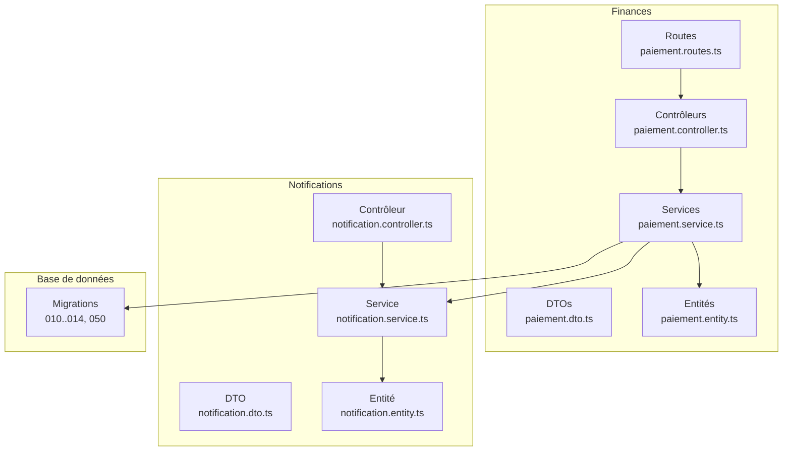
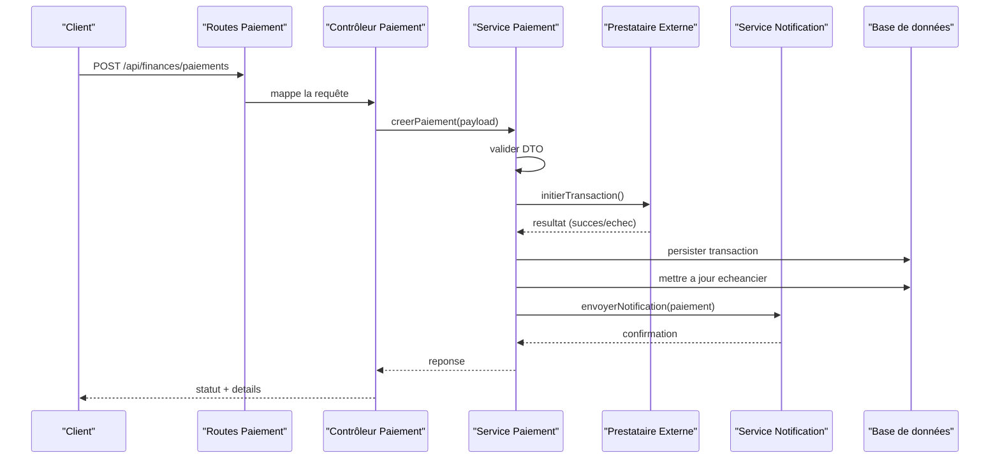
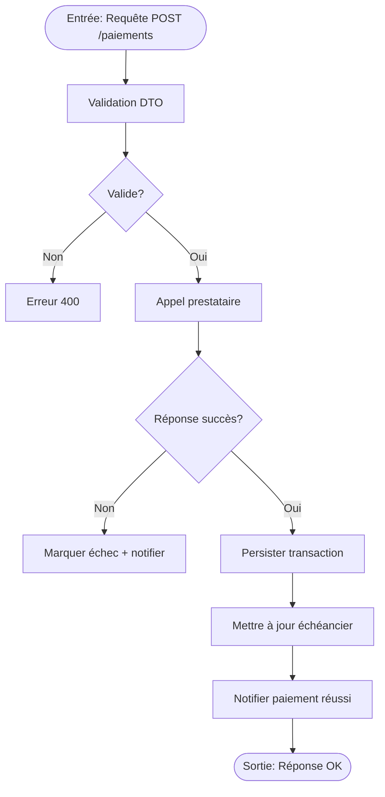
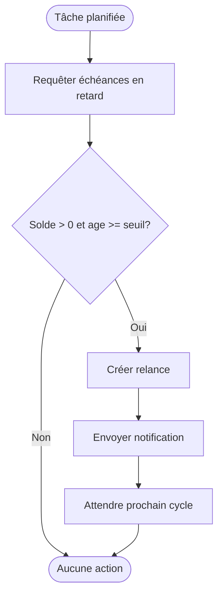
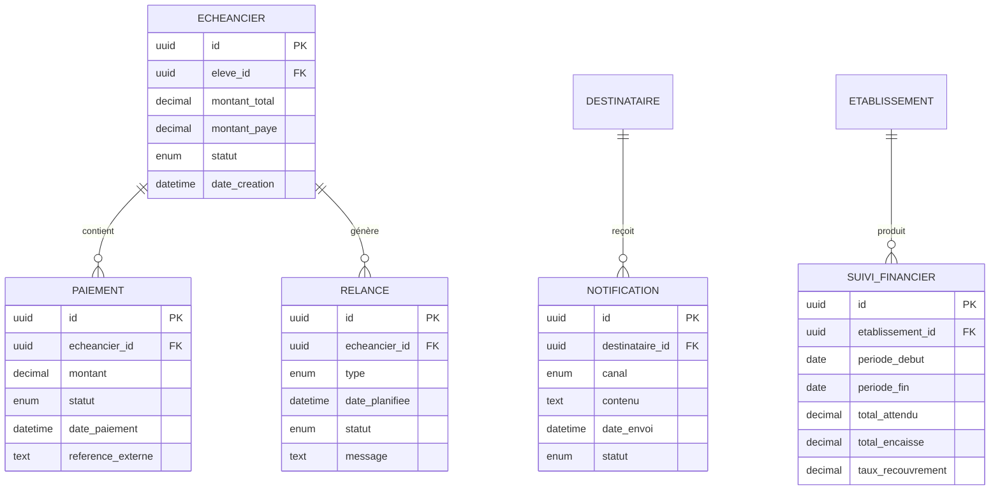
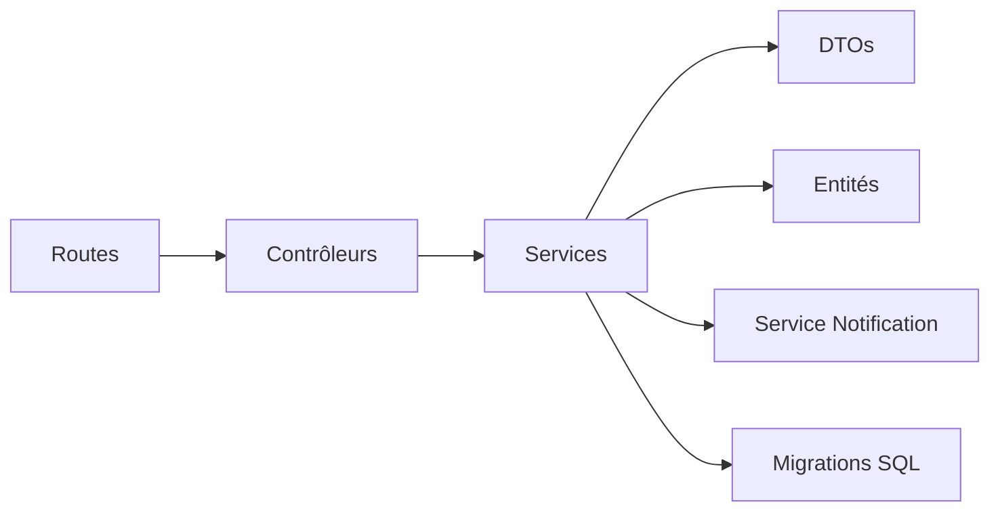

# API Paiements et Relances

<cite>
**Fichiers référencés dans ce document**
- [backend/src/modules/finances/index.ts](file://backend/src/modules/finances/index.ts)
- [backend/src/modules/finances/controllers/paiement.controller.ts](file://backend/src/modules/finances/controllers/paiement.controller.ts)
- [backend/src/modules/finances/services/paiement.service.ts](file://backend/src/modules/finances/services/paiement.service.ts)
- [backend/src/modules/finances/dto/paiement.dto.ts](file://backend/src/modules/finances/dto/paiement.dto.ts)
- [backend/src/modules/finances/entities/paiement.entity.ts](file://backend/src/modules/finances/entities/paiement.entity.ts)
- [backend/src/modules/finances/routes/paiement.routes.ts](file://backend/src/modules/finances/routes/paiement.routes.ts)
- [backend/src/modules/finances/services/echeancier.service.ts](file://backend/src/modules/finances/services/echeancier.service.ts)
- [backend/src/modules/finances/controllers/echeancier.controller.ts](file://backend/src/modules/finances/controllers/echeancier.controller.ts)
- [backend/src/modules/finances/dto/echeancier.dto.ts](file://backend/src/modules/finances/dto/echeancier.dto.ts)
- [backend/src/modules/finances/entities/echeancier.entity.ts](file://backend/src/modules/finances/entities/echeancier.entity.ts)
- [backend/src/modules/finances/services/relance.service.ts](file://backend/src/modules/finances/services/relance.service.ts)
- [backend/src/modules/finances/controllers/relance.controller.ts](file://backend/src/modules/finances/controllers/relance.controller.ts)
- [backend/src/modules/finances/dto/relance.dto.ts](file://backend/src/modules/finances/dto/relance.dto.ts)
- [backend/src/modules/finances/entities/relance.entity.ts](file://backend/src/modules/finances/entities/relance.entity.ts)
- [backend/src/modules/notifications/services/notification.service.ts](file://backend/src/modules/notifications/services/notification.service.ts)
- [backend/src/modules/notifications/controllers/notification.controller.ts](file://backend/src/modules/notifications/controllers/notification.controller.ts)
- [backend/src/modules/notifications/dto/notification.dto.ts](file://backend/src/modules/notifications/dto/notification.dto.ts)
- [backend/src/modules/notifications/entities/notification.entity.ts](file://backend/src/modules/notifications/entities/notification.entity.ts)
- [backend/src/modules/finances/services/suivi-financier.service.ts](file://backend/src/modules/finances/services/suivi-financier.service.ts)
- [backend/src/modules/finances/controllers/suivi-financier.controller.ts](file://backend/src/modules/finances/controllers/suivi-financier.controller.ts)
- [backend/src/modules/finances/dto/suivi-financier.dto.ts](file://backend/src/modules/finances/dto/suivi-financier.dto.ts)
- [backend/src/modules/finances/entities/suivi-financier.entity.ts](file://backend/src/modules/finances/entities/suivi-financier.entity.ts)
- [backend/database/migrations/010-module-finances.sql](file://backend/database/migrations/010-module-finances.sql)
- [backend/database/migrations/011-module-finances-part2.sql](file://backend/database/migrations/011-module-finances-part2.sql)
- [backend/database/migrations/012-module-finances-part3-parametres.sql](file://backend/database/migrations/012-module-finances-part3-parametres.sql)
- [backend/database/migrations/013-module-finances-phase1-granularite.sql](file://backend/database/migrations/013-module-finances-phase1-granularite.sql)
- [backend/database/migrations/014-module-finances-phase2-section.sql](file://backend/database/migrations/014-module-finances-phase2-section.sql)
- [backend/database/migrations/050-ameliorations-inscription-relances.sql](file://backend/database/migrations/050-ameliorations-inscription-relances.sql)
- [backend/src/config/swagger.config.ts](file://backend/src/config/swagger.config.ts)
- [backend/src/routes/route-registry.ts](file://backend/src/routes/route-registry.ts)
</cite>

## Table des matières
1. [Introduction](#introduction)
2. [Structure du projet](#structure-du-projet)
3. [Composants clés](#composants-clés)
4. [Vue d'ensemble de l'architecture](#vue-densemble-de-larchitecture)
5. [Analyse détaillée des composants](#analyse-detallee-des-composants)
6. [Analyse des dépendances](#analyse-des-dependances)
7. [Considérations de performance](#considerations-de-performance)
8. [Guide de dépannage](#guide-de-depannage)
9. [Conclusion](#conclusion)
10. [Annexes](#annexes)

## Introduction
Ce document présente une documentation API complète pour le module Finances d’eLISAschool, centrée sur les paiements, échéanciers, relances automatiques, notifications de paiement et suivi financier. Il couvre les endpoints, les schémas de données, les workflows de validation, les états de paiement, les règles de relance, ainsi que des exemples d’intégration avec des moyens de paiement externes, la gestion des échecs et la génération de reçus.

## Structure du projet
Le module Finances est organisé en couches classiques : contrôleurs (routes HTTP), services (logique métier), DTO (validation des entrées), entités (modèles de base de données) et migrations SQL. Les routes sont enregistrées via un registre centralisé et Swagger expose la documentation OpenAPI.

**Sources des diagrammes**
- [backend/src/modules/finances/routes/paiement.routes.ts](file://backend/src/modules/finances/routes/paiement.routes.ts)
- [backend/src/modules/finances/controllers/paiement.controller.ts](file://backend/src/modules/finances/controllers/paiement.controller.ts)
- [backend/src/modules/finances/services/paiement.service.ts](file://backend/src/modules/finances/services/paiement.service.ts)
- [backend/src/modules/finances/dto/paiement.dto.ts](file://backend/src/modules/finances/dto/paiement.dto.ts)
- [backend/src/modules/finances/entities/paiement.entity.ts](file://backend/src/modules/finances/entities/paiement.entity.ts)
- [backend/src/modules/notifications/services/notification.service.ts](file://backend/src/modules/notifications/services/notification.service.ts)
- [backend/src/modules/notifications/controllers/notification.controller.ts](file://backend/src/modules/notifications/controllers/notification.controller.ts)
- [backend/src/modules/notifications/dto/notification.dto.ts](file://backend/src/modules/notifications/dto/notification.dto.ts)
- [backend/src/modules/notifications/entities/notification.entity.ts](file://backend/src/modules/notifications/entities/notification.entity.ts)
- [backend/database/migrations/010-module-finances.sql](file://backend/database/migrations/010-module-finances.sql)
- [backend/database/migrations/011-module-finances-part2.sql](file://backend/database/migrations/011-module-finances-part2.sql)
- [backend/database/migrations/012-module-finances-part3-parametres.sql](file://backend/database/migrations/012-module-finances-part3-parametres.sql)
- [backend/database/migrations/013-module-finances-phase1-granularite.sql](file://backend/database/migrations/013-module-finances-phase1-granularite.sql)
- [backend/database/migrations/014-module-finances-phase2-section.sql](file://backend/database/migrations/014-module-finances-phase2-section.sql)
- [backend/database/migrations/050-ameliorations-inscription-relances.sql](file://backend/database/migrations/050-ameliorations-inscription-relances.sql)

**Sources de section**
- [backend/src/modules/finances/index.ts](file://backend/src/modules/finances/index.ts)
- [backend/src/routes/route-registry.ts](file://backend/src/routes/route-registry.ts)
- [backend/src/config/swagger.config.ts](file://backend/src/config/swagger.config.ts)

## Composants clés
- Contrôleurs : exposition des endpoints REST pour paiements, échéanciers, relances et suivi financier.
- Services : orchestration des opérations métier, appels aux fournisseurs de paiement, déclenchement de notifications et calculs financiers.
- DTO : validation et typage des requêtes/réponses.
- Entités : modèles persistés en base de données.
- Migrations : définition du schéma et évolutions du modèle financier.

**Sources de section**
- [backend/src/modules/finances/controllers/paiement.controller.ts](file://backend/src/modules/finances/controllers/paiement.controller.ts)
- [backend/src/modules/finances/services/paiement.service.ts](file://backend/src/modules/finances/services/paiement.service.ts)
- [backend/src/modules/finances/dto/paiement.dto.ts](file://backend/src/modules/finances/dto/paiement.dto.ts)
- [backend/src/modules/finances/entities/paiement.entity.ts](file://backend/src/modules/finances/entities/paiement.entity.ts)
- [backend/src/modules/finances/controllers/echeancier.controller.ts](file://backend/src/modules/finances/controllers/echeancier.controller.ts)
- [backend/src/modules/finances/services/echeancier.service.ts](file://backend/src/modules/finances/services/echeancier.service.ts)
- [backend/src/modules/finances/dto/echeancier.dto.ts](file://backend/src/modules/finances/dto/echeancier.dto.ts)
- [backend/src/modules/finances/entities/echeancier.entity.ts](file://backend/src/modules/finances/entities/echeancier.entity.ts)
- [backend/src/modules/finances/controllers/relance.controller.ts](file://backend/src/modules/finances/controllers/relance.controller.ts)
- [backend/src/modules/finances/services/relance.service.ts](file://backend/src/modules/finances/services/relance.service.ts)
- [backend/src/modules/finances/dto/relance.dto.ts](file://backend/src/modules/finances/dto/relance.dto.ts)
- [backend/src/modules/finances/entities/relance.entity.ts](file://backend/src/modules/finances/entities/relance.entity.ts)
- [backend/src/modules/finances/controllers/suivi-financier.controller.ts](file://backend/src/modules/finances/controllers/suivi-financier.controller.ts)
- [backend/src/modules/finances/services/suivi-financier.service.ts](file://backend/src/modules/finances/services/suivi-financier.service.ts)
- [backend/src/modules/finances/dto/suivi-financier.dto.ts](file://backend/src/modules/finances/dto/suivi-financier.dto.ts)
- [backend/src/modules/finances/entities/suivi-financier.entity.ts](file://backend/src/modules/finances/entities/suivi-financier.entity.ts)

## Vue d'ensemble de l'architecture
Le flux typique d’un paiement commence par un appel au contrôleur, qui délègue au service de paiement. Le service valide les données, appelle un fournisseur externe, met à jour l’échéancier et la transaction, puis déclenche une notification. Les relances sont planifiées et exécutées par un service dédié, qui peut aussi notifier les parties prenantes.

**Sources des diagrammes**
- [backend/src/modules/finances/routes/paiement.routes.ts](file://backend/src/modules/finances/routes/paiement.routes.ts)
- [backend/src/modules/finances/controllers/paiement.controller.ts](file://backend/src/modules/finances/controllers/paiement.controller.ts)
- [backend/src/modules/finances/services/paiement.service.ts](file://backend/src/modules/finances/services/paiement.service.ts)
- [backend/src/modules/notifications/services/notification.service.ts](file://backend/src/modules/notifications/services/notification.service.ts)

## Analyse détaillée des composants

### Endpoints Paiements
- Enregistrer un paiement : POST /api/finances/paiements
- Lister les paiements : GET /api/finances/paiements
- Obtenir un paiement : GET /api/finances/paiements/:id
- Mettre à jour un paiement : PUT /api/finances/paiements/:id
- Supprimer un paiement : DELETE /api/finances/paiements/:id
- Annuler un paiement : POST /api/finances/paiements/:id/annuler
- Générer un reçu : GET /api/finances/paiements/:id/reçu

Exemple d’intégration moyen de paiement externe :
- Le service paie initialise une transaction auprès du prestataire, attend la réponse, puis persiste l’état et notifie.

Gestion des échecs :
- Si le prestataire retourne un échec, le service marque la transaction comme échouée, met à jour l’échéancier et déclenche une notification d’erreur.

Génération de reçus :
- Un endpoint dédié génère un reçu basé sur la transaction validée.

**Sources de section**
- [backend/src/modules/finances/routes/paiement.routes.ts](file://backend/src/modules/finances/routes/paiement.routes.ts)
- [backend/src/modules/finances/controllers/paiement.controller.ts](file://backend/src/modules/finances/controllers/paiement.controller.ts)
- [backend/src/modules/finances/services/paiement.service.ts](file://backend/src/modules/finances/services/paiement.service.ts)
- [backend/src/modules/finances/dto/paiement.dto.ts](file://backend/src/modules/finances/dto/paiement.dto.ts)
- [backend/src/modules/finances/entities/paiement.entity.ts](file://backend/src/modules/finances/entities/paiement.entity.ts)

#### Workflow de validation paiement

**Sources des diagrammes**
- [backend/src/modules/finances/services/paiement.service.ts](file://backend/src/modules/finances/services/paiement.service.ts)
- [backend/src/modules/finances/dto/paiement.dto.ts](file://backend/src/modules/finances/dto/paiement.dto.ts)

### Endpoints Échéanciers
- Créer un échéancier : POST /api/finances/echeanciers
- Lister les échéanciers : GET /api/finances/echeanciers
- Obtenir un échéancier : GET /api/finances/echeanciers/:id
- Mettre à jour un échéancier : PUT /api/finances/echeanciers/:id
- Supprimer un échéancier : DELETE /api/finances/echeanciers/:id
- Marquer un paiement partiel : POST /api/finances/echeanciers/:id/paiement-partiel

Règles de calcul :
- L’échéancier se compose de lignes avec dates, montants et statuts. Le service calcule les soldes restants et met à jour les statuts après chaque paiement.

**Sources de section**
- [backend/src/modules/finances/controllers/echeancier.controller.ts](file://backend/src/modules/finances/controllers/echeancier.controller.ts)
- [backend/src/modules/finances/services/echeancier.service.ts](file://backend/src/modules/finances/services/echeancier.service.ts)
- [backend/src/modules/finances/dto/echeancier.dto.ts](file://backend/src/modules/finances/dto/echeancier.dto.ts)
- [backend/src/modules/finances/entities/echeancier.entity.ts](file://backend/src/modules/finances/entities/echeancier.entity.ts)

### Endpoints Relances
- Lister les relances : GET /api/finances/relances
- Planifier une relance : POST /api/finances/relances
- Exécuter manuellement : POST /api/finances/relances/:id/executer
- Statut relance : GET /api/finances/relances/:id

Règles de relance :
- Déclenchement automatique basé sur l’âge de l’échéance, le solde impayé et les paramètres de l’établissement.
- Tentatives limitées, intervalles configurables et arrêt après paiement complet.

**Sources de section**
- [backend/src/modules/finances/controllers/relance.controller.ts](file://backend/src/modules/finances/controllers/relance.controller.ts)
- [backend/src/modules/finances/services/relance.service.ts](file://backend/src/modules/finances/services/relance.service.ts)
- [backend/src/modules/finances/dto/relance.dto.ts](file://backend/src/modules/finances/dto/relance.dto.ts)
- [backend/src/modules/finances/entities/relance.entity.ts](file://backend/src/modules/finances/entities/relance.entity.ts)

#### Workflow relance automatique

**Sources des diagrammes**
- [backend/src/modules/finances/services/relance.service.ts](file://backend/src/modules/finances/services/relance.service.ts)
- [backend/src/modules/notifications/services/notification.service.ts](file://backend/src/modules/notifications/services/notification.service.ts)

### Notifications de paiement
- Envoyer une notification : POST /api/notifications
- Lister les notifications : GET /api/notifications
- Obtenir une notification : GET /api/notifications/:id
- Marquer comme lu : PUT /api/notifications/:id/lire

Types de notifications :
- Succès paiement, échec paiement, relance envoyée, rappel échéance.

**Sources de section**
- [backend/src/modules/notifications/controllers/notification.controller.ts](file://backend/src/modules/notifications/controllers/notification.controller.ts)
- [backend/src/modules/notifications/services/notification.service.ts](file://backend/src/modules/notifications/services/notification.service.ts)
- [backend/src/modules/notifications/dto/notification.dto.ts](file://backend/src/modules/notifications/dto/notification.dto.ts)
- [backend/src/modules/notifications/entities/notification.entity.ts](file://backend/src/modules/notifications/entities/notification.entity.ts)

### Suivi financier
- Indicateurs financiers : GET /api/finances/suivi
- Détail par période : GET /api/finances/suivi?periode=...
- Export CSV : GET /api/finances/suivi/export

Indicateurs :
- Total encaissé, total attendu, taux de recouvrement, soldes par classe/niveau.

**Sources de section**
- [backend/src/modules/finances/controllers/suivi-financier.controller.ts](file://backend/src/modules/finances/controllers/suivi-financier.controller.ts)
- [backend/src/modules/finances/services/suivi-financier.service.ts](file://backend/src/modules/finances/services/suivi-financier.service.ts)
- [backend/src/modules/finances/dto/suivi-financier.dto.ts](file://backend/src/modules/finances/dto/suivi-financier.dto.ts)
- [backend/src/modules/finances/entities/suivi-financier.entity.ts](file://backend/src/modules/finances/entities/suivi-financier.entity.ts)

### Modèles de données

**Sources des diagrammes**
- [backend/src/modules/finances/entities/paiement.entity.ts](file://backend/src/modules/finances/entities/paiement.entity.ts)
- [backend/src/modules/finances/entities/echeancier.entity.ts](file://backend/src/modules/finances/entities/echeancier.entity.ts)
- [backend/src/modules/finances/entities/relance.entity.ts](file://backend/src/modules/finances/entities/relance.entity.ts)
- [backend/src/modules/notifications/entities/notification.entity.ts](file://backend/src/modules/notifications/entities/notification.entity.ts)
- [backend/src/modules/finances/entities/suivi-financier.entity.ts](file://backend/src/modules/finances/entities/suivi-financier.entity.ts)

## Analyse des dépendances
Les composants s’appuient sur des DTOs pour la validation, des entités pour la persistance et des services pour la logique métier. Les routes sont centralisées et Swagger expose les spécifications.

**Sources des diagrammes**
- [backend/src/routes/route-registry.ts](file://backend/src/routes/route-registry.ts)
- [backend/src/config/swagger.config.ts](file://backend/src/config/swagger.config.ts)
- [backend/src/modules/finances/routes/paiement.routes.ts](file://backend/src/modules/finances/routes/paiement.routes.ts)
- [backend/src/modules/finances/controllers/paiement.controller.ts](file://backend/src/modules/finances/controllers/paiement.controller.ts)
- [backend/src/modules/finances/services/paiement.service.ts](file://backend/src/modules/finances/services/paiement.service.ts)
- [backend/src/modules/finances/dto/paiement.dto.ts](file://backend/src/modules/finances/dto/paiement.dto.ts)
- [backend/src/modules/finances/entities/paiement.entity.ts](file://backend/src/modules/finances/entities/paiement.entity.ts)
- [backend/src/modules/notifications/services/notification.service.ts](file://backend/src/modules/notifications/services/notification.service.ts)
- [backend/database/migrations/010-module-finances.sql](file://backend/database/migrations/010-module-finances.sql)

**Sources de section**
- [backend/src/routes/route-registry.ts](file://backend/src/routes/route-registry.ts)
- [backend/src/config/swagger.config.ts](file://backend/src/config/swagger.config.ts)

## Considérations de performance
- Indexation des colonnes critiques (dates, statuts, IDs liés).
- Requêtes paginées pour listes volumineuses.
- Mise en cache des indicateurs financiers si nécessaire.
- Limitation du nombre de tentatives de relance et backoff exponentiel.

[Section sans sources spécifiques]

## Guide de dépannage
- Erreurs de validation : vérifier les DTOs et messages d’erreur retournés.
- Échecs prestataire : inspecter logs, référence externe et retry policy.
- Relances non envoyées : vérifier planification, seuils et permissions.
- Notifications manquantes : vérifier canaux et destinations.

**Sources de section**
- [backend/src/modules/finances/dto/paiement.dto.ts](file://backend/src/modules/finances/dto/paiement.dto.ts)
- [backend/src/modules/finances/services/paiement.service.ts](file://backend/src/modules/finances/services/paiement.service.ts)
- [backend/src/modules/finances/services/relance.service.ts](file://backend/src/modules/finances/services/relance.service.ts)
- [backend/src/modules/notifications/services/notification.service.ts](file://backend/src/modules/notifications/services/notification.service.ts)

## Conclusion
Le module Finances d’eLISAschool offre une API robuste pour gérer paiements, échéanciers, relances et suivi financier, avec une intégration claire des notifications et une traçabilité forte grâce aux entités et migrations. La modularisation facilite l’évolution et l’intégration de prestataires externes.

[Section sans sources spécifiques]

## Annexes

### Schémas de transactions et états de paiement
- États courants : en attente, validé, annulé, échoué, remboursé.
- Champs essentiels : montant, référence externe, date, statut, lien vers échéancier.

**Sources de section**
- [backend/src/modules/finances/entities/paiement.entity.ts](file://backend/src/modules/finances/entities/paiement.entity.ts)
- [backend/database/migrations/010-module-finances.sql](file://backend/database/migrations/010-module-finances.sql)
- [backend/database/migrations/011-module-finances-part2.sql](file://backend/database/migrations/011-module-finances-part2.sql)
- [backend/database/migrations/012-module-finances-part3-parametres.sql](file://backend/database/migrations/012-module-finances-part3-parametres.sql)
- [backend/database/migrations/013-module-finances-phase1-granularite.sql](file://backend/database/migrations/013-module-finances-phase1-granularite.sql)
- [backend/database/migrations/014-module-finances-phase2-section.sql](file://backend/database/migrations/014-module-finances-phase2-section.sql)
- [backend/database/migrations/050-ameliorations-inscription-relances.sql](file://backend/database/migrations/050-ameliorations-inscription-relances.sql)

### Workflows de validation
- Validation DTO avant traitement.
- Appel prestataire avec gestion d’erreurs.
- Persistance atomique et mise à jour d’échéancier.
- Notification post-traitement.

**Sources de section**
- [backend/src/modules/finances/dto/paiement.dto.ts](file://backend/src/modules/finances/dto/paiement.dto.ts)
- [backend/src/modules/finances/services/paiement.service.ts](file://backend/src/modules/finances/services/paiement.service.ts)

### Règles de relance
- Seuil d’âge d’échéance configurable.
- Limite de tentatives et intervalle entre envois.
- Arrêt dès paiement complet.

**Sources de section**
- [backend/src/modules/finances/services/relance.service.ts](file://backend/src/modules/finances/services/relance.service.ts)
- [backend/database/migrations/050-ameliorations-inscription-relances.sql](file://backend/database/migrations/050-ameliorations-inscription-relances.sql)

### Intégration moyens de paiement externes
- Initialiser transaction avec payload minimal.
- Gérer réponses synchrones ou webhooks.
- Mapper résultat en état de paiement.

**Sources de section**
- [backend/src/modules/finances/services/paiement.service.ts](file://backend/src/modules/finances/services/paiement.service.ts)

### Traitement des échecs de paiement
- Marquer échec, loguer référence externe.
- Notifier utilisateur et admin.
- Proposer réessai ou annulation.

**Sources de section**
- [backend/src/modules/finances/services/paiement.service.ts](file://backend/src/modules/finances/services/paiement.service.ts)
- [backend/src/modules/notifications/services/notification.service.ts](file://backend/src/modules/notifications/services/notification.service.ts)

### Génération de reçus
- Endpoint dédié basé sur transaction validée.
- Contenu : détails paiement, émetteur, destinataire, montant, date.

**Sources de section**
- [backend/src/modules/finances/controllers/paiement.controller.ts](file://backend/src/modules/finances/controllers/paiement.controller.ts)
- [backend/src/modules/finances/services/paiement.service.ts](file://backend/src/modules/finances/services/paiement.service.ts)