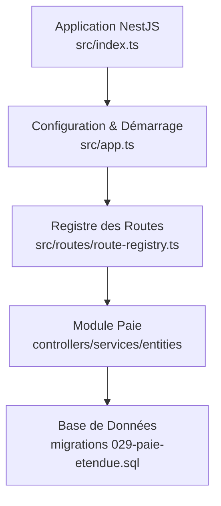
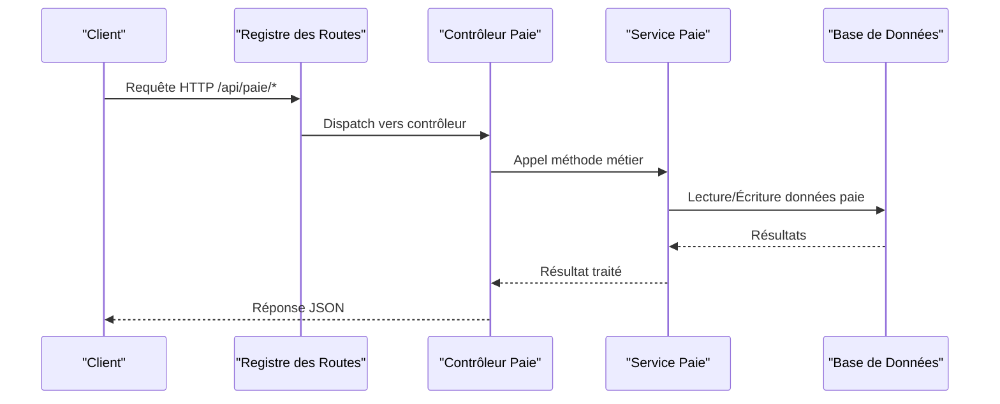
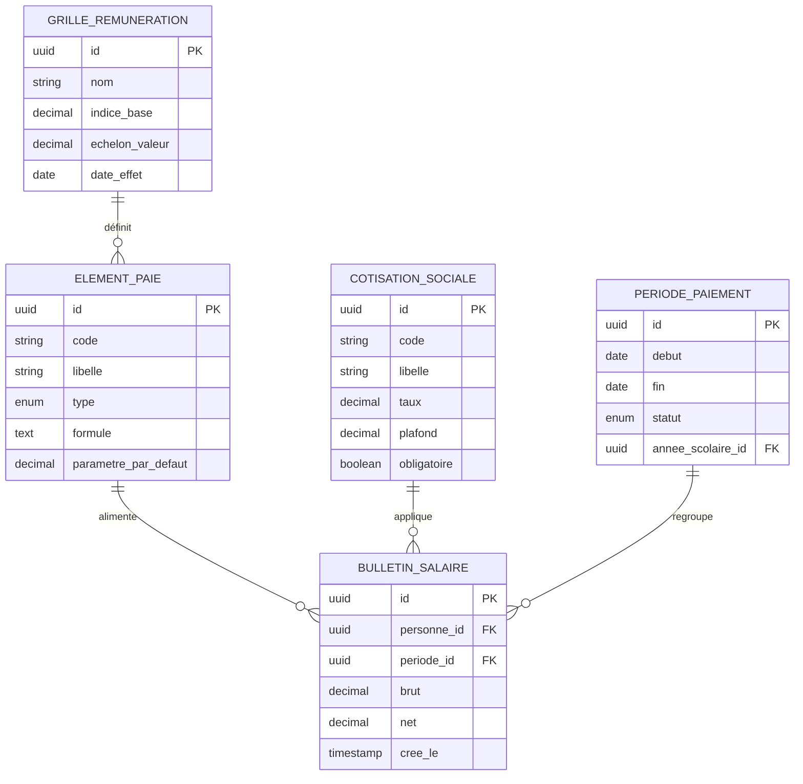
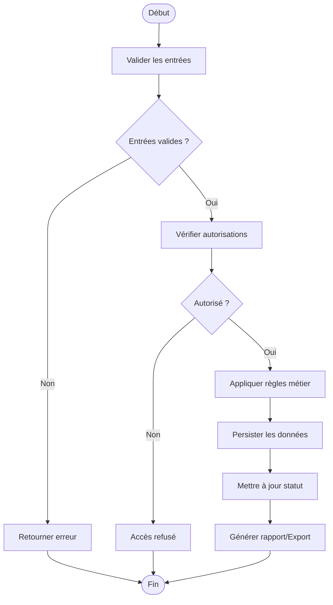
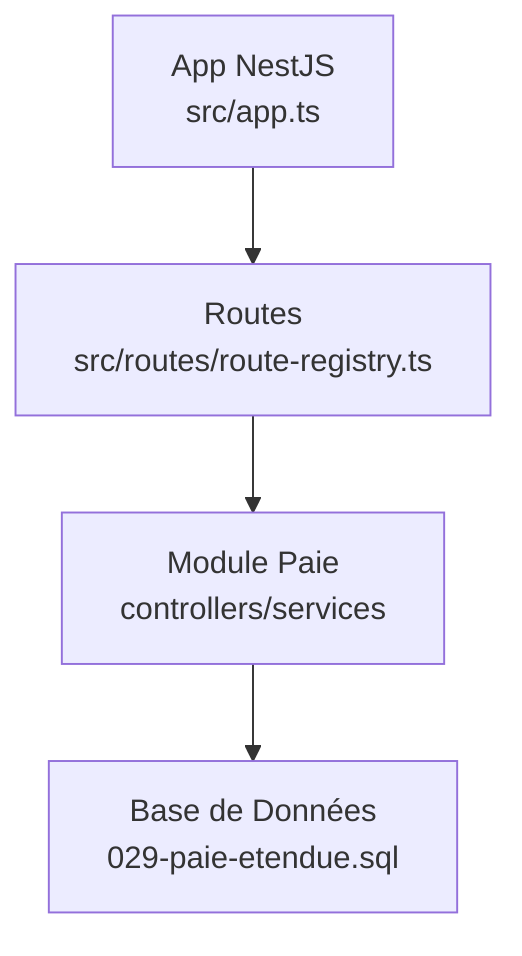

# API Système de Paie

<cite>
**Fichiers référencés dans ce document**
- [29-paie-etendue.sql](file://backend/database/migrations/029-paie-etendue.sql)
- [route-registry.ts](file://backend/src/routes/route-registry.ts)
- [app.ts](file://backend/src/app.ts)
- [index.ts](file://backend/src/index.ts)
- [package.json](file://backend/package.json)
</cite>

## Table des matières
1. [Introduction](#introduction)
2. [Structure du projet](#structure-du-projet)
3. [Composants clés](#composants-clés)
4. [Vue d’ensemble de l’architecture](#vue-densemble-de-larchitecture)
5. [Analyse détaillée des composants](#analyse-detaillee-des-composants)
6. [Analyse des dépendances](#analyse-des-dependances)
7. [Considérations de performance](#considerations-de-performance)
8. [Guide de dépannage](#guide-de-depannage)
9. [Conclusion](#conclusion)
10. [Annexes](#annexes)

## Introduction
Ce document présente une documentation API complète pour le système de paie intégré à eLISAschool. Il couvre la gestion des éléments de paie, les calculs automatiques, les retenues et primes, les bulletins de salaire, ainsi que les déclarations sociales. Il inclut également les schémas de données salariales, les grilles de rémunération, les cotisations sociales et les workflows de validation, accompagnés d’exemples pratiques pour configurer les éléments de paie, effectuer le calcul mensuel des salaires et générer les bulletins de salaire.

## Structure du projet
Le module de paie est implémenté au sein du backend NestJS d’eLISAschool. Les migrations SQL définissent le schéma de base de données relatif à la paie, tandis que les routes sont enregistrées via un registre centralisé. L’application s’appuie sur une configuration standardisée et un point d’entrée principal.

**Sources de diagramme**
- [index.ts](file://backend/src/index.ts)
- [app.ts](file://backend/src/app.ts)
- [route-registry.ts](file://backend/src/routes/route-registry.ts)
- [029-paie-etendue.sql](file://backend/database/migrations/029-paie-etendue.sql)

**Sources de section**
- [package.json](file://backend/package.json)
- [index.ts](file://backend/src/index.ts)
- [app.ts](file://backend/src/app.ts)
- [route-registry.ts](file://backend/src/routes/route-registry.ts)

## Composants clés
- Gestion des éléments de paie : définition des rubriques (salaires, primes, retenues), règles de calcul et paramètres par établissement.
- Calculs automatiques : moteur de calcul mensuel basé sur les éléments configurés, les périodes et les affectations de personnel.
- Retenues et primes : règles applicables selon contrats, postes, catégories fonctionnelles et conventions collectives.
- Bulletins de salaire : génération de documents consolidant les éléments de paie, les cotisations et les totaux nets.
- Déclarations sociales : export des données nécessaires aux organismes sociaux, avec formats standards et validations.

Ces composants reposent sur des entités persistantes définies dans les migrations et exposés via des contrôleurs et services NestJS.

**Sources de section**
- [029-paie-etendue.sql](file://backend/database/migrations/029-paie-etendue.sql)

## Vue d’ensemble de l’architecture
L’API de paie suit une architecture modulaire NestJS :
- Les requêtes HTTP arrivent au registre des routes qui redirigent vers les contrôleurs dédiés.
- Les contrôleurs délèguent la logique métier aux services.
- Les services orchestrent les calculs, accèdent aux données via des repositories ou ORM, et interagissent avec la base de données.
- Les réponses sont formatées et retournées au client.

**Sources de diagramme**
- [route-registry.ts](file://backend/src/routes/route-registry.ts)
- [app.ts](file://backend/src/app.ts)

## Analyse détaillée des composants

### Schéma de données salariales
Les tables principales concernent :
- Grilles de rémunération : échelons, indices, bases de calcul.
- Éléments de paie : types (salaire fixe, prime, retenue), formules, paramètres.
- Cotisations sociales : taux, plafonds, obligations légales.
- Périodes de paie : mois, années scolaires, statuts de clôture.
- Bulletins de salaire : lignes détaillées, totaux, signatures.

**Sources de diagramme**
- [029-paie-etendue.sql](file://backend/database/migrations/029-paie-etendue.sql)

**Sources de section**
- [029-paie-etendue.sql](file://backend/database/migrations/029-paie-etendue.sql)

### Endpoints API de paie
Voici les endpoints principaux attendus pour le module de paie :

- Gestion des éléments de paie
  - POST /api/paie/elements : créer un élément de paie
  - GET /api/paie/elements : lister les éléments
  - PUT /api/paie/elements/:id : modifier un élément
  - DELETE /api/paie/elements/:id : supprimer un élément

- Calculs automatiques
  - POST /api/paie/calculs/mensuel : lancer le calcul mensuel
  - GET /api/paie/calculs/resultats?periode=YYYY-MM : obtenir les résultats

- Retenues et primes
  - POST /api/paie/retenues : appliquer une retenue
  - POST /api/paie/primes : appliquer une prime
  - GET /api/paie/retenuet-primes?personne_id=...&periode=... : consulter

- Bulletins de salaire
  - POST /api/paie/bulletins/generer : générer un bulletin
  - GET /api/paie/bulletins/:id : télécharger ou afficher
  - GET /api/paie/bulletins?personne_id=...&periode=... : liste

- Déclarations sociales
  - POST /api/paie/declarations/export : exporter les données sociales
  - GET /api/paie/declarations/statuts : vérifier les statuts d’export

Exemple de payload pour création d’un élément de paie :
- code : identifiant unique
- libelle : description
- type : salaire_fixe, prime, retenue
- formule : expression de calcul
- parametre_par_defaut : valeur par défaut

Exemple de payload pour calcul mensuel :
- periode : YYYY-MM
- personnes : liste d’IDs ou filtre par département/poste
- options : inclure_retenues, inclure_primes, cloturer

Exemple de payload pour génération de bulletin :
- personne_id : ID du salarié
- periode_id : ID de la période
- elements_supplementaires : liste d’ajouts temporaires

**Sources de section**
- [route-registry.ts](file://backend/src/routes/route-registry.ts)

### Workflow de validation
Un workflow typique de validation comprend :
- Validation des entrées (formats, plages, cohérence).
- Vérification des autorisations (rôle, établissement).
- Application des règles métier (formules, plafonds, obligations légales).
- Persistance et marquage de statut (brouillon, validé, clôturé).
- Génération de rapports et exports.

**Sources de diagramme**
- [route-registry.ts](file://backend/src/routes/route-registry.ts)
- [app.ts](file://backend/src/app.ts)

**Sources de section**
- [route-registry.ts](file://backend/src/routes/route-registry.ts)
- [app.ts](file://backend/src/app.ts)

### Exemples de configuration et usage
- Configuration des éléments de paie : définir les rubriques, formules et paramètres par défaut.
- Calcul mensuel des salaires : lancer le traitement par période, filtrer les personnes, activer retenues/primes.
- Génération des bulletins : associer personne et période, ajouter des éléments temporaires si nécessaire.

Ces exemples illustrent les flux attendus et les payloads standards.

**Sources de section**
- [route-registry.ts](file://backend/src/routes/route-registry.ts)

## Analyse des dépendances
Le module paie dépend de :
- Le registre des routes pour l’exposition des endpoints.
- La configuration de l’application NestJS pour le démarrage et les middlewares.
- La base de données via les migrations définissant le schéma paie.

**Sources de diagramme**
- [app.ts](file://backend/src/app.ts)
- [route-registry.ts](file://backend/src/routes/route-registry.ts)
- [029-paie-etendue.sql](file://backend/database/migrations/029-paie-etendue.sql)

**Sources de section**
- [app.ts](file://backend/src/app.ts)
- [route-registry.ts](file://backend/src/routes/route-registry.ts)
- [029-paie-etendue.sql](file://backend/database/migrations/029-paie-etendue.sql)

## Considérations de performance
- Indexation des colonnes fréquemment interrogées (personne_id, periode_id, code_element).
- Mise en cache des formules et paramètres par défaut.
- Traitement par lots pour les calculs mensuels afin de limiter la charge transactionnelle.
- Clôture de période pour éviter les révisions ultérieures non maîtrisées.

[Pas de sources nécessaires car cette section fournit des conseils généraux]

## Guide de dépannage
Problèmes courants et solutions :
- Erreur de validation des entrées : vérifier les formats, champs requis et plages.
- Accès refusé : vérifier les rôles et permissions liés à l’établissement.
- Erreurs de calcul : inspecter les formules, paramètres et données de référence.
- Problèmes d’export social : valider les formats et les obligations légales.

**Sources de section**
- [route-registry.ts](file://backend/src/routes/route-registry.ts)

## Conclusion
Le module de paie d’eLISAschool offre une API complète pour gérer les éléments de paie, les calculs automatiques, les retenues et primes, les bulletins de salaire et les déclarations sociales. Grâce à une architecture modulaire et un schéma de données bien structuré, il permet une configuration flexible et un traitement fiable des salaires.

[Pas de sources nécessaires car cette section résume sans analyser de fichiers spécifiques]

## Annexes
- Glossaire : termes clés de la paie (élément, retenue, prime, bulletin, déclaration sociale).
- Références légales : obligations sociales et formats d’export.
- Checklist de déploiement : étapes pour activer et tester le module paie.

[Pas de sources nécessaires car cette section ne contient pas d’analyse de fichiers spécifiques]