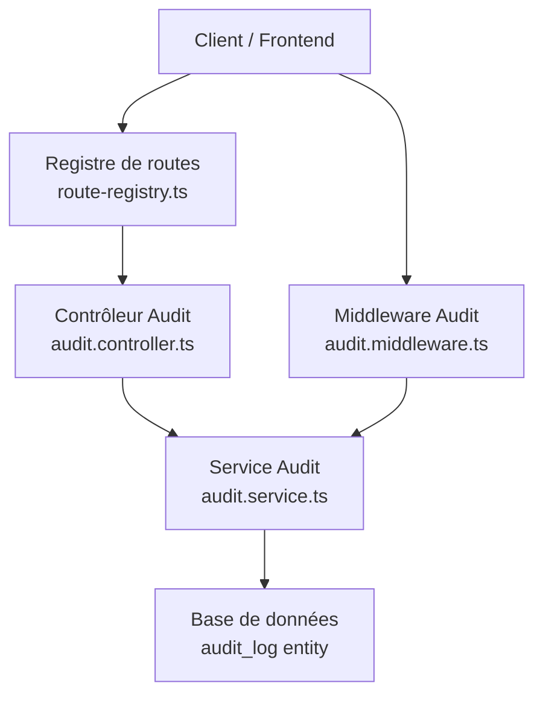
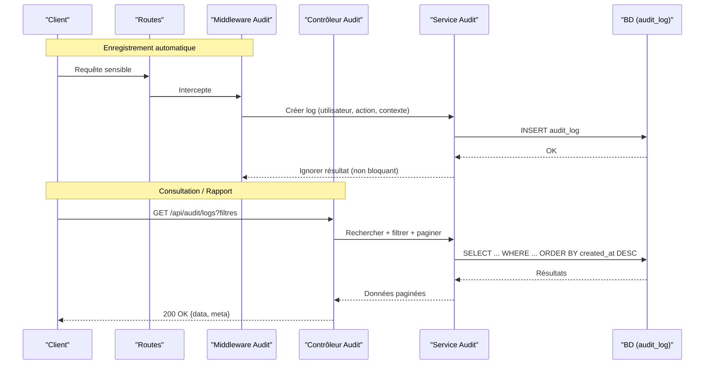
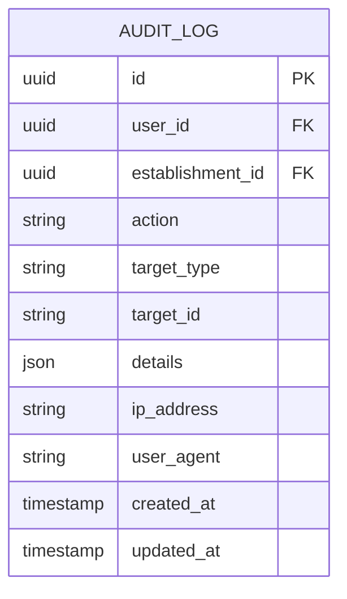
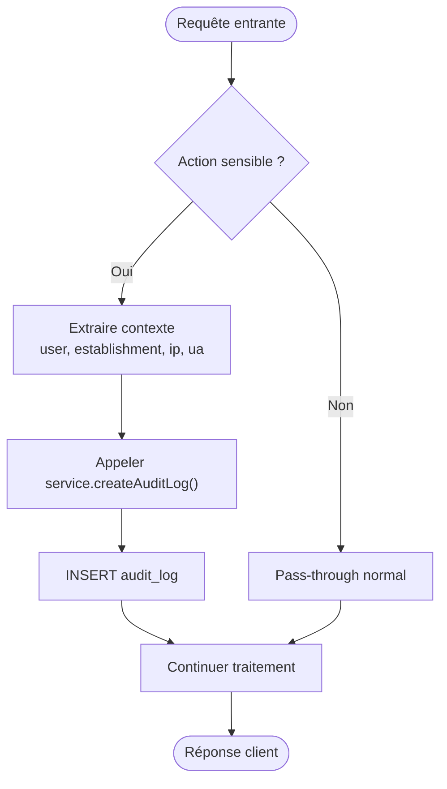
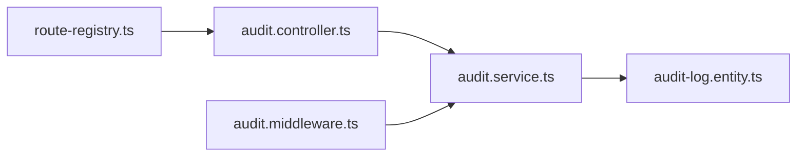

# API Audit et Traçabilité

<cite>
**Fichiers référencés dans ce document**
- [backend/src/modules/audit/controllers/audit.controller.ts](file://backend/src/modules/audit/controllers/audit.controller.ts)
- [backend/src/modules/audit/services/audit.service.ts](file://backend/src/modules/audit/services/audit.service.ts)
- [backend/src/modules/audit/entities/audit-log.entity.ts](file://backend/src/modules/audit/entities/audit-log.entity.ts)
- [backend/src/common/middlewares/audit.middleware.ts](file://backend/src/common/middlewares/audit.middleware.ts)
- [backend/src/routes/route-registry.ts](file://backend/src/routes/route-registry.ts)
- [backend/docs/audit-trail.md](file://backend/docs/audit-trail.md)
- [backend/database/migrations/037-gamification-tracabilite.ts](file://backend/database/migrations/037-gamification-tracabilite.ts)
</cite>

## Table des matières
1. [Introduction](#introduction)
2. [Structure du projet](#structure-du-projet)
3. [Composants clés](#composants-clés)
4. [Vue d'architecture](#vue-darchitecture)
5. [Analyse détaillée des composants](#analyse-detallee-des-composants)
6. [Analyse des dépendances](#analyse-des-dependances)
7. [Considérations de performance](#considerations-de-performance)
8. [Guide de dépannage](#guide-de-depannage)
9. [Conclusion](#conclusion)
10. [Annexes](#annexes)

## Introduction
Ce document présente l’API d’audit et de traçabilité d’eLISAschool. Il couvre les endpoints pour consulter les logs d’audit, filtrer par utilisateur, date, type d’action ou établissement, le mécanisme d’enregistrement automatique des actions sensibles, la rétention des logs et la génération de rapports d’audit. Des exemples de requêtes sont fournis pour rechercher des activités suspectes, générer des rapports de conformité et exporter les logs. Les schémas de données des logs et des filtres avancés sont également décrits.

## Structure du projet
Le module d’audit est organisé en couches classiques :
- Contrôleurs exposant les routes REST
- Services implémentant la logique métier (filtrage, agrégation, export)
- Entités définissant le modèle de données persisté
- Middleware capturant automatiquement les événements sensibles
- Registre de routes assurant l’exposition des endpoints

**Sources de diagramme**
- [backend/src/routes/route-registry.ts](file://backend/src/routes/route-registry.ts)
- [backend/src/modules/audit/controllers/audit.controller.ts](file://backend/src/modules/audit/controllers/audit.controller.ts)
- [backend/src/modules/audit/services/audit.service.ts](file://backend/src/modules/audit/services/audit.service.ts)
- [backend/src/common/middlewares/audit.middleware.ts](file://backend/src/common/middlewares/audit.middleware.ts)

**Sources de section**
- [backend/src/modules/audit/controllers/audit.controller.ts](file://backend/src/modules/audit/controllers/audit.controller.ts)
- [backend/src/modules/audit/services/audit.service.ts](file://backend/src/modules/audit/services/audit.service.ts)
- [backend/src/common/middlewares/audit.middleware.ts](file://backend/src/common/middlewares/audit.middleware.ts)
- [backend/src/routes/route-registry.ts](file://backend/src/routes/route-registry.ts)

## Composants clés
- Contrôleur d’audit : définit les endpoints GET pour lister, filtrer, agréger et exporter les logs.
- Service d’audit : orchestre les requêtes, applique les filtres, gère la pagination et la génération de rapports.
- Entité audit_log : modèle de données avec identifiants, contexte multi-tenant, horodatage, action, détails JSON, etc.
- Middleware d’audit : intercepte les requêtes sensibles et écrit automatiquement un log sans impacter le flux principal.
- Registre de routes : expose les chemins REST sous un préfixe dédié.

**Sources de section**
- [backend/src/modules/audit/controllers/audit.controller.ts](file://backend/src/modules/audit/controllers/audit.controller.ts)
- [backend/src/modules/audit/services/audit.service.ts](file://backend/src/modules/audit/services/audit.service.ts)
- [backend/src/modules/audit/entities/audit-log.entity.ts](file://backend/src/modules/audit/entities/audit-log.entity.ts)
- [backend/src/common/middlewares/audit.middleware.ts](file://backend/src/common/middlewares/audit.middleware.ts)
- [backend/src/routes/route-registry.ts](file://backend/src/routes/route-registry.ts)

## Vue d'architecture
Le système suit un flux en deux voies :
- Enregistrement automatique : le middleware capture les événements critiques et appelle le service pour persister un log.
- Consultation et rapports : le contrôleur reçoit les requêtes, délègue au service qui interroge la base via l’entité et retourne des réponses paginées ou agrégées.

**Sources de diagramme**
- [backend/src/common/middlewares/audit.middleware.ts](file://backend/src/common/middlewares/audit.middleware.ts)
- [backend/src/modules/audit/controllers/audit.controller.ts](file://backend/src/modules/audit/controllers/audit.controller.ts)
- [backend/src/modules/audit/services/audit.service.ts](file://backend/src/modules/audit/services/audit.service.ts)
- [backend/src/modules/audit/entities/audit-log.entity.ts](file://backend/src/modules/audit/entities/audit-log.entity.ts)

## Analyse détaillée des composants

### Modèle de données (Entité audit_log)
L’entité stocke chaque événement d’audit avec les champs essentiels suivants :
- Identifiants uniques et relations (ex. userId, establishmentId)
- Métadonnées d’événement (action, target, ip, userAgent)
- Contenu structuré (details JSON)
- Horodatages (created_at, updated_at)
- Clés d’index pour performances (userId, establishmentId, createdAt)

**Sources de diagramme**
- [backend/src/modules/audit/entities/audit-log.entity.ts](file://backend/src/modules/audit/entities/audit-log.entity.ts)

**Sources de section**
- [backend/src/modules/audit/entities/audit-log.entity.ts](file://backend/src/modules/audit/entities/audit-log.entity.ts)

### Endpoints de consultation et filtres
Endpoints principaux (préfixe typique : /api/audit) :
- GET /logs : liste paginée des logs avec filtres optionnels
- GET /logs/export : export CSV/JSON des logs selon les filtres
- GET /reports/compliance : rapport de conformité sur une période donnée
- GET /stats/sensitive-actions : statistiques sur les actions sensibles

Filtres supportés :
- utilisateur (userId)
- établissement (establishmentId)
- date (depuis, jusqu’à)
- type d’action (action)
- cible (target_type, target_id)
- IP et agent utilisateur (ip_address, user_agent)
- pagination (page, limit, order, sort)

Exemples de requêtes :
- Rechercher les connexions échouées d’un utilisateur sur une plage de dates
- Lister les suppressions de notes par établissement sur la semaine dernière
- Exporter tous les accès aux paramètres sensibles d’un rôle donné

**Sources de section**
- [backend/src/modules/audit/controllers/audit.controller.ts](file://backend/src/modules/audit/controllers/audit.controller.ts)
- [backend/src/modules/audit/services/audit.service.ts](file://backend/src/modules/audit/services/audit.service.ts)

### Mécanisme d’enregistrement automatique
Le middleware d’audit :
- Intercepte les routes marquées comme sensibles
- Extrait le contexte (utilisateur, établissement, IP, UA)
- Appelle le service pour créer un log non bloquant
- Ignore les erreurs d’écriture afin de ne pas impacter la réponse principale

**Sources de diagramme**
- [backend/src/common/middlewares/audit.middleware.ts](file://backend/src/common/middlewares/audit.middleware.ts)
- [backend/src/modules/audit/services/audit.service.ts](file://backend/src/modules/audit/services/audit.service.ts)

**Sources de section**
- [backend/src/common/middlewares/audit.middleware.ts](file://backend/src/common/middlewares/audit.middleware.ts)
- [backend/src/modules/audit/services/audit.service.ts](file://backend/src/modules/audit/services/audit.service.ts)

### Rapports d’audit et conformité
Le service propose :
- Agrégations par jour/semaine/mois
- Comptages par action et par utilisateur
- Indicateurs de conformité (ex. nombre d’accès à des données sensibles, modifications critiques)
- Export consolidé pour audits externes

Les rapports peuvent être filtrés par période, établissement et type d’action.

**Sources de section**
- [backend/src/modules/audit/services/audit.service.ts](file://backend/src/modules/audit/services/audit.service.ts)

### Rétention des logs
La politique de rétention peut être configurée via des tâches planifiées ou des scripts de maintenance :
- Archivage après N jours vers un stockage froid
- Suppression après M mois selon la politique de conformité
- Conservation minimale pour les événements critiques

Cette logique s’appuie sur des migrations et scripts de nettoyage.

**Sources de section**
- [backend/database/migrations/037-gamification-tracabilite.ts](file://backend/database/migrations/037-gamification-tracabilite.ts)

## Analyse des dépendances
Le module d’audit dépend de :
- Le registre de routes pour exposer les endpoints
- Le service pour la logique de requête et d’agrégation
- L’entité pour la persistance
- Le middleware pour la capture automatique

**Sources de diagramme**
- [backend/src/routes/route-registry.ts](file://backend/src/routes/route-registry.ts)
- [backend/src/modules/audit/controllers/audit.controller.ts](file://backend/src/modules/audit/controllers/audit.controller.ts)
- [backend/src/modules/audit/services/audit.service.ts](file://backend/src/modules/audit/services/audit.service.ts)
- [backend/src/modules/audit/entities/audit-log.entity.ts](file://backend/src/modules/audit/entities/audit-log.entity.ts)
- [backend/src/common/middlewares/audit.middleware.ts](file://backend/src/common/middlewares/audit.middleware.ts)

**Sources de section**
- [backend/src/routes/route-registry.ts](file://backend/src/routes/route-registry.ts)
- [backend/src/modules/audit/controllers/audit.controller.ts](file://backend/src/modules/audit/controllers/audit.controller.ts)
- [backend/src/modules/audit/services/audit.service.ts](file://backend/src/modules/audit/services/audit.service.ts)
- [backend/src/modules/audit/entities/audit-log.entity.ts](file://backend/src/modules/audit/entities/audit-log.entity.ts)
- [backend/src/common/middlewares/audit.middleware.ts](file://backend/src/common/middlewares/audit.middleware.ts)

## Considérations de performance
- Indexation : userId, establishmentId, created_at doivent être indexés pour des requêtes rapides.
- Pagination : utiliser page/limit et tri par created_at décroissant.
- Écriture asynchrone : le middleware doit écrire les logs hors du chemin critique.
- Agrégations : privilégier des vues matérialisées ou des requêtes optimisées pour les rapports.
- Export : streaming pour éviter la charge mémoire lors de grands exports.

[Pas de sources nécessaires car cette section fournit des conseils généraux]

## Guide de dépannage
Problèmes courants :
- Logs manquants : vérifier que le middleware est activé et que les routes sensibles sont bien marquées.
- Performances dégradées : analyser les index et les requêtes complexes.
- Erreurs d’export : valider les filtres et la taille des résultats.
- Convergence multi-tenant : s’assurer que establishmentId est toujours présent dans le contexte.

Outils et références :
- Documentation interne du module d’audit
- Scripts de vérification et diagnostics

**Sources de section**
- [backend/docs/audit-trail.md](file://backend/docs/audit-trail.md)

## Conclusion
L’API d’audit eLISAschool offre une traçabilité complète et performante, avec un enregistrement automatique non intrusif, des filtres avancés, des rapports de conformité et des capacités d’export. La conception modulaire permet une évolution aisée et une intégration transparente avec les autres modules.

[Pas de sources nécessaires car cette section résume sans analyser de fichiers spécifiques]

## Annexes

### Schéma de données des logs
Champs recommandés pour les logs d’audit :
- id (UUID)
- user_id (UUID)
- establishment_id (UUID)
- action (string)
- target_type (string)
- target_id (string)
- details (JSON)
- ip_address (string)
- user_agent (string)
- created_at (timestamp)
- updated_at (timestamp)

**Sources de section**
- [backend/src/modules/audit/entities/audit-log.entity.ts](file://backend/src/modules/audit/entities/audit-log.entity.ts)

### Exemples de filtres avancés
- Par utilisateur et établissement : userId=...&establishmentId=...
- Par plage de dates : from=YYYY-MM-DD&to=YYYY-MM-DD
- Par type d’action : action=LOGIN_FAILED
- Par cible : targetType=NOTE&targetId=...
- Par IP/UA : ipAddress=...&userAgent=...
- Pagination et tri : page=1&limit=50&order=desc&sort=created_at

**Sources de section**
- [backend/src/modules/audit/controllers/audit.controller.ts](file://backend/src/modules/audit/controllers/audit.controller.ts)
- [backend/src/modules/audit/services/audit.service.ts](file://backend/src/modules/audit/services/audit.service.ts)

### Exemples de requêtes
- Rechercher des activités suspectes :
  - GET /api/audit/logs?action=LOGIN_FAILED&from=2026-01-01&to=2026-01-31&page=1&limit=100
- Générer un rapport de conformité :
  - GET /api/audit/reports/compliance?from=2026-01-01&to=2026-01-31&establishmentId=...
- Exporter les logs :
  - GET /api/audit/logs/export?action=SENSITIVE_CHANGE&format=csv

**Sources de section**
- [backend/src/modules/audit/controllers/audit.controller.ts](file://backend/src/modules/audit/controllers/audit.controller.ts)
- [backend/src/modules/audit/services/audit.service.ts](file://backend/src/modules/audit/services/audit.service.ts)