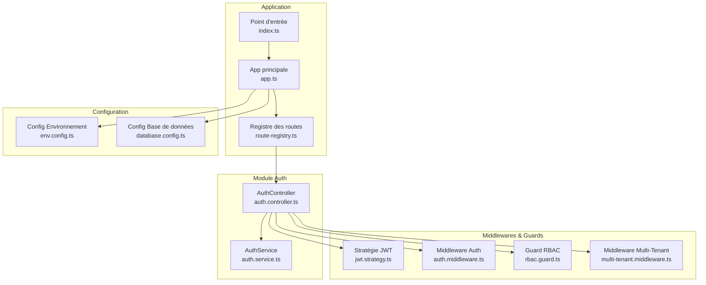
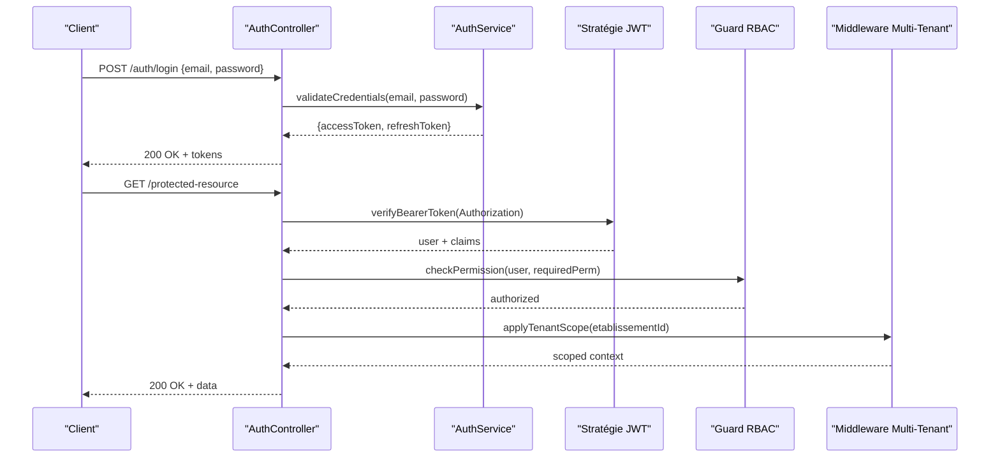
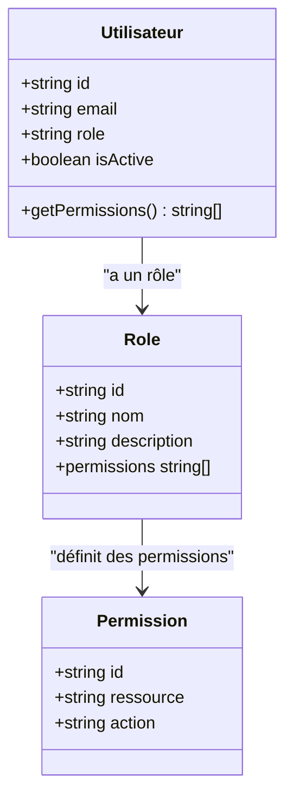
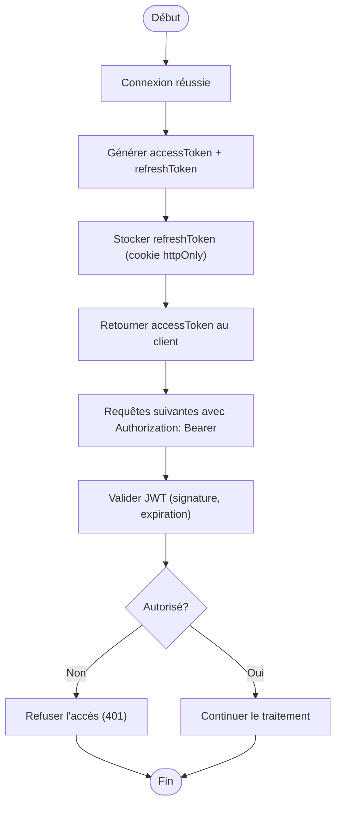
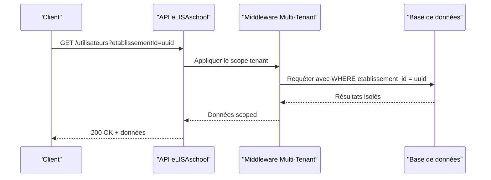
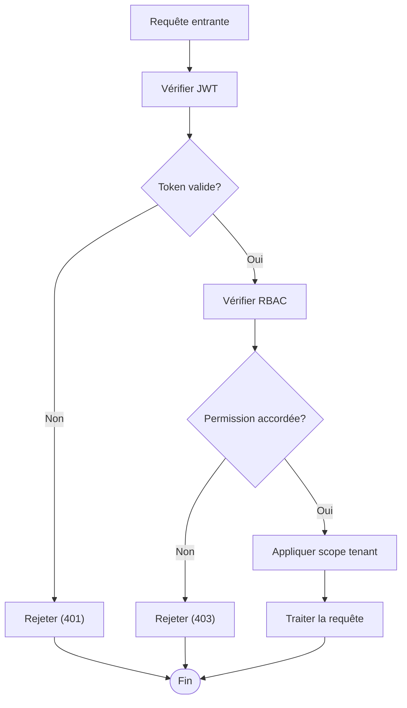
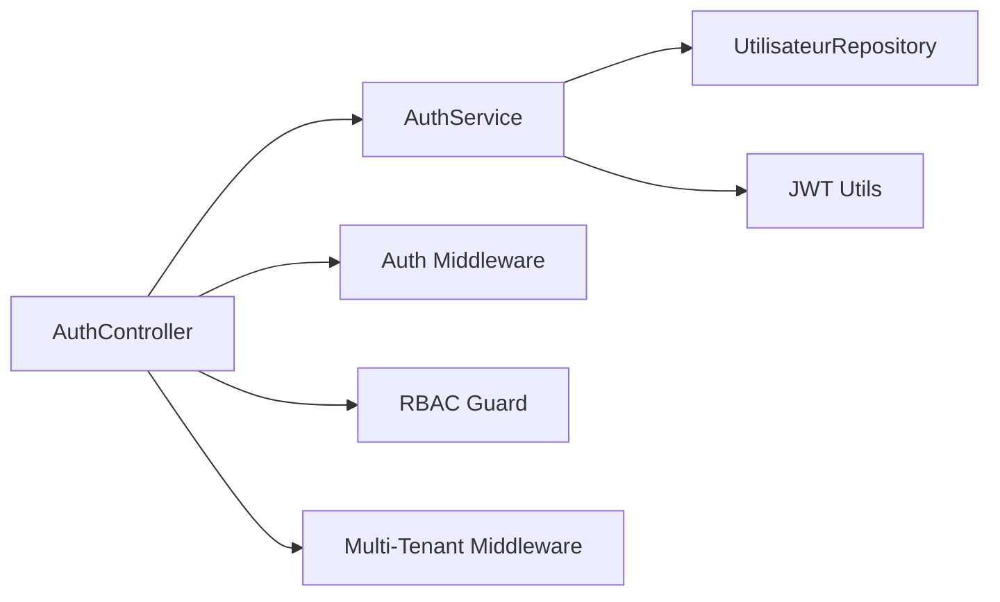

# API Authentification et Autorisation

<cite>
**Fichiers référencés dans ce document**
- [app.ts](file://backend/src/app.ts)
- [index.ts](file://backend/src/index.ts)
- [route-registry.ts](file://backend/src/routes/route-registry.ts)
- [auth.controller.ts](file://backend/src/modules/auth/controllers/auth.controller.ts)
- [auth.service.ts](file://backend/src/modules/auth/services/auth.service.ts)
- [jwt.strategy.ts](file://backend/src/common/middlewares/jwt.strategy.ts)
- [auth.middleware.ts](file://backend/src/common/middlewares/auth.middleware.ts)
- [rbac.guard.ts](file://backend/src/modules/rbac/guards/rbac.guard.ts)
- [multi-tenant.middleware.ts](file://backend/src/common/middlewares/multi-tenant.middleware.ts)
- [env.config.ts](file://backend/src/config/env.config.ts)
- [database.config.ts](file://backend/src/config/database.config.ts)
- [027-auth-multi-mode.sql](file://backend/database/migrations/027-auth-multi-mode.sql)
- [050-multi-tenant-v3-max-etablissements.sql](file://backend/database/migrations/050-multi-tenant-v3-max-etablissements.sql)
- [ANALYSE-ROUTE-LOGIN.md](file://docs/analyses/ANALYSE-ROUTE-LOGIN.md)
- [GUIDE-AUTHENTIFICATION.md](file://docs/guides/GUIDE-AUTHENTIFICATION.md)
- [RBAC_FINAL_SESSION.md](file://docs/resumes/RBAC_FINAL_SESSION.md)
- [IMPLÉMENTATION-MULTI-TENANT-V3-FINAL.md](file://docs/implementations/IMPLÉMENTATION-MULTI-TENANT-V3-FINAL.md)
</cite>

## Table des matières
1. [Introduction](#introduction)
2. [Structure du projet](#structure-du-projet)
3. [Composants clés](#composants-clés)
4. [Vue d'ensemble de l'architecture](#vue-densemble-de-larchitecture)
5. [Analyse détaillée des composants](#analyse-détaillée-des-composants)
6. [Analyse des dépendances](#analyse-des-dépendances)
7. [Considérations de performance](#considérations-de-performance)
8. [Guide de dépannage](#guide-de-dépannage)
9. [Conclusion](#conclusion)
10. [Annexes](#annexes)

## Introduction
Ce document présente la documentation complète de l’API d’authentification et d’autorisation d’eLISAschool. Il couvre les endpoints d’authentification (connexion, déconnexion, renouvellement de token), la gestion des utilisateurs, le modèle RBAC (rôles et permissions), le mécanisme JWT, le multi-tenant par établissement, ainsi que les middlewares d’authentification et d’autorisation. Des exemples concrets de requêtes HTTP, des schémas de données pour l’inscription, la connexion, la validation d’email et la réinitialisation de mot de passe sont fournis, accompagnés de stratégies de sécurité et de bonnes pratiques.

## Structure du projet
Le backend est structuré en modules NestJS avec une séparation claire entre contrôleurs, services, middlewares, guards et migrations. Les routes d’authentification sont centralisées dans le module auth, tandis que les middlewares communs (JWT, RBAC, multi-tenant) sont partagés dans common. La configuration d’environnement et de base de données est externalisée pour faciliter le déploiement.

**Sources du diagramme**
- [app.ts](file://backend/src/app.ts)
- [index.ts](file://backend/src/index.ts)
- [route-registry.ts](file://backend/src/routes/route-registry.ts)
- [auth.controller.ts](file://backend/src/modules/auth/controllers/auth.controller.ts)
- [auth.service.ts](file://backend/src/modules/auth/services/auth.service.ts)
- [jwt.strategy.ts](file://backend/src/common/middlewares/jwt.strategy.ts)
- [auth.middleware.ts](file://backend/src/common/middlewares/auth.middleware.ts)
- [rbac.guard.ts](file://backend/src/modules/rbac/guards/rbac.guard.ts)
- [multi-tenant.middleware.ts](file://backend/src/common/middlewares/multi-tenant.middleware.ts)
- [env.config.ts](file://backend/src/config/env.config.ts)
- [database.config.ts](file://backend/src/config/database.config.ts)

**Sources de section**
- [app.ts](file://backend/src/app.ts)
- [index.ts](file://backend/src/index.ts)
- [route-registry.ts](file://backend/src/routes/route-registry.ts)

## Composants clés
- Contrôleurs d’authentification : exposent les endpoints login, logout, refresh token, inscription, validation email, réinitialisation mot de passe.
- Services d’authentification : gèrent la logique métier, la génération/validation de tokens, la vérification des identifiants, la gestion des sessions.
- Stratégie JWT : valide les tokens Bearer, extrait les claims et injecte l’utilisateur dans la requête.
- Middleware d’authentification : s’assure que la requête est authentifiée avant d’atteindre le contrôleur.
- Guard RBAC : applique les permissions basées sur les rôles et les établissements.
- Middleware multi-tenant : scoping par établissement, isolation des données et contexte tenant.
- Configuration : variables d’environnement pour JWT, base de données, CORS, rate limiting.

**Sources de section**
- [auth.controller.ts](file://backend/src/modules/auth/controllers/auth.controller.ts)
- [auth.service.ts](file://backend/src/modules/auth/services/auth.service.ts)
- [jwt.strategy.ts](file://backend/src/common/middlewares/jwt.strategy.ts)
- [auth.middleware.ts](file://backend/src/common/middlewares/auth.middleware.ts)
- [rbac.guard.ts](file://backend/src/modules/rbac/guards/rbac.guard.ts)
- [multi-tenant.middleware.ts](file://backend/src/common/middlewares/multi-tenant.middleware.ts)
- [env.config.ts](file://backend/src/config/env.config.ts)
- [database.config.ts](file://backend/src/config/database.config.ts)

## Vue d'ensemble de l'architecture
L’architecture suit un pattern MVC avec des middlewares et guards transversaux. Le flux d’authentification commence par la soumission des identifiants au contrôleur, qui délègue au service pour valider et générer un JWT. Le client stocke le token et l’envoie via l’en-tête Authorization. Chaque requête protégée traverse le middleware d’authentification, puis le guard RBAC pour vérifier les permissions. Le middleware multi-tenant assure que toutes les opérations sont isolées par établissement.

**Sources du diagramme**
- [auth.controller.ts](file://backend/src/modules/auth/controllers/auth.controller.ts)
- [auth.service.ts](file://backend/src/modules/auth/services/auth.service.ts)
- [jwt.strategy.ts](file://backend/src/common/middlewares/jwt.strategy.ts)
- [rbac.guard.ts](file://backend/src/modules/rbac/guards/rbac.guard.ts)
- [multi-tenant.middleware.ts](file://backend/src/common/middlewares/multi-tenant.middleware.ts)

## Analyse détaillée des composants

### Endpoints d’authentification
- Connexion (login) : accepte email et mot de passe, retourne accessToken et refreshToken.
- Déconnexion (logout) : invalide le refreshToken et supprime la session.
- Renouvellement de token (refresh) : échange un refreshToken valide contre un nouvel accessToken.
- Inscription : crée un utilisateur avec email, mot de passe et rôle par défaut.
- Validation d’email : confirme l’adresse email via un lien ou code envoyé par email.
- Réinitialisation de mot de passe : envoie un lien sécurisé pour définir un nouveau mot de passe.

Exemples de requêtes HTTP :
- Connexion :
  - Méthode : POST
  - Chemin : /auth/login
  - Corps : { "email": "user@example.com", "password": "securePassword" }
  - Réponse : { "accessToken": "eyJ...", "refreshToken": "eyJ..." }
- Déconnexion :
  - Méthode : POST
  - Chemin : /auth/logout
  - En-tête : Authorization: Bearer <accessToken>
  - Réponse : { "message": "Déconnexion réussie" }
- Renouvellement de token :
  - Méthode : POST
  - Chemin : /auth/refresh
  - Corps : { "refreshToken": "eyJ..." }
  - Réponse : { "accessToken": "eyJ..." }

Gestion des erreurs courantes :
- 401 Unauthorized : identifiants invalides ou token expiré.
- 403 Forbidden : permission insuffisante ou rôle non autorisé.
- 400 Bad Request : corps de requête mal formé ou champs manquants.
- 429 Too Many Requests : trop de tentatives de connexion (rate limiting).

**Sources de section**
- [auth.controller.ts](file://backend/src/modules/auth/controllers/auth.controller.ts)
- [auth.service.ts](file://backend/src/modules/auth/services/auth.service.ts)
- [ANALYSE-ROUTE-LOGIN.md](file://docs/analyses/ANALYSE-ROUTE-LOGIN.md)

### Schémas de requête/réponse
- Inscription :
  - Requête : { "email": "user@example.com", "password": "securePassword", "role": "eleve" }
  - Réponse : { "userId": "uuid", "message": "Inscription réussie" }
- Connexion :
  - Requête : { "email": "user@example.com", "password": "securePassword" }
  - Réponse : { "accessToken": "string", "refreshToken": "string" }
- Validation d’email :
  - Requête : GET /auth/validate-email?token=string
  - Réponse : { "message": "Email validé" }
- Réinitialisation de mot de passe :
  - Requête : POST /auth/reset-password { "token": "string", "newPassword": "string" }
  - Réponse : { "message": "Mot de passe réinitialisé" }

**Sources de section**
- [auth.controller.ts](file://backend/src/modules/auth/controllers/auth.controller.ts)
- [auth.service.ts](file://backend/src/modules/auth/services/auth.service.ts)

### Gestion des utilisateurs
Les utilisateurs sont créés, mis à jour et supprimés via des endpoints dédiés. Les rôles et permissions sont attribués dynamiquement. L’API supporte la recherche, la pagination et le filtrage des utilisateurs.

**Sources de section**
- [auth.controller.ts](file://backend/src/modules/auth/controllers/auth.controller.ts)
- [auth.service.ts](file://backend/src/modules/auth/services/auth.service.ts)

### Rôles et permissions RBAC
Le système RBAC permet d’attribuer des rôles (admin, enseignant, eleve, parent) et des permissions granulaires (lecture, écriture, suppression). Les permissions sont vérifiées par le guard RBAC avant l’accès aux ressources.

**Sources du diagramme**
- [rbac.guard.ts](file://backend/src/modules/rbac/guards/rbac.guard.ts)
- [RBAC_FINAL_SESSION.md](file://docs/resumes/RBAC_FINAL_SESSION.md)

**Sources de section**
- [rbac.guard.ts](file://backend/src/modules/rbac/guards/rbac.guard.ts)
- [RBAC_FINAL_SESSION.md](file://docs/resumes/RBAC_FINAL_SESSION.md)

### Mécanisme JWT
Le JWT est utilisé pour l’authentification stateless. Le serveur signe un accessToken court (ex: 15 min) et un refreshToken long (ex: 7 jours). Le client stocke l’accessToken en mémoire et le refreshToken en cookie httpOnly. Le guard JWT valide le token et injecte l’utilisateur dans la requête.

**Sources du diagramme**
- [jwt.strategy.ts](file://backend/src/common/middlewares/jwt.strategy.ts)
- [auth.service.ts](file://backend/src/modules/auth/services/auth.service.ts)

**Sources de section**
- [jwt.strategy.ts](file://backend/src/common/middlewares/jwt.strategy.ts)
- [auth.service.ts](file://backend/src/modules/auth/services/auth.service.ts)

### Multi-tenant
Le multi-tenant est implémenté par établissement. Chaque requête doit inclure un contexte d’établissement (via header ou paramètre). Le middleware multi-tenant scope les requêtes et garantit l’isolation des données.

**Sources du diagramme**
- [multi-tenant.middleware.ts](file://backend/src/common/middlewares/multi-tenant.middleware.ts)
- [050-multi-tenant-v3-max-etablissements.sql](file://backend/database/migrations/050-multi-tenant-v3-max-etablissements.sql)

**Sources de section**
- [multi-tenant.middleware.ts](file://backend/src/common/middlewares/multi-tenant.middleware.ts)
- [050-multi-tenant-v3-max-etablissements.sql](file://backend/database/migrations/050-multi-tenant-v3-max-etablissements.sql)
- [IMPLÉMENTATION-MULTI-TENANT-V3-FINAL.md](file://docs/implementations/IMPLÉMENTATION-MULTI-TENANT-V3-FINAL.md)

### Middlewares d’authentification
- Middleware d’authentification : vérifie la présence et la validité du token JWT.
- Guard RBAC : vérifie les permissions de l’utilisateur pour la ressource demandée.
- Middleware multi-tenant : applique le contexte d’établissement.

**Sources du diagramme**
- [auth.middleware.ts](file://backend/src/common/middlewares/auth.middleware.ts)
- [jwt.strategy.ts](file://backend/src/common/middlewares/jwt.strategy.ts)
- [rbac.guard.ts](file://backend/src/modules/rbac/guards/rbac.guard.ts)
- [multi-tenant.middleware.ts](file://backend/src/common/middlewares/multi-tenant.middleware.ts)

**Sources de section**
- [auth.middleware.ts](file://backend/src/common/middlewares/auth.middleware.ts)
- [jwt.strategy.ts](file://backend/src/common/middlewares/jwt.strategy.ts)
- [rbac.guard.ts](file://backend/src/modules/rbac/guards/rbac.guard.ts)
- [multi-tenant.middleware.ts](file://backend/src/common/middlewares/multi-tenant.middleware.ts)

## Analyse des dépendances
Les composants sont faiblement couplés grâce à l’injection de dépendances de NestJS. Le contrôleur dépend du service, qui dépend des repositories et des utilitaires JWT. Les middlewares et guards sont indépendants et peuvent être appliqués de manière modulaire.

**Sources du diagramme**
- [auth.controller.ts](file://backend/src/modules/auth/controllers/auth.controller.ts)
- [auth.service.ts](file://backend/src/modules/auth/services/auth.service.ts)
- [auth.middleware.ts](file://backend/src/common/middlewares/auth.middleware.ts)
- [rbac.guard.ts](file://backend/src/modules/rbac/guards/rbac.guard.ts)
- [multi-tenant.middleware.ts](file://backend/src/common/middlewares/multi-tenant.middleware.ts)

**Sources de section**
- [auth.controller.ts](file://backend/src/modules/auth/controllers/auth.controller.ts)
- [auth.service.ts](file://backend/src/modules/auth/services/auth.service.ts)

## Considérations de performance
- Utilisation de Redis pour le stockage des refresh tokens et la limitation de taux.
- Indexation des colonnes fréquentes (email, etablissement_id) pour optimiser les requêtes.
- Pagination et filtrage côté serveur pour réduire la charge réseau.
- Cache des permissions par utilisateur et rôle pour éviter les accès répétés à la base de données.

[Pas de sources nécessaires car cette section fournit des conseils généraux]

## Guide de dépannage
Problèmes courants et solutions :
- Erreur 401 : Vérifier la validité du token JWT et son expiration. S’assurer que le header Authorization est correctement formaté.
- Erreur 403 : Vérifier les permissions RBAC et les rôles attribués. Confirmer que l’utilisateur a les droits nécessaires.
- Erreur 429 : Activer ou ajuster le rate limiting. Vérifier les logs pour identifier les abus.
- Problèmes multi-tenant : S’assurer que l’etablissementId est fourni et valide. Vérifier les scopes de requête.

**Sources de section**
- [auth.controller.ts](file://backend/src/modules/auth/controllers/auth.controller.ts)
- [auth.service.ts](file://backend/src/modules/auth/services/auth.service.ts)
- [GUIDE-AUTHENTIFICATION.md](file://docs/guides/GUIDE-AUTHENTIFICATION.md)

## Conclusion
L’API d’authentification et d’autorisation d’eLISAschool offre une solution robuste et évolutive basée sur JWT, RBAC et le multi-tenant. Elle permet une gestion fine des accès et une isolation des données par établissement. Les middlewares et guards assurent une sécurité cohérente à travers toutes les requêtes.

[Pas de sources nécessaires car cette section résume sans analyser de fichiers spécifiques]

## Annexes
- Migration d’authentification multi-mode : [027-auth-multi-mode.sql](file://backend/database/migrations/027-auth-multi-mode.sql)
- Configuration de l’environnement : [env.config.ts](file://backend/src/config/env.config.ts)
- Configuration de la base de données : [database.config.ts](file://backend/src/config/database.config.ts)

**Sources de section**
- [027-auth-multi-mode.sql](file://backend/database/migrations/027-auth-multi-mode.sql)
- [env.config.ts](file://backend/src/config/env.config.ts)
- [database.config.ts](file://backend/src/config/database.config.ts)