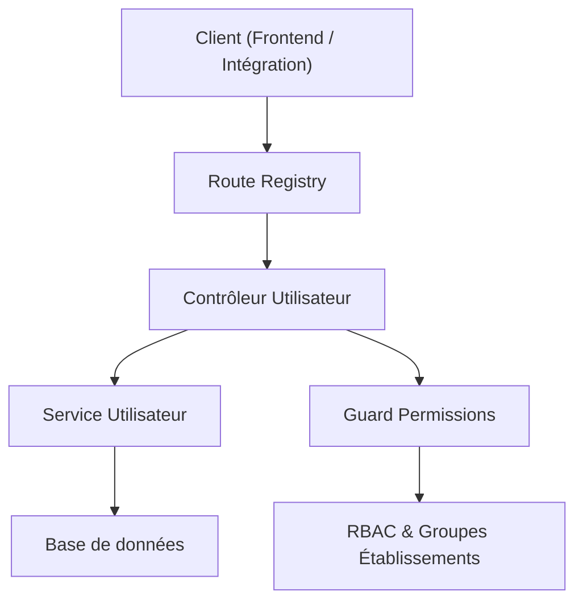
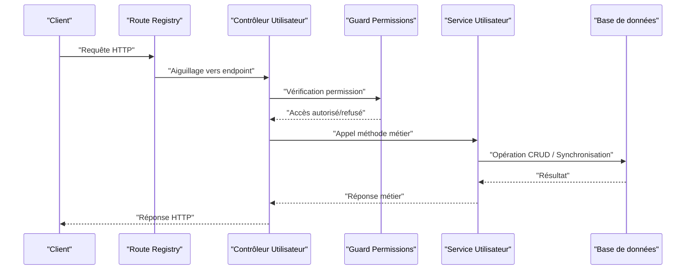
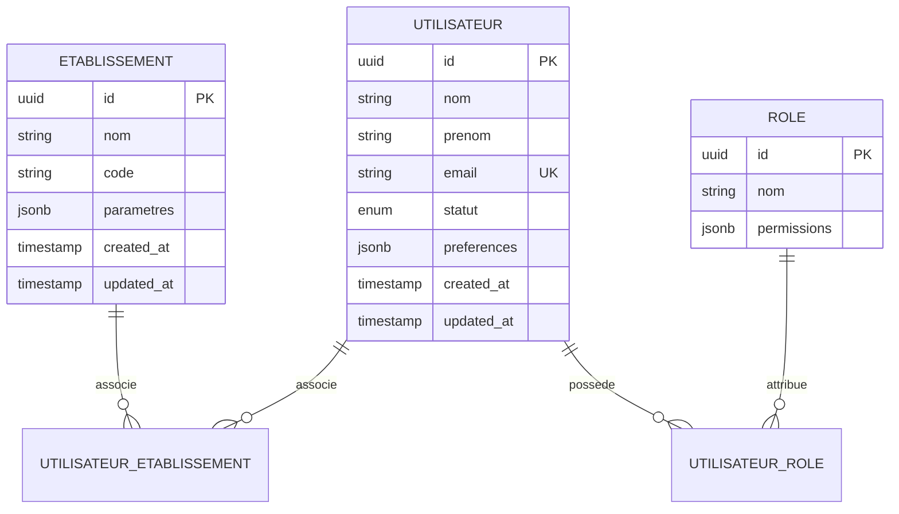
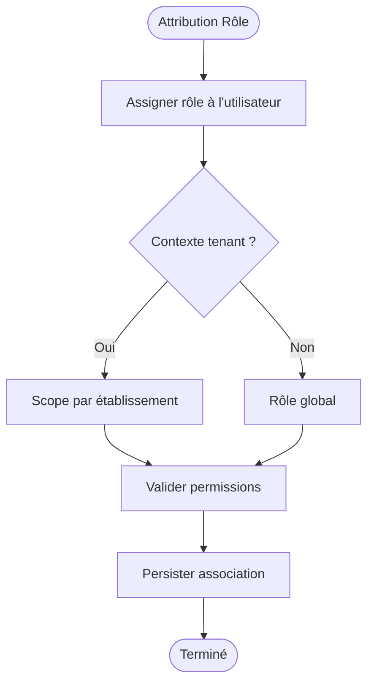
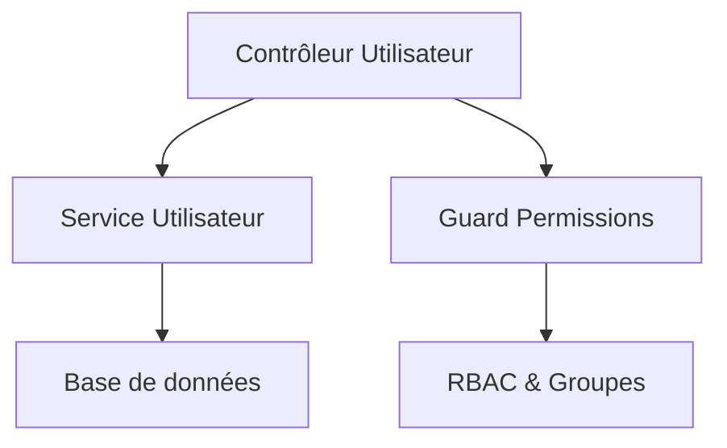

# API Gestion des Utilisateurs

<cite>
**Fichiers référencés dans ce document**
- [backend/src/modules/utilisateurs/controllers/utilisateur.controller.ts](file://backend/src/modules/utilisateurs/controllers/utilisateur.controller.ts)
- [backend/src/modules/utilisateurs/services/utilisateur.service.ts](file://backend/src/modules/utilisateurs/services/utilisateur.service.ts)
- [backend/src/modules/auth/guards/require-permission.guard.ts](file://backend/src/modules/auth/guards/require-permission.guard.ts)
- [backend/src/routes/route-registry.ts](file://backend/src/routes/route-registry.ts)
- [backend/database/migrations/079-add-roleId-utilisateur-etablissements.sql](file://backend/database/migrations/079-add-roleId-utilisateur-etablissements.sql)
- [backend/database/migrations/050-multi-tenant-v3-max-etablissements.sql](file://backend/database/migrations/050-multi-tenant-v3-max-etablissements.sql)
- [backend/database/migrations/080-preferences-utilisateur-multi-tenant.sql](file://backend/database/migrations/080-preferences-utilisateur-multi-tenant.sql)
- [backend/database/migrations/046-preferences-utilisateur-et-config.sql](file://backend/database/migrations/046-preferences-utilisateur-et-config.sql)
- [backend/database/migrations/021-module-personnel-rh-phase1.sql](file://backend/database/migrations/021-module-personnel-rh-phase1.sql)
- [backend/database/migrations/076-permissions-groupes-etablissements.sql](file://backend/database/migrations/076-permissions-groupes-etablissements.sql)
- [backend/database/migrations/077-update-permissions-groupes.sql](file://backend/database/migrations/077-update-permissions-groupes.sql)
- [backend/database/migrations/078-utilisateur-test-groupes.sql](file://backend/database/migrations/078-utilisateur-test-groupes.sql)
- [backend/database/migrations/079-correction-permissions-groupes.sql](file://backend/database/migrations/079-correction-permissions-groupes.sql)
- [backend/database/migrations/069-fix-super-admin-permissions.sql](file://backend/database/migrations/069-fix-super-admin-permissions.sql)
- [backend/database/migrations/070-fix-super-admin-all-permission.sql](file://backend/database/migrations/070-fix-super-admin-all-permission.sql)
- [backend/database/migrations/050-suppression-utilisateur-etablissementId.sql](file://backend/database/migrations/050-suppression-utilisateur-etablissementId.sql)
- [backend/test/integration/auth-multi-etablissement.spec.ts](file://backend/test/integration/auth-multi-etablissement.spec.ts)
- [backend/test/services/utilisateur-etablissement.service.test.ts](file://backend/test/services/utilisateur-etablissement.service.test.ts)
- [backend/test/services/utilisateurs.service.test.ts](file://backend/test/services/utilisateurs.service.test.ts)
- [backend/docs/pagination-guide.md](file://backend/docs/pagination-guide.md)
- [backend/scripts/test-endpoints-utilisateurs.sh](file://backend/scripts/test-endpoints-utilisateurs.sh)
</cite>

## Table des matières
1. [Introduction](#introduction)
2. [Structure du projet](#structure-du-projet)
3. [Composants principaux](#composants-principaux)
4. [Vue d'ensemble de l'architecture](#vue-densemble-de-larchitecture)
5. [Analyse détaillée des composants](#analyse-detallee-des-composants)
6. [Analyse des dépendances](#analyse-des-dependances)
7. [Considérations de performance](#considerations-de-performance)
8. [Guide de dépannage](#guide-de-depannage)
9. [Conclusion](#conclusion)
10. [Annexes](#annexes)

## Introduction
Ce document présente une documentation API complète pour la gestion des utilisateurs eLISAschool. Il couvre les opérations CRUD (GET, POST, PUT, DELETE), le modèle multi-tenant (utilisateurs et établissements), l’attribution des rôles et permissions, la gestion des profils utilisateurs, ainsi que les opérations en masse. Des exemples de requêtes et réponses JSON sont fournis, accompagnés d’une section dédiée à la gestion des erreurs spécifiques.

## Structure du projet
Le module Utilisateurs est organisé selon une architecture modulaire :
- Contrôleurs exposant les endpoints REST
- Services implémentant la logique métier
- Migrations définissant les schémas de données et relations
- Tests unitaires et d’intégration validant le comportement multi-tenant et RBAC
- Scripts de test et guides de pagination

**Sources de la section**
- [backend/src/modules/utilisateurs/controllers/utilisateur.controller.ts](file://backend/src/modules/utilisateurs/controllers/utilisateur.controller.ts)
- [backend/src/modules/utilisateurs/services/utilisateur.service.ts](file://backend/src/modules/utilisateurs/services/utilisateur.service.ts)
- [backend/src/routes/route-registry.ts](file://backend/src/routes/route-registry.ts)
- [backend/src/modules/auth/guards/require-permission.guard.ts](file://backend/src/modules/auth/guards/require-permission.guard.ts)

## Composants principaux
- Contrôleur Utilisateur : définit les endpoints GET, POST, PUT, DELETE et les opérations en masse.
- Service Utilisateur : orchestre les validations, la persistance, la synchronisation multi-établissements et les mises à jour de permissions.
- Guards et RBAC : appliquent les permissions par rôle et par groupe d’établissements.
- Migrations : structurent les tables utilisateurs, rôles, groupes d’établissements et préférences multi-tenant.

**Sources de la section**
- [backend/src/modules/utilisateurs/controllers/utilisateur.controller.ts](file://backend/src/modules/utilisateurs/controllers/utilisateur.controller.ts)
- [backend/src/modules/utilisateurs/services/utilisateur.service.ts](file://backend/src/modules/utilisateurs/services/utilisateur.service.ts)
- [backend/src/modules/auth/guards/require-permission.guard.ts](file://backend/src/modules/auth/guards/require-permission.guard.ts)
- [backend/database/migrations/079-add-roleId-utilisateur-etablissements.sql](file://backend/database/migrations/079-add-roleId-utilisateur-etablissements.sql)
- [backend/database/migrations/076-permissions-groupes-etablissements.sql](file://backend/database/migrations/076-permissions-groupes-etablissements.sql)
- [backend/database/migrations/077-update-permissions-groupes.sql](file://backend/database/migrations/077-update-permissions-groupes.sql)
- [backend/database/migrations/078-utilisateur-test-groupes.sql](file://backend/database/migrations/078-utilisateur-test-groupes.sql)
- [backend/database/migrations/079-correction-permissions-groupes.sql](file://backend/database/migrations/079-correction-permissions-groupes.sql)
- [backend/database/migrations/069-fix-super-admin-permissions.sql](file://backend/database/migrations/069-fix-super-admin-permissions.sql)
- [backend/database/migrations/070-fix-super-admin-all-permission.sql](file://backend/database/migrations/070-fix-super-admin-all-permission.sql)
- [backend/database/migrations/050-multi-tenant-v3-max-etablissements.sql](file://backend/database/migrations/050-multi-tenant-v3-max-etablissements.sql)
- [backend/database/migrations/080-preferences-utilisateur-multi-tenant.sql](file://backend/database/migrations/080-preferences-utilisateur-multi-tenant.sql)
- [backend/database/migrations/046-preferences-utilisateur-et-config.sql](file://backend/database/migrations/046-preferences-utilisateur-et-config.sql)
- [backend/database/migrations/021-module-personnel-rh-phase1.sql](file://backend/database/migrations/021-module-personnel-rh-phase1.sql)

## Vue d'ensemble de l'architecture
Le flux typique d’une requête utilisateur passe par le registre de routes, un contrôleur qui délègue au service, puis à la base de données. Les guards vérifient les permissions avant d’exécuter les actions sensibles.

**Sources du diagramme**
- [backend/src/routes/route-registry.ts](file://backend/src/routes/route-registry.ts)
- [backend/src/modules/utilisateurs/controllers/utilisateur.controller.ts](file://backend/src/modules/utilisateurs/controllers/utilisateur.controller.ts)
- [backend/src/modules/auth/guards/require-permission.guard.ts](file://backend/src/modules/auth/guards/require-permission.guard.ts)
- [backend/src/modules/utilisateurs/services/utilisateur.service.ts](file://backend/src/modules/utilisateurs/services/utilisateur.service.ts)

## Analyse détaillée des composants

### Endpoints CRUD Utilisateurs
- GET /api/utilisateurs : liste paginée des utilisateurs avec filtres multi-tenant.
- POST /api/utilisateurs : création d’un utilisateur avec attribution de rôle et établissement(s).
- PUT /api/utilisateurs/:id : mise à jour du profil, des permissions et des préférences.
- DELETE /api/utilisateurs/:id : suppression ou désactivation du compte (soft delete).

Schémas de données attendus (extraits) :
- Utilisateur : identifiant, nom, prénom, email, statut, préférences, rôles, établissements associés.
- Rôle : identifiant, nom, permissions associées.
- Établissement : identifiant, nom, contexte tenant.
- Préférences : langue, thème, paramètres locaux.

Exemples de requêtes et réponses JSON :
- Création d’utilisateur :
  - Requête : { "nom": "Dupont", "prenom": "Jean", "email": "jean.dupont@exemple.com", "role": "enseignant", "etablissements": ["etab_1", "etab_2"], "preferences": { "langue": "fr", "theme": "clair" } }
  - Réponse : { "id": "u_123", "nom": "Dupont", "prenom": "Jean", "email": "jean.dupont@exemple.com", "statut": "actif", "rôle": "enseignant", "etablissements": ["etab_1", "etab_2"], "preferences": { "langue": "fr", "theme": "clair" }, "dateCreation": "2026-06-21T10:00:00Z" }
- Mise à jour des permissions :
  - Requête : { "permissions": ["gestion_eleves", "notes_saisie"] }
  - Réponse : { "id": "u_123", "permissions": ["gestion_eleves", "notes_saisie"], "misAJour": true }
- Désactivation de compte :
  - Requête : { "action": "desactiver" }
  - Réponse : { "id": "u_123", "statut": "desactive", "message": "Compte désactivé avec succès" }
- Synchronisation multi-établissements :
  - Requête : { "synchroniser": true, "etablissements": ["etab_1", "etab_2"] }
  - Réponse : { "id": "u_123", "synchronise": true, "etablissements": ["etab_1", "etab_2"], "message": "Synchronisation terminée" }

Gestion des erreurs courantes :
- 400 Erreur de validation : champs manquants ou invalides.
- 401 Non authentifié : token invalide ou expiré.
- 403 Accès refusé : permission insuffisante.
- 404 Non trouvé : utilisateur inexistant.
- 409 Conflit : email déjà utilisé ou conflit de rôle.
- 500 Erreur serveur : problème interne.

**Sources de la section**
- [backend/src/modules/utilisateurs/controllers/utilisateur.controller.ts](file://backend/src/modules/utilisateurs/controllers/utilisateur.controller.ts)
- [backend/src/modules/utilisateurs/services/utilisateur.service.ts](file://backend/src/modules/utilisateurs/services/utilisateur.service.ts)
- [backend/test/services/utilisateurs.service.test.ts](file://backend/test/services/utilisateurs.service.test.ts)
- [backend/scripts/test-endpoints-utilisateurs.sh](file://backend/scripts/test-endpoints-utilisateurs.sh)

### Relation Utilisateurs et Établissements (Multi-Tenant)
- Chaque utilisateur peut être associé à plusieurs établissements via une relation many-to-many.
- Le contexte tenant est appliqué sur toutes les requêtes pour isoler les données.
- Les migrations ajoutent des contraintes et index pour garantir l’intégrité et la performance.

**Sources du diagramme**
- [backend/database/migrations/050-multi-tenant-v3-max-etablissements.sql](file://backend/database/migrations/050-multi-tenant-v3-max-etablissements.sql)
- [backend/database/migrations/079-add-roleId-utilisateur-etablissements.sql](file://backend/database/migrations/079-add-roleId-utilisateur-etablissements.sql)
- [backend/database/migrations/080-preferences-utilisateur-multi-tenant.sql](file://backend/database/migrations/080-preferences-utilisateur-multi-tenant.sql)
- [backend/database/migrations/046-preferences-utilisateur-et-config.sql](file://backend/database/migrations/046-preferences-utilisateur-et-config.sql)
- [backend/database/migrations/021-module-personnel-rh-phase1.sql](file://backend/database/migrations/021-module-personnel-rh-phase1.sql)

**Sources de la section**
- [backend/database/migrations/050-multi-tenant-v3-max-etablissements.sql](file://backend/database/migrations/050-multi-tenant-v3-max-etablissements.sql)
- [backend/database/migrations/079-add-roleId-utilisateur-etablissements.sql](file://backend/database/migrations/079-add-roleId-utilisateur-etablissements.sql)
- [backend/database/migrations/080-preferences-utilisateur-multi-tenant.sql](file://backend/database/migrations/080-preferences-utilisateur-multi-tenant.sql)
- [backend/database/migrations/046-preferences-utilisateur-et-config.sql](file://backend/database/migrations/046-preferences-utilisateur-et-config.sql)
- [backend/database/migrations/021-module-personnel-rh-phase1.sql](file://backend/database/migrations/021-module-personnel-rh-phase1.sql)

### Attribution des rôles et permissions
- Les rôles sont attribués aux utilisateurs et peuvent varier par établissement.
- Les permissions sont gérées via des groupes et des règles RBAC.
- Des corrections et mises à jour de permissions existent pour garantir la cohérence.

**Sources du diagramme**
- [backend/database/migrations/076-permissions-groupes-etablissements.sql](file://backend/database/migrations/076-permissions-groupes-etablissements.sql)
- [backend/database/migrations/077-update-permissions-groupes.sql](file://backend/database/migrations/077-update-permissions-groupes.sql)
- [backend/database/migrations/078-utilisateur-test-groupes.sql](file://backend/database/migrations/078-utilisateur-test-groupes.sql)
- [backend/database/migrations/079-correction-permissions-groupes.sql](file://backend/database/migrations/079-correction-permissions-groupes.sql)
- [backend/database/migrations/069-fix-super-admin-permissions.sql](file://backend/database/migrations/069-fix-super-admin-permissions.sql)
- [backend/database/migrations/070-fix-super-admin-all-permission.sql](file://backend/database/migrations/070-fix-super-admin-all-permission.sql)

**Sources de la section**
- [backend/database/migrations/076-permissions-groupes-etablissements.sql](file://backend/database/migrations/076-permissions-groupes-etablissements.sql)
- [backend/database/migrations/077-update-permissions-groupes.sql](file://backend/database/migrations/077-update-permissions-groupes.sql)
- [backend/database/migrations/078-utilisateur-test-groupes.sql](file://backend/database/migrations/078-utilisateur-test-groupes.sql)
- [backend/database/migrations/079-correction-permissions-groupes.sql](file://backend/database/migrations/079-correction-permissions-groupes.sql)
- [backend/database/migrations/069-fix-super-admin-permissions.sql](file://backend/database/migrations/069-fix-super-admin-permissions.sql)
- [backend/database/migrations/070-fix-super-admin-all-permission.sql](file://backend/database/migrations/070-fix-super-admin-all-permission.sql)

### Gestion des profils utilisateurs
- Les préférences utilisateur incluent langue, thème et paramètres locaux.
- Les préférences sont multi-tenant et peuvent être personnalisées par établissement.
- Les migrations assurent la cohérence et l’unicité des configurations.

**Sources de la section**
- [backend/database/migrations/080-preferences-utilisateur-multi-tenant.sql](file://backend/database/migrations/080-preferences-utilisateur-multi-tenant.sql)
- [backend/database/migrations/046-preferences-utilisateur-et-config.sql](file://backend/database/migrations/046-preferences-utilisateur-et-config.sql)

### Opérations en masse
- Import/export d’utilisateurs en batch.
- Mise à jour groupée de permissions et rôles.
- Synchronisation multi-établissements pour propager les changements.

**Sources de la section**
- [backend/src/modules/utilisateurs/controllers/utilisateur.controller.ts](file://backend/src/modules/utilisateurs/controllers/utilisateur.controller.ts)
- [backend/src/modules/utilisateurs/services/utilisateur.service.ts](file://backend/src/modules/utilisateurs/services/utilisateur.service.ts)
- [backend/test/services/utilisateur-etablissement.service.test.ts](file://backend/test/services/utilisateur-etablissement.service.test.ts)

## Analyse des dépendances
Les composants interagissent selon les dépendances suivantes :
- Le contrôleur dépend du service et du guard.
- Le service dépend de la base de données et des modules RBAC.
- Les guards dépendent du système de permissions et des groupes d’établissements.

**Sources du diagramme**
- [backend/src/modules/utilisateurs/controllers/utilisateur.controller.ts](file://backend/src/modules/utilisateurs/controllers/utilisateur.controller.ts)
- [backend/src/modules/utilisateurs/services/utilisateur.service.ts](file://backend/src/modules/utilisateurs/services/utilisateur.service.ts)
- [backend/src/modules/auth/guards/require-permission.guard.ts](file://backend/src/modules/auth/guards/require-permission.guard.ts)

**Sources de la section**
- [backend/src/modules/utilisateurs/controllers/utilisateur.controller.ts](file://backend/src/modules/utilisateurs/controllers/utilisateur.controller.ts)
- [backend/src/modules/utilisateurs/services/utilisateur.service.ts](file://backend/src/modules/utilisateurs/services/utilisateur.service.ts)
- [backend/src/modules/auth/guards/require-permission.guard.ts](file://backend/src/modules/auth/guards/require-permission.guard.ts)

## Considérations de performance
- Pagination : utilisez les paramètres de pagination pour limiter les résultats.
- Indexation : les migrations ajoutent des index pour optimiser les requêtes fréquentes.
- Cache : envisagez de mettre en cache les listes d’utilisateurs si la charge est élevée.

**Sources de la section**
- [backend/docs/pagination-guide.md](file://backend/docs/pagination-guide.md)
- [backend/database/migrations/009-performance-indexes.sql](file://backend/database/migrations/009-performance-indexes.sql)

## Guide de dépannage
- Vérifiez les logs d’erreurs pour les codes 4xx/5xx.
- Utilisez les scripts de test pour valider les endpoints.
- Consultez les tests d’intégration pour comprendre les comportements multi-tenant.

**Sources de la section**
- [backend/scripts/test-endpoints-utilisateurs.sh](file://backend/scripts/test-endpoints-utilisateurs.sh)
- [backend/test/integration/auth-multi-etablissement.spec.ts](file://backend/test/integration/auth-multi-etablissement.spec.ts)
- [backend/test/services/utilisateur-etablissement.service.test.ts](file://backend/test/services/utilisateur-etablissement.service.test.ts)
- [backend/test/services/utilisateurs.service.test.ts](file://backend/test/services/utilisateurs.service.test.ts)

## Conclusion
Cette documentation fournit une vue complète de l’API de gestion des utilisateurs eLISAschool, incluant les opérations CRUD, le modèle multi-tenant, l’attribution des rôles et permissions, ainsi que les opérations en masse. Elle permet aux développeurs et intégrateurs de comprendre et d’utiliser efficacement les endpoints, tout en garantissant la sécurité et la performance.

## Annexes
- Exemples complets de requêtes et réponses JSON disponibles dans les sections ci-dessus.
- Guides de migration et de déploiement pour assurer la cohérence des schémas.

[No sources needed since this section summarizes without analyzing specific files]