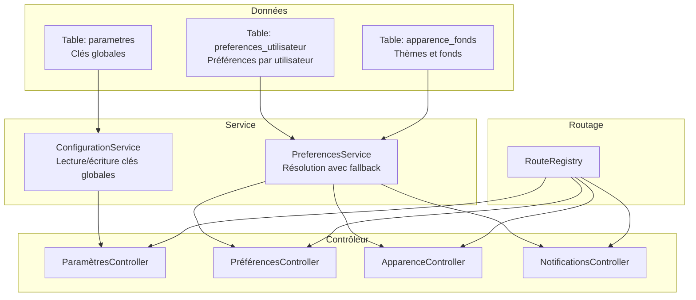
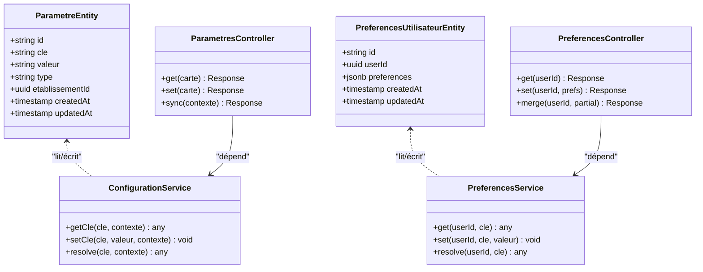
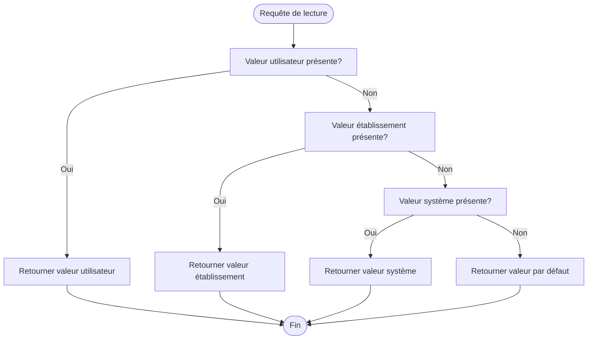
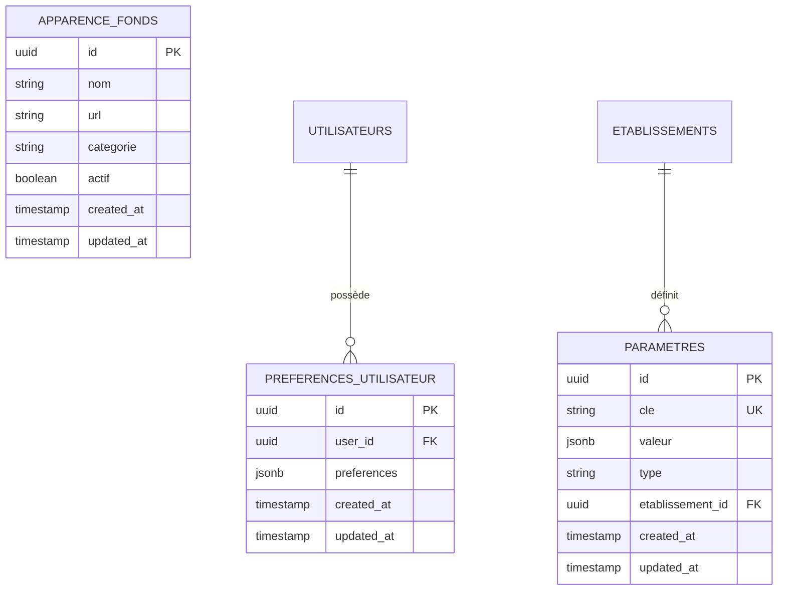
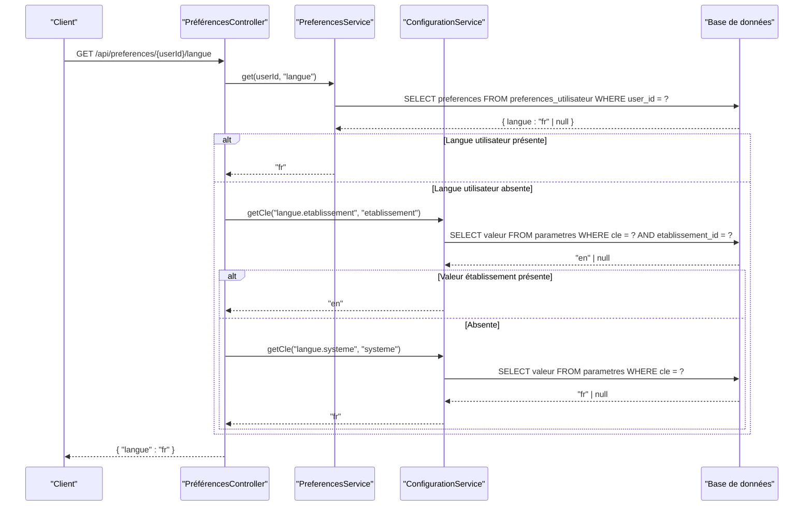
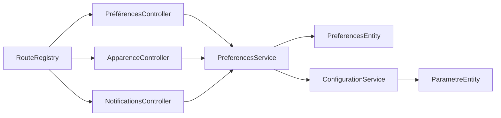

# API Préférences et Configurations

<cite>
**Fichiers référencés dans ce document**
- [046-preferences-utilisateur-et-config.sql](file://backend/database/migrations/046-preferences-utilisateur-et-config.sql)
- [080-preferences-utilisateur-multi-tenant.sql](file://backend/database/migrations/080-preferences-utilisateur-multi-tenant.sql)
- [081-module-apparence-fonds.sql](file://backend/database/migrations/081-module-apparence-fonds.sql)
- [082-fix-contrainte-unique-preferences.sql](file://backend/database/migrations/082-fix-contrainte-unique-preferences.sql)
- [083-fix-contrainte-unique-parametres.sql](file://backend/database/migrations/083-fix-contrainte-unique-parametres.sql)
- [route-registry.ts](file://backend/src/routes/route-registry.ts)
- [app.ts](file://backend/src/app.ts)
- [index.ts](file://backend/src/index.ts)
- [configuration.service.ts](file://backend/src/modules/configuration/services/configuration.service.ts)
- [preferences.controller.ts](file://backend/src/modules/preferences/controllers/preferences.controller.ts)
- [preferences.service.ts](file://backend/src/modules/preferences/services/preferences.service.ts)
- [preferences.entity.ts](file://backend/src/modules/preferences/entities/preferences.entity.ts)
- [parametre.entity.ts](file://backend/src/modules/configuration/entities/parametre.entity.ts)
- [apparence.controller.ts](file://backend/src/modules/apparence/controllers/apparence.controller.ts)
- [notifications.controller.ts](file://backend/src/modules/notifications/controllers/notifications.controller.ts)
- [AMÉLIORATIONS-CONFIG-PREFERENCES-V3.0.md](file://docs/AMÉLIORATIONS-CONFIG-PREFERENCES-V3.0.md)
- [GUIDE-VERIFICATION-PREFERENCES-V3.0.md](file://docs/GUIDE-VERIFICATION-PREFERENCES-V3.0.md)
</cite>

## Table des matières
1. [Introduction](#introduction)
2. [Structure du projet](#structure-du-projet)
3. [Composants principaux](#composants-principaux)
4. [Vue d'ensemble de l'architecture](#vue-densemble-de-larchitecture)
5. [Analyse détaillée des composants](#analyse-détaillée-des-composants)
6. [Analyse des dépendances](#analyse-des-dépendances)
7. [Considérations de performance](#considérations-de-performance)
8. [Guide de dépannage](#guide-de-dépannage)
9. [Conclusion](#conclusion)
10. [Annexes](#annexes)

## Introduction
Ce document présente l’API de gestion des préférences utilisateur et des configurations globales eLISAschool. Il couvre les endpoints pour le thème, la langue, les notifications, ainsi que les paramètres système et établissement. Il explique la hiérarchie des préférences (système → établissement → utilisateur), les types de configurations supportés, les mécanismes de fallback, et fournit des exemples de requêtes pour définir, lire et synchroniser les paramètres entre niveaux.

## Structure du projet
Le module de préférences et configurations est structuré en plusieurs couches :
- Couche données : entités et migrations définissant les tables et contraintes.
- Couche service : logique métier pour la lecture/écriture et la résolution de valeurs avec fallback.
- Couche contrôleur : exposition des endpoints REST.
- Couche routage : enregistrement et composition des routes.

**Sources du diagramme**
- [046-preferences-utilisateur-et-config.sql](file://backend/database/migrations/046-preferences-utilisateur-et-config.sql)
- [080-preferences-utilisateur-multi-tenant.sql](file://backend/database/migrations/080-preferences-utilisateur-multi-tenant.sql)
- [081-module-apparence-fonds.sql](file://backend/database/migrations/081-module-apparence-fonds.sql)
- [configuration.service.ts](file://backend/src/modules/configuration/services/configuration.service.ts)
- [preferences.service.ts](file://backend/src/modules/preferences/services/preferences.service.ts)
- [preferences.controller.ts](file://backend/src/modules/preferences/controllers/preferences.controller.ts)
- [apparence.controller.ts](file://backend/src/modules/apparence/controllers/apparence.controller.ts)
- [notifications.controller.ts](file://backend/src/modules/notifications/controllers/notifications.controller.ts)
- [route-registry.ts](file://backend/src/routes/route-registry.ts)

**Sources de section**
- [route-registry.ts](file://backend/src/routes/route-registry.ts)
- [app.ts](file://backend/src/app.ts)
- [index.ts](file://backend/src/index.ts)

## Composants principaux
- Paramètres globaux (système et établissement) : stockage de clés/valeurs structurées, typées et scoping tenant.
- Préférences utilisateur : thème, langue, notifications, et autres options personnelles.
- Apparence : gestion des thèmes et fonds d’écran.
- Notifications : configuration des canaux et règles de notification.

**Sources de section**
- [preferences.entity.ts](file://backend/src/modules/preferences/entities/preferences.entity.ts)
- [parametre.entity.ts](file://backend/src/modules/configuration/entities/parametre.entity.ts)
- [preferences.service.ts](file://backend/src/modules/preferences/services/preferences.service.ts)
- [configuration.service.ts](file://backend/src/modules/configuration/services/configuration.service.ts)

## Vue d'ensemble de l'architecture
L’API suit une architecture modulaire NestJS :
- Les contrôleurs exposent des endpoints REST.
- Les services implémentent la logique de persistance et de résolution de valeurs.
- Les entités mappent aux tables de base de données.
- Le routeur centralise l’enregistrement des routes.

**Sources du diagramme**
- [parametre.entity.ts](file://backend/src/modules/configuration/entities/parametre.entity.ts)
- [preferences.entity.ts](file://backend/src/modules/preferences/entities/preferences.entity.ts)
- [configuration.service.ts](file://backend/src/modules/configuration/services/configuration.service.ts)
- [preferences.service.ts](file://backend/src/modules/preferences/services/preferences.service.ts)
- [preferences.controller.ts](file://backend/src/modules/preferences/controllers/preferences.controller.ts)

## Analyse détaillée des composants

### Hiérarchie et mécanisme de fallback
La résolution des préférences suit un ordre précis :
1. Préférence utilisateur explicite (si présente).
2. Paramètre établissement (si présent).
3. Paramètre système (valeur par défaut).

**Sources du diagramme**
- [preferences.service.ts](file://backend/src/modules/preferences/services/preferences.service.ts)
- [configuration.service.ts](file://backend/src/modules/configuration/services/configuration.service.ts)

**Sources de section**
- [preferences.service.ts](file://backend/src/modules/preferences/services/preferences.service.ts)
- [configuration.service.ts](file://backend/src/modules/configuration/services/configuration.service.ts)

### Types de configurations supportés
Les clés de configuration sont typées pour garantir la cohérence :
- Booléen : activation/désactivation de fonctionnalités.
- Chaîne : langues, thèmes, identifiants.
- Nombre : seuils, intervalles.
- Objet JSON : structures complexes (ex. notifications).
- Tableau : listes de valeurs (ex. modules actifs).

Ces types sont appliqués lors de la validation et de la sérialisation des valeurs.

**Sources de section**
- [parametre.entity.ts](file://backend/src/modules/configuration/entities/parametre.entity.ts)
- [preferences.entity.ts](file://backend/src/modules/preferences/entities/preferences.entity.ts)

### Gestion des préférences utilisateur
Endpoints recommandés :
- GET /api/preferences/:userId : lire les préférences complètes.
- PATCH /api/preferences/:userId : fusionner des préférences partielles.
- PUT /api/preferences/:userId : écraser les préférences utilisateur.
- GET /api/preferences/:userId/theme : lire le thème.
- PATCH /api/preferences/:userId/theme : définir le thème.
- GET /api/preferences/:userId/langue : lire la langue.
- PATCH /api/preferences/:userId/langue : définir la langue.
- GET /api/preferences/:userId/notifications : lire les notifications.
- PATCH /api/preferences/:userId/notifications : mettre à jour les notifications.

Exemples de requêtes :
- Définir le thème utilisateur :
  - PATCH /api/preferences/{userId}
  - Corps : { "theme": "sombre" }
- Lire la langue effective (avec fallback) :
  - GET /api/preferences/{userId}/langue
- Synchroniser les préférences (fusionner avec les valeurs établissement/système) :
  - POST /api/preferences/{userId}/sync

**Sources de section**
- [preferences.controller.ts](file://backend/src/modules/preferences/controllers/preferences.controller.ts)
- [preferences.service.ts](file://backend/src/modules/preferences/services/preferences.service.ts)

### Gestion des paramètres globaux (système et établissement)
Endpoints recommandés :
- GET /api/config/parametres?cle=...&contexte=systeme|etablissement
- PUT /api/config/parametres : créer ou mettre à jour une clé globale.
- DELETE /api/config/parametres?cle=...&contexte=... : supprimer une clé.
- GET /api/config/parametres/resoudre?cle=...&contexte=...&userId=... : résoudre avec fallback.

Exemples de requêtes :
- Activer un module au niveau établissement :
  - PUT /api/config/parametres
  - Corps : { "cle": "modules.actifs", "valeur": ["finances","messagerie"], "type": "tableau", "contexte": "etablissement" }
- Lire la langue par défaut du système :
  - GET /api/config/parametres?cle=langue.par_defaut&contexte=systeme
- Résoudre la langue effective pour un utilisateur :
  - GET /api/config/parametres/resoudre?cle=langue.effective&contexte=systeme&userId={userId}

**Sources de section**
- [configuration.service.ts](file://backend/src/modules/configuration/services/configuration.service.ts)
- [parametre.entity.ts](file://backend/src/modules/configuration/entities/parametre.entity.ts)

### Apparence et thèmes
Endpoints recommandés :
- GET /api/apparence/themes : liste des thèmes disponibles.
- GET /api/apparence/fonds : catalogue des fonds d’écran.
- PATCH /api/preferences/:userId/theme : appliquer un thème.

Exemples de requêtes :
- Obtenir les thèmes :
  - GET /api/apparence/themes
- Appliquer un thème sombre :
  - PATCH /api/preferences/{userId}/theme
  - Corps : { "theme": "sombre" }

**Sources de section**
- [apparence.controller.ts](file://backend/src/modules/apparence/controllers/apparence.controller.ts)
- [081-module-apparence-fonds.sql](file://backend/database/migrations/081-module-apparence-fonds.sql)

### Notifications
Endpoints recommandés :
- GET /api/notifications/config : lire la configuration globale.
- PATCH /api/notifications/config : modifier la configuration globale.
- GET /api/preferences/:userId/notifications : lire les préférences utilisateur.
- PATCH /api/preferences/:userId/notifications : personnaliser les notifications.

Exemples de requêtes :
- Activer les emails pour un utilisateur :
  - PATCH /api/preferences/{userId}/notifications
  - Corps : { "canaux": { "email": true }, "regles": { "nouvelles_notes": true } }
- Lire la configuration globale des notifications :
  - GET /api/notifications/config

**Sources de section**
- [notifications.controller.ts](file://backend/src/modules/notifications/controllers/notifications.controller.ts)
- [preferences.service.ts](file://backend/src/modules/preferences/services/preferences.service.ts)

### Schéma de données

**Sources du diagramme**
- [046-preferences-utilisateur-et-config.sql](file://backend/database/migrations/046-preferences-utilisateur-et-config.sql)
- [080-preferences-utilisateur-multi-tenant.sql](file://backend/database/migrations/080-preferences-utilisateur-multi-tenant.sql)
- [081-module-apparence-fonds.sql](file://backend/database/migrations/081-module-apparence-fonds.sql)

**Sources de section**
- [046-preferences-utilisateur-et-config.sql](file://backend/database/migrations/046-preferences-utilisateur-et-config.sql)
- [080-preferences-utilisateur-multi-tenant.sql](file://backend/database/migrations/080-preferences-utilisateur-multi-tenant.sql)
- [081-module-apparence-fonds.sql](file://backend/database/migrations/081-module-apparence-fonds.sql)

### Séquence de résolution de préférences

**Sources du diagramme**
- [preferences.controller.ts](file://backend/src/modules/preferences/controllers/preferences.controller.ts)
- [preferences.service.ts](file://backend/src/modules/preferences/services/preferences.service.ts)
- [configuration.service.ts](file://backend/src/modules/configuration/services/configuration.service.ts)

## Analyse des dépendances
- Les contrôleurs dépendent des services correspondants.
- Les services dépendent des entités et des accès base de données.
- Le routeur centralise l’enregistrement des routes et assure la composition des modules.

**Sources du diagramme**
- [route-registry.ts](file://backend/src/routes/route-registry.ts)
- [preferences.controller.ts](file://backend/src/modules/preferences/controllers/preferences.controller.ts)
- [apparence.controller.ts](file://backend/src/modules/apparence/controllers/apparence.controller.ts)
- [notifications.controller.ts](file://backend/src/modules/notifications/controllers/notifications.controller.ts)
- [preferences.service.ts](file://backend/src/modules/preferences/services/preferences.service.ts)
- [configuration.service.ts](file://backend/src/modules/configuration/services/configuration.service.ts)
- [preferences.entity.ts](file://backend/src/modules/preferences/entities/preferences.entity.ts)
- [parametre.entity.ts](file://backend/src/modules/configuration/entities/parametre.entity.ts)

**Sources de section**
- [route-registry.ts](file://backend/src/routes/route-registry.ts)

## Considérations de performance
- Indexation des clés de configuration pour accélérer les recherches par cle et contexte.
- Mise en cache des résolutions fréquentes (langue, thème) côté serveur si nécessaire.
- Limitation des payloads JSON pour éviter les surcharges.
- Validation stricte des types pour réduire les erreurs de traitement.

[Pas de sources nécessaires car cette section fournit des conseils généraux]

## Guide de dépannage
Problèmes courants :
- Erreur 404 sur les routes de préférences : vérifier l’enregistrement des routes dans le routeur.
- Erreur 400 sur la mise à jour de paramètres : valider le type de la clé et la structure JSON.
- Fallback inattendu : s’assurer que les clés établissement/système existent et sont bien typées.
- Contraintes uniques : corriger les doublons de cle ou userId via les scripts de correction.

Actions recommandées :
- Vérifier les migrations 082 et 083 pour les corrections de contraintes uniques.
- Utiliser les guides de vérification des préférences v3.0 pour valider l’intégrité.

**Sources de section**
- [082-fix-contrainte-unique-preferences.sql](file://backend/database/migrations/082-fix-contrainte-unique-preferences.sql)
- [083-fix-contrainte-unique-parametres.sql](file://backend/database/migrations/083-fix-contrainte-unique-parametres.sql)
- [GUIDE-VERIFICATION-PREFERENCES-V3.0.md](file://docs/GUIDE-VERIFICATION-PREFERENCES-V3.0.md)

## Conclusion
L’API eLISAschool offre un système robuste de préférences et configurations avec une hiérarchie claire et un mécanisme de fallback fiable. Elle permet de gérer finement les préférences utilisateur tout en conservant des paramètres globaux cohérents pour le système et l’établissement. La modularité et la typologie des clés garantissent maintenabilité et évolutivité.

[Pas de sources nécessaires car cette section résume sans analyser de fichiers spécifiques]

## Annexes
- Documentation d’améliorations et vérifications :
  - [AMÉLIORATIONS-CONFIG-PREFERENCES-V3.0.md](file://docs/AMÉLIORATIONS-CONFIG-PREFERENCES-V3.0.md)
  - [GUIDE-VERIFICATION-PREFERENCES-V3.0.md](file://docs/GUIDE-VERIFICATION-PREFERENCES-V3.0.md)

**Sources de section**
- [AMÉLIORATIONS-CONFIG-PREFERENCES-V3.0.md](file://docs/AMÉLIORATIONS-CONFIG-PREFERENCES-V3.0.md)
- [GUIDE-VERIFICATION-PREFERENCES-V3.0.md](file://docs/GUIDE-VERIFICATION-PREFERENCES-V3.0.md)