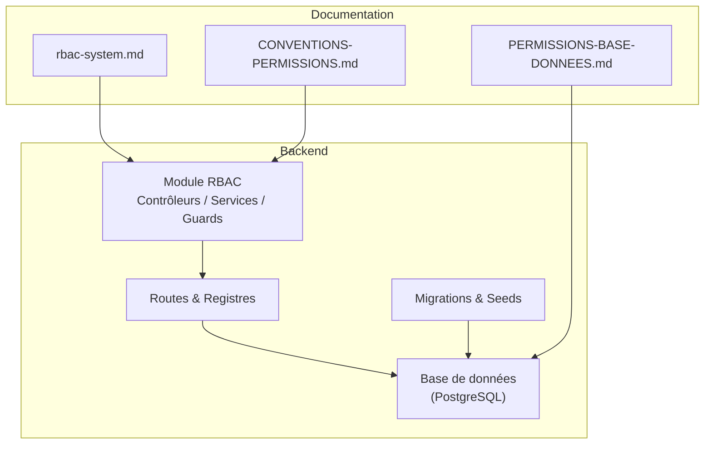
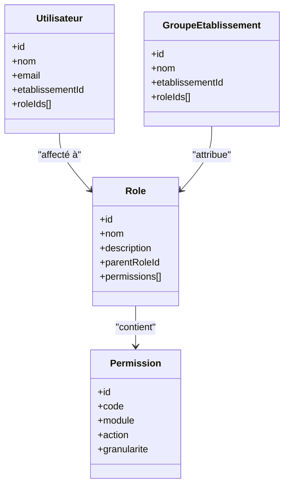
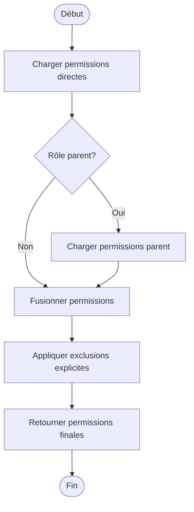
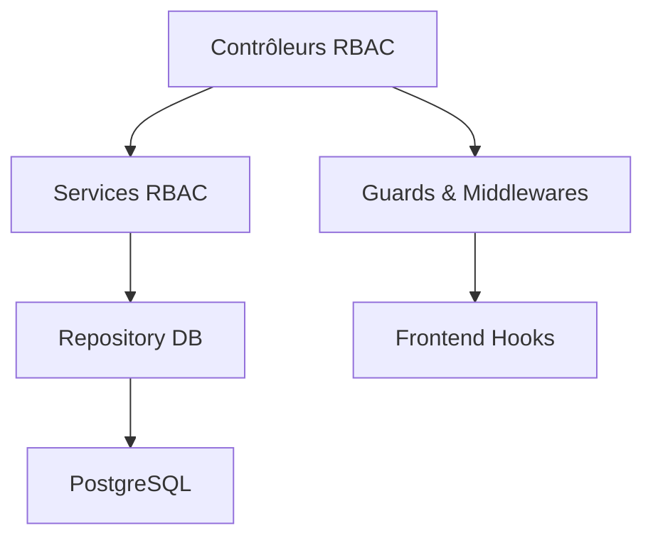

# API RBAC - Rôles et Permissions

<cite>
**Fichiers référencés dans ce document**
- [rbac-system.md](file://docs/rbac-system.md)
- [CONVENTIONS-PERMISSIONS.md](file://docs/CONVENTIONS-PERMISSIONS.md)
- [PERMISSIONS-BASE-DONNEES.md](file://docs/PERMISSIONS-BASE-DONNEES.md)
- [EXEMPLE-INTEGRATION-PERMISSIONS.ts](file://docs/EXEMPLE-INTEGRATION-PERMISSIONS.ts)
- [guards-exemples-implémentation.ts](file://docs/guards-exemples-implémentation.ts)
- [migrate-rbac-v3.sql](file://backend/database/migrations/migrate-rbac-v3.sql)
- [043-permissions-critiques-manquantes.sql](file://backend/database/migrations/043-permissions-critiques-manquantes.sql)
- [070-fix-super-admin-all-permission.sql](file://backend/database/migrations/070-fix-super-admin-all-permission.sql)
- [076-permissions-groupes-etablissements.sql](file://backend/database/migrations/076-permissions-groupes-etablissements.sql)
- [079-add-roleId-utilisateur-etablissements.sql](file://backend/database/migrations/079-add-roleId-utilisateur-etablissements.sql)
- [085-periode-etablissement-id.sql](file://backend/database/migrations/085-periode-etablissement-id.sql)
- [125-organigramme-read-tous-roles.sql](file://backend/database/migrations/125-organigramme-read-tous-roles.sql)
- [RAPPORT-FINAL-RBAC-v3.md](file://docs/rapports/RAPPORT-FINAL-RBAC-v3.md)
- [GUIDE-MONITORING-PERFORMANCE-RBAC.md](file://docs/guides/GUIDE-MONITORING-PERFORMANCE-RBAC.md)
- [CORRECTION-SUPER-ADMIN-ALL-PERMISSION.md](file://docs/corrections/CORRECTION-SUPER-ADMIN-ALL-PERMISSION.md)
- [ANALYSE-PERMISSIONS-SYNTHESE.md](file://docs/analyses/ANALYSE-PERMISSIONS-SYNTHESE.md)
</cite>

## Table des matières
1. [Introduction](#introduction)
2. [Structure du projet](#structure-du-projet)
3. [Composants principaux](#composants-principaux)
4. [Vue d'ensemble de l'architecture](#vue-densemble-de-larchitecture)
5. [Analyse détaillée des composants](#analyse-detallee-des-composants)
6. [Analyse des dépendances](#analyse-des-dependances)
7. [Considérations de performance](#considerations-de-performance)
8. [Guide de dépannage](#guide-de-depannage)
9. [Conclusion](#conclusion)
10. [Annexes](#annexes)

## Introduction
Ce document présente une documentation API complète pour le système RBAC (Role-Based Access Control) d’eLISAschool. Il couvre la gestion des rôles, des permissions et leur attribution aux utilisateurs, ainsi que la hiérarchie des permissions, les permissions granulaires par module et le mécanisme de vérification des droits. Des exemples de requêtes, des schémas de données et des réponses avec permissions calculées sont fournis pour faciliter l’intégration et le débogage.

## Structure du projet
Le système RBAC est implémenté au sein du backend eLISAschool, avec:
- Un module dédié rbac contenant contrôleurs, services et guards
- Des migrations SQL pour la structure de données et les seeds
- Une documentation technique décrivant les conventions, le modèle de données et les bonnes pratiques
- Des scripts et rapports de validation et de correction

[Ce diagramme est conceptuel et ne mape pas directement des fichiers spécifiques]

## Composants principaux
- Gestion des rôles: création, lecture, mise à jour, suppression; hiérarchie et héritage
- Gestion des permissions: définitions, regroupement par module, granularité fine
- Attribution des permissions: rôle → permission, utilisateur → rôle, groupe → rôle
- Vérification des droits: guards, middlewares, hooks frontend/backend
- Monitoring et audit: traçabilité des accès et performances

**Section sources**
- [rbac-system.md](file://docs/rbac-system.md)
- [CONVENTIONS-PERMISSIONS.md](file://docs/CONVENTIONS-PERMISSIONS.md)
- [PERMISSIONS-BASE-DONNEES.md](file://docs/PERMISSIONS-BASE-DONNEES.md)

## Vue d'ensemble de l'architecture
Le RBAC suit un modèle classique:
- Utilisateurs possèdent un ou plusieurs rôles
- Rôles possèdent des permissions
- Permissions sont structurées par modules et peuvent être hiérarchisées
- Les vérifications se font via guards et middlewares qui évaluent les permissions calculées

**Diagram sources**
- [PERMISSIONS-BASE-DONNEES.md](file://docs/PERMISSIONS-BASE-DONNEES.md)
- [migrate-rbac-v3.sql](file://backend/database/migrations/migrate-rbac-v3.sql)

**Section sources**
- [PERMISSIONS-BASE-DONNEES.md](file://docs/PERMISSIONS-BASE-DONNEES.md)
- [migrate-rbac-v3.sql](file://backend/database/migrations/migrate-rbac-v3.sql)

## Analyse détaillée des composants

### Endpoints CRUD des Rôles
- POST /api/roles: créer un rôle
- GET /api/roles: lister les rôles (filtrable par établissement, parent)
- GET /api/roles/:id: obtenir un rôle
- PUT /api/roles/:id: mettre à jour un rôle
- DELETE /api/roles/:id: supprimer un rôle
- POST /api/roles/:id/permissions: attribuer des permissions à un rôle
- GET /api/roles/:id/permissions: lister les permissions d’un rôle

Exemple de requête pour créer un rôle personnalisé:
- Méthode: POST
- URL: /api/roles
- Corps: { nom, description, parentRoleId?, etablissementId? }
- Réponse: { id, nom, description, parentRoleId, createdAt, updatedAt }

Hiérarchie des rôles:
- Un rôle peut avoir un parent (héritage)
- L’héritage permet de cumuler les permissions du parent

**Section sources**
- [rbac-system.md](file://docs/rbac-system.md)
- [125-organigramme-read-tous-roles.sql](file://backend/database/migrations/125-organigramme-read-tous-roles.sql)

### Endpoints CRUD des Permissions
- POST /api/permissions: créer une permission
- GET /api/permissions: lister les permissions (filtrable par module, action)
- GET /api/permissions/:id: obtenir une permission
- PUT /api/permissions/:id: mettre à jour une permission
- DELETE /api/permissions/:id: supprimer une permission

Granularité par module:
- Chaque permission appartient à un module (ex: finances, personnel, RH)
- Actions possibles: create, read, update, delete, export, approve, etc.
- Granularité fine: niveau, classe, période, section, etc.

Exemple de requête pour créer une permission:
- Méthode: POST
- URL: /api/permissions
- Corps: { code, module, action, granularite }
- Réponse: { id, code, module, action, granularite, createdAt, updatedAt }

**Section sources**
- [CONVENTIONS-PERMISSIONS.md](file://docs/CONVENTIONS-PERMISSIONS.md)
- [PERMISSIONS-BASE-DONNEES.md](file://docs/PERMISSIONS-BASE-DONNEES.md)

### Attribution des Permissions aux Rôles et Utilisateurs
- POST /api/roles/:roleId/permissions: ajouter des permissions à un rôle
- POST /api/users/:userId/roles: attribuer un rôle à un utilisateur
- GET /api/users/:userId/permissions: obtenir les permissions calculées d’un utilisateur

Exemple d’attribution:
- Méthode: POST
- URL: /api/roles/:roleId/permissions
- Corps: { permissionIds: [id1, id2] }
- Réponse: { roleId, permissionIds }

Vérification des droits:
- Guard middleware: requirePermission(code)
- Hook frontend: usePermissions() retourne les permissions calculées

**Section sources**
- [rbac-system.md](file://docs/rbac-system.md)
- [EXEMPLE-INTEGRATION-PERMISSIONS.ts](file://docs/EXEMPLE-INTEGRATION-PERMISSIONS.ts)
- [guards-exemples-implémentation.ts](file://docs/guards-exemples-implémentation.ts)

### Hiérarchie des Permissions et Héritage
- Les rôles peuvent hériter des permissions de leur parent
- L’héritage est résolu lors du calcul des permissions finales
- Conflits: une permission explicitement retirée l’emporte sur l’héritage

Algorithme de calcul:
1. Charger les permissions directes du rôle
2. Charger récursivement les permissions du parent
3. Fusionner en appliquant les exclusions explicites
4. Retourner l’ensemble final

**Diagram sources**
- [rbac-system.md](file://docs/rbac-system.md)

**Section sources**
- [rbac-system.md](file://docs/rbac-system.md)

### Schémas de Données
Tables principales:
- roles: id, nom, description, parentRoleId, etablissementId, createdAt, updatedAt
- permissions: id, code, module, action, granularite, createdAt, updatedAt
- role_permissions: roleId, permissionId
- users: id, nom, email, etablissementId, createdAt, updatedAt
- user_roles: userId, roleId
- groupes_etablissements: id, nom, etablissementId, createdAt, updatedAt
- groupe_roles: groupeId, roleId

Relations:
- Un rôle a plusieurs permissions (via role_permissions)
- Un utilisateur a plusieurs rôles (via user_roles)
- Un groupe d’établissement a plusieurs rôles (via groupe_roles)

**Section sources**
- [PERMISSIONS-BASE-DONNEES.md](file://docs/PERMISSIONS-BASE-DONNEES.md)
- [migrate-rbac-v3.sql](file://backend/database/migrations/migrate-rbac-v3.sql)

### Exemples de Requêtes et Réponses

Créer un rôle:
- Requête: POST /api/roles { "nom": "Responsable RH", "description": "Gestion du personnel", "parentRoleId": null }
- Réponse: { "id": 1, "nom": "Responsable RH", "description": "Gestion du personnel", "createdAt": "2024-01-01T00:00:00Z" }

Attribuer des permissions:
- Requête: POST /api/roles/1/permissions { "permissionIds": [10, 11, 12] }
- Réponse: { "roleId": 1, "permissionIds": [10, 11, 12] }

Vérifier les permissions d’un utilisateur:
- Requête: GET /api/users/1/permissions
- Réponse: { "userId": 1, "permissions": ["finances:create", "personnel:read", "rh:update"] }

Gérer les conflits:
- Si une permission est explicitement retirée, elle n’est pas héritée du parent
- La réponse inclut les permissions finales après résolution

**Section sources**
- [EXEMPLE-INTEGRATION-PERMISSIONS.ts](file://docs/EXEMPLE-INTEGRATION-PERMISSIONS.ts)
- [guards-exemples-implémentation.ts](file://docs/guards-exemples-implémentation.ts)

## Analyse des dépendances
Le module RBAC dépend de:
- Base de données PostgreSQL pour la persistance
- Migrations SQL pour la structure et les seeds
- Guards et middlewares pour la vérification des droits
- Frontend hooks pour l’exposition des permissions

**Diagram sources**
- [rbac-system.md](file://docs/rbac-system.md)

**Section sources**
- [rbac-system.md](file://docs/rbac-system.md)

## Considérations de performance
- Indexation des tables roles, permissions, role_permissions pour optimiser les requêtes
- Cache des permissions calculées par utilisateur pour réduire les charges
- Monitoring des temps de réponse et des erreurs
- Audit des accès sensibles

Recommandations:
- Utiliser des vues matérialisées pour les permissions fréquentes
- Limiter la profondeur de l’héritage des rôles
- Mettre en place des quotas de permissions par rôle

**Section sources**
- [GUIDE-MONITORING-PERFORMANCE-RBAC.md](file://docs/guides/GUIDE-MONITORING-PERMISSIONS-RBAC.md)
- [RAPPORT-FINAL-RBAC-v3.md](file://docs/rapports/RAPPORT-FINAL-RBAC-v3.md)

## Guide de dépannage
Problèmes courants:
- Erreur 403 Forbidden: vérifier les permissions attribuées et l’héritage
- Erreur 500 Internal Server Error: vérifier les migrations et les seeds
- Permissions manquantes: exécuter les scripts de correction

Actions correctives:
- Exécuter migrate-rbac-v3.sql pour réinitialiser la structure
- Appliquer 070-fix-super-admin-all-permission.sql pour corriger le super admin
- Vérifier les conflits de permissions avec les outils d’audit

**Section sources**
- [CORRECTION-SUPER-ADMIN-ALL-PERMISSION.md](file://docs/corrections/CORRECTION-SUPER-ADMIN-ALL-PERMISSION.md)
- [ANALYSE-PERMISSIONS-SYNTHESE.md](file://docs/analyses/ANALYSE-PERMISSIONS-SYNTHESE.md)

## Conclusion
Le système RBAC d’eLISAschool offre une gestion robuste des rôles et permissions avec une hiérarchie flexible et une granularité fine par module. Les endpoints CRUD permettent une administration complète, tandis que les guards et middlewares assurent une vérification sécurisée des droits. Le monitoring et l’audit garantissent la fiabilité et la traçabilité des accès.

## Annexes

### Migration et Seeds
- migrate-rbac-v3.sql: migration principale du RBAC v3
- 043-permissions-critiques-manquantes.sql: ajout de permissions critiques
- 070-fix-super-admin-all-permission.sql: correction du super admin
- 076-permissions-groupes-etablissements.sql: permissions par groupe
- 079-add-roleId-utilisateur-etablissements.sql: rôle par établissement
- 085-periode-etablissement-id.sql: contexte par période
- 125-organigramme-read-tous-roles.sql: lecture de tous les rôles

**Section sources**
- [migrate-rbac-v3.sql](file://backend/database/migrations/migrate-rbac-v3.sql)
- [043-permissions-critiques-manquantes.sql](file://backend/database/migrations/043-permissions-critiques-manquantes.sql)
- [070-fix-super-admin-all-permission.sql](file://backend/database/migrations/070-fix-super-admin-all-permission.sql)
- [076-permissions-groupes-etablissements.sql](file://backend/database/migrations/076-permissions-groupes-etablissements.sql)
- [079-add-roleId-utilisateur-etablissements.sql](file://backend/database/migrations/079-add-roleId-utilisateur-etablissements.sql)
- [085-periode-etablissement-id.sql](file://backend/database/migrations/085-periode-etablissement-id.sql)
- [125-organigramme-read-tous-roles.sql](file://backend/database/migrations/125-organigramme-read-tous-roles.sql)