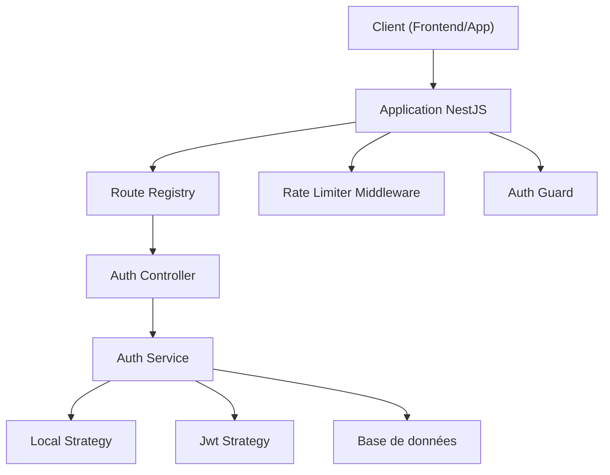
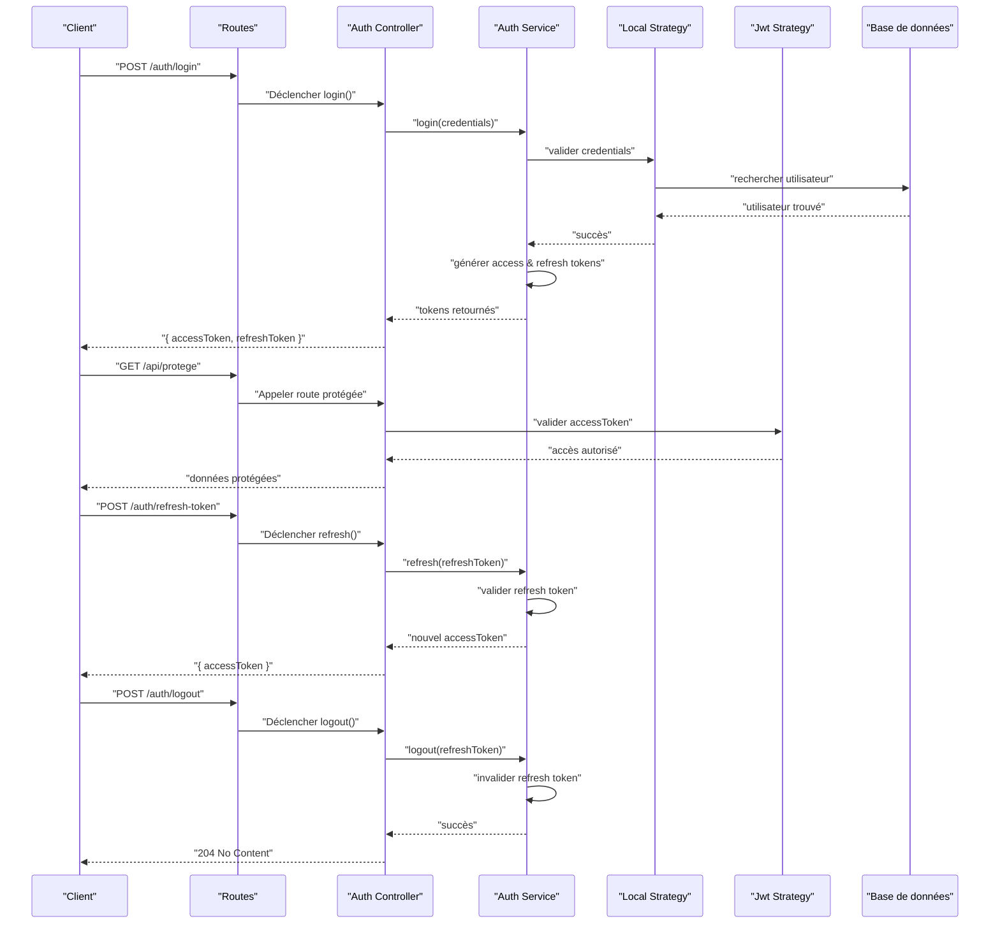
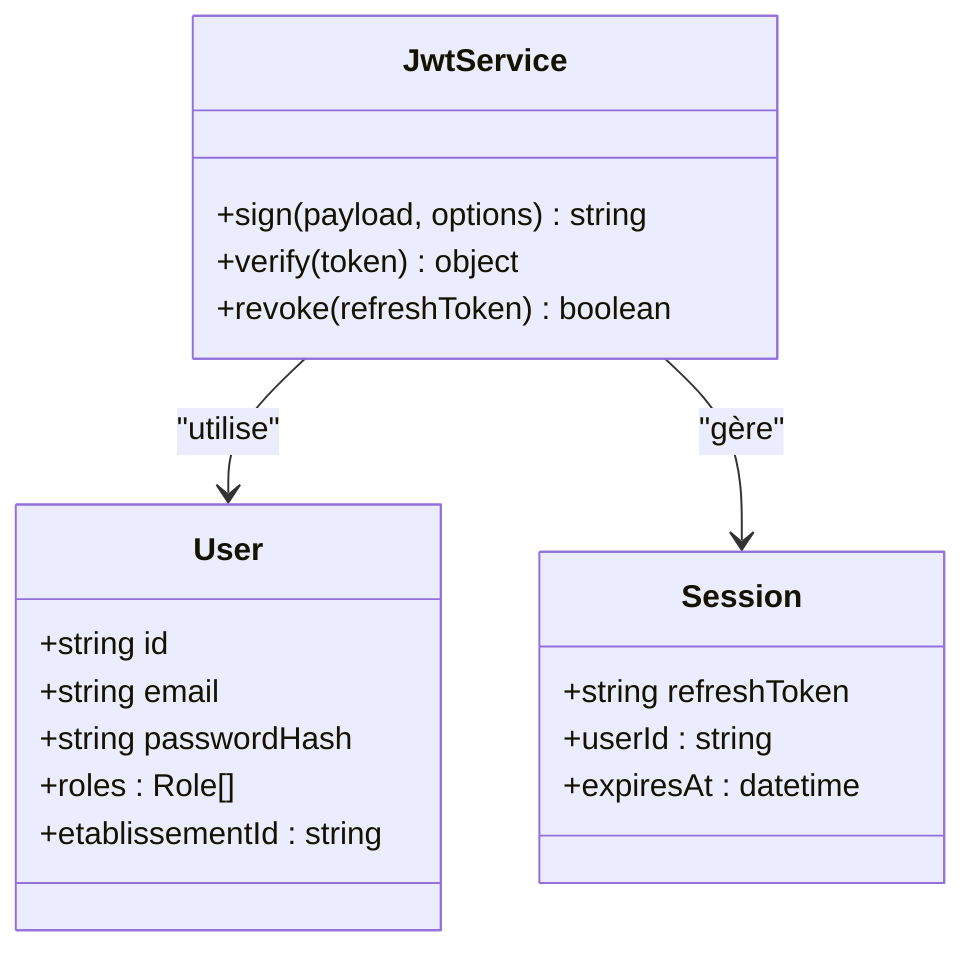
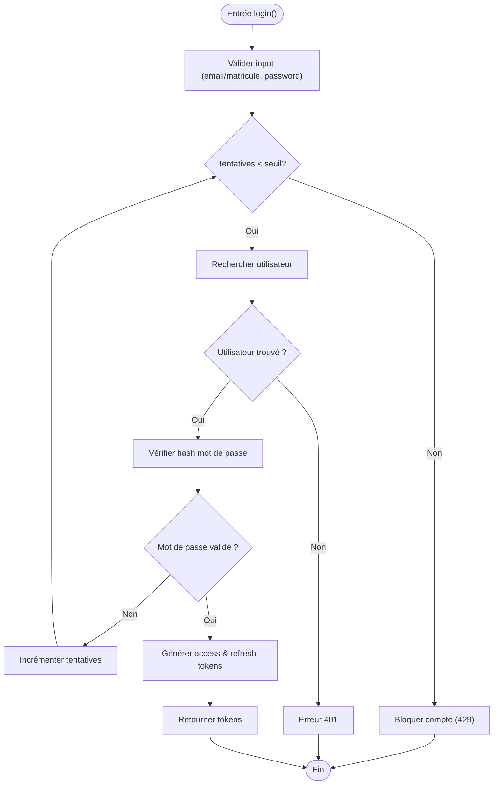
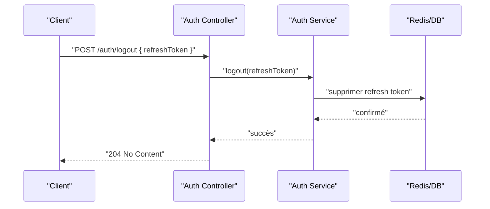
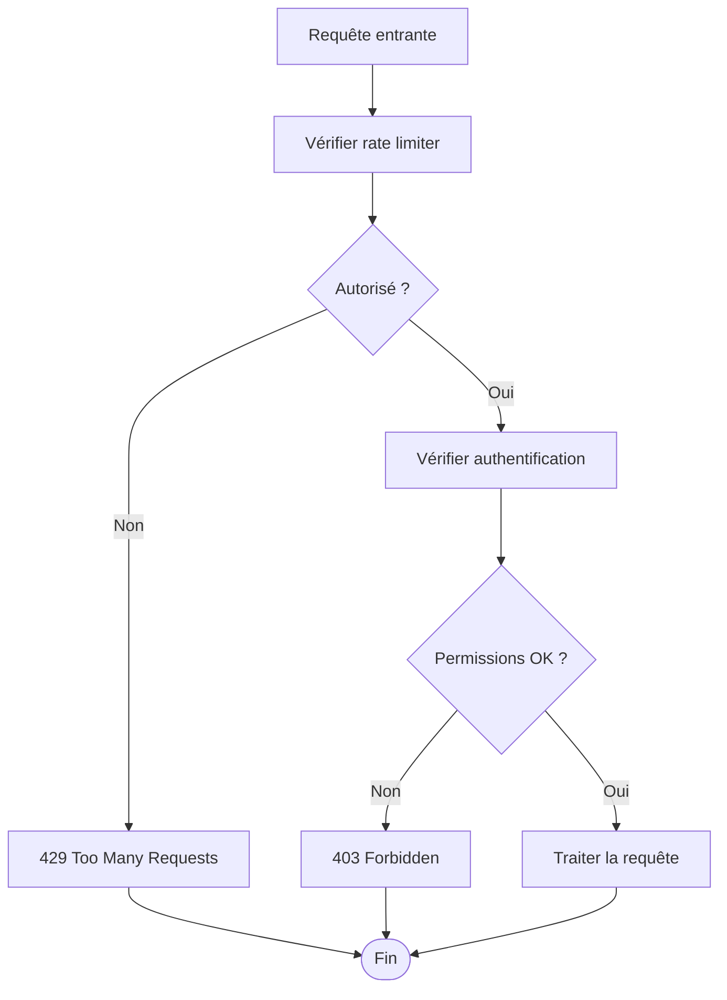
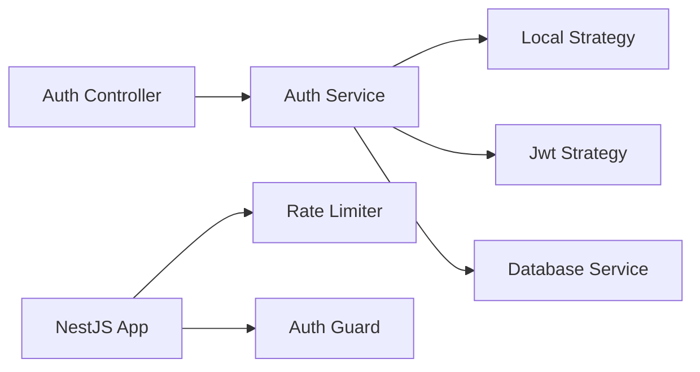

# API Utilisateurs et Authentification

<cite>
**Fichiers référencés dans ce document**
- [auth.controller.ts](file://backend/src/modules/auth/controllers/auth.controller.ts)
- [auth.service.ts](file://backend/src/modules/auth/services/auth.service.ts)
- [jwt.strategy.ts](file://backend/src/modules/auth/strategies/jwt.strategy.ts)
- [local.strategy.ts](file://backend/src/modules/auth/strategies/local.strategy.ts)
- [rate-limiter.middleware.ts](file://backend/src/common/middlewares/rate-limiter.middleware.ts)
- [auth.guard.ts](file://backend/src/modules/auth/guards/auth.guard.ts)
- [env.config.ts](file://backend/src/config/env.config.ts)
- [database.config.ts](file://backend/src/config/database.config.ts)
- [route-registry.ts](file://backend/src/routes/route-registry.ts)
- [app.ts](file://backend/src/app.ts)
- [027-auth-multi-mode.sql](file://backend/database/migrations/027-auth-multi-mode.sql)
- [GUIDE-AUTHENTIFICATION.md](file://docs/guides/GUIDE-AUTHENTIFICATION.md)
- [SECURE-LOGOUT-IMPLEMENTATION.md](file://docs/autres/SECURE-LOGOUT-IMPLEMENTATION.md)
- [SYSTEME-BLOCAGE-AUTH-DEUX-NIVEAUX.md](file://docs/SYSTEME-BLOCAGE-AUTH-DEUX-NIVEAUX.md)
</cite>

## Table des matières
1. [Introduction](#introduction)
2. [Structure du projet](#structure-du-projet)
3. [Composants clés](#composants-clés)
4. [Vue d'ensemble de l'architecture](#vue-densemble-de-larchitecture)
5. [Analyse détaillée des composants](#analyse-detallee-des-composants)
6. [Analyse des dépendances](#analyse-des-dependances)
7. [Considérations de performance](#considerations-de-performance)
8. [Guide de dépannage](#guide-de-depannage)
9. [Conclusion](#conclusion)
10. [Annexes](#annexes)

## Introduction
Ce document présente une documentation API complète pour les endpoints d’authentification : POST /auth/login, POST /auth/register, POST /auth/refresh-token, POST /auth/logout. Il explique le mécanisme JWT (access token, refresh token), la validation des identifiants, le hashage des mots de passe, la gestion des sessions, ainsi que les stratégies de sécurité telles que le rate limiting et le blocage après échecs multiples. Des exemples concrets de requêtes HTTP avec headers Authorization et la gestion des erreurs (401, 403, 429) sont inclus.

## Structure du projet
Le module d’authentification est organisé en couches claires : contrôleurs (routes), services (logique métier), stratégies (validation locale et JWT), garde-fous (protection des routes), middlewares (rate limiting), configuration (JWT, DB) et migrations (schéma utilisateur). Les routes sont enregistrées via un registre centralisé.

**Sources des diagrammes**
- [route-registry.ts](file://backend/src/routes/route-registry.ts)
- [auth.controller.ts](file://backend/src/modules/auth/controllers/auth.controller.ts)
- [auth.service.ts](file://backend/src/modules/auth/services/auth.service.ts)
- [local.strategy.ts](file://backend/src/modules/auth/strategies/local.strategy.ts)
- [jwt.strategy.ts](file://backend/src/modules/auth/strategies/jwt.strategy.ts)
- [rate-limiter.middleware.ts](file://backend/src/common/middlewares/rate-limiter.middleware.ts)
- [auth.guard.ts](file://backend/src/modules/auth/guards/auth.guard.ts)

**Sources de section**
- [app.ts](file://backend/src/app.ts)
- [route-registry.ts](file://backend/src/routes/route-registry.ts)

## Composants clés
- Contrôleurs : exposent les endpoints /auth/* et orchestrent les appels aux services.
- Services : implémentent la logique d’authentification, génération/validation de tokens, vérification des mots de passe, gestion des tentatives et blocages.
- Stratégies : 
  - LocalStrategy valide les credentials (email/matricule + mot de passe).
  - JwtStrategy valide les access tokens JWT.
- Middlewares : rate limiter protège contre les attaques par force brute.
- Guards : auth guard protège les routes nécessitant une authentification.
- Configuration : env.config.ts définit les secrets JWT, durées de vie, et paramètres de base de données.
- Migrations : schéma utilisateur et tables associées incluent les champs nécessaires à l’authentification multi-mode.

**Sources de section**
- [auth.controller.ts](file://backend/src/modules/auth/controllers/auth.controller.ts)
- [auth.service.ts](file://backend/src/modules/auth/services/auth.service.ts)
- [local.strategy.ts](file://backend/src/modules/auth/strategies/local.strategy.ts)
- [jwt.strategy.ts](file://backend/src/modules/auth/strategies/jwt.strategy.ts)
- [rate-limiter.middleware.ts](file://backend/src/common/middlewares/rate-limiter.middleware.ts)
- [auth.guard.ts](file://backend/src/modules/auth/guards/auth.guard.ts)
- [env.config.ts](file://backend/src/config/env.config.ts)
- [database.config.ts](file://backend/src/config/database.config.ts)
- [027-auth-multi-mode.sql](file://backend/database/migrations/027-auth-multi-mode.sql)

## Vue d'ensemble de l'architecture
Le flux d’authentification suit un modèle standard :
- Le client envoie ses identifiants au endpoint /auth/login.
- La stratégie locale vérifie les credentials et le hash du mot de passe.
- Le service génère un access token (court terme) et un refresh token (long terme).
- Le client stocke l’access token dans le header Authorization pour les requêtes protégées.
- À expiration, le client utilise /auth/refresh-token avec le refresh token pour obtenir un nouvel access token.
- /auth/logout invalide la session ou le refresh token selon la stratégie de sécurité.

**Sources des diagrammes**
- [auth.controller.ts](file://backend/src/modules/auth/controllers/auth.controller.ts)
- [auth.service.ts](file://backend/src/modules/auth/services/auth.service.ts)
- [local.strategy.ts](file://backend/src/modules/auth/strategies/local.strategy.ts)
- [jwt.strategy.ts](file://backend/src/modules/auth/strategies/jwt.strategy.ts)

## Analyse détaillée des composants

### Endpoints d’authentification
- POST /auth/login
  - Requête : corps contenant email/matricule et mot de passe.
  - Réponse : { accessToken, refreshToken }.
  - Erreurs : 401 si identifiants invalides ; 429 si trop de tentatives.
- POST /auth/register
  - Requête : corps contenant nom, email/matricule, mot de passe, rôle, établissementId (si applicable).
  - Réponse : { message: "Utilisateur créé", userId }.
  - Erreurs : 400 si données invalides ; 409 si email déjà utilisé.
- POST /auth/refresh-token
  - Requête : corps contenant refreshToken.
  - Réponse : { accessToken }.
  - Erreurs : 401 si refreshToken invalide ou expiré.
- POST /auth/logout
  - Requête : corps contenant refreshToken (optionnel selon implémentation).
  - Réponse : 204 No Content.
  - Erreurs : 401 si refreshToken manquant ou invalide.

Exemple de requête HTTP (connexion) :
- Méthode : POST
- URL : /auth/login
- Headers : Content-Type: application/json
- Corps : { "identifiant": "user@example.com", "password": "secret" }
- Réponse : { "accessToken": "...", "refreshToken": "..." }

Exemple de requête HTTP (accès protégé) :
- Méthode : GET
- URL : /api/protege
- Headers : Authorization: Bearer <accessToken>
- Réponse : { "data": "..." }

Gestion des erreurs courantes :
- 401 Unauthorized : identifiants invalides, token expiré ou manquant.
- 403 Forbidden : permissions insuffisantes.
- 429 Too Many Requests : dépassement du rate limiter.

**Sources de section**
- [auth.controller.ts](file://backend/src/modules/auth/controllers/auth.controller.ts)
- [auth.service.ts](file://backend/src/modules/auth/services/auth.service.ts)
- [GUIDE-AUTHENTIFICATION.md](file://docs/guides/GUIDE-AUTHENTIFICATION.md)

### Mécanisme JWT
- Access Token : court terme, signé avec secret JWT, contient claims utilisateur et permissions.
- Refresh Token : long terme, stocké côté serveur (Redis ou DB), lié à l’utilisateur et révoqué lors du logout.
- Validation : JwtStrategy extrait le token du header Authorization, vérifie signature et expiration.

**Sources des diagrammes**
- [jwt.strategy.ts](file://backend/src/modules/auth/strategies/jwt.strategy.ts)
- [auth.service.ts](file://backend/src/modules/auth/services/auth.service.ts)

**Sources de section**
- [jwt.strategy.ts](file://backend/src/modules/auth/strategies/jwt.strategy.ts)
- [env.config.ts](file://backend/src/config/env.config.ts)

### Validation des credentials et hashage
- LocalStrategy compare le mot de passe fourni avec le hash stocké (bcrypt ou similaire).
- Support multi-mode : email ou matricule comme identifiant unique.
- Tentatives échouées : compteur incrémenté, blocage temporaire après seuil.

**Sources des diagrammes**
- [local.strategy.ts](file://backend/src/modules/auth/strategies/local.strategy.ts)
- [auth.service.ts](file://backend/src/modules/auth/services/auth.service.ts)

**Sources de section**
- [local.strategy.ts](file://backend/src/modules/auth/strategies/local.strategy.ts)
- [auth.service.ts](file://backend/src/modules/auth/services/auth.service.ts)

### Gestion des sessions et logout
- Refresh token stocké côté serveur, lié à l’utilisateur et révoqué lors du logout.
- Logout invalide le refresh token, empêchant toute nouvelle génération d’access token.
- Sécurité : révocation immédiate, pas de persistance longue durée.

**Sources des diagrammes**
- [auth.controller.ts](file://backend/src/modules/auth/controllers/auth.controller.ts)
- [auth.service.ts](file://backend/src/modules/auth/services/auth.service.ts)
- [SECURE-LOGOUT-IMPLEMENTATION.md](file://docs/autres/SECURE-LOGOUT-IMPLEMENTATION.md)

**Sources de section**
- [SECURE-LOGOUT-IMPLEMENTATION.md](file://docs/autres/SECURE-LOGOUT-IMPLEMENTATION.md)

### Stratégies de sécurité
- Rate Limiting : limite les requêtes par IP/utilisateur sur /auth/login et /auth/register.
- Blocage après échecs multiples : verrouillage temporaire du compte après N tentatives invalides.
- Permissions : accès basé sur rôles et permissions (RBAC) pour les routes protégées.

**Sources des diagrammes**
- [rate-limiter.middleware.ts](file://backend/src/common/middlewares/rate-limiter.middleware.ts)
- [auth.guard.ts](file://backend/src/modules/auth/guards/auth.guard.ts)
- [SYSTEME-BLOCAGE-AUTH-DEUX-NIVEAUX.md](file://docs/SYSTEME-BLOCAGE-AUTH-DEUX-NIVEAUX.md)

**Sources de section**
- [rate-limiter.middleware.ts](file://backend/src/common/middlewares/rate-limiter.middleware.ts)
- [auth.guard.ts](file://backend/src/modules/auth/guards/auth.guard.ts)
- [SYSTEME-BLOCAGE-AUTH-DEUX-NIVEAUX.md](file://docs/SYSTEME-BLOCAGE-AUTH-DEUX-NIVEAUX.md)

## Analyse des dépendances
Les composants interagissent de manière découplée grâce à l’injection de dépendances de NestJS :
- AuthController dépend de AuthService.
- AuthService dépend de LocalStrategy, JwtStrategy, et des services de base de données.
- RateLimiter middleware s’applique globalement ou sur les routes d’authentification.
- AuthGuard protège les routes sensibles.

**Sources des diagrammes**
- [auth.controller.ts](file://backend/src/modules/auth/controllers/auth.controller.ts)
- [auth.service.ts](file://backend/src/modules/auth/services/auth.service.ts)
- [local.strategy.ts](file://backend/src/modules/auth/strategies/local.strategy.ts)
- [jwt.strategy.ts](file://backend/src/modules/auth/strategies/jwt.strategy.ts)
- [rate-limiter.middleware.ts](file://backend/src/common/middlewares/rate-limiter.middleware.ts)
- [auth.guard.ts](file://backend/src/modules/auth/guards/auth.guard.ts)

**Sources de section**
- [auth.controller.ts](file://backend/src/modules/auth/controllers/auth.controller.ts)
- [auth.service.ts](file://backend/src/modules/auth/services/auth.service.ts)

## Considérations de performance
- Tokens courts pour l’access token réduisent la charge de validation.
- Refresh token stocké en cache (Redis) pour une révocation rapide.
- Rate limiter basé sur Redis pour une mise à jour en temps réel.
- Indexation des utilisateurs par email/matricule pour accélérer les recherches.

[Pas de sources nécessaires car cette section fournit des conseils généraux]

## Guide de dépannage
- Erreur 401 : vérifier le format du header Authorization, la validité du token, et les identifiants.
- Erreur 403 : vérifier les permissions RBAC de l’utilisateur.
- Erreur 429 : attendre le délai de rate limiter ou augmenter le seuil si nécessaire.
- Problèmes de connexion : vérifier les logs de la base de données et la configuration JWT.

**Sources de section**
- [GUIDE-AUTHENTIFICATION.md](file://docs/guides/GUIDE-AUTHENTIFICATION.md)
- [SYSTEME-BLOCAGE-AUTH-DEUX-NIVEAUX.md](file://docs/SYSTEME-BLOCAGE-AUTH-DEUX-NIVEAUX.md)

## Conclusion
L’API d’authentification offre une sécurité robuste avec JWT, rate limiting, et blocage après échecs multiples. Les endpoints sont bien structurés et faciles à intégrer. Pour une utilisation optimale, respectez les formats de requête et gérez correctement les tokens.

[Pas de sources nécessaires car cette section résume sans analyser de fichiers spécifiques]

## Annexes
- Exemples complets de requêtes et réponses disponibles dans les guides d’intégration.
- Configuration JWT et base de données dans env.config.ts et database.config.ts.
- Migration utilisateur dans 027-auth-multi-mode.sql.

**Sources de section**
- [env.config.ts](file://backend/src/config/env.config.ts)
- [database.config.ts](file://backend/src/config/database.config.ts)
- [027-auth-multi-mode.sql](file://backend/database/migrations/027-auth-multi-mode.sql)